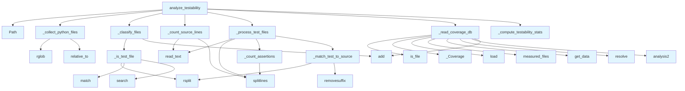

# File: `src/local_deepwiki/generators/analysis/testability.py`

## File Overview

This module provides functionality for analyzing the **testability** of a Python codebase by computing metrics such as the test-to-code ratio, assertion density, and identification of untested source files.

The core purpose of this file is to perform **static analysis** on a repository's Python files, without using any language models or external APIs. It leverages file naming conventions and, optionally, coverage data from `pytest --cov` to determine how well the codebase is tested.

The design rationale centers on using **heuristic matching** for associating test files with source files and **line coverage analysis** to determine which source files are actually tested. This allows for a lightweight yet meaningful assessment of test quality.

## Key Concepts

### 1. **Test File Identification**
The function `_is_test_file` uses regular expressions and directory path matching to identify files that are likely test files. It supports common naming patterns like `test_*.py`, `*_test.py`, `*_spec.py`, and paths containing `/tests/`, `/test/`, or `/__tests__/`.

**Why this approach?**
This is a pragmatic and widely used heuristic for identifying test files in Python projects. It avoids complex parsing or runtime inspection, making it fast and reliable for static analysis.

### 2. **Test-to-Source Matching**
The function `_match_test_to_source` attempts to map a test file to its corresponding source file using heuristics such as removing prefixes like `test_` or suffixes like `_test` and `_spec`.

**Why this approach?**
This mapping enables computing how many source files are covered by tests, which is a key metric in testability analysis. It's not perfect, but it's sufficient for many use cases and avoids complex dependency resolution.

### 3. **Assertion Counting**
The function `_count_assertions` counts assertion statements in test files by looking for lines that contain:
- `assert` (Python's built-in keyword)
- `.assert` (e.g., `self.assertEqual`)
- `self.assert` (unittest-style methods)

**Why this approach?**
It gives a basic measure of test richness — more assertions imply more thorough tests. This is a simple but effective proxy for test depth.

### 4. **Coverage Data Integration**
The function `_read_coverage_db` reads a `.coverage` SQLite database (from `pytest --cov`) to compute actual line coverage per file. If coverage data is unavailable, it falls back to filename-based matching.

**Why this approach?**
Using real coverage data is more accurate than heuristics, but it requires external tools. This fallback ensures that the analysis still provides useful insights even in environments where coverage is not available.

### 5. **Testability Statistics**
The function `_compute_testability_stats` aggregates the results into a structured set of metrics, including:
- Total source and test files
- Test-to-code ratio
- Uncovered file count and percentage
- Average assertions per test file

**Why this approach?**
This provides a comprehensive summary of testability that can be used for reporting, dashboarding, or further analysis.

## Integration

This file is part of the `local_deepwiki` project's analysis pipeline, specifically for generating **testability metrics**. It is called by:
- `test_testability` (likely a test module or CLI command)
- Other internal modules that require static analysis of codebase test quality

The module imports:
- `re` for pattern matching
- `Path` for filesystem operations
- `Any` for type hints
- [`get_logger`](../../logging.md) for logging
- `_Coverage` from the `coverage` package for reading coverage data

It is closely related to:
- `src/local_deepwiki/generators/analysis/coverage.py` (for coverage analysis)
- `src/local_deepwiki/generators/analysis/architecture_report.py` (for broader architectural metrics)
- `src/local_deepwiki/cli/init_cli.py` (likely for CLI integration)

## Design Notes

### Trade-offs
- **Heuristic-based matching** for test-to-source mapping is fast but not 100% accurate. It's suitable for static analysis but not for runtime code introspection.
- **Fallback to filename matching** when coverage data is missing ensures that the module remains functional even without external tools.

### Edge Cases Handled
- **Hidden or ignored directories** (e.g., `.git`, `node_modules`, `__pycache__`) are skipped during file collection.
- **Missing or corrupted coverage databases** are gracefully handled by returning `None`.
- **OSError** during file reading is caught and ignored to avoid breaking the entire analysis.
- **Zero-length source files or coverage data** are handled with appropriate fallbacks.

### Non-Obvious Choices
- **Line counting** is used instead of character or token counting, as it's a simpler and more reliable proxy for code size.
- **Assertion counting** is limited to basic patterns, avoiding complex AST parsing. This keeps the module lightweight.
- The **coverage threshold** (`_UNTESTED_THRESHOLD`) is hardcoded, which may need to be configurable in the future for different project needs.

### Implementation Details
- All functions are designed to be **pure or minimally stateful**, making them easy to test and reason about.
- The module avoids complex dependency graphs or runtime introspection to keep performance and correctness predictable.
- The `analyze_testability` function serves as the main entry point, orchestrating the flow from file collection to final statistics.

This module is a **core component** of the repository's static analysis capabilities, focusing on **measurable, reproducible metrics** rather than subjective or qualitative assessments.

## API Reference

### Functions

#### `analyze_testability`

```python
def analyze_testability(repo_path: Path | str, coverage_path: Path | None = None, exclude_patterns: list[str] | None = None) -> dict[str, Any]
```

Analyze testability metrics for a repository.  Walks all Python files, classifies them as test or source, computes test-to-code ratio, matches test files to source, counts assertions, and identifies untested modules.  When a ``.coverage`` database is available (from ``pytest --cov``), uses actual line-coverage data to determine which files are tested. Falls back to filename-heuristic matching otherwise.


| Parameter | Type | Default | Description |
|-----------|------|---------|-------------|
| `repo_path` | `Path | str` | - | Repository root directory. |
| `coverage_path` | `Path | None` | `None` | Explicit path to ``.coverage`` database. Auto-discovers ``<repo_path>/.coverage`` when ``None``. |
| `exclude_patterns` | `list[str] | None` | `None` | Optional glob patterns to exclude. |

**Returns:** `dict[str, Any]`


<details>
<summary>View Source (lines 302-369) | <a href="https://github.com/UrbanDiver/local-deepwiki-mcp/blob/main/src/local_deepwiki/generators/analysis/testability.py#L302-L369">GitHub</a></summary>

```python
def analyze_testability(
    repo_path: Path | str,
    *,
    coverage_path: Path | None = None,
    exclude_patterns: list[str] | None = None,
) -> dict[str, Any]:
    """Analyze testability metrics for a repository.

    Walks all Python files, classifies them as test or source, computes
    test-to-code ratio, matches test files to source, counts assertions,
    and identifies untested modules.

    When a ``.coverage`` database is available (from ``pytest --cov``),
    uses actual line-coverage data to determine which files are tested.
    Falls back to filename-heuristic matching otherwise.

    Args:
        repo_path: Repository root directory.
        coverage_path: Explicit path to ``.coverage`` database. Auto-discovers
            ``<repo_path>/.coverage`` when ``None``.
        exclude_patterns: Optional glob patterns to exclude.

    Returns:
        Dict with status, test_files, untested_files, and stats.
    """
    repo_path = Path(repo_path)

    source_files_set: set[str] = set()
    all_py = _collect_python_files(repo_path)
    test_paths, source_paths = _classify_files(all_py, source_files_set)
    source_lines = _count_source_lines(source_paths)
    test_files, test_lines, total_assertions = _process_test_files(
        test_paths, source_files_set
    )

    # Try to read real coverage data
    cov_path = coverage_path or (repo_path / ".coverage")
    cov_result = _read_coverage_db(cov_path, repo_path, source_files_set)
    covered_files = cov_result[0] if cov_result else None
    avg_coverage_pct = cov_result[1] if cov_result else None

    untested_files, stats = _compute_testability_stats(
        source_paths,
        test_paths,
        test_files,
        source_lines,
        test_lines,
        total_assertions,
        source_files_set,
        covered_files=covered_files,
        avg_coverage_pct=avg_coverage_pct,
    )

    logger.info(
        "Testability: %d test files, %d source files, ratio=%.2f, source=%s in %s",
        len(test_paths),
        len(source_paths),
        stats["test_to_code_ratio"],
        stats.get("coverage_source", "unknown"),
        repo_path,
    )

    return {
        "status": "success",
        "test_files": test_files,
        "untested_files": untested_files,
        "stats": stats,
    }
```

</details>

## Call Graph



## Used By

Functions and methods in this file and their callers:

- **`Path`**: called by `analyze_testability`
- **`_Coverage`**: called by `_read_coverage_db`
- **`_classify_files`**: called by `analyze_testability`
- **`_collect_python_files`**: called by `analyze_testability`
- **`_compute_testability_stats`**: called by `analyze_testability`
- **`_count_assertions`**: called by `_process_test_files`
- **`_count_source_lines`**: called by `analyze_testability`
- **`_is_test_file`**: called by `_classify_files`
- **`_match_test_to_source`**: called by `_process_test_files`
- **`_process_test_files`**: called by `analyze_testability`
- **`_read_coverage_db`**: called by `analyze_testability`
- **`add`**: called by `_classify_files`, `_read_coverage_db`
- **`analysis2`**: called by `_read_coverage_db`
- **`get_data`**: called by `_read_coverage_db`
- **`is_file`**: called by `_read_coverage_db`
- **`load`**: called by `_read_coverage_db`
- **`match`**: called by `_is_test_file`
- **`measured_files`**: called by `_read_coverage_db`
- **`read_text`**: called by `_count_source_lines`, `_process_test_files`
- **`relative_to`**: called by `_collect_python_files`
- **`removesuffix`**: called by `_match_test_to_source`
- **`resolve`**: called by `_read_coverage_db`
- **`rglob`**: called by `_collect_python_files`
- **`rsplit`**: called by `_is_test_file`, `_match_test_to_source`
- **`search`**: called by `_is_test_file`
- **`splitlines`**: called by `_count_assertions`, `_count_source_lines`, `_process_test_files`

## Usage Examples

*Examples extracted from test files*

### Example: `testability`

From `test_testability.py::test_is_test_file_test_prefix`:

```python
from local_deepwiki.generators.analysis.testability import _is_test_file

    assert _is_test_file("test_foo.py") is True
```

### Example: `_is_test_file`

From `test_testability.py::test_is_test_file_test_prefix`:

```python
from local_deepwiki.generators.analysis.testability import _is_test_file

    assert _is_test_file("test_foo.py") is True
```

### Example: `_is_test_file`

From `test_testability.py::test_is_test_file_test_suffix`:

```python
from local_deepwiki.generators.analysis.testability import _is_test_file

    assert _is_test_file("foo_test.py") is True
```

### Example: `_count_assertions`

From `test_testability.py::test_count_assertions_assert_keyword`:

```python
from local_deepwiki.generators.analysis.testability import _count_assertions

    content = "assert x == 1\nassert y > 2\n"
    assert _count_assertions(content) == 2
```

### Example: `_count_assertions`

From `test_testability.py::test_count_assertions_assert_paren`:

```python
from local_deepwiki.generators.analysis.testability import _count_assertions

    content = "assert(x == 1)\n"
    assert _count_assertions(content) == 1
```


## Last Modified

| Entity | Type | Author | Date | Commit |
|--------|------|--------|------|--------|
| `_read_coverage_db` | function | Brian Breidenbach | today | `43e9518` fix: use per-file coverage ... |
| `_collect_python_files` | function | Brian Breidenbach | today | `0994907` feat: coverage-aware testab... |
| `_compute_testability_stats` | function | Brian Breidenbach | today | `0994907` feat: coverage-aware testab... |
| `analyze_testability` | function | Brian Breidenbach | today | `0994907` feat: coverage-aware testab... |
| `_classify_files` | function | Brian Breidenbach | today | `a75af5c` refactor: extract helpers f... |
| `_count_source_lines` | function | Brian Breidenbach | today | `a75af5c` refactor: extract helpers f... |
| `_process_test_files` | function | Brian Breidenbach | today | `a75af5c` refactor: extract helpers f... |
| `_is_test_file` | function | Brian Breidenbach | today | `6d8243f` feat: add testability-based... |
| `_match_test_to_source` | function | Brian Breidenbach | today | `6d8243f` feat: add testability-based... |
| `_count_assertions` | function | Brian Breidenbach | today | `6d8243f` feat: add testability-based... |

## Additional Source Code

Source code for functions and methods not listed in the API Reference above.

#### `_is_test_file`

<details>
<summary>View Source (lines 26-37) | <a href="https://github.com/UrbanDiver/local-deepwiki-mcp/blob/main/src/local_deepwiki/generators/analysis/testability.py#L26-L37">GitHub</a></summary>

```python
def _is_test_file(rel_path: str) -> bool:
    """Return True if a relative path looks like a test file.

    Matches filenames like ``test_*.py``, ``*_test.py``, ``*_spec.py``
    or paths containing ``/tests/``, ``/test/``, or ``/__tests__/``.
    """
    filename = rel_path.rsplit("/", 1)[-1] if "/" in rel_path else rel_path
    if _TEST_FILE_RE.match(filename):
        return True
    if _TEST_DIR_RE.search(rel_path):
        return True
    return False
```

</details>


#### `_match_test_to_source`

<details>
<summary>View Source (lines 40-68) | <a href="https://github.com/UrbanDiver/local-deepwiki-mcp/blob/main/src/local_deepwiki/generators/analysis/testability.py#L40-L68">GitHub</a></summary>

```python
def _match_test_to_source(
    test_path: str,
    source_files: set[str],
) -> str | None:
    """Heuristic matching: map a test file to its likely source file.

    Given ``tests/test_foo.py``, look for ``src/**/foo.py`` in *source_files*.
    Tries stripping ``test_`` prefix and ``_test`` / ``_spec`` suffix from the
    filename stem.
    """
    filename = test_path.rsplit("/", 1)[-1] if "/" in test_path else test_path
    stem = filename.removesuffix(".py")

    # Build candidate stems
    candidates: list[str] = []
    if stem.startswith("test_"):
        candidates.append(stem[5:])
    if stem.endswith("_test"):
        candidates.append(stem[:-5])
    if stem.endswith("_spec"):
        candidates.append(stem[:-5])

    for candidate in candidates:
        target = f"{candidate}.py"
        for src in source_files:
            if src.endswith(f"/{target}") or src == target:
                return src

    return None
```

</details>


#### `_count_assertions`

<details>
<summary>View Source (lines 71-86) | <a href="https://github.com/UrbanDiver/local-deepwiki-mcp/blob/main/src/local_deepwiki/generators/analysis/testability.py#L71-L86">GitHub</a></summary>

```python
def _count_assertions(content: str) -> int:
    """Count assertion statements in a file.

    Counts lines containing:
    - ``assert `` (Python assert keyword)
    - ``.assert`` (pytest/unittest methods like assertEqual, assertTrue)
    - ``self.assert`` (unittest assertion methods)
    """
    count = 0
    for line in content.splitlines():
        stripped = line.strip()
        if stripped.startswith("assert ") or stripped.startswith("assert("):
            count += 1
        elif ".assert" in stripped:
            count += 1
    return count
```

</details>


#### `_collect_python_files`

<details>
<summary>View Source (lines 89-106) | <a href="https://github.com/UrbanDiver/local-deepwiki-mcp/blob/main/src/local_deepwiki/generators/analysis/testability.py#L89-L106">GitHub</a></summary>

```python
def _collect_python_files(repo_path: Path) -> list[tuple[Path, str]]:
    """Walk repo for .py files, skipping hidden/non-source dirs."""
    all_py: list[tuple[Path, str]] = []
    for py_file in sorted(repo_path.rglob("*.py")):
        try:
            rel_path = str(py_file.relative_to(repo_path))
        except ValueError:
            continue

        parts = rel_path.split("/")
        if any(
            part.startswith(".") or part in ("node_modules", "__pycache__")
            for part in parts
        ):
            continue

        all_py.append((py_file, rel_path))
    return all_py
```

</details>


#### `_classify_files`

<details>
<summary>View Source (lines 109-124) | <a href="https://github.com/UrbanDiver/local-deepwiki-mcp/blob/main/src/local_deepwiki/generators/analysis/testability.py#L109-L124">GitHub</a></summary>

```python
def _classify_files(
    all_py: list[tuple[Path, str]],
    source_files_set: set[str],
) -> tuple[list[tuple[Path, str]], list[tuple[Path, str]]]:
    """Split files into test and source lists. Populates *source_files_set* in place."""
    test_paths: list[tuple[Path, str]] = []
    source_paths: list[tuple[Path, str]] = []

    for full_path, rel_path in all_py:
        if _is_test_file(rel_path):
            test_paths.append((full_path, rel_path))
        else:
            source_paths.append((full_path, rel_path))
            source_files_set.add(rel_path)

    return test_paths, source_paths
```

</details>


#### `_count_source_lines`

<details>
<summary>View Source (lines 127-136) | <a href="https://github.com/UrbanDiver/local-deepwiki-mcp/blob/main/src/local_deepwiki/generators/analysis/testability.py#L127-L136">GitHub</a></summary>

```python
def _count_source_lines(source_paths: list[tuple[Path, str]]) -> int:
    """Sum line counts across source files."""
    total = 0
    for full_path, _rel in source_paths:
        try:
            content = full_path.read_text(encoding="utf-8", errors="replace")
            total += len(content.splitlines())
        except OSError:
            continue
    return total
```

</details>


#### `_process_test_files`

<details>
<summary>View Source (lines 139-172) | <a href="https://github.com/UrbanDiver/local-deepwiki-mcp/blob/main/src/local_deepwiki/generators/analysis/testability.py#L139-L172">GitHub</a></summary>

```python
def _process_test_files(
    test_paths: list[tuple[Path, str]],
    source_files_set: set[str],
) -> tuple[list[dict[str, Any]], int, int]:
    """Read test files, count assertions, match to source.

    Returns (test_files, test_lines, total_assertions).
    """
    test_files: list[dict[str, Any]] = []
    test_lines = 0
    total_assertions = 0

    for full_path, rel_path in test_paths:
        try:
            content = full_path.read_text(encoding="utf-8", errors="replace")
        except OSError:
            continue

        lines = len(content.splitlines())
        test_lines += lines
        assertions = _count_assertions(content)
        total_assertions += assertions
        matched = _match_test_to_source(rel_path, source_files_set)

        test_files.append(
            {
                "file": rel_path,
                "lines": lines,
                "assertions": assertions,
                "matches_source": matched,
            }
        )

    return test_files, test_lines, total_assertions
```

</details>


#### `_read_coverage_db`

<details>
<summary>View Source (lines 178-236) | <a href="https://github.com/UrbanDiver/local-deepwiki-mcp/blob/main/src/local_deepwiki/generators/analysis/testability.py#L178-L236">GitHub</a></summary>

```python
def _read_coverage_db(
    coverage_path: Path,
    repo_path: Path,
    source_files_set: set[str],
) -> tuple[set[str], float] | None:
    """Read a ``.coverage`` database and return covered source files.

    A file is considered "untested" if its line coverage is below
    ``_UNTESTED_THRESHOLD`` (50%).

    Args:
        coverage_path: Path to the ``.coverage`` SQLite database.
        repo_path: Repository root (used to resolve relative paths).
        source_files_set: Set of relative source file paths to check.

    Returns:
        Tuple of (covered_files_set, avg_coverage_pct) or ``None`` if the
        database cannot be read.
    """
    if _Coverage is None:
        logger.debug("coverage package not available, skipping coverage DB")
        return None

    if not coverage_path.is_file():
        return None

    try:
        cov = _Coverage(data_file=str(coverage_path))
        cov.load()
    except Exception:
        logger.debug("Failed to read coverage database at %s", coverage_path)
        return None

    measured = cov.get_data().measured_files()
    if not measured:
        return None

    covered: set[str] = set()
    coverage_pcts: list[float] = []

    for rel in source_files_set:
        abs_path = str((repo_path / rel).resolve())
        try:
            analysis = cov.analysis2(abs_path)
            stmts = len(analysis[1])
            missing = len(analysis[3])
            if stmts == 0:
                coverage_pcts.append(100.0)
                covered.add(rel)
                continue
            pct = ((stmts - missing) / stmts) * 100
            coverage_pcts.append(pct)
            if pct >= _UNTESTED_THRESHOLD:
                covered.add(rel)
        except Exception:
            coverage_pcts.append(0.0)

    avg_cov = sum(coverage_pcts) / len(coverage_pcts) if coverage_pcts else 0.0
    return covered, avg_cov
```

</details>


#### `_compute_testability_stats`

<details>
<summary>View Source (lines 239-299) | <a href="https://github.com/UrbanDiver/local-deepwiki-mcp/blob/main/src/local_deepwiki/generators/analysis/testability.py#L239-L299">GitHub</a></summary>

```python
def _compute_testability_stats(
    source_paths: list[tuple[Path, str]],
    test_paths: list[tuple[Path, str]],
    test_files: list[dict[str, Any]],
    source_lines: int,
    test_lines: int,
    total_assertions: int,
    source_files_set: set[str],
    *,
    covered_files: set[str] | None = None,
    avg_coverage_pct: float | None = None,
) -> tuple[list[str], dict[str, Any]]:
    """Compute summary statistics.

    Args:
        covered_files: Files with > 0% line coverage from coverage DB.
            When provided, overrides filename-heuristic matching for
            determining untested files.
        avg_coverage_pct: Average coverage percentage across source files.

    Returns (untested_files, stats_dict).
    """
    if covered_files is not None:
        # Use real coverage data
        untested_files = sorted(
            rel for rel in source_files_set if rel not in covered_files
        )
        coverage_source = "coverage_db"
    else:
        # Fall back to filename-heuristic matching
        tested_sources = {
            tf["matches_source"] for tf in test_files if tf["matches_source"]
        }
        untested_files = sorted(
            rel for rel in source_files_set if rel not in tested_sources
        )
        coverage_source = "filename_heuristic"

    total_source = len(source_paths)
    total_test = len(test_paths)
    untested_count = len(untested_files)
    untested_pct = (untested_count / total_source * 100) if total_source > 0 else 0.0
    ratio = test_lines / source_lines if source_lines > 0 else 0.0
    avg_assertions = total_assertions / total_test if total_test > 0 else 0.0

    stats: dict[str, Any] = {
        "source_lines": source_lines,
        "test_lines": test_lines,
        "test_to_code_ratio": round(ratio, 4),
        "total_source_files": total_source,
        "total_test_files": total_test,
        "untested_file_count": untested_count,
        "untested_file_pct": round(untested_pct, 1),
        "total_assertions": total_assertions,
        "avg_assertions_per_test": round(avg_assertions, 2),
        "coverage_source": coverage_source,
    }
    if avg_coverage_pct is not None:
        stats["actual_coverage_pct"] = round(avg_coverage_pct, 1)

    return untested_files, stats
```

</details>

## Relevant Source Files

- `src/local_deepwiki/generators/analysis/testability.py:26-37`
