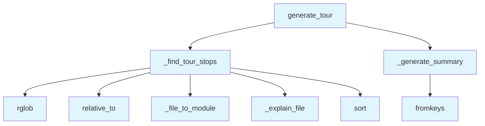

# File: `src/local_deepwiki/generators/analysis/tours.py`

## File Overview

This file implements a **guided tour generator** for codebase exploration. It enables users to navigate through a repository by generating a structured, topic-focused reading guide that includes relevant files, their explanations, and a summary of the tour's scope.

The module is designed to support a variety of topics (e.g., "architecture", "data_flow", "request_handling", "testing") and can optionally enrich the generated content with LLM-based explanations. It provides a foundational abstraction for building interactive or exploratory documentation tools.

## Key Concepts

### Topic-Based File Discovery
The core algorithm for discovering relevant files is based on **pattern matching**. Files are scored based on how well their stem (filename without extension) or full path matches a set of predefined or custom search patterns. This allows for flexible, topic-driven exploration of a codebase.

### Module Name Resolution
The `_file_to_module` function converts a file path into a module name, which is used for categorization and explanation generation. It strips out `src` prefix, `.py` extensions, and `__init__.py` files, allowing for consistent module naming across the codebase.

### Template-Based Explanations
File explanations are generated using a lookup mechanism (`_MODULE_EXPLANATIONS`) based on the stem or module name. If no template matches, a fallback explanation is provided. This design supports extensibility while keeping explanations consistent and predictable.

### Tour Ordering and Scoring
Files are scored based on pattern matches and sorted by relevance. The scoring system prioritizes files that match the topic more directly (e.g., in filename vs. path), ensuring that the most relevant stops appear first in the tour.

## Integration

This module is part of the `local_deepwiki` codebase and is closely related to:

- **CLI Entry Points**: It is likely used by `src/local_deepwiki/cli/main.py` or `src/local_deepwiki/cli/config_validator.py` to generate tour data for user-facing commands.
- **API Documentation Generator**: It may be integrated with `src/local_deepwiki/generators/analysis/api_docs.py` for providing contextual reading guides.
- **[Wiki Page](../../export/streaming.md) Generator**: It could be used by `src/local_deepwiki/generators/wiki/pages.py` to enhance documentation with guided tours.
- **Type Definitions**: The `Tour` type is defined in `src/local_deepwiki/handlers/types.py`, and this file's `generate_tour` function returns a dictionary matching this structure.

The module imports from `local_deepwiki.logging` to support structured logging, and it uses `pathlib.Path` for filesystem operations and `typing.Any` for flexible data handling.

## Design Notes

### Why Pattern Matching for File Discovery?
Pattern matching is chosen for its simplicity and effectiveness in identifying files relevant to a topic. It avoids the complexity of full AST parsing or semantic analysis, which is unnecessary for a guided tour. This approach makes the system fast and predictable, ideal for interactive or exploratory tools.

### Handling File Paths and Module Names
The `_file_to_module` function handles edge cases such as:
- Files in `src/` directory
- `__init__.py` files
- Files with `.py` extensions

This normalization ensures consistent module naming and improves the accuracy of explanation lookups.

### Enrichment vs. Template-Based Explanations
While the current implementation uses templates for explanations, the `enrich` parameter in `generate_tour` suggests that LLM-based enrichment is a future or optional feature. This design allows for gradual adoption of more advanced explanations without breaking the existing template-based flow.

### Stability in Sorting
The sorting of tour stops is stable, using both a negative score (to prioritize higher-scoring files) and the file path as a secondary key. This ensures that the order of stops is deterministic, even when multiple files have the same score.

### Custom Topic Support
The `topic` parameter supports both predefined topics and custom patterns prefixed with `custom:`. This allows for dynamic exploration without hardcoding new topics into the codebase.

## API Reference

### Functions

#### `generate_tour`

```python
def generate_tour(repo_path: Path, topic: str = "architecture", max_stops: int = 10, enrich: bool = False) -> dict[str, Any]
```

Generate a guided tour of the codebase.


| Parameter | Type | Default | Description |
|-----------|------|---------|-------------|
| `repo_path` | `Path` | - | Path to the repository root. |
| `topic` | `str` | `"architecture"` | Tour topic (architecture, data_flow, request_handling, testing). |
| `max_stops` | `int` | `10` | Maximum number of stops. |
| `enrich` | `bool` | `False` | - |

**Returns:** `dict[str, Any]`


<details>
<summary>View Source (lines 83-122) | <a href="https://github.com/UrbanDiver/local-deepwiki-mcp/blob/main/src/local_deepwiki/generators/analysis/tours.py#L83-L122">GitHub</a></summary>

```python
def generate_tour(
    repo_path: Path,
    *,
    topic: str = "architecture",
    max_stops: int = 10,
    enrich: bool = False,
) -> dict[str, Any]:
    """Generate a guided tour of the codebase.

    Args:
        repo_path: Path to the repository root.
        topic: Tour topic (architecture, data_flow, request_handling, testing).
        max_stops: Maximum number of stops.

    Returns:
        Dict with status, topic, title, stops list, and summary.
    """
    # Resolve topic patterns
    if topic.startswith("custom:"):
        query = topic[7:].lower()
        patterns = query.split()
    else:
        patterns = _TOPIC_PATTERNS.get(topic, _TOPIC_PATTERNS["architecture"])

    title = _TOPIC_TITLES.get(topic, f"Tour: {topic}")

    # Scan for matching files
    stops = _find_tour_stops(repo_path, patterns, topic)
    stops = stops[:max_stops]

    summary = _generate_summary(topic, stops)

    return {
        "status": "success",
        "topic": topic,
        "title": title,
        "stops": stops,
        "summary": summary,
        "tool": "get_guided_tour",
    }
```

</details>

## Call Graph



## Used By

Functions and methods in this file and their callers:

- **`_explain_file`**: called by `_find_tour_stops`
- **`_file_to_module`**: called by `_find_tour_stops`
- **`_find_tour_stops`**: called by `generate_tour`
- **`_generate_summary`**: called by `generate_tour`
- **`fromkeys`**: called by `_generate_summary`
- **`relative_to`**: called by `_find_tour_stops`
- **`rglob`**: called by `_find_tour_stops`
- **`sort`**: called by `_find_tour_stops`

## Usage Examples

*Examples extracted from test files*

### Architecture tour returns ordered stops

From `test_tours.py::test_generate_tour_architecture`:

```python
from local_deepwiki.generators.analysis.tours import generate_tour

result = generate_tour(sample_repo, topic="architecture")
assert result["status"] == "success"
assert result["topic"] == "architecture"
```

### Architecture tour returns ordered stops

From `test_tours.py::test_generate_tour_architecture`:

```python
from local_deepwiki.generators.analysis.tours import generate_tour

result = generate_tour(sample_repo, topic="architecture")
assert result["status"] == "success"
assert result["topic"] == "architecture"
```

### Testing tour identifies test directory and conftest

From `test_tours.py::test_generate_tour_testing`:

```python
from local_deepwiki.generators.analysis.tours import generate_tour

result = generate_tour(sample_repo, topic="testing")
files = [s["file"] for s in result["stops"]]
assert any("conftest" in f or "test_" in f for f in files)
```


## Last Modified

| Entity | Type | Author | Date | Commit |
|--------|------|--------|------|--------|
| `generate_tour` | function | Brian Breidenbach | 3 days ago | `ea95d3f` feat: add guided tour gener... |
| `_find_tour_stops` | function | Brian Breidenbach | 3 days ago | `ea95d3f` feat: add guided tour gener... |
| `_file_to_module` | function | Brian Breidenbach | 3 days ago | `ea95d3f` feat: add guided tour gener... |
| `_explain_file` | function | Brian Breidenbach | 3 days ago | `ea95d3f` feat: add guided tour gener... |
| `_generate_summary` | function | Brian Breidenbach | 3 days ago | `ea95d3f` feat: add guided tour gener... |

## Additional Source Code

Source code for functions and methods not listed in the API Reference above.

#### `_find_tour_stops`

<details>
<summary>View Source (lines 125-170) | <a href="https://github.com/UrbanDiver/local-deepwiki-mcp/blob/main/src/local_deepwiki/generators/analysis/tours.py#L125-L170">GitHub</a></summary>

```python
def _find_tour_stops(
    repo_path: Path,
    patterns: list[str],
    topic: str,
) -> list[dict[str, Any]]:
    """Find and order tour stops by relevance and dependency flow."""
    scored: list[tuple[int, str, dict[str, Any]]] = []

    for py_file in sorted(repo_path.rglob("*.py")):
        try:
            rel = py_file.relative_to(repo_path)
        except ValueError:
            continue
        parts = rel.parts
        if any(
            p.startswith(".") or p in ("node_modules", "__pycache__") for p in parts
        ):
            continue

        file_str = str(rel)
        stem = py_file.stem
        module = _file_to_module(rel)

        # Score by pattern match
        score = 0
        for pattern in patterns:
            if pattern in stem.lower():
                score += 2
            if pattern in file_str.lower():
                score += 1

        if score > 0:
            explanation = _explain_file(stem, module, topic)
            stop = {
                "file": file_str,
                "module": module,
                "section": stem,
                "explanation": explanation,
                "line": 1,
            }
            scored.append((-score, file_str, stop))

    # Sort by score descending (negative score), then by path for stability
    scored.sort(key=lambda t: (t[0], t[1]))

    return [entry[2] for entry in scored]
```

</details>


#### `_file_to_module`

<details>
<summary>View Source (lines 173-182) | <a href="https://github.com/UrbanDiver/local-deepwiki-mcp/blob/main/src/local_deepwiki/generators/analysis/tours.py#L173-L182">GitHub</a></summary>

```python
def _file_to_module(rel_path: Path) -> str:
    """Convert relative file path to a module name."""
    parts = list(rel_path.parts)
    if parts and parts[0] == "src":
        parts = parts[1:]
    if parts and parts[-1].endswith(".py"):
        parts[-1] = parts[-1][:-3]
    if parts and parts[-1] == "__init__":
        parts = parts[:-1]
    return ".".join(parts) if parts else "root"
```

</details>


#### `_explain_file`

<details>
<summary>View Source (lines 185-191) | <a href="https://github.com/UrbanDiver/local-deepwiki-mcp/blob/main/src/local_deepwiki/generators/analysis/tours.py#L185-L191">GitHub</a></summary>

```python
def _explain_file(stem: str, module: str, topic: str) -> str:
    """Generate a template explanation for a file."""
    for key, explanation in _MODULE_EXPLANATIONS.items():
        if key in stem.lower() or key in module.lower():
            return explanation

    return f"Part of the {module} module."
```

</details>


#### `_generate_summary`

<details>
<summary>View Source (lines 194-210) | <a href="https://github.com/UrbanDiver/local-deepwiki-mcp/blob/main/src/local_deepwiki/generators/analysis/tours.py#L194-L210">GitHub</a></summary>

```python
def _generate_summary(topic: str, stops: list[dict[str, Any]]) -> str:
    """Generate a summary sentence for the tour."""
    if not stops:
        return "No relevant files found for this topic."

    modules = list(dict.fromkeys(s["module"].split(".")[0] for s in stops))
    module_list = ", ".join(modules[:5])

    summaries = {
        "architecture": f"The codebase is organized around {len(modules)} key areas: {module_list}.",
        "data_flow": f"Data flows through {len(stops)} processing stages across {module_list}.",
        "request_handling": f"Requests are handled through a {len(stops)}-step pipeline: {module_list}.",
        "testing": f"Tests are organized across {len(stops)} files covering {module_list}.",
    }
    return summaries.get(
        topic, f"This tour covers {len(stops)} files in {module_list}."
    )
```

</details>

## Relevant Source Files

- `src/local_deepwiki/generators/analysis/tours.py:83-122`
