# api_docs.py

## File Overview

The `api_docs.py` module provides functionality for extracting and documenting API information from Python source code. It uses tree-sitter parsing to analyze code structure and extract detailed information about functions, classes, parameters, and docstrings for documentation generation.

## Classes

### Parameter

A dataclass that represents a function or method parameter.

**Fields:**
- Contains parameter information extracted from function signatures

### FunctionSignature

A dataclass that represents the complete signature of a function or method.

**Fields:**
- Stores function signature details including parameters and return type information

### ClassSignature

A dataclass that represents the signature and structure of a class.

**Fields:**
- Contains class-level information and metadata

### APIDocExtractor

The [main](../export/pdf.md) extractor class responsible for parsing code and extracting API documentation information.

**Purpose:**
- Extracts structured API documentation from Python source code
- Processes classes, functions, and their associated metadata
- Handles docstring parsing and signature extraction

## Functions

### extract_python_parameters

Extracts parameter information from Python function definitions.

**Purpose:**
- Parses function parameter lists from tree-sitter nodes
- Returns structured parameter data

### extract_python_return_type

Extracts return type annotations from Python functions.

**Purpose:**
- Identifies and extracts return type information from function signatures
- Handles type annotations when present

### extract_python_decorators

Extracts [decorator](../providers/base.md) information from Python functions and classes.

**Purpose:**
- Identifies decorators applied to functions or classes
- Returns [decorator](../providers/base.md) names and structure

### extract_python_docstring

Extracts docstrings from Python code elements.

**Purpose:**
- Locates and extracts docstring content from functions, classes, and methods
- Handles various docstring formats and positions

### parse_google_docstring

Parses docstrings following Google style format.

**Purpose:**
- Processes Google-style docstrings
- Extracts structured information from formatted docstrings

### parse_numpy_docstring

Parses docstrings following NumPy style format.

**Purpose:**
- Processes NumPy-style docstrings
- Extracts structured documentation information

### parse_docstring

General docstring parsing function that handles multiple formats.

**Purpose:**
- Provides unified interface for parsing different docstring styles
- Delegates to appropriate format-specific parsers

## Usage Examples

```python
from local_deepwiki.generators.api_docs import APIDocExtractor
from local_deepwiki.core.parser import CodeParser
from local_deepwiki.models import Language

# Create a code parser for Python
parser = CodeParser(Language.PYTHON)

# Create an API documentation extractor
extractor = APIDocExtractor()

# Parse a Python file and extract API documentation
# (Actual usage would depend on the specific method signatures)
```

```python
# Extract parameters from a function node
parameters = extract_python_parameters(function_node)

# Extract return type information
return_type = extract_python_return_type(function_node)

# Extract decorators
decorators = extract_python_decorators(function_node)

# Extract and parse docstrings
docstring = extract_python_docstring(node)
parsed_docs = parse_docstring(docstring_content)
```

## Related Components

This module integrates with several other components in the local_deepwiki system:

- **[CodeParser](../core/parser.md)**: Used for parsing source code with tree-sitter
- **[Language](../models.md)**: Enum for specifying programming languages
- **Chunker**: Provides constants for identifying class and function node types (`CLASS_NODE_TYPES`, `FUNCTION_NODE_TYPES`)

The module relies on tree-sitter Node objects for code analysis and uses utility functions like [`find_nodes_by_type`](../core/parser.md), [`get_node_name`](../core/parser.md), and [`get_node_text`](../core/parser.md) for node manipulation and data extraction.

## API Reference

### class `Parameter`

Represents a function parameter.


<details>
<summary>View Source (lines 15-21) | <a href="https://github.com/UrbanDiver/local-deepwiki-mcp/blob/feature/wiki-enhancements-round2/src/local_deepwiki/generators/api_docs.py#L15-L21">GitHub</a></summary>

```python
class Parameter:
    """Represents a function parameter."""

    name: str
    type_hint: str | None = None
    default_value: str | None = None
    description: str | None = None
```

</details>

### class `FunctionSignature`

Represents a function/method signature.


<details>
<summary>View Source (lines 25-35) | <a href="https://github.com/UrbanDiver/local-deepwiki-mcp/blob/feature/wiki-enhancements-round2/src/local_deepwiki/generators/api_docs.py#L25-L35">GitHub</a></summary>

```python
class FunctionSignature:
    """Represents a function/method signature."""

    name: str
    parameters: list[Parameter] = field(default_factory=list)
    return_type: str | None = None
    docstring: str | None = None
    description: str | None = None
    is_method: bool = False
    is_async: bool = False
    decorators: list[str] = field(default_factory=list)
```

</details>

### class `ClassSignature`

Represents a class signature.


<details>
<summary>View Source (lines 39-47) | <a href="https://github.com/UrbanDiver/local-deepwiki-mcp/blob/feature/wiki-enhancements-round2/src/local_deepwiki/generators/api_docs.py#L39-L47">GitHub</a></summary>

```python
class ClassSignature:
    """Represents a class signature."""

    name: str
    bases: list[str] = field(default_factory=list)
    docstring: str | None = None
    description: str | None = None
    methods: list[FunctionSignature] = field(default_factory=list)
    class_variables: list[tuple[str, str | None, str | None]] = field(default_factory=list)
```

</details>

### class `APIDocExtractor`

Extracts API documentation from source files.

**Methods:**


<details>
<summary>View Source (lines 472-526) | <a href="https://github.com/UrbanDiver/local-deepwiki-mcp/blob/feature/wiki-enhancements-round2/src/local_deepwiki/generators/api_docs.py#L472-L526">GitHub</a></summary>

```python
class APIDocExtractor:
    """Extracts API documentation from source files."""

    def __init__(self):
        """Initialize the extractor."""
        self.parser = CodeParser()

    def extract_from_file(
        self, file_path: Path
    ) -> tuple[list[FunctionSignature], list[ClassSignature]]:
        """Extract API documentation from a source file.

        Args:
            file_path: Path to the source file.

        Returns:
            Tuple of (functions, classes) signatures.
        """
        result = self.parser.parse_file(file_path)
        if result is None:
            return [], []

        root, language, source = result
        functions: list[FunctionSignature] = []
        classes: list[ClassSignature] = []

        function_types = FUNCTION_NODE_TYPES.get(language, set())
        class_types = CLASS_NODE_TYPES.get(language, set())

        # Extract top-level functions
        for func_node in find_nodes_by_type(root, function_types):
            # Skip if inside a class
            if self._is_inside_class(func_node, class_types):
                continue

            sig = extract_function_signature(func_node, source, language)
            if sig:
                functions.append(sig)

        # Extract classes
        for class_node in find_nodes_by_type(root, class_types):
            sig = extract_class_signature(class_node, source, language)
            if sig:
                classes.append(sig)

        return functions, classes

    def _is_inside_class(self, node: Node, class_types: set[str]) -> bool:
        """Check if a node is inside a class definition."""
        parent = node.parent
        while parent:
            if parent.type in class_types:
                return True
            parent = parent.parent
        return False
```

</details>

#### `__init__`

```python
def __init__()
```

Initialize the extractor.


<details>
<summary>View Source (lines 472-526) | <a href="https://github.com/UrbanDiver/local-deepwiki-mcp/blob/feature/wiki-enhancements-round2/src/local_deepwiki/generators/api_docs.py#L472-L526">GitHub</a></summary>

```python
class APIDocExtractor:
    """Extracts API documentation from source files."""

    def __init__(self):
        """Initialize the extractor."""
        self.parser = CodeParser()

    def extract_from_file(
        self, file_path: Path
    ) -> tuple[list[FunctionSignature], list[ClassSignature]]:
        """Extract API documentation from a source file.

        Args:
            file_path: Path to the source file.

        Returns:
            Tuple of (functions, classes) signatures.
        """
        result = self.parser.parse_file(file_path)
        if result is None:
            return [], []

        root, language, source = result
        functions: list[FunctionSignature] = []
        classes: list[ClassSignature] = []

        function_types = FUNCTION_NODE_TYPES.get(language, set())
        class_types = CLASS_NODE_TYPES.get(language, set())

        # Extract top-level functions
        for func_node in find_nodes_by_type(root, function_types):
            # Skip if inside a class
            if self._is_inside_class(func_node, class_types):
                continue

            sig = extract_function_signature(func_node, source, language)
            if sig:
                functions.append(sig)

        # Extract classes
        for class_node in find_nodes_by_type(root, class_types):
            sig = extract_class_signature(class_node, source, language)
            if sig:
                classes.append(sig)

        return functions, classes

    def _is_inside_class(self, node: Node, class_types: set[str]) -> bool:
        """Check if a node is inside a class definition."""
        parent = node.parent
        while parent:
            if parent.type in class_types:
                return True
            parent = parent.parent
        return False
```

</details>

#### `extract_from_file`

```python
def extract_from_file(file_path: Path) -> tuple[list[FunctionSignature], list[ClassSignature]]
```

Extract API documentation from a source file.


| Parameter | Type | Default | Description |
|-----------|------|---------|-------------|
| `file_path` | `Path` | - | Path to the source file. |


---


<details>
<summary>View Source (lines 472-526) | <a href="https://github.com/UrbanDiver/local-deepwiki-mcp/blob/feature/wiki-enhancements-round2/src/local_deepwiki/generators/api_docs.py#L472-L526">GitHub</a></summary>

```python
class APIDocExtractor:
    """Extracts API documentation from source files."""

    def __init__(self):
        """Initialize the extractor."""
        self.parser = CodeParser()

    def extract_from_file(
        self, file_path: Path
    ) -> tuple[list[FunctionSignature], list[ClassSignature]]:
        """Extract API documentation from a source file.

        Args:
            file_path: Path to the source file.

        Returns:
            Tuple of (functions, classes) signatures.
        """
        result = self.parser.parse_file(file_path)
        if result is None:
            return [], []

        root, language, source = result
        functions: list[FunctionSignature] = []
        classes: list[ClassSignature] = []

        function_types = FUNCTION_NODE_TYPES.get(language, set())
        class_types = CLASS_NODE_TYPES.get(language, set())

        # Extract top-level functions
        for func_node in find_nodes_by_type(root, function_types):
            # Skip if inside a class
            if self._is_inside_class(func_node, class_types):
                continue

            sig = extract_function_signature(func_node, source, language)
            if sig:
                functions.append(sig)

        # Extract classes
        for class_node in find_nodes_by_type(root, class_types):
            sig = extract_class_signature(class_node, source, language)
            if sig:
                classes.append(sig)

        return functions, classes

    def _is_inside_class(self, node: Node, class_types: set[str]) -> bool:
        """Check if a node is inside a class definition."""
        parent = node.parent
        while parent:
            if parent.type in class_types:
                return True
            parent = parent.parent
        return False
```

</details>

### Functions

#### `extract_python_parameters`

```python
def extract_python_parameters(func_node: Node, source: bytes) -> list[Parameter]
```

Extract parameters from a Python function definition.


| Parameter | Type | Default | Description |
|-----------|------|---------|-------------|
| `func_node` | `Node` | - | The function_definition AST node. |
| `source` | `bytes` | - | Source code bytes. |

**Returns:** `list[Parameter]`


<details>
<summary>View Source (lines 50-123) | <a href="https://github.com/UrbanDiver/local-deepwiki-mcp/blob/feature/wiki-enhancements-round2/src/local_deepwiki/generators/api_docs.py#L50-L123">GitHub</a></summary>

```python
def extract_python_parameters(func_node: Node, source: bytes) -> list[Parameter]:
    """Extract parameters from a Python function definition.

    Args:
        func_node: The function_definition AST node.
        source: Source code bytes.

    Returns:
        List of Parameter objects.
    """
    parameters = []
    params_node = func_node.child_by_field_name("parameters")
    if not params_node:
        return parameters

    for child in params_node.children:
        if child.type == "identifier":
            # Simple parameter without type hint
            name = get_node_text(child, source)
            if name not in ("self", "cls"):
                parameters.append(Parameter(name=name))

        elif child.type == "typed_parameter":
            # Parameter with type hint: name: type
            name_node = None
            type_node = None
            for c in child.children:
                if c.type == "identifier":
                    name_node = c
                elif c.type == "type":
                    type_node = c

            if name_node:
                name = get_node_text(name_node, source)
                if name not in ("self", "cls"):
                    type_hint = get_node_text(type_node, source) if type_node else None
                    parameters.append(Parameter(name=name, type_hint=type_hint))

        elif child.type == "default_parameter":
            # Parameter with default: name = value
            name_node = child.child_by_field_name("name")
            value_node = child.child_by_field_name("value")

            if name_node:
                name = get_node_text(name_node, source)
                if name not in ("self", "cls"):
                    default = get_node_text(value_node, source) if value_node else None
                    parameters.append(Parameter(name=name, default_value=default))

        elif child.type == "typed_default_parameter":
            # Parameter with type and default: name: type = value
            name_node = child.child_by_field_name("name")
            type_node = child.child_by_field_name("type")
            value_node = child.child_by_field_name("value")

            if name_node:
                name = get_node_text(name_node, source)
                if name not in ("self", "cls"):
                    type_hint = get_node_text(type_node, source) if type_node else None
                    default = get_node_text(value_node, source) if value_node else None
                    parameters.append(
                        Parameter(name=name, type_hint=type_hint, default_value=default)
                    )

        elif child.type in ("list_splat_pattern", "dictionary_splat_pattern"):
            # *args or **kwargs
            for c in child.children:
                if c.type == "identifier":
                    name = get_node_text(c, source)
                    prefix = "*" if child.type == "list_splat_pattern" else "**"
                    parameters.append(Parameter(name=f"{prefix}{name}"))
                    break

    return parameters
```

</details>

#### `extract_python_return_type`

```python
def extract_python_return_type(func_node: Node, source: bytes) -> str | None
```

Extract return type annotation from a Python function.


| Parameter | Type | Default | Description |
|-----------|------|---------|-------------|
| `func_node` | `Node` | - | The function_definition AST node. |
| `source` | `bytes` | - | Source code bytes. |

**Returns:** `str | None`


<details>
<summary>View Source (lines 126-139) | <a href="https://github.com/UrbanDiver/local-deepwiki-mcp/blob/feature/wiki-enhancements-round2/src/local_deepwiki/generators/api_docs.py#L126-L139">GitHub</a></summary>

```python
def extract_python_return_type(func_node: Node, source: bytes) -> str | None:
    """Extract return type annotation from a Python function.

    Args:
        func_node: The function_definition AST node.
        source: Source code bytes.

    Returns:
        Return type string or None.
    """
    return_type_node = func_node.child_by_field_name("return_type")
    if return_type_node:
        return get_node_text(return_type_node, source)
    return None
```

</details>

#### `extract_python_decorators`

```python
def extract_python_decorators(func_node: Node, source: bytes) -> list[str]
```

Extract decorators from a Python function.


| Parameter | Type | Default | Description |
|-----------|------|---------|-------------|
| `func_node` | `Node` | - | The function_definition AST node. |
| `source` | `bytes` | - | Source code bytes. |

**Returns:** `list[str]`


<details>
<summary>View Source (lines 142-163) | <a href="https://github.com/UrbanDiver/local-deepwiki-mcp/blob/feature/wiki-enhancements-round2/src/local_deepwiki/generators/api_docs.py#L142-L163">GitHub</a></summary>

```python
def extract_python_decorators(func_node: Node, source: bytes) -> list[str]:
    """Extract decorators from a Python function.

    Args:
        func_node: The function_definition AST node.
        source: Source code bytes.

    Returns:
        List of decorator strings.
    """
    decorators = []
    # Look at siblings before the function
    if func_node.parent:
        prev_sibling = func_node.prev_sibling
        while prev_sibling:
            if prev_sibling.type == "decorator":
                dec_text = get_node_text(prev_sibling, source)
                decorators.insert(0, dec_text)
            elif prev_sibling.type not in ("comment", "decorator"):
                break
            prev_sibling = prev_sibling.prev_sibling
    return decorators
```

</details>

#### `extract_python_docstring`

```python
def extract_python_docstring(node: Node, source: bytes) -> str | None
```

Extract docstring from a Python function or class.


| Parameter | Type | Default | Description |
|-----------|------|---------|-------------|
| `node` | `Node` | - | The function_definition or class_definition AST node. |
| `source` | `bytes` | - | Source code bytes. |

**Returns:** `str | None`


<details>
<summary>View Source (lines 166-197) | <a href="https://github.com/UrbanDiver/local-deepwiki-mcp/blob/feature/wiki-enhancements-round2/src/local_deepwiki/generators/api_docs.py#L166-L197">GitHub</a></summary>

```python
def extract_python_docstring(node: Node, source: bytes) -> str | None:
    """Extract docstring from a Python function or class.

    Args:
        node: The function_definition or class_definition AST node.
        source: Source code bytes.

    Returns:
        Docstring content or None.
    """
    # Find the body/block node
    body_node = node.child_by_field_name("body")
    if not body_node:
        return None

    # First statement in body might be a docstring
    for child in body_node.children:
        if child.type == "expression_statement":
            for c in child.children:
                if c.type == "string":
                    docstring = get_node_text(c, source)
                    # Remove quotes
                    if docstring.startswith('"""') or docstring.startswith("'''"):
                        docstring = docstring[3:-3]
                    elif docstring.startswith('"') or docstring.startswith("'"):
                        docstring = docstring[1:-1]
                    return docstring.strip()
        elif child.type not in ("comment", "pass_statement"):
            # First non-comment statement is not a docstring
            break

    return None
```

</details>

#### `parse_google_docstring`

```python
def parse_google_docstring(docstring: str) -> dict
```

Parse a Google-style docstring.


| Parameter | Type | Default | Description |
|-----------|------|---------|-------------|
| `docstring` | `str` | - | The docstring content. |

**Returns:** `dict`


<details>
<summary>View Source (lines 200-273) | <a href="https://github.com/UrbanDiver/local-deepwiki-mcp/blob/feature/wiki-enhancements-round2/src/local_deepwiki/generators/api_docs.py#L200-L273">GitHub</a></summary>

```python
def parse_google_docstring(docstring: str) -> dict:
    """Parse a Google-style docstring.

    Args:
        docstring: The docstring content.

    Returns:
        Dictionary with 'description', 'args', 'returns', 'raises' keys.
    """
    result = {
        "description": "",
        "args": {},
        "returns": None,
        "raises": [],
    }

    if not docstring:
        return result

    lines = docstring.split("\n")
    current_section = "description"
    current_param = None
    description_lines = []

    for line in lines:
        stripped = line.strip()

        # Check for section headers
        if stripped in ("Args:", "Arguments:", "Parameters:"):
            current_section = "args"
            current_param = None
            continue
        elif stripped in ("Returns:", "Return:"):
            current_section = "returns"
            current_param = None
            continue
        elif stripped in ("Raises:", "Raise:"):
            current_section = "raises"
            current_param = None
            continue
        elif stripped in ("Example:", "Examples:", "Note:", "Notes:", "Yields:"):
            current_section = "other"
            current_param = None
            continue

        if current_section == "description":
            description_lines.append(stripped)
        elif current_section == "args":
            # Parse parameter: name (type): description or name: description
            param_match = re.match(r"(\w+)\s*(?:\(([^)]+)\))?\s*:\s*(.+)?", stripped)
            if param_match:
                param_name = param_match.group(1)
                param_type = param_match.group(2)
                param_desc = param_match.group(3) or ""
                result["args"][param_name] = {
                    "type": param_type,
                    "description": param_desc.strip(),
                }
                current_param = param_name
            elif current_param and stripped:
                # Continuation of previous param description
                result["args"][current_param]["description"] += " " + stripped
        elif current_section == "returns":
            if result["returns"] is None:
                result["returns"] = stripped
            elif stripped:
                result["returns"] += " " + stripped

    result["description"] = " ".join(description_lines).strip()
    # Take just first paragraph for description
    if "\n\n" in result["description"]:
        result["description"] = result["description"].split("\n\n")[0]

    return result
```

</details>

#### `parse_numpy_docstring`

```python
def parse_numpy_docstring(docstring: str) -> dict
```

Parse a NumPy-style docstring.


| Parameter | Type | Default | Description |
|-----------|------|---------|-------------|
| `docstring` | `str` | - | The docstring content. |

**Returns:** `dict`


<details>
<summary>View Source (lines 276-352) | <a href="https://github.com/UrbanDiver/local-deepwiki-mcp/blob/feature/wiki-enhancements-round2/src/local_deepwiki/generators/api_docs.py#L276-L352">GitHub</a></summary>

```python
def parse_numpy_docstring(docstring: str) -> dict:
    """Parse a NumPy-style docstring.

    Args:
        docstring: The docstring content.

    Returns:
        Dictionary with 'description', 'args', 'returns', 'raises' keys.
    """
    result = {
        "description": "",
        "args": {},
        "returns": None,
        "raises": [],
    }

    if not docstring:
        return result

    lines = docstring.split("\n")
    current_section = "description"
    current_param = None
    description_lines = []

    i = 0
    while i < len(lines):
        line = lines[i]
        stripped = line.strip()

        # Check for section headers (followed by dashes)
        if i + 1 < len(lines) and lines[i + 1].strip().startswith("---"):
            if stripped.lower() in ("parameters", "args", "arguments"):
                current_section = "args"
                i += 2
                continue
            elif stripped.lower() in ("returns", "return"):
                current_section = "returns"
                i += 2
                continue
            elif stripped.lower() in ("raises", "raise"):
                current_section = "raises"
                i += 2
                continue
            else:
                current_section = "other"
                i += 2
                continue

        if current_section == "description":
            description_lines.append(stripped)
        elif current_section == "args":
            # NumPy style: name : type
            param_match = re.match(r"(\w+)\s*:\s*(.+)?", stripped)
            if param_match and not line.startswith("    "):
                param_name = param_match.group(1)
                param_type = param_match.group(2)
                result["args"][param_name] = {
                    "type": param_type.strip() if param_type else None,
                    "description": "",
                }
                current_param = param_name
            elif current_param and stripped:
                # Description line (indented)
                result["args"][current_param]["description"] += " " + stripped
        elif current_section == "returns":
            if result["returns"] is None:
                result["returns"] = stripped
            elif stripped:
                result["returns"] += " " + stripped

        i += 1

    result["description"] = " ".join(description_lines).strip()
    if "\n\n" in result["description"]:
        result["description"] = result["description"].split("\n\n")[0]

    return result
```

</details>

#### `parse_docstring`

```python
def parse_docstring(docstring: str) -> dict
```

Parse a docstring, auto-detecting format.


| Parameter | Type | Default | Description |
|-----------|------|---------|-------------|
| `docstring` | `str` | - | The docstring content. |

**Returns:** `dict`


<details>
<summary>View Source (lines 355-374) | <a href="https://github.com/UrbanDiver/local-deepwiki-mcp/blob/feature/wiki-enhancements-round2/src/local_deepwiki/generators/api_docs.py#L355-L374">GitHub</a></summary>

```python
def parse_docstring(docstring: str) -> dict:
    """Parse a docstring, auto-detecting format.

    Args:
        docstring: The docstring content.

    Returns:
        Parsed docstring dictionary.
    """
    if not docstring:
        return {"description": "", "args": {}, "returns": None, "raises": []}

    # Detect format by looking for section markers
    if re.search(r"^(Args|Arguments|Parameters):\s*$", docstring, re.MULTILINE):
        return parse_google_docstring(docstring)
    elif re.search(r"^(Parameters|Args)\s*\n\s*-+", docstring, re.MULTILINE):
        return parse_numpy_docstring(docstring)
    else:
        # Default to Google-style parsing (handles simple docstrings too)
        return parse_google_docstring(docstring)
```

</details>

#### `extract_function_signature`

```python
def extract_function_signature(func_node: Node, source: bytes, language: Language, class_name: str | None = None) -> FunctionSignature | None
```

Extract signature from a function node.


| Parameter | Type | Default | Description |
|-----------|------|---------|-------------|
| `func_node` | `Node` | - | The function AST node. |
| `source` | `bytes` | - | Source code bytes. |
| `language` | [`Language`](../models.md) | - | Programming language. |
| `class_name` | `str | None` | `None` | Parent class name if this is a method. |

**Returns:** `FunctionSignature | None`


<details>
<summary>View Source (lines 377-421) | <a href="https://github.com/UrbanDiver/local-deepwiki-mcp/blob/feature/wiki-enhancements-round2/src/local_deepwiki/generators/api_docs.py#L377-L421">GitHub</a></summary>

```python
def extract_function_signature(
    func_node: Node,
    source: bytes,
    language: Language,
    class_name: str | None = None,
) -> FunctionSignature | None:
    """Extract signature from a function node.

    Args:
        func_node: The function AST node.
        source: Source code bytes.
        language: Programming language.
        class_name: Parent class name if this is a method.

    Returns:
        FunctionSignature or None if extraction fails.
    """
    name = get_node_name(func_node, source, language)
    if not name:
        return None

    sig = FunctionSignature(name=name, is_method=class_name is not None)

    if language == Language.PYTHON:
        sig.parameters = extract_python_parameters(func_node, source)
        sig.return_type = extract_python_return_type(func_node, source)
        sig.decorators = extract_python_decorators(func_node, source)
        # Check for async keyword as first child
        sig.is_async = any(c.type == "async" for c in func_node.children)

        docstring = extract_python_docstring(func_node, source)
        if docstring:
            sig.docstring = docstring
            parsed = parse_docstring(docstring)
            sig.description = parsed["description"]

            # Merge docstring param descriptions
            for param in sig.parameters:
                if param.name.lstrip("*") in parsed["args"]:
                    arg_info = parsed["args"][param.name.lstrip("*")]
                    param.description = arg_info.get("description")
                    if not param.type_hint and arg_info.get("type"):
                        param.type_hint = arg_info["type"]

    return sig
```

</details>

#### `extract_class_signature`

```python
def extract_class_signature(class_node: Node, source: bytes, language: Language) -> ClassSignature | None
```

Extract signature from a class node.


| Parameter | Type | Default | Description |
|-----------|------|---------|-------------|
| `class_node` | `Node` | - | The class AST node. |
| `source` | `bytes` | - | Source code bytes. |
| `language` | [`Language`](../models.md) | - | Programming language. |

**Returns:** `ClassSignature | None`


<details>
<summary>View Source (lines 424-469) | <a href="https://github.com/UrbanDiver/local-deepwiki-mcp/blob/feature/wiki-enhancements-round2/src/local_deepwiki/generators/api_docs.py#L424-L469">GitHub</a></summary>

```python
def extract_class_signature(
    class_node: Node,
    source: bytes,
    language: Language,
) -> ClassSignature | None:
    """Extract signature from a class node.

    Args:
        class_node: The class AST node.
        source: Source code bytes.
        language: Programming language.

    Returns:
        ClassSignature or None if extraction fails.
    """
    name = get_node_name(class_node, source, language)
    if not name:
        return None

    sig = ClassSignature(name=name)

    if language == Language.PYTHON:
        # Extract base classes
        for child in class_node.children:
            if child.type == "argument_list":
                for c in child.children:
                    if c.type == "identifier":
                        sig.bases.append(get_node_text(c, source))
                    elif c.type == "attribute":
                        sig.bases.append(get_node_text(c, source))

        # Extract docstring
        docstring = extract_python_docstring(class_node, source)
        if docstring:
            sig.docstring = docstring
            parsed = parse_docstring(docstring)
            sig.description = parsed["description"]

        # Extract methods
        function_types = FUNCTION_NODE_TYPES.get(language, set())
        for method_node in find_nodes_by_type(class_node, function_types):
            method_sig = extract_function_signature(method_node, source, language, name)
            if method_sig:
                sig.methods.append(method_sig)

    return sig
```

</details>

#### `format_parameter`

```python
def format_parameter(param: Parameter) -> str
```

Format a parameter for display.


| Parameter | Type | Default | Description |
|-----------|------|---------|-------------|
| `param` | `Parameter` | - | The parameter to format. |

**Returns:** `str`


<details>
<summary>View Source (lines 529-543) | <a href="https://github.com/UrbanDiver/local-deepwiki-mcp/blob/feature/wiki-enhancements-round2/src/local_deepwiki/generators/api_docs.py#L529-L543">GitHub</a></summary>

```python
def format_parameter(param: Parameter) -> str:
    """Format a parameter for display.

    Args:
        param: The parameter to format.

    Returns:
        Formatted parameter string.
    """
    parts = [param.name]
    if param.type_hint:
        parts.append(f": {param.type_hint}")
    if param.default_value is not None:
        parts.append(f" = {param.default_value}")
    return "".join(parts)
```

</details>

#### `format_function_signature_line`

```python
def format_function_signature_line(sig: FunctionSignature) -> str
```

Format a function signature as a single line.


| Parameter | Type | Default | Description |
|-----------|------|---------|-------------|
| `sig` | `FunctionSignature` | - | The function signature. |

**Returns:** `str`


<details>
<summary>View Source (lines 546-558) | <a href="https://github.com/UrbanDiver/local-deepwiki-mcp/blob/feature/wiki-enhancements-round2/src/local_deepwiki/generators/api_docs.py#L546-L558">GitHub</a></summary>

```python
def format_function_signature_line(sig: FunctionSignature) -> str:
    """Format a function signature as a single line.

    Args:
        sig: The function signature.

    Returns:
        Formatted signature string.
    """
    prefix = "async " if sig.is_async else ""
    params = ", ".join(format_parameter(p) for p in sig.parameters)
    return_part = f" -> {sig.return_type}" if sig.return_type else ""
    return f"{prefix}def {sig.name}({params}){return_part}"
```

</details>

#### `generate_api_reference_markdown`

```python
def generate_api_reference_markdown(functions: list[FunctionSignature], classes: list[ClassSignature], include_private: bool = False) -> str
```

Generate markdown API reference documentation.


| Parameter | Type | Default | Description |
|-----------|------|---------|-------------|
| `functions` | `list[FunctionSignature]` | - | List of function signatures. |
| `classes` | `list[ClassSignature]` | - | List of class signatures. |
| `include_private` | `bool` | `False` | Whether to include private (underscore) items. |

**Returns:** `str`


<details>
<summary>View Source (lines 561-667) | <a href="https://github.com/UrbanDiver/local-deepwiki-mcp/blob/feature/wiki-enhancements-round2/src/local_deepwiki/generators/api_docs.py#L561-L667">GitHub</a></summary>

```python
def generate_api_reference_markdown(
    functions: list[FunctionSignature],
    classes: list[ClassSignature],
    include_private: bool = False,
) -> str:
    """Generate markdown API reference documentation.

    Args:
        functions: List of function signatures.
        classes: List of class signatures.
        include_private: Whether to include private (underscore) items.

    Returns:
        Markdown string.
    """
    lines = []

    # Filter private items unless requested
    if not include_private:
        functions = [f for f in functions if not f.name.startswith("_")]
        classes = [c for c in classes if not c.name.startswith("_")]

    # Classes
    for cls in classes:
        lines.append(f"### class `{cls.name}`")

        if cls.bases:
            lines.append(f"\n**Inherits from:** {', '.join(f'`{b}`' for b in cls.bases)}")

        if cls.description:
            lines.append(f"\n{cls.description}")

        # Filter methods
        methods = cls.methods
        if not include_private:
            methods = [
                m
                for m in methods
                if not m.name.startswith("_")
                or m.name in ("__init__", "__call__", "__enter__", "__exit__")
            ]

        if methods:
            lines.append("\n**Methods:**\n")
            for method in methods:
                # Method signature
                sig_line = format_function_signature_line(method)
                lines.append(f"#### `{method.name}`\n")
                lines.append(f"```python\n{sig_line}\n```\n")

                if method.description:
                    lines.append(f"{method.description}\n")

                # Parameters table
                params = [p for p in method.parameters]
                if params:
                    lines.append("\n| Parameter | Type | Default | Description |")
                    lines.append("|-----------|------|---------|-------------|")
                    for param in params:
                        type_str = f"`{param.type_hint}`" if param.type_hint else "-"
                        default_str = f"`{param.default_value}`" if param.default_value else "-"
                        desc_str = param.description or "-"
                        lines.append(
                            f"| `{param.name}` | {type_str} | {default_str} | {desc_str} |"
                        )
                    lines.append("")

        lines.append("")

    # Top-level functions
    if functions:
        if classes:
            lines.append("---\n")
        lines.append("### Functions\n")

        for func in functions:
            sig_line = format_function_signature_line(func)
            lines.append(f"#### `{func.name}`\n")

            # Decorators
            if func.decorators:
                for dec in func.decorators:
                    lines.append(f"`{dec}`\n")

            lines.append(f"```python\n{sig_line}\n```\n")

            if func.description:
                lines.append(f"{func.description}\n")

            # Parameters table
            if func.parameters:
                lines.append("\n| Parameter | Type | Default | Description |")
                lines.append("|-----------|------|---------|-------------|")
                for param in func.parameters:
                    type_str = f"`{param.type_hint}`" if param.type_hint else "-"
                    default_str = f"`{param.default_value}`" if param.default_value else "-"
                    desc_str = param.description or "-"
                    lines.append(f"| `{param.name}` | {type_str} | {default_str} | {desc_str} |")
                lines.append("")

            # Return type
            if func.return_type:
                lines.append(f"**Returns:** `{func.return_type}`\n")

            lines.append("")

    return "\n".join(lines)
```

</details>

#### `get_file_api_docs`

```python
def get_file_api_docs(file_path: Path) -> str | None
```

Get API documentation for a single file.


| Parameter | Type | Default | Description |
|-----------|------|---------|-------------|
| `file_path` | `Path` | - | Path to the source file. |

**Returns:** `str | None`


<details>
<summary>View Source (lines 670-685) | <a href="https://github.com/UrbanDiver/local-deepwiki-mcp/blob/feature/wiki-enhancements-round2/src/local_deepwiki/generators/api_docs.py#L670-L685">GitHub</a></summary>

```python
def get_file_api_docs(file_path: Path) -> str | None:
    """Get API documentation for a single file.

    Args:
        file_path: Path to the source file.

    Returns:
        Markdown API documentation or None if no APIs found.
    """
    extractor = APIDocExtractor()
    functions, classes = extractor.extract_from_file(file_path)

    if not functions and not classes:
        return None

    return generate_api_reference_markdown(functions, classes)
```

</details>

## Class Diagram


## Call Graph

```mermaid
flowchart TD
    N0[APIDocExtractor]
    N1[APIDocExtractor.__init__]
    N2[APIDocExtractor.extract_fro...]
    N3[ClassSignature]
    N4[CodeParser]
    N5[FunctionSignature]
    N6[Parameter]
    N7[child_by_field_name]
    N8[extract_class_signature]
    N9[extract_from_file]
    N10[extract_function_signature]
    N11[extract_python_decorators]
    N12[extract_python_docstring]
    N13[extract_python_parameters]
    N14[extract_python_return_type]
    N15[find_nodes_by_type]
    N16[format_function_signature_line]
    N17[format_parameter]
    N18[generate_api_reference_mark...]
    N19[get_file_api_docs]
    N20[get_node_name]
    N21[get_node_text]
    N22[group]
    N23[lstrip]
    N24[match]
    N25[parse_docstring]
    N26[parse_file]
    N27[parse_google_docstring]
    N28[parse_numpy_docstring]
    N29[search]
    N13 --> N7
    N13 --> N21
    N13 --> N6
    N14 --> N7
    N14 --> N21
    N11 --> N21
    N12 --> N7
    N12 --> N21
    N27 --> N24
    N27 --> N22
    N28 --> N24
    N28 --> N22
    N25 --> N29
    N25 --> N27
    N25 --> N28
    N10 --> N20
    N10 --> N5
    N10 --> N13
    N10 --> N14
    N10 --> N11
    N10 --> N12
    N10 --> N25
    N10 --> N23
    N8 --> N20
    N8 --> N3
    N8 --> N21
    N8 --> N12
    N8 --> N25
    N8 --> N15
    N8 --> N10
    N16 --> N17
    N18 --> N16
    N19 --> N0
    N19 --> N9
    N19 --> N18
    N1 --> N4
    N2 --> N26
    N2 --> N15
    N2 --> N10
    N2 --> N8
    classDef func fill:#e1f5fe
    class N0,N3,N4,N5,N6,N7,N8,N9,N10,N11,N12,N13,N14,N15,N16,N17,N18,N19,N20,N21,N22,N23,N24,N25,N26,N27,N28,N29 func
    classDef method fill:#fff3e0
    class N1,N2 method
```



## Used By

Functions and methods in this file and their callers:

- **`APIDocExtractor`**: called by `get_file_api_docs`
- **`ClassSignature`**: called by `extract_class_signature`
- **[`CodeParser`](../core/parser.md)**: called by `APIDocExtractor.__init__`
- **`FunctionSignature`**: called by `extract_function_signature`
- **`Parameter`**: called by `extract_python_parameters`
- **`_is_inside_class`**: called by `APIDocExtractor.extract_from_file`
- **`child_by_field_name`**: called by `extract_python_docstring`, `extract_python_parameters`, `extract_python_return_type`
- **`extract_class_signature`**: called by `APIDocExtractor.extract_from_file`
- **`extract_from_file`**: called by `get_file_api_docs`
- **`extract_function_signature`**: called by `APIDocExtractor.extract_from_file`, `extract_class_signature`
- **`extract_python_decorators`**: called by `extract_function_signature`
- **`extract_python_docstring`**: called by `extract_class_signature`, `extract_function_signature`
- **`extract_python_parameters`**: called by `extract_function_signature`
- **`extract_python_return_type`**: called by `extract_function_signature`
- **[`find_nodes_by_type`](../core/parser.md)**: called by `APIDocExtractor.extract_from_file`, `extract_class_signature`
- **`format_function_signature_line`**: called by `generate_api_reference_markdown`
- **`format_parameter`**: called by `format_function_signature_line`
- **`generate_api_reference_markdown`**: called by `get_file_api_docs`
- **[`get_node_name`](../core/parser.md)**: called by `extract_class_signature`, `extract_function_signature`
- **[`get_node_text`](../core/parser.md)**: called by `extract_class_signature`, `extract_python_decorators`, `extract_python_docstring`, `extract_python_parameters`, `extract_python_return_type`
- **`group`**: called by `parse_google_docstring`, `parse_numpy_docstring`
- **`lstrip`**: called by `extract_function_signature`
- **`match`**: called by `parse_google_docstring`, `parse_numpy_docstring`
- **`parse_docstring`**: called by `extract_class_signature`, `extract_function_signature`
- **`parse_file`**: called by `APIDocExtractor.extract_from_file`
- **`parse_google_docstring`**: called by `parse_docstring`
- **`parse_numpy_docstring`**: called by `parse_docstring`
- **`search`**: called by `parse_docstring`

## Usage Examples

*Examples extracted from test files*

### Test creating a basic parameter

From `test_api_docs.py::test_basic_parameter`:

```python
param = Parameter(name="value")
assert param.name == "value"
```

### Test creating a parameter with all fields

From `test_api_docs.py::test_full_parameter`:

```python
param = Parameter(
    name="count",
    type_hint="int",
    default_value="10",
    description="The number of items.",
)
assert param.name == "count"
```

### Test extracting simple parameters without types

From `test_api_docs.py::test_simple_parameters`:

```python
source = dedent(
    """
    def func(a, b, c):
        pass
"""
).strip()
root = parser.parse_source(source, Language.PYTHON)
func_node = root.children[0]

params = extract_python_parameters(func_node, source.encode())
assert len(params) == 3
```

### Test extracting parameters with type hints

From `test_api_docs.py::test_typed_parameters`:

```python
source = dedent(
    """
    def func(name: str, count: int):
        pass
"""
).strip()
root = parser.parse_source(source, Language.PYTHON)
func_node = root.children[0]

params = extract_python_parameters(func_node, source.encode())
assert len(params) == 2
```

### Test extracting a simple return type

From `test_api_docs.py::test_simple_return_type`:

```python
source = dedent(
    """
    def func() -> str:
        pass
"""
).strip()
root = parser.parse_source(source, Language.PYTHON)
func_node = root.children[0]

return_type = extract_python_return_type(func_node, source.encode())
assert return_type == "str"
```

## Relevant Source Files

- `src/local_deepwiki/generators/api_docs.py:15-21`

## See Also

- [chunker](../core/chunker.md) - dependency
- [models](../models.md) - dependency
- [callgraph](callgraph.md) - shares 5 dependencies
- [test_examples](test_examples.md) - shares 5 dependencies
- [crosslinks](crosslinks.md) - shares 4 dependencies
