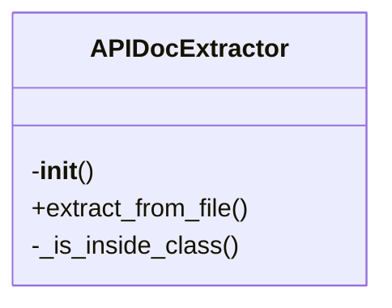

# API Documentation Generator

## File Overview

This file provides functionality for extracting and parsing API documentation from Python source code. It uses the Tree-Sitter parser to analyze code structure and extract information about functions, classes, parameters, return types, decorators, and docstrings. The extracted information can be used to generate API documentation.

## Classes

### Parameter

Represents a function or method parameter with its name, type, and default value.

**Key Methods:**
- `__init__(self, name: str, type_hint: str = "", default_value: str = "")` - Initializes a Parameter instance

### FunctionSignature

Represents the signature of a function including its name, parameters, return type, and decorators.

**Key Methods:**
- `__init__(self, name: str, parameters: list, return_type: str = "", decorators: list = [])` - Initializes a FunctionSignature instance

### ClassSignature

Represents the signature of a class including its name, methods, and decorators.

**Key Methods:**
- `__init__(self, name: str, methods: list, decorators: list = [])` - Initializes a ClassSignature instance

### APIDocExtractor

Main class for extracting API documentation from Python source code using Tree-Sitter parsing.

**Key Methods:**
- `__init__(self, parser: CodeParser)` - Initializes the extractor with a code parser
- `extract_from_file(self, file_path: Path)` - Extracts API documentation from a Python file
- `extract_from_code(self, code: str)` - Extracts API documentation from a code string
- `extract_functions(self, node: Node)` - Extracts function information from a node
- `extract_classes(self, node: Node)` - Extracts class information from a node
- `extract_parameters(self, node: Node)` - Extracts parameter information from a node
- `extract_return_type(self, node: Node)` - Extracts return type information from a node
- `extract_decorators(self, node: Node)` - Extracts decorator information from a node
- `extract_docstring(self, node: Node)` - Extracts docstring information from a node
- `parse_docstring(self, docstring: str)` - Parses a docstring into structured format

## Functions

### extract_python_parameters

Extracts parameter information from a function node.

**Parameters:**
- `node: Node` - Tree-Sitter node representing a function

**Returns:**
- `list[Parameter]` - List of Parameter objects

### extract_python_return_type

Extracts return type information from a function node.

**Parameters:**
- `node: Node` - Tree-Sitter node representing a function

**Returns:**
- `str` - Return type annotation as string

### extract_python_decorators

Extracts decorator information from a function or class node.

**Parameters:**
- `node: Node` - Tree-Sitter node representing a function or class

**Returns:**
- `list[str]` - List of decorator names as strings

### extract_python_docstring

Extracts docstring from a function or class node.

**Parameters:**
- `node: Node` - Tree-Sitter node representing a function or class

**Returns:**
- `str` - Docstring content as string

### parse_google_docstring

Parses Google-style docstrings into structured format.

**Parameters:**
- `docstring: str` - Raw docstring content

**Returns:**
- `dict` - Parsed docstring information

### parse_num

Parses numeric values from string representations.

**Parameters:**
- `value: str` - String representation of a number

**Returns:**
- `int` - Parsed integer value

## Usage Examples

### Basic Usage

```python
from local_deepwiki.generators.api_docs import APIDocExtractor
from local_deepwiki.core.parser import CodeParser

# Initialize parser and extractor
parser = CodeParser(Language.PYTHON)
extractor = APIDocExtractor(parser)

# Extract from file
doc_info = extractor.extract_from_file(Path("example.py"))

# Extract from code string
code = """
def example_function(param1: str, param2: int = 42) -> bool:
    \"\"\"Example function documentation.\"\"\"
    return True
"""
doc_info = extractor.extract_from_code(code)
```

### Extracting Function Information

```python
from local_deepwiki.generators.api_docs import extract_python_parameters, extract_python_return_type

# Assuming you have a Tree-Sitter node for a function
parameters = extract_python_parameters(function_node)
return_type = extract_python_return_type(function_node)
```

### Parsing Docstrings

```python
from local_deepwiki.generators.api_docs import parse_google_docstring

docstring = """
Args:
    param1: Description of param1
    param2: Description of param2

Returns:
    bool: Description of return value
"""
parsed = parse_google_docstring(docstring)
```

## Related Components

This file works with the following components:

- **[CodeParser](../core/parser.md)**: Used for parsing source code using Tree-Sitter
- **[find_nodes_by_type](../core/parser.md)**: Helper function for finding nodes of specific types
- **[get_node_text](../core/parser.md)**: Helper function for extracting text from nodes
- **[get_node_name](../core/parser.md)**: Helper function for extracting names from nodes
- **FUNCTION_NODE_TYPES**: Constant defining node types for functions
- **CLASS_NODE_TYPES**: Constant defining node types for classes
- **Language**: Enum defining supported programming languages
- **Node**: Tree-Sitter Node class for parsing AST nodes

## API Reference

### class `Parameter`

Represents a function parameter.

### class `FunctionSignature`

Represents a function/method signature.

### class `ClassSignature`

Represents a class signature.

### class `APIDocExtractor`

Extracts API documentation from source files.

**Methods:**

#### `__init__`

```python
def __init__()
```

Initialize the extractor.

#### `extract_from_file`

```python
def extract_from_file(file_path: Path) -> tuple[list[FunctionSignature], list[ClassSignature]]
```

Extract API documentation from a source file.


| Parameter | Type | Default | Description |
|-----------|------|---------|-------------|
| `file_path` | `Path` | - | Path to the source file. |


---

### Functions

#### `extract_python_parameters`

```python
def extract_python_parameters(func_node: Node, source: bytes) -> list[Parameter]
```

Extract parameters from a Python function definition.


| Parameter | Type | Default | Description |
|-----------|------|---------|-------------|
| `func_node` | `Node` | - | The function_definition AST node. |
| `source` | `bytes` | - | Source code bytes. |

**Returns:** `list[Parameter]`


#### `extract_python_return_type`

```python
def extract_python_return_type(func_node: Node, source: bytes) -> str | None
```

Extract return type annotation from a Python function.


| Parameter | Type | Default | Description |
|-----------|------|---------|-------------|
| `func_node` | `Node` | - | The function_definition AST node. |
| `source` | `bytes` | - | Source code bytes. |

**Returns:** `str | None`


#### `extract_python_decorators`

```python
def extract_python_decorators(func_node: Node, source: bytes) -> list[str]
```

Extract decorators from a Python function.


| Parameter | Type | Default | Description |
|-----------|------|---------|-------------|
| `func_node` | `Node` | - | The function_definition AST node. |
| `source` | `bytes` | - | Source code bytes. |

**Returns:** `list[str]`


#### `extract_python_docstring`

```python
def extract_python_docstring(node: Node, source: bytes) -> str | None
```

Extract docstring from a Python function or class.


| Parameter | Type | Default | Description |
|-----------|------|---------|-------------|
| `node` | `Node` | - | The function_definition or class_definition AST node. |
| `source` | `bytes` | - | Source code bytes. |

**Returns:** `str | None`


#### `parse_google_docstring`

```python
def parse_google_docstring(docstring: str) -> dict
```

Parse a Google-style docstring.


| Parameter | Type | Default | Description |
|-----------|------|---------|-------------|
| `docstring` | `str` | - | The docstring content. |

**Returns:** `dict`


#### `parse_numpy_docstring`

```python
def parse_numpy_docstring(docstring: str) -> dict
```

Parse a NumPy-style docstring.


| Parameter | Type | Default | Description |
|-----------|------|---------|-------------|
| `docstring` | `str` | - | The docstring content. |

**Returns:** `dict`


#### `parse_docstring`

```python
def parse_docstring(docstring: str) -> dict
```

Parse a docstring, auto-detecting format.


| Parameter | Type | Default | Description |
|-----------|------|---------|-------------|
| `docstring` | `str` | - | The docstring content. |

**Returns:** `dict`


#### `extract_function_signature`

```python
def extract_function_signature(func_node: Node, source: bytes, language: Language, class_name: str | None = None) -> FunctionSignature | None
```

Extract signature from a function node.


| Parameter | Type | Default | Description |
|-----------|------|---------|-------------|
| `func_node` | `Node` | - | The function AST node. |
| `source` | `bytes` | - | Source code bytes. |
| `language` | `Language` | - | Programming language. |
| `class_name` | `str | None` | `None` | Parent class name if this is a method. |

**Returns:** `FunctionSignature | None`


#### `extract_class_signature`

```python
def extract_class_signature(class_node: Node, source: bytes, language: Language) -> ClassSignature | None
```

Extract signature from a class node.


| Parameter | Type | Default | Description |
|-----------|------|---------|-------------|
| `class_node` | `Node` | - | The class AST node. |
| `source` | `bytes` | - | Source code bytes. |
| `language` | `Language` | - | Programming language. |

**Returns:** `ClassSignature | None`


#### `format_parameter`

```python
def format_parameter(param: Parameter) -> str
```

Format a parameter for display.


| Parameter | Type | Default | Description |
|-----------|------|---------|-------------|
| `param` | `Parameter` | - | The parameter to format. |

**Returns:** `str`


#### `format_function_signature_line`

```python
def format_function_signature_line(sig: FunctionSignature) -> str
```

Format a function signature as a single line.


| Parameter | Type | Default | Description |
|-----------|------|---------|-------------|
| `sig` | `FunctionSignature` | - | The function signature. |

**Returns:** `str`


#### `generate_api_reference_markdown`

```python
def generate_api_reference_markdown(functions: list[FunctionSignature], classes: list[ClassSignature], include_private: bool = False) -> str
```

Generate markdown API reference documentation.


| Parameter | Type | Default | Description |
|-----------|------|---------|-------------|
| `functions` | `list[FunctionSignature]` | - | List of function signatures. |
| `classes` | `list[ClassSignature]` | - | List of class signatures. |
| `include_private` | `bool` | `False` | Whether to include private (underscore) items. |

**Returns:** `str`


#### `get_file_api_docs`

```python
def get_file_api_docs(file_path: Path) -> str | None
```

Get API documentation for a single file.


| Parameter | Type | Default | Description |
|-----------|------|---------|-------------|
| `file_path` | `Path` | - | Path to the source file. |

**Returns:** `str | None`


## Class Diagram



## Call Graph

```mermaid
flowchart TD
    N0[APIDocExtractor]
    N1[APIDocExtractor.__init__]
    N2[APIDocExtractor.extract_fro...]
    N3[ClassSignature]
    N4[CodeParser]
    N5[FunctionSignature]
    N6[Parameter]
    N7[child_by_field_name]
    N8[extract_class_signature]
    N9[extract_from_file]
    N10[extract_function_signature]
    N11[extract_python_decorators]
    N12[extract_python_docstring]
    N13[extract_python_parameters]
    N14[extract_python_return_type]
    N15[find_nodes_by_type]
    N16[format_function_signature_line]
    N17[format_parameter]
    N18[generate_api_reference_mark...]
    N19[get_file_api_docs]
    N20[get_node_name]
    N21[get_node_text]
    N22[group]
    N23[lstrip]
    N24[match]
    N25[parse_docstring]
    N26[parse_file]
    N27[parse_google_docstring]
    N28[parse_numpy_docstring]
    N29[search]
    N13 --> N7
    N13 --> N21
    N13 --> N6
    N14 --> N7
    N14 --> N21
    N11 --> N21
    N12 --> N7
    N12 --> N21
    N27 --> N24
    N27 --> N22
    N28 --> N24
    N28 --> N22
    N25 --> N29
    N25 --> N27
    N25 --> N28
    N10 --> N20
    N10 --> N5
    N10 --> N13
    N10 --> N14
    N10 --> N11
    N10 --> N12
    N10 --> N25
    N10 --> N23
    N8 --> N20
    N8 --> N3
    N8 --> N21
    N8 --> N12
    N8 --> N25
    N8 --> N15
    N8 --> N10
    N16 --> N17
    N18 --> N16
    N19 --> N0
    N19 --> N9
    N19 --> N18
    N1 --> N4
    N2 --> N26
    N2 --> N15
    N2 --> N10
    N2 --> N8
    classDef func fill:#e1f5fe
    class N0,N3,N4,N5,N6,N7,N8,N9,N10,N11,N12,N13,N14,N15,N16,N17,N18,N19,N20,N21,N22,N23,N24,N25,N26,N27,N28,N29 func
    classDef method fill:#fff3e0
    class N1,N2 method
```



## Relevant Source Files

- `src/local_deepwiki/generators/api_docs.py:23-28`

## See Also

- [test_api_docs](../../../tests/test_api_docs.md) - uses this
- [wiki](wiki.md) - uses this
- [chunker](../core/chunker.md) - dependency
- [parser](../core/parser.md) - dependency
- [crosslinks](crosslinks.md) - shares 4 dependencies
