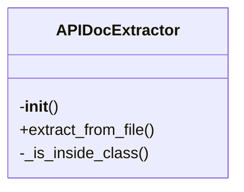

# API Documentation Extractor

## File Overview

This file provides functionality for extracting API documentation from code, specifically designed for Python code parsing. It includes utilities for parsing docstrings, extracting function signatures, and processing decorators. The module leverages the tree-sitter parsing library to analyze Python code structure and extract relevant documentation elements.

## Classes

### Parameter

Represents a function parameter with its name, type, and default value.

**Fields:**
- `name` (str): The name of the parameter
- `type_` (str): The type annotation of the parameter (optional)
- `default` (str): The default value of the parameter (optional)

### FunctionSignature

Represents the signature of a Python function, including its name, parameters, return type, and decorators.

**Fields:**
- `name` (str): The name of the function
- `parameters` (list[Parameter]): List of function parameters
- `return_type` (str): The return type annotation of the function (optional)
- `decorators` (list[str]): List of decorators applied to the function (optional)

### ClassSignature

Represents the signature of a Python class, including its name and decorators.

**Fields:**
- `name` (str): The name of the class
- `decorators` (list[str]): List of decorators applied to the class (optional)

### APIDocExtractor

Main class for extracting API documentation from Python code using tree-sitter parsing.

**Methods:**
- `extract_function_signatures(node: Node) -> list[FunctionSignature]`: Extracts function signatures from a given node
- `extract_class_signatures(node: Node) -> list[ClassSignature]`: Extracts class signatures from a given node
- `extract_docstring(node: Node) -> str`: Extracts the docstring from a given node

## Functions

### extract_python_parameters

Extracts parameter information from a Python function node.

**Parameters:**
- `node` (Node): The tree-sitter node representing the function

**Returns:**
- `list[Parameter]`: List of Parameter objects extracted from the function

### extract_python_return_type

Extracts the return type annotation from a Python function node.

**Parameters:**
- `node` (Node): The tree-sitter node representing the function

**Returns:**
- `str`: The return type annotation as a string, or empty string if not found

### extract_python_decorators

Extracts decorators from a Python function or class node.

**Parameters:**
- `node` (Node): The tree-sitter node representing the function or class

**Returns:**
- `list[str]`: List of decorator names as strings

### extract_python_docstring

Extracts the docstring from a Python function or class node.

**Parameters:**
- `node` (Node): The tree-sitter node representing the function or class

**Returns:**
- `str`: The docstring content as a string

### parse_google_docstring

Parses a Google-style docstring and extracts information.

**Parameters:**
- `docstring` (str): The docstring to parse

**Returns:**
- `dict`: Dictionary containing parsed docstring information

### parse_num

Parses a number from a string.

**Parameters:**
- `s` (str): The string to parse

**Returns:**
- `int`: The parsed integer value

## Usage Examples

### Extracting Function Signatures

```python
from tree_sitter import Language
from local_deepwiki.generators.api_docs import APIDocExtractor

# Initialize the extractor
extractor = APIDocExtractor()

# Assuming you have a tree-sitter node for a function
# function_node = ...
# signatures = extractor.extract_function_signatures(function_node)
```

### Extracting Docstrings

```python
# Extract docstring from a node
# docstring = extractor.extract_docstring(node)
```

### Parsing Google-style Docstrings

```python
# Parse a Google-style docstring
# parsed = parse_google_docstring(docstring)
```

## Related Components

This module works with the following components:

- **[CodeParser](../core/parser.md)**: Used for parsing code using tree-sitter
- **[find_nodes_by_type](../core/parser.md)**: Utility for finding nodes of specific types in the tree-sitter AST
- **[get_node_text](../core/parser.md)**: Utility for extracting text content from tree-sitter nodes
- **[get_node_name](../core/parser.md)**: Utility for extracting names from tree-sitter nodes
- **FUNCTION_NODE_TYPES**: Constants defining function node types for tree-sitter parsing
- **CLASS_NODE_TYPES**: Constants defining class node types for tree-sitter parsing
- **[Language](../models.md)**: Enum defining supported programming languages

The module integrates with the core parsing functionality provided by `local_deepwiki.core.parser` and `local_deepwiki.core.chunker` to extract meaningful API documentation from Python source code.

## API Reference

### class `Parameter`

Represents a function parameter.

### class `FunctionSignature`

Represents a function/method signature.

### class `ClassSignature`

Represents a class signature.

### class `APIDocExtractor`

Extracts API documentation from source files.

**Methods:**

#### `__init__`

```python
def __init__()
```

Initialize the extractor.

#### `extract_from_file`

```python
def extract_from_file(file_path: Path) -> tuple[list[FunctionSignature], list[ClassSignature]]
```

Extract API documentation from a source file.


| Parameter | Type | Default | Description |
|-----------|------|---------|-------------|
| `file_path` | `Path` | - | Path to the source file. |


---

### Functions

#### `extract_python_parameters`

```python
def extract_python_parameters(func_node: Node, source: bytes) -> list[Parameter]
```

Extract parameters from a Python function definition.


| Parameter | Type | Default | Description |
|-----------|------|---------|-------------|
| `func_node` | `Node` | - | The function_definition AST node. |
| `source` | `bytes` | - | Source code bytes. |

**Returns:** `list[Parameter]`


#### `extract_python_return_type`

```python
def extract_python_return_type(func_node: Node, source: bytes) -> str | None
```

Extract return type annotation from a Python function.


| Parameter | Type | Default | Description |
|-----------|------|---------|-------------|
| `func_node` | `Node` | - | The function_definition AST node. |
| `source` | `bytes` | - | Source code bytes. |

**Returns:** `str | None`


#### `extract_python_decorators`

```python
def extract_python_decorators(func_node: Node, source: bytes) -> list[str]
```

Extract decorators from a Python function.


| Parameter | Type | Default | Description |
|-----------|------|---------|-------------|
| `func_node` | `Node` | - | The function_definition AST node. |
| `source` | `bytes` | - | Source code bytes. |

**Returns:** `list[str]`


#### `extract_python_docstring`

```python
def extract_python_docstring(node: Node, source: bytes) -> str | None
```

Extract docstring from a Python function or class.


| Parameter | Type | Default | Description |
|-----------|------|---------|-------------|
| `node` | `Node` | - | The function_definition or class_definition AST node. |
| `source` | `bytes` | - | Source code bytes. |

**Returns:** `str | None`


#### `parse_google_docstring`

```python
def parse_google_docstring(docstring: str) -> dict
```

Parse a Google-style docstring.


| Parameter | Type | Default | Description |
|-----------|------|---------|-------------|
| `docstring` | `str` | - | The docstring content. |

**Returns:** `dict`


#### `parse_numpy_docstring`

```python
def parse_numpy_docstring(docstring: str) -> dict
```

Parse a NumPy-style docstring.


| Parameter | Type | Default | Description |
|-----------|------|---------|-------------|
| `docstring` | `str` | - | The docstring content. |

**Returns:** `dict`


#### `parse_docstring`

```python
def parse_docstring(docstring: str) -> dict
```

Parse a docstring, auto-detecting format.


| Parameter | Type | Default | Description |
|-----------|------|---------|-------------|
| `docstring` | `str` | - | The docstring content. |

**Returns:** `dict`


#### `extract_function_signature`

```python
def extract_function_signature(func_node: Node, source: bytes, language: Language, class_name: str | None = None) -> FunctionSignature | None
```

Extract signature from a function node.


| Parameter | Type | Default | Description |
|-----------|------|---------|-------------|
| `func_node` | `Node` | - | The function AST node. |
| `source` | `bytes` | - | Source code bytes. |
| `language` | [`Language`](../models.md) | - | Programming language. |
| `class_name` | `str | None` | `None` | Parent class name if this is a method. |

**Returns:** `FunctionSignature | None`


#### `extract_class_signature`

```python
def extract_class_signature(class_node: Node, source: bytes, language: Language) -> ClassSignature | None
```

Extract signature from a class node.


| Parameter | Type | Default | Description |
|-----------|------|---------|-------------|
| `class_node` | `Node` | - | The class AST node. |
| `source` | `bytes` | - | Source code bytes. |
| `language` | [`Language`](../models.md) | - | Programming language. |

**Returns:** `ClassSignature | None`


#### `format_parameter`

```python
def format_parameter(param: Parameter) -> str
```

Format a parameter for display.


| Parameter | Type | Default | Description |
|-----------|------|---------|-------------|
| `param` | `Parameter` | - | The parameter to format. |

**Returns:** `str`


#### `format_function_signature_line`

```python
def format_function_signature_line(sig: FunctionSignature) -> str
```

Format a function signature as a single line.


| Parameter | Type | Default | Description |
|-----------|------|---------|-------------|
| `sig` | `FunctionSignature` | - | The function signature. |

**Returns:** `str`


#### `generate_api_reference_markdown`

```python
def generate_api_reference_markdown(functions: list[FunctionSignature], classes: list[ClassSignature], include_private: bool = False) -> str
```

Generate markdown API reference documentation.


| Parameter | Type | Default | Description |
|-----------|------|---------|-------------|
| `functions` | `list[FunctionSignature]` | - | List of function signatures. |
| `classes` | `list[ClassSignature]` | - | List of class signatures. |
| `include_private` | `bool` | `False` | Whether to include private (underscore) items. |

**Returns:** `str`


#### `get_file_api_docs`

```python
def get_file_api_docs(file_path: Path) -> str | None
```

Get API documentation for a single file.


| Parameter | Type | Default | Description |
|-----------|------|---------|-------------|
| `file_path` | `Path` | - | Path to the source file. |

**Returns:** `str | None`


## Class Diagram



## Call Graph

```mermaid
flowchart TD
    N0[APIDocExtractor]
    N1[APIDocExtractor.__init__]
    N2[APIDocExtractor.extract_fro...]
    N3[ClassSignature]
    N4[CodeParser]
    N5[FunctionSignature]
    N6[Parameter]
    N7[child_by_field_name]
    N8[extract_class_signature]
    N9[extract_from_file]
    N10[extract_function_signature]
    N11[extract_python_decorators]
    N12[extract_python_docstring]
    N13[extract_python_parameters]
    N14[extract_python_return_type]
    N15[find_nodes_by_type]
    N16[format_function_signature_line]
    N17[format_parameter]
    N18[generate_api_reference_mark...]
    N19[get_file_api_docs]
    N20[get_node_name]
    N21[get_node_text]
    N22[group]
    N23[lstrip]
    N24[match]
    N25[parse_docstring]
    N26[parse_file]
    N27[parse_google_docstring]
    N28[parse_numpy_docstring]
    N29[search]
    N13 --> N7
    N13 --> N21
    N13 --> N6
    N14 --> N7
    N14 --> N21
    N11 --> N21
    N12 --> N7
    N12 --> N21
    N27 --> N24
    N27 --> N22
    N28 --> N24
    N28 --> N22
    N25 --> N29
    N25 --> N27
    N25 --> N28
    N10 --> N20
    N10 --> N5
    N10 --> N13
    N10 --> N14
    N10 --> N11
    N10 --> N12
    N10 --> N25
    N10 --> N23
    N8 --> N20
    N8 --> N3
    N8 --> N21
    N8 --> N12
    N8 --> N25
    N8 --> N15
    N8 --> N10
    N16 --> N17
    N18 --> N16
    N19 --> N0
    N19 --> N9
    N19 --> N18
    N1 --> N4
    N2 --> N26
    N2 --> N15
    N2 --> N10
    N2 --> N8
    classDef func fill:#e1f5fe
    class N0,N3,N4,N5,N6,N7,N8,N9,N10,N11,N12,N13,N14,N15,N16,N17,N18,N19,N20,N21,N22,N23,N24,N25,N26,N27,N28,N29 func
    classDef method fill:#fff3e0
    class N1,N2 method
```



## Relevant Source Files

- `src/local_deepwiki/generators/api_docs.py`

## See Also

- [test_api_docs](../../../tests/test_api_docs.md) - uses this
- [wiki](wiki.md) - uses this
- [models](../models.md) - dependency
- [parser](../core/parser.md) - dependency
- [chunker](../core/chunker.md) - dependency
