# API Documentation Generator

## File Overview

The `api_docs.py` file provides functionality for extracting and processing API documentation from Python code. It analyzes Python source code using tree-sitter parsing to extract function signatures, class definitions, docstrings, and other documentation-relevant information. The module supports parsing various docstring formats including Google and NumPy styles.

## Classes

### Parameter

A dataclass that represents a function or method parameter.

**Fields:**
- `name`: The parameter name
- `type_hint`: Optional type annotation for the parameter  
- `default_value`: Optional default value if the parameter has one
- `description`: Optional description extracted from docstring

### FunctionSignature

A dataclass that captures the complete signature and documentation of a function or method.

**Fields:**
- `name`: The function name
- `parameters`: List of Parameter objects representing the function arguments
- `return_type`: Optional return type annotation
- `decorators`: List of decorator names applied to the function
- `docstring`: The raw docstring text
- `parsed_docstring`: Dictionary containing parsed docstring components
- `line_number`: Line number where the function is defined
- `is_async`: Boolean indicating if this is an async function
- `is_method`: Boolean indicating if this is a class method
- `is_property`: Boolean indicating if this is a property
- `visibility`: String indicating visibility (public, private, protected)

### ClassSignature

A dataclass that represents a class definition with its methods and documentation.

**Fields:**
- `name`: The class name
- `base_classes`: List of base class names this class inherits from
- `methods`: List of FunctionSignature objects for class methods
- `properties`: List of FunctionSignature objects for class properties
- `docstring`: The raw class docstring
- `parsed_docstring`: Dictionary containing parsed docstring components
- `line_number`: Line number where the class is defined
- `decorators`: List of decorator names applied to the class
- `visibility`: String indicating visibility (public, private, protected)

### APIDocExtractor

The [main](../watcher.md) class responsible for extracting API documentation from Python source code.

**Methods:**
- `extract_from_file`: Extracts documentation from a single Python file
- `extract_from_content`: Extracts documentation from Python source code content
- `_extract_functions`: Internal method to extract function signatures
- `_extract_classes`: Internal method to extract class signatures

## Functions

### extract_python_parameters

Extracts parameter information from a Python function's parameter list node.

**Parameters:**
- `params_node`: Tree-sitter node representing the function parameters
- `source_code`: The source code string for context

**Returns:** List of Parameter objects

### extract_python_return_type

Extracts the return type annotation from a Python function node.

**Parameters:**
- `func_node`: Tree-sitter node representing the function
- `source_code`: The source code string for context

**Returns:** Optional string containing the return type

### extract_python_decorators

Extracts decorator names from a Python function or class node.

**Parameters:**
- `node`: Tree-sitter node representing the decorated item
- `source_code`: The source code string for context

**Returns:** List of decorator name strings

### extract_python_docstring

Extracts the docstring from a Python function or class node.

**Parameters:**
- `node`: Tree-sitter node representing the function or class
- `source_code`: The source code string for context

**Returns:** Optional string containing the docstring content

### parse_google_docstring

Parses a Google-style docstring into structured components.

**Parameters:**
- `docstring`: The raw docstring text to parse

**Returns:** Dictionary with parsed sections like args, returns, raises, etc.

### parse_numpy_docstring

Parses a NumPy-style docstring into structured components.

**Parameters:**
- `docstring`: The raw docstring text to parse

**Returns:** Dictionary with parsed sections following NumPy documentation format

### parse_docstring

General docstring parser that attempts to detect the format and parse accordingly.

**Parameters:**
- `docstring`: The raw docstring text to parse

**Returns:** Dictionary with parsed docstring components

## Usage Examples

### Extracting API Documentation from a File

```python
from local_deepwiki.generators.api_docs import APIDocExtractor

# Create an extractor instance
extractor = APIDocExtractor()

# Extract documentation from a Python file
file_path = Path("example.py")
functions, classes = extractor.extract_from_file(file_path)

# Process the extracted functions
for func in functions:
    print(f"Function: {func.name}")
    print(f"Parameters: {[p.name for p in func.parameters]}")
    print(f"Return type: {func.return_type}")
```

### Working with Function Signatures

```python
# Create a parameter
param = Parameter(
    name="value",
    type_hint="str", 
    default_value=None,
    description="Input value to process"
)

# Access function signature details
if func.is_async:
    print(f"Async function: {func.name}")

if func.decorators:
    print(f"Decorators: {func.decorators}")
```

### Parsing Docstrings

```python
from local_deepwiki.generators.api_docs import parse_docstring

docstring = '''
Process the input data.

Args:
    data: The input data to process
    options: Optional processing parameters

Returns:
    Processed data result
'''

parsed = parse_docstring(docstring)
print(parsed['args'])  # Parameter descriptions
print(parsed['returns'])  # Return value description
```

## Related Components

This module integrates with several other components from the local_deepwiki package:

- **[CodeParser](../core/parser.md)**: Used for parsing Python source code with tree-sitter
- **Language**: Enum defining supported programming languages
- **Core chunker**: Provides node type constants for classes and functions
- **Parser utilities**: Functions like [`find_nodes_by_type`](../core/parser.md), [`get_node_name`](../core/parser.md), and [`get_node_text`](../core/parser.md) for tree-sitter node manipulation

The module works with tree-sitter Node objects to analyze Python syntax trees and extract structured documentation information.

## API Reference

### class `Parameter`

Represents a function parameter.

### class `FunctionSignature`

Represents a function/method signature.

### class `ClassSignature`

Represents a class signature.

### class `APIDocExtractor`

Extracts API documentation from source files.

**Methods:**

#### `__init__`

```python
def __init__()
```

Initialize the extractor.

#### `extract_from_file`

```python
def extract_from_file(file_path: Path) -> tuple[list[FunctionSignature], list[ClassSignature]]
```

Extract API documentation from a source file.


| Parameter | Type | Default | Description |
|-----------|------|---------|-------------|
| `file_path` | `Path` | - | Path to the source file. |


---

### Functions

#### `extract_python_parameters`

```python
def extract_python_parameters(func_node: Node, source: bytes) -> list[Parameter]
```

Extract parameters from a Python function definition.


| Parameter | Type | Default | Description |
|-----------|------|---------|-------------|
| `func_node` | `Node` | - | The function_definition AST node. |
| `source` | `bytes` | - | Source code bytes. |

**Returns:** `list[Parameter]`


#### `extract_python_return_type`

```python
def extract_python_return_type(func_node: Node, source: bytes) -> str | None
```

Extract return type annotation from a Python function.


| Parameter | Type | Default | Description |
|-----------|------|---------|-------------|
| `func_node` | `Node` | - | The function_definition AST node. |
| `source` | `bytes` | - | Source code bytes. |

**Returns:** `str | None`


#### `extract_python_decorators`

```python
def extract_python_decorators(func_node: Node, source: bytes) -> list[str]
```

Extract decorators from a Python function.


| Parameter | Type | Default | Description |
|-----------|------|---------|-------------|
| `func_node` | `Node` | - | The function_definition AST node. |
| `source` | `bytes` | - | Source code bytes. |

**Returns:** `list[str]`


#### `extract_python_docstring`

```python
def extract_python_docstring(node: Node, source: bytes) -> str | None
```

Extract docstring from a Python function or class.


| Parameter | Type | Default | Description |
|-----------|------|---------|-------------|
| `node` | `Node` | - | The function_definition or class_definition AST node. |
| `source` | `bytes` | - | Source code bytes. |

**Returns:** `str | None`


#### `parse_google_docstring`

```python
def parse_google_docstring(docstring: str) -> dict
```

Parse a Google-style docstring.


| Parameter | Type | Default | Description |
|-----------|------|---------|-------------|
| `docstring` | `str` | - | The docstring content. |

**Returns:** `dict`


#### `parse_numpy_docstring`

```python
def parse_numpy_docstring(docstring: str) -> dict
```

Parse a NumPy-style docstring.


| Parameter | Type | Default | Description |
|-----------|------|---------|-------------|
| `docstring` | `str` | - | The docstring content. |

**Returns:** `dict`


#### `parse_docstring`

```python
def parse_docstring(docstring: str) -> dict
```

Parse a docstring, auto-detecting format.


| Parameter | Type | Default | Description |
|-----------|------|---------|-------------|
| `docstring` | `str` | - | The docstring content. |

**Returns:** `dict`


#### `extract_function_signature`

```python
def extract_function_signature(func_node: Node, source: bytes, language: Language, class_name: str | None = None) -> FunctionSignature | None
```

Extract signature from a function node.


| Parameter | Type | Default | Description |
|-----------|------|---------|-------------|
| `func_node` | `Node` | - | The function AST node. |
| `source` | `bytes` | - | Source code bytes. |
| `language` | `Language` | - | Programming language. |
| `class_name` | `str | None` | `None` | Parent class name if this is a method. |

**Returns:** `FunctionSignature | None`


#### `extract_class_signature`

```python
def extract_class_signature(class_node: Node, source: bytes, language: Language) -> ClassSignature | None
```

Extract signature from a class node.


| Parameter | Type | Default | Description |
|-----------|------|---------|-------------|
| `class_node` | `Node` | - | The class AST node. |
| `source` | `bytes` | - | Source code bytes. |
| `language` | `Language` | - | Programming language. |

**Returns:** `ClassSignature | None`


#### `format_parameter`

```python
def format_parameter(param: Parameter) -> str
```

Format a parameter for display.


| Parameter | Type | Default | Description |
|-----------|------|---------|-------------|
| `param` | `Parameter` | - | The parameter to format. |

**Returns:** `str`


#### `format_function_signature_line`

```python
def format_function_signature_line(sig: FunctionSignature) -> str
```

Format a function signature as a single line.


| Parameter | Type | Default | Description |
|-----------|------|---------|-------------|
| `sig` | `FunctionSignature` | - | The function signature. |

**Returns:** `str`


#### `generate_api_reference_markdown`

```python
def generate_api_reference_markdown(functions: list[FunctionSignature], classes: list[ClassSignature], include_private: bool = False) -> str
```

Generate markdown API reference documentation.


| Parameter | Type | Default | Description |
|-----------|------|---------|-------------|
| `functions` | `list[FunctionSignature]` | - | List of function signatures. |
| `classes` | `list[ClassSignature]` | - | List of class signatures. |
| `include_private` | `bool` | `False` | Whether to include private (underscore) items. |

**Returns:** `str`


#### `get_file_api_docs`

```python
def get_file_api_docs(file_path: Path) -> str | None
```

Get API documentation for a single file.


| Parameter | Type | Default | Description |
|-----------|------|---------|-------------|
| `file_path` | `Path` | - | Path to the source file. |

**Returns:** `str | None`


## Class Diagram


## Call Graph

```mermaid
flowchart TD
    N0[APIDocExtractor]
    N1[APIDocExtractor.__init__]
    N2[APIDocExtractor.extract_fro...]
    N3[ClassSignature]
    N4[CodeParser]
    N5[FunctionSignature]
    N6[Parameter]
    N7[child_by_field_name]
    N8[extract_class_signature]
    N9[extract_from_file]
    N10[extract_function_signature]
    N11[extract_python_decorators]
    N12[extract_python_docstring]
    N13[extract_python_parameters]
    N14[extract_python_return_type]
    N15[find_nodes_by_type]
    N16[format_function_signature_line]
    N17[format_parameter]
    N18[generate_api_reference_mark...]
    N19[get_file_api_docs]
    N20[get_node_name]
    N21[get_node_text]
    N22[group]
    N23[lstrip]
    N24[match]
    N25[parse_docstring]
    N26[parse_file]
    N27[parse_google_docstring]
    N28[parse_numpy_docstring]
    N29[search]
    N13 --> N7
    N13 --> N21
    N13 --> N6
    N14 --> N7
    N14 --> N21
    N11 --> N21
    N12 --> N7
    N12 --> N21
    N27 --> N24
    N27 --> N22
    N28 --> N24
    N28 --> N22
    N25 --> N29
    N25 --> N27
    N25 --> N28
    N10 --> N20
    N10 --> N5
    N10 --> N13
    N10 --> N14
    N10 --> N11
    N10 --> N12
    N10 --> N25
    N10 --> N23
    N8 --> N20
    N8 --> N3
    N8 --> N21
    N8 --> N12
    N8 --> N25
    N8 --> N15
    N8 --> N10
    N16 --> N17
    N18 --> N16
    N19 --> N0
    N19 --> N9
    N19 --> N18
    N1 --> N4
    N2 --> N26
    N2 --> N15
    N2 --> N10
    N2 --> N8
    classDef func fill:#e1f5fe
    class N0,N3,N4,N5,N6,N7,N8,N9,N10,N11,N12,N13,N14,N15,N16,N17,N18,N19,N20,N21,N22,N23,N24,N25,N26,N27,N28,N29 func
    classDef method fill:#fff3e0
    class N1,N2 method
```



## Relevant Source Files

- `src/local_deepwiki/generators/api_docs.py:15-21`

## See Also

- [test_api_docs](../../../tests/test_api_docs.md) - uses this
- [crosslinks](crosslinks.md) - shares 4 dependencies
- [diagrams](diagrams.md) - shares 4 dependencies
