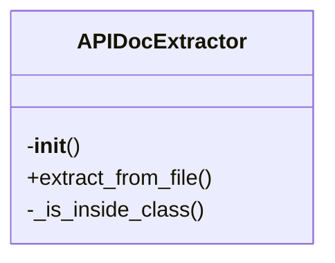

# API Documentation Generator

## File Overview

This file implements the API documentation extraction functionality for the local_deepwiki system. It provides tools for parsing Python code and extracting structured documentation information including function signatures, parameters, return types, decorators, and docstrings. The module is designed to work with the tree_sitter parsing library to analyze code structure and extract meaningful API documentation components.

This file integrates with the core parser and chunker components to process Python code into structured API documentation elements. It serves as a bridge between raw code parsing and the higher-level documentation generation system.

## Classes

### Parameter

Represents a function parameter with its name, type annotation, and default value.

**Attributes:**
- `name` (str): The parameter name
- `type_annotation` (str): The type annotation if present
- `default_value` (str): The default value if specified

**Usage:**
```python
param = Parameter(name="x", type_annotation="int", default_value="0")
```

### FunctionSignature

Represents the signature of a Python function including its name, parameters, return type, and decorators.

**Attributes:**
- `name` (str): Function name
- `parameters` (list[Parameter]): List of function parameters
- `return_type` (str): Return type annotation
- `decorators` (list[str]): List of decorators applied to the function
- `docstring` (str): Function docstring

**Usage:**
```python
signature = FunctionSignature(
    name="my_function",
    parameters=[param1, param2],
    return_type="str",
    decorators=["@staticmethod"],
    docstring="This function does something"
)
```

### ClassSignature

Represents the signature of a Python class including its name, methods, and decorators.

**Attributes:**
- `name` (str): Class name
- `methods` (list[FunctionSignature]): List of methods defined in the class
- `decorators` (list[str]): List of decorators applied to the class
- `docstring` (str): Class docstring

**Usage:**
```python
class_sig = ClassSignature(
    name="MyClass",
    methods=[method1, method2],
    decorators=["@dataclass"],
    docstring="A sample class"
)
```

### APIDocExtractor

Main class for extracting API documentation from Python code. This class coordinates the parsing and extraction of function and class signatures from source code.

**Key Methods:**
- `extract_from_code(code: str) -> list[FunctionSignature | ClassSignature]`: Extracts all API signatures from the given code string
- `extract_from_file(file_path: Path) -> list[FunctionSignature | ClassSignature]`: Extracts API signatures from a file

**Usage:**
```python
extractor = APIDocExtractor()
signatures = extractor.extract_from_code("def hello(name: str) -> str: pass")
```

## Functions

### extract_python_parameters

Parses function parameters from a tree_sitter node and returns a list of Parameter objects.

**Parameters:**
- `node` (Node): The tree_sitter node representing function parameters

**Returns:**
- `list[Parameter]`: List of Parameter objects extracted from the node

### extract_python_return_type

Extracts the return type annotation from a function definition node.

**Parameters:**
- `node` (Node): The tree_sitter node representing function definition

**Returns:**
- `str`: Return type annotation as string, or empty string if not found

### extract_python_decorators

Extracts decorator information from a function or class definition node.

**Parameters:**
- `node` (Node): The tree_sitter node representing function or class definition

**Returns:**
- `list[str]`: List of decorator strings

### extract_python_docstring

Extracts the docstring from a function or class definition node.

**Parameters:**
- `node` (Node): The tree_sitter node representing function or class definition

**Returns:**
- `str`: Docstring content as string, or empty string if not found

### parse_google_docstring

Parses Google-style docstrings and extracts parameter and return information.

**Parameters:**
- `docstring` (str): The docstring to parse

**Returns:**
- `dict`: Dictionary containing parsed parameter and return information

### parse_num

Parses numeric values from strings, handling various number formats.

**Parameters:**
- `s` (str): String to parse

**Returns:**
- `int | float | str`: Parsed number or original string if not numeric

## Usage Examples

### Basic API Extraction

```python
from local_deepwiki.generators.api_docs import APIDocExtractor

# Create extractor
extractor = APIDocExtractor()

# Extract from code string
code = """
def process_data(items: list, multiplier: float = 1.0) -> dict:
    \"\"\"Process a list of items and return results.
    
    Args:
        items: List of items to process
        multiplier: Scaling factor
        
    Returns:
        Processed results dictionary
    \"\"\"
    pass

class DataProcessor:
    \"\"\"Handles data processing operations.\"\"\"
    
    def __init__(self, config: dict):
        pass
"""

signatures = extractor.extract_from_code(code)
for sig in signatures:
    print(f"Name: {sig.name}")
    if hasattr(sig, 'parameters'):
        for param in sig.parameters:
            print(f"  Parameter: {param.name}")
```

### File-based Extraction

```python
from local_deepwiki.generators.api_docs import APIDocExtractor
from pathlib import Path

extractor = APIDocExtractor()
signatures = extractor.extract_from_file(Path("path/to/module.py"))
```

## Related Components

This module works with [CodeParser](../core/parser.md) to perform the underlying code parsing operations. It integrates with the chunker module through the FUNCTION_NODE_TYPES and CLASS_NODE_TYPES constants to identify code elements to process. The extracted documentation information is used by higher-level documentation generation components to create comprehensive API documentation.

## API Reference

### class `Parameter`

Represents a function parameter.

### class `FunctionSignature`

Represents a function/method signature.

### class `ClassSignature`

Represents a class signature.

### class `APIDocExtractor`

Extracts API documentation from source files.

**Methods:**

#### `__init__`

```python
def __init__()
```

Initialize the extractor.

#### `extract_from_file`

```python
def extract_from_file(file_path: Path) -> tuple[list[FunctionSignature], list[ClassSignature]]
```

Extract API documentation from a source file.


| Parameter | Type | Default | Description |
|-----------|------|---------|-------------|
| `file_path` | `Path` | - | Path to the source file. |


---

### Functions

#### `extract_python_parameters`

```python
def extract_python_parameters(func_node: Node, source: bytes) -> list[Parameter]
```

Extract parameters from a Python function definition.


| Parameter | Type | Default | Description |
|-----------|------|---------|-------------|
| `func_node` | `Node` | - | The function_definition AST node. |
| `source` | `bytes` | - | Source code bytes. |

**Returns:** `list[Parameter]`


#### `extract_python_return_type`

```python
def extract_python_return_type(func_node: Node, source: bytes) -> str | None
```

Extract return type annotation from a Python function.


| Parameter | Type | Default | Description |
|-----------|------|---------|-------------|
| `func_node` | `Node` | - | The function_definition AST node. |
| `source` | `bytes` | - | Source code bytes. |

**Returns:** `str | None`


#### `extract_python_decorators`

```python
def extract_python_decorators(func_node: Node, source: bytes) -> list[str]
```

Extract decorators from a Python function.


| Parameter | Type | Default | Description |
|-----------|------|---------|-------------|
| `func_node` | `Node` | - | The function_definition AST node. |
| `source` | `bytes` | - | Source code bytes. |

**Returns:** `list[str]`


#### `extract_python_docstring`

```python
def extract_python_docstring(node: Node, source: bytes) -> str | None
```

Extract docstring from a Python function or class.


| Parameter | Type | Default | Description |
|-----------|------|---------|-------------|
| `node` | `Node` | - | The function_definition or class_definition AST node. |
| `source` | `bytes` | - | Source code bytes. |

**Returns:** `str | None`


#### `parse_google_docstring`

```python
def parse_google_docstring(docstring: str) -> dict
```

Parse a Google-style docstring.


| Parameter | Type | Default | Description |
|-----------|------|---------|-------------|
| `docstring` | `str` | - | The docstring content. |

**Returns:** `dict`


#### `parse_numpy_docstring`

```python
def parse_numpy_docstring(docstring: str) -> dict
```

Parse a NumPy-style docstring.


| Parameter | Type | Default | Description |
|-----------|------|---------|-------------|
| `docstring` | `str` | - | The docstring content. |

**Returns:** `dict`


#### `parse_docstring`

```python
def parse_docstring(docstring: str) -> dict
```

Parse a docstring, auto-detecting format.


| Parameter | Type | Default | Description |
|-----------|------|---------|-------------|
| `docstring` | `str` | - | The docstring content. |

**Returns:** `dict`


#### `extract_function_signature`

```python
def extract_function_signature(func_node: Node, source: bytes, language: Language, class_name: str | None = None) -> FunctionSignature | None
```

Extract signature from a function node.


| Parameter | Type | Default | Description |
|-----------|------|---------|-------------|
| `func_node` | `Node` | - | The function AST node. |
| `source` | `bytes` | - | Source code bytes. |
| `language` | [`Language`](../models.md) | - | Programming language. |
| `class_name` | `str | None` | `None` | Parent class name if this is a method. |

**Returns:** `FunctionSignature | None`


#### `extract_class_signature`

```python
def extract_class_signature(class_node: Node, source: bytes, language: Language) -> ClassSignature | None
```

Extract signature from a class node.


| Parameter | Type | Default | Description |
|-----------|------|---------|-------------|
| `class_node` | `Node` | - | The class AST node. |
| `source` | `bytes` | - | Source code bytes. |
| `language` | [`Language`](../models.md) | - | Programming language. |

**Returns:** `ClassSignature | None`


#### `format_parameter`

```python
def format_parameter(param: Parameter) -> str
```

Format a parameter for display.


| Parameter | Type | Default | Description |
|-----------|------|---------|-------------|
| `param` | `Parameter` | - | The parameter to format. |

**Returns:** `str`


#### `format_function_signature_line`

```python
def format_function_signature_line(sig: FunctionSignature) -> str
```

Format a function signature as a single line.


| Parameter | Type | Default | Description |
|-----------|------|---------|-------------|
| `sig` | `FunctionSignature` | - | The function signature. |

**Returns:** `str`


#### `generate_api_reference_markdown`

```python
def generate_api_reference_markdown(functions: list[FunctionSignature], classes: list[ClassSignature], include_private: bool = False) -> str
```

Generate markdown API reference documentation.


| Parameter | Type | Default | Description |
|-----------|------|---------|-------------|
| `functions` | `list[FunctionSignature]` | - | List of function signatures. |
| `classes` | `list[ClassSignature]` | - | List of class signatures. |
| `include_private` | `bool` | `False` | Whether to include private (underscore) items. |

**Returns:** `str`


#### `get_file_api_docs`

```python
def get_file_api_docs(file_path: Path) -> str | None
```

Get API documentation for a single file.


| Parameter | Type | Default | Description |
|-----------|------|---------|-------------|
| `file_path` | `Path` | - | Path to the source file. |

**Returns:** `str | None`


## Class Diagram



## Call Graph

```mermaid
flowchart TD
    N0[APIDocExtractor]
    N1[APIDocExtractor.__init__]
    N2[APIDocExtractor.extract_fro...]
    N3[ClassSignature]
    N4[CodeParser]
    N5[FunctionSignature]
    N6[Parameter]
    N7[child_by_field_name]
    N8[extract_class_signature]
    N9[extract_from_file]
    N10[extract_function_signature]
    N11[extract_python_decorators]
    N12[extract_python_docstring]
    N13[extract_python_parameters]
    N14[extract_python_return_type]
    N15[find_nodes_by_type]
    N16[format_function_signature_line]
    N17[format_parameter]
    N18[generate_api_reference_mark...]
    N19[get_file_api_docs]
    N20[get_node_name]
    N21[get_node_text]
    N22[group]
    N23[lstrip]
    N24[match]
    N25[parse_docstring]
    N26[parse_file]
    N27[parse_google_docstring]
    N28[parse_numpy_docstring]
    N29[search]
    N13 --> N7
    N13 --> N21
    N13 --> N6
    N14 --> N7
    N14 --> N21
    N11 --> N21
    N12 --> N7
    N12 --> N21
    N27 --> N24
    N27 --> N22
    N28 --> N24
    N28 --> N22
    N25 --> N29
    N25 --> N27
    N25 --> N28
    N10 --> N20
    N10 --> N5
    N10 --> N13
    N10 --> N14
    N10 --> N11
    N10 --> N12
    N10 --> N25
    N10 --> N23
    N8 --> N20
    N8 --> N3
    N8 --> N21
    N8 --> N12
    N8 --> N25
    N8 --> N15
    N8 --> N10
    N16 --> N17
    N18 --> N16
    N19 --> N0
    N19 --> N9
    N19 --> N18
    N1 --> N4
    N2 --> N26
    N2 --> N15
    N2 --> N10
    N2 --> N8
    classDef func fill:#e1f5fe
    class N0,N3,N4,N5,N6,N7,N8,N9,N10,N11,N12,N13,N14,N15,N16,N17,N18,N19,N20,N21,N22,N23,N24,N25,N26,N27,N28,N29 func
    classDef method fill:#fff3e0
    class N1,N2 method
```



## See Also

- [wiki](wiki.md) - uses this
- [test_api_docs](../../../tests/test_api_docs.md) - uses this
- [chunker](../core/chunker.md) - dependency
- [models](../models.md) - dependency
- [parser](../core/parser.md) - dependency
