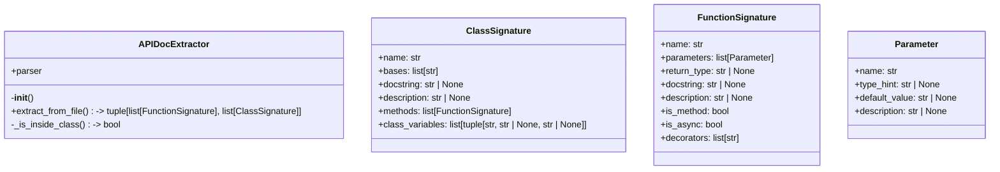

# API Documentation Generator

## File Overview

The `api_docs.py` module provides functionality for extracting and generating API documentation from Python source code. It uses Tree-sitter parsing to analyze Python code structure and extract detailed information about classes, functions, parameters, and docstrings. The module supports parsing various docstring formats including Google-style and NumPy-style documentation.

## Classes

### Parameter

A dataclass that represents a function or method parameter with its metadata.

**Fields:**
- `name`: The parameter name
- `type_annotation`: Optional type annotation for the parameter
- `default_value`: Optional default value if the parameter has one
- `description`: Optional description extracted from docstrings

### FunctionSignature

A dataclass that captures the complete signature and metadata of a function or method.

**Fields:**
- `name`: The function name
- `parameters`: List of Parameter objects representing function arguments
- `return_type`: Optional return type annotation
- `decorators`: List of [decorator](../providers/base.md) names applied to the function
- `docstring`: The raw docstring text
- `description`: Parsed description from the docstring
- `args_description`: Dictionary mapping parameter names to their descriptions
- `returns_description`: Description of the return value
- `raises`: Dictionary mapping exception types to their descriptions

### ClassSignature

A dataclass that represents a class with its methods and metadata.

**Fields:**
- `name`: The class name
- `methods`: List of FunctionSignature objects for class methods
- `docstring`: The raw class docstring
- `description`: Parsed description from the class docstring
- `base_classes`: List of base class names (defaults to empty list)

### APIDocExtractor

The [main](../export/pdf.md) class responsible for extracting API documentation from Python source code using Tree-sitter parsing.

**Methods:**
- Extracts function and class signatures from parsed code
- Processes docstrings and parameter information
- Handles different docstring formats (Google-style, NumPy-style)
- Generates structured documentation data

## Functions

### extract_python_parameters
Extracts parameter information from a Python function node, including names, type annotations, and default values.

### extract_python_return_type
Extracts the return type annotation from a Python function node.

### extract_python_decorators
Extracts [decorator](../providers/base.md) names applied to a Python function or class.

### extract_python_docstring
Extracts the docstring from a Python function or class node.

### parse_google_docstring
Parses Google-style docstrings to extract structured information including parameter descriptions, return value descriptions, and exception documentation.

### parse_numpy_docstring
Parses NumPy-style docstrings to extract structured documentation information.

### parse_docstring
Generic docstring parser that attempts to parse various docstring formats and falls back to extracting basic description information.

## Usage Examples

```python
from local_deepwiki.generators.api_docs import APIDocExtractor
from local_deepwiki.core.parser import CodeParser
from local_deepwiki.models import Language

# Create a code parser for Python
parser = CodeParser(Language.PYTHON)

# Parse a Python file
with open("example.py", "r") as f:
    code = f.read()
tree = parser.parse(code)

# Extract API documentation
extractor = APIDocExtractor()
# Use extractor methods to process the parsed tree and extract documentation
```

```python
from local_deepwiki.generators.api_docs import Parameter, FunctionSignature

# Create parameter objects
param1 = Parameter(name="x", type_annotation="int", default_value=None)
param2 = Parameter(name="y", type_annotation="str", default_value="'default'")

# Create function signature
func_sig = FunctionSignature(
    name="example_function",
    parameters=[param1, param2],
    return_type="bool",
    decorators=["staticmethod"],
    docstring="Example function docstring"
)
```

## Related Components

This module integrates with several other components:

- **[CodeParser](../core/parser.md)**: Used for parsing Python source code with Tree-sitter
- **[Language](../models.md)**: Enumeration for specifying the programming language (Python)
- **Core chunker**: Utilizes `CLASS_NODE_TYPES` and `FUNCTION_NODE_TYPES` constants for identifying relevant code nodes
- **Parser utilities**: Uses functions like [`find_nodes_by_type`](../core/parser.md), [`get_node_name`](../core/parser.md), and [`get_node_text`](../core/parser.md) for Tree-sitter node manipulation

The module serves as a specialized component for API documentation generation within the larger local_deepwiki system, focusing specifically on extracting structured information from Python codebases.

## API Reference

### class `Parameter`

Represents a function parameter.

### class `FunctionSignature`

Represents a function/method signature.

### class `ClassSignature`

Represents a class signature.

### class `APIDocExtractor`

Extracts API documentation from source files.

**Methods:**

#### `__init__`

```python
def __init__()
```

Initialize the extractor.

#### `extract_from_file`

```python
def extract_from_file(file_path: Path) -> tuple[list[FunctionSignature], list[ClassSignature]]
```

Extract API documentation from a source file.


| Parameter | Type | Default | Description |
|-----------|------|---------|-------------|
| `file_path` | `Path` | - | Path to the source file. |


---

### Functions

#### `extract_python_parameters`

```python
def extract_python_parameters(func_node: Node, source: bytes) -> list[Parameter]
```

Extract parameters from a Python function definition.


| Parameter | Type | Default | Description |
|-----------|------|---------|-------------|
| `func_node` | `Node` | - | The function_definition AST node. |
| `source` | `bytes` | - | Source code bytes. |

**Returns:** `list[Parameter]`


#### `extract_python_return_type`

```python
def extract_python_return_type(func_node: Node, source: bytes) -> str | None
```

Extract return type annotation from a Python function.


| Parameter | Type | Default | Description |
|-----------|------|---------|-------------|
| `func_node` | `Node` | - | The function_definition AST node. |
| `source` | `bytes` | - | Source code bytes. |

**Returns:** `str | None`


#### `extract_python_decorators`

```python
def extract_python_decorators(func_node: Node, source: bytes) -> list[str]
```

Extract decorators from a Python function.


| Parameter | Type | Default | Description |
|-----------|------|---------|-------------|
| `func_node` | `Node` | - | The function_definition AST node. |
| `source` | `bytes` | - | Source code bytes. |

**Returns:** `list[str]`


#### `extract_python_docstring`

```python
def extract_python_docstring(node: Node, source: bytes) -> str | None
```

Extract docstring from a Python function or class.


| Parameter | Type | Default | Description |
|-----------|------|---------|-------------|
| `node` | `Node` | - | The function_definition or class_definition AST node. |
| `source` | `bytes` | - | Source code bytes. |

**Returns:** `str | None`


#### `parse_google_docstring`

```python
def parse_google_docstring(docstring: str) -> dict
```

Parse a Google-style docstring.


| Parameter | Type | Default | Description |
|-----------|------|---------|-------------|
| `docstring` | `str` | - | The docstring content. |

**Returns:** `dict`


#### `parse_numpy_docstring`

```python
def parse_numpy_docstring(docstring: str) -> dict
```

Parse a NumPy-style docstring.


| Parameter | Type | Default | Description |
|-----------|------|---------|-------------|
| `docstring` | `str` | - | The docstring content. |

**Returns:** `dict`


#### `parse_docstring`

```python
def parse_docstring(docstring: str) -> dict
```

Parse a docstring, auto-detecting format.


| Parameter | Type | Default | Description |
|-----------|------|---------|-------------|
| `docstring` | `str` | - | The docstring content. |

**Returns:** `dict`


#### `extract_function_signature`

```python
def extract_function_signature(func_node: Node, source: bytes, language: Language, class_name: str | None = None) -> FunctionSignature | None
```

Extract signature from a function node.


| Parameter | Type | Default | Description |
|-----------|------|---------|-------------|
| `func_node` | `Node` | - | The function AST node. |
| `source` | `bytes` | - | Source code bytes. |
| `language` | [`Language`](../models.md) | - | Programming language. |
| `class_name` | `str | None` | `None` | Parent class name if this is a method. |

**Returns:** `FunctionSignature | None`


#### `extract_class_signature`

```python
def extract_class_signature(class_node: Node, source: bytes, language: Language) -> ClassSignature | None
```

Extract signature from a class node.


| Parameter | Type | Default | Description |
|-----------|------|---------|-------------|
| `class_node` | `Node` | - | The class AST node. |
| `source` | `bytes` | - | Source code bytes. |
| `language` | [`Language`](../models.md) | - | Programming language. |

**Returns:** `ClassSignature | None`


#### `format_parameter`

```python
def format_parameter(param: Parameter) -> str
```

Format a parameter for display.


| Parameter | Type | Default | Description |
|-----------|------|---------|-------------|
| `param` | `Parameter` | - | The parameter to format. |

**Returns:** `str`


#### `format_function_signature_line`

```python
def format_function_signature_line(sig: FunctionSignature) -> str
```

Format a function signature as a single line.


| Parameter | Type | Default | Description |
|-----------|------|---------|-------------|
| `sig` | `FunctionSignature` | - | The function signature. |

**Returns:** `str`


#### `generate_api_reference_markdown`

```python
def generate_api_reference_markdown(functions: list[FunctionSignature], classes: list[ClassSignature], include_private: bool = False) -> str
```

Generate markdown API reference documentation.


| Parameter | Type | Default | Description |
|-----------|------|---------|-------------|
| `functions` | `list[FunctionSignature]` | - | List of function signatures. |
| `classes` | `list[ClassSignature]` | - | List of class signatures. |
| `include_private` | `bool` | `False` | Whether to include private (underscore) items. |

**Returns:** `str`


#### `get_file_api_docs`

```python
def get_file_api_docs(file_path: Path) -> str | None
```

Get API documentation for a single file.


| Parameter | Type | Default | Description |
|-----------|------|---------|-------------|
| `file_path` | `Path` | - | Path to the source file. |

**Returns:** `str | None`


## Class Diagram



## Call Graph

```mermaid
flowchart TD
    N0[APIDocExtractor]
    N1[APIDocExtractor.__init__]
    N2[APIDocExtractor.extract_fro...]
    N3[ClassSignature]
    N4[CodeParser]
    N5[FunctionSignature]
    N6[Parameter]
    N7[child_by_field_name]
    N8[extract_class_signature]
    N9[extract_from_file]
    N10[extract_function_signature]
    N11[extract_python_decorators]
    N12[extract_python_docstring]
    N13[extract_python_parameters]
    N14[extract_python_return_type]
    N15[find_nodes_by_type]
    N16[format_function_signature_line]
    N17[format_parameter]
    N18[generate_api_reference_mark...]
    N19[get_file_api_docs]
    N20[get_node_name]
    N21[get_node_text]
    N22[group]
    N23[lstrip]
    N24[match]
    N25[parse_docstring]
    N26[parse_file]
    N27[parse_google_docstring]
    N28[parse_numpy_docstring]
    N29[search]
    N13 --> N7
    N13 --> N21
    N13 --> N6
    N14 --> N7
    N14 --> N21
    N11 --> N21
    N12 --> N7
    N12 --> N21
    N27 --> N24
    N27 --> N22
    N28 --> N24
    N28 --> N22
    N25 --> N29
    N25 --> N27
    N25 --> N28
    N10 --> N20
    N10 --> N5
    N10 --> N13
    N10 --> N14
    N10 --> N11
    N10 --> N12
    N10 --> N25
    N10 --> N23
    N8 --> N20
    N8 --> N3
    N8 --> N21
    N8 --> N12
    N8 --> N25
    N8 --> N15
    N8 --> N10
    N16 --> N17
    N18 --> N16
    N19 --> N0
    N19 --> N9
    N19 --> N18
    N1 --> N4
    N2 --> N26
    N2 --> N15
    N2 --> N10
    N2 --> N8
    classDef func fill:#e1f5fe
    class N0,N3,N4,N5,N6,N7,N8,N9,N10,N11,N12,N13,N14,N15,N16,N17,N18,N19,N20,N21,N22,N23,N24,N25,N26,N27,N28,N29 func
    classDef method fill:#fff3e0
    class N1,N2 method
```



## Usage Examples

*Examples extracted from test files*

### Test creating a basic parameter

From `test_api_docs.py::test_basic_parameter`:

```python
param = Parameter(name="value")
assert param.name == "value"
```

### Test creating a parameter with all fields

From `test_api_docs.py::test_full_parameter`:

```python
param = Parameter(
    name="count",
    type_hint="int",
    default_value="10",
    description="The number of items.",
)
assert param.name == "count"
```

### Test extracting simple parameters without types

From `test_api_docs.py::test_simple_parameters`:

```python
source = dedent(
    """
    def func(a, b, c):
        pass
"""
).strip()
root = parser.parse_source(source, Language.PYTHON)
func_node = root.children[0]

params = extract_python_parameters(func_node, source.encode())
assert len(params) == 3
```

### Test extracting parameters with type hints

From `test_api_docs.py::test_typed_parameters`:

```python
source = dedent(
    """
    def func(name: str, count: int):
        pass
"""
).strip()
root = parser.parse_source(source, Language.PYTHON)
func_node = root.children[0]

params = extract_python_parameters(func_node, source.encode())
assert len(params) == 2
```

### Test extracting a simple return type

From `test_api_docs.py::test_simple_return_type`:

```python
source = dedent(
    """
    def func() -> str:
        pass
"""
).strip()
root = parser.parse_source(source, Language.PYTHON)
func_node = root.children[0]

return_type = extract_python_return_type(func_node, source.encode())
assert return_type == "str"
```

## Relevant Source Files

- `src/local_deepwiki/generators/api_docs.py:15-21`

## See Also

- [models](../models.md) - dependency
- [chunker](../core/chunker.md) - dependency
- [callgraph](callgraph.md) - shares 5 dependencies
- [test_examples](test_examples.md) - shares 5 dependencies
- [crosslinks](crosslinks.md) - shares 4 dependencies
