# API Documentation Generator

## File Overview

The `api_docs.py` module provides functionality for extracting and parsing API documentation from Python source code. It uses tree-sitter parsing to analyze code structure and extract function signatures, class definitions, docstrings, and other documentation-relevant information.

## Classes

### Parameter

A dataclass representing a function or method parameter.

**Fields:**
- `name`: The parameter name
- `type_hint`: Optional type annotation for the parameter  
- `default_value`: Optional default value
- `description`: Optional parameter description from docstring

### FunctionSignature

A dataclass representing a complete function signature with documentation.

**Fields:**
- `name`: Function name
- `parameters`: List of Parameter objects
- `return_type`: Optional return type annotation
- `docstring`: Raw docstring text
- `decorators`: List of decorator names applied to the function
- `parsed_docstring`: Dictionary containing parsed docstring sections
- `line_number`: Line number where function is defined

### ClassSignature

A dataclass representing a class definition with its documentation.

**Fields:**
- `name`: Class name
- `docstring`: Raw class docstring
- `methods`: List of FunctionSignature objects for class methods
- `parsed_docstring`: Dictionary containing parsed docstring sections  
- `line_number`: Line number where class is defined

### APIDocExtractor

The [main](../watcher.md) class responsible for extracting API documentation from source code.

**Methods:**
- Extracts function and class signatures from parsed code
- Processes docstrings and converts them to structured format
- Handles different docstring formats (Google, NumPy styles)
- Works with tree-sitter parsed code nodes

## Functions

### extract_python_parameters

Extracts parameter information from a Python function node.

**Parameters:**
- Function node from tree-sitter parser
- Source code text

**Returns:**
- List of Parameter objects with names, types, and default values

### extract_python_return_type

Extracts return type annotation from a Python function node.

**Parameters:**
- Function node from tree-sitter parser  
- Source code text

**Returns:**
- String representation of return type, or None if not specified

### extract_python_decorators

Extracts decorator names applied to a Python function.

**Parameters:**
- Function node from tree-sitter parser
- Source code text

**Returns:**
- List of decorator name strings

### extract_python_docstring

Extracts docstring from a Python function or class node.

**Parameters:**
- Code node from tree-sitter parser
- Source code text

**Returns:**
- Docstring text as string, or None if no docstring found

### parse_google_docstring

Parses a Google-style docstring into structured sections.

**Parameters:**
- Raw docstring text

**Returns:**
- Dictionary with parsed sections (Args, Returns, Raises, etc.)

### parse_numpy_docstring

Parses a NumPy-style docstring into structured sections.

**Parameters:**
- Raw docstring text

**Returns:**
- Dictionary with parsed sections following NumPy documentation format

### parse_docstring

Main docstring parsing function that detects format and delegates to appropriate parser.

**Parameters:**
- Raw docstring text

**Returns:**
- Dictionary with parsed docstring sections

## Usage Examples

### Basic API Extraction

```python
from local_deepwiki.generators.api_docs import APIDocExtractor
from local_deepwiki.core.parser import CodeParser

# Parse source code
parser = CodeParser()
parsed_code = parser.parse_file("example.py")

# Extract API documentation
extractor = APIDocExtractor()
functions = extractor.extract_functions(parsed_code)
classes = extractor.extract_classes(parsed_code)
```

### Working with Function Signatures

```python
# Access function information
for func in functions:
    print(f"Function: {func.name}")
    print(f"Parameters: {[p.name for p in func.parameters]}")
    print(f"Return type: {func.return_type}")
    print(f"Docstring: {func.docstring}")
```

### Processing Class Documentation

```python
# Access class information  
for cls in classes:
    print(f"Class: {cls.name}")
    print(f"Methods: {[m.name for m in cls.methods]}")
    print(f"Docstring: {cls.docstring}")
```

## Related Components

This module integrates with several other components:

- **[CodeParser](../core/parser.md)**: Used for parsing source code files with tree-sitter
- **[Language](../models.md)**: Enum defining supported programming languages
- **Chunker**: Provides constants for identifying class and function node types
- **Core Parser Functions**: Utilizes [`find_nodes_by_type`](../core/parser.md), [`get_node_name`](../core/parser.md), and [`get_node_text`](../core/parser.md) for code analysis

The module focuses specifically on Python code analysis, using tree-sitter node types and Python-specific parsing logic for extracting documentation elements.

## API Reference

### class `Parameter`

Represents a function parameter.

### class `FunctionSignature`

Represents a function/method signature.

### class `ClassSignature`

Represents a class signature.

### class `APIDocExtractor`

Extracts API documentation from source files.

**Methods:**

#### `__init__`

```python
def __init__()
```

Initialize the extractor.

#### `extract_from_file`

```python
def extract_from_file(file_path: Path) -> tuple[list[FunctionSignature], list[ClassSignature]]
```

Extract API documentation from a source file.


| Parameter | Type | Default | Description |
|-----------|------|---------|-------------|
| `file_path` | `Path` | - | Path to the source file. |


---

### Functions

#### `extract_python_parameters`

```python
def extract_python_parameters(func_node: Node, source: bytes) -> list[Parameter]
```

Extract parameters from a Python function definition.


| Parameter | Type | Default | Description |
|-----------|------|---------|-------------|
| `func_node` | `Node` | - | The function_definition AST node. |
| `source` | `bytes` | - | Source code bytes. |

**Returns:** `list[Parameter]`


#### `extract_python_return_type`

```python
def extract_python_return_type(func_node: Node, source: bytes) -> str | None
```

Extract return type annotation from a Python function.


| Parameter | Type | Default | Description |
|-----------|------|---------|-------------|
| `func_node` | `Node` | - | The function_definition AST node. |
| `source` | `bytes` | - | Source code bytes. |

**Returns:** `str | None`


#### `extract_python_decorators`

```python
def extract_python_decorators(func_node: Node, source: bytes) -> list[str]
```

Extract decorators from a Python function.


| Parameter | Type | Default | Description |
|-----------|------|---------|-------------|
| `func_node` | `Node` | - | The function_definition AST node. |
| `source` | `bytes` | - | Source code bytes. |

**Returns:** `list[str]`


#### `extract_python_docstring`

```python
def extract_python_docstring(node: Node, source: bytes) -> str | None
```

Extract docstring from a Python function or class.


| Parameter | Type | Default | Description |
|-----------|------|---------|-------------|
| `node` | `Node` | - | The function_definition or class_definition AST node. |
| `source` | `bytes` | - | Source code bytes. |

**Returns:** `str | None`


#### `parse_google_docstring`

```python
def parse_google_docstring(docstring: str) -> dict
```

Parse a Google-style docstring.


| Parameter | Type | Default | Description |
|-----------|------|---------|-------------|
| `docstring` | `str` | - | The docstring content. |

**Returns:** `dict`


#### `parse_numpy_docstring`

```python
def parse_numpy_docstring(docstring: str) -> dict
```

Parse a NumPy-style docstring.


| Parameter | Type | Default | Description |
|-----------|------|---------|-------------|
| `docstring` | `str` | - | The docstring content. |

**Returns:** `dict`


#### `parse_docstring`

```python
def parse_docstring(docstring: str) -> dict
```

Parse a docstring, auto-detecting format.


| Parameter | Type | Default | Description |
|-----------|------|---------|-------------|
| `docstring` | `str` | - | The docstring content. |

**Returns:** `dict`


#### `extract_function_signature`

```python
def extract_function_signature(func_node: Node, source: bytes, language: Language, class_name: str | None = None) -> FunctionSignature | None
```

Extract signature from a function node.


| Parameter | Type | Default | Description |
|-----------|------|---------|-------------|
| `func_node` | `Node` | - | The function AST node. |
| `source` | `bytes` | - | Source code bytes. |
| `language` | [`Language`](../models.md) | - | Programming language. |
| `class_name` | `str | None` | `None` | Parent class name if this is a method. |

**Returns:** `FunctionSignature | None`


#### `extract_class_signature`

```python
def extract_class_signature(class_node: Node, source: bytes, language: Language) -> ClassSignature | None
```

Extract signature from a class node.


| Parameter | Type | Default | Description |
|-----------|------|---------|-------------|
| `class_node` | `Node` | - | The class AST node. |
| `source` | `bytes` | - | Source code bytes. |
| `language` | [`Language`](../models.md) | - | Programming language. |

**Returns:** `ClassSignature | None`


#### `format_parameter`

```python
def format_parameter(param: Parameter) -> str
```

Format a parameter for display.


| Parameter | Type | Default | Description |
|-----------|------|---------|-------------|
| `param` | `Parameter` | - | The parameter to format. |

**Returns:** `str`


#### `format_function_signature_line`

```python
def format_function_signature_line(sig: FunctionSignature) -> str
```

Format a function signature as a single line.


| Parameter | Type | Default | Description |
|-----------|------|---------|-------------|
| `sig` | `FunctionSignature` | - | The function signature. |

**Returns:** `str`


#### `generate_api_reference_markdown`

```python
def generate_api_reference_markdown(functions: list[FunctionSignature], classes: list[ClassSignature], include_private: bool = False) -> str
```

Generate markdown API reference documentation.


| Parameter | Type | Default | Description |
|-----------|------|---------|-------------|
| `functions` | `list[FunctionSignature]` | - | List of function signatures. |
| `classes` | `list[ClassSignature]` | - | List of class signatures. |
| `include_private` | `bool` | `False` | Whether to include private (underscore) items. |

**Returns:** `str`


#### `get_file_api_docs`

```python
def get_file_api_docs(file_path: Path) -> str | None
```

Get API documentation for a single file.


| Parameter | Type | Default | Description |
|-----------|------|---------|-------------|
| `file_path` | `Path` | - | Path to the source file. |

**Returns:** `str | None`


## Class Diagram


## Call Graph

```mermaid
flowchart TD
    N0[APIDocExtractor]
    N1[APIDocExtractor.__init__]
    N2[APIDocExtractor.extract_fro...]
    N3[ClassSignature]
    N4[CodeParser]
    N5[FunctionSignature]
    N6[Parameter]
    N7[child_by_field_name]
    N8[extract_class_signature]
    N9[extract_from_file]
    N10[extract_function_signature]
    N11[extract_python_decorators]
    N12[extract_python_docstring]
    N13[extract_python_parameters]
    N14[extract_python_return_type]
    N15[find_nodes_by_type]
    N16[format_function_signature_line]
    N17[format_parameter]
    N18[generate_api_reference_mark...]
    N19[get_file_api_docs]
    N20[get_node_name]
    N21[get_node_text]
    N22[group]
    N23[lstrip]
    N24[match]
    N25[parse_docstring]
    N26[parse_file]
    N27[parse_google_docstring]
    N28[parse_numpy_docstring]
    N29[search]
    N13 --> N7
    N13 --> N21
    N13 --> N6
    N14 --> N7
    N14 --> N21
    N11 --> N21
    N12 --> N7
    N12 --> N21
    N27 --> N24
    N27 --> N22
    N28 --> N24
    N28 --> N22
    N25 --> N29
    N25 --> N27
    N25 --> N28
    N10 --> N20
    N10 --> N5
    N10 --> N13
    N10 --> N14
    N10 --> N11
    N10 --> N12
    N10 --> N25
    N10 --> N23
    N8 --> N20
    N8 --> N3
    N8 --> N21
    N8 --> N12
    N8 --> N25
    N8 --> N15
    N8 --> N10
    N16 --> N17
    N18 --> N16
    N19 --> N0
    N19 --> N9
    N19 --> N18
    N1 --> N4
    N2 --> N26
    N2 --> N15
    N2 --> N10
    N2 --> N8
    classDef func fill:#e1f5fe
    class N0,N3,N4,N5,N6,N7,N8,N9,N10,N11,N12,N13,N14,N15,N16,N17,N18,N19,N20,N21,N22,N23,N24,N25,N26,N27,N28,N29 func
    classDef method fill:#fff3e0
    class N1,N2 method
```



## Relevant Source Files

- `src/local_deepwiki/generators/api_docs.py:15-21`

## See Also

- [test_api_docs](../../../tests/test_api_docs.md) - uses this
- [models](../models.md) - dependency
- [crosslinks](crosslinks.md) - shares 4 dependencies
