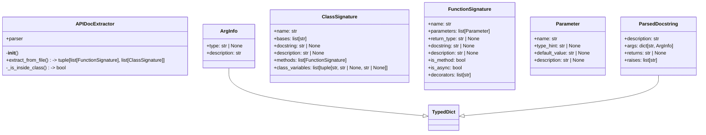

# File Overview

This file, `src/local_deepwiki/generators/api_docs.py`, provides functionality for extracting and parsing API documentation from Python source code. It uses the Tree-sitter parser to analyze code structure and extract information such as function signatures, parameters, return types, decorators, and docstrings. The extracted data is structured into typed classes for consistent handling and can be used to generate API reference documentation in Markdown format.

## Dependencies

This file imports:
- `re` for regular expression operations
- `dataclasses` for defining `Parameter` and `FunctionSignature` classes
- `pathlib.Path` for handling file paths
- `typing.TypedDict` for type hints
- `tree_sitter.Node` for AST node handling
- `local_deepwiki.core.chunker.CLASS_NODE_TYPES`, `FUNCTION_NODE_TYPES` for identifying node types
- `local_deepwiki.core.parser.CodeParser`, `find_nodes_by_type`, `get_node_name`, `get_node_text` for parsing code
- `local_deepwiki.models.Language` for language support

## Integration

This file is part of the `local_deepwiki` documentation generation system. It is called by:
- `test_api_docs` (test suite)
- `chunker` (for extracting API information during code chunking)
- `test_type_annotations` (for validating type annotations)

It is closely related to:
- `src/local_deepwiki/cli/__init__.py`
- `src/local_deepwiki/core/__init__.py`
- `src/local_deepwiki/generators/source_refs.py`
- `src/local_deepwiki/generators/wiki.py`
- `tests/test_plugins.py`

# Classes

## ArgInfo

A typed dictionary representing information about a function argument.

### Fields
- `type`: Optional string representing the argument's type.
- `description`: String describing the argument.

## ParsedDocstring

A typed dictionary representing a parsed docstring.

### Fields
- `description`: String containing the main description.
- `args`: Dictionary mapping argument names to `ArgInfo`.
- `returns`: Optional string describing the return value.
- `raises`: List of strings describing exceptions.

## Parameter

Represents a function parameter.

### Fields
- `name`: String, the parameter name.
- `type_hint`: Optional string, the type hint.
- `default_value`: Optional string, the default value.
- `description`: Optional string, the parameter description.

## FunctionSignature

Represents a function or method signature.

### Fields
- `name`: String, the function name.
- `parameters`: List of `Parameter` objects.
- `return_type`: Optional string, the return type.
- `docstring`: Optional string, the raw docstring.
- `description`: Optional string, the description.
- `is_method`: Boolean indicating if it's a method.
- `is_async`: Boolean indicating if it's an async function.
- `decorators`: List of decorator strings.

## ClassSignature

Represents a class signature.

### Fields
- `name`: String, the class name.
- `bases`: List of strings, base class names.
- `docstring`: Optional string, the raw docstring.
- `description`: Optional string, the description.
- `methods`: List of `FunctionSignature` objects.
- `class_variables`: List of tuples representing class variables (name, type, value).

## APIDocExtractor

A class for extracting API documentation from source files.

### Methods
- `__init__`: Initializes the extractor with a `CodeParser`.
- `extract_from_file`: Extracts function and class signatures from a source file.

# Functions

## extract_python_parameters

Extracts parameters from a Python function definition.

### Parameters
- `func_node`: The `function_definition` AST node.
- `source`: Source code bytes.

### Returns
List of `Parameter` objects.

## extract_python_return_type

Extracts return type annotation from a Python function.

### Parameters
- `func_node`: The `function_definition` AST node.
- `source`: Source code bytes.

### Returns
Return type string or `None`.

## extract_python_decorators

Extracts decorators from a Python function.

### Parameters
- `func_node`: The `function_definition` AST node.
- `source`: Source code bytes.

### Returns
List of decorator strings.

## extract_python_docstring

Extracts docstring from a Python function or class.

### Parameters
- `node`: The `function_definition` or `class_definition` AST node.
- `source`: Source code bytes.

### Returns
Docstring content or `None`.

## parse_google_docstring

Parses a Google-style docstring.

### Parameters
- `docstring`: The docstring content.

### Returns
Parsed docstring dictionary with keys: `description`, `args`, `returns`, `raises`.

## parse_numpy_docstring

Parses a NumPy-style docstring.

### Parameters
- `docstring`: The docstring content.

### Returns
Parsed docstring dictionary with keys: `description`, `args`, `returns`, `raises`.

## parse_docstring

Parses a docstring, auto-detecting format.

### Parameters
- `docstring`: The docstring content.

### Returns
Parsed docstring dictionary.

## API Reference

### class `ArgInfo`

**Inherits from:** `TypedDict`

Type for argument info in parsed docstrings.


<details>
<summary>View Source (lines 15-19) | <a href="https://github.com/UrbanDiver/local-deepwiki-mcp/blob/main/src/local_deepwiki/generators/api_docs.py#L15-L19">GitHub</a></summary>

```python
class ArgInfo(TypedDict):
    """Type for argument info in parsed docstrings."""

    type: str | None
    description: str
```

</details>

### class `ParsedDocstring`

**Inherits from:** `TypedDict`

Type for parsed docstring result.


<details>
<summary>View Source (lines 22-28) | <a href="https://github.com/UrbanDiver/local-deepwiki-mcp/blob/main/src/local_deepwiki/generators/api_docs.py#L22-L28">GitHub</a></summary>

```python
class ParsedDocstring(TypedDict):
    """Type for parsed docstring result."""

    description: str
    args: dict[str, ArgInfo]
    returns: str | None
    raises: list[str]
```

</details>

### class `Parameter`

Represents a function parameter.


<details>
<summary>View Source (lines 32-38) | <a href="https://github.com/UrbanDiver/local-deepwiki-mcp/blob/main/src/local_deepwiki/generators/api_docs.py#L32-L38">GitHub</a></summary>

```python
class Parameter:
    """Represents a function parameter."""

    name: str
    type_hint: str | None = None
    default_value: str | None = None
    description: str | None = None
```

</details>

### class `FunctionSignature`

Represents a function/method signature.


<details>
<summary>View Source (lines 42-52) | <a href="https://github.com/UrbanDiver/local-deepwiki-mcp/blob/main/src/local_deepwiki/generators/api_docs.py#L42-L52">GitHub</a></summary>

```python
class FunctionSignature:
    """Represents a function/method signature."""

    name: str
    parameters: list[Parameter] = field(default_factory=list)
    return_type: str | None = None
    docstring: str | None = None
    description: str | None = None
    is_method: bool = False
    is_async: bool = False
    decorators: list[str] = field(default_factory=list)
```

</details>

### class `ClassSignature`

Represents a class signature.


<details>
<summary>View Source (lines 56-64) | <a href="https://github.com/UrbanDiver/local-deepwiki-mcp/blob/main/src/local_deepwiki/generators/api_docs.py#L56-L64">GitHub</a></summary>

```python
class ClassSignature:
    """Represents a class signature."""

    name: str
    bases: list[str] = field(default_factory=list)
    docstring: str | None = None
    description: str | None = None
    methods: list[FunctionSignature] = field(default_factory=list)
    class_variables: list[tuple[str, str | None, str | None]] = field(default_factory=list)
```

</details>

### class `APIDocExtractor`

Extracts API documentation from source files.

**Methods:**


<details>
<summary>View Source (lines 483-537) | <a href="https://github.com/UrbanDiver/local-deepwiki-mcp/blob/main/src/local_deepwiki/generators/api_docs.py#L483-L537">GitHub</a></summary>

```python
class APIDocExtractor:
    """Extracts API documentation from source files."""

    def __init__(self):
        """Initialize the extractor."""
        self.parser = CodeParser()

    def extract_from_file(
        self, file_path: Path
    ) -> tuple[list[FunctionSignature], list[ClassSignature]]:
        """Extract API documentation from a source file.

        Args:
            file_path: Path to the source file.

        Returns:
            Tuple of (functions, classes) signatures.
        """
        result = self.parser.parse_file(file_path)
        if result is None:
            return [], []

        root, language, source = result
        functions: list[FunctionSignature] = []
        classes: list[ClassSignature] = []

        function_types = FUNCTION_NODE_TYPES.get(language, set())
        class_types = CLASS_NODE_TYPES.get(language, set())

        # Extract top-level functions
        for func_node in find_nodes_by_type(root, function_types):
            # Skip if inside a class
            if self._is_inside_class(func_node, class_types):
                continue

            sig = extract_function_signature(func_node, source, language)
            if sig:
                functions.append(sig)

        # Extract classes
        for class_node in find_nodes_by_type(root, class_types):
            class_sig = extract_class_signature(class_node, source, language)
            if class_sig:
                classes.append(class_sig)

        return functions, classes

    def _is_inside_class(self, node: Node, class_types: set[str]) -> bool:
        """Check if a node is inside a class definition."""
        parent = node.parent
        while parent:
            if parent.type in class_types:
                return True
            parent = parent.parent
        return False
```

</details>

#### `__init__`

```python
def __init__()
```

Initialize the extractor.


<details>
<summary>View Source (lines 483-537) | <a href="https://github.com/UrbanDiver/local-deepwiki-mcp/blob/main/src/local_deepwiki/generators/api_docs.py#L483-L537">GitHub</a></summary>

```python
class APIDocExtractor:
    """Extracts API documentation from source files."""

    def __init__(self):
        """Initialize the extractor."""
        self.parser = CodeParser()

    def extract_from_file(
        self, file_path: Path
    ) -> tuple[list[FunctionSignature], list[ClassSignature]]:
        """Extract API documentation from a source file.

        Args:
            file_path: Path to the source file.

        Returns:
            Tuple of (functions, classes) signatures.
        """
        result = self.parser.parse_file(file_path)
        if result is None:
            return [], []

        root, language, source = result
        functions: list[FunctionSignature] = []
        classes: list[ClassSignature] = []

        function_types = FUNCTION_NODE_TYPES.get(language, set())
        class_types = CLASS_NODE_TYPES.get(language, set())

        # Extract top-level functions
        for func_node in find_nodes_by_type(root, function_types):
            # Skip if inside a class
            if self._is_inside_class(func_node, class_types):
                continue

            sig = extract_function_signature(func_node, source, language)
            if sig:
                functions.append(sig)

        # Extract classes
        for class_node in find_nodes_by_type(root, class_types):
            class_sig = extract_class_signature(class_node, source, language)
            if class_sig:
                classes.append(class_sig)

        return functions, classes

    def _is_inside_class(self, node: Node, class_types: set[str]) -> bool:
        """Check if a node is inside a class definition."""
        parent = node.parent
        while parent:
            if parent.type in class_types:
                return True
            parent = parent.parent
        return False
```

</details>

#### `extract_from_file`

```python
def extract_from_file(file_path: Path) -> tuple[list[FunctionSignature], list[ClassSignature]]
```

Extract API documentation from a source file.


| Parameter | Type | Default | Description |
|-----------|------|---------|-------------|
| `file_path` | `Path` | - | Path to the source file. |


---


<details>
<summary>View Source (lines 483-537) | <a href="https://github.com/UrbanDiver/local-deepwiki-mcp/blob/main/src/local_deepwiki/generators/api_docs.py#L483-L537">GitHub</a></summary>

```python
class APIDocExtractor:
    """Extracts API documentation from source files."""

    def __init__(self):
        """Initialize the extractor."""
        self.parser = CodeParser()

    def extract_from_file(
        self, file_path: Path
    ) -> tuple[list[FunctionSignature], list[ClassSignature]]:
        """Extract API documentation from a source file.

        Args:
            file_path: Path to the source file.

        Returns:
            Tuple of (functions, classes) signatures.
        """
        result = self.parser.parse_file(file_path)
        if result is None:
            return [], []

        root, language, source = result
        functions: list[FunctionSignature] = []
        classes: list[ClassSignature] = []

        function_types = FUNCTION_NODE_TYPES.get(language, set())
        class_types = CLASS_NODE_TYPES.get(language, set())

        # Extract top-level functions
        for func_node in find_nodes_by_type(root, function_types):
            # Skip if inside a class
            if self._is_inside_class(func_node, class_types):
                continue

            sig = extract_function_signature(func_node, source, language)
            if sig:
                functions.append(sig)

        # Extract classes
        for class_node in find_nodes_by_type(root, class_types):
            class_sig = extract_class_signature(class_node, source, language)
            if class_sig:
                classes.append(class_sig)

        return functions, classes

    def _is_inside_class(self, node: Node, class_types: set[str]) -> bool:
        """Check if a node is inside a class definition."""
        parent = node.parent
        while parent:
            if parent.type in class_types:
                return True
            parent = parent.parent
        return False
```

</details>

### Functions

#### `extract_python_parameters`

```python
def extract_python_parameters(func_node: Node, source: bytes) -> list[Parameter]
```

Extract parameters from a Python function definition.


| Parameter | Type | Default | Description |
|-----------|------|---------|-------------|
| `func_node` | `Node` | - | The function_definition AST node. |
| `source` | `bytes` | - | Source code bytes. |

**Returns:** `list[Parameter]`


<details>
<summary>View Source (lines 67-140) | <a href="https://github.com/UrbanDiver/local-deepwiki-mcp/blob/main/src/local_deepwiki/generators/api_docs.py#L67-L140">GitHub</a></summary>

```python
def extract_python_parameters(func_node: Node, source: bytes) -> list[Parameter]:
    """Extract parameters from a Python function definition.

    Args:
        func_node: The function_definition AST node.
        source: Source code bytes.

    Returns:
        List of Parameter objects.
    """
    parameters: list[Parameter] = []
    params_node = func_node.child_by_field_name("parameters")
    if not params_node:
        return parameters

    for child in params_node.children:
        if child.type == "identifier":
            # Simple parameter without type hint
            name = get_node_text(child, source)
            if name not in ("self", "cls"):
                parameters.append(Parameter(name=name))

        elif child.type == "typed_parameter":
            # Parameter with type hint: name: type
            name_node = None
            type_node = None
            for c in child.children:
                if c.type == "identifier":
                    name_node = c
                elif c.type == "type":
                    type_node = c

            if name_node:
                name = get_node_text(name_node, source)
                if name not in ("self", "cls"):
                    type_hint = get_node_text(type_node, source) if type_node else None
                    parameters.append(Parameter(name=name, type_hint=type_hint))

        elif child.type == "default_parameter":
            # Parameter with default: name = value
            name_node = child.child_by_field_name("name")
            value_node = child.child_by_field_name("value")

            if name_node:
                name = get_node_text(name_node, source)
                if name not in ("self", "cls"):
                    default = get_node_text(value_node, source) if value_node else None
                    parameters.append(Parameter(name=name, default_value=default))

        elif child.type == "typed_default_parameter":
            # Parameter with type and default: name: type = value
            name_node = child.child_by_field_name("name")
            type_node = child.child_by_field_name("type")
            value_node = child.child_by_field_name("value")

            if name_node:
                name = get_node_text(name_node, source)
                if name not in ("self", "cls"):
                    type_hint = get_node_text(type_node, source) if type_node else None
                    default = get_node_text(value_node, source) if value_node else None
                    parameters.append(
                        Parameter(name=name, type_hint=type_hint, default_value=default)
                    )

        elif child.type in ("list_splat_pattern", "dictionary_splat_pattern"):
            # *args or **kwargs
            for c in child.children:
                if c.type == "identifier":
                    name = get_node_text(c, source)
                    prefix = "*" if child.type == "list_splat_pattern" else "**"
                    parameters.append(Parameter(name=f"{prefix}{name}"))
                    break

    return parameters
```

</details>

#### `extract_python_return_type`

```python
def extract_python_return_type(func_node: Node, source: bytes) -> str | None
```

Extract return type annotation from a Python function.


| Parameter | Type | Default | Description |
|-----------|------|---------|-------------|
| `func_node` | `Node` | - | The function_definition AST node. |
| `source` | `bytes` | - | Source code bytes. |

**Returns:** `str | None`


<details>
<summary>View Source (lines 143-156) | <a href="https://github.com/UrbanDiver/local-deepwiki-mcp/blob/main/src/local_deepwiki/generators/api_docs.py#L143-L156">GitHub</a></summary>

```python
def extract_python_return_type(func_node: Node, source: bytes) -> str | None:
    """Extract return type annotation from a Python function.

    Args:
        func_node: The function_definition AST node.
        source: Source code bytes.

    Returns:
        Return type string or None.
    """
    return_type_node = func_node.child_by_field_name("return_type")
    if return_type_node:
        return get_node_text(return_type_node, source)
    return None
```

</details>

#### `extract_python_decorators`

```python
def extract_python_decorators(func_node: Node, source: bytes) -> list[str]
```

Extract decorators from a Python function.


| Parameter | Type | Default | Description |
|-----------|------|---------|-------------|
| `func_node` | `Node` | - | The function_definition AST node. |
| `source` | `bytes` | - | Source code bytes. |

**Returns:** `list[str]`


<details>
<summary>View Source (lines 159-180) | <a href="https://github.com/UrbanDiver/local-deepwiki-mcp/blob/main/src/local_deepwiki/generators/api_docs.py#L159-L180">GitHub</a></summary>

```python
def extract_python_decorators(func_node: Node, source: bytes) -> list[str]:
    """Extract decorators from a Python function.

    Args:
        func_node: The function_definition AST node.
        source: Source code bytes.

    Returns:
        List of decorator strings.
    """
    decorators: list[str] = []
    # Look at siblings before the function
    if func_node.parent:
        prev_sibling = func_node.prev_sibling
        while prev_sibling:
            if prev_sibling.type == "decorator":
                dec_text = get_node_text(prev_sibling, source)
                decorators.insert(0, dec_text)
            elif prev_sibling.type not in ("comment", "decorator"):
                break
            prev_sibling = prev_sibling.prev_sibling
    return decorators
```

</details>

#### `extract_python_docstring`

```python
def extract_python_docstring(node: Node, source: bytes) -> str | None
```

Extract docstring from a Python function or class.


| Parameter | Type | Default | Description |
|-----------|------|---------|-------------|
| `node` | `Node` | - | The function_definition or class_definition AST node. |
| `source` | `bytes` | - | Source code bytes. |

**Returns:** `str | None`


<details>
<summary>View Source (lines 183-214) | <a href="https://github.com/UrbanDiver/local-deepwiki-mcp/blob/main/src/local_deepwiki/generators/api_docs.py#L183-L214">GitHub</a></summary>

```python
def extract_python_docstring(node: Node, source: bytes) -> str | None:
    """Extract docstring from a Python function or class.

    Args:
        node: The function_definition or class_definition AST node.
        source: Source code bytes.

    Returns:
        Docstring content or None.
    """
    # Find the body/block node
    body_node = node.child_by_field_name("body")
    if not body_node:
        return None

    # First statement in body might be a docstring
    for child in body_node.children:
        if child.type == "expression_statement":
            for c in child.children:
                if c.type == "string":
                    docstring = get_node_text(c, source)
                    # Remove quotes
                    if docstring.startswith('"""') or docstring.startswith("'''"):
                        docstring = docstring[3:-3]
                    elif docstring.startswith('"') or docstring.startswith("'"):
                        docstring = docstring[1:-1]
                    return docstring.strip()
        elif child.type not in ("comment", "pass_statement"):
            # First non-comment statement is not a docstring
            break

    return None
```

</details>

#### `parse_google_docstring`

```python
def parse_google_docstring(docstring: str) -> ParsedDocstring
```

Parse a Google-style docstring.


| Parameter | Type | Default | Description |
|-----------|------|---------|-------------|
| `docstring` | `str` | - | The docstring content. |

**Returns:** `ParsedDocstring`


<details>
<summary>View Source (lines 217-287) | <a href="https://github.com/UrbanDiver/local-deepwiki-mcp/blob/main/src/local_deepwiki/generators/api_docs.py#L217-L287">GitHub</a></summary>

```python
def parse_google_docstring(docstring: str) -> ParsedDocstring:
    """Parse a Google-style docstring.

    Args:
        docstring: The docstring content.

    Returns:
        Dictionary with 'description', 'args', 'returns', 'raises' keys.
    """
    args_dict: dict[str, ArgInfo] = {}
    returns_str: str | None = None
    raises_list: list[str] = []

    if not docstring:
        return {"description": "", "args": args_dict, "returns": None, "raises": raises_list}

    lines = docstring.split("\n")
    current_section = "description"
    current_param: str | None = None
    description_lines: list[str] = []

    for line in lines:
        stripped = line.strip()

        # Check for section headers
        if stripped in ("Args:", "Arguments:", "Parameters:"):
            current_section = "args"
            current_param = None
            continue
        elif stripped in ("Returns:", "Return:"):
            current_section = "returns"
            current_param = None
            continue
        elif stripped in ("Raises:", "Raise:"):
            current_section = "raises"
            current_param = None
            continue
        elif stripped in ("Example:", "Examples:", "Note:", "Notes:", "Yields:"):
            current_section = "other"
            current_param = None
            continue

        if current_section == "description":
            description_lines.append(stripped)
        elif current_section == "args":
            # Parse parameter: name (type): description or name: description
            param_match = re.match(r"(\w+)\s*(?:\(([^)]+)\))?\s*:\s*(.+)?", stripped)
            if param_match:
                param_name = param_match.group(1)
                param_type = param_match.group(2)
                param_desc = param_match.group(3) or ""
                args_dict[param_name] = ArgInfo(
                    type=param_type,
                    description=param_desc.strip(),
                )
                current_param = param_name
            elif current_param and stripped:
                # Continuation of previous param description
                args_dict[current_param]["description"] += " " + stripped
        elif current_section == "returns":
            if returns_str is None:
                returns_str = stripped
            elif stripped:
                returns_str += " " + stripped

    description = " ".join(description_lines).strip()
    # Take just first paragraph for description
    if "\n\n" in description:
        description = description.split("\n\n")[0]

    return {"description": description, "args": args_dict, "returns": returns_str, "raises": raises_list}
```

</details>

#### `parse_numpy_docstring`

```python
def parse_numpy_docstring(docstring: str) -> ParsedDocstring
```

Parse a NumPy-style docstring.


| Parameter | Type | Default | Description |
|-----------|------|---------|-------------|
| `docstring` | `str` | - | The docstring content. |

**Returns:** `ParsedDocstring`


<details>
<summary>View Source (lines 290-363) | <a href="https://github.com/UrbanDiver/local-deepwiki-mcp/blob/main/src/local_deepwiki/generators/api_docs.py#L290-L363">GitHub</a></summary>

```python
def parse_numpy_docstring(docstring: str) -> ParsedDocstring:
    """Parse a NumPy-style docstring.

    Args:
        docstring: The docstring content.

    Returns:
        Dictionary with 'description', 'args', 'returns', 'raises' keys.
    """
    args_dict: dict[str, ArgInfo] = {}
    returns_str: str | None = None
    raises_list: list[str] = []

    if not docstring:
        return {"description": "", "args": args_dict, "returns": None, "raises": raises_list}

    lines = docstring.split("\n")
    current_section = "description"
    current_param: str | None = None
    description_lines: list[str] = []

    i = 0
    while i < len(lines):
        line = lines[i]
        stripped = line.strip()

        # Check for section headers (followed by dashes)
        if i + 1 < len(lines) and lines[i + 1].strip().startswith("---"):
            if stripped.lower() in ("parameters", "args", "arguments"):
                current_section = "args"
                i += 2
                continue
            elif stripped.lower() in ("returns", "return"):
                current_section = "returns"
                i += 2
                continue
            elif stripped.lower() in ("raises", "raise"):
                current_section = "raises"
                i += 2
                continue
            else:
                current_section = "other"
                i += 2
                continue

        if current_section == "description":
            description_lines.append(stripped)
        elif current_section == "args":
            # NumPy style: name : type
            param_match = re.match(r"(\w+)\s*:\s*(.+)?", stripped)
            if param_match and not line.startswith("    "):
                param_name = param_match.group(1)
                param_type = param_match.group(2)
                args_dict[param_name] = ArgInfo(
                    type=param_type.strip() if param_type else None,
                    description="",
                )
                current_param = param_name
            elif current_param and stripped:
                # Description line (indented)
                args_dict[current_param]["description"] += " " + stripped
        elif current_section == "returns":
            if returns_str is None:
                returns_str = stripped
            elif stripped:
                returns_str += " " + stripped

        i += 1

    description = " ".join(description_lines).strip()
    if "\n\n" in description:
        description = description.split("\n\n")[0]

    return {"description": description, "args": args_dict, "returns": returns_str, "raises": raises_list}
```

</details>

#### `parse_docstring`

```python
def parse_docstring(docstring: str) -> ParsedDocstring
```

Parse a docstring, auto-detecting format.


| Parameter | Type | Default | Description |
|-----------|------|---------|-------------|
| `docstring` | `str` | - | The docstring content. |

**Returns:** `ParsedDocstring`


<details>
<summary>View Source (lines 366-385) | <a href="https://github.com/UrbanDiver/local-deepwiki-mcp/blob/main/src/local_deepwiki/generators/api_docs.py#L366-L385">GitHub</a></summary>

```python
def parse_docstring(docstring: str) -> ParsedDocstring:
    """Parse a docstring, auto-detecting format.

    Args:
        docstring: The docstring content.

    Returns:
        Parsed docstring dictionary.
    """
    if not docstring:
        return {"description": "", "args": {}, "returns": None, "raises": []}

    # Detect format by looking for section markers
    if re.search(r"^(Args|Arguments|Parameters):\s*$", docstring, re.MULTILINE):
        return parse_google_docstring(docstring)
    elif re.search(r"^(Parameters|Args)\s*\n\s*-+", docstring, re.MULTILINE):
        return parse_numpy_docstring(docstring)
    else:
        # Default to Google-style parsing (handles simple docstrings too)
        return parse_google_docstring(docstring)
```

</details>

#### `extract_function_signature`

```python
def extract_function_signature(func_node: Node, source: bytes, language: Language, class_name: str | None = None) -> FunctionSignature | None
```

Extract signature from a function node.


| Parameter | Type | Default | Description |
|-----------|------|---------|-------------|
| `func_node` | `Node` | - | The function AST node. |
| `source` | `bytes` | - | Source code bytes. |
| `language` | `Language` | - | Programming language. |
| `class_name` | `str | None` | `None` | Parent class name if this is a method. |

**Returns:** `FunctionSignature | None`


<details>
<summary>View Source (lines 388-432) | <a href="https://github.com/UrbanDiver/local-deepwiki-mcp/blob/main/src/local_deepwiki/generators/api_docs.py#L388-L432">GitHub</a></summary>

```python
def extract_function_signature(
    func_node: Node,
    source: bytes,
    language: Language,
    class_name: str | None = None,
) -> FunctionSignature | None:
    """Extract signature from a function node.

    Args:
        func_node: The function AST node.
        source: Source code bytes.
        language: Programming language.
        class_name: Parent class name if this is a method.

    Returns:
        FunctionSignature or None if extraction fails.
    """
    name = get_node_name(func_node, source, language)
    if not name:
        return None

    sig = FunctionSignature(name=name, is_method=class_name is not None)

    if language == Language.PYTHON:
        sig.parameters = extract_python_parameters(func_node, source)
        sig.return_type = extract_python_return_type(func_node, source)
        sig.decorators = extract_python_decorators(func_node, source)
        # Check for async keyword as first child
        sig.is_async = any(c.type == "async" for c in func_node.children)

        docstring = extract_python_docstring(func_node, source)
        if docstring:
            sig.docstring = docstring
            parsed = parse_docstring(docstring)
            sig.description = parsed["description"]

            # Merge docstring param descriptions
            for param in sig.parameters:
                if param.name.lstrip("*") in parsed["args"]:
                    arg_info = parsed["args"][param.name.lstrip("*")]
                    param.description = arg_info.get("description")
                    if not param.type_hint and arg_info.get("type"):
                        param.type_hint = arg_info["type"]

    return sig
```

</details>

#### `extract_class_signature`

```python
def extract_class_signature(class_node: Node, source: bytes, language: Language) -> ClassSignature | None
```

Extract signature from a class node.


| Parameter | Type | Default | Description |
|-----------|------|---------|-------------|
| `class_node` | `Node` | - | The class AST node. |
| `source` | `bytes` | - | Source code bytes. |
| `language` | `Language` | - | Programming language. |

**Returns:** `ClassSignature | None`


<details>
<summary>View Source (lines 435-480) | <a href="https://github.com/UrbanDiver/local-deepwiki-mcp/blob/main/src/local_deepwiki/generators/api_docs.py#L435-L480">GitHub</a></summary>

```python
def extract_class_signature(
    class_node: Node,
    source: bytes,
    language: Language,
) -> ClassSignature | None:
    """Extract signature from a class node.

    Args:
        class_node: The class AST node.
        source: Source code bytes.
        language: Programming language.

    Returns:
        ClassSignature or None if extraction fails.
    """
    name = get_node_name(class_node, source, language)
    if not name:
        return None

    sig = ClassSignature(name=name)

    if language == Language.PYTHON:
        # Extract base classes
        for child in class_node.children:
            if child.type == "argument_list":
                for c in child.children:
                    if c.type == "identifier":
                        sig.bases.append(get_node_text(c, source))
                    elif c.type == "attribute":
                        sig.bases.append(get_node_text(c, source))

        # Extract docstring
        docstring = extract_python_docstring(class_node, source)
        if docstring:
            sig.docstring = docstring
            parsed = parse_docstring(docstring)
            sig.description = parsed["description"]

        # Extract methods
        function_types = FUNCTION_NODE_TYPES.get(language, set())
        for method_node in find_nodes_by_type(class_node, function_types):
            method_sig = extract_function_signature(method_node, source, language, name)
            if method_sig:
                sig.methods.append(method_sig)

    return sig
```

</details>

#### `format_parameter`

```python
def format_parameter(param: Parameter) -> str
```

Format a parameter for display.


| Parameter | Type | Default | Description |
|-----------|------|---------|-------------|
| `param` | `Parameter` | - | The parameter to format. |

**Returns:** `str`


<details>
<summary>View Source (lines 540-554) | <a href="https://github.com/UrbanDiver/local-deepwiki-mcp/blob/main/src/local_deepwiki/generators/api_docs.py#L540-L554">GitHub</a></summary>

```python
def format_parameter(param: Parameter) -> str:
    """Format a parameter for display.

    Args:
        param: The parameter to format.

    Returns:
        Formatted parameter string.
    """
    parts = [param.name]
    if param.type_hint:
        parts.append(f": {param.type_hint}")
    if param.default_value is not None:
        parts.append(f" = {param.default_value}")
    return "".join(parts)
```

</details>

#### `format_function_signature_line`

```python
def format_function_signature_line(sig: FunctionSignature) -> str
```

Format a function signature as a single line.


| Parameter | Type | Default | Description |
|-----------|------|---------|-------------|
| `sig` | `FunctionSignature` | - | The function signature. |

**Returns:** `str`


<details>
<summary>View Source (lines 557-569) | <a href="https://github.com/UrbanDiver/local-deepwiki-mcp/blob/main/src/local_deepwiki/generators/api_docs.py#L557-L569">GitHub</a></summary>

```python
def format_function_signature_line(sig: FunctionSignature) -> str:
    """Format a function signature as a single line.

    Args:
        sig: The function signature.

    Returns:
        Formatted signature string.
    """
    prefix = "async " if sig.is_async else ""
    params = ", ".join(format_parameter(p) for p in sig.parameters)
    return_part = f" -> {sig.return_type}" if sig.return_type else ""
    return f"{prefix}def {sig.name}({params}){return_part}"
```

</details>

#### `generate_api_reference_markdown`

```python
def generate_api_reference_markdown(functions: list[FunctionSignature], classes: list[ClassSignature], include_private: bool = False) -> str
```

Generate markdown API reference documentation.


| Parameter | Type | Default | Description |
|-----------|------|---------|-------------|
| `functions` | `list[FunctionSignature]` | - | List of function signatures. |
| `classes` | `list[ClassSignature]` | - | List of class signatures. |
| `include_private` | `bool` | `False` | Whether to include private (underscore) items. |

**Returns:** `str`


<details>
<summary>View Source (lines 572-678) | <a href="https://github.com/UrbanDiver/local-deepwiki-mcp/blob/main/src/local_deepwiki/generators/api_docs.py#L572-L678">GitHub</a></summary>

```python
def generate_api_reference_markdown(
    functions: list[FunctionSignature],
    classes: list[ClassSignature],
    include_private: bool = False,
) -> str:
    """Generate markdown API reference documentation.

    Args:
        functions: List of function signatures.
        classes: List of class signatures.
        include_private: Whether to include private (underscore) items.

    Returns:
        Markdown string.
    """
    lines = []

    # Filter private items unless requested
    if not include_private:
        functions = [f for f in functions if not f.name.startswith("_")]
        classes = [c for c in classes if not c.name.startswith("_")]

    # Classes
    for cls in classes:
        lines.append(f"### class `{cls.name}`")

        if cls.bases:
            lines.append(f"\n**Inherits from:** {', '.join(f'`{b}`' for b in cls.bases)}")

        if cls.description:
            lines.append(f"\n{cls.description}")

        # Filter methods
        methods = cls.methods
        if not include_private:
            methods = [
                m
                for m in methods
                if not m.name.startswith("_")
                or m.name in ("__init__", "__call__", "__enter__", "__exit__")
            ]

        if methods:
            lines.append("\n**Methods:**\n")
            for method in methods:
                # Method signature
                sig_line = format_function_signature_line(method)
                lines.append(f"#### `{method.name}`\n")
                lines.append(f"```python\n{sig_line}\n```\n")

                if method.description:
                    lines.append(f"{method.description}\n")

                # Parameters table
                params = [p for p in method.parameters]
                if params:
                    lines.append("\n| Parameter | Type | Default | Description |")
                    lines.append("|-----------|------|---------|-------------|")
                    for param in params:
                        type_str = f"`{param.type_hint}`" if param.type_hint else "-"
                        default_str = f"`{param.default_value}`" if param.default_value else "-"
                        desc_str = param.description or "-"
                        lines.append(
                            f"| `{param.name}` | {type_str} | {default_str} | {desc_str} |"
                        )
                    lines.append("")

        lines.append("")

    # Top-level functions
    if functions:
        if classes:
            lines.append("---\n")
        lines.append("### Functions\n")

        for func in functions:
            sig_line = format_function_signature_line(func)
            lines.append(f"#### `{func.name}`\n")

            # Decorators
            if func.decorators:
                for dec in func.decorators:
                    lines.append(f"`{dec}`\n")

            lines.append(f"```python\n{sig_line}\n```\n")

            if func.description:
                lines.append(f"{func.description}\n")

            # Parameters table
            if func.parameters:
                lines.append("\n| Parameter | Type | Default | Description |")
                lines.append("|-----------|------|---------|-------------|")
                for param in func.parameters:
                    type_str = f"`{param.type_hint}`" if param.type_hint else "-"
                    default_str = f"`{param.default_value}`" if param.default_value else "-"
                    desc_str = param.description or "-"
                    lines.append(f"| `{param.name}` | {type_str} | {default_str} | {desc_str} |")
                lines.append("")

            # Return type
            if func.return_type:
                lines.append(f"**Returns:** `{func.return_type}`\n")

            lines.append("")

    return "\n".join(lines)
```

</details>

#### `get_file_api_docs`

```python
def get_file_api_docs(file_path: Path) -> str | None
```

Get API documentation for a single file.


| Parameter | Type | Default | Description |
|-----------|------|---------|-------------|
| `file_path` | `Path` | - | Path to the source file. |

**Returns:** `str | None`


<details>
<summary>View Source (lines 681-696) | <a href="https://github.com/UrbanDiver/local-deepwiki-mcp/blob/main/src/local_deepwiki/generators/api_docs.py#L681-L696">GitHub</a></summary>

```python
def get_file_api_docs(file_path: Path) -> str | None:
    """Get API documentation for a single file.

    Args:
        file_path: Path to the source file.

    Returns:
        Markdown API documentation or None if no APIs found.
    """
    extractor = APIDocExtractor()
    functions, classes = extractor.extract_from_file(file_path)

    if not functions and not classes:
        return None

    return generate_api_reference_markdown(functions, classes)
```

</details>

## Class Diagram


```mermaid
classDiagram
    class APIDocExtractor {
        +parser
        -__init__()
        +extract_from_file() -> tuple[list[FunctionSignature], list[ClassSignature]]
        -_is_inside_class() -> bool
    }
    class ArgInfo {
        +type: str | None
        +description: str
    }
    class ClassSignature {
        +name: str
        +bases: list[str]
        +docstring: str | None
        +description: str | None
        +methods: list[FunctionSignature]
        +class_variables: list[tuple[str, str | None, str | None]]
    }
    class FunctionSignature {
        +name: str
        +parameters: list[Parameter]
        +return_type: str | None
        +docstring: str | None
        +description: str | None
        +is_method: bool
        +is_async: bool
        +decorators: list[str]
    }
    class Parameter {
        +name: str
        +type_hint: str | None
        +default_value: str | None
        +description: str | None
    }
    class ParsedDocstring {
        +description: str
        +args: dict[str, ArgInfo]
        +returns: str | None
        +raises: list[str]
    }
    ArgInfo --|> TypedDict
    ParsedDocstring --|> TypedDict
```

## Call Graph


```mermaid
flowchart TD
    N0[APIDocExtractor]
    N1[APIDocExtractor.__init__]
    N2[APIDocExtractor.extract_fro...]
    N3[ArgInfo]
    N4[ClassSignature]
    N5[CodeParser]
    N6[FunctionSignature]
    N7[Parameter]
    N8[child_by_field_name]
    N9[extract_class_signature]
    N10[extract_from_file]
    N11[extract_function_signature]
    N12[extract_python_decorators]
    N13[extract_python_docstring]
    N14[extract_python_parameters]
    N15[extract_python_return_type]
    N16[find_nodes_by_type]
    N17[format_function_signature_line]
    N18[format_parameter]
    N19[generate_api_reference_mark...]
    N20[get_file_api_docs]
    N21[get_node_name]
    N22[get_node_text]
    N23[group]
    N24[lstrip]
    N25[match]
    N26[parse_docstring]
    N27[parse_google_docstring]
    N28[parse_numpy_docstring]
    N29[search]
    N14 --> N8
    N14 --> N22
    N14 --> N7
    N15 --> N8
    N15 --> N22
    N12 --> N22
    N13 --> N8
    N13 --> N22
    N27 --> N25
    N27 --> N23
    N27 --> N3
    N28 --> N25
    N28 --> N23
    N28 --> N3
    N26 --> N29
    N26 --> N27
    N26 --> N28
    N11 --> N21
    N11 --> N6
    N11 --> N14
    N11 --> N15
    N11 --> N12
    N11 --> N13
    N11 --> N26
    N11 --> N24
    N9 --> N21
    N9 --> N4
    N9 --> N22
    N9 --> N13
    N9 --> N26
    N9 --> N16
    N9 --> N11
    N17 --> N18
    N19 --> N17
    N20 --> N0
    N20 --> N10
    N20 --> N19
    N1 --> N5
    N2 --> N16
    N2 --> N11
    N2 --> N9
    classDef func fill:#e1f5fe
    class N0,N3,N4,N5,N6,N7,N8,N9,N10,N11,N12,N13,N14,N15,N16,N17,N18,N19,N20,N21,N22,N23,N24,N25,N26,N27,N28,N29 func
    classDef method fill:#fff3e0
    class N1,N2 method
```

## Used By

Functions and methods in this file and their callers:

- **`APIDocExtractor`**: called by `get_file_api_docs`
- **`ArgInfo`**: called by `parse_google_docstring`, `parse_numpy_docstring`
- **`ClassSignature`**: called by `extract_class_signature`
- **`CodeParser`**: called by `APIDocExtractor.__init__`
- **`FunctionSignature`**: called by `extract_function_signature`
- **`Parameter`**: called by `extract_python_parameters`
- **`_is_inside_class`**: called by `APIDocExtractor.extract_from_file`
- **`child_by_field_name`**: called by `extract_python_docstring`, `extract_python_parameters`, `extract_python_return_type`
- **`extract_class_signature`**: called by `APIDocExtractor.extract_from_file`
- **`extract_from_file`**: called by `get_file_api_docs`
- **`extract_function_signature`**: called by `APIDocExtractor.extract_from_file`, `extract_class_signature`
- **`extract_python_decorators`**: called by `extract_function_signature`
- **`extract_python_docstring`**: called by `extract_class_signature`, `extract_function_signature`
- **`extract_python_parameters`**: called by `extract_function_signature`
- **`extract_python_return_type`**: called by `extract_function_signature`
- **`find_nodes_by_type`**: called by `APIDocExtractor.extract_from_file`, `extract_class_signature`
- **`format_function_signature_line`**: called by `generate_api_reference_markdown`
- **`format_parameter`**: called by `format_function_signature_line`
- **`generate_api_reference_markdown`**: called by `get_file_api_docs`
- **`get_node_name`**: called by `extract_class_signature`, `extract_function_signature`
- **`get_node_text`**: called by `extract_class_signature`, `extract_python_decorators`, `extract_python_docstring`, `extract_python_parameters`, `extract_python_return_type`
- **`group`**: called by `parse_google_docstring`, `parse_numpy_docstring`
- **`lstrip`**: called by `extract_function_signature`
- **`match`**: called by `parse_google_docstring`, `parse_numpy_docstring`
- **`parse_docstring`**: called by `extract_class_signature`, `extract_function_signature`
- **`parse_file`**: called by `APIDocExtractor.extract_from_file`
- **`parse_google_docstring`**: called by `parse_docstring`
- **`parse_numpy_docstring`**: called by `parse_docstring`
- **`search`**: called by `parse_docstring`

## Usage Examples

*Examples extracted from test files*

### Test creating a basic parameter

From `test_api_docs.py::TestParameter::test_basic_parameter`:

```python
param = Parameter(name="value")
assert param.name == "value"
assert param.type_hint is None
assert param.default_value is None
assert param.description is None
```

### Test creating a parameter with all fields

From `test_api_docs.py::TestParameter::test_full_parameter`:

```python
param = Parameter(
    name="count",
    type_hint="int",
    default_value="10",
    description="The number of items.",
)
assert param.name == "count"
assert param.type_hint == "int"
```

### Test extracting simple parameters without types

From `test_api_docs.py::TestExtractPythonParameters::test_simple_parameters`:

```python
source = dedent(
    """
    def func(a, b, c):
        pass
"""
).strip()
root = parser.parse_source(source, Language.PYTHON)
func_node = root.children[0]

params = extract_python_parameters(func_node, source.encode())
assert len(params) == 3
assert params[0].name == "a"
```

### Test extracting parameters with type hints

From `test_api_docs.py::TestExtractPythonParameters::test_typed_parameters`:

```python
source = dedent(
    """
    def func(name: str, count: int):
        pass
"""
).strip()
root = parser.parse_source(source, Language.PYTHON)
func_node = root.children[0]

params = extract_python_parameters(func_node, source.encode())
assert len(params) == 2
assert params[0].name == "name"
```

### Test extracting a simple return type

From `test_api_docs.py::TestExtractPythonReturnType::test_simple_return_type`:

```python
source = dedent(
    """
    def func() -> str:
        pass
"""
).strip()
root = parser.parse_source(source, Language.PYTHON)
func_node = root.children[0]

return_type = extract_python_return_type(func_node, source.encode())
assert return_type == "str"
```


## Last Modified

| Entity | Type | Author | Date | Commit |
|--------|------|--------|------|--------|
| `ArgInfo` | class | Brian Breidenbach | 1 week ago | `31cf97a` Fix mypy type errors across... |
| `ParsedDocstring` | class | Brian Breidenbach | 1 week ago | `31cf97a` Fix mypy type errors across... |
| `APIDocExtractor` | class | Brian Breidenbach | 1 week ago | `31cf97a` Fix mypy type errors across... |
| `extract_python_parameters` | function | Brian Breidenbach | 1 week ago | `31cf97a` Fix mypy type errors across... |
| `extract_python_decorators` | function | Brian Breidenbach | 1 week ago | `31cf97a` Fix mypy type errors across... |
| `parse_google_docstring` | function | Brian Breidenbach | 1 week ago | `31cf97a` Fix mypy type errors across... |
| `parse_numpy_docstring` | function | Brian Breidenbach | 1 week ago | `31cf97a` Fix mypy type errors across... |
| `parse_docstring` | function | Brian Breidenbach | 1 week ago | `31cf97a` Fix mypy type errors across... |
| `Parameter` | class | Brian Breidenbach | 3 weeks ago | `c568951` Add input validation, type ... |
| `FunctionSignature` | class | Brian Breidenbach | 3 weeks ago | `c568951` Add input validation, type ... |
| `ClassSignature` | class | Brian Breidenbach | 3 weeks ago | `c568951` Add input validation, type ... |
| `generate_api_reference_markdown` | function | Brian Breidenbach | 3 weeks ago | `c568951` Add input validation, type ... |
| `extract_python_return_type` | function | Brian Breidenbach | 3 weeks ago | `4aeda22` Add API reference documenta... |
| `extract_python_docstring` | function | Brian Breidenbach | 3 weeks ago | `4aeda22` Add API reference documenta... |
| `extract_function_signature` | function | Brian Breidenbach | 3 weeks ago | `4aeda22` Add API reference documenta... |
| `extract_class_signature` | function | Brian Breidenbach | 3 weeks ago | `4aeda22` Add API reference documenta... |
| `format_parameter` | function | Brian Breidenbach | 3 weeks ago | `4aeda22` Add API reference documenta... |
| `format_function_signature_line` | function | Brian Breidenbach | 3 weeks ago | `4aeda22` Add API reference documenta... |
| `get_file_api_docs` | function | Brian Breidenbach | 3 weeks ago | `4aeda22` Add API reference documenta... |