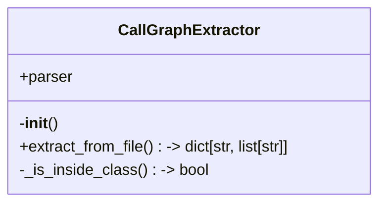
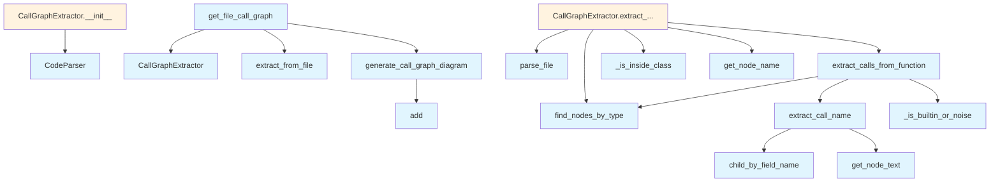

# Call Graph Generator

## File Overview

The `callgraph.py` module provides functionality for extracting and visualizing call graphs from source code files. It analyzes function and method calls within code to generate Mermaid diagrams showing the relationships between different functions.

## Classes

### CallGraphExtractor

The CallGraphExtractor class is responsible for parsing source files and extracting call relationship information.

**Purpose**: Analyzes source code to identify function calls and build call graph data structures.

**Key Components**:
- Initializes with a [CodeParser](../core/parser.md) instance for parsing source files
- Provides methods to extract call graphs from individual files

**Methods**:
- `__init__()`: Initializes the extractor with a [CodeParser](../core/parser.md) instance
- `extract_from_file(file_path: Path, repo_root: Path) -> dict[str, list[str]]`: Extracts call graph data from a source file, returning a dictionary mapping function names to lists of called functions

## Functions

### get_file_call_graph

```python
def get_file_call_graph(file_path: Path, repo_root: Path) -> str | None
```

Generates a call graph diagram for a single source file.

**Parameters**:
- `file_path`: Path to the source file to analyze
- `repo_root`: Repository root path for context

**Returns**: 
- Mermaid diagram string representing the call graph, or None if no calls are found

**Usage**:
This function serves as a high-level interface for generating call graph visualizations from source files.

## Usage Examples

```python
from pathlib import Path
from local_deepwiki.generators.callgraph import CallGraphExtractor, get_file_call_graph

# Extract call graph data using the extractor class
extractor = CallGraphExtractor()
call_graph_data = extractor.extract_from_file(
    file_path=Path("src/example.py"),
    repo_root=Path(".")
)

# Generate a complete call graph diagram for a file
diagram = get_file_call_graph(
    file_path=Path("src/example.py"),
    repo_root=Path(".")
)
```

## Related Components

This module integrates with several other components:

- **[CodeParser](../core/parser.md)**: Used by CallGraphExtractor for parsing source files
- **[Language](../models.md) model**: Referenced in imports for language detection
- **Core chunker**: Utilizes `CLASS_NODE_TYPES` and `FUNCTION_NODE_TYPES` constants
- **Parser utilities**: Uses [`find_nodes_by_type`](../core/parser.md), [`get_node_name`](../core/parser.md), and [`get_node_text`](../core/parser.md) functions
- **Tree-sitter**: Leverages the `Node` type for AST manipulation

The module also includes utility functions (`extract_call_name`, `extract_calls_from_function`, `_is_builtin_or_noise`, `generate_call_graph_diagram`) that support the [main](../export/pdf.md) call graph extraction and visualization functionality.

## API Reference

### class `CallGraphExtractor`

Extracts call graphs from source files.

**Methods:**

#### `__init__`

```python
def __init__()
```

Initialize the extractor.

#### `extract_from_file`

```python
def extract_from_file(file_path: Path, repo_root: Path) -> dict[str, list[str]]
```

Extract call graph from a source file.


| [Parameter](api_docs.md) | Type | Default | Description |
|-----------|------|---------|-------------|
| `file_path` | `Path` | - | Path to the source file. |
| `repo_root` | `Path` | - | Repository root path. |


---

### Functions

#### `extract_call_name`

```python
def extract_call_name(call_node: Node, source: bytes, language: Language) -> str | None
```

Extract the function/method name from a call expression.


| [Parameter](api_docs.md) | Type | Default | Description |
|-----------|------|---------|-------------|
| `call_node` | `Node` | - | The call expression AST node. |
| `source` | `bytes` | - | Source bytes. |
| `language` | [`Language`](../models.md) | - | Programming language. |

**Returns:** `str | None`


#### `extract_calls_from_function`

```python
def extract_calls_from_function(func_node: Node, source: bytes, language: Language) -> list[str]
```

Extract all function calls from a function body.


| [Parameter](api_docs.md) | Type | Default | Description |
|-----------|------|---------|-------------|
| `func_node` | `Node` | - | The function AST node. |
| `source` | `bytes` | - | Source bytes. |
| `language` | [`Language`](../models.md) | - | Programming language. |

**Returns:** `list[str]`


#### `generate_call_graph_diagram`

```python
def generate_call_graph_diagram(call_graph: dict[str, list[str]], title: str | None = None, max_nodes: int = 30) -> str | None
```

Generate a Mermaid flowchart for a call graph.


| [Parameter](api_docs.md) | Type | Default | Description |
|-----------|------|---------|-------------|
| `call_graph` | `dict[str, list[str]]` | - | Mapping of caller to list of callees. |
| `title` | `str | None` | `None` | Optional diagram title. |
| `max_nodes` | `int` | `30` | Maximum number of nodes to include. |

**Returns:** `str | None`


#### `get_file_call_graph`

```python
def get_file_call_graph(file_path: Path, repo_root: Path) -> str | None
```

Get a call graph diagram for a single file.


| [Parameter](api_docs.md) | Type | Default | Description |
|-----------|------|---------|-------------|
| `file_path` | `Path` | - | Path to the source file. |
| `repo_root` | `Path` | - | Repository root path. |

**Returns:** `str | None`


## Class Diagram



## Call Graph



## Usage Examples

*Examples extracted from test files*

### Test that common built-ins are filtered

From `test_callgraph.py::test_common_builtins_filtered`:

```python
assert _is_builtin_or_noise("print", Language.PYTHON) is True
```

### Test Python-specific built-ins are filtered

From `test_callgraph.py::test_python_specific_builtins`:

```python
assert _is_builtin_or_noise("super", Language.PYTHON) is True
```

### Test extracting a simple function call

From `test_callgraph.py::test_simple_function_call`:

```python
source = dedent(
    """
    def main():
        process_data()
"""
).strip()
root = parser.parse_source(source, Language.PYTHON)
func_node = root.children[0]  # function_definition

calls = extract_calls_from_function(func_node, source.encode(), Language.PYTHON)
assert "process_data" in calls
```

### Test extracting multiple function calls

From `test_callgraph.py::test_multiple_function_calls`:

```python
source = dedent(
    """
    def main():
        load_data()
        process_data()
        save_results()
"""
).strip()
root = parser.parse_source(source, Language.PYTHON)
func_node = root.children[0]

calls = extract_calls_from_function(func_node, source.encode(), Language.PYTHON)
assert "load_data" in calls
```

### Test that empty call graph returns None

From `test_callgraph.py::test_empty_graph_returns_none`:

```python
result = generate_call_graph_diagram({})
assert result is None
```

## Relevant Source Files

- `src/local_deepwiki/generators/callgraph.py:257-324`

## See Also

- [models](../models.md) - dependency
- [chunker](../core/chunker.md) - dependency
- [api_docs](api_docs.md) - shares 5 dependencies
- [test_examples](test_examples.md) - shares 4 dependencies
