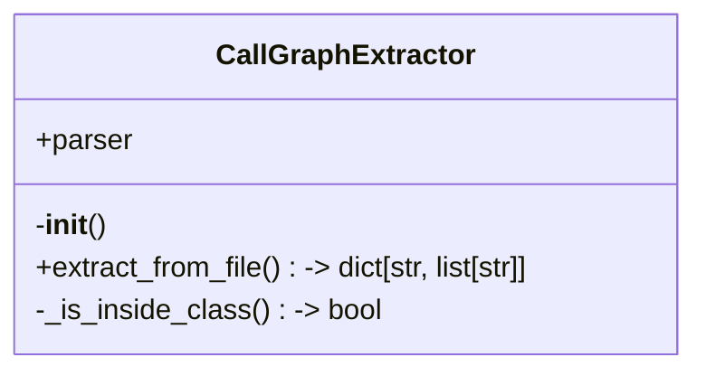
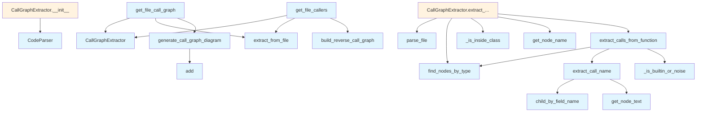

# callgraph.py

## File Overview

This module provides functionality for extracting and generating call graphs from source code files. It analyzes code to identify function and method calls, then generates visual Mermaid diagrams representing the call relationships.

## Classes

### CallGraphExtractor

The CallGraphExtractor class handles the extraction of call graph information from source code files. It uses the tree-sitter parser to analyze code structure and identify function calls.

**Key functionality:**
- Extracts call relationships from source files
- Works with the [CodeParser](../core/parser.md) for code analysis
- Supports call graph generation for individual files

## Functions

### get_file_call_graph

```python
def get_file_call_graph(file_path: Path, repo_root: Path) -> str | None
```

Generates a call graph diagram for a single source file.

**Parameters:**
- `file_path` (Path): Path to the source file to analyze
- `repo_root` (Path): Repository root path for context

**Returns:**
- `str | None`: Mermaid diagram string representing the call graph, or None if no calls are found

**[Usage Example](test_examples.md):**

```python
from pathlib import Path
from local_deepwiki.generators.callgraph import get_file_call_graph

file_path = Path("src/my_module.py")
repo_root = Path(".")
diagram = get_file_call_graph(file_path, repo_root)
if diagram:
    print(diagram)
```

### Additional Functions

The module includes several other functions for call graph processing:

- `extract_call_name`: Extracts function call names from code
- `extract_calls_from_function`: Identifies calls within function bodies
- `_is_builtin_or_noise`: Filters out built-in functions and noise
- `generate_call_graph_diagram`: Creates Mermaid diagram strings from call data
- `build_reverse_call_graph`: Builds reverse call relationships
- `get_file_callers`: Identifies callers of functions in a file

## Related Components

This module integrates with several other components:

- **[CodeParser](../core/parser.md)**: Used for parsing source code with tree-sitter
- **Chunker**: Utilizes `CLASS_NODE_TYPES` and `FUNCTION_NODE_TYPES` constants for node identification
- **Parser utilities**: Uses [`find_nodes_by_type`](../core/parser.md), [`get_node_name`](../core/parser.md), and [`get_node_text`](../core/parser.md) functions
- **[Language](../models.md) model**: Works with the [Language](../models.md) enum for language-specific processing

The module processes tree-sitter Node objects and works within the broader local_deepwiki documentation generation system.

## API Reference

### class `CallGraphExtractor`

Extracts call graphs from source files.

**Methods:**


<details>
<summary>View Source (lines 257-324) | <a href="https://github.com/UrbanDiver/local-deepwiki-mcp/blob/feature/better-search/src/local_deepwiki/generators/callgraph.py#L257-L324">GitHub</a></summary>

```python
class CallGraphExtractor:
    """Extracts call graphs from source files."""

    def __init__(self):
        """Initialize the extractor."""
        self.parser = CodeParser()

    def extract_from_file(
        self,
        file_path: Path,
        repo_root: Path,
    ) -> dict[str, list[str]]:
        """Extract call graph from a source file.

        Args:
            file_path: Path to the source file.
            repo_root: Repository root path.

        Returns:
            Dictionary mapping function name to list of called functions.
        """
        result = self.parser.parse_file(file_path)
        if result is None:
            return {}

        root, language, source = result
        call_graph: dict[str, list[str]] = {}

        # Get function and class node types
        function_types = FUNCTION_NODE_TYPES.get(language, set())
        class_types = CLASS_NODE_TYPES.get(language, set())

        # Extract from top-level functions
        for func_node in find_nodes_by_type(root, function_types):
            # Skip if inside a class
            if self._is_inside_class(func_node, class_types):
                continue

            func_name = get_node_name(func_node, source, language)
            if func_name:
                calls = extract_calls_from_function(func_node, source, language)
                if calls:
                    call_graph[func_name] = calls

        # Extract from class methods
        for class_node in find_nodes_by_type(root, class_types):
            class_name = get_node_name(class_node, source, language)
            if not class_name:
                continue

            for method_node in find_nodes_by_type(class_node, function_types):
                method_name = get_node_name(method_node, source, language)
                if method_name:
                    full_name = f"{class_name}.{method_name}"
                    calls = extract_calls_from_function(method_node, source, language)
                    if calls:
                        call_graph[full_name] = calls

        return call_graph

    def _is_inside_class(self, node: Node, class_types: set[str]) -> bool:
        """Check if a node is inside a class definition."""
        parent = node.parent
        while parent:
            if parent.type in class_types:
                return True
            parent = parent.parent
        return False
```

</details>

#### `__init__`

```python
def __init__()
```

Initialize the extractor.


<details>
<summary>View Source (lines 257-324) | <a href="https://github.com/UrbanDiver/local-deepwiki-mcp/blob/feature/better-search/src/local_deepwiki/generators/callgraph.py#L257-L324">GitHub</a></summary>

```python
class CallGraphExtractor:
    """Extracts call graphs from source files."""

    def __init__(self):
        """Initialize the extractor."""
        self.parser = CodeParser()

    def extract_from_file(
        self,
        file_path: Path,
        repo_root: Path,
    ) -> dict[str, list[str]]:
        """Extract call graph from a source file.

        Args:
            file_path: Path to the source file.
            repo_root: Repository root path.

        Returns:
            Dictionary mapping function name to list of called functions.
        """
        result = self.parser.parse_file(file_path)
        if result is None:
            return {}

        root, language, source = result
        call_graph: dict[str, list[str]] = {}

        # Get function and class node types
        function_types = FUNCTION_NODE_TYPES.get(language, set())
        class_types = CLASS_NODE_TYPES.get(language, set())

        # Extract from top-level functions
        for func_node in find_nodes_by_type(root, function_types):
            # Skip if inside a class
            if self._is_inside_class(func_node, class_types):
                continue

            func_name = get_node_name(func_node, source, language)
            if func_name:
                calls = extract_calls_from_function(func_node, source, language)
                if calls:
                    call_graph[func_name] = calls

        # Extract from class methods
        for class_node in find_nodes_by_type(root, class_types):
            class_name = get_node_name(class_node, source, language)
            if not class_name:
                continue

            for method_node in find_nodes_by_type(class_node, function_types):
                method_name = get_node_name(method_node, source, language)
                if method_name:
                    full_name = f"{class_name}.{method_name}"
                    calls = extract_calls_from_function(method_node, source, language)
                    if calls:
                        call_graph[full_name] = calls

        return call_graph

    def _is_inside_class(self, node: Node, class_types: set[str]) -> bool:
        """Check if a node is inside a class definition."""
        parent = node.parent
        while parent:
            if parent.type in class_types:
                return True
            parent = parent.parent
        return False
```

</details>

#### `extract_from_file`

```python
def extract_from_file(file_path: Path, repo_root: Path) -> dict[str, list[str]]
```

Extract call graph from a source file.


| [Parameter](api_docs.md) | Type | Default | Description |
|-----------|------|---------|-------------|
| `file_path` | `Path` | - | Path to the source file. |
| `repo_root` | `Path` | - | Repository root path. |


---


<details>
<summary>View Source (lines 257-324) | <a href="https://github.com/UrbanDiver/local-deepwiki-mcp/blob/feature/better-search/src/local_deepwiki/generators/callgraph.py#L257-L324">GitHub</a></summary>

```python
class CallGraphExtractor:
    """Extracts call graphs from source files."""

    def __init__(self):
        """Initialize the extractor."""
        self.parser = CodeParser()

    def extract_from_file(
        self,
        file_path: Path,
        repo_root: Path,
    ) -> dict[str, list[str]]:
        """Extract call graph from a source file.

        Args:
            file_path: Path to the source file.
            repo_root: Repository root path.

        Returns:
            Dictionary mapping function name to list of called functions.
        """
        result = self.parser.parse_file(file_path)
        if result is None:
            return {}

        root, language, source = result
        call_graph: dict[str, list[str]] = {}

        # Get function and class node types
        function_types = FUNCTION_NODE_TYPES.get(language, set())
        class_types = CLASS_NODE_TYPES.get(language, set())

        # Extract from top-level functions
        for func_node in find_nodes_by_type(root, function_types):
            # Skip if inside a class
            if self._is_inside_class(func_node, class_types):
                continue

            func_name = get_node_name(func_node, source, language)
            if func_name:
                calls = extract_calls_from_function(func_node, source, language)
                if calls:
                    call_graph[func_name] = calls

        # Extract from class methods
        for class_node in find_nodes_by_type(root, class_types):
            class_name = get_node_name(class_node, source, language)
            if not class_name:
                continue

            for method_node in find_nodes_by_type(class_node, function_types):
                method_name = get_node_name(method_node, source, language)
                if method_name:
                    full_name = f"{class_name}.{method_name}"
                    calls = extract_calls_from_function(method_node, source, language)
                    if calls:
                        call_graph[full_name] = calls

        return call_graph

    def _is_inside_class(self, node: Node, class_types: set[str]) -> bool:
        """Check if a node is inside a class definition."""
        parent = node.parent
        while parent:
            if parent.type in class_types:
                return True
            parent = parent.parent
        return False
```

</details>

### Functions

#### `extract_call_name`

```python
def extract_call_name(call_node: Node, source: bytes, language: Language) -> str | None
```

Extract the function/method name from a call expression.


| [Parameter](api_docs.md) | Type | Default | Description |
|-----------|------|---------|-------------|
| `call_node` | `Node` | - | The call expression AST node. |
| `source` | `bytes` | - | Source bytes. |
| `language` | [`Language`](../models.md) | - | Programming language. |

**Returns:** `str | None`


<details>
<summary>View Source (lines 25-115) | <a href="https://github.com/UrbanDiver/local-deepwiki-mcp/blob/feature/better-search/src/local_deepwiki/generators/callgraph.py#L25-L115">GitHub</a></summary>

```python
def extract_call_name(call_node: Node, source: bytes, language: Language) -> str | None:
    """Extract the function/method name from a call expression.

    Args:
        call_node: The call expression AST node.
        source: Source bytes.
        language: Programming language.

    Returns:
        The called function name or None if can't determine.
    """
    if language == Language.PYTHON:
        # Python: func() or obj.method() or module.func()
        func = call_node.child_by_field_name("function")
        if func:
            if func.type == "identifier":
                return get_node_text(func, source)
            elif func.type == "attribute":
                # obj.method() - get the method name
                attr = func.child_by_field_name("attribute")
                if attr:
                    return get_node_text(attr, source)

    elif language in (Language.JAVASCRIPT, Language.TYPESCRIPT):
        # JS/TS: func() or obj.method()
        func = call_node.child_by_field_name("function")
        if func:
            if func.type == "identifier":
                return get_node_text(func, source)
            elif func.type == "member_expression":
                prop = func.child_by_field_name("property")
                if prop:
                    return get_node_text(prop, source)

    elif language == Language.GO:
        # Go: func() or pkg.Func() or obj.Method()
        func = call_node.child_by_field_name("function")
        if func:
            if func.type == "identifier":
                return get_node_text(func, source)
            elif func.type == "selector_expression":
                field = func.child_by_field_name("field")
                if field:
                    return get_node_text(field, source)

    elif language == Language.RUST:
        # Rust: func() or Type::method() or self.method()
        func = call_node.child_by_field_name("function")
        if func:
            if func.type == "identifier":
                return get_node_text(func, source)
            elif func.type == "scoped_identifier":
                name = func.child_by_field_name("name")
                if name:
                    return get_node_text(name, source)
            elif func.type == "field_expression":
                field = func.child_by_field_name("field")
                if field:
                    return get_node_text(field, source)

    elif language == Language.JAVA:
        # Java: method() or obj.method()
        name = call_node.child_by_field_name("name")
        if name:
            return get_node_text(name, source)

    elif language in (Language.C, Language.CPP):
        # C/C++: func() or obj.method() or obj->method()
        func = call_node.child_by_field_name("function")
        if func:
            if func.type == "identifier":
                return get_node_text(func, source)
            elif func.type == "field_expression":
                field = func.child_by_field_name("field")
                if field:
                    return get_node_text(field, source)

    elif language == Language.SWIFT:
        # Swift: func() or obj.method()
        func = call_node.child_by_field_name("function")
        if func:
            if func.type == "identifier":
                return get_node_text(func, source)
            elif func.type in ("navigation_expression", "member_access"):
                for child in func.children:
                    if child.type == "navigation_suffix":
                        for c in child.children:
                            if c.type == "simple_identifier":
                                return get_node_text(c, source)

    return None
```

</details>

#### `extract_calls_from_function`

```python
def extract_calls_from_function(func_node: Node, source: bytes, language: Language) -> list[str]
```

Extract all function calls from a function body.


| [Parameter](api_docs.md) | Type | Default | Description |
|-----------|------|---------|-------------|
| `func_node` | `Node` | - | The function AST node. |
| `source` | `bytes` | - | Source bytes. |
| `language` | [`Language`](../models.md) | - | Programming language. |

**Returns:** `list[str]`


<details>
<summary>View Source (lines 118-147) | <a href="https://github.com/UrbanDiver/local-deepwiki-mcp/blob/feature/better-search/src/local_deepwiki/generators/callgraph.py#L118-L147">GitHub</a></summary>

```python
def extract_calls_from_function(
    func_node: Node,
    source: bytes,
    language: Language,
) -> list[str]:
    """Extract all function calls from a function body.

    Args:
        func_node: The function AST node.
        source: Source bytes.
        language: Programming language.

    Returns:
        List of called function names (deduplicated).
    """
    call_types = CALL_NODE_TYPES.get(language, set())
    if not call_types:
        return []

    call_nodes = find_nodes_by_type(func_node, call_types)
    calls = []

    for call_node in call_nodes:
        name = extract_call_name(call_node, source, language)
        if name and name not in calls:
            # Filter out common built-ins and noise
            if not _is_builtin_or_noise(name, language):
                calls.append(name)

    return calls
```

</details>

#### `generate_call_graph_diagram`

```python
def generate_call_graph_diagram(call_graph: dict[str, list[str]], title: str | None = None, max_nodes: int = 30) -> str | None
```

Generate a Mermaid flowchart for a call graph.


| [Parameter](api_docs.md) | Type | Default | Description |
|-----------|------|---------|-------------|
| `call_graph` | `dict[str, list[str]]` | - | Mapping of caller to list of callees. |
| `title` | `str | None` | `None` | Optional diagram title. |
| `max_nodes` | `int` | `30` | Maximum number of nodes to include. |

**Returns:** `str | None`


<details>
<summary>View Source (lines 327-407) | <a href="https://github.com/UrbanDiver/local-deepwiki-mcp/blob/feature/better-search/src/local_deepwiki/generators/callgraph.py#L327-L407">GitHub</a></summary>

```python
def generate_call_graph_diagram(
    call_graph: dict[str, list[str]],
    title: str | None = None,
    max_nodes: int = 30,
) -> str | None:
    """Generate a Mermaid flowchart for a call graph.

    Args:
        call_graph: Mapping of caller to list of callees.
        title: Optional diagram title.
        max_nodes: Maximum number of nodes to include.

    Returns:
        Mermaid diagram string or None if empty.
    """
    if not call_graph:
        return None

    # Collect all unique nodes
    all_nodes: set[str] = set()
    for caller, callees in call_graph.items():
        all_nodes.add(caller)
        all_nodes.update(callees)

    # If too many nodes, filter to most connected
    if len(all_nodes) > max_nodes:
        # Count connections per node
        connection_count: dict[str, int] = {}
        for caller, callees in call_graph.items():
            connection_count[caller] = connection_count.get(caller, 0) + len(callees)
            for callee in callees:
                connection_count[callee] = connection_count.get(callee, 0) + 1

        # Keep top nodes by connection count
        sorted_nodes = sorted(connection_count.items(), key=lambda x: x[1], reverse=True)
        all_nodes = {node for node, _ in sorted_nodes[:max_nodes]}

    # Build diagram
    lines = ["flowchart TD"]

    if title:
        # Mermaid doesn't have native title, use a styled node
        pass

    # Generate safe node IDs
    node_ids: dict[str, str] = {}
    for i, node in enumerate(sorted(all_nodes)):
        safe_id = f"N{i}"
        node_ids[node] = safe_id
        # Use display name (truncate if too long)
        display_name = node if len(node) <= 30 else node[:27] + "..."
        lines.append(f"    {safe_id}[{display_name}]")

    # Add edges
    for caller, callees in call_graph.items():
        if caller not in node_ids:
            continue
        caller_id = node_ids[caller]
        for callee in callees:
            if callee in node_ids:
                callee_id = node_ids[callee]
                lines.append(f"    {caller_id} --> {callee_id}")

    # Style function nodes differently from method nodes
    func_nodes = []
    method_nodes = []
    for node, node_id in node_ids.items():
        if "." in node:
            method_nodes.append(node_id)
        else:
            func_nodes.append(node_id)

    if func_nodes:
        lines.append("    classDef func fill:#e1f5fe")
        lines.append(f"    class {','.join(func_nodes)} func")

    if method_nodes:
        lines.append("    classDef method fill:#fff3e0")
        lines.append(f"    class {','.join(method_nodes)} method")

    return "\n".join(lines)
```

</details>

#### `get_file_call_graph`

```python
def get_file_call_graph(file_path: Path, repo_root: Path) -> str | None
```

Get a call graph diagram for a single file.


| [Parameter](api_docs.md) | Type | Default | Description |
|-----------|------|---------|-------------|
| `file_path` | `Path` | - | Path to the source file. |
| `repo_root` | `Path` | - | Repository root path. |

**Returns:** `str | None`


<details>
<summary>View Source (lines 410-422) | <a href="https://github.com/UrbanDiver/local-deepwiki-mcp/blob/feature/better-search/src/local_deepwiki/generators/callgraph.py#L410-L422">GitHub</a></summary>

```python
def get_file_call_graph(file_path: Path, repo_root: Path) -> str | None:
    """Get a call graph diagram for a single file.

    Args:
        file_path: Path to the source file.
        repo_root: Repository root path.

    Returns:
        Mermaid diagram string or None if no calls found.
    """
    extractor = CallGraphExtractor()
    call_graph = extractor.extract_from_file(file_path, repo_root)
    return generate_call_graph_diagram(call_graph)
```

</details>

#### `build_reverse_call_graph`

```python
def build_reverse_call_graph(call_graph: dict[str, list[str]]) -> dict[str, list[str]]
```

Build a reverse call graph mapping callee to callers.


| [Parameter](api_docs.md) | Type | Default | Description |
|-----------|------|---------|-------------|
| `call_graph` | `dict[str, list[str]]` | - | Mapping of caller -> list of callees. |

**Returns:** `dict[str, list[str]]`


<details>
<summary>View Source (lines 425-441) | <a href="https://github.com/UrbanDiver/local-deepwiki-mcp/blob/feature/better-search/src/local_deepwiki/generators/callgraph.py#L425-L441">GitHub</a></summary>

```python
def build_reverse_call_graph(call_graph: dict[str, list[str]]) -> dict[str, list[str]]:
    """Build a reverse call graph mapping callee to callers.

    Args:
        call_graph: Mapping of caller -> list of callees.

    Returns:
        Mapping of callee -> list of callers.
    """
    reverse: dict[str, list[str]] = {}
    for caller, callees in call_graph.items():
        for callee in callees:
            if callee not in reverse:
                reverse[callee] = []
            if caller not in reverse[callee]:
                reverse[callee].append(caller)
    return reverse
```

</details>

#### `get_file_callers`

```python
def get_file_callers(file_path: Path, repo_root: Path) -> dict[str, list[str]]
```

Get a mapping of function/method names to their callers within a file.


| [Parameter](api_docs.md) | Type | Default | Description |
|-----------|------|---------|-------------|
| `file_path` | `Path` | - | Path to the source file. |
| `repo_root` | `Path` | - | Repository root path. |

**Returns:** `dict[str, list[str]]`


<details>
<summary>View Source (lines 444-456) | <a href="https://github.com/UrbanDiver/local-deepwiki-mcp/blob/feature/better-search/src/local_deepwiki/generators/callgraph.py#L444-L456">GitHub</a></summary>

```python
def get_file_callers(file_path: Path, repo_root: Path) -> dict[str, list[str]]:
    """Get a mapping of function/method names to their callers within a file.

    Args:
        file_path: Path to the source file.
        repo_root: Repository root path.

    Returns:
        Mapping of function name -> list of caller names.
    """
    extractor = CallGraphExtractor()
    call_graph = extractor.extract_from_file(file_path, repo_root)
    return build_reverse_call_graph(call_graph)
```

</details>

## Class Diagram



## Call Graph



## Used By

Functions and methods in this file and their callers:

- **`CallGraphExtractor`**: called by `get_file_call_graph`, `get_file_callers`
- **[`CodeParser`](../core/parser.md)**: called by `CallGraphExtractor.__init__`
- **`_is_builtin_or_noise`**: called by `extract_calls_from_function`
- **`_is_inside_class`**: called by `CallGraphExtractor.extract_from_file`
- **`add`**: called by `generate_call_graph_diagram`
- **`build_reverse_call_graph`**: called by `get_file_callers`
- **`child_by_field_name`**: called by `extract_call_name`
- **`extract_call_name`**: called by `extract_calls_from_function`
- **`extract_calls_from_function`**: called by `CallGraphExtractor.extract_from_file`
- **`extract_from_file`**: called by `get_file_call_graph`, `get_file_callers`
- **[`find_nodes_by_type`](../core/parser.md)**: called by `CallGraphExtractor.extract_from_file`, `extract_calls_from_function`
- **`generate_call_graph_diagram`**: called by `get_file_call_graph`
- **[`get_node_name`](../core/parser.md)**: called by `CallGraphExtractor.extract_from_file`
- **[`get_node_text`](../core/parser.md)**: called by `extract_call_name`
- **`parse_file`**: called by `CallGraphExtractor.extract_from_file`

## Usage Examples

*Examples extracted from test files*

### Test that common built-ins are filtered

From `test_callgraph.py::test_common_builtins_filtered`:

```python
assert _is_builtin_or_noise("print", Language.PYTHON) is True
```

### Test Python-specific built-ins are filtered

From `test_callgraph.py::test_python_specific_builtins`:

```python
assert _is_builtin_or_noise("super", Language.PYTHON) is True
```

### Test extracting a simple function call

From `test_callgraph.py::test_simple_function_call`:

```python
source = dedent(
    """
    def main():
        process_data()
"""
).strip()
root = parser.parse_source(source, Language.PYTHON)
func_node = root.children[0]  # function_definition

calls = extract_calls_from_function(func_node, source.encode(), Language.PYTHON)
assert "process_data" in calls
```

### Test extracting multiple function calls

From `test_callgraph.py::test_multiple_function_calls`:

```python
source = dedent(
    """
    def main():
        load_data()
        process_data()
        save_results()
"""
).strip()
root = parser.parse_source(source, Language.PYTHON)
func_node = root.children[0]

calls = extract_calls_from_function(func_node, source.encode(), Language.PYTHON)
assert "load_data" in calls
```

### Test that empty call graph returns None

From `test_callgraph.py::test_empty_graph_returns_none`:

```python
result = generate_call_graph_diagram({})
assert result is None
```


## Additional Source Code

Source code for functions and methods not listed in the API Reference above.

#### `_is_builtin_or_noise`

<details>
<summary>View Source (lines 150-254) | <a href="https://github.com/UrbanDiver/local-deepwiki-mcp/blob/feature/better-search/src/local_deepwiki/generators/callgraph.py#L150-L254">GitHub</a></summary>

```python
def _is_builtin_or_noise(name: str, language: Language) -> bool:
    """Check if a function name is a built-in or common noise.

    Args:
        name: Function name.
        language: Programming language.

    Returns:
        True if should be filtered out.
    """
    # Common built-ins/noise to filter across languages
    common_noise = {
        "print",
        "println",
        "printf",
        "len",
        "str",
        "int",
        "float",
        "bool",
        "list",
        "dict",
        "set",
        "tuple",
        "range",
        "enumerate",
        "zip",
        "map",
        "filter",
        "sorted",
        "reversed",
        "min",
        "max",
        "sum",
        "any",
        "all",
        "isinstance",
        "issubclass",
        "hasattr",
        "getattr",
        "setattr",
        "delattr",
        "type",
        "id",
        "repr",
        "hash",
        "format",
        "open",
        "close",
        "append",
        "extend",
        "insert",
        "remove",
        "pop",
        "clear",
        "get",
        "keys",
        "values",
        "items",
        "update",
        "join",
        "split",
        "strip",
        "replace",
        "startswith",
        "endswith",
        "lower",
        "upper",
        "find",
        "index",
        "count",
        "log",
        "debug",
        "info",
        "warn",
        "warning",
        "error",
        "console",
        "assert",
        "require",
        "include",
    }

    if name.lower() in common_noise:
        return True

    # Language-specific noise
    if language == Language.PYTHON:
        python_noise = {"super", "next", "iter", "abs", "round", "ord", "chr", "hex", "bin", "oct"}
        if name in python_noise:
            return True

    elif language in (Language.JAVASCRIPT, Language.TYPESCRIPT):
        js_noise = {
            "setTimeout",
            "setInterval",
            "clearTimeout",
            "clearInterval",
            "fetch",
            "Promise",
        }
        if name in js_noise:
            return True

    return False
```

</details>

## Relevant Source Files

- `src/local_deepwiki/generators/callgraph.py:257-324`

## See Also

- [chunker](../core/chunker.md) - dependency
- [models](../models.md) - dependency
- [api_docs](api_docs.md) - shares 5 dependencies
