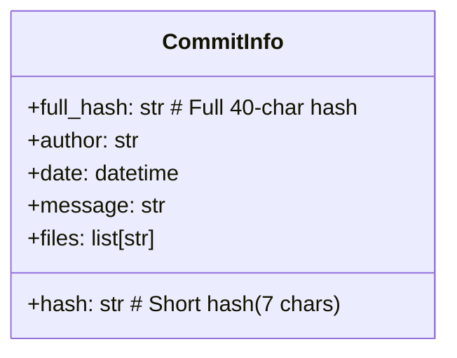
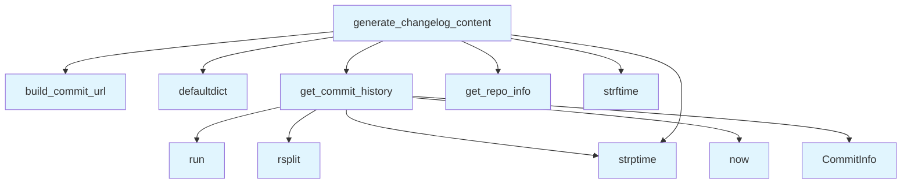

# Changelog Generator

## File Overview

The `changelog.py` module provides functionality for generating changelog content from Git repository history. It analyzes Git commits and formats them into structured changelog documentation, supporting remote repository URL integration for commit linking.

## Classes

### CommitInfo

A dataclass that represents information about a Git commit.

**Fields:**
- Based on the dataclass pattern, this class stores commit-related information
- Uses the `@dataclass` [decorator](../providers/base.md) with `field` for advanced field configuration

## Functions

### get_commit_history

Retrieves the commit history from a Git repository.

**Purpose:** Extracts commit information from the repository's Git history for changelog generation.

### build_commit_url

Constructs URLs for individual commits.

**Purpose:** Creates web-accessible links to commits, likely for integration with remote Git hosting services.

### generate_changelog_content

Generates formatted changelog content from commit data.

**Purpose:** Transforms raw commit information into structured changelog documentation.

## Usage Examples

```python
from local_deepwiki.generators.changelog import (
    get_commit_history, 
    build_commit_url, 
    generate_changelog_content
)

# Get commit history from repository
commits = get_commit_history()

# Generate changelog content
changelog = generate_changelog_content(commits)
```

## Related Components

This module integrates with several other components:

- **[GitRepoInfo](../core/git_utils.md)**: Used for accessing Git repository information
- **[get_repo_info](../core/git_utils.md)**: Function from `local_deepwiki.core.git_utils` for retrieving repository details
- **Logger**: Uses the logging system from `local_deepwiki.logging`

## Dependencies

The module relies on:
- `subprocess`: For executing Git commands
- `collections.defaultdict`: For organizing commit data
- `datetime`: For handling commit timestamps
- `pathlib.Path`: For file system path operations

## API Reference

### class `CommitInfo`

Information about a git commit.

---

### Functions

#### `get_commit_history`

```python
def get_commit_history(repo_path: Path, limit: int = 30) -> list[CommitInfo]
```

Get recent commit history with file changes.


| [Parameter](api_docs.md) | Type | Default | Description |
|-----------|------|---------|-------------|
| `repo_path` | `Path` | - | Path to the repository. |
| `limit` | `int` | `30` | Maximum number of commits to retrieve. |

**Returns:** `list[CommitInfo]`


#### `build_commit_url`

```python
def build_commit_url(repo_info: GitRepoInfo, commit_hash: str) -> str | None
```

Build URL to commit on GitHub/GitLab.


| [Parameter](api_docs.md) | Type | Default | Description |
|-----------|------|---------|-------------|
| `repo_info` | [`GitRepoInfo`](../core/git_utils.md) | - | Repository information. |
| `commit_hash` | `str` | - | Full or short commit hash. |

**Returns:** `str | None`


#### `generate_changelog_content`

```python
def generate_changelog_content(repo_path: Path, max_commits: int = 30) -> str | None
```

Generate changelog markdown content.


| [Parameter](api_docs.md) | Type | Default | Description |
|-----------|------|---------|-------------|
| `repo_path` | `Path` | - | Path to the repository. |
| `max_commits` | `int` | `30` | Maximum commits to include. |

**Returns:** `str | None`


## Class Diagram



## Call Graph



## Usage Examples

*Examples extracted from test files*

### Test getting commit history from a real git repo

From `test_changelog.py::test_returns_commits_from_real_repo`:

```python
commits = get_commit_history(tmp_path, limit=10)

assert len(commits) == 2
```

### Test returns empty list for non-git directory

From `test_changelog.py::test_returns_empty_for_non_git_dir`:

```python
commits = get_commit_history(tmp_path)
assert commits == []
```

### Test building GitHub commit URL

From `test_changelog.py::test_github_url`:

```python
result = build_commit_url(repo_info, "abc1234")
assert result == "https://github.com/owner/repo/commit/abc1234"
```

### Test building GitLab commit URL

From `test_changelog.py::test_gitlab_url`:

```python
result = build_commit_url(repo_info, "abc1234")
assert result == "https://gitlab.com/owner/repo/-/commit/abc1234"
```

### Test generates valid markdown content

From `test_changelog.py::test_generates_markdown`:

```python
content = generate_changelog_content(tmp_path)

assert content is not None
```

## Relevant Source Files

- `src/local_deepwiki/generators/changelog.py:20-28`
