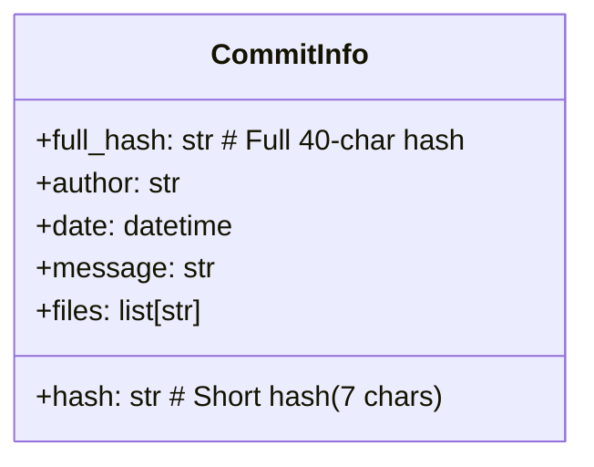
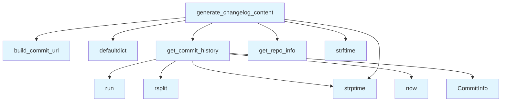

# Changelog Generator

## File Overview

The `changelog.py` module provides functionality for generating changelog documentation from Git commit history. It processes Git commits and formats them into structured changelog content, organizing commits by date and providing links to the repository when available.

## Classes

### CommitInfo

A data class that represents information about a Git commit. This class stores the essential metadata needed to generate changelog entries from commit history.

## Functions

### get_commit_history

Retrieves the Git commit history for changelog generation. This function processes the repository's commit log to extract relevant information for documentation purposes.

### build_commit_url

Constructs URLs linking to specific commits in the repository. This function generates web links to commits when the repository has remote hosting information available.

### generate_changelog_content

Generates formatted changelog content from Git commit history. This is the [main](../export/html.md) function that orchestrates the changelog creation process, combining commit information with formatting to produce the final documentation.

## Dependencies

The module relies on several external components:

- **subprocess**: Used for executing Git commands to retrieve commit history
- **collections.defaultdict**: Provides efficient grouping of commits by date or category
- **dataclasses**: Enables the CommitInfo data structure with field definitions
- **datetime**: Handles date processing and formatting for changelog organization
- **pathlib.Path**: Manages file system paths for repository operations

## Related Components

This module integrates with other parts of the local_deepwiki system:

- **[GitRepoInfo](../core/git_utils.md)**: Uses repository information from the git_utils module to access Git metadata
- **[get_repo_info](../core/git_utils.md)**: Retrieves repository details needed for changelog generation
- **Logging system**: Utilizes the project's logging infrastructure for operation tracking

## Usage Context

The changelog generator is designed to work within the local_deepwiki documentation system, automatically creating changelog documentation from Git commit history. It processes repository commits and formats them into readable changelog entries that can be integrated into the generated documentation.

## API Reference

### class `CommitInfo`

Information about a git commit.

---

### Functions

#### `get_commit_history`

```python
def get_commit_history(repo_path: Path, limit: int = 30) -> list[CommitInfo]
```

Get recent commit history with file changes.


| [Parameter](api_docs.md) | Type | Default | Description |
|-----------|------|---------|-------------|
| `repo_path` | `Path` | - | Path to the repository. |
| `limit` | `int` | `30` | Maximum number of commits to retrieve. |

**Returns:** `list[CommitInfo]`


#### `build_commit_url`

```python
def build_commit_url(repo_info: GitRepoInfo, commit_hash: str) -> str | None
```

Build URL to commit on GitHub/GitLab.


| [Parameter](api_docs.md) | Type | Default | Description |
|-----------|------|---------|-------------|
| `repo_info` | [`GitRepoInfo`](../core/git_utils.md) | - | Repository information. |
| `commit_hash` | `str` | - | Full or short commit hash. |

**Returns:** `str | None`


#### `generate_changelog_content`

```python
def generate_changelog_content(repo_path: Path, max_commits: int = 30) -> str | None
```

Generate changelog markdown content.


| [Parameter](api_docs.md) | Type | Default | Description |
|-----------|------|---------|-------------|
| `repo_path` | `Path` | - | Path to the repository. |
| `max_commits` | `int` | `30` | Maximum commits to include. |

**Returns:** `str | None`


## Class Diagram



## Call Graph



## Usage Examples

*Examples extracted from test files*

### Test getting commit history from a real git repo

From `test_changelog.py::test_returns_commits_from_real_repo`:

```python
commits = get_commit_history(tmp_path, limit=10)

assert len(commits) == 2
```

### Test returns empty list for non-git directory

From `test_changelog.py::test_returns_empty_for_non_git_dir`:

```python
commits = get_commit_history(tmp_path)
assert commits == []
```

### Test building GitHub commit URL

From `test_changelog.py::test_github_url`:

```python
result = build_commit_url(repo_info, "abc1234")
assert result == "https://github.com/owner/repo/commit/abc1234"
```

### Test building GitLab commit URL

From `test_changelog.py::test_gitlab_url`:

```python
result = build_commit_url(repo_info, "abc1234")
assert result == "https://gitlab.com/owner/repo/-/commit/abc1234"
```

### Test generates valid markdown content

From `test_changelog.py::test_generates_markdown`:

```python
content = generate_changelog_content(tmp_path)

assert content is not None
```

## Relevant Source Files

- `src/local_deepwiki/generators/changelog.py:20-28`

## See Also

- [wiki](wiki.md) - uses this
