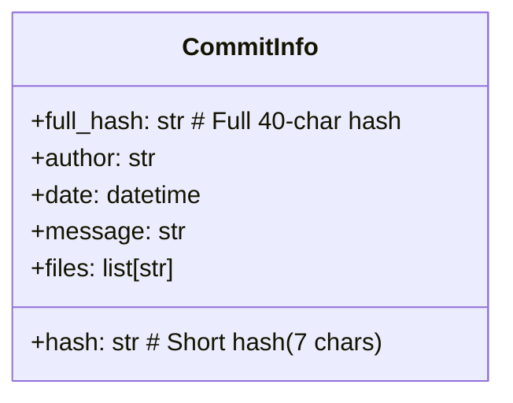
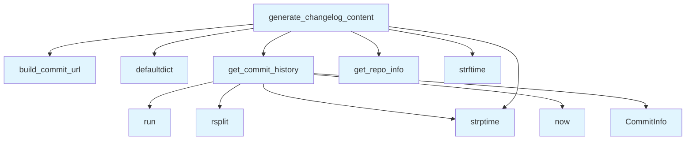

# changelog.py

## File Overview

This module provides functionality for generating changelog documentation from Git commit history. It analyzes Git repository commits and formats them into structured changelog content, supporting various Git hosting platforms for commit URL generation.

## Classes

### CommitInfo

A dataclass that represents information about a Git commit. This class stores the essential metadata needed to generate changelog entries from commit history.

## Functions

### get_commit_history

Retrieves the commit history from a Git repository. This function processes Git log data to extract commit information for changelog generation.

### build_commit_url

Constructs URLs for individual commits based on the Git hosting platform. This function takes commit information and repository details to generate appropriate links to commits on platforms like GitHub, GitLab, or other Git hosting services.

### generate_changelog_content

Generates formatted changelog content from commit history data. This function processes the collected commit information and formats it into a readable changelog structure.

## Usage Examples

```python
from local_deepwiki.generators.changelog import get_commit_history, generate_changelog_content
from local_deepwiki.core.git_utils import get_repo_info

# Get repository information
repo_info = get_repo_info()

# Retrieve commit history
commits = get_commit_history()

# Generate changelog content
changelog = generate_changelog_content(commits, repo_info)
```

## Related Components

This module integrates with several other components:

- **[GitRepoInfo](../core/git_utils.md)**: Used from `local_deepwiki.core.git_utils` to obtain repository metadata
- **[get_repo_info](../core/git_utils.md)**: Function from `local_deepwiki.core.git_utils` for retrieving Git repository information
- **Logging system**: Uses [`local_deepwiki.logging.get_logger`](../logging.md) for logging operations

The module relies on the `subprocess` module for executing Git commands and uses `collections.defaultdict` for organizing commit data by categories or time periods.

## API Reference

### class `CommitInfo`

Information about a git commit.

---


<details>
<summary>View Source (lines 20-28)</summary>

```python
class CommitInfo:
    """Information about a git commit."""

    hash: str  # Short hash (7 chars)
    full_hash: str  # Full 40-char hash
    author: str
    date: datetime
    message: str
    files: list[str] = field(default_factory=list)
```

</details>

### Functions

#### `get_commit_history`

```python
def get_commit_history(repo_path: Path, limit: int = 30) -> list[CommitInfo]
```

Get recent commit history with file changes.


| [Parameter](api_docs.md) | Type | Default | Description |
|-----------|------|---------|-------------|
| `repo_path` | `Path` | - | Path to the repository. |
| `limit` | `int` | `30` | Maximum number of commits to retrieve. |

**Returns:** `list[CommitInfo]`


<details>
<summary>View Source (lines 31-106)</summary>

```python
def get_commit_history(repo_path: Path, limit: int = 30) -> list[CommitInfo]:
    """Get recent commit history with file changes.

    Args:
        repo_path: Path to the repository.
        limit: Maximum number of commits to retrieve.

    Returns:
        List of CommitInfo objects, newest first.
    """
    try:
        # Get commit info with changed files
        # Format: short_hash|full_hash|author|date|message
        # Followed by file names (one per line) until empty line
        result = subprocess.run(
            [
                "git",
                "log",
                f"--max-count={limit}",
                "--pretty=format:%h|%H|%an|%ai|%s",
                "--name-only",
            ],
            cwd=repo_path,
            capture_output=True,
            text=True,
            timeout=30,
        )

        if result.returncode != 0:
            logger.debug(f"Git log failed: {result.stderr}")
            return []

        commits: list[CommitInfo] = []
        current_commit: CommitInfo | None = None

        for line in result.stdout.split("\n"):
            line = line.strip()

            if "|" in line and line.count("|") >= 4:
                # This is a commit header line
                if current_commit:
                    commits.append(current_commit)

                parts = line.split("|", 4)
                if len(parts) >= 5:
                    try:
                        # Parse date (format: 2026-01-13 10:30:00 -0500)
                        date_str = parts[3].rsplit(" ", 1)[0]  # Remove timezone
                        date = datetime.strptime(date_str, "%Y-%m-%d %H:%M:%S")
                    except ValueError:
                        date = datetime.now()

                    current_commit = CommitInfo(
                        hash=parts[0],
                        full_hash=parts[1],
                        author=parts[2],
                        date=date,
                        message=parts[4],
                        files=[],
                    )
            elif line and current_commit:
                # This is a file path
                current_commit.files.append(line)

        # Don't forget the last commit
        if current_commit:
            commits.append(current_commit)

        return commits

    except subprocess.TimeoutExpired:
        logger.warning("Git log timed out")
        return []
    except (FileNotFoundError, OSError) as e:
        logger.debug(f"Failed to get git history: {e}")
        return []
```

</details>

#### `build_commit_url`

```python
def build_commit_url(repo_info: GitRepoInfo, commit_hash: str) -> str | None
```

Build URL to commit on GitHub/GitLab.


| [Parameter](api_docs.md) | Type | Default | Description |
|-----------|------|---------|-------------|
| `repo_info` | [`GitRepoInfo`](../core/git_utils.md) | - | Repository information. |
| `commit_hash` | `str` | - | Full or short commit hash. |

**Returns:** `str | None`


<details>
<summary>View Source (lines 109-128)</summary>

```python
def build_commit_url(repo_info: GitRepoInfo, commit_hash: str) -> str | None:
    """Build URL to commit on GitHub/GitLab.

    Args:
        repo_info: Repository information.
        commit_hash: Full or short commit hash.

    Returns:
        URL string or None if no remote configured.
    """
    if not repo_info.host or not repo_info.owner or not repo_info.repo:
        return None

    host = repo_info.host.lower()

    if "gitlab" in host:
        return f"https://{repo_info.host}/{repo_info.owner}/{repo_info.repo}/-/commit/{commit_hash}"
    else:
        # GitHub and others
        return f"https://{repo_info.host}/{repo_info.owner}/{repo_info.repo}/commit/{commit_hash}"
```

</details>

#### `generate_changelog_content`

```python
def generate_changelog_content(repo_path: Path, max_commits: int = 30) -> str | None
```

Generate changelog markdown content.


| [Parameter](api_docs.md) | Type | Default | Description |
|-----------|------|---------|-------------|
| `repo_path` | `Path` | - | Path to the repository. |
| `max_commits` | `int` | `30` | Maximum commits to include. |

**Returns:** `str | None`


<details>
<summary>View Source (lines 131-213)</summary>

```python
def generate_changelog_content(
    repo_path: Path,
    max_commits: int = 30,
) -> str | None:
    """Generate changelog markdown content.

    Args:
        repo_path: Path to the repository.
        max_commits: Maximum commits to include.

    Returns:
        Markdown string or None if not a git repo.
    """
    commits = get_commit_history(repo_path, limit=max_commits)

    if not commits:
        return None

    repo_info = get_repo_info(repo_path)

    # Group commits by date
    commits_by_date: dict[str, list[CommitInfo]] = defaultdict(list)
    for commit in commits:
        date_key = commit.date.strftime("%Y-%m-%d")
        commits_by_date[date_key].append(commit)

    # Collect unique authors
    authors = set(commit.author for commit in commits)

    # Build markdown
    lines = [
        "# Changelog",
        "",
        "Recent changes to this repository.",
        "",
        "## Recent Commits",
        "",
    ]

    # Sort dates in descending order
    for date_key in sorted(commits_by_date.keys(), reverse=True):
        # Format date header
        date_obj = datetime.strptime(date_key, "%Y-%m-%d")
        date_display = date_obj.strftime("%B %d, %Y")
        lines.append(f"### {date_display}")
        lines.append("")

        for commit in commits_by_date[date_key]:
            # Build commit line with optional link
            commit_url = build_commit_url(repo_info, commit.hash)
            if commit_url:
                commit_ref = f"[`{commit.hash}`]({commit_url})"
            else:
                commit_ref = f"`{commit.hash}`"

            # Truncate long messages
            message = commit.message
            if len(message) > 80:
                message = message[:77] + "..."

            lines.append(f"- {commit_ref} {message}")

            # Show changed files (limit to 5)
            if commit.files:
                files_to_show = commit.files[:5]
                files_str = ", ".join(f"`{f}`" for f in files_to_show)
                if len(commit.files) > 5:
                    files_str += f" (+{len(commit.files) - 5} more)"
                lines.append(f"  - Files: {files_str}")

            lines.append("")

    # Add statistics
    lines.append("## Statistics")
    lines.append("")
    lines.append(f"- **Commits shown**: {len(commits)}")
    lines.append(f"- **Contributors**: {len(authors)}")
    if commits:
        latest_date = commits[0].date.strftime("%Y-%m-%d")
        lines.append(f"- **Latest commit**: {latest_date}")
    lines.append("")

    return "\n".join(lines)
```

</details>

## Class Diagram



## Call Graph



## Usage Examples

*Examples extracted from test files*

### Test getting commit history from a real git repo

From `test_changelog.py::test_returns_commits_from_real_repo`:

```python
commits = get_commit_history(tmp_path, limit=10)

assert len(commits) == 2
```

### Test returns empty list for non-git directory

From `test_changelog.py::test_returns_empty_for_non_git_dir`:

```python
commits = get_commit_history(tmp_path)
assert commits == []
```

### Test building GitHub commit URL

From `test_changelog.py::test_github_url`:

```python
result = build_commit_url(repo_info, "abc1234")
assert result == "https://github.com/owner/repo/commit/abc1234"
```

### Test building GitLab commit URL

From `test_changelog.py::test_gitlab_url`:

```python
result = build_commit_url(repo_info, "abc1234")
assert result == "https://gitlab.com/owner/repo/-/commit/abc1234"
```

### Test generates valid markdown content

From `test_changelog.py::test_generates_markdown`:

```python
content = generate_changelog_content(tmp_path)

assert content is not None
```

## Relevant Source Files

- `src/local_deepwiki/generators/changelog.py:20-28`
