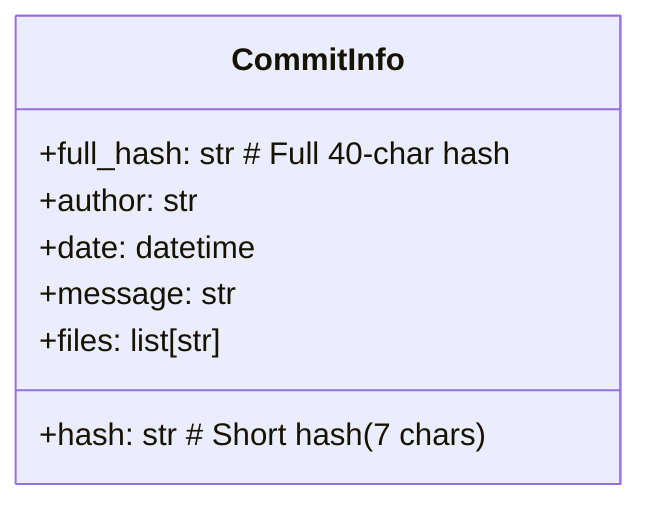
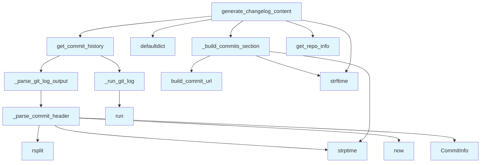

# File Overview

This module is responsible for generating changelog content from a Git repository's commit history. It extracts recent commits, parses their metadata (author, date, message, changed files), and formats them into a human-readable markdown changelog. The module also constructs URLs to commits on GitHub or GitLab, enabling easy navigation to commit details.

The design rationale emphasizes robustness and extensibility:
- It handles potential failures during Git operations gracefully (e.g., timeouts, missing repositories).
- It supports both GitHub and GitLab commit URL schemes.
- It structures commit data by date to provide a clean, chronological view.
- It includes statistics such as contributor count and latest commit date to enrich the changelog.

# Key Concepts

## Git History Parsing

The module uses `git log` with a custom format (`--pretty=format:%h|%H|%an|%ai|%s`) to extract structured commit data. This approach ensures that all relevant metadata is captured in a consistent, parseable format.

## Commit Data Model

The `CommitInfo` dataclass represents a single commit with fields for hash, author, date, message, and changed files. Using a dataclass simplifies data handling and ensures consistent structure across the module.

## Date-Based Grouping

Commits are grouped by date to create a logical flow in the changelog. This grouping enhances readability by clustering changes that occurred on the same day.

## URL Construction

The `build_commit_url` function dynamically constructs commit URLs based on repository host information. It supports both GitHub and GitLab, ensuring compatibility with widely used Git platforms.

# Integration

This module integrates with the broader `local_deepwiki` system through:
- **Core Git Utilities**: It relies on [`get_repo_info`](../core/git_utils.md) from `local_deepwiki.core.git_utils` to determine repository metadata for URL construction.
- **Logging**: It uses [`get_logger`](../logging.md) from `local_deepwiki.logging` to log debug and warning messages during Git operations.
- **External Usage**:
  - `get_commit_history` and `build_commit_url` are used by the `test_changelog` test suite.
  - `generate_changelog_content` is called by the `pages`, `generator_service`, and `test_changelog` components, indicating its role in both runtime generation and testing.

# Design Notes

## Error Handling

The module is designed to gracefully handle Git command failures, timeouts, and missing repository configurations. For instance, if `git log` fails or times out, the function returns `None` or an empty list, allowing callers to handle these cases without crashing.

## Truncation and Formatting

Commit messages are truncated if they exceed a defined maximum length (`COMMIT_MESSAGE_MAX_LENGTH`) to maintain readability. Similarly, the number of changed files displayed per commit is capped (`MAX_CHANGED_FILES_PER_COMMIT`) to avoid clutter.

## Extensibility

The modular structure allows for easy extension:
- Adding new Git hosting platforms (e.g., Bitbucket) requires only modifying `build_commit_url`.
- The date grouping logic can be adapted for different time granularities (e.g., week-based).

## Performance Considerations

The module limits the number of commits fetched (`max_commits`) to avoid performance issues with very large repositories. It also uses efficient data structures like `defaultdict` for grouping commits by date.

## Assumptions

- The Git repository is accessible from the provided `repo_path`.
- The `git` command is available in the system's PATH.
- Repository metadata (host, owner, repo) is correctly configured in `.git/config` or environment variables for URL construction.

## API Reference

### class `CommitInfo`

Information about a git commit.

---


<details>
<summary>View Source (lines 32-40) | <a href="https://github.com/UrbanDiver/local-deepwiki-mcp/blob/main/src/local_deepwiki/generators/changelog.py#L32-L40">GitHub</a></summary>

```python
class CommitInfo:
    """Information about a git commit."""

    hash: str  # Short hash (7 chars)
    full_hash: str  # Full 40-char hash
    author: str
    date: datetime
    message: str
    files: list[str] = field(default_factory=list)
```

</details>

### Functions

#### `get_commit_history`

```python
def get_commit_history(repo_path: Path, limit: int = 30) -> list[CommitInfo]
```

Get recent commit history with file changes.


| Parameter | Type | Default | Description |
|-----------|------|---------|-------------|
| `repo_path` | `Path` | - | Path to the repository. |
| `limit` | `int` | `30` | Maximum number of commits to retrieve. |

**Returns:** `list[CommitInfo]`


<details>
<summary>View Source (lines 110-123) | <a href="https://github.com/UrbanDiver/local-deepwiki-mcp/blob/main/src/local_deepwiki/generators/changelog.py#L110-L123">GitHub</a></summary>

```python
def get_commit_history(repo_path: Path, limit: int = 30) -> list[CommitInfo]:
    """Get recent commit history with file changes.

    Args:
        repo_path: Path to the repository.
        limit: Maximum number of commits to retrieve.

    Returns:
        List of CommitInfo objects, newest first.
    """
    output = _run_git_log(repo_path, limit)
    if output is None:
        return []
    return _parse_git_log_output(output)
```

</details>

#### `build_commit_url`

```python
def build_commit_url(repo_info: GitRepoInfo, commit_hash: str) -> str | None
```

Build URL to commit on GitHub/GitLab.


| Parameter | Type | Default | Description |
|-----------|------|---------|-------------|
| `repo_info` | `GitRepoInfo` | - | Repository information. |
| `commit_hash` | `str` | - | Full or short commit hash. |

**Returns:** `str | None`


<details>
<summary>View Source (lines 126-145) | <a href="https://github.com/UrbanDiver/local-deepwiki-mcp/blob/main/src/local_deepwiki/generators/changelog.py#L126-L145">GitHub</a></summary>

```python
def build_commit_url(repo_info: GitRepoInfo, commit_hash: str) -> str | None:
    """Build URL to commit on GitHub/GitLab.

    Args:
        repo_info: Repository information.
        commit_hash: Full or short commit hash.

    Returns:
        URL string or None if no remote configured.
    """
    if not repo_info.host or not repo_info.owner or not repo_info.repo:
        return None

    host = repo_info.host.lower()

    if "gitlab" in host:
        return f"https://{repo_info.host}/{repo_info.owner}/{repo_info.repo}/-/commit/{commit_hash}"
    else:
        # GitHub and others
        return f"https://{repo_info.host}/{repo_info.owner}/{repo_info.repo}/commit/{commit_hash}"
```

</details>

#### `generate_changelog_content`

```python
def generate_changelog_content(repo_path: Path, max_commits: int = 30) -> str | None
```

Generate changelog markdown content.


| Parameter | Type | Default | Description |
|-----------|------|---------|-------------|
| `repo_path` | `Path` | - | Path to the repository. |
| `max_commits` | `int` | `30` | Maximum commits to include. |

**Returns:** `str | None`


<details>
<summary>View Source (lines 179-226) | <a href="https://github.com/UrbanDiver/local-deepwiki-mcp/blob/main/src/local_deepwiki/generators/changelog.py#L179-L226">GitHub</a></summary>

```python
def generate_changelog_content(
    repo_path: Path,
    max_commits: int = 30,
) -> str | None:
    """Generate changelog markdown content.

    Args:
        repo_path: Path to the repository.
        max_commits: Maximum commits to include.

    Returns:
        Markdown string or None if not a git repo.
    """
    commits = get_commit_history(repo_path, limit=max_commits)
    if not commits:
        return None

    repo_info = get_repo_info(repo_path)

    commits_by_date: dict[str, list[CommitInfo]] = defaultdict(list)
    for commit in commits:
        commits_by_date[commit.date.strftime("%Y-%m-%d")].append(commit)

    authors = {commit.author for commit in commits}

    lines: list[str] = [
        "# Changelog",
        "",
        "Recent changes to this repository.",
        "",
        "## Recent Commits",
        "",
    ]
    lines.extend(_build_commits_section(commits_by_date, repo_info))

    lines.extend(
        [
            "## Statistics",
            "",
            f"- **Commits shown**: {len(commits)}",
            f"- **Contributors**: {len(authors)}",
        ]
    )
    if commits:
        lines.append(f"- **Latest commit**: {commits[0].date.strftime('%Y-%m-%d')}")
    lines.append("")

    return "\n".join(lines)
```

</details>

## Class Diagram


```mermaid
classDiagram
    class CommitInfo {
        +hash: str  # Short hash (7 chars)
        +full_hash: str  # Full 40-char hash
        +author: str
        +date: datetime
        +message: str
        +files: list[str]
    }
```

## Call Graph


```mermaid
flowchart TD
    N0[CommitInfo]
    N1[_build_commits_section]
    N2[_parse_commit_header]
    N3[_parse_git_log_output]
    N4[_run_git_log]
    N5[build_commit_url]
    N6[defaultdict]
    N7[generate_changelog_content]
    N8[get_commit_history]
    N9[get_repo_info]
    N10[now]
    N11[rsplit]
    N12[run]
    N13[strftime]
    N14[strptime]
    N4 --> N12
    N2 --> N11
    N2 --> N14
    N2 --> N10
    N2 --> N0
    N3 --> N2
    N8 --> N4
    N8 --> N3
    N1 --> N14
    N1 --> N13
    N1 --> N5
    N7 --> N8
    N7 --> N9
    N7 --> N6
    N7 --> N13
    N7 --> N1
    classDef func fill:#e1f5fe
    class N0,N1,N2,N3,N4,N5,N6,N7,N8,N9,N10,N11,N12,N13,N14 func
```

## Used By

Functions and methods in this file and their callers:

- **`CommitInfo`**: called by `_parse_commit_header`
- **`_build_commits_section`**: called by `generate_changelog_content`
- **`_parse_commit_header`**: called by `_parse_git_log_output`
- **`_parse_git_log_output`**: called by `get_commit_history`
- **`_run_git_log`**: called by `get_commit_history`
- **`build_commit_url`**: called by `_build_commits_section`
- **`defaultdict`**: called by `generate_changelog_content`
- **`get_commit_history`**: called by `generate_changelog_content`
- **[`get_repo_info`](../core/git_utils.md)**: called by `generate_changelog_content`
- **`now`**: called by `_parse_commit_header`
- **`rsplit`**: called by `_parse_commit_header`
- **`run`**: called by `_run_git_log`
- **`strftime`**: called by `_build_commits_section`, `generate_changelog_content`
- **`strptime`**: called by `_build_commits_section`, `_parse_commit_header`

## Usage Examples

*Examples extracted from test files*

### Test getting commit history from a real git repo

From `test_changelog.py::TestGetCommitHistory::test_returns_commits_from_real_repo`:

```python
commits = get_commit_history(tmp_path, limit=10)

assert len(commits) == 2
# Newest commit first
assert commits[0].message == "Add second file"
```

### Test returns empty list for non-git directory

From `test_changelog.py::TestGetCommitHistory::test_returns_empty_for_non_git_dir`:

```python
commits = get_commit_history(tmp_path)
assert commits == []
```

### Test that TimeoutExpired returns empty list

From `test_changelog.py::TestGetCommitHistory::test_handles_timeout`:

```python
"local_deepwiki.generators.changelog.subprocess.run",
    side_effect=subprocess.TimeoutExpired(cmd="git", timeout=30),
):
    commits = get_commit_history(tmp_path, limit=10)

assert commits == []
```

### Test building GitHub commit URL

From `test_changelog.py::TestBuildCommitUrl::test_github_url`:

```python
repo_info = GitRepoInfo(
    remote_url="https://github.com/owner/repo",
    host="github.com",
    owner="owner",
    repo="repo",
    default_branch="main",
)
result = build_commit_url(repo_info, "abc1234")
assert result == "https://github.com/owner/repo/commit/abc1234"
```

### Test building GitLab commit URL

From `test_changelog.py::TestBuildCommitUrl::test_gitlab_url`:

```python
repo_info = GitRepoInfo(
    remote_url="https://gitlab.com/owner/repo",
    host="gitlab.com",
    owner="owner",
    repo="repo",
    default_branch="main",
)
result = build_commit_url(repo_info, "abc1234")
assert result == "https://gitlab.com/owner/repo/-/commit/abc1234"
```


## Last Modified

| Entity | Type | Author | Date | Commit |
|--------|------|--------|------|--------|
| `_build_commits_section` | function | Brian Breidenbach | yesterday | `29ae780` refactor: decompose long me... |
| `generate_changelog_content` | function | Brian Breidenbach | yesterday | `29ae780` refactor: decompose long me... |
| `_run_git_log` | function | Brian Breidenbach | 2 days ago | `8b8f36f` refactor: decompose CC > 15... |
| `_parse_commit_header` | function | Brian Breidenbach | 2 days ago | `8b8f36f` refactor: decompose CC > 15... |
| `_parse_git_log_output` | function | Brian Breidenbach | 2 days ago | `8b8f36f` refactor: decompose CC > 15... |
| `get_commit_history` | function | Brian Breidenbach | 2 days ago | `8b8f36f` refactor: decompose CC > 15... |
| `CommitInfo` | class | Brian Breidenbach | Jan 14, 2026 | `15e7e64` Add changelog wiki page fro... |
| `build_commit_url` | function | Brian Breidenbach | Jan 14, 2026 | `15e7e64` Add changelog wiki page fro... |

## Additional Source Code

Source code for functions and methods not listed in the API Reference above.

#### `_run_git_log`

<details>
<summary>View Source (lines 43-68) | <a href="https://github.com/UrbanDiver/local-deepwiki-mcp/blob/main/src/local_deepwiki/generators/changelog.py#L43-L68">GitHub</a></summary>

```python
def _run_git_log(repo_path: Path, limit: int) -> str | None:
    """Run git log and return stdout, or None on failure."""
    try:
        result = subprocess.run(
            [
                "git",
                "log",
                f"--max-count={limit}",
                "--pretty=format:%h|%H|%an|%ai|%s",
                "--name-only",
            ],
            cwd=repo_path,
            capture_output=True,
            text=True,
            timeout=GIT_LOG_TIMEOUT,
        )
        if result.returncode != 0:
            logger.debug("Git log failed: %s", result.stderr)
            return None
        return result.stdout
    except subprocess.TimeoutExpired:
        logger.warning("Git log timed out")
        return None
    except (FileNotFoundError, OSError) as e:
        logger.debug("Failed to get git history: %s", e)
        return None
```

</details>


#### `_parse_commit_header`

<details>
<summary>View Source (lines 71-88) | <a href="https://github.com/UrbanDiver/local-deepwiki-mcp/blob/main/src/local_deepwiki/generators/changelog.py#L71-L88">GitHub</a></summary>

```python
def _parse_commit_header(line: str) -> CommitInfo | None:
    """Parse a git log header line into a CommitInfo (files list empty)."""
    parts = line.split("|", 4)
    if len(parts) < 5:
        return None
    try:
        date_str = parts[3].rsplit(" ", 1)[0]
        date = datetime.strptime(date_str, "%Y-%m-%d %H:%M:%S")
    except ValueError:
        date = datetime.now()
    return CommitInfo(
        hash=parts[0],
        full_hash=parts[1],
        author=parts[2],
        date=date,
        message=parts[4],
        files=[],
    )
```

</details>


#### `_parse_git_log_output`

<details>
<summary>View Source (lines 91-107) | <a href="https://github.com/UrbanDiver/local-deepwiki-mcp/blob/main/src/local_deepwiki/generators/changelog.py#L91-L107">GitHub</a></summary>

```python
def _parse_git_log_output(output: str) -> list[CommitInfo]:
    """Parse git log output into a list of CommitInfo objects."""
    commits: list[CommitInfo] = []
    current_commit: CommitInfo | None = None

    for line in output.split("\n"):
        line = line.strip()
        if "|" in line and line.count("|") >= 4:
            if current_commit:
                commits.append(current_commit)
            current_commit = _parse_commit_header(line)
        elif line and current_commit:
            current_commit.files.append(line)

    if current_commit:
        commits.append(current_commit)
    return commits
```

</details>


#### `_build_commits_section`

<details>
<summary>View Source (lines 148-176) | <a href="https://github.com/UrbanDiver/local-deepwiki-mcp/blob/main/src/local_deepwiki/generators/changelog.py#L148-L176">GitHub</a></summary>

```python
def _build_commits_section(
    commits_by_date: dict[str, list[CommitInfo]],
    repo_info: GitRepoInfo | None,
) -> list[str]:
    """Build the dated commit listing section of the changelog."""
    lines: list[str] = []
    for date_key in sorted(commits_by_date.keys(), reverse=True):
        date_obj = datetime.strptime(date_key, "%Y-%m-%d")
        lines.append(f"### {date_obj.strftime('%B %d, %Y')}")
        lines.append("")
        for commit in commits_by_date[date_key]:
            commit_url = build_commit_url(repo_info, commit.hash)
            commit_ref = (
                f"[`{commit.hash}`]({commit_url})" if commit_url else f"`{commit.hash}`"
            )
            message = commit.message
            if len(message) > COMMIT_MESSAGE_MAX_LENGTH:
                message = message[:COMMIT_MESSAGE_TRUNCATED_LENGTH] + "..."
            lines.append(f"- {commit_ref} {message}")
            if commit.files:
                files_to_show = commit.files[:MAX_CHANGED_FILES_PER_COMMIT]
                files_str = ", ".join(f"`{f}`" for f in files_to_show)
                if len(commit.files) > MAX_CHANGED_FILES_PER_COMMIT:
                    files_str += (
                        f" (+{len(commit.files) - MAX_CHANGED_FILES_PER_COMMIT} more)"
                    )
                lines.append(f"  - Files: {files_str}")
            lines.append("")
    return lines
```

</details>

## Relevant Source Files

- `src/local_deepwiki/generators/changelog.py:32-40`
