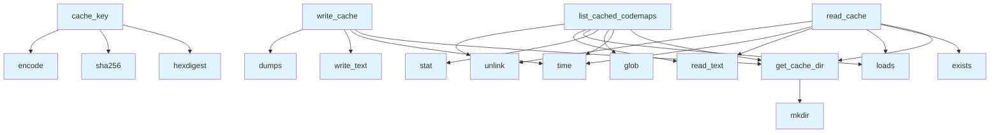

# File: `src/local_deepwiki/generators/codemap/cache.py`

## File Overview

This module provides a persistent caching mechanism for codemap results, allowing generated codemaps to be stored and retrieved efficiently to avoid recomputation. It supports storing codemap data as JSON files in a dedicated cache directory, with a configurable time-to-live (TTL) to manage cache freshness.

The cache is keyed by a combination of query parameters (`query`, `focus`, `max_depth`, `max_nodes`) and uses a SHA-256 hash to ensure uniqueness and prevent collisions. The module handles cache creation, reading, writing, and listing of cached entries.

## Key Concepts

### Cache Key Generation
The `cache_key` function generates a unique identifier for each codemap based on the input parameters. This is done using a SHA-256 hash of a concatenated string of the parameters, truncated to 16 characters. This approach ensures that identical inputs produce identical keys, while keeping the key length manageable.

**Why chosen**: This method provides a balance between uniqueness and brevity. Using a hash avoids storing large parameter strings in filenames, and truncation keeps the filenames short and manageable.

### TTL-Based Cache Expiration
All cached codemap files include a timestamp (`cached_at`) and are checked against a TTL (default 1 hour) when read. If expired, the file is removed from the cache and the function returns `None`.

**Why chosen**: This prevents stale data from being used indefinitely and ensures that cache space is reclaimed over time. It also supports a simple but effective cache invalidation strategy.

### File-Based Storage
Codemap results are stored as JSON files in a directory named `codemaps` within the wiki path. Each file is named using its cache key, ensuring one-to-one mapping between cache entries and files.

**Why chosen**: File-based storage is simple, persistent, and allows for easy manual inspection or debugging of cached data. It also integrates well with standard filesystem operations and is compatible with version control systems.

## Integration

This module is used by several components in the `local_deepwiki` codebase:

- `list_cached_codemaps` is called by `routes_codemap` and `test_codemap_cache`, enabling UI or test code to display or validate cached results.
- `read_cache` and `write_cache` are used by `test_codemap_cache` and `test_embedding_cache`, indicating that this module supports both codemap and embedding caching workflows.
- `cache_key` is used by `cache`, `test_codemap_cache`, and `test_embedding_cache`, suggesting that this key generation logic is shared across multiple caching subsystems.

The `get_cache_dir` function is used by `test_codemap_cache`, helping to isolate cache directories during testing.

This module is part of the codemap generation system, and its integration with `local_deepwiki.core.git_blame` suggests that it supports caching of codemap data derived from Git blame information.

## Design Notes

### Cache Directory Handling
The `get_cache_dir` function creates the cache directory if it does not exist, ensuring that the system can always write to the cache. If `wiki_path` is `None`, it returns `None`, indicating that caching is disabled.

**Edge case handled**: If the `wiki_path` is not provided, caching is gracefully disabled.

### Error Handling
All file operations are wrapped in `try...except` blocks to handle potential `OSError` or `json.JSONDecodeError` exceptions. If a cache file is corrupted or unreadable, it is silently ignored, and the function returns `None` or continues processing.

**Trade-off**: This design prioritizes robustness over strict error reporting, which is appropriate for a cache system where transient issues should not halt execution.

### Cache Listing and Cleanup
The `list_cached_codemaps` function iterates over all `.json` files in the cache directory, checks their TTL, and removes expired files. It returns a list of up to 20 most recently cached entries.

**Non-obvious choice**: The function sorts by modification time in descending order to show the most recent entries first, and limits results to 20 to prevent overwhelming output. Expired entries are removed during listing to keep the cache clean.

### Logger Usage
The module imports [`get_logger`](../../logging.md) but does not directly use it in the visible code. This suggests that `logger` is likely used internally for debugging or error reporting, but is not visible in the provided code snippets.

**Design note**: This is a common pattern for modules that may want to log internal behavior but do not currently do so in the code shown.

## API Reference

### Functions

#### `get_cache_dir`

```python
def get_cache_dir(wiki_path: Path | None) -> Path | None
```

Get the codemap cache directory, creating it if needed.


| Parameter | Type | Default | Description |
|-----------|------|---------|-------------|
| `wiki_path` | `Path | None` | - | - |

**Returns:** `Path | None`


<details>
<summary>View Source (lines 22-28) | <a href="https://github.com/UrbanDiver/local-deepwiki-mcp/blob/main/src/local_deepwiki/generators/codemap/cache.py#L22-L28">GitHub</a></summary>

```python
def get_cache_dir(wiki_path: Path | None) -> Path | None:
    """Get the codemap cache directory, creating it if needed."""
    if wiki_path is None:
        return None
    cache_dir = wiki_path / "codemaps"
    cache_dir.mkdir(exist_ok=True)
    return cache_dir
```

</details>

#### `cache_key`

```python
def cache_key(query: str, focus: str, max_depth: int, max_nodes: int) -> str
```

Generate a cache key from codemap parameters.


| Parameter | Type | Default | Description |
|-----------|------|---------|-------------|
| `query` | `str` | - | - |
| `focus` | `str` | - | - |
| `max_depth` | `int` | - | - |
| `max_nodes` | `int` | - | - |

**Returns:** `str`


<details>
<summary>View Source (lines 31-34) | <a href="https://github.com/UrbanDiver/local-deepwiki-mcp/blob/main/src/local_deepwiki/generators/codemap/cache.py#L31-L34">GitHub</a></summary>

```python
def cache_key(query: str, focus: str, max_depth: int, max_nodes: int) -> str:
    """Generate a cache key from codemap parameters."""
    raw = f"{query}|{focus}|{max_depth}|{max_nodes}"
    return hashlib.sha256(raw.encode()).hexdigest()[:16]
```

</details>

#### `read_cache`

```python
def read_cache(wiki_path: Path | None, key: str) -> dict | None
```

Read a cached codemap result if it exists and hasn't expired.


| Parameter | Type | Default | Description |
|-----------|------|---------|-------------|
| `wiki_path` | `Path | None` | - | - |
| `key` | `str` | - | - |

**Returns:** `dict | None`


<details>
<summary>View Source (lines 37-55) | <a href="https://github.com/UrbanDiver/local-deepwiki-mcp/blob/main/src/local_deepwiki/generators/codemap/cache.py#L37-L55">GitHub</a></summary>

```python
def read_cache(wiki_path: Path | None, key: str) -> dict | None:
    """Read a cached codemap result if it exists and hasn't expired."""
    cache_dir = get_cache_dir(wiki_path)
    if cache_dir is None:
        return None

    cache_file = cache_dir / f"{key}.json"
    if not cache_file.exists():
        return None

    try:
        data = json.loads(cache_file.read_text())
        cached_at = data.get("cached_at", 0)
        if time.time() - cached_at > CODEMAP_CACHE_TTL:
            cache_file.unlink(missing_ok=True)
            return None
        return data
    except (json.JSONDecodeError, OSError):
        return None
```

</details>

#### `write_cache`

```python
def write_cache(wiki_path: Path | None, key: str, result: dict) -> None
```

Write a codemap result to the cache.


| Parameter | Type | Default | Description |
|-----------|------|---------|-------------|
| `wiki_path` | `Path | None` | - | - |
| `key` | `str` | - | - |
| `result` | `dict` | - | - |

**Returns:** `None`


<details>
<summary>View Source (lines 58-69) | <a href="https://github.com/UrbanDiver/local-deepwiki-mcp/blob/main/src/local_deepwiki/generators/codemap/cache.py#L58-L69">GitHub</a></summary>

```python
def write_cache(wiki_path: Path | None, key: str, result: dict) -> None:
    """Write a codemap result to the cache."""
    cache_dir = get_cache_dir(wiki_path)
    if cache_dir is None:
        return

    cache_data = {**result, "cached_at": time.time(), "cache_key": key}
    cache_file = cache_dir / f"{key}.json"
    try:
        cache_file.write_text(json.dumps(cache_data))
    except OSError:
        logger.debug("Failed to write codemap cache: %s", key)
```

</details>

#### `list_cached_codemaps`

```python
def list_cached_codemaps(wiki_path: Path | None) -> list[dict]
```

List all cached codemaps with metadata.


| Parameter | Type | Default | Description |
|-----------|------|---------|-------------|
| `wiki_path` | `Path | None` | - | - |

**Returns:** `list[dict]`


<details>
<summary>View Source (lines 72-102) | <a href="https://github.com/UrbanDiver/local-deepwiki-mcp/blob/main/src/local_deepwiki/generators/codemap/cache.py#L72-L102">GitHub</a></summary>

```python
def list_cached_codemaps(wiki_path: Path | None) -> list[dict]:
    """List all cached codemaps with metadata."""
    cache_dir = get_cache_dir(wiki_path)
    if cache_dir is None:
        return []

    results = []
    now = time.time()
    for f in sorted(
        cache_dir.glob("*.json"), key=lambda p: p.stat().st_mtime, reverse=True
    ):
        try:
            data = json.loads(f.read_text())
            cached_at = data.get("cached_at", 0)
            if now - cached_at > CODEMAP_CACHE_TTL:
                f.unlink(missing_ok=True)
                continue
            results.append(
                {
                    "cache_key": data.get("cache_key", f.stem),
                    "query": data.get("query", ""),
                    "focus": data.get("focus", ""),
                    "total_nodes": data.get("total_nodes", 0),
                    "total_edges": data.get("total_edges", 0),
                    "cached_at": cached_at,
                }
            )
        except (json.JSONDecodeError, OSError):
            continue

    return results[:20]
```

</details>

## Call Graph



## Used By

Functions and methods in this file and their callers:

- **`dumps`**: called by `write_cache`
- **`encode`**: called by `cache_key`
- **`exists`**: called by `read_cache`
- **`get_cache_dir`**: called by `list_cached_codemaps`, `read_cache`, `write_cache`
- **`glob`**: called by `list_cached_codemaps`
- **`hexdigest`**: called by `cache_key`
- **`loads`**: called by `list_cached_codemaps`, `read_cache`
- **`mkdir`**: called by `get_cache_dir`
- **`read_text`**: called by `list_cached_codemaps`, `read_cache`
- **`sha256`**: called by `cache_key`
- **`stat`**: called by `list_cached_codemaps`
- **`time`**: called by `list_cached_codemaps`, `read_cache`, `write_cache`
- **`unlink`**: called by `list_cached_codemaps`, `read_cache`
- **`write_text`**: called by `write_cache`

## Last Modified

| Entity | Type | Author | Date | Commit |
|--------|------|--------|------|--------|
| `write_cache` | function | Brian Breidenbach | Feb 11, 2026 | `ba96da1` fix: publication plan P0-P2... |
| `get_cache_dir` | function | Brian Breidenbach | Feb 08, 2026 | `e8824ed` refactor: Extract codemap c... |
| `cache_key` | function | Brian Breidenbach | Feb 08, 2026 | `e8824ed` refactor: Extract codemap c... |
| `read_cache` | function | Brian Breidenbach | Feb 08, 2026 | `e8824ed` refactor: Extract codemap c... |
| `list_cached_codemaps` | function | Brian Breidenbach | Feb 08, 2026 | `e8824ed` refactor: Extract codemap c... |

## Relevant Source Files

- `src/local_deepwiki/generators/codemap/cache.py:22-28`
