# File: `src/local_deepwiki/generators/codemap/generator.py`

## File Overview

This module implements the core logic for generating cross-file codemaps — visual and narrative representations of code flows based on user queries. It orchestrates a multi-step process that begins with identifying relevant entry points using vector search, traverses the codebase using a breadth-first search (BFS) approach, builds a cross-file call graph, and finally synthesizes a narrative trace using an LLM.

The primary entry point is `generate_codemap`, which accepts a query and returns a structured result including a Mermaid diagram, a narrative explanation, and metadata about the nodes and edges in the graph.

Additionally, this module provides utilities for suggesting topics for codemap generation based on call-graph hubs, filtering out test-related code to focus on production flows.

## Key Concepts

### Cross-File BFS Traversal

The module uses a breadth-first search (BFS) traversal algorithm to explore code paths from entry points. This ensures deterministic, readable traversal order and avoids deep recursion or stack overflow issues. The traversal respects a maximum depth and node count to prevent performance degradation on large codebases.

### Narrative Synthesis with LLM

A narrative trace is generated using an LLM by:
1. Formatting the discovered graph nodes and edges into a prompt.
2. Using a system prompt tailored to either execution flow or data flow focus.
3. Sending the prompt to the LLM provider for synthesis.

This approach enables dynamic, human-readable explanations of code paths that can be customized based on the query context.

### Topic Suggestion Engine

The `suggest_topics` function identifies interesting code areas for exploration by:
1. Building a combined call graph across all files.
2. Scoring functions by connection count, chunk type weights, and import popularity.
3. Filtering out test files and functions with insufficient outbound calls.
4. Validating suggestions via vector search to ensure they return relevant code.

This system helps users discover new areas of interest in the codebase without needing to formulate specific queries.

### Call Graph and Connection Weighting

The module leverages call graph analysis to:
- Identify hub functions that are frequently called or call many others.
- Apply weights to different chunk types (e.g., functions vs. classes) to reflect their importance.
- Boost scores for functions in modules that are heavily imported.
- Filter out noise (e.g., built-in names, test helpers) to focus on meaningful connections.

This approach provides a robust way to rank functions for both codemap generation and topic suggestions.

## Integration

This module is part of the `local_deepwiki.generators.codemap` package and integrates with several core components of the system:

- **[Vector Store](../../core/vectorstore/store.md)**: Used in [`discover_entry_points`](graph.md) and `suggest_topics` to find relevant code chunks.
- **[LLM Provider](../../providers/base.md)**: Used in `generate_codemap_narrative` to generate natural language explanations.
- **[Call Graph Extractor](../analysis/callgraph.md)**: Used in `suggest_topics` and `_build_combined_call_graph` to extract and analyze code call relationships.
- **Path Utilities**: Used in `_is_test_path` to filter out test files.
- **Models and Parameters**: Imported from `local_deepwiki.generators.codemap.models` and `local_deepwiki.generators.codemap.params` to define types and request structures.

The `generate_codemap` function is called by several other modules in the project, such as `onboarding`, `models`, and `params`, indicating its role as a central codemap generation service.

The `suggest_topics` function is used in the CLI or UI layers to provide users with suggested queries for exploring the codebase.

## Design Notes

### Why BFS?

BFS is chosen over DFS for traversal because it provides a deterministic, shallow exploration of the codebase. This ensures that the generated codemap is predictable and manageable in size, especially when a maximum depth is enforced.

### LLM Prompt Construction

The prompt is carefully constructed to:
- Keep the total character count under thresholds to avoid token limit issues.
- Use full preview for smaller graphs and truncated previews for larger ones.
- Include edges explicitly to give context about relationships.

This design balances the LLM's ability to understand the structure with performance constraints.

### Test Filtering

The module consistently filters out test files using `_is_test_path`, which delegates to a centralized utility. This ensures that codemaps focus on real execution paths and exclude test helpers, fixtures, and boilerplate code.

### Connection Counting and Weighting

Connection counting is weighted by:
- Chunk type (e.g., functions are weighted differently from classes).
- Module import popularity (functions in heavily imported modules get a boost).

This weighting helps prioritize important or widely-used code areas in both codemap generation and topic suggestions.

### Validation in Topic Suggestions

Topic suggestions are validated using vector search to ensure that each suggested query would return meaningful code chunks. This prevents generating suggestions that would result in empty or irrelevant codemaps, improving the user experience.

### Error Handling and Fallbacks

The module includes fallbacks for:
- LLM failures during narrative generation.
- Missing or corrupted chunks during graph building.
- Import errors in optional dependencies.

These fallbacks ensure that the system remains robust and usable even when parts of the pipeline encounter issues.

## API Reference

### Functions

#### `generate_codemap_narrative`

```python
async def generate_codemap_narrative(graph: CodemapGraph, query: str, focus: CodemapFocus, llm: "LLMProvider") -> str
```

Use *llm* to synthesise a narrative trace for the codemap.


| Parameter | Type | Default | Description |
|-----------|------|---------|-------------|
| `graph` | `CodemapGraph` | - | - |
| `query` | `str` | - | - |
| `focus` | `CodemapFocus` | - | - |
| `llm` | `"LLMProvider"` | - | - |

**Returns:** `str`


<details>
<summary>View Source (lines 153-178) | <a href="https://github.com/UrbanDiver/local-deepwiki-mcp/blob/main/src/local_deepwiki/generators/codemap/generator.py#L153-L178">GitHub</a></summary>

```python
async def generate_codemap_narrative(
    graph: CodemapGraph,
    query: str,
    focus: CodemapFocus,
    llm: "LLMProvider",
) -> str:
    """Use *llm* to synthesise a narrative trace for the codemap."""
    if not graph.nodes:
        return "No nodes in the graph to narrate."

    ordered = _bfs_ordered_nodes(graph)
    user_prompt = _build_narrative_prompt(graph, query, focus, ordered)
    system_prompt = (
        _DATA_FLOW_SYSTEM_PROMPT if focus == CodemapFocus.DATA_FLOW else _SYSTEM_PROMPT
    )

    try:
        return await llm.generate(
            prompt=user_prompt,
            system_prompt=system_prompt,
            max_tokens=2048,
            temperature=0.3,
        )
    except (ValueError, RuntimeError, OSError, TypeError):
        logger.exception("LLM narrative generation failed")
        return _FALLBACK_NARRATIVE
```

</details>

#### `generate_codemap`

```python
async def generate_codemap(query: str, vector_store: "VectorStore", repo_path: Path, llm: "LLMProvider") -> CodemapResult
```

Main entry point: build a codemap for *query* and return a full result.  Keyword args (all optional): entry_point: Explicit entry point hint. focus: `[`CodemapFocus`](models.md)` traversal mode (default ``EXECUTION_FLOW``). max_depth: Maximum BFS depth (default 4). max_nodes: Maximum graph nodes (default 40).


| Parameter | Type | Default | Description |
|-----------|------|---------|-------------|
| `query` | `str` | - | - |
| `vector_store` | `"VectorStore"` | - | - |
| `repo_path` | `Path` | - | - |
| `llm` | `"LLMProvider"` | - | - |

**Returns:** [`CodemapResult`](models.md)


<details>
<summary>View Source (lines 303-328) | <a href="https://github.com/UrbanDiver/local-deepwiki-mcp/blob/main/src/local_deepwiki/generators/codemap/generator.py#L303-L328">GitHub</a></summary>

```python
async def generate_codemap(
    query: str,
    vector_store: "VectorStore",
    repo_path: Path,
    llm: "LLMProvider",
    **kwargs: object,
) -> CodemapResult:
    """Main entry point: build a codemap for *query* and return a full result.

    Keyword args (all optional):
        entry_point: Explicit entry point hint.
        focus: ``CodemapFocus`` traversal mode (default ``EXECUTION_FLOW``).
        max_depth: Maximum BFS depth (default 4).
        max_nodes: Maximum graph nodes (default 40).
    """
    req = CodemapRequest(
        query=query,
        vector_store=vector_store,
        repo_path=Path(repo_path),
        llm=llm,
        entry_point=kwargs.get("entry_point"),  # type: ignore[arg-type]
        focus=kwargs.get("focus", CodemapFocus.EXECUTION_FLOW),  # type: ignore[arg-type]
        max_depth=kwargs.get("max_depth", 4),  # type: ignore[arg-type]
        max_nodes=kwargs.get("max_nodes", 40),  # type: ignore[arg-type]
    )
    return await _generate_codemap_impl(req)
```

</details>

#### `suggest_topics`

```python
async def suggest_topics(vector_store: "VectorStore", repo_path: Path, max_suggestions: int = 8) -> list[dict[str, Any]]
```

Suggest interesting codemap topics based on call-graph hubs.  Focuses on production source code -- test helpers and fixtures are excluded so that codemap pages document real execution flows.  Returns a list of suggestion dicts sorted by connection count.


| Parameter | Type | Default | Description |
|-----------|------|---------|-------------|
| `vector_store` | `"VectorStore"` | - | - |
| `repo_path` | `Path` | - | - |
| `max_suggestions` | `int` | `8` | - |

**Returns:** `list[dict[str, Any]]`


<details>
<summary>View Source (lines 549-612) | <a href="https://github.com/UrbanDiver/local-deepwiki-mcp/blob/main/src/local_deepwiki/generators/codemap/generator.py#L549-L612">GitHub</a></summary>

```python
async def suggest_topics(
    vector_store: "VectorStore",
    repo_path: Path,
    max_suggestions: int = 8,
) -> list[dict[str, Any]]:
    """Suggest interesting codemap topics based on call-graph hubs.

    Focuses on production source code -- test helpers and fixtures are
    excluded so that codemap pages document real execution flows.

    Returns a list of suggestion dicts sorted by connection count.
    """
    try:
        from local_deepwiki.generators.analysis.callgraph import CallGraphExtractor  # noqa: F401
    except ImportError:  # pragma: no cover
        logger.warning("Could not import CallGraphExtractor")
        return []

    repo = Path(repo_path)

    try:
        all_chunks = list(vector_store.get_all_chunks())
    except (OSError, ValueError, RuntimeError):
        logger.exception("Failed to retrieve chunks for topic suggestions")
        return []

    files_to_chunks: dict[str, list[CodeChunk]] = defaultdict(list)
    for chunk in all_chunks:
        files_to_chunks[chunk.file_path].append(chunk)

    combined_cg = _build_combined_call_graph(files_to_chunks, repo)

    # Index callable chunks by name, preferring production source over tests
    chunk_by_name: dict[str, CodeChunk] = {}
    for chunk in all_chunks:
        if chunk.chunk_type.value in CALLABLE_CHUNK_TYPES and chunk.name:
            key = chunk.name
            if chunk.parent_name:
                key = f"{chunk.parent_name}.{chunk.name}"
            existing = chunk_by_name.get(key)
            if existing is None:
                chunk_by_name[key] = chunk
            elif _is_test_path(existing.file_path) and not _is_test_path(
                chunk.file_path
            ):
                chunk_by_name[key] = chunk

    connection_count = _rank_functions_by_connections(
        combined_cg,
        all_chunks,
        chunk_by_name,
        repo,
    )

    candidates = _format_topic_suggestions(
        connection_count.most_common(),
        chunk_by_name,
        repo,
        # Generate extra candidates since validation may filter some out
        max_suggestions * 3,
        call_graph=combined_cg,
    )

    return await _validate_suggestions(candidates, vector_store, max_suggestions)
```

</details>

## Call Graph

```mermaid
flowchart TD
    N0[CodemapResult]
    N1[Counter]
    N2[Path]
    N3[_bfs_ordered_nodes]
    N4[_boost_by_import_popularity]
    N5[_build_codemap_result]
    N6[_build_combined_call_graph]
    N7[_build_file_import_count]
    N8[_build_narrative_prompt]
    N9[_count_call_graph_connections]
    N10[_format_node_lines]
    N11[_format_topic_suggestions]
    N12[_generate_codemap_impl]
    N13[_has_enough_outbound_calls]
    N14[_is_noise]
    N15[_is_test_path]
    N16[_rank_functions_by_connections]
    N17[_validate_suggestions]
    N18[add]
    N19[defaultdict]
    N20[deque]
    N21[exception]
    N22[generate]
    N23[generate_codemap]
    N24[generate_codemap_narrative]
    N25[match]
    N26[popleft]
    N27[relative_to]
    N28[rsplit]
    N29[suggest_topics]
    N8 --> N10
    N24 --> N3
    N24 --> N8
    N24 --> N22
    N24 --> N21
    N3 --> N19
    N3 --> N20
    N3 --> N18
    N3 --> N26
    N12 --> N2
    N12 --> N0
    N12 --> N24
    N12 --> N5
    N5 --> N0
    N23 --> N2
    N23 --> N12
    N6 --> N2
    N9 --> N1
    N9 --> N14
    N7 --> N1
    N7 --> N25
    N4 --> N27
    N4 --> N2
    N4 --> N28
    N16 --> N9
    N16 --> N7
    N16 --> N4
    N13 --> N28
    N11 --> N14
    N11 --> N18
    N11 --> N13
    N11 --> N27
    N11 --> N2
    N11 --> N15
    N11 --> N25
    N17 --> N15
    N29 --> N2
    N29 --> N21
    N29 --> N19
    N29 --> N6
    N29 --> N15
    N29 --> N16
    N29 --> N11
    N29 --> N17
    classDef func fill:#e1f5fe
    class N0,N1,N2,N3,N4,N5,N6,N7,N8,N9,N10,N11,N12,N13,N14,N15,N16,N17,N18,N19,N20,N21,N22,N23,N24,N25,N26,N27,N28,N29 func
```



## Used By

Functions and methods in this file and their callers:

- **[`CallGraphExtractor`](../analysis/callgraph.md)**: called by `_build_combined_call_graph`
- **[`CodemapRequest`](params.md)**: called by `generate_codemap`
- **[`CodemapResult`](models.md)**: called by `_build_codemap_result`, `_generate_codemap_impl`
- **`Counter`**: called by `_build_file_import_count`, `_count_call_graph_connections`
- **`Path`**: called by `_boost_by_import_popularity`, `_build_combined_call_graph`, `_format_topic_suggestions`, `_generate_codemap_impl`, `generate_codemap`, `suggest_topics`
- **`_apply_chunk_type_weights`**: called by `_rank_functions_by_connections`
- **`_bfs_ordered_nodes`**: called by `generate_codemap_narrative`
- **`_boost_by_import_popularity`**: called by `_rank_functions_by_connections`
- **`_build_codemap_result`**: called by `_generate_codemap_impl`
- **`_build_combined_call_graph`**: called by `suggest_topics`
- **`_build_file_import_count`**: called by `_rank_functions_by_connections`
- **`_build_narrative_prompt`**: called by `generate_codemap_narrative`
- **`_count_call_graph_connections`**: called by `_rank_functions_by_connections`
- **`_format_node_lines`**: called by `_build_narrative_prompt`
- **`_format_topic_suggestions`**: called by `suggest_topics`
- **`_generate_codemap_impl`**: called by `generate_codemap`
- **`_has_enough_outbound_calls`**: called by `_format_topic_suggestions`
- **`_is_noise`**: called by `_count_call_graph_connections`, `_format_topic_suggestions`
- **`_is_test_path`**: called by `_format_topic_suggestions`, `_validate_suggestions`, `suggest_topics`
- **`_rank_functions_by_connections`**: called by `suggest_topics`
- **`_validate_suggestions`**: called by `suggest_topics`
- **`add`**: called by `_bfs_ordered_nodes`, `_format_topic_suggestions`
- **[`build_cross_file_graph`](graph.md)**: called by `_generate_codemap_impl`
- **`defaultdict`**: called by `_bfs_ordered_nodes`, `suggest_topics`
- **`deque`**: called by `_bfs_ordered_nodes`
- **[`discover_entry_points`](graph.md)**: called by `_generate_codemap_impl`
- **`exception`**: called by `generate_codemap_narrative`, `suggest_topics`
- **`extract_from_file`**: called by `_build_combined_call_graph`
- **`generate`**: called by `generate_codemap_narrative`
- **[`generate_codemap_diagram`](viz.md)**: called by `_generate_codemap_impl`
- **`generate_codemap_narrative`**: called by `_generate_codemap_impl`
- **`get_all_chunks`**: called by `suggest_topics`
- **`group`**: called by `_build_file_import_count`
- **`is_absolute`**: called by `_build_combined_call_graph`
- **[`is_test_file`](../analysis/source_filter.md)**: called by `_is_test_path`
- **`match`**: called by `_build_file_import_count`, `_format_topic_suggestions`
- **`most_common`**: called by `suggest_topics`
- **`popleft`**: called by `_bfs_ordered_nodes`
- **`relative_to`**: called by `_boost_by_import_popularity`, `_format_topic_suggestions`
- **`rsplit`**: called by `_boost_by_import_popularity`, `_has_enough_outbound_calls`
- **`search`**: called by `_validate_suggestions`
- **`splitlines`**: called by `_build_file_import_count`

## Last Modified

| Entity | Type | Author | Date | Commit |
|--------|------|--------|------|--------|
| `_has_enough_outbound_calls` | function | Brian Breidenbach | today | `639e476` refactor: extract _has_enou... |
| `_format_topic_suggestions` | function | Brian Breidenbach | today | `639e476` refactor: extract _has_enou... |
| `_validate_suggestions` | function | Brian Breidenbach | today | `639e476` refactor: extract _has_enou... |
| `suggest_topics` | function | Brian Breidenbach | today | `639e476` refactor: extract _has_enou... |
| `_generate_codemap_impl` | function | Brian Breidenbach | yesterday | `1eef062` refactor: complete Grade A ... |
| `_build_codemap_result` | function | Brian Breidenbach | yesterday | `1eef062` refactor: complete Grade A ... |
| `generate_codemap` | function | Brian Breidenbach | yesterday | `1eef062` refactor: complete Grade A ... |
| `_format_node_lines` | function | Brian Breidenbach | 2 days ago | `8b8f36f` refactor: decompose CC > 15... |
| `_build_narrative_prompt` | function | Brian Breidenbach | 2 days ago | `8b8f36f` refactor: decompose CC > 15... |
| `generate_codemap_narrative` | function | Brian Breidenbach | 2 days ago | `8b8f36f` refactor: decompose CC > 15... |
| `_count_call_graph_connections` | function | Brian Breidenbach | 2 days ago | `8b8f36f` refactor: decompose CC > 15... |
| `_apply_chunk_type_weights` | function | Brian Breidenbach | 2 days ago | `8b8f36f` refactor: decompose CC > 15... |
| `_build_file_import_count` | function | Brian Breidenbach | 2 days ago | `8b8f36f` refactor: decompose CC > 15... |
| `_boost_by_import_popularity` | function | Brian Breidenbach | 2 days ago | `8b8f36f` refactor: decompose CC > 15... |
| `_rank_functions_by_connections` | function | Brian Breidenbach | 2 days ago | `8b8f36f` refactor: decompose CC > 15... |
| `_is_test_path` | function | Brian Breidenbach | 2 weeks ago | `aca80b7` fix: filter test files from... |
| `_build_combined_call_graph` | function | Brian Breidenbach | Feb 23, 2026 | `462ead0` refactor: reorganize genera... |
| `_bfs_ordered_nodes` | function | Brian Breidenbach | Feb 07, 2026 | `58c189c` feat: Add generate_codemap ... |

## Additional Source Code

Source code for functions and methods not listed in the API Reference above.

#### `_format_node_lines`

<details>
<summary>View Source (lines 102-118) | <a href="https://github.com/UrbanDiver/local-deepwiki-mcp/blob/main/src/local_deepwiki/generators/codemap/generator.py#L102-L118">GitHub</a></summary>

```python
def _format_node_lines(node: CodemapNode, full_mode: bool) -> list[str]:
    """Format a single node as prompt lines (full or truncated)."""
    header = (
        f"- {node.qualified_name} ({node.chunk_type}) "
        f"at {node.file_path}:{node.start_line}-{node.end_line}"
    )
    lines = [header]
    if full_mode:
        preview = node.content_preview or "(no preview)"
        lines.append(f"  Preview: {preview}")
        if node.docstring:
            lines.append(f"  Docstring: {node.docstring}")
    else:
        first_line = (node.content_preview or "").split("\n")[0]
        if first_line:
            lines.append(f"  Preview: {first_line}")
    return lines
```

</details>


#### `_build_narrative_prompt`

<details>
<summary>View Source (lines 121-150) | <a href="https://github.com/UrbanDiver/local-deepwiki-mcp/blob/main/src/local_deepwiki/generators/codemap/generator.py#L121-L150">GitHub</a></summary>

```python
def _build_narrative_prompt(
    graph: CodemapGraph,
    query: str,
    focus: CodemapFocus,
    ordered: list[CodemapNode],
) -> str:
    """Assemble the user prompt for narrative generation."""
    edge_lines = [f"  {e.source} --[{e.edge_type}]--> {e.target}" for e in graph.edges]

    header_parts: list[str] = [
        f"Query: {query}",
        f"Focus: {focus.value}",
        "",
        "Nodes (BFS order):",
    ]
    total_chars = sum(len(p) for p in header_parts) + sum(len(e) for e in edge_lines)
    full_mode = total_chars < 6000

    parts = list(header_parts)
    for node in ordered:
        parts.extend(_format_node_lines(node, full_mode))

    parts.append("")
    parts.append("Edges:")
    parts.extend(edge_lines)

    prompt = "\n".join(parts)
    if len(prompt) > 8000:
        prompt = prompt[:8000] + "\n...(truncated)"
    return prompt
```

</details>


#### `_bfs_ordered_nodes`

<details>
<summary>View Source (lines 181-209) | <a href="https://github.com/UrbanDiver/local-deepwiki-mcp/blob/main/src/local_deepwiki/generators/codemap/generator.py#L181-L209">GitHub</a></summary>

```python
def _bfs_ordered_nodes(graph: CodemapGraph) -> list[CodemapNode]:
    """Return nodes in BFS order starting from the entry point."""
    if not graph.entry_point or graph.entry_point not in graph.nodes:
        return sorted(graph.nodes.values(), key=lambda n: n.qualified_name)

    adjacency: dict[str, list[str]] = defaultdict(list)
    for edge in graph.edges:
        adjacency[edge.source].append(edge.target)

    visited: set[str] = set()
    ordered: list[CodemapNode] = []
    queue: deque[str] = deque([graph.entry_point])
    visited.add(graph.entry_point)

    while queue:
        qn = queue.popleft()
        if qn in graph.nodes:
            ordered.append(graph.nodes[qn])
        for neighbour in adjacency.get(qn, []):
            if neighbour not in visited:
                visited.add(neighbour)
                queue.append(neighbour)

    # Append any nodes not reachable from entry (shouldn't happen, but safe)
    for qn in sorted(graph.nodes):
        if qn not in visited:
            ordered.append(graph.nodes[qn])

    return ordered
```

</details>


#### `_generate_codemap_impl`

<details>
<summary>View Source (lines 217-256) | <a href="https://github.com/UrbanDiver/local-deepwiki-mcp/blob/main/src/local_deepwiki/generators/codemap/generator.py#L217-L256">GitHub</a></summary>

```python
async def _generate_codemap_impl(req: CodemapRequest) -> CodemapResult:
    """Core implementation that operates on a ``CodemapRequest``."""
    repo = Path(req.repo_path)

    entry_nodes = await discover_entry_points(
        req.query,
        req.vector_store,
        repo,
        entry_point_hint=req.entry_point,
        max_candidates=3,
    )

    if not entry_nodes:
        empty_diagram = 'flowchart TD\n    empty["No code paths found for this query"]'
        return CodemapResult(
            query=req.query,
            focus=req.focus.value,
            entry_point=None,
            mermaid_diagram=empty_diagram,
            narrative="No relevant entry points found for the given query.",
            nodes=[],
            edges=[],
            files_involved=[],
            total_nodes=0,
            total_edges=0,
            cross_file_edges=0,
        )

    graph = await build_cross_file_graph(
        entry_nodes,
        req.vector_store,
        repo,
        max_depth=req.max_depth,
        max_nodes=req.max_nodes,
        focus=req.focus,
    )

    diagram = generate_codemap_diagram(graph, req.focus, repo_path=repo)
    narrative = await generate_codemap_narrative(graph, req.query, req.focus, req.llm)
    return _build_codemap_result(req, graph, diagram, narrative)
```

</details>


#### `_build_codemap_result`

<details>
<summary>View Source (lines 259-300) | <a href="https://github.com/UrbanDiver/local-deepwiki-mcp/blob/main/src/local_deepwiki/generators/codemap/generator.py#L259-L300">GitHub</a></summary>

```python
def _build_codemap_result(
    req: CodemapRequest,
    graph: CodemapGraph,
    diagram: str,
    narrative: str,
) -> CodemapResult:
    """Assemble the final ``CodemapResult`` from graph data."""

    return CodemapResult(
        query=req.query,
        focus=req.focus.value,
        entry_point=graph.entry_point,
        mermaid_diagram=diagram,
        narrative=narrative,
        nodes=[
            {
                "name": n.name,
                "qualified_name": n.qualified_name,
                "file_path": n.file_path,
                "start_line": n.start_line,
                "end_line": n.end_line,
                "chunk_type": n.chunk_type,
                "docstring": n.docstring or "",
                "content_preview": n.content_preview or "",
            }
            for n in sorted(graph.nodes.values(), key=lambda n: n.qualified_name)
        ],
        edges=[
            {
                "source": e.source,
                "target": e.target,
                "edge_type": e.edge_type,
                "source_file": e.source_file,
                "target_file": e.target_file,
            }
            for e in graph.edges
        ],
        files_involved=sorted(graph.files_involved),
        total_nodes=len(graph.nodes),
        total_edges=len(graph.edges),
        cross_file_edges=len(graph.cross_file_edges),
    )
```

</details>


#### `_is_test_path`

<details>
<summary>View Source (lines 336-341) | <a href="https://github.com/UrbanDiver/local-deepwiki-mcp/blob/main/src/local_deepwiki/generators/codemap/generator.py#L336-L341">GitHub</a></summary>

```python
def _is_test_path(file_path: str) -> bool:
    """Return ``True`` if *file_path* looks like a test/fixture file.

    Delegates to the centralized ``is_test_file`` utility.
    """
    return is_test_file(file_path)
```

</details>


#### `_build_combined_call_graph`

<details>
<summary>View Source (lines 344-365) | <a href="https://github.com/UrbanDiver/local-deepwiki-mcp/blob/main/src/local_deepwiki/generators/codemap/generator.py#L344-L365">GitHub</a></summary>

```python
def _build_combined_call_graph(
    files_to_chunks: dict[str, list[CodeChunk]],
    repo: Path,
) -> dict[str, list[str]]:
    """Build a merged call graph across all files in the repository."""
    from local_deepwiki.generators.analysis.callgraph import CallGraphExtractor

    extractor = CallGraphExtractor()
    combined_cg: dict[str, list[str]] = {}

    for file_path in files_to_chunks:
        abs_path = Path(file_path)
        if not abs_path.is_absolute():
            abs_path = repo / file_path
        try:
            cg = extractor.extract_from_file(abs_path, repo)
            combined_cg.update(cg)
        except (OSError, ValueError, RuntimeError):
            logger.debug(
                "Failed to extract call graph from %s", file_path, exc_info=True
            )
    return combined_cg
```

</details>


#### `_count_call_graph_connections`

<details>
<summary>View Source (lines 368-380) | <a href="https://github.com/UrbanDiver/local-deepwiki-mcp/blob/main/src/local_deepwiki/generators/codemap/generator.py#L368-L380">GitHub</a></summary>

```python
def _count_call_graph_connections(
    combined_cg: dict[str, list[str]],
) -> Counter[str]:
    """Count caller/callee mentions in the call graph, skipping noise."""
    connection_count: Counter[str] = Counter()
    for caller, callees in combined_cg.items():
        if _is_noise(caller):
            continue
        connection_count[caller] += len(callees)
        for callee in callees:
            if not _is_noise(callee):
                connection_count[callee] += 1
    return connection_count
```

</details>


#### `_apply_chunk_type_weights`

<details>
<summary>View Source (lines 383-392) | <a href="https://github.com/UrbanDiver/local-deepwiki-mcp/blob/main/src/local_deepwiki/generators/codemap/generator.py#L383-L392">GitHub</a></summary>

```python
def _apply_chunk_type_weights(
    connection_count: Counter[str],
    chunk_by_name: dict[str, CodeChunk],
) -> None:
    """Apply chunk-type weights to connection counts (in-place)."""
    for func_name in list(connection_count):
        chunk = chunk_by_name.get(func_name)
        if chunk:
            weight = CHUNK_TYPE_WEIGHTS.get(chunk.chunk_type.value, 1.0)
            connection_count[func_name] = int(connection_count[func_name] * weight)
```

</details>


#### `_build_file_import_count`

<details>
<summary>View Source (lines 395-409) | <a href="https://github.com/UrbanDiver/local-deepwiki-mcp/blob/main/src/local_deepwiki/generators/codemap/generator.py#L395-L409">GitHub</a></summary>

```python
def _build_file_import_count(all_chunks: list[CodeChunk]) -> Counter[str]:
    """Count how many times each module is imported across all import chunks."""
    file_import_count: Counter[str] = Counter()
    for chunk in all_chunks:
        if chunk.chunk_type != ChunkType.IMPORT:
            continue
        for line in chunk.content.splitlines():
            stripped = line.strip()
            if stripped.startswith(("import ", "from ")):
                match = re.match(r"(?:from\s+(\S+)|import\s+(\S+))", stripped)
                if match:
                    module = match.group(1) or match.group(2)
                    if module:
                        file_import_count[module] += 1
    return file_import_count
```

</details>


#### `_boost_by_import_popularity`

<details>
<summary>View Source (lines 412-429) | <a href="https://github.com/UrbanDiver/local-deepwiki-mcp/blob/main/src/local_deepwiki/generators/codemap/generator.py#L412-L429">GitHub</a></summary>

```python
def _boost_by_import_popularity(
    connection_count: Counter[str],
    chunk_by_name: dict[str, CodeChunk],
    file_import_count: Counter[str],
    repo: Path,
) -> None:
    """Boost scores for functions in heavily-imported modules (in-place)."""
    for func_name in list(connection_count):
        chunk = chunk_by_name.get(func_name)
        if not chunk or not chunk.file_path:
            continue
        try:
            rel = str(Path(chunk.file_path).relative_to(repo))
        except (ValueError, TypeError):
            rel = chunk.file_path
        module = rel.rsplit(".", 1)[0].replace("/", ".").replace("\\", ".")
        if module in file_import_count:
            connection_count[func_name] += file_import_count[module]
```

</details>


#### `_rank_functions_by_connections`

<details>
<summary>View Source (lines 432-445) | <a href="https://github.com/UrbanDiver/local-deepwiki-mcp/blob/main/src/local_deepwiki/generators/codemap/generator.py#L432-L445">GitHub</a></summary>

```python
def _rank_functions_by_connections(
    combined_cg: dict[str, list[str]],
    all_chunks: list[CodeChunk],
    chunk_by_name: dict[str, CodeChunk],
    repo: Path,
) -> Counter[str]:
    """Score every function by call-graph connections, chunk-type weight, and import popularity."""
    connection_count = _count_call_graph_connections(combined_cg)
    _apply_chunk_type_weights(connection_count, chunk_by_name)
    file_import_count = _build_file_import_count(all_chunks)
    _boost_by_import_popularity(
        connection_count, chunk_by_name, file_import_count, repo
    )
    return connection_count
```

</details>


#### `_has_enough_outbound_calls`

<details>
<summary>View Source (lines 451-461) | <a href="https://github.com/UrbanDiver/local-deepwiki-mcp/blob/main/src/local_deepwiki/generators/codemap/generator.py#L451-L461">GitHub</a></summary>

```python
def _has_enough_outbound_calls(
    func_name: str,
    call_graph: dict[str, list[str]] | None,
) -> bool:
    """Check whether *func_name* has enough outbound calls for a useful codemap."""
    if call_graph is None:
        return True
    callees = call_graph.get(func_name, [])
    if not callees and "." in func_name:
        callees = call_graph.get(func_name.rsplit(".", 1)[-1], [])
    return len(callees) >= MIN_OUTBOUND_FOR_SUGGESTION
```

</details>


#### `_format_topic_suggestions`

<details>
<summary>View Source (lines 464-516) | <a href="https://github.com/UrbanDiver/local-deepwiki-mcp/blob/main/src/local_deepwiki/generators/codemap/generator.py#L464-L516">GitHub</a></summary>

```python
def _format_topic_suggestions(
    ranked: list[tuple[str, int]],
    chunk_by_name: dict[str, CodeChunk],
    repo: Path,
    max_suggestions: int,
    call_graph: dict[str, list[str]] | None = None,
) -> list[dict[str, Any]]:
    """Convert ranked function list into topic suggestion dicts."""
    suggestions: list[dict[str, Any]] = []
    seen_names: set[str] = set()

    for func_name, count in ranked:
        if func_name in seen_names or _is_noise(func_name):
            continue
        seen_names.add(func_name)

        chunk = chunk_by_name.get(func_name)
        if chunk is None:
            continue

        if not _has_enough_outbound_calls(func_name, call_graph):
            continue

        file_path = chunk.file_path
        try:
            file_path = str(Path(file_path).relative_to(repo))
        except (ValueError, TypeError):
            pass

        if _is_test_path(file_path):
            continue

        is_entry = bool(ENTRY_PATTERNS.match(func_name.split(".")[-1]))
        reason = (
            f"Entry point with {count} connections"
            if is_entry
            else f"Hub function with {count} connections"
        )

        display_name = func_name.replace("_", " ").replace(".", " ")
        suggestions.append(
            {
                "topic": f"How {display_name} works",
                "entry_point": func_name,
                "file_path": file_path,
                "reason": reason,
                "suggested_query": f"How does {func_name} work?",
            }
        )
        if len(suggestions) >= max_suggestions:
            break

    return suggestions
```

</details>


#### `_validate_suggestions`

<details>
<summary>View Source (lines 519-546) | <a href="https://github.com/UrbanDiver/local-deepwiki-mcp/blob/main/src/local_deepwiki/generators/codemap/generator.py#L519-L546">GitHub</a></summary>

```python
async def _validate_suggestions(
    candidates: list[dict[str, Any]],
    vector_store: "VectorStore",
    max_suggestions: int,
) -> list[dict[str, Any]]:
    """Validate candidates by running the same vector search as discover_entry_points.

    Filters out suggestions that would produce an empty codemap because
    their query returns no callable results above the similarity threshold.
    """
    validated: list[dict[str, Any]] = []
    for candidate in candidates:
        if len(validated) >= max_suggestions:
            break
        query = candidate["suggested_query"]
        try:
            results = await vector_store.search(query, limit=10, min_similarity=0.3)
            callable_hits = [
                r
                for r in results
                if r.chunk.chunk_type.value in CALLABLE_CHUNK_TYPES
                and not _is_test_path(r.chunk.file_path)
            ]
            if callable_hits:
                validated.append(candidate)
        except (OSError, ValueError, RuntimeError):
            continue
    return validated
```

</details>

## Relevant Source Files

- `src/local_deepwiki/generators/codemap/generator.py:102-118`
