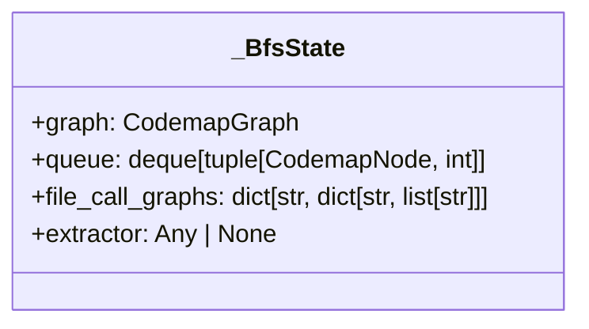
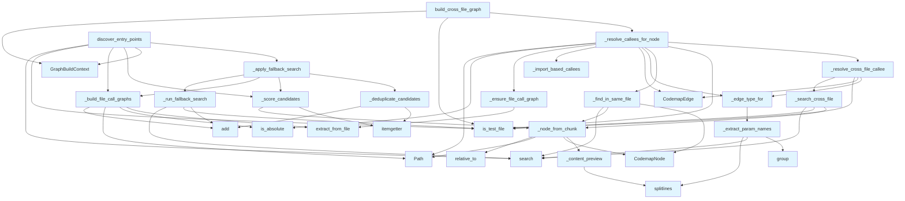

# File: `src/local_deepwiki/generators/codemap/graph.py`

## File Overview

This file implements the core logic for building cross-file codemap graphs, enabling semantic traversal of code dependencies and call relationships. It begins by discovering relevant entry points through vector search and then performs a breadth-first search (BFS) to expand the graph by resolving function calls across files.

The module integrates with vector stores for semantic search and call graph extractors for static analysis, combining both dynamic and static code understanding to construct rich, navigable dependency graphs. The system supports different traversal focuses such as execution flow or dependency chains, and handles fallback mechanisms when initial search results are insufficient.

## Key Concepts

### BFS Traversal with Call Graph Resolution

The primary algorithm used is a breadth-first search (BFS) that expands from entry points by resolving function calls. It distinguishes between same-file and cross-file callees, leveraging vector search for the latter and static analysis (via [`CallGraphExtractor`](../analysis/callgraph.md)) for the former.

This approach allows for flexible graph construction based on the focus:
- **Execution Flow**: Follows actual function call relationships.
- **Dependency Chain**: Follows import relationships instead, useful for understanding module-level dependencies.

### Candidate Scoring and Fallback Search

Entry points are scored based on:
- Vector similarity
- Chunk type (functions score higher than classes)
- Call-graph connectivity (functions that call many others are prioritized)
- Entry-pattern matching (e.g., `main`, `run`, etc.)

If all top candidates are "shallow" (i.e., they call few or no other functions), a fallback search is triggered to find orchestrator functions. This ensures that even if the initial search returns only leaf nodes, the system can still identify meaningful execution paths.

### Lazy Call Graph Extraction

Call graphs are extracted lazily — only when needed for a specific file. This avoids unnecessary computation and improves performance, especially in large codebases where not all files may be relevant to the current traversal.

### Edge Labeling

Edges in the graph are labeled based on the traversal focus:
- For **execution flow**, edges are labeled as `"calls"`.
- For **data flow**, edges are labeled with information about parameter passing (e.g., `"passes(param1, param2)"`), aiding in understanding data flow through function calls.

## Integration

This module is part of the codemap generator system and integrates with several core components:

- **[Vector Store](../../core/vectorstore/store.md)**: Used for semantic search to find relevant code chunks and entry points.
- **[Call Graph Extractor](../analysis/callgraph.md)**: Provides static analysis to identify function call relationships within files.
- **Context Builder**: Supplies import information used in dependency chain traversal.
- **Core Utilities**: Leverages [`is_test_file`](../analysis/source_filter.md) for filtering test code and [`condense_query`](../../core/query_utils.md) for refining search queries.

The file is used by:
- `build_cross_file_graph` — the main entry point for building codemap graphs.
- `_content_preview` — utility used by test handlers for previewing code content.

It is imported and used by:
- `src/local_deepwiki/generators/codemap/models.py` (via imports of [`CodemapNode`](models.md), [`CodemapGraph`](models.md), etc.)
- `src/local_deepwiki/generators/codemap/params.py` (for [`GraphBuildContext`](params.md))

## Design Notes

### Trade-offs

1. **Fallback Search Performance**: The fallback search is designed to avoid duplicate results by deduplicating based on `file_path:name`. This ensures that even if multiple search strategies return similar results, the final graph remains clean.

2. **Lazy Graph Extraction**: By deferring call graph extraction until a file is needed, the system avoids overhead in cases where not all files are relevant to the current traversal.

3. **Node Deduplication**: Nodes are added to the graph only once, preventing cycles and ensuring the graph remains a DAG (Directed Acyclic Graph) where possible.

### Edge Cases Handled

- **Missing [Call Graph Extractor](../analysis/callgraph.md)**: If the [`CallGraphExtractor`](../analysis/callgraph.md) is not available, the system gracefully falls back to minimal functionality, logging a warning but continuing.
- **Invalid File Paths**: Relative paths are normalized to be relative to the repository root, and invalid paths are logged with debug information.
- **No Matching Chunks**: When a function is found in a call graph but not in the vector store, a skeleton node is returned to avoid breaking the traversal.
- **Test File Filtering**: All test files are filtered out during both entry point discovery and graph building to avoid polluting the codemap with test code.

### Non-Obvious Implementation Choices

- **Scoring Weighting**: The scoring algorithm weights chunk types and call graph connectivity to prioritize orchestrators over leaf nodes. This is crucial for meaningful graph construction.
- **Depth Limiting**: BFS traversal is limited by both node count and depth to prevent infinite expansion and excessive memory usage.
- **Import-Based Callee Expansion**: In dependency chain focus, import-based callees are added to the list of resolved callees, enhancing the graph's coverage of module-level dependencies.
- **[Parameter](../analysis/api_docs.md) Extraction for Edge Labels**: For data-flow focus, function parameters are extracted from the preview content to provide richer edge labeling, improving graph interpretability.

## API Reference

### Functions

#### `discover_entry_points`

```python
async def discover_entry_points(query: str, vector_store: "VectorStore", repo_path: Path, entry_point_hint: str | None = None, max_candidates: int = 5) -> list[CodemapNode]
```

Find the most relevant entry-point functions for *query*.  If *entry_point_hint* is provided the vector store is searched for that specific name; otherwise a semantic search is performed and results are scored by relevance, entry-pattern matching, and call-graph root status.  When the initial search returns only leaf nodes (dataclasses/containers with no outgoing calls), a fallback search is performed filtering to functions and methods only to find actual pipeline orchestrators.


| Parameter | Type | Default | Description |
|-----------|------|---------|-------------|
| `query` | `str` | - | - |
| `vector_store` | `"VectorStore"` | - | - |
| `repo_path` | `Path` | - | - |
| `entry_point_hint` | `str | None` | `None` | - |
| `max_candidates` | `int` | `5` | - |

**Returns:** `list[CodemapNode]`


<details>
<summary>View Source (lines 335-396) | <a href="https://github.com/UrbanDiver/local-deepwiki-mcp/blob/main/src/local_deepwiki/generators/codemap/graph.py#L335-L396">GitHub</a></summary>

```python
async def discover_entry_points(
    query: str,
    vector_store: "VectorStore",
    repo_path: Path,
    *,
    entry_point_hint: str | None = None,
    max_candidates: int = 5,
) -> list[CodemapNode]:
    """Find the most relevant entry-point functions for *query*.

    If *entry_point_hint* is provided the vector store is searched for that
    specific name; otherwise a semantic search is performed and results are
    scored by relevance, entry-pattern matching, and call-graph root status.

    When the initial search returns only leaf nodes (dataclasses/containers
    with no outgoing calls), a fallback search is performed filtering to
    functions and methods only to find actual pipeline orchestrators.
    """
    _CallGraphExtractor = _load_call_graph_extractor()
    extractor = _CallGraphExtractor() if _CallGraphExtractor is not None else None

    search_query = entry_point_hint if entry_point_hint else query
    try:
        results = await vector_store.search(search_query, limit=30, min_similarity=0.3)
    except (OSError, ValueError, RuntimeError):
        logger.exception("Vector search failed for entry point discovery")
        return []

    callable_results = [
        r
        for r in results
        if r.chunk.chunk_type.value in CALLABLE_CHUNK_TYPES
        and not is_test_file(r.chunk.file_path)
    ]
    callable_results = _match_query_to_functions(callable_results, entry_point_hint)

    if not callable_results:
        return []

    file_call_graphs: dict[str, dict[str, list[str]]] = {}
    if extractor is not None:
        file_call_graphs = _build_file_call_graphs(
            callable_results, repo_path, extractor
        )

    scored = _score_candidates(callable_results, file_call_graphs, repo_path)

    if not entry_point_hint:
        fallback_ctx = GraphBuildContext(
            vector_store=vector_store,
            repo_path=repo_path,
        )
        scored = await _apply_fallback_search(
            search_query,
            scored,
            file_call_graphs,
            max_candidates,
            extractor,
            fallback_ctx,
        )

    return [node for _, node in scored[:max_candidates]]
```

</details>

#### `build_cross_file_graph`

```python
async def build_cross_file_graph(entry_nodes: list[CodemapNode], vector_store: "VectorStore", repo_path: Path, max_depth: int = 4, max_nodes: int = 40, focus: CodemapFocus = CodemapFocus.EXECUTION_FLOW) -> CodemapGraph
```

BFS-traverse call relationships starting from *entry_nodes*.  For ``DEPENDENCY_CHAIN`` focus the traversal follows import edges instead of call edges.


| Parameter | Type | Default | Description |
|-----------|------|---------|-------------|
| `entry_nodes` | `list[CodemapNode]` | - | - |
| `vector_store` | `"VectorStore"` | - | - |
| `repo_path` | `Path` | - | - |
| `max_depth` | `int` | `4` | - |
| `max_nodes` | `int` | `40` | - |
| `focus` | `CodemapFocus` | `CodemapFocus.EXECUTION_FLOW` | - |

**Returns:** [`CodemapGraph`](models.md)


<details>
<summary>View Source (lines 552-611) | <a href="https://github.com/UrbanDiver/local-deepwiki-mcp/blob/main/src/local_deepwiki/generators/codemap/graph.py#L552-L611">GitHub</a></summary>

```python
async def build_cross_file_graph(
    entry_nodes: list[CodemapNode],
    vector_store: "VectorStore",
    repo_path: Path,
    *,
    max_depth: int = 4,
    max_nodes: int = 40,
    focus: CodemapFocus = CodemapFocus.EXECUTION_FLOW,
) -> CodemapGraph:
    """BFS-traverse call relationships starting from *entry_nodes*.

    For ``DEPENDENCY_CHAIN`` focus the traversal follows import edges
    instead of call edges.
    """
    ctx = GraphBuildContext(
        vector_store=vector_store,
        repo_path=repo_path,
        focus=focus,
        max_nodes=max_nodes,
        max_depth=max_depth,
    )

    _CGExtractor: type | None
    try:
        from local_deepwiki.generators.analysis.callgraph import (
            CallGraphExtractor as _CGExtractor,
        )
    except ImportError:  # pragma: no cover
        logger.warning("Could not import CallGraphExtractor")
        _CGExtractor = None  # fallback if callgraph module unavailable

    graph = CodemapGraph()

    if not entry_nodes:
        return graph

    graph.entry_point = entry_nodes[0].qualified_name

    # Seed the BFS queue: (node, depth)
    queue: deque[tuple[CodemapNode, int]] = deque()
    for node in entry_nodes:
        graph.nodes[node.qualified_name] = node
        queue.append((node, 0))

    bfs = _BfsState(
        graph=graph,
        queue=queue,
        extractor=_CGExtractor() if _CGExtractor is not None else None,
    )

    while bfs.queue and len(bfs.graph.nodes) < ctx.max_nodes:
        current_node, depth = bfs.queue.popleft()
        if depth >= ctx.max_depth:
            continue
        if is_test_file(current_node.file_path):
            continue

        await _resolve_callees_for_node(current_node, depth, bfs, ctx)

    return graph
```

</details>

## Class Diagram



## Call Graph



## Used By

Functions and methods in this file and their callers:

- **[`CodemapEdge`](models.md)**: called by `_resolve_callees_for_node`, `_resolve_cross_file_callee`
- **[`CodemapGraph`](models.md)**: called by `build_cross_file_graph`
- **[`CodemapNode`](models.md)**: called by `_find_in_same_file`, `_node_from_chunk`
- **[`GraphBuildContext`](params.md)**: called by `build_cross_file_graph`, `discover_entry_points`
- **`Path`**: called by `_build_file_call_graphs`, `_node_from_chunk`, `_resolve_callees_for_node`
- **`_BfsState`**: called by `build_cross_file_graph`
- **`_CGExtractor`**: called by `build_cross_file_graph`
- **`_CallGraphExtractor`**: called by `discover_entry_points`
- **`_apply_fallback_search`**: called by `discover_entry_points`
- **`_build_file_call_graphs`**: called by `_apply_fallback_search`, `discover_entry_points`
- **`_condense_query`**: called by `_run_fallback_search`
- **`_content_preview`**: called by `_node_from_chunk`
- **`_deduplicate_candidates`**: called by `_apply_fallback_search`
- **`_edge_type_for`**: called by `_resolve_callees_for_node`, `_resolve_cross_file_callee`
- **`_ensure_file_call_graph`**: called by `_resolve_callees_for_node`
- **`_extract_param_names`**: called by `_edge_type_for`
- **`_find_in_same_file`**: called by `_resolve_callees_for_node`
- **`_import_based_callees`**: called by `_resolve_callees_for_node`
- **`_is_noise`**: called by `_resolve_callees_for_node`
- **`_load_call_graph_extractor`**: called by `discover_entry_points`
- **`_match_function_by_name`**: called by `_find_in_same_file`
- **`_match_query_to_functions`**: called by `discover_entry_points`
- **`_max_callees_for`**: called by `_apply_fallback_search`
- **`_node_from_chunk`**: called by `_find_in_same_file`, `_score_candidates`, `_search_cross_file`
- **`_resolve_callees_for_node`**: called by `build_cross_file_graph`
- **`_resolve_cross_file_callee`**: called by `_resolve_callees_for_node`
- **`_run_fallback_search`**: called by `_apply_fallback_search`
- **`_score_candidates`**: called by `_apply_fallback_search`, `discover_entry_points`
- **`_search_cross_file`**: called by `_resolve_cross_file_callee`
- **`add`**: called by `_build_file_call_graphs`, `_deduplicate_candidates`, `_run_fallback_search`
- **`deque`**: called by `build_cross_file_graph`
- **`exception`**: called by `discover_entry_points`
- **`extract_from_file`**: called by `_build_file_call_graphs`, `_ensure_file_call_graph`
- **[`extract_imports_from_chunks`](../context_builder.md)**: called by `_import_based_callees`
- **`get_all_chunks`**: called by `_import_based_callees`
- **`group`**: called by `_extract_param_names`
- **`is_absolute`**: called by `_build_file_call_graphs`, `_resolve_callees_for_node`
- **[`is_test_file`](../analysis/source_filter.md)**: called by `_resolve_callees_for_node`, `_resolve_cross_file_callee`, `_run_fallback_search`, `_search_cross_file`, `build_cross_file_graph`, `discover_entry_points`
- **`itemgetter`**: called by `_deduplicate_candidates`, `_score_candidates`
- **`lstrip`**: called by `_extract_param_names`
- **`match`**: called by `_score_candidates`
- **`popleft`**: called by `build_cross_file_graph`
- **`relative_to`**: called by `_node_from_chunk`
- **`search`**: called by `_extract_param_names`, `_find_in_same_file`, `_run_fallback_search`, `_search_cross_file`, `discover_entry_points`
- **`splitlines`**: called by `_content_preview`, `_extract_param_names`

## Usage Examples

*Examples extracted from test files*

### When graph_rag.enabled is False, returns results unchanged

From `test_graph_rag_query_integration.py::TestExpandWithGraph::test_skips_when_disabled`:

```python
config = _make_config(graph_rag_enabled=False)
vector_store = MagicMock()
original = [_make_search_result()]

result = await expand_with_graph(original, vector_store, config, tmp_path)

assert result is original
```

### Languages without IMPORT_NODE_TYPES produce no import relationships

From `test_graph_rag_extractor.py::TestExtractImports::test_no_imports_for_unknown_language`:

```python
# A file with no imports should have no import relationships
import_rels = [
    r
    for r in result.relationships
    if r.relationship == RelationshipType.IMPORTS
]
assert import_rels == []
```

### Example: `graph`

From `test_graph_rag_retriever.py::TestComputeGraphScore::test_depth_one`:

```python
score = GraphAugmentedRetriever._compute_graph_score(0.8, 0.7, 1)
        assert score == pytest.approx(0.8 * 0.7)
```

### When relationship_types=None, config defaults are used

From `test_graph_rag_retriever.py::TestExpandResultsRelationshipTypes::test_uses_config_defaults_when_none`:

```python
max_traversal_depth=1, relationship_types=["calls", "imports"]
)

sr = _make_search_result("chunk-A", 0.9, "alpha")
entity_a = _make_entity("ent-A", "chunk-A", "alpha")
graph_store.get_entities_by_chunk_ids.return_value = [entity_a]
graph_store.get_neighbors.return_value = GraphTraversalResult()

retriever = GraphAugmentedRetriever(graph_store, vector_store, config)
await retriever.expand_results([sr], relationship_types=None)

graph_store.get_neighbors.assert_awaited_once_with(
    ["ent-A"],
    relationship_types=["calls", "imports"],
    max_depth=1,
)
```

### When relationship_types is provided, it overrides config

From `test_graph_rag_retriever.py::TestExpandResultsRelationshipTypes::test_uses_explicit_relationship_types`:

```python
max_traversal_depth=1, relationship_types=["calls", "imports"]
)

sr = _make_search_result("chunk-A", 0.9, "alpha")
entity_a = _make_entity("ent-A", "chunk-A", "alpha")
graph_store.get_entities_by_chunk_ids.return_value = [entity_a]
graph_store.get_neighbors.return_value = GraphTraversalResult()

retriever = GraphAugmentedRetriever(graph_store, vector_store, config)
await retriever.expand_results([sr], relationship_types=["inherits_from"])

graph_store.get_neighbors.assert_awaited_once_with(
    ["ent-A"],
    relationship_types=["inherits_from"],
    max_depth=1,
)
```


## Last Modified

| Entity | Type | Author | Date | Commit |
|--------|------|--------|------|--------|
| `_BfsState` | class | Brian Breidenbach | yesterday | `1eef062` refactor: complete Grade A ... |
| `_apply_fallback_search` | function | Brian Breidenbach | yesterday | `1eef062` refactor: complete Grade A ... |
| `discover_entry_points` | function | Brian Breidenbach | yesterday | `1eef062` refactor: complete Grade A ... |
| `_resolve_cross_file_callee` | function | Brian Breidenbach | yesterday | `1eef062` refactor: complete Grade A ... |
| `_resolve_callees_for_node` | function | Brian Breidenbach | yesterday | `1eef062` refactor: complete Grade A ... |
| `build_cross_file_graph` | function | Brian Breidenbach | yesterday | `1eef062` refactor: complete Grade A ... |
| `_load_call_graph_extractor` | function | Brian Breidenbach | 2 days ago | `8b8f36f` refactor: decompose CC > 15... |
| `_match_query_to_functions` | function | Brian Breidenbach | 1 week ago | `f3faf1e` refactor: split generator a... |
| `_match_function_by_name` | function | Brian Breidenbach | 1 week ago | `f3faf1e` refactor: split generator a... |
| `_find_in_same_file` | function | Brian Breidenbach | 1 week ago | `f3faf1e` refactor: split generator a... |
| `_build_file_call_graphs` | function | Brian Breidenbach | 2 weeks ago | `7bc1dbd` fix: correct mypy type anno... |
| `_score_candidates` | function | Brian Breidenbach | 2 weeks ago | `7bc1dbd` fix: correct mypy type anno... |
| `_run_fallback_search` | function | Brian Breidenbach | 2 weeks ago | `7bc1dbd` fix: correct mypy type anno... |
| `_ensure_file_call_graph` | function | Brian Breidenbach | 2 weeks ago | `7bc1dbd` fix: correct mypy type anno... |
| `_search_cross_file` | function | Brian Breidenbach | 2 weeks ago | `f68a4e0` fix: add min_similarity=0.3... |
| `_deduplicate_candidates` | function | Brian Breidenbach | 2 weeks ago | `4303b50` refactor: decompose discove... |
| `_edge_type_for` | function | Brian Breidenbach | 2 weeks ago | `eae3b8d` refactor: decompose build_c... |
| `_max_callees_for` | function | Brian Breidenbach | 2 weeks ago | `3f2c189` fix: improve codemap entry ... |
| `_node_from_chunk` | function | Brian Breidenbach | Feb 21, 2026 | `e45a53a` refactor: apply Pythonic id... |
| `_content_preview` | function | Brian Breidenbach | Feb 21, 2026 | `fecde6f` refactor: split 10 large fi... |
| `_is_noise` | function | Brian Breidenbach | Feb 21, 2026 | `fecde6f` refactor: split 10 large fi... |
| `_extract_param_names` | function | Brian Breidenbach | Feb 21, 2026 | `fecde6f` refactor: split 10 large fi... |
| `_import_based_callees` | function | Brian Breidenbach | Feb 21, 2026 | `fecde6f` refactor: split 10 large fi... |

## Additional Source Code

Source code for functions and methods not listed in the API Reference above.

### `_BfsState`

<details>
<summary>View Source (lines 45-51) | <a href="https://github.com/UrbanDiver/local-deepwiki-mcp/blob/main/src/local_deepwiki/generators/codemap/graph.py#L45-L51">GitHub</a></summary>

```python
class _BfsState:
    """Mutable BFS traversal state shared across callee resolution functions."""

    graph: CodemapGraph
    queue: deque[tuple[CodemapNode, int]]
    file_call_graphs: dict[str, dict[str, list[str]]] = field(default_factory=dict)
    extractor: Any | None = None
```

</details>


#### `_content_preview`

<details>
<summary>View Source (lines 64-73) | <a href="https://github.com/UrbanDiver/local-deepwiki-mcp/blob/main/src/local_deepwiki/generators/codemap/graph.py#L64-L73">GitHub</a></summary>

```python
def _content_preview(content: str, max_lines: int = 3) -> str:
    """Return the first *max_lines* non-blank lines of *content*."""
    lines: list[str] = []
    for raw in content.splitlines():
        stripped = raw.strip()
        if stripped:
            lines.append(stripped)
            if len(lines) >= max_lines:
                break
    return "\n".join(lines)
```

</details>


#### `_node_from_chunk`

<details>
<summary>View Source (lines 76-99) | <a href="https://github.com/UrbanDiver/local-deepwiki-mcp/blob/main/src/local_deepwiki/generators/codemap/graph.py#L76-L99">GitHub</a></summary>

```python
def _node_from_chunk(chunk: CodeChunk, repo_path: Path) -> CodemapNode:
    """Build a ``CodemapNode`` from a ``CodeChunk``."""
    qualified = chunk.name or "unknown"
    if chunk.parent_name:
        qualified = f"{chunk.parent_name}.{chunk.name}"

    rel_path = chunk.file_path
    try:
        rel_path = str(Path(chunk.file_path).relative_to(repo_path))
    except ValueError:
        logger.debug(
            "Failed to compute relative path for %s", chunk.file_path, exc_info=True
        )

    return CodemapNode(
        name=chunk.name or "unknown",
        qualified_name=qualified,
        file_path=rel_path,
        start_line=chunk.start_line,
        end_line=chunk.end_line,
        chunk_type=chunk.chunk_type.value,
        docstring=chunk.docstring,
        content_preview=_content_preview(chunk.content),
    )
```

</details>


#### `_is_noise`

<details>
<summary>View Source (lines 102-104) | <a href="https://github.com/UrbanDiver/local-deepwiki-mcp/blob/main/src/local_deepwiki/generators/codemap/graph.py#L102-L104">GitHub</a></summary>

```python
def _is_noise(name: str) -> bool:
    """Return ``True`` if *name* should be skipped during traversal."""
    return name.lower() in BUILTIN_NAMES or len(name) <= 1
```

</details>


#### `_extract_param_names`

<details>
<summary>View Source (lines 107-128) | <a href="https://github.com/UrbanDiver/local-deepwiki-mcp/blob/main/src/local_deepwiki/generators/codemap/graph.py#L107-L128">GitHub</a></summary>

```python
def _extract_param_names(content: str) -> list[str]:
    """Extract parameter names from the first function signature in *content*.

    Returns a list of bare parameter names (no type annotations or defaults).
    """
    for line in content.splitlines():
        m = _PARAM_RE.search(line)
        if m:
            raw = m.group(1)
            params: list[str] = []
            for part in raw.split(","):
                part = part.strip()
                if not part:
                    continue
                # Strip type annotations (Python: `name: Type`, TS: `name: Type`)
                name = part.split(":")[0].split("=")[0].strip()
                # Strip leading `self`, `cls`, `*`, `**`
                name = name.lstrip("*")
                if name and name not in ("self", "cls"):
                    params.append(name)
            return params
    return []
```

</details>


#### `_build_file_call_graphs`

<details>
<summary>View Source (lines 136-158) | <a href="https://github.com/UrbanDiver/local-deepwiki-mcp/blob/main/src/local_deepwiki/generators/codemap/graph.py#L136-L158">GitHub</a></summary>

```python
def _build_file_call_graphs(
    callable_results: list[Any],
    repo_path: Path,
    extractor: Any,
    max_files: int = 15,
) -> dict[str, dict[str, list[str]]]:
    """Build per-file call graphs for the top *max_files* unique files."""
    file_call_graphs: dict[str, dict[str, list[str]]] = {}
    seen_files: set[str] = set()
    for r in callable_results[:max_files]:
        fp = r.chunk.file_path
        if fp in seen_files:
            continue
        seen_files.add(fp)
        try:
            abs_path = Path(fp)
            if not abs_path.is_absolute():
                abs_path = repo_path / fp
            cg = extractor.extract_from_file(abs_path, repo_path)
            file_call_graphs[fp] = cg
        except (OSError, ValueError, RuntimeError) as e:
            logger.debug("Could not extract call graph from %s: %s", fp, e)
    return file_call_graphs
```

</details>


#### `_score_candidates`

<details>
<summary>View Source (lines 161-206) | <a href="https://github.com/UrbanDiver/local-deepwiki-mcp/blob/main/src/local_deepwiki/generators/codemap/graph.py#L161-L206">GitHub</a></summary>

```python
def _score_candidates(
    callable_results: list[Any],
    file_call_graphs: dict[str, dict[str, list[str]]],
    repo_path: Path,
) -> list[tuple[float, CodemapNode]]:
    """Score candidates by vector similarity, chunk type, and call-graph connectivity."""
    scored: list[tuple[float, CodemapNode]] = []
    for r in callable_results:
        node = _node_from_chunk(r.chunk, repo_path)
        score = r.score

        # Apply chunk-type weight — classes (often dataclasses/containers)
        # score lower than functions/methods (actual execution flows)
        score *= CHUNK_TYPE_WEIGHTS.get(
            r.chunk.chunk_type.value,
            1.0,
        )

        # Score by call-graph connectivity: functions that call many others
        # are more likely to be orchestrators worth tracing
        func_key = node.qualified_name
        short_name = node.name
        max_callees = 0
        for cg in file_call_graphs.values():
            if func_key in cg or short_name in cg:
                callees = cg.get(func_key, cg.get(short_name, []))
                max_callees = max(max_callees, len(callees))

        if max_callees >= 3:
            # Graduated boost: more callees = more likely an orchestrator
            score *= 1.0 + min(max_callees * 0.15, 1.5)
        elif max_callees == 0:
            # Leaf penalty — dataclasses and simple accessors produce
            # trivial graphs with no edges
            score *= 0.3
        elif max_callees == 1:
            # Mild penalty — single-callee nodes are unlikely orchestrators
            score *= 0.6

        # Boost for entry-pattern names
        if ENTRY_PATTERNS.match(node.name):
            score *= 1.3

        scored.append((score, node))

    return sorted(scored, key=itemgetter(0), reverse=True)
```

</details>


#### `_run_fallback_search`

<details>
<summary>View Source (lines 209-247) | <a href="https://github.com/UrbanDiver/local-deepwiki-mcp/blob/main/src/local_deepwiki/generators/codemap/graph.py#L209-L247">GitHub</a></summary>

```python
async def _run_fallback_search(
    search_query: str,
    vector_store: "VectorStore",
) -> list[object]:
    """Search for functions/methods when initial candidates are all shallow.

    Tries both the original *search_query* and a condensed technical variant.
    Results are deduplicated by ``file_path:name``.
    """
    queries = [search_query]
    condensed = _condense_query(search_query)
    if condensed != search_query:
        queries.append(condensed)

    fallback_results: list[Any] = []
    seen_chunk_ids: set[str] = set()
    for fallback_query in queries:
        for chunk_type in ("function", "method"):
            try:
                type_results = await vector_store.search(
                    fallback_query,
                    limit=15,
                    min_similarity=0.3,
                    chunk_type=chunk_type,
                )
                for r in type_results:
                    if is_test_file(r.chunk.file_path):
                        continue
                    seen_key = f"{r.chunk.file_path}:{r.chunk.name}"
                    if seen_key not in seen_chunk_ids:
                        seen_chunk_ids.add(seen_key)
                        fallback_results.append(r)
            except (OSError, ValueError, RuntimeError):
                logger.debug(
                    "Fallback search failed for query=%r chunk_type=%s",
                    fallback_query,
                    chunk_type,
                )
    return fallback_results
```

</details>


#### `_deduplicate_candidates`

<details>
<summary>View Source (lines 250-261) | <a href="https://github.com/UrbanDiver/local-deepwiki-mcp/blob/main/src/local_deepwiki/generators/codemap/graph.py#L250-L261">GitHub</a></summary>

```python
def _deduplicate_candidates(
    scored: list[tuple[float, CodemapNode]],
    extra: list[tuple[float, CodemapNode]],
) -> list[tuple[float, CodemapNode]]:
    """Merge *extra* into *scored*, dropping duplicates by ``qualified_name``."""
    seen_names = {node.qualified_name for _, node in scored}
    merged = list(scored)
    for fb_score, fb_node in extra:
        if fb_node.qualified_name not in seen_names:
            merged.append((fb_score, fb_node))
            seen_names.add(fb_node.qualified_name)
    return sorted(merged, key=itemgetter(0), reverse=True)
```

</details>


#### `_match_query_to_functions`

<details>
<summary>View Source (lines 264-284) | <a href="https://github.com/UrbanDiver/local-deepwiki-mcp/blob/main/src/local_deepwiki/generators/codemap/graph.py#L264-L284">GitHub</a></summary>

```python
def _match_query_to_functions(
    callable_results: list[Any],
    entry_point_hint: str | None,
) -> list[Any]:
    """Narrow *callable_results* to name-matching entries when a hint is given.

    Args:
        callable_results: List of vector-search results with callable chunks.
        entry_point_hint: Optional hint string for name filtering.

    Returns:
        Filtered list (or original list if no hint or no exact matches found).
    """
    if not entry_point_hint:
        return callable_results
    exact = [
        r
        for r in callable_results
        if r.chunk.name and entry_point_hint.lower() in r.chunk.name.lower()
    ]
    return exact if exact else callable_results
```

</details>


#### `_load_call_graph_extractor`

<details>
<summary>View Source (lines 287-297) | <a href="https://github.com/UrbanDiver/local-deepwiki-mcp/blob/main/src/local_deepwiki/generators/codemap/graph.py#L287-L297">GitHub</a></summary>

```python
def _load_call_graph_extractor() -> type | None:
    """Import and return the CallGraphExtractor class, or None on failure."""
    try:
        from local_deepwiki.generators.analysis.callgraph import (
            CallGraphExtractor,
        )

        return CallGraphExtractor
    except ImportError:  # pragma: no cover
        logger.warning("Could not import CallGraphExtractor")
        return None
```

</details>


#### `_apply_fallback_search`

<details>
<summary>View Source (lines 300-332) | <a href="https://github.com/UrbanDiver/local-deepwiki-mcp/blob/main/src/local_deepwiki/generators/codemap/graph.py#L300-L332">GitHub</a></summary>

```python
async def _apply_fallback_search(
    search_query: str,
    scored: list[tuple[float, CodemapNode]],
    file_call_graphs: dict[str, dict[str, list[str]]],
    max_candidates: int,
    extractor: Any | None,
    ctx: GraphBuildContext,
) -> list[tuple[float, CodemapNode]]:
    """Run fallback search and merge results when top candidates are all shallow."""
    top_candidates = scored[:max_candidates]
    all_shallow = all(
        _max_callees_for(node, file_call_graphs) <= 1 for _, node in top_candidates
    )
    if not all_shallow:
        return scored

    logger.debug(
        "All top candidates are shallow, running fallback search for functions and methods"
    )
    fallback_results = await _run_fallback_search(search_query, ctx.vector_store)
    if not fallback_results:
        return scored

    if extractor is not None:
        extra_graphs = _build_file_call_graphs(
            fallback_results, ctx.repo_path, extractor
        )
        file_call_graphs.update(extra_graphs)

    fallback_scored = _score_candidates(
        fallback_results, file_call_graphs, ctx.repo_path
    )
    return _deduplicate_candidates(scored, fallback_scored)
```

</details>


#### `_max_callees_for`

<details>
<summary>View Source (lines 399-409) | <a href="https://github.com/UrbanDiver/local-deepwiki-mcp/blob/main/src/local_deepwiki/generators/codemap/graph.py#L399-L409">GitHub</a></summary>

```python
def _max_callees_for(
    node: CodemapNode,
    file_call_graphs: dict[str, dict[str, list[str]]],
) -> int:
    """Return the maximum callee count for *node* across all call graphs."""
    max_callees = 0
    for cg in file_call_graphs.values():
        if node.qualified_name in cg or node.name in cg:
            callees = cg.get(node.qualified_name, cg.get(node.name, []))
            max_callees = max(max_callees, len(callees))
    return max_callees
```

</details>


#### `_edge_type_for`

<details>
<summary>View Source (lines 417-424) | <a href="https://github.com/UrbanDiver/local-deepwiki-mcp/blob/main/src/local_deepwiki/generators/codemap/graph.py#L417-L424">GitHub</a></summary>

```python
def _edge_type_for(focus: CodemapFocus, target_node: CodemapNode | None) -> str:
    """Compute edge label: ``"calls"`` or ``"passes(param, ...)"`` for data-flow."""
    if focus != CodemapFocus.DATA_FLOW or target_node is None:
        return "calls"
    params = _extract_param_names(target_node.content_preview)
    if params:
        return f"passes({', '.join(params)})"
    return "calls"
```

</details>


#### `_ensure_file_call_graph`

<details>
<summary>View Source (lines 427-443) | <a href="https://github.com/UrbanDiver/local-deepwiki-mcp/blob/main/src/local_deepwiki/generators/codemap/graph.py#L427-L443">GitHub</a></summary>

```python
def _ensure_file_call_graph(
    file_key: str,
    abs_path: Path,
    repo_path: Path,
    extractor: Any | None,
    file_call_graphs: dict[str, dict[str, list[str]]],
) -> dict[str, list[str]]:
    """Lazily populate *file_call_graphs* for *file_key* and return the graph."""
    if file_key not in file_call_graphs and extractor is not None:
        try:
            file_call_graphs[file_key] = extractor.extract_from_file(
                abs_path, repo_path
            )
        except (OSError, ValueError, RuntimeError) as e:
            logger.debug("Could not extract call graph for %s: %s", file_key, e)
            file_call_graphs[file_key] = {}
    return file_call_graphs.get(file_key, {})
```

</details>


#### `_resolve_cross_file_callee`

<details>
<summary>View Source (lines 446-476) | <a href="https://github.com/UrbanDiver/local-deepwiki-mcp/blob/main/src/local_deepwiki/generators/codemap/graph.py#L446-L476">GitHub</a></summary>

```python
async def _resolve_cross_file_callee(
    callee_name: str,
    current_node: CodemapNode,
    depth: int,
    bfs: _BfsState,
    ctx: GraphBuildContext,
) -> None:
    """Search the vector store for *callee_name* in another file and add to *graph*.

    Args:
        callee_name: The name of the callee to resolve cross-file.
        current_node: The BFS node currently being expanded.
        depth: Current BFS depth.
        bfs: Mutable BFS state (graph, queue, file_call_graphs, extractor).
        ctx: Immutable graph-building context (vector_store, repo_path, focus, etc.).
    """
    cross_node = await _search_cross_file(
        callee_name, ctx.vector_store, ctx.repo_path, current_node.file_path
    )
    if cross_node is not None and not is_test_file(cross_node.file_path):
        bfs.graph.nodes[cross_node.qualified_name] = cross_node
        bfs.graph.edges.append(
            CodemapEdge(
                source=current_node.qualified_name,
                target=cross_node.qualified_name,
                edge_type=_edge_type_for(ctx.focus, cross_node),
                source_file=current_node.file_path,
                target_file=cross_node.file_path,
            )
        )
        bfs.queue.append((cross_node, depth + 1))
```

</details>


#### `_resolve_callees_for_node`

<details>
<summary>View Source (lines 479-549) | <a href="https://github.com/UrbanDiver/local-deepwiki-mcp/blob/main/src/local_deepwiki/generators/codemap/graph.py#L479-L549">GitHub</a></summary>

```python
async def _resolve_callees_for_node(
    current_node: CodemapNode,
    depth: int,
    bfs: _BfsState,
    ctx: GraphBuildContext,
) -> None:
    """Process a single BFS node: find callees and add edges/nodes to *graph*."""
    abs_path = Path(current_node.file_path)
    if not abs_path.is_absolute():
        abs_path = ctx.repo_path / current_node.file_path

    file_key = current_node.file_path
    cg = _ensure_file_call_graph(
        file_key, abs_path, ctx.repo_path, bfs.extractor, bfs.file_call_graphs
    )

    qn = current_node.qualified_name
    sn = current_node.name
    callees = list(cg.get(qn, cg.get(sn, [])))

    if ctx.focus == CodemapFocus.DEPENDENCY_CHAIN:
        callees = await _import_based_callees(
            current_node, ctx.vector_store, ctx.repo_path, callees
        )

    for callee_name in callees:
        if _is_noise(callee_name):
            continue
        if len(bfs.graph.nodes) >= ctx.max_nodes:
            break

        # Already tracked?
        if callee_name in bfs.graph.nodes:
            target_node = bfs.graph.nodes[callee_name]
            bfs.graph.edges.append(
                CodemapEdge(
                    source=current_node.qualified_name,
                    target=callee_name,
                    edge_type=_edge_type_for(ctx.focus, target_node),
                    source_file=current_node.file_path,
                    target_file=target_node.file_path,
                )
            )
            continue

        # Check same file first
        same_file_node = await _find_in_same_file(
            callee_name, cg, current_node, ctx.repo_path, ctx.vector_store
        )
        if same_file_node is not None and not is_test_file(same_file_node.file_path):
            bfs.graph.nodes[same_file_node.qualified_name] = same_file_node
            bfs.graph.edges.append(
                CodemapEdge(
                    source=current_node.qualified_name,
                    target=same_file_node.qualified_name,
                    edge_type=_edge_type_for(ctx.focus, same_file_node),
                    source_file=current_node.file_path,
                    target_file=same_file_node.file_path,
                )
            )
            bfs.queue.append((same_file_node, depth + 1))
            continue

        # Search vector store for cross-file definition
        await _resolve_cross_file_callee(
            callee_name,
            current_node,
            depth,
            bfs,
            ctx,
        )
```

</details>


#### `_import_based_callees`

<details>
<summary>View Source (lines 614-644) | <a href="https://github.com/UrbanDiver/local-deepwiki-mcp/blob/main/src/local_deepwiki/generators/codemap/graph.py#L614-L644">GitHub</a></summary>

```python
async def _import_based_callees(
    node: CodemapNode,
    vector_store: "VectorStore",
    repo_path: Path,
    existing: list[str],
) -> list[str]:
    """Supplement *existing* callees with import-derived names."""
    try:
        from local_deepwiki.generators.context_builder import (
            extract_imports_from_chunks,
        )
    except ImportError:
        return existing

    try:
        chunks = [
            c
            for c in vector_store.get_all_chunks()
            if c.file_path.endswith(node.file_path) and c.chunk_type == ChunkType.IMPORT
        ]
        _, modules = extract_imports_from_chunks(chunks)
        combined = list(existing)
        for mod in modules:
            if mod not in combined:
                combined.append(mod)
        return combined
    except (AttributeError, ValueError, RuntimeError, OSError):
        # AttributeError: vector_store missing get_all_chunks method
        # ValueError/RuntimeError: chunk processing or import extraction failures
        # OSError: underlying storage I/O errors
        return existing
```

</details>


#### `_match_function_by_name`

<details>
<summary>View Source (lines 647-667) | <a href="https://github.com/UrbanDiver/local-deepwiki-mcp/blob/main/src/local_deepwiki/generators/codemap/graph.py#L647-L667">GitHub</a></summary>

```python
def _match_function_by_name(
    callee_name: str,
    call_graph: dict[str, list[str]],
) -> str | None:
    """Return the call-graph key that matches *callee_name*, or ``None``.

    A function is "defined" in the same file if it appears as a caller key
    in the file's call graph (meaning tree-sitter found its definition).

    Args:
        callee_name: The short name to match.
        call_graph: The file-level call graph dict.

    Returns:
        The matching key (possibly qualified e.g. ``Class.method``) or None.
    """
    for key in call_graph:
        short = key.split(".")[-1]
        if short == callee_name or key == callee_name:
            return key
    return None
```

</details>


#### `_find_in_same_file`

<details>
<summary>View Source (lines 670-717) | <a href="https://github.com/UrbanDiver/local-deepwiki-mcp/blob/main/src/local_deepwiki/generators/codemap/graph.py#L670-L717">GitHub</a></summary>

```python
async def _find_in_same_file(
    callee_name: str,
    call_graph: dict[str, list[str]],
    current_node: CodemapNode,
    repo_path: Path,
    vector_store: "VectorStore",
) -> CodemapNode | None:
    """Return a ``CodemapNode`` if *callee_name* is defined in the same file.

    First confirms the callee exists via the call graph, then searches the
    vector store for the matching chunk so that ``content_preview``,
    ``start_line``, ``end_line``, and ``docstring`` are populated.
    """
    matched_key = _match_function_by_name(callee_name, call_graph)
    if matched_key is None:
        return None

    # Try to find the actual chunk from the vector store for full metadata.
    # Search with both the short name and the qualified name (for class
    # methods the qualified form like "WikiGenerator._init_context" gives
    # a much better semantic match than just "def _init_context").
    queries = [f"def {callee_name}"]
    if matched_key != callee_name:
        queries.append(matched_key)

    try:
        for query in queries:
            results = await vector_store.search(query, limit=10, min_similarity=0.3)
            for r in results:
                chunk = r.chunk
                if chunk.chunk_type.value not in CALLABLE_CHUNK_TYPES:
                    continue
                if chunk.name and chunk.name.lower() == callee_name.lower():
                    node = _node_from_chunk(chunk, repo_path)
                    if node.file_path == current_node.file_path:
                        return node
    except (OSError, ValueError, RuntimeError) as e:
        logger.debug("Same-file chunk lookup failed for %s: %s", callee_name, e)

    # Fallback: return a skeleton node when the vector store has no match.
    return CodemapNode(
        name=callee_name,
        qualified_name=matched_key,
        file_path=current_node.file_path,
        start_line=0,
        end_line=0,
        chunk_type="function",
    )
```

</details>


#### `_search_cross_file`

<details>
<summary>View Source (lines 720-745) | <a href="https://github.com/UrbanDiver/local-deepwiki-mcp/blob/main/src/local_deepwiki/generators/codemap/graph.py#L720-L745">GitHub</a></summary>

```python
async def _search_cross_file(
    callee_name: str,
    vector_store: "VectorStore",
    repo_path: Path,
    source_file: str,
) -> CodemapNode | None:
    """Search the vector store for *callee_name* in a different file."""
    try:
        results = await vector_store.search(
            f"def {callee_name}", limit=5, min_similarity=0.3
        )
    except (OSError, ValueError, RuntimeError) as e:
        logger.debug("Cross-file search failed for %s: %s", callee_name, e)
        return None

    for r in results:
        chunk = r.chunk
        if chunk.chunk_type.value not in CALLABLE_CHUNK_TYPES:
            continue
        if is_test_file(chunk.file_path):
            continue
        if chunk.name and chunk.name.lower() == callee_name.lower():
            node = _node_from_chunk(chunk, repo_path)
            if node.file_path != source_file:
                return node
    return None
```

</details>

## Relevant Source Files

- `src/local_deepwiki/generators/codemap/graph.py:45-51`
