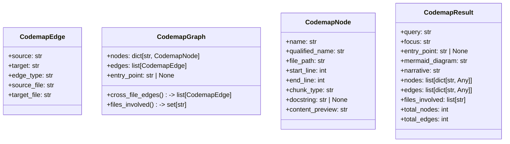

# File: `src/local_deepwiki/generators/codemap/models.py`

## File Overview

This file defines the core data structures and constants used in the codemap generation system. It provides a set of frozen dataclasses and enums that represent nodes, edges, graphs, and results in the codemap, as well as the focus modes that determine how the codemap is built.

The module acts as a shared contract between various components involved in codemap generation, including traversal logic, visualization, and orchestration. It ensures consistency in how codemap data is structured and consumed across the system.

## Key Concepts

### Data Structures

- **CodemapNode**: Represents a single element in the codemap graph, such as a function or class. It includes metadata like file path, line numbers, and type, making it suitable for graph traversal and visualization.
- **CodemapEdge**: Models a directed relationship between two nodes (e.g., a function call or data dependency). It includes source and target node identifiers, along with file paths to support cross-file analysis.
- **CodemapGraph**: Encapsulates the entire codemap as a graph structure, composed of nodes and edges. It provides computed properties like `cross_file_edges` and `files_involved` to support downstream analysis and visualization.
- **CodemapResult**: The final output of the codemap generation process, containing both structured data (nodes, edges) and narrative elements (Mermaid diagram, explanation text) for presentation.

### Focus Modes

- **CodemapFocus**: An enum that defines how the codemap should be generated. The three modes — `EXECUTION_FLOW`, `DATA_FLOW`, and `DEPENDENCY_CHAIN` — guide the traversal algorithm to emphasize different aspects of code relationships.

These abstractions were chosen to provide a clear separation of concerns, where each class has a well-defined responsibility. Using `dataclass` ensures that the structures are lightweight, immutable, and easy to serialize or pass around.

## Integration

This file is used extensively across the codemap generation pipeline:

- **CodemapFocus** is referenced by various configuration handlers and generation logic to determine traversal behavior.
- **CodemapNode**, **CodemapEdge**, and **CodemapGraph** are used by core traversal and visualization modules, such as `test_codemap`, `test_codemap_viz`, and `generator`.
- **CodemapResult** is returned by the main [`generate_codemap`](generator.md) function and consumed by routes and output processors like `codemap_pages` and `routes_codemap`.

The file imports [`ChunkType`](../../models/foundation.md) from `local_deepwiki.models`, indicating that it integrates with a broader system for categorizing code elements. It also uses standard Python libraries (`re`, `dataclasses`, `StrEnum`, `typing`) to support its data structures and string processing needs.

## Design Notes

- **Use of StrEnum**: `CodemapFocus` uses `StrEnum` to ensure that focus modes are both strongly typed and string-compatible, enabling easy serialization and configuration.
- **Default Factories**: `CodemapGraph` uses `field(default_factory=dict)` and `field(default_factory=list)` to ensure that mutable default attributes are not shared between instances.
- **Computed Properties**: The `CodemapGraph` class includes `cross_file_edges` and `files_involved` as properties to simplify access to derived information without requiring repeated computation.
- **Flexibility in Content**: `CodemapNode` includes optional fields like `docstring` and `content_preview`, allowing the system to handle varying levels of detail in node representation.
- **Structured Output**: `CodemapResult` is designed to carry both raw data (nodes, edges) and narrative content (Mermaid, explanation), supporting both programmatic and user-facing consumption.

This design supports a modular and extensible codemap generation system, where the core data models remain stable and reusable across different phases of the pipeline.

## API Reference

### class `CodemapFocus`

**Inherits from:** `StrEnum`

Focus mode for codemap generation.


<details>
<summary>View Source (lines 59-64) | <a href="https://github.com/UrbanDiver/local-deepwiki-mcp/blob/main/src/local_deepwiki/generators/codemap/models.py#L59-L64">GitHub</a></summary>

```python
class CodemapFocus(StrEnum):
    """Focus mode for codemap generation."""

    EXECUTION_FLOW = "execution_flow"
    DATA_FLOW = "data_flow"
    DEPENDENCY_CHAIN = "dependency_chain"
```

</details>

### class `CodemapNode`

A single node in the codemap graph.


<details>
<summary>View Source (lines 68-78) | <a href="https://github.com/UrbanDiver/local-deepwiki-mcp/blob/main/src/local_deepwiki/generators/codemap/models.py#L68-L78">GitHub</a></summary>

```python
class CodemapNode:
    """A single node in the codemap graph."""

    name: str
    qualified_name: str
    file_path: str
    start_line: int
    end_line: int
    chunk_type: str
    docstring: str | None = None
    content_preview: str = ""
```

</details>

### class `CodemapEdge`

A directed edge in the codemap graph.


<details>
<summary>View Source (lines 82-89) | <a href="https://github.com/UrbanDiver/local-deepwiki-mcp/blob/main/src/local_deepwiki/generators/codemap/models.py#L82-L89">GitHub</a></summary>

```python
class CodemapEdge:
    """A directed edge in the codemap graph."""

    source: str
    target: str
    edge_type: str
    source_file: str
    target_file: str
```

</details>

### class `CodemapGraph`

The complete codemap graph built via BFS.

**Methods:**


<details>
<summary>View Source (lines 93-106) | <a href="https://github.com/UrbanDiver/local-deepwiki-mcp/blob/main/src/local_deepwiki/generators/codemap/models.py#L93-L106">GitHub</a></summary>

```python
class CodemapGraph:
    """The complete codemap graph built via BFS."""

    nodes: dict[str, CodemapNode] = field(default_factory=dict)
    edges: list[CodemapEdge] = field(default_factory=list)
    entry_point: str | None = None

    @property
    def cross_file_edges(self) -> list[CodemapEdge]:
        return [e for e in self.edges if e.source_file != e.target_file]

    @property
    def files_involved(self) -> set[str]:
        return {node.file_path for node in self.nodes.values()}
```

</details>

#### `cross_file_edges`

```python
def cross_file_edges() -> list[CodemapEdge]
```


<details>
<summary>View Source (lines 93-106) | <a href="https://github.com/UrbanDiver/local-deepwiki-mcp/blob/main/src/local_deepwiki/generators/codemap/models.py#L93-L106">GitHub</a></summary>

```python
class CodemapGraph:
    """The complete codemap graph built via BFS."""

    nodes: dict[str, CodemapNode] = field(default_factory=dict)
    edges: list[CodemapEdge] = field(default_factory=list)
    entry_point: str | None = None

    @property
    def cross_file_edges(self) -> list[CodemapEdge]:
        return [e for e in self.edges if e.source_file != e.target_file]

    @property
    def files_involved(self) -> set[str]:
        return {node.file_path for node in self.nodes.values()}
```

</details>

#### `files_involved`

```python
def files_involved() -> set[str]
```


<details>
<summary>View Source (lines 93-106) | <a href="https://github.com/UrbanDiver/local-deepwiki-mcp/blob/main/src/local_deepwiki/generators/codemap/models.py#L93-L106">GitHub</a></summary>

```python
class CodemapGraph:
    """The complete codemap graph built via BFS."""

    nodes: dict[str, CodemapNode] = field(default_factory=dict)
    edges: list[CodemapEdge] = field(default_factory=list)
    entry_point: str | None = None

    @property
    def cross_file_edges(self) -> list[CodemapEdge]:
        return [e for e in self.edges if e.source_file != e.target_file]

    @property
    def files_involved(self) -> set[str]:
        return {node.file_path for node in self.nodes.values()}
```

</details>

### class `CodemapResult`

Final result returned by `[`generate_codemap`](generator.md)`.


<details>
<summary>View Source (lines 110-123) | <a href="https://github.com/UrbanDiver/local-deepwiki-mcp/blob/main/src/local_deepwiki/generators/codemap/models.py#L110-L123">GitHub</a></summary>

```python
class CodemapResult:
    """Final result returned by ``generate_codemap``."""

    query: str
    focus: str
    entry_point: str | None
    mermaid_diagram: str
    narrative: str
    nodes: list[dict[str, Any]]
    edges: list[dict[str, Any]]
    files_involved: list[str]
    total_nodes: int
    total_edges: int
    cross_file_edges: int
```

</details>

## Class Diagram



## Last Modified

| Entity | Type | Author | Date | Commit |
|--------|------|--------|------|--------|
| `CodemapFocus` | class | Brian Breidenbach | Feb 21, 2026 | `fecde6f` refactor: split 10 large fi... |
| `CodemapNode` | class | Brian Breidenbach | Feb 21, 2026 | `fecde6f` refactor: split 10 large fi... |
| `CodemapEdge` | class | Brian Breidenbach | Feb 21, 2026 | `fecde6f` refactor: split 10 large fi... |
| `CodemapGraph` | class | Brian Breidenbach | Feb 21, 2026 | `fecde6f` refactor: split 10 large fi... |
| `CodemapResult` | class | Brian Breidenbach | Feb 21, 2026 | `fecde6f` refactor: split 10 large fi... |

## Relevant Source Files

- `src/local_deepwiki/generators/codemap/models.py:59-64`

## See Also

- [access_control](../../security/access_control.md) - shares 3 dependencies