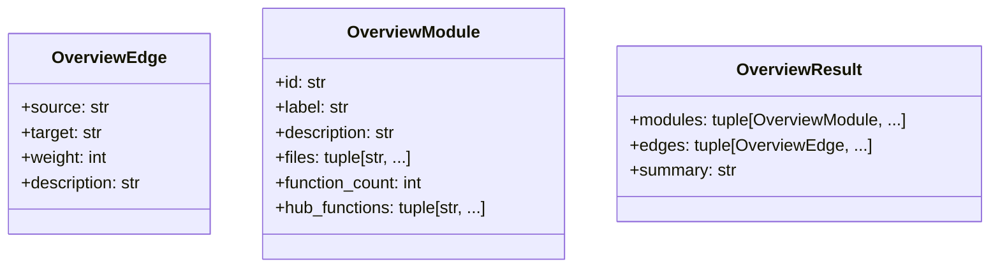
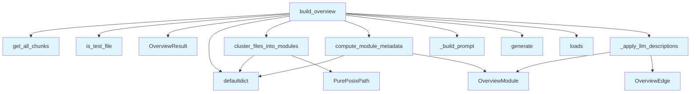

# File: `src/local_deepwiki/generators/codemap/overview.py`

## File Overview

This file implements the core logic for generating a module-level architecture overview of a codebase. It clusters files into modules based on directory structure, analyzes function call relationships to identify hub functions, and uses an LLM to generate descriptive labels and relationships between modules. The result is a structured overview that represents the architecture of the codebase at a high level, suitable for documentation or visualization.

The file is designed to be used in a larger system where code chunks are available via a [`VectorStore`](../../core/vectorstore/store.md) and processed through an LLM to produce meaningful descriptions and relationships.

## Key Concepts

### Module Clustering
The `cluster_files_into_modules` function groups files by their parent directory. This approach provides a natural way to group related files into logical modules, which is a common and intuitive way to structure codebases. The clustering is done using `PurePosixPath` to ensure consistent path handling across operating systems.

### Hub Function Identification
The `compute_module_metadata` function identifies "hub functions" within each module. Hub functions are those that are called by the most other functions in the codebase, indicating their central role. This is computed using a degree map derived from function call edges. The top 3 hub functions are selected to provide a concise summary of each module's most important functions.

### LLM Prompt Engineering
The `_build_prompt` function formats the module information into a prompt that can be consumed by an LLM. The prompt includes:
- Module ID and label
- Function count
- Files in the module
- Hub functions

This structured prompt allows the LLM to understand the context and generate appropriate descriptions and relationships.

### LLM Output Processing
The `_apply_llm_descriptions` function processes the LLM's response to update module descriptions and construct edges. It handles the parsing of LLM output into structured `OverviewModule` and `OverviewEdge` objects. If LLM processing fails, it gracefully falls back to returning the raw modules with a default summary.

## Integration

This file is used by:
- `cluster_files_into_modules`: Called by `test_codemap_overview` for testing purposes.
- `build_overview`: Called by `pages` to generate the architecture overview.

It integrates with:
- [`VectorStore`](../../core/vectorstore/store.md): Provides access to code chunks via `get_all_chunks()`.
- [`is_test_file`](../analysis/source_filter.md): Filters out test files from the analysis.
- LLM provider: Used via an async `generate()` method to produce descriptions and relationships.

The file is part of the `codemap` generator system and is intended to be used in conjunction with other CLI tools and core utilities like `local_deepwiki.core.audit`.

## Design Notes

### Handling of Edge Cases
- If no chunks are available from the [`VectorStore`](../../core/vectorstore/store.md), the function returns an empty `OverviewResult`.
- If LLM processing fails (e.g., due to parsing errors or network issues), the function logs a warning and returns a default summary and raw modules, ensuring that the system remains functional even when the LLM is unavailable or produces unexpected output.

### Asynchronous Design
The `build_overview` function is `async`, reflecting the expectation that the LLM interaction is an asynchronous operation. This aligns with typical LLM provider APIs and supports non-blocking processing in larger systems.

### Path Handling
The use of `PurePosixPath` ensures consistent handling of file paths across different operating systems, which is important for a tool that might be used in various environments.

### Data Flow
The module-level architecture overview is built through a clear data flow:
1. File chunks are retrieved from the [`VectorStore`](../../core/vectorstore/store.md).
2. Files are clustered into modules.
3. Function call relationships are computed.
4. Metadata (hub functions, function counts) is derived.
5. LLM is used to enrich descriptions and relationships.
6. Final `OverviewResult` is returned.

## API Reference

### class `OverviewModule`

A module (directory-level group) in the architecture overview.


<details>
<summary>View Source (lines 17-25) | <a href="https://github.com/UrbanDiver/local-deepwiki-mcp/blob/main/src/local_deepwiki/generators/codemap/overview.py#L17-L25">GitHub</a></summary>

```python
class OverviewModule:
    """A module (directory-level group) in the architecture overview."""

    id: str
    label: str
    description: str
    files: tuple[str, ...]
    function_count: int
    hub_functions: tuple[str, ...]
```

</details>

### class `OverviewEdge`

A relationship between two modules.


<details>
<summary>View Source (lines 29-35) | <a href="https://github.com/UrbanDiver/local-deepwiki-mcp/blob/main/src/local_deepwiki/generators/codemap/overview.py#L29-L35">GitHub</a></summary>

```python
class OverviewEdge:
    """A relationship between two modules."""

    source: str
    target: str
    weight: int
    description: str
```

</details>

### class `OverviewResult`

Complete overview graph with modules, edges, and summary.

---


<details>
<summary>View Source (lines 39-44) | <a href="https://github.com/UrbanDiver/local-deepwiki-mcp/blob/main/src/local_deepwiki/generators/codemap/overview.py#L39-L44">GitHub</a></summary>

```python
class OverviewResult:
    """Complete overview graph with modules, edges, and summary."""

    modules: tuple[OverviewModule, ...]
    edges: tuple[OverviewEdge, ...]
    summary: str
```

</details>

### Functions

#### `cluster_files_into_modules`

```python
def cluster_files_into_modules(files: dict[str, list[str]]) -> list[dict[str, object]]
```

Group files by parent directory into raw module dicts.


| Parameter | Type | Default | Description |
|-----------|------|---------|-------------|
| `files` | `dict[str, list[str]]` | - | mapping of file_path -> list of function names. |

**Returns:** `list[dict[str, object]]`


<details>
<summary>View Source (lines 52-81) | <a href="https://github.com/UrbanDiver/local-deepwiki-mcp/blob/main/src/local_deepwiki/generators/codemap/overview.py#L52-L81">GitHub</a></summary>

```python
def cluster_files_into_modules(
    files: dict[str, list[str]],
) -> list[dict[str, object]]:
    """Group files by parent directory into raw module dicts.

    Args:
        files: mapping of file_path -> list of function names.

    Returns:
        List of dicts with keys: id, dir_label, files.
    """
    if not files:
        return []

    dir_groups: dict[str, list[str]] = defaultdict(list)
    for fpath in files:
        parent = str(PurePosixPath(fpath).parent)
        dir_groups[parent].append(fpath)

    modules: list[dict[str, object]] = []
    for dir_path, dir_files in sorted(dir_groups.items()):
        label = PurePosixPath(dir_path).name or dir_path
        modules.append(
            {
                "id": dir_path,
                "dir_label": label,
                "files": sorted(dir_files),
            }
        )
    return modules
```

</details>

#### `compute_module_metadata`

```python
def compute_module_metadata(raw_modules: list[dict[str, object]], file_functions: dict[str, list[str]], edges: list[dict[str, str]]) -> list[OverviewModule]
```

Enrich raw module dicts with function counts and hub functions.


| Parameter | Type | Default | Description |
|-----------|------|---------|-------------|
| `raw_modules` | `list[dict[str, object]]` | - | output of cluster_files_into_modules. |
| `file_functions` | `dict[str, list[str]]` | - | file_path -> list of function names. |
| `edges` | `list[dict[str, str]]` | - | list of edge dicts with source, target, source_file, target_file. |

**Returns:** `list[OverviewModule]`


<details>
<summary>View Source (lines 84-128) | <a href="https://github.com/UrbanDiver/local-deepwiki-mcp/blob/main/src/local_deepwiki/generators/codemap/overview.py#L84-L128">GitHub</a></summary>

```python
def compute_module_metadata(
    raw_modules: list[dict[str, object]],
    file_functions: dict[str, list[str]],
    edges: list[dict[str, str]],
) -> list[OverviewModule]:
    """Enrich raw module dicts with function counts and hub functions.

    Args:
        raw_modules: output of cluster_files_into_modules.
        file_functions: file_path -> list of function names.
        edges: list of edge dicts with source, target, source_file, target_file.

    Returns:
        List of OverviewModule (without LLM descriptions — empty string).
    """
    # Build degree map across all functions
    degree: dict[str, int] = defaultdict(int)
    for edge in edges:
        degree[edge["source"]] += 1
        degree[edge["target"]] += 1

    result: list[OverviewModule] = []
    for mod in raw_modules:
        mod_files = mod["files"]  # type: ignore[assignment]
        func_count = 0
        mod_functions: list[str] = []
        for fpath in mod_files:  # type: ignore[union-attr]
            funcs = file_functions.get(str(fpath), [])
            func_count += len(funcs)
            mod_functions.extend(funcs)

        # Top 3 by degree
        hub = sorted(mod_functions, key=lambda f: degree.get(f, 0), reverse=True)[:3]

        result.append(
            OverviewModule(
                id=str(mod["id"]),
                label=str(mod["dir_label"]),
                description="",
                files=tuple(str(f) for f in mod_files),  # type: ignore[union-attr]
                function_count=func_count,
                hub_functions=tuple(hub),
            )
        )
    return result
```

</details>

#### `build_overview`

```python
async def build_overview(vector_store: object, repo_path: str, llm: object) -> OverviewResult
```

Build a module-level architecture overview with LLM labeling.


| Parameter | Type | Default | Description |
|-----------|------|---------|-------------|
| `vector_store` | `object` | - | VectorStore instance with get_all_chunks(). |
| `repo_path` | `str` | - | Path to the repository root. |
| `llm` | `object` | - | LLM provider with async generate() method. |

**Returns:** `OverviewResult`


<details>
<summary>View Source (lines 204-267) | <a href="https://github.com/UrbanDiver/local-deepwiki-mcp/blob/main/src/local_deepwiki/generators/codemap/overview.py#L204-L267">GitHub</a></summary>

```python
async def build_overview(
    vector_store: object,
    repo_path: str,
    llm: object,
) -> OverviewResult:
    """Build a module-level architecture overview with LLM labeling.

    Args:
        vector_store: VectorStore instance with get_all_chunks().
        repo_path: Path to the repository root.
        llm: LLM provider with async generate() method.

    Returns:
        OverviewResult with modules, edges, and summary.
    """
    all_chunks = vector_store.get_all_chunks()  # type: ignore[union-attr]
    chunks = [c for c in all_chunks if not is_test_file(c.file_path)]

    if not chunks:
        return OverviewResult(modules=(), edges=(), summary="")

    # Build file -> functions mapping and call edges from chunks
    file_functions: dict[str, list[str]] = defaultdict(list)
    call_edges: list[dict[str, str]] = []

    chunk_file_map: dict[str, str] = {}
    for chunk in chunks:
        if getattr(chunk, "chunk_type", None) and chunk.chunk_type.value == "function":
            file_functions[chunk.file_path].append(chunk.name)
            chunk_file_map[chunk.name] = chunk.file_path

    for chunk in chunks:
        for callee in getattr(chunk, "calls", []):
            if callee in chunk_file_map:
                call_edges.append(
                    {
                        "source": chunk.name,
                        "target": callee,
                        "source_file": chunk.file_path,
                        "target_file": chunk_file_map[callee],
                    }
                )

    # Cluster and compute metadata
    raw_modules = cluster_files_into_modules(dict(file_functions))
    modules = compute_module_metadata(raw_modules, dict(file_functions), call_edges)

    # LLM labeling
    try:
        prompt = _build_prompt(modules)
        response = await llm.generate(prompt)  # type: ignore[union-attr]
        llm_data = json.loads(response)
        enriched_modules, edges, summary = _apply_llm_descriptions(modules, llm_data)
    except Exception:
        logger.warning("LLM labeling failed, returning modules without descriptions")
        enriched_modules = tuple(modules)
        edges = ()
        summary = f"Architecture overview with {len(modules)} modules"

    return OverviewResult(
        modules=enriched_modules,
        edges=edges,
        summary=summary,
    )
```

</details>

## Class Diagram



## Call Graph



## Used By

Functions and methods in this file and their callers:

- **`OverviewEdge`**: called by `_apply_llm_descriptions`
- **`OverviewModule`**: called by `_apply_llm_descriptions`, `compute_module_metadata`
- **`OverviewResult`**: called by `build_overview`
- **`PurePosixPath`**: called by `cluster_files_into_modules`
- **`_apply_llm_descriptions`**: called by `build_overview`
- **`_build_prompt`**: called by `build_overview`
- **`cluster_files_into_modules`**: called by `build_overview`
- **`compute_module_metadata`**: called by `build_overview`
- **`defaultdict`**: called by `build_overview`, `cluster_files_into_modules`, `compute_module_metadata`
- **`generate`**: called by `build_overview`
- **`get_all_chunks`**: called by `build_overview`
- **[`is_test_file`](../analysis/source_filter.md)**: called by `build_overview`
- **`loads`**: called by `build_overview`

## Last Modified

| Entity | Type | Author | Date | Commit |
|--------|------|--------|------|--------|
| `build_overview` | function | Brian Breidenbach | 2 weeks ago | `aca80b7` fix: filter test files from... |
| `_build_prompt` | function | Brian Breidenbach | 2 weeks ago | `9acdc8a` feat: add build_overview as... |
| `_apply_llm_descriptions` | function | Brian Breidenbach | 2 weeks ago | `9acdc8a` feat: add build_overview as... |
| `cluster_files_into_modules` | function | Brian Breidenbach | 2 weeks ago | `d444c74` feat: add module clustering... |
| `compute_module_metadata` | function | Brian Breidenbach | 2 weeks ago | `d444c74` feat: add module clustering... |
| `OverviewModule` | class | Brian Breidenbach | 2 weeks ago | `fea3857` feat: add overview data mod... |
| `OverviewEdge` | class | Brian Breidenbach | 2 weeks ago | `fea3857` feat: add overview data mod... |
| `OverviewResult` | class | Brian Breidenbach | 2 weeks ago | `fea3857` feat: add overview data mod... |

## Additional Source Code

Source code for functions and methods not listed in the API Reference above.

#### `_build_prompt`

<details>
<summary>View Source (lines 151-162) | <a href="https://github.com/UrbanDiver/local-deepwiki-mcp/blob/main/src/local_deepwiki/generators/codemap/overview.py#L151-L162">GitHub</a></summary>

```python
def _build_prompt(modules: list[OverviewModule]) -> str:
    """Build the LLM prompt from computed modules."""
    parts: list[str] = []
    for mod in modules:
        files_str = ", ".join(mod.files) if mod.files else "(no files)"
        hubs_str = ", ".join(mod.hub_functions) if mod.hub_functions else "(none)"
        parts.append(
            f"Module '{mod.id}' (label: {mod.label}): "
            f"{mod.function_count} functions, files: {files_str}, "
            f"hub functions: {hubs_str}"
        )
    return _OVERVIEW_PROMPT_TEMPLATE.format(module_descriptions="\n".join(parts))
```

</details>


#### `_apply_llm_descriptions`

<details>
<summary>View Source (lines 165-201) | <a href="https://github.com/UrbanDiver/local-deepwiki-mcp/blob/main/src/local_deepwiki/generators/codemap/overview.py#L165-L201">GitHub</a></summary>

```python
def _apply_llm_descriptions(
    modules: list[OverviewModule],
    llm_data: dict,
) -> tuple[tuple[OverviewModule, ...], tuple[OverviewEdge, ...], str]:
    """Apply LLM-generated descriptions to modules and build edges."""
    llm_modules = llm_data.get("modules", {})
    llm_edges = llm_data.get("edges", {})
    summary = llm_data.get("summary", "")

    enriched: list[OverviewModule] = []
    for mod in modules:
        desc = llm_modules.get(mod.id, mod.description)
        enriched.append(
            OverviewModule(
                id=mod.id,
                label=mod.label,
                description=str(desc),
                files=mod.files,
                function_count=mod.function_count,
                hub_functions=mod.hub_functions,
            )
        )

    edges: list[OverviewEdge] = []
    for edge_key, edge_desc in llm_edges.items():
        parts = edge_key.split(" -> ", 1)
        if len(parts) == 2:
            edges.append(
                OverviewEdge(
                    source=parts[0].strip(),
                    target=parts[1].strip(),
                    weight=1,
                    description=str(edge_desc),
                )
            )

    return tuple(enriched), tuple(edges), str(summary)
```

</details>

## Relevant Source Files

- `src/local_deepwiki/generators/codemap/overview.py:17-25`
