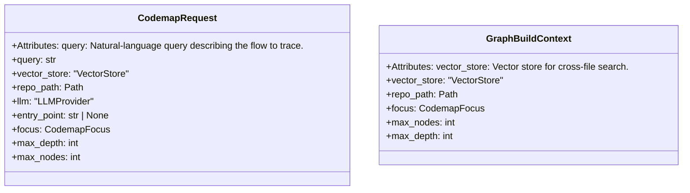

# File: `src/local_deepwiki/generators/codemap/params.py`

## File Overview

This file defines parameter objects used in the codemap generation process. It contains two frozen dataclasses — `CodemapRequest` and `GraphBuildContext` — that bundle parameters for different stages of the codemap generation pipeline.

The design rationale behind using dataclasses is to provide a clean, immutable way to pass configuration and context through various functions involved in generating a codemap. These classes encapsulate the parameters required for semantic code search, traversal logic, and narrative generation, reducing complexity and improving maintainability.

## Key Concepts

### Parameter Bundling
The use of dataclasses to bundle parameters is a design pattern chosen to reduce the number of function arguments and improve readability. Instead of passing long lists of parameters through multiple functions, these classes act as cohesive containers for related configuration values.

### Immutable Context
Both `CodemapRequest` and `GraphBuildContext` are designed to be immutable. This ensures that the configuration remains consistent during the execution of the codemap generation process, preventing accidental side effects and making debugging easier.

### Traversal Focus
The [`CodemapFocus`](models.md) enum is used to control how the codemap traversal behaves — whether it focuses on execution flow, data flow, or dependencies. This allows for flexible and purpose-specific code exploration without modifying core traversal logic.

## Integration

This file is imported and used by:
- The `CodemapRequest` class is used by the `generator` module and `test_codemap_diagram_params` test function.
- The `GraphBuildContext` class is used by `test_codemap_diagram_params`.

It integrates with other parts of the codebase via:
- [`local_deepwiki.generators.codemap.models.CodemapFocus`](models.md): Provides traversal focus modes.
- [`local_deepwiki.core.vectorstore.VectorStore`](../../core/vectorstore/store.md): Supplies semantic search capabilities.
- [`local_deepwiki.providers.base.LLMProvider`](../../providers/base.md): Provides language model capabilities for narrative generation.

These dependencies are central to the functionality of the codemap generator, which performs semantic code search and traversal across a repository.

## Design Notes

### Type Checking and Forward References
The use of forward references (e.g., `vector_store: "VectorStore"`) in the dataclass attributes is necessary because of circular import issues. This is a common pattern in Python projects with complex dependency structures.

### Default Values
Default values for parameters like `max_depth` and `max_nodes` are set to reasonable values that balance performance and completeness. These defaults can be overridden based on user needs or specific use cases.

### Separation of Concerns
`CodemapRequest` is used for initiating a codemap generation request, while `GraphBuildContext` is used internally by graph-building functions. This separation ensures that high-level parameters (like query and LLM provider) are distinct from low-level traversal parameters (like max depth and nodes), which improves modularity and reduces coupling.

### Extensibility
The structure of these classes allows for easy extension in the future. For example, new fields can be added to `CodemapRequest` or `GraphBuildContext` without breaking existing code, provided default values are set appropriately.

## API Reference

### class `CodemapRequest`

Bundles the parameters for a single `[`generate_codemap`](generator.md)` invocation.  Attributes: query: Natural-language query describing the flow to trace. vector_store: Vector store for semantic code search. repo_path: Repository root path. llm: LLM provider for narrative generation. entry_point: Optional explicit entry point hint. focus: Traversal focus mode (execution, data-flow, dependency). max_depth: Maximum BFS depth. max_nodes: Maximum nodes in the codemap graph.


<details>
<summary>View Source (lines 22-43) | <a href="https://github.com/UrbanDiver/local-deepwiki-mcp/blob/main/src/local_deepwiki/generators/codemap/params.py#L22-L43">GitHub</a></summary>

```python
class CodemapRequest:
    """Bundles the parameters for a single ``generate_codemap`` invocation.

    Attributes:
        query: Natural-language query describing the flow to trace.
        vector_store: Vector store for semantic code search.
        repo_path: Repository root path.
        llm: LLM provider for narrative generation.
        entry_point: Optional explicit entry point hint.
        focus: Traversal focus mode (execution, data-flow, dependency).
        max_depth: Maximum BFS depth.
        max_nodes: Maximum nodes in the codemap graph.
    """

    query: str
    vector_store: "VectorStore"
    repo_path: Path
    llm: "LLMProvider"
    entry_point: str | None = None
    focus: CodemapFocus = CodemapFocus.EXECUTION_FLOW
    max_depth: int = 4
    max_nodes: int = 40
```

</details>

### class `GraphBuildContext`

Immutable context shared by BFS graph-building functions.  Bundles the common parameters passed through `[`build_cross_file_graph`](graph.md)`, ``_resolve_callees_for_node``, ``_resolve_cross_file_callee``, and ``_apply_fallback_search``.  Attributes: vector_store: Vector store for cross-file search. repo_path: Repository root path. focus: Traversal focus mode. max_nodes: Maximum nodes allowed in the graph. max_depth: Maximum BFS depth.


<details>
<summary>View Source (lines 47-66) | <a href="https://github.com/UrbanDiver/local-deepwiki-mcp/blob/main/src/local_deepwiki/generators/codemap/params.py#L47-L66">GitHub</a></summary>

```python
class GraphBuildContext:
    """Immutable context shared by BFS graph-building functions.

    Bundles the common parameters passed through ``build_cross_file_graph``,
    ``_resolve_callees_for_node``, ``_resolve_cross_file_callee``, and
    ``_apply_fallback_search``.

    Attributes:
        vector_store: Vector store for cross-file search.
        repo_path: Repository root path.
        focus: Traversal focus mode.
        max_nodes: Maximum nodes allowed in the graph.
        max_depth: Maximum BFS depth.
    """

    vector_store: "VectorStore"
    repo_path: Path
    focus: CodemapFocus = CodemapFocus.EXECUTION_FLOW
    max_nodes: int = 40
    max_depth: int = 4
```

</details>

## Class Diagram



## Last Modified

| Entity | Type | Author | Date | Commit |
|--------|------|--------|------|--------|
| `CodemapRequest` | class | Brian Breidenbach | yesterday | `1eef062` refactor: complete Grade A ... |
| `GraphBuildContext` | class | Brian Breidenbach | yesterday | `1eef062` refactor: complete Grade A ... |

## Relevant Source Files

- `src/local_deepwiki/generators/codemap/params.py:22-43`
