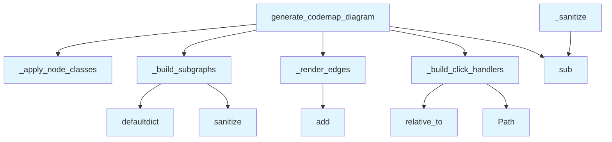

# File: `src/local_deepwiki/generators/codemap/viz.py`

## File Overview

This file is responsible for generating deterministic Mermaid flowcharts from [`CodemapGraph`](models.md) instances. It provides the visualization layer for code maps, organizing nodes into subgraphs by file, applying color-coded classes to distinguish entry, cross-file, and leaf nodes, and optionally adding click handlers for navigating to source files.

The design emphasizes determinism and clarity, making the generated diagrams suitable for documentation and analysis. It integrates with the broader codebase through shared models ([`CodemapGraph`](models.md), [`CodemapNode`](models.md), [`CodemapFocus`](models.md)) and diagram utilities.

## Key Concepts

### Mermaid Diagram Generation
The core of this file is the `generate_codemap_diagram` function, which orchestrates the generation of a Mermaid flowchart. It uses a series of helper functions to structure the diagram:
- `_build_subgraphs` organizes nodes into Mermaid subgraphs by file path.
- `_render_edges` deduplicates edges and applies appropriate arrow styles based on file boundaries and edge types.
- `_apply_node_classes` assigns visual styles (colors) to nodes based on their role in the graph.
- `_build_click_handlers` adds optional click actions for navigating to source files.

### Deterministic Output
To ensure consistent output across runs, nodes are sorted by file path and qualified name, and stable IDs (like `N0`, `N1`) are assigned. This allows the same input graph to always produce the same Mermaid diagram.

### Node Classification
Nodes are classified into three categories:
- **Entry**: The root node of the graph.
- **Cross-file**: Nodes that are targets of edges crossing file boundaries.
- **Leaf**: Nodes with no outgoing edges and not classified as cross-file or entry.

This classification enables visual distinction in the diagram, aiding in understanding code flow and structure.

### Sanitization
The `_sanitize` function ensures that identifiers used in Mermaid diagrams are valid by replacing invalid characters with underscores. This is critical for compatibility with Mermaid's syntax and robustness in handling arbitrary file or node names.

## Integration

This file is part of the codemap generation pipeline and is called by:
- `generate_codemap_diagram`, which is used by the main generator and test utilities.
- `_render_edges`, which is used by the `dependency_graph` generator.

It imports from:
- `local_deepwiki.generators.codemap.models`: for [`CodemapGraph`](models.md), [`CodemapNode`](models.md), and [`CodemapFocus`](models.md).
- `local_deepwiki.generators.diagrams`: for [`sanitize_mermaid_name`](../diagrams/_utils.md), which is aliased to `_sanitize`.

The [`CodemapFocus`](models.md) enum is used to control how edges are rendered, particularly in data flow diagrams where only certain edge types (e.g., "calls") are shown.

## Design Notes

### Why Use Subgraphs?
Grouping nodes by file into Mermaid subgraphs improves diagram readability by visually separating code structure. This approach is especially useful in large codebases where many nodes originate from the same file.

### Edge Deduplication
The `_render_edges` function deduplicates edges by checking for repeated `(source, target)` pairs. This avoids cluttering the diagram with redundant connections, particularly in cases where multiple relationships exist between the same nodes.

### Arrow Styling Based on File Boundaries
Arrows between nodes in the same file use a solid line (`-->`), while arrows between different files use a dotted line (`-.->`). This visual distinction helps users quickly identify cross-file dependencies.

### Click Handler Support
Click handlers are only added if a `repo_path` is provided. This allows for optional navigation in diagrams generated in environments where source file paths are not available or relevant.

### Fallback Sanitization
The `generate_codemap_diagram` function includes a fallback implementation of `_sanitize` in case the `local_deepwiki.generators.diagrams` module is not available. This ensures robustness in environments where dependencies may be incomplete.

## API Reference

### Functions

#### `generate_codemap_diagram`

```python
def generate_codemap_diagram(graph: CodemapGraph, focus: CodemapFocus, repo_path: Path | None = None) -> str
```

Generate a deterministic Mermaid flowchart from *graph*.


| Parameter | Type | Default | Description |
|-----------|------|---------|-------------|
| `graph` | `CodemapGraph` | - | - |
| `focus` | `CodemapFocus` | - | - |
| `repo_path` | `Path | None` | `None` | - |

**Returns:** `str`


<details>
<summary>View Source (lines 136-170) | <a href="https://github.com/UrbanDiver/local-deepwiki-mcp/blob/main/src/local_deepwiki/generators/codemap/viz.py#L136-L170">GitHub</a></summary>

```python
def generate_codemap_diagram(
    graph: CodemapGraph, focus: CodemapFocus, repo_path: Path | None = None
) -> str:
    """Generate a deterministic Mermaid flowchart from *graph*."""
    try:
        from local_deepwiki.generators.diagrams import (
            sanitize_mermaid_name as _sanitize,
        )
    except ImportError:  # pragma: no cover

        def _sanitize(name: str) -> str:
            return re.sub(r"[^a-zA-Z0-9_]", "_", name)

    sanitize_mermaid_name = _sanitize

    if not graph.nodes:
        return 'flowchart TD\n    empty["No code paths found for this query"]'

    # Deterministic ordering: sort nodes by (file, qualified_name)
    sorted_nodes = sorted(
        graph.nodes.values(), key=lambda n: (n.file_path, n.qualified_name)
    )

    # Assign stable IDs
    node_ids: dict[str, str] = {}
    for idx, node in enumerate(sorted_nodes):
        node_ids[node.qualified_name] = f"N{idx}"

    lines: list[str] = ["flowchart TD"]
    lines.extend(_build_subgraphs(sorted_nodes, node_ids, sanitize_mermaid_name))
    lines.extend(_render_edges(graph, node_ids, focus))
    lines.extend(_apply_node_classes(graph, sorted_nodes, node_ids))
    lines.extend(_build_click_handlers(sorted_nodes, node_ids, repo_path))

    return "\n".join(lines)
```

</details>

## Call Graph



## Used By

Functions and methods in this file and their callers:

- **`Path`**: called by `_build_click_handlers`
- **`_apply_node_classes`**: called by `generate_codemap_diagram`
- **`_build_click_handlers`**: called by `generate_codemap_diagram`
- **`_build_subgraphs`**: called by `generate_codemap_diagram`
- **`_render_edges`**: called by `generate_codemap_diagram`
- **`add`**: called by `_render_edges`
- **`defaultdict`**: called by `_build_subgraphs`
- **`relative_to`**: called by `_build_click_handlers`
- **`sanitize`**: called by `_build_subgraphs`
- **`sub`**: called by `_sanitize`, `generate_codemap_diagram`

## Last Modified

| Entity | Type | Author | Date | Commit |
|--------|------|--------|------|--------|
| `_build_subgraphs` | function | Brian Breidenbach | 2 weeks ago | `58a3b52` refactor: decompose generat... |
| `_render_edges` | function | Brian Breidenbach | 2 weeks ago | `58a3b52` refactor: decompose generat... |
| `_apply_node_classes` | function | Brian Breidenbach | 2 weeks ago | `58a3b52` refactor: decompose generat... |
| `_build_click_handlers` | function | Brian Breidenbach | 2 weeks ago | `58a3b52` refactor: decompose generat... |
| `generate_codemap_diagram` | function | Brian Breidenbach | 2 weeks ago | `58a3b52` refactor: decompose generat... |
| `_sanitize` | function | Brian Breidenbach | 2 weeks ago | `58a3b52` refactor: decompose generat... |

## Additional Source Code

Source code for functions and methods not listed in the API Reference above.

#### `_build_subgraphs`

<details>
<summary>View Source (lines 22-41) | <a href="https://github.com/UrbanDiver/local-deepwiki-mcp/blob/main/src/local_deepwiki/generators/codemap/viz.py#L22-L41">GitHub</a></summary>

```python
def _build_subgraphs(
    sorted_nodes: list[CodemapNode],
    node_ids: dict[str, str],
    sanitize: Callable[[str], str],
) -> list[str]:
    """Group nodes by file and generate Mermaid subgraph blocks."""
    files_to_nodes: dict[str, list[CodemapNode]] = defaultdict(list)
    for node in sorted_nodes:
        files_to_nodes[node.file_path].append(node)

    lines: list[str] = []
    for file_path in sorted(files_to_nodes):
        safe_subgraph = sanitize(file_path)
        lines.append(f'    subgraph {safe_subgraph}["{file_path}"]')
        for node in files_to_nodes[file_path]:
            nid = node_ids[node.qualified_name]
            label = f"{node.name}\\n:{node.start_line}-{node.end_line}"
            lines.append(f'        {nid}["{label}"]')
        lines.append("    end")
    return lines
```

</details>


#### `_render_edges`

<details>
<summary>View Source (lines 44-71) | <a href="https://github.com/UrbanDiver/local-deepwiki-mcp/blob/main/src/local_deepwiki/generators/codemap/viz.py#L44-L71">GitHub</a></summary>

```python
def _render_edges(
    graph: CodemapGraph,
    node_ids: dict[str, str],
    focus: CodemapFocus,
) -> list[str]:
    """Deduplicate edges, choose arrow style, and add labels."""
    sorted_edges = sorted(
        graph.edges,
        key=lambda e: (e.source, e.target),
    )
    lines: list[str] = []
    seen_edges: set[tuple[str, str]] = set()
    for edge in sorted_edges:
        src_id = node_ids.get(edge.source)
        tgt_id = node_ids.get(edge.target)
        if src_id is None or tgt_id is None:
            continue
        pair = (src_id, tgt_id)
        if pair in seen_edges:
            continue
        seen_edges.add(pair)
        arrow = "-.->" if edge.source_file != edge.target_file else "-->"
        if focus == CodemapFocus.DATA_FLOW and edge.edge_type != "calls":
            safe_label = edge.edge_type.replace('"', "'")
            lines.append(f'    {src_id} {arrow}|"{safe_label}"| {tgt_id}')
        else:
            lines.append(f"    {src_id} {arrow} {tgt_id}")
    return lines
```

</details>


#### `_apply_node_classes`

<details>
<summary>View Source (lines 74-113) | <a href="https://github.com/UrbanDiver/local-deepwiki-mcp/blob/main/src/local_deepwiki/generators/codemap/viz.py#L74-L113">GitHub</a></summary>

```python
def _apply_node_classes(
    graph: CodemapGraph,
    sorted_nodes: list[CodemapNode],
    node_ids: dict[str, str],
) -> list[str]:
    """Generate classDef and class assignment lines for entry/crossfile/leaf nodes."""
    cross_file_targets: set[str] = {
        e.target for e in graph.edges if e.source_file != e.target_file
    }
    nodes_with_outgoing: set[str] = {e.source for e in graph.edges}

    lines: list[str] = [
        "",
        "    classDef entry fill:#2d6a4f,color:#fff",
        "    classDef crossfile fill:#1d3557,color:#fff",
        "    classDef leaf fill:#6c757d,color:#fff",
    ]

    if graph.entry_point and graph.entry_point in node_ids:
        lines.append(f"    class {node_ids[graph.entry_point]} entry")

    crossfile_ids = [
        node_ids[qn]
        for qn in cross_file_targets
        if qn in node_ids and qn != graph.entry_point
    ]
    if crossfile_ids:
        lines.append(f"    class {','.join(sorted(crossfile_ids))} crossfile")

    leaf_ids = [
        node_ids[n.qualified_name]
        for n in sorted_nodes
        if n.qualified_name not in nodes_with_outgoing
        and n.qualified_name != graph.entry_point
        and n.qualified_name not in cross_file_targets
    ]
    if leaf_ids:
        lines.append(f"    class {','.join(sorted(leaf_ids))} leaf")

    return lines
```

</details>


#### `_build_click_handlers`

<details>
<summary>View Source (lines 116-133) | <a href="https://github.com/UrbanDiver/local-deepwiki-mcp/blob/main/src/local_deepwiki/generators/codemap/viz.py#L116-L133">GitHub</a></summary>

```python
def _build_click_handlers(
    sorted_nodes: list[CodemapNode],
    node_ids: dict[str, str],
    repo_path: Path | None,
) -> list[str]:
    """Generate click handler lines for source navigation."""
    if repo_path is None:
        return []

    lines: list[str] = []
    for node in sorted_nodes:
        nid = node_ids[node.qualified_name]
        try:
            rel = str(Path(node.file_path).relative_to(repo_path))
        except (ValueError, TypeError):
            rel = node.file_path
        lines.append(f'    click {nid} "files/{rel}" _blank')
    return lines
```

</details>


#### `_sanitize`

<details>
<summary>View Source (lines 146-147) | <a href="https://github.com/UrbanDiver/local-deepwiki-mcp/blob/main/src/local_deepwiki/generators/codemap/viz.py#L146-L147">GitHub</a></summary>

```python
def _sanitize(name: str) -> str:
            return re.sub(r"[^a-zA-Z0-9_]", "_", name)
```

</details>

## Relevant Source Files

- `src/local_deepwiki/generators/codemap/viz.py:22-41`
