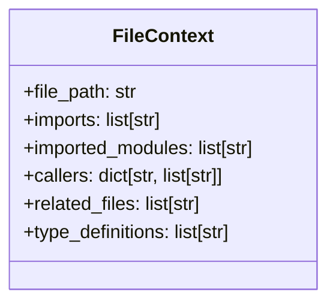
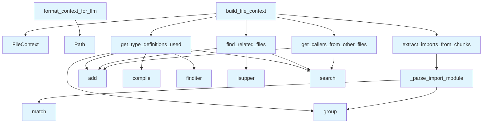

# File Overview

This file, `context_builder.py`, is responsible for building contextual information about files and code chunks within the local_deepwiki system. It provides functionality to extract import information, identify related files, and format context for LLM consumption. The module integrates with vector stores, call graph extractors, and other core components to provide rich code context.

# Classes

## FileContext

The `FileContext` class encapsulates contextual information about a file, including its chunks, related files, and import details.

### Key Methods

- `__init__(self, file_path: Path, chunks: list[CodeChunk], related_files: list[Path] = None, imports: list[str] = None)`
  - Initializes a FileContext instance with file path, chunks, related files, and imports
  - Parameters:
    - `file_path`: Path to the file
    - `chunks`: List of [CodeChunk](../models.md) objects in the file
    - `related_files`: List of related file paths (default: None)
    - `imports`: List of import statements (default: None)

# Functions

## extract_imports_from_chunks

```python
def extract_imports_from_chunks(chunks: list[CodeChunk]) -> list[str]
```

Extracts import statements from a list of code chunks.

- Parameters:
  - `chunks`: List of [CodeChunk](../models.md) objects
- Returns:
  - List of import statement strings

## _parse_import_module

```python
def _parse_import_module(import_line: str) -> str
```

Parses the module name from an import statement.

- Parameters:
  - `import_line`: Import statement string
- Returns:
  - Module name extracted from the import line

## get_callers_from_other_files

```python
def get_callers_from_other_files(callgraph: dict[str, list[str]], file_path: str) -> list[str]
```

Finds callers of functions in a specific file from other files.

- Parameters:
  - `callgraph`: Dictionary mapping files to their callers
  - `file_path`: Path to the file being analyzed
- Returns:
  - List of caller file paths

## find_related_files

```python
def find_related_files(vector_store: VectorStore, file_path: Path, threshold: float = 0.8) -> list[Path]
```

Finds files related to a given file based on vector similarity.

- Parameters:
  - `vector_store`: [VectorStore](../core/vectorstore.md) instance for similarity search
  - `file_path`: Path to the file being analyzed
  - `threshold`: Similarity threshold for related files (default: 0.8)
- Returns:
  - List of related file paths

## get_type_definitions_used

```python
def get_type_definitions_used(chunks: list[CodeChunk]) -> list[str]
```

Extracts type definitions used in code chunks.

- Parameters:
  - `chunks`: List of [CodeChunk](../models.md) objects
- Returns:
  - List of type definition strings

## build_file_context

```python
def build_file_context(file_path: Path, chunks: list[CodeChunk], vector_store: VectorStore, callgraph: dict[str, list[str]], chunk_type: ChunkType = ChunkType.FUNCTION) -> FileContext
```

Builds a FileContext object for a given file.

- Parameters:
  - `file_path`: Path to the file
  - `chunks`: List of [CodeChunk](../models.md) objects in the file
  - `vector_store`: [VectorStore](../core/vectorstore.md) instance for finding related files
  - `callgraph`: Dictionary mapping files to their callers
  - `chunk_type`: Type of chunks to consider (default: [ChunkType](../models.md).FUNCTION)
- Returns:
  - FileContext instance for the file

## format_context_for_llm

```python
def format_context_for_llm(context: FileContext, max_tokens: int = 2048) -> str
```

Formats file context into a string suitable for LLM input.

- Parameters:
  - `context`: FileContext object to format
  - `max_tokens`: Maximum number of tokens for the output (default: 2048)
- Returns:
  - Formatted context string for LLM consumption

# Integration

This file integrates with several core components of the local_deepwiki system:

- **[VectorStore](../core/vectorstore.md)**: Used in `find_related_files` to identify semantically similar files
- **[CallGraphExtractor](callgraph.md)**: Provides call graph information for `get_callers_from_other_files`
- **[CodeChunk](../models.md)**: Core data structure used throughout the module
- **[ChunkType](../models.md)**: Enum used to specify chunk types in `build_file_context`

The module is part of the generators package and works alongside other components like `callgraph.py` to provide comprehensive code context for documentation generation.

# Usage Examples

```python
# Example usage of build_file_context
from pathlib import Path
from local_deepwiki.core.vectorstore import VectorStore
from local_deepwiki.generators.context_builder import build_file_context
from local_deepwiki.models import ChunkType

# Assuming we have chunks and a vector store
file_path = Path("example.py")
chunks = [...]  # List of CodeChunk objects
vector_store = VectorStore()
callgraph = {}  # Dictionary mapping files to callers

context = build_file_context(file_path, chunks, vector_store, callgraph)
```

```python
# Example usage of format_context_for_llm
from local_deepwiki.generators.context_builder import format_context_for_llm

formatted_context = format_context_for_llm(context, max_tokens=1024)
```

## API Reference

### class `FileContext`

Rich context for a source file.

---


<details>
<summary>View Source (lines 25-33) | <a href="https://github.com/UrbanDiver/local-deepwiki-mcp/blob/[main](../export/pdf.md)/src/local_deepwiki/generators/context_builder.py#L25-L33">GitHub</a></summary>

```python
class FileContext:
    """Rich context for a source file."""

    file_path: str
    imports: list[str] = field(default_factory=list)
    imported_modules: list[str] = field(default_factory=list)
    callers: dict[str, list[str]] = field(default_factory=dict)  # entity -> [caller files]
    related_files: list[str] = field(default_factory=list)
    type_definitions: list[str] = field(default_factory=list)  # Type hints used
```

</details>

### Functions

#### `extract_imports_from_chunks`

```python
def extract_imports_from_chunks(chunks: list[CodeChunk]) -> tuple[list[str], list[str]]
```

Extract import statements and module names from code chunks.


| [Parameter](api_docs.md) | Type | Default | Description |
|-----------|------|---------|-------------|
| `chunks` | `list[CodeChunk]` | - | List of code chunks for a file. |

**Returns:** `tuple[list[str], list[str]]`


<details>
<summary>View Source (lines 36-62) | <a href="https://github.com/UrbanDiver/local-deepwiki-mcp/blob/[main](../export/pdf.md)/src/local_deepwiki/generators/context_builder.py#L36-L62">GitHub</a></summary>

```python
def extract_imports_from_chunks(chunks: list[CodeChunk]) -> tuple[list[str], list[str]]:
    """Extract import statements and module names from code chunks.

    Args:
        chunks: List of code chunks for a file.

    Returns:
        Tuple of (import_statements, module_names).
    """
    imports: list[str] = []
    modules: list[str] = []

    for chunk in chunks:
        if chunk.chunk_type == ChunkType.IMPORT:
            # Split import block into individual lines
            for line in chunk.content.split("\n"):
                line = line.strip()
                if not line or line.startswith("#"):
                    continue
                imports.append(line)

                # Extract module name
                module = _parse_import_module(line)
                if module and module not in modules:
                    modules.append(module)

    return imports, modules
```

</details>

#### `get_callers_from_other_files`

```python
async def get_callers_from_other_files(file_path: str, entity_names: list[str], repo_path: Path, vector_store: VectorStore, max_files: int = 10) -> dict[str, list[str]]
```

Find which other files call entities defined in this file.


| [Parameter](api_docs.md) | Type | Default | Description |
|-----------|------|---------|-------------|
| `file_path` | `str` | - | Path to the source file. |
| `entity_names` | `list[str]` | - | Names of functions/classes defined in the file. |
| `repo_path` | `Path` | - | Repository root path. |
| `vector_store` | [`VectorStore`](../core/vectorstore.md) | - | Vector store for searching code. |
| `max_files` | `int` | `10` | Maximum number of caller files to return per entity. |

**Returns:** `dict[str, list[str]]`


<details>
<summary>View Source (lines 90-142) | <a href="https://github.com/UrbanDiver/local-deepwiki-mcp/blob/[main](../export/pdf.md)/src/local_deepwiki/generators/context_builder.py#L90-L142">GitHub</a></summary>

```python
async def get_callers_from_other_files(
    file_path: str,
    entity_names: list[str],
    repo_path: Path,
    vector_store: VectorStore,
    max_files: int = 10,
) -> dict[str, list[str]]:
    """Find which other files call entities defined in this file.

    Args:
        file_path: Path to the source file.
        entity_names: Names of functions/classes defined in the file.
        repo_path: Repository root path.
        vector_store: Vector store for searching code.
        max_files: Maximum number of caller files to return per entity.

    Returns:
        Mapping of entity name to list of calling file paths.
    """
    callers: dict[str, list[str]] = {}

    for entity_name in entity_names:
        if len(entity_name) < 4:  # Skip short names (likely false positives)
            continue

        # Search for uses of this entity
        try:
            results = await vector_store.search(
                f"{entity_name}(",  # Function call pattern
                limit=20,
            )

            caller_files: set[str] = set()
            for result in results:
                chunk = result.chunk
                # Skip the file that defines the entity
                if chunk.file_path == file_path:
                    continue
                # Skip if entity name not actually in the content
                if entity_name not in chunk.content:
                    continue
                caller_files.add(chunk.file_path)

                if len(caller_files) >= max_files:
                    break

            if caller_files:
                callers[entity_name] = sorted(caller_files)[:max_files]

        except Exception as e:
            logger.debug(f"Error searching for callers of {entity_name}: {e}")

    return callers
```

</details>

#### `find_related_files`

```python
async def find_related_files(file_path: str, imported_modules: list[str], vector_store: VectorStore, max_files: int = 5) -> list[str]
```

Find files that are closely related to this one.  Related files are those that: - Are imported by this file (same package) - Import this file


| [Parameter](api_docs.md) | Type | Default | Description |
|-----------|------|---------|-------------|
| `file_path` | `str` | - | Path to the source file. |
| `imported_modules` | `list[str]` | - | Modules imported by this file. |
| `vector_store` | [`VectorStore`](../core/vectorstore.md) | - | Vector store for searching. |
| `max_files` | `int` | `5` | Maximum number of related files to return. |

**Returns:** `list[str]`


<details>
<summary>View Source (lines 145-181) | <a href="https://github.com/UrbanDiver/local-deepwiki-mcp/blob/[main](../export/pdf.md)/src/local_deepwiki/generators/context_builder.py#L145-L181">GitHub</a></summary>

```python
async def find_related_files(
    file_path: str,
    imported_modules: list[str],
    vector_store: VectorStore,
    max_files: int = 5,
) -> list[str]:
    """Find files that are closely related to this one.

    Related files are those that:
    - Are imported by this file (same package)
    - Import this file

    Args:
        file_path: Path to the source file.
        imported_modules: Modules imported by this file.
        vector_store: Vector store for searching.
        max_files: Maximum number of related files to return.

    Returns:
        List of related file paths.
    """
    related: set[str] = set()

    # Find files that this file imports (within same project)
    for module in imported_modules:
        try:
            results = await vector_store.search(
                f"def {module}" if not module[0].isupper() else f"class {module}",
                limit=5,
            )
            for result in results:
                if result.chunk.file_path != file_path:
                    related.add(result.chunk.file_path)
        except Exception:
            pass

    return sorted(related)[:max_files]
```

</details>

#### `get_type_definitions_used`

```python
async def get_type_definitions_used(chunks: list[CodeChunk], vector_store: VectorStore, max_types: int = 10) -> list[str]
```

Extract type definitions used in the file that are defined elsewhere.


| [Parameter](api_docs.md) | Type | Default | Description |
|-----------|------|---------|-------------|
| `chunks` | `list[CodeChunk]` | - | Code chunks for the file. |
| `vector_store` | [`VectorStore`](../core/vectorstore.md) | - | Vector store for searching. |
| `max_types` | `int` | `10` | Maximum number of type definitions to return. |

**Returns:** `list[str]`


<details>
<summary>View Source (lines 184-235) | <a href="https://github.com/UrbanDiver/local-deepwiki-mcp/blob/[main](../export/pdf.md)/src/local_deepwiki/generators/context_builder.py#L184-L235">GitHub</a></summary>

```python
async def get_type_definitions_used(
    chunks: list[CodeChunk],
    vector_store: VectorStore,
    max_types: int = 10,
) -> list[str]:
    """Extract type definitions used in the file that are defined elsewhere.

    Args:
        chunks: Code chunks for the file.
        vector_store: Vector store for searching.
        max_types: Maximum number of type definitions to return.

    Returns:
        List of type definition snippets.
    """
    type_defs: list[str] = []
    type_names: set[str] = set()

    # Find type annotations in chunks
    type_pattern = re.compile(r":\s*([A-Z][a-zA-Z0-9_]+)")
    return_pattern = re.compile(r"->\s*([A-Z][a-zA-Z0-9_]+)")

    for chunk in chunks:
        # Find type annotations
        for match in type_pattern.finditer(chunk.content):
            type_name = match.group(1)
            if type_name not in type_names and len(type_name) > 3:
                type_names.add(type_name)
        # Find return type annotations
        for match in return_pattern.finditer(chunk.content):
            type_name = match.group(1)
            if type_name not in type_names and len(type_name) > 3:
                type_names.add(type_name)

    # Look up definitions of these types
    for type_name in list(type_names)[:max_types]:
        try:
            results = await vector_store.search(
                f"class {type_name}",
                limit=3,
            )
            for result in results:
                if result.chunk.chunk_type == ChunkType.CLASS:
                    # Get just the class definition line
                    first_line = result.chunk.content.split("\n")[0]
                    if type_name in first_line:
                        type_defs.append(f"{type_name}: {first_line}")
                        break
        except Exception:
            pass

    return type_defs
```

</details>

#### `build_file_context`

```python
async def build_file_context(file_path: str, chunks: list[CodeChunk], repo_path: Path, vector_store: VectorStore) -> FileContext
```

Build comprehensive context for a source file.


| [Parameter](api_docs.md) | Type | Default | Description |
|-----------|------|---------|-------------|
| `file_path` | `str` | - | Path to the source file. |
| `chunks` | `list[CodeChunk]` | - | Code chunks for the file. |
| `repo_path` | `Path` | - | Repository root path. |
| `vector_store` | [`VectorStore`](../core/vectorstore.md) | - | Vector store for searching. |

**Returns:** `FileContext`


<details>
<summary>View Source (lines 238-289) | <a href="https://github.com/UrbanDiver/local-deepwiki-mcp/blob/[main](../export/pdf.md)/src/local_deepwiki/generators/context_builder.py#L238-L289">GitHub</a></summary>

```python
async def build_file_context(
    file_path: str,
    chunks: list[CodeChunk],
    repo_path: Path,
    vector_store: VectorStore,
) -> FileContext:
    """Build comprehensive context for a source file.

    Args:
        file_path: Path to the source file.
        chunks: Code chunks for the file.
        repo_path: Repository root path.
        vector_store: Vector store for searching.

    Returns:
        FileContext with all extracted information.
    """
    # Extract imports
    imports, imported_modules = extract_imports_from_chunks(chunks)

    # Get entity names for caller lookup
    entity_names = [
        chunk.name for chunk in chunks
        if chunk.name and chunk.chunk_type in (ChunkType.CLASS, ChunkType.FUNCTION)
    ]

    # Get callers from other files
    callers = await get_callers_from_other_files(
        file_path=file_path,
        entity_names=entity_names,
        repo_path=repo_path,
        vector_store=vector_store,
    )

    # Find related files
    related_files = await find_related_files(
        file_path=file_path,
        imported_modules=imported_modules,
        vector_store=vector_store,
    )

    # Get type definitions used
    type_definitions = await get_type_definitions_used(chunks, vector_store)

    return FileContext(
        file_path=file_path,
        imports=imports,
        imported_modules=imported_modules,
        callers=callers,
        related_files=related_files,
        type_definitions=type_definitions,
    )
```

</details>

#### `format_context_for_llm`

```python
def format_context_for_llm(context: FileContext, max_imports: int = 15) -> str
```

Format file context as text for the LLM prompt.


| [Parameter](api_docs.md) | Type | Default | Description |
|-----------|------|---------|-------------|
| `context` | `FileContext` | - | The file context to format. |
| `max_imports` | `int` | `15` | Maximum number of imports to include. |

**Returns:** `str`


<details>
<summary>View Source (lines 292-341) | <a href="https://github.com/UrbanDiver/local-deepwiki-mcp/blob/[main](../export/pdf.md)/src/local_deepwiki/generators/context_builder.py#L292-L341">GitHub</a></summary>

```python
def format_context_for_llm(context: FileContext, max_imports: int = 15) -> str:
    """Format file context as text for the LLM prompt.

    Args:
        context: The file context to format.
        max_imports: Maximum number of imports to include.

    Returns:
        Formatted context string.
    """
    parts: list[str] = []

    # Imports section
    if context.imports:
        parts.append("## Dependencies (Imports)")
        parts.append("This file imports from:")
        for imp in context.imports[:max_imports]:
            parts.append(f"  {imp}")
        if len(context.imports) > max_imports:
            parts.append(f"  ... and {len(context.imports) - max_imports} more")
        parts.append("")

    # Callers section (who uses this file)
    if context.callers:
        parts.append("## External Usage")
        parts.append("Functions/classes in this file are called from:")
        for entity, caller_files in list(context.callers.items())[:10]:
            files_str = ", ".join(Path(f).stem for f in caller_files[:3])
            if len(caller_files) > 3:
                files_str += f" +{len(caller_files) - 3} more"
            parts.append(f"  - `{entity}`: used by {files_str}")
        parts.append("")

    # Related files section
    if context.related_files:
        parts.append("## Related Files")
        parts.append("Closely related files in this project:")
        for f in context.related_files[:5]:
            parts.append(f"  - {f}")
        parts.append("")

    # Type definitions section
    if context.type_definitions:
        parts.append("## Type Definitions Used")
        parts.append("Key types referenced in this file:")
        for type_def in context.type_definitions[:8]:
            parts.append(f"  - {type_def}")
        parts.append("")

    return "\n".join(parts) if parts else ""
```

</details>

## Class Diagram



## Call Graph



## Used By

Functions and methods in this file and their callers:

- **`FileContext`**: called by `build_file_context`
- **`Path`**: called by `format_context_for_llm`
- **`_parse_import_module`**: called by `extract_imports_from_chunks`
- **`add`**: called by `find_related_files`, `get_callers_from_other_files`, `get_type_definitions_used`
- **`compile`**: called by `get_type_definitions_used`
- **`extract_imports_from_chunks`**: called by `build_file_context`
- **`find_related_files`**: called by `build_file_context`
- **`finditer`**: called by `get_type_definitions_used`
- **`get_callers_from_other_files`**: called by `build_file_context`
- **`get_type_definitions_used`**: called by `build_file_context`
- **`group`**: called by `_parse_import_module`, `get_type_definitions_used`
- **`isupper`**: called by `find_related_files`
- **`match`**: called by `_parse_import_module`
- **`search`**: called by `find_related_files`, `get_callers_from_other_files`, `get_type_definitions_used`

## Usage Examples

*Examples extracted from test files*

### Test extracting from 'from X import Y' statement

From `test_context_builder.py::TestExtractImportsFromChunks::test_extracts_from_import_statement`:

```python
chunk = make_chunk(
    chunk_type=ChunkType.IMPORT,
    content="from pathlib import Path\nfrom typing import List",
)

imports, modules = extract_imports_from_chunks([chunk])

assert len(imports) == 2
assert "from pathlib import Path" in imports
assert "from typing import List" in imports
assert "pathlib" in modules
assert "typing" in modules
```

### Test extracting from 'from X import Y' statement

From `test_context_builder.py::TestExtractImportsFromChunks::test_extracts_from_import_statement`:

```python
chunk = make_chunk(
    chunk_type=ChunkType.IMPORT,
    content="from pathlib import Path\nfrom typing import List",
)

imports, modules = extract_imports_from_chunks([chunk])

assert len(imports) == 2
assert "from pathlib import Path" in imports
assert "from typing import List" in imports
assert "pathlib" in modules
assert "typing" in modules
```

### Test extracting from 'import X' statement

From `test_context_builder.py::TestExtractImportsFromChunks::test_extracts_import_statement`:

```python
chunk = make_chunk(
    chunk_type=ChunkType.IMPORT,
    content="import os\nimport sys",
)

imports, modules = extract_imports_from_chunks([chunk])

assert len(imports) == 2
assert "import os" in imports
assert "os" in modules
assert "sys" in modules
```

### Test extracting from 'import X' statement

From `test_context_builder.py::TestExtractImportsFromChunks::test_extracts_import_statement`:

```python
chunk = make_chunk(
    chunk_type=ChunkType.IMPORT,
    content="import os\nimport sys",
)

imports, modules = extract_imports_from_chunks([chunk])

assert len(imports) == 2
assert "import os" in imports
assert "os" in modules
assert "sys" in modules
```

### Test formatting imports section

From `test_context_builder.py::TestFormatContextForLlm::test_formats_imports_section`:

```python
context = FileContext(
    file_path="src/test.py",
    imports=["from pathlib import Path", "import os"],
    imported_modules=["pathlib", "os"],
)

result = format_context_for_llm(context)

assert "Dependencies" in result
assert "from pathlib import Path" in result
```


## Last Modified

| Entity | Type | Author | Date | Commit |
|--------|------|--------|------|--------|
| `FileContext` | class | Brian Breidenbach | today | `8ac0de1` Add richer LLM context for ... |
| `extract_imports_from_chunks` | function | Brian Breidenbach | today | `8ac0de1` Add richer LLM context for ... |
| `_parse_import_module` | function | Brian Breidenbach | today | `8ac0de1` Add richer LLM context for ... |
| `get_callers_from_other_files` | function | Brian Breidenbach | today | `8ac0de1` Add richer LLM context for ... |
| `find_related_files` | function | Brian Breidenbach | today | `8ac0de1` Add richer LLM context for ... |
| `get_type_definitions_used` | function | Brian Breidenbach | today | `8ac0de1` Add richer LLM context for ... |
| `build_file_context` | function | Brian Breidenbach | today | `8ac0de1` Add richer LLM context for ... |
| `format_context_for_llm` | function | Brian Breidenbach | today | `8ac0de1` Add richer LLM context for ... |

## Additional Source Code

Source code for functions and methods not listed in the API Reference above.

#### `_parse_import_module`

<details>
<summary>View Source (lines 65-87) | <a href="https://github.com/UrbanDiver/local-deepwiki-mcp/blob/[main](../export/pdf.md)/src/local_deepwiki/generators/context_builder.py#L65-L87">GitHub</a></summary>

```python
def _parse_import_module(import_line: str) -> str | None:
    """Parse an import line to extract the module name.

    Args:
        import_line: An import statement like "from foo import bar" or "import baz".

    Returns:
        The top-level module name, or None if parsing fails.
    """
    # Handle "from X import Y"
    from_match = re.match(r"from\s+([\w.]+)\s+import", import_line)
    if from_match:
        module = from_match.group(1)
        # Return top-level module
        return module.split(".")[0]

    # Handle "import X"
    import_match = re.match(r"import\s+([\w.]+)", import_line)
    if import_match:
        module = import_match.group(1)
        return module.split(".")[0]

    return None
```

</details>

## Relevant Source Files

- `src/local_deepwiki/generators/context_builder.py:25-33`
