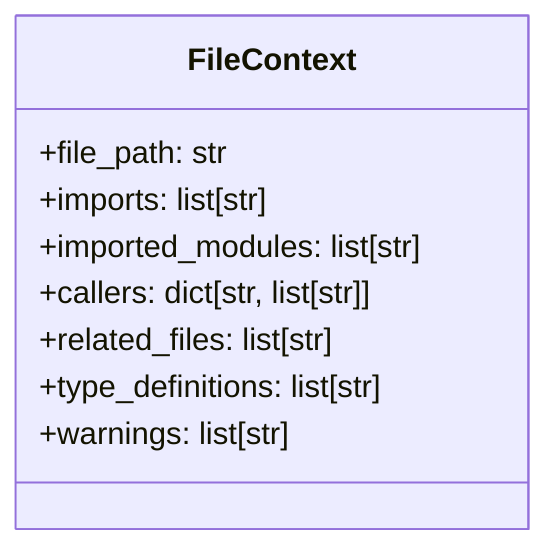
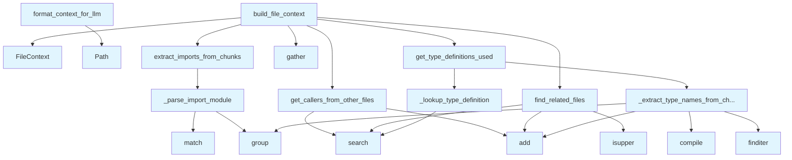

# File: `src/local_deepwiki/generators/context_builder.py`

## File Overview

This module is responsible for building rich contextual information for source files to assist in LLM-based documentation generation. It gathers and structures data about a file's dependencies, usage patterns, related files, and type definitions, enabling the language model to generate more accurate and contextually relevant documentation.

The module is designed to be used in a codebase analysis pipeline where code is chunked and indexed, allowing for semantic search and retrieval of related code elements. It integrates with vector stores to perform semantic searches and with callgraph analysis for identifying how functions and classes are used across the codebase.

## Key Concepts

### Contextual Information Assembly
The core idea is to create a `FileContext` object that encapsulates all relevant information about a source file. This includes:
- **Imports**: What external modules are used.
- **Callers**: Which other files call functions or classes defined in this file.
- **Related Files**: Files that are closely related based on import patterns or reverse dependencies.
- **Type Definitions**: Type hints used in the file that are defined elsewhere.

### Semantic Search Integration
This module heavily relies on vector stores to perform semantic searches for:
- Function and class usage (`get_callers_from_other_files`)
- Related module definitions (`find_related_files`)
- Type definition locations (`get_type_definitions_used`)

This approach allows for accurate identification of context even when exact string matches are not available, which is crucial for understanding complex codebases.

### Parallelization of Context Gathering
The `build_file_context` function uses `asyncio.gather` to run independent steps of context gathering in parallel:
- Finding callers
- Finding related files
- Looking up type definitions

This design choice improves performance by avoiding sequential execution, especially important when dealing with large repositories.

### Data Aggregation and Formatting
The module provides utility functions to extract and parse import statements, extract type names, and format the collected context into a human-readable string for use in LLM prompts. This ensures that the LLM receives well-structured, relevant information without noise.

## Integration

This file is a key component in the documentation generation pipeline, integrating with several other modules:

- **[Vector Store](../core/vectorstore/store.md) (`local_deepwiki.core.vectorstore`)**: Used for semantic search operations to find callers, related files, and type definitions.
- **Call Graph Analysis (`local_deepwiki.generators.analysis.callgraph`)**: Provides tools to extract and build reverse call graphs, although this module does not directly use them.
- **Logging (`local_deepwiki.logging`)**: Used for debug-level logging of search errors and partial failures.
- **Models (`local_deepwiki.models`)**: Uses [`CodeChunk`](../models/chunks.md) and [`ChunkType`](../models/foundation.md) to parse and categorize code elements.

The module is consumed by:
- `FileContext` class: Used by `tool_args` and `test_tools_v2` for providing context to tools.
- `build_file_context` function: Used by `test_context_builder_warnings` for testing context building logic.

This integration ensures that context building is a reusable and testable part of the documentation generation system, allowing for consistent and accurate information to be fed into LLM prompts.

## Design Notes

### Handling Partial Failures
The module is designed to gracefully handle partial failures during search operations. Warnings are collected in a shared list and attached to the `FileContext` object, allowing for error reporting without failing the entire context building process.

### Performance Optimization
By running independent context-gathering steps in parallel using `asyncio.gather`, the module minimizes the time spent in building file context. This is particularly important when processing large codebases where each search operation may be slow.

### Filtering and Trimming
Several filtering and trimming mechanisms are in place:
- Short entity names (less than 4 characters) are skipped during caller search to avoid false positives.
- Import statements are trimmed to a maximum of 15 to prevent overwhelming the LLM prompt.
- Lists of callers, related files, and type definitions are capped to reasonable limits to maintain prompt size and relevance.

### Type Definition Extraction
Type definitions are extracted using regex patterns to match type hints (both in parameter annotations and return types). The system only includes type names that are longer than 3 characters, filtering out common abbreviations or likely false positives.

### Import Parsing
The `_parse_import_module` function is designed to extract the top-level module name from import statements. This is crucial for finding related files, as it allows searching for the root package rather than a specific submodule, which may not be directly imported but is part of the same project.

## API Reference

### class `FileContext`

Rich context for a source file.

---


<details>
<summary>View Source (lines 31-42) | <a href="https://github.com/UrbanDiver/local-deepwiki-mcp/blob/main/src/local_deepwiki/generators/context_builder.py#L31-L42">GitHub</a></summary>

```python
class FileContext:
    """Rich context for a source file."""

    file_path: str
    imports: list[str] = field(default_factory=list)
    imported_modules: list[str] = field(default_factory=list)
    callers: dict[str, list[str]] = field(
        default_factory=dict
    )  # entity -> [caller files]
    related_files: list[str] = field(default_factory=list)
    type_definitions: list[str] = field(default_factory=list)  # Type hints used
    warnings: list[str] = field(default_factory=list)  # Partial failure notes
```

</details>

### Functions

#### `extract_imports_from_chunks`

```python
def extract_imports_from_chunks(chunks: list[CodeChunk]) -> tuple[list[str], list[str]]
```

Extract import statements and module names from code chunks.


| Parameter | Type | Default | Description |
|-----------|------|---------|-------------|
| `chunks` | `list[CodeChunk]` | - | List of code chunks for a file. |

**Returns:** `tuple[list[str], list[str]]`


<details>
<summary>View Source (lines 45-71) | <a href="https://github.com/UrbanDiver/local-deepwiki-mcp/blob/main/src/local_deepwiki/generators/context_builder.py#L45-L71">GitHub</a></summary>

```python
def extract_imports_from_chunks(chunks: list[CodeChunk]) -> tuple[list[str], list[str]]:
    """Extract import statements and module names from code chunks.

    Args:
        chunks: List of code chunks for a file.

    Returns:
        Tuple of (import_statements, module_names).
    """
    imports: list[str] = []
    modules: list[str] = []

    for chunk in chunks:
        if chunk.chunk_type == ChunkType.IMPORT:
            # Split import block into individual lines
            for line in chunk.content.split("\n"):
                line = line.strip()
                if not line or line.startswith("#"):
                    continue
                imports.append(line)

                # Extract module name
                module = _parse_import_module(line)
                if module and module not in modules:
                    modules.append(module)

    return imports, modules
```

</details>

#### `get_callers_from_other_files`

```python
async def get_callers_from_other_files(file_path: str, entity_names: list[str], repo_path: Path, vector_store: VectorStore, max_files: int = 10, warnings: list[str] | None = None) -> dict[str, list[str]]
```

Find which other files call entities defined in this file.


| Parameter | Type | Default | Description |
|-----------|------|---------|-------------|
| `file_path` | `str` | - | Path to the source file. |
| `entity_names` | `list[str]` | - | Names of functions/classes defined in the file. |
| `repo_path` | `Path` | - | Repository root path. |
| `vector_store` | `VectorStore` | - | Vector store for searching code. |
| `max_files` | `int` | `10` | Maximum number of caller files to return per entity. |
| `warnings` | `list[str] | None` | `None` | Optional list to collect warning messages for partial failures. |

**Returns:** `dict[str, list[str]]`


<details>
<summary>View Source (lines 99-158) | <a href="https://github.com/UrbanDiver/local-deepwiki-mcp/blob/main/src/local_deepwiki/generators/context_builder.py#L99-L158">GitHub</a></summary>

```python
async def get_callers_from_other_files(
    file_path: str,
    entity_names: list[str],
    repo_path: Path,
    vector_store: VectorStore,
    max_files: int = 10,
    warnings: list[str] | None = None,
) -> dict[str, list[str]]:
    """Find which other files call entities defined in this file.

    Args:
        file_path: Path to the source file.
        entity_names: Names of functions/classes defined in the file.
        repo_path: Repository root path.
        vector_store: Vector store for searching code.
        max_files: Maximum number of caller files to return per entity.
        warnings: Optional list to collect warning messages for partial failures.

    Returns:
        Mapping of entity name to list of calling file paths.
    """
    callers: dict[str, list[str]] = {}

    for entity_name in entity_names:
        if len(entity_name) < 4:  # Skip short names (likely false positives)
            continue

        # Search for uses of this entity
        try:
            results = await vector_store.search(
                f"{entity_name}(",  # Function call pattern
                limit=20,
            )

            caller_files: set[str] = set()
            for result in results:
                chunk = result.chunk
                # Skip the file that defines the entity
                if chunk.file_path == file_path:
                    continue
                # Skip if entity name not actually in the content
                if entity_name not in chunk.content:
                    continue
                caller_files.add(chunk.file_path)

                if len(caller_files) >= max_files:
                    break

            if caller_files:
                callers[entity_name] = sorted(caller_files)[:max_files]

        except (RuntimeError, OSError, ValueError, KeyError) as e:
            # RuntimeError: Vector search/LanceDB failures
            # OSError: Network/file system issues
            # ValueError/KeyError: Invalid data during search
            logger.debug("Error searching for callers of %s: %s", entity_name, e)
            if warnings is not None:
                warnings.append(f"Caller search failed for '{entity_name}': {e}")

    return callers
```

</details>

#### `find_related_files`

```python
async def find_related_files(file_path: str, imported_modules: list[str], vector_store: VectorStore, max_files: int = 5, warnings: list[str] | None = None) -> list[str]
```

Find files that are closely related to this one.  Related files are those that: - Are imported by this file (same package) - Import this file


| Parameter | Type | Default | Description |
|-----------|------|---------|-------------|
| `file_path` | `str` | - | Path to the source file. |
| `imported_modules` | `list[str]` | - | Modules imported by this file. |
| `vector_store` | `VectorStore` | - | Vector store for searching. |
| `max_files` | `int` | `5` | Maximum number of related files to return. |
| `warnings` | `list[str] | None` | `None` | Optional list to collect warning messages for partial failures. |

**Returns:** `list[str]`


<details>
<summary>View Source (lines 161-206) | <a href="https://github.com/UrbanDiver/local-deepwiki-mcp/blob/main/src/local_deepwiki/generators/context_builder.py#L161-L206">GitHub</a></summary>

```python
async def find_related_files(
    file_path: str,
    imported_modules: list[str],
    vector_store: VectorStore,
    max_files: int = 5,
    warnings: list[str] | None = None,
) -> list[str]:
    """Find files that are closely related to this one.

    Related files are those that:
    - Are imported by this file (same package)
    - Import this file

    Args:
        file_path: Path to the source file.
        imported_modules: Modules imported by this file.
        vector_store: Vector store for searching.
        max_files: Maximum number of related files to return.
        warnings: Optional list to collect warning messages for partial failures.

    Returns:
        List of related file paths.
    """
    related: set[str] = set()

    # Find files that this file imports (within same project)
    for module in imported_modules:
        try:
            results = await vector_store.search(
                f"def {module}" if not module[0].isupper() else f"class {module}",
                limit=5,
            )
            for result in results:
                if result.chunk.file_path != file_path:
                    related.add(result.chunk.file_path)
        except (RuntimeError, OSError, ValueError, KeyError) as e:
            # RuntimeError: Vector search/LanceDB failures
            # OSError: Network/file system issues
            # ValueError/KeyError: Invalid data during search
            logger.debug("Error searching for related module '%s': %s", module, e)
            if warnings is not None:
                warnings.append(
                    f"Related file search failed for module '{module}': {e}"
                )

    return sorted(related)[:max_files]
```

</details>

#### `get_type_definitions_used`

```python
async def get_type_definitions_used(chunks: list[CodeChunk], vector_store: VectorStore, max_types: int = 10, warnings: list[str] | None = None) -> list[str]
```

Extract type definitions used in the file that are defined elsewhere.


| Parameter | Type | Default | Description |
|-----------|------|---------|-------------|
| `chunks` | `list[CodeChunk]` | - | Code chunks for the file. |
| `vector_store` | `VectorStore` | - | Vector store for searching. |
| `max_types` | `int` | `10` | Maximum number of type definitions to return. |
| `warnings` | `list[str] | None` | `None` | Optional list to collect warning messages for partial failures. |

**Returns:** `list[str]`


<details>
<summary>View Source (lines 248-273) | <a href="https://github.com/UrbanDiver/local-deepwiki-mcp/blob/main/src/local_deepwiki/generators/context_builder.py#L248-L273">GitHub</a></summary>

```python
async def get_type_definitions_used(
    chunks: list[CodeChunk],
    vector_store: VectorStore,
    max_types: int = 10,
    warnings: list[str] | None = None,
) -> list[str]:
    """Extract type definitions used in the file that are defined elsewhere.

    Args:
        chunks: Code chunks for the file.
        vector_store: Vector store for searching.
        max_types: Maximum number of type definitions to return.
        warnings: Optional list to collect warning messages for partial failures.

    Returns:
        List of type definition snippets.
    """
    type_names = _extract_type_names_from_chunks(chunks)
    type_defs: list[str] = []

    for type_name in list(type_names)[:max_types]:
        definition = await _lookup_type_definition(type_name, vector_store, warnings)
        if definition:
            type_defs.append(definition)

    return type_defs
```

</details>

#### `build_file_context`

```python
async def build_file_context(file_path: str, chunks: list[CodeChunk], repo_path: Path, vector_store: VectorStore) -> FileContext
```

Build comprehensive context for a source file.


| Parameter | Type | Default | Description |
|-----------|------|---------|-------------|
| `file_path` | `str` | - | Path to the source file. |
| `chunks` | `list[CodeChunk]` | - | Code chunks for the file. |
| `repo_path` | `Path` | - | Repository root path. |
| `vector_store` | `VectorStore` | - | Vector store for searching. |

**Returns:** `FileContext`


<details>
<summary>View Source (lines 276-333) | <a href="https://github.com/UrbanDiver/local-deepwiki-mcp/blob/main/src/local_deepwiki/generators/context_builder.py#L276-L333">GitHub</a></summary>

```python
async def build_file_context(
    file_path: str,
    chunks: list[CodeChunk],
    repo_path: Path,
    vector_store: VectorStore,
) -> FileContext:
    """Build comprehensive context for a source file.

    Args:
        file_path: Path to the source file.
        chunks: Code chunks for the file.
        repo_path: Repository root path.
        vector_store: Vector store for searching.

    Returns:
        FileContext with all extracted information.
    """
    # Extract imports
    imports, imported_modules = extract_imports_from_chunks(chunks)

    # Get entity names for caller lookup
    entity_names = [
        chunk.name
        for chunk in chunks
        if chunk.name and chunk.chunk_type in (ChunkType.CLASS, ChunkType.FUNCTION)
    ]

    # Each coroutine may append warnings. This is safe in single-threaded asyncio
    # because list.append() is atomic and all coroutines share the same event loop thread.
    context_warnings: list[str] = []

    # Run independent context-gathering steps in parallel
    callers, related_files, type_definitions = await asyncio.gather(
        get_callers_from_other_files(
            file_path=file_path,
            entity_names=entity_names,
            repo_path=repo_path,
            vector_store=vector_store,
            warnings=context_warnings,
        ),
        find_related_files(
            file_path=file_path,
            imported_modules=imported_modules,
            vector_store=vector_store,
            warnings=context_warnings,
        ),
        get_type_definitions_used(chunks, vector_store, warnings=context_warnings),
    )

    return FileContext(
        file_path=file_path,
        imports=imports,
        imported_modules=imported_modules,
        callers=callers,
        related_files=related_files,
        type_definitions=type_definitions,
        warnings=context_warnings,
    )
```

</details>

#### `format_context_for_llm`

```python
def format_context_for_llm(context: FileContext, max_imports: int = 15) -> str
```

Format file context as text for the LLM prompt.


| Parameter | Type | Default | Description |
|-----------|------|---------|-------------|
| `context` | `FileContext` | - | The file context to format. |
| `max_imports` | `int` | `15` | Maximum number of imports to include. |

**Returns:** `str`


<details>
<summary>View Source (lines 336-393) | <a href="https://github.com/UrbanDiver/local-deepwiki-mcp/blob/main/src/local_deepwiki/generators/context_builder.py#L336-L393">GitHub</a></summary>

```python
def format_context_for_llm(context: FileContext, max_imports: int = 15) -> str:
    """Format file context as text for the LLM prompt.

    Args:
        context: The file context to format.
        max_imports: Maximum number of imports to include.

    Returns:
        Formatted context string.
    """
    parts: list[str] = []

    # Imports section
    if context.imports:
        parts.append("## Dependencies (Imports)")
        parts.append("This file imports from:")
        for imp in context.imports[:max_imports]:
            parts.append(f"  {imp}")
        if len(context.imports) > max_imports:
            parts.append(f"  ... and {len(context.imports) - max_imports} more")
        parts.append("")

    # Callers section (who uses this file)
    if context.callers:
        parts.append("## External Usage")
        parts.append("Functions/classes in this file are called from:")
        for entity, caller_files in list(context.callers.items())[:10]:
            files_str = ", ".join(Path(f).stem for f in caller_files[:3])
            if len(caller_files) > 3:
                files_str += f" +{len(caller_files) - 3} more"
            parts.append(f"  - `{entity}`: used by {files_str}")
        parts.append("")

    # Related files section
    if context.related_files:
        parts.append("## Related Files")
        parts.append("Closely related files in this project:")
        for f in context.related_files[:5]:
            parts.append(f"  - {f}")
        parts.append("")

    # Type definitions section
    if context.type_definitions:
        parts.append("## Type Definitions Used")
        parts.append("Key types referenced in this file:")
        for type_def in context.type_definitions[:8]:
            parts.append(f"  - {type_def}")
        parts.append("")

    # Generation notes section (partial failure warnings)
    if context.warnings:
        parts.append("## Generation Notes")
        parts.append("Some context could not be fully resolved:")
        for warning in context.warnings:
            parts.append(f"  - {warning}")
        parts.append("")

    return "\n".join(parts) if parts else ""
```

</details>

## Class Diagram


```mermaid
classDiagram
    class FileContext {
        +file_path: str
        +imports: list[str]
        +imported_modules: list[str]
        +callers: dict[str, list[str]]
        +related_files: list[str]
        +type_definitions: list[str]
        +warnings: list[str]
    }
```

## Call Graph


```mermaid
flowchart TD
    N0[FileContext]
    N1[Path]
    N2[_extract_type_names_from_ch...]
    N3[_lookup_type_definition]
    N4[_parse_import_module]
    N5[add]
    N6[build_file_context]
    N7[compile]
    N8[extract_imports_from_chunks]
    N9[find_related_files]
    N10[finditer]
    N11[format_context_for_llm]
    N12[gather]
    N13[get_callers_from_other_files]
    N14[get_type_definitions_used]
    N15[group]
    N16[isupper]
    N17[match]
    N18[search]
    N8 --> N4
    N4 --> N17
    N4 --> N15
    N13 --> N18
    N13 --> N5
    N9 --> N18
    N9 --> N16
    N9 --> N5
    N2 --> N7
    N2 --> N10
    N2 --> N15
    N2 --> N5
    N3 --> N18
    N14 --> N2
    N14 --> N3
    N6 --> N8
    N6 --> N12
    N6 --> N13
    N6 --> N9
    N6 --> N14
    N6 --> N0
    N11 --> N1
    classDef func fill:#e1f5fe
    class N0,N1,N2,N3,N4,N5,N6,N7,N8,N9,N10,N11,N12,N13,N14,N15,N16,N17,N18 func
```

## Used By

Functions and methods in this file and their callers:

- **`FileContext`**: called by `build_file_context`
- **`Path`**: called by `format_context_for_llm`
- **`_extract_type_names_from_chunks`**: called by `get_type_definitions_used`
- **`_lookup_type_definition`**: called by `get_type_definitions_used`
- **`_parse_import_module`**: called by `extract_imports_from_chunks`
- **`add`**: called by `_extract_type_names_from_chunks`, `find_related_files`, `get_callers_from_other_files`
- **`compile`**: called by `_extract_type_names_from_chunks`
- **`extract_imports_from_chunks`**: called by `build_file_context`
- **`find_related_files`**: called by `build_file_context`
- **`finditer`**: called by `_extract_type_names_from_chunks`
- **`gather`**: called by `build_file_context`
- **`get_callers_from_other_files`**: called by `build_file_context`
- **`get_type_definitions_used`**: called by `build_file_context`
- **`group`**: called by `_extract_type_names_from_chunks`, `_parse_import_module`
- **`isupper`**: called by `find_related_files`
- **`match`**: called by `_parse_import_module`
- **`search`**: called by `_lookup_type_definition`, `find_related_files`, `get_callers_from_other_files`

## Usage Examples

*Examples extracted from test files*

### Test extracting from 'from X import Y' statement

From `test_context_builder.py::TestExtractImportsFromChunks::test_extracts_from_import_statement`:

```python
chunk = make_chunk(
    chunk_type=ChunkType.IMPORT,
    content="from pathlib import Path\nfrom typing import List",
)

imports, modules = extract_imports_from_chunks([chunk])

assert len(imports) == 2
assert "from pathlib import Path" in imports
assert "from typing import List" in imports
assert "pathlib" in modules
assert "typing" in modules
```

### Test extracting from 'from X import Y' statement

From `test_context_builder.py::TestExtractImportsFromChunks::test_extracts_from_import_statement`:

```python
chunk = make_chunk(
    chunk_type=ChunkType.IMPORT,
    content="from pathlib import Path\nfrom typing import List",
)

imports, modules = extract_imports_from_chunks([chunk])

assert len(imports) == 2
assert "from pathlib import Path" in imports
assert "from typing import List" in imports
assert "pathlib" in modules
assert "typing" in modules
```

### Test extracting from 'import X' statement

From `test_context_builder.py::TestExtractImportsFromChunks::test_extracts_import_statement`:

```python
chunk = make_chunk(
    chunk_type=ChunkType.IMPORT,
    content="import os\nimport sys",
)

imports, modules = extract_imports_from_chunks([chunk])

assert len(imports) == 2
assert "import os" in imports
assert "os" in modules
assert "sys" in modules
```

### Test extracting from 'import X' statement

From `test_context_builder.py::TestExtractImportsFromChunks::test_extracts_import_statement`:

```python
chunk = make_chunk(
    chunk_type=ChunkType.IMPORT,
    content="import os\nimport sys",
)

imports, modules = extract_imports_from_chunks([chunk])

assert len(imports) == 2
assert "import os" in imports
assert "os" in modules
assert "sys" in modules
```

### Test formatting imports section

From `test_context_builder.py::TestFormatContextForLlm::test_formats_imports_section`:

```python
context = FileContext(
    file_path="src/test.py",
    imports=["from pathlib import Path", "import os"],
    imported_modules=["pathlib", "os"],
)

result = format_context_for_llm(context)

assert "Dependencies" in result
assert "from pathlib import Path" in result
```


## Last Modified

| Entity | Type | Author | Date | Commit |
|--------|------|--------|------|--------|
| `_extract_type_names_from_chunks` | function | Brian Breidenbach | 2 days ago | `8b8f36f` refactor: decompose CC > 15... |
| `_lookup_type_definition` | function | Brian Breidenbach | 2 days ago | `8b8f36f` refactor: decompose CC > 15... |
| `get_type_definitions_used` | function | Brian Breidenbach | 2 days ago | `8b8f36f` refactor: decompose CC > 15... |
| `build_file_context` | function | Brian Breidenbach | Feb 14, 2026 | `45d649a` feat: lazy wiki generation ... |
| `get_callers_from_other_files` | function | Brian Breidenbach | Feb 11, 2026 | `ba96da1` fix: publication plan P0-P2... |
| `find_related_files` | function | Brian Breidenbach | Feb 11, 2026 | `ba96da1` fix: publication plan P0-P2... |
| `FileContext` | class | Brian Breidenbach | Feb 10, 2026 | `c619bd3` fix: add VectorStore close(... |
| `format_context_for_llm` | function | Brian Breidenbach | Feb 10, 2026 | `c619bd3` fix: add VectorStore close(... |
| `extract_imports_from_chunks` | function | Brian Breidenbach | Jan 16, 2026 | `8ac0de1` Add richer LLM context for ... |
| `_parse_import_module` | function | Brian Breidenbach | Jan 16, 2026 | `8ac0de1` Add richer LLM context for ... |

## Additional Source Code

Source code for functions and methods not listed in the API Reference above.

#### `_parse_import_module`

<details>
<summary>View Source (lines 74-96) | <a href="https://github.com/UrbanDiver/local-deepwiki-mcp/blob/main/src/local_deepwiki/generators/context_builder.py#L74-L96">GitHub</a></summary>

```python
def _parse_import_module(import_line: str) -> str | None:
    """Parse an import line to extract the module name.

    Args:
        import_line: An import statement like "from foo import bar" or "import baz".

    Returns:
        The top-level module name, or None if parsing fails.
    """
    # Handle "from X import Y"
    from_match = re.match(r"from\s+([\w.]+)\s+import", import_line)
    if from_match:
        module = from_match.group(1)
        # Return top-level module
        return module.split(".")[0]

    # Handle "import X"
    import_match = re.match(r"import\s+([\w.]+)", import_line)
    if import_match:
        module = import_match.group(1)
        return module.split(".")[0]

    return None
```

</details>


#### `_extract_type_names_from_chunks`

<details>
<summary>View Source (lines 209-225) | <a href="https://github.com/UrbanDiver/local-deepwiki-mcp/blob/main/src/local_deepwiki/generators/context_builder.py#L209-L225">GitHub</a></summary>

```python
def _extract_type_names_from_chunks(chunks: list[CodeChunk]) -> set[str]:
    """Collect all uppercase type names referenced in chunk content."""
    type_names: set[str] = set()
    type_pattern = re.compile(r":\s*([A-Z][a-zA-Z0-9_]+)")
    return_pattern = re.compile(r"->\s*([A-Z][a-zA-Z0-9_]+)")

    for chunk in chunks:
        for match in type_pattern.finditer(chunk.content):
            type_name = match.group(1)
            if len(type_name) > 3:
                type_names.add(type_name)
        for match in return_pattern.finditer(chunk.content):
            type_name = match.group(1)
            if len(type_name) > 3:
                type_names.add(type_name)

    return type_names
```

</details>


#### `_lookup_type_definition`

<details>
<summary>View Source (lines 228-245) | <a href="https://github.com/UrbanDiver/local-deepwiki-mcp/blob/main/src/local_deepwiki/generators/context_builder.py#L228-L245">GitHub</a></summary>

```python
async def _lookup_type_definition(
    type_name: str,
    vector_store: VectorStore,
    warnings: list[str] | None,
) -> str | None:
    """Search for the class definition of *type_name* and return a summary line."""
    try:
        results = await vector_store.search(f"class {type_name}", limit=3)
        for result in results:
            if result.chunk.chunk_type == ChunkType.CLASS:
                first_line = result.chunk.content.split("\n")[0]
                if type_name in first_line:
                    return f"{type_name}: {first_line}"
    except (RuntimeError, OSError, ValueError, KeyError) as e:
        logger.debug("Error searching for type definition '%s': %s", type_name, e)
        if warnings is not None:
            warnings.append(f"Type definition search failed for '{type_name}': {e}")
    return None
```

</details>

## Relevant Source Files

- `src/local_deepwiki/generators/context_builder.py:31-42`
