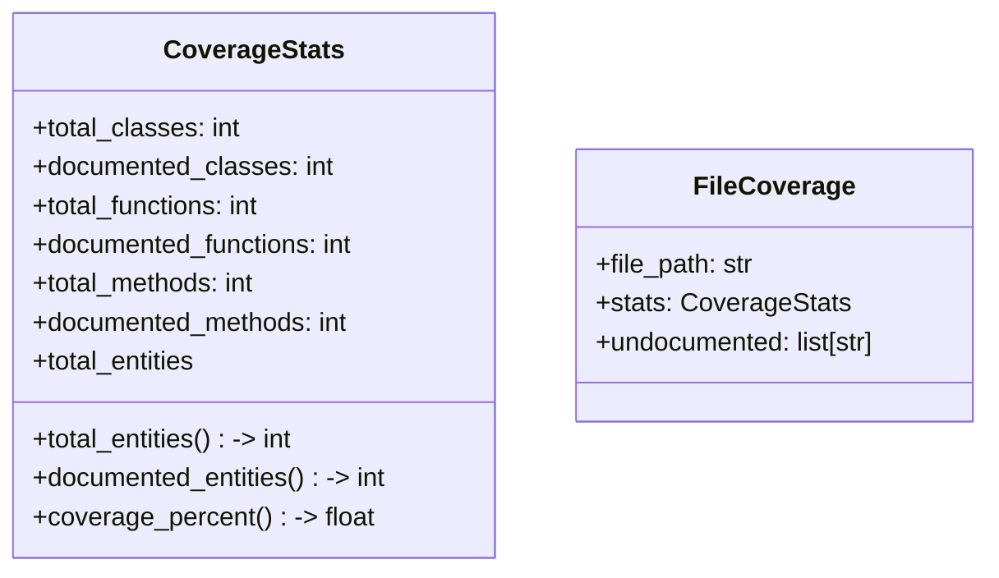
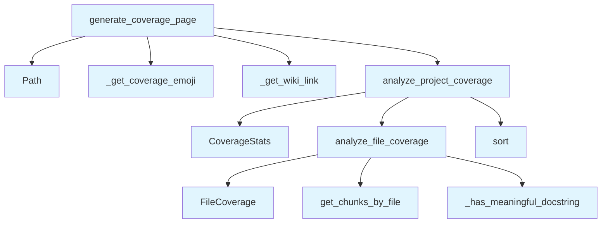

# Coverage Analysis Module

## File Overview

The `coverage.py` module provides functionality for analyzing documentation coverage across a codebase. It evaluates how well different files and components are documented by examining docstrings and generating coverage statistics and reports.

## Classes

### CoverageStats

A dataclass that stores coverage statistics for documentation analysis.

**Fields:**
- Contains statistical data about documentation coverage (specific fields not visible in the provided code)

### FileCoverage

A dataclass that represents coverage information for individual files.

**Fields:**
- Contains file-specific coverage data (specific fields not visible in the provided code)

## Functions

### _has_meaningful_docstring

A private helper function that determines whether a docstring provides meaningful documentation.

**Parameters:**
- Takes parameters to evaluate docstring quality (specific parameters not visible in the provided code)

**Returns:**
- Boolean indicating whether the docstring is considered meaningful

### analyze_file_coverage

Analyzes the documentation coverage for a single file.

**Parameters:**
- Takes parameters related to file analysis (specific parameters not visible in the provided code)

**Returns:**
- Returns coverage analysis results for the specified file

### analyze_project_coverage

Performs documentation coverage analysis across an entire project.

**Parameters:**
- Takes parameters for project-wide analysis (specific parameters not visible in the provided code)

**Returns:**
- Returns comprehensive coverage statistics for the project

### _get_coverage_emoji

A private helper function that returns an emoji representation based on coverage levels.

**Parameters:**
- Takes coverage-related parameters (specific parameters not visible in the provided code)

**Returns:**
- String containing an appropriate emoji for the coverage level

### _get_wiki_link

A private helper function that generates wiki-style links for documentation.

**Parameters:**
- Takes parameters for link generation (specific parameters not visible in the provided code)

**Returns:**
- String containing a formatted wiki link

### generate_coverage_page

Generates a complete coverage report page with statistics and analysis.

**Parameters:**
- Takes parameters for page generation (specific parameters not visible in the provided code)

**Returns:**
- Returns a formatted coverage report page

## Related Components

This module integrates with several other components:

- **[VectorStore](../core/vectorstore.md)**: Used from `local_deepwiki.core.vectorstore` for data storage and retrieval operations
- **[ChunkType](../models.md)**: Imported from `local_deepwiki.models` for handling different types of code chunks
- **[IndexStatus](../models.md)**: Imported from `local_deepwiki.models` for tracking indexing status
- **Path**: Uses `pathlib.Path` for file system operations

The module appears to be part of a larger documentation generation system that analyzes code coverage and creates comprehensive reports about documentation quality across a codebase.

## API Reference

### class `CoverageStats`

Documentation coverage statistics.

**Methods:**


<details>
<summary>View Source (lines 11-36) | <a href="https://github.com/UrbanDiver/local-deepwiki-mcp/blob/feature/better-search/src/local_deepwiki/generators/coverage.py#L11-L36">GitHub</a></summary>

```python
class CoverageStats:
    """Documentation coverage statistics."""

    total_classes: int = 0
    documented_classes: int = 0
    total_functions: int = 0
    documented_functions: int = 0
    total_methods: int = 0
    documented_methods: int = 0

    @property
    def total_entities(self) -> int:
        """Total number of documentable entities."""
        return self.total_classes + self.total_functions + self.total_methods

    @property
    def documented_entities(self) -> int:
        """Total number of documented entities."""
        return self.documented_classes + self.documented_functions + self.documented_methods

    @property
    def coverage_percent(self) -> float:
        """Overall documentation coverage percentage."""
        if self.total_entities == 0:
            return 100.0
        return (self.documented_entities / self.total_entities) * 100
```

</details>

#### `total_entities`

```python
def total_entities() -> int
```

Total number of documentable entities.


<details>
<summary>View Source (lines 11-36) | <a href="https://github.com/UrbanDiver/local-deepwiki-mcp/blob/feature/better-search/src/local_deepwiki/generators/coverage.py#L11-L36">GitHub</a></summary>

```python
class CoverageStats:
    """Documentation coverage statistics."""

    total_classes: int = 0
    documented_classes: int = 0
    total_functions: int = 0
    documented_functions: int = 0
    total_methods: int = 0
    documented_methods: int = 0

    @property
    def total_entities(self) -> int:
        """Total number of documentable entities."""
        return self.total_classes + self.total_functions + self.total_methods

    @property
    def documented_entities(self) -> int:
        """Total number of documented entities."""
        return self.documented_classes + self.documented_functions + self.documented_methods

    @property
    def coverage_percent(self) -> float:
        """Overall documentation coverage percentage."""
        if self.total_entities == 0:
            return 100.0
        return (self.documented_entities / self.total_entities) * 100
```

</details>

#### `documented_entities`

```python
def documented_entities() -> int
```

Total number of documented entities.


<details>
<summary>View Source (lines 11-36) | <a href="https://github.com/UrbanDiver/local-deepwiki-mcp/blob/feature/better-search/src/local_deepwiki/generators/coverage.py#L11-L36">GitHub</a></summary>

```python
class CoverageStats:
    """Documentation coverage statistics."""

    total_classes: int = 0
    documented_classes: int = 0
    total_functions: int = 0
    documented_functions: int = 0
    total_methods: int = 0
    documented_methods: int = 0

    @property
    def total_entities(self) -> int:
        """Total number of documentable entities."""
        return self.total_classes + self.total_functions + self.total_methods

    @property
    def documented_entities(self) -> int:
        """Total number of documented entities."""
        return self.documented_classes + self.documented_functions + self.documented_methods

    @property
    def coverage_percent(self) -> float:
        """Overall documentation coverage percentage."""
        if self.total_entities == 0:
            return 100.0
        return (self.documented_entities / self.total_entities) * 100
```

</details>

#### `coverage_percent`

```python
def coverage_percent() -> float
```

Overall documentation coverage percentage.


<details>
<summary>View Source (lines 11-36) | <a href="https://github.com/UrbanDiver/local-deepwiki-mcp/blob/feature/better-search/src/local_deepwiki/generators/coverage.py#L11-L36">GitHub</a></summary>

```python
class CoverageStats:
    """Documentation coverage statistics."""

    total_classes: int = 0
    documented_classes: int = 0
    total_functions: int = 0
    documented_functions: int = 0
    total_methods: int = 0
    documented_methods: int = 0

    @property
    def total_entities(self) -> int:
        """Total number of documentable entities."""
        return self.total_classes + self.total_functions + self.total_methods

    @property
    def documented_entities(self) -> int:
        """Total number of documented entities."""
        return self.documented_classes + self.documented_functions + self.documented_methods

    @property
    def coverage_percent(self) -> float:
        """Overall documentation coverage percentage."""
        if self.total_entities == 0:
            return 100.0
        return (self.documented_entities / self.total_entities) * 100
```

</details>

### class `FileCoverage`

Coverage statistics for a single file.

---


<details>
<summary>View Source (lines 40-45) | <a href="https://github.com/UrbanDiver/local-deepwiki-mcp/blob/feature/better-search/src/local_deepwiki/generators/coverage.py#L40-L45">GitHub</a></summary>

```python
class FileCoverage:
    """Coverage statistics for a single file."""

    file_path: str
    stats: CoverageStats = field(default_factory=CoverageStats)
    undocumented: list[str] = field(default_factory=list)  # List of undocumented entity names
```

</details>

### Functions

#### `analyze_file_coverage`

```python
async def analyze_file_coverage(file_path: str, vector_store: VectorStore) -> FileCoverage
```

Analyze documentation coverage for a single file.


| [Parameter](api_docs.md) | Type | Default | Description |
|-----------|------|---------|-------------|
| `file_path` | `str` | - | Path to the source file. |
| `vector_store` | [`VectorStore`](../core/vectorstore.md) | - | Vector store with code chunks. |

**Returns:** `FileCoverage`


<details>
<summary>View Source (lines 73-115) | <a href="https://github.com/UrbanDiver/local-deepwiki-mcp/blob/feature/better-search/src/local_deepwiki/generators/coverage.py#L73-L115">GitHub</a></summary>

```python
async def analyze_file_coverage(
    file_path: str,
    vector_store: VectorStore,
) -> FileCoverage:
    """Analyze documentation coverage for a single file.

    Args:
        file_path: Path to the source file.
        vector_store: Vector store with code chunks.

    Returns:
        FileCoverage object with statistics.
    """
    coverage = FileCoverage(file_path=file_path)
    chunks = await vector_store.get_chunks_by_file(file_path)

    for chunk in chunks:
        name = chunk.name or "Unknown"
        has_doc = _has_meaningful_docstring(chunk.docstring)

        if chunk.chunk_type == ChunkType.CLASS:
            coverage.stats.total_classes += 1
            if has_doc:
                coverage.stats.documented_classes += 1
            else:
                coverage.undocumented.append(f"class {name}")

        elif chunk.chunk_type == ChunkType.FUNCTION:
            coverage.stats.total_functions += 1
            if has_doc:
                coverage.stats.documented_functions += 1
            else:
                coverage.undocumented.append(f"function {name}")

        elif chunk.chunk_type == ChunkType.METHOD:
            coverage.stats.total_methods += 1
            if has_doc:
                coverage.stats.documented_methods += 1
            else:
                parent = chunk.parent_name or "Unknown"
                coverage.undocumented.append(f"method {parent}.{name}")

    return coverage
```

</details>

#### `analyze_project_coverage`

```python
async def analyze_project_coverage(index_status: IndexStatus, vector_store: VectorStore) -> tuple[CoverageStats, list[FileCoverage]]
```

Analyze documentation coverage for the entire project.


| [Parameter](api_docs.md) | Type | Default | Description |
|-----------|------|---------|-------------|
| `index_status` | [`IndexStatus`](../models.md) | - | Index status with file information. |
| `vector_store` | [`VectorStore`](../core/vectorstore.md) | - | Vector store with code chunks. |

**Returns:** `tuple[CoverageStats, list[FileCoverage]]`


<details>
<summary>View Source (lines 118-149) | <a href="https://github.com/UrbanDiver/local-deepwiki-mcp/blob/feature/better-search/src/local_deepwiki/generators/coverage.py#L118-L149">GitHub</a></summary>

```python
async def analyze_project_coverage(
    index_status: IndexStatus,
    vector_store: VectorStore,
) -> tuple[CoverageStats, list[FileCoverage]]:
    """Analyze documentation coverage for the entire project.

    Args:
        index_status: Index status with file information.
        vector_store: Vector store with code chunks.

    Returns:
        Tuple of (overall stats, list of per-file coverage).
    """
    overall = CoverageStats()
    file_coverages: list[FileCoverage] = []

    for file_info in index_status.files:
        file_coverage = await analyze_file_coverage(file_info.path, vector_store)
        file_coverages.append(file_coverage)

        # Aggregate stats
        overall.total_classes += file_coverage.stats.total_classes
        overall.documented_classes += file_coverage.stats.documented_classes
        overall.total_functions += file_coverage.stats.total_functions
        overall.documented_functions += file_coverage.stats.documented_functions
        overall.total_methods += file_coverage.stats.total_methods
        overall.documented_methods += file_coverage.stats.documented_methods

    # Sort by coverage (lowest first)
    file_coverages.sort(key=lambda f: f.stats.coverage_percent)

    return overall, file_coverages
```

</details>

#### `generate_coverage_page`

```python
async def generate_coverage_page(index_status: IndexStatus, vector_store: VectorStore) -> str | None
```

Generate the documentation coverage report page.


| [Parameter](api_docs.md) | Type | Default | Description |
|-----------|------|---------|-------------|
| `index_status` | [`IndexStatus`](../models.md) | - | Index status with file information. |
| `vector_store` | [`VectorStore`](../core/vectorstore.md) | - | Vector store with code chunks. |

**Returns:** `str | None`


<details>
<summary>View Source (lines 177-290) | <a href="https://github.com/UrbanDiver/local-deepwiki-mcp/blob/feature/better-search/src/local_deepwiki/generators/coverage.py#L177-L290">GitHub</a></summary>

```python
async def generate_coverage_page(
    index_status: IndexStatus,
    vector_store: VectorStore,
) -> str | None:
    """Generate the documentation coverage report page.

    Args:
        index_status: Index status with file information.
        vector_store: Vector store with code chunks.

    Returns:
        Markdown content for the coverage page, or None if no entities found.
    """
    overall, file_coverages = await analyze_project_coverage(index_status, vector_store)

    if overall.total_entities == 0:
        return None

    lines = [
        "# Documentation Coverage",
        "",
        "This report shows the documentation coverage for the codebase.",
        "",
    ]

    # Overall summary
    emoji = _get_coverage_emoji(overall.coverage_percent)
    lines.append("## Summary")
    lines.append("")
    lines.append(f"{emoji} **Overall Coverage: {overall.coverage_percent:.1f}%**")
    lines.append("")
    lines.append(f"- **{overall.documented_entities}** / **{overall.total_entities}** entities documented")
    lines.append("")

    # Breakdown by type
    lines.append("### By Type")
    lines.append("")
    lines.append("| Type | Documented | Total | Coverage |")
    lines.append("|------|------------|-------|----------|")

    if overall.total_classes > 0:
        class_pct = (overall.documented_classes / overall.total_classes) * 100
        lines.append(
            f"| Classes | {overall.documented_classes} | {overall.total_classes} | {class_pct:.1f}% |"
        )

    if overall.total_functions > 0:
        func_pct = (overall.documented_functions / overall.total_functions) * 100
        lines.append(
            f"| Functions | {overall.documented_functions} | {overall.total_functions} | {func_pct:.1f}% |"
        )

    if overall.total_methods > 0:
        method_pct = (overall.documented_methods / overall.total_methods) * 100
        lines.append(
            f"| Methods | {overall.documented_methods} | {overall.total_methods} | {method_pct:.1f}% |"
        )

    lines.append("")

    # Coverage by file
    lines.append("## Coverage by File")
    lines.append("")
    lines.append("| File | Documented | Total | Coverage |")
    lines.append("|------|------------|-------|----------|")

    for fc in file_coverages:
        if fc.stats.total_entities == 0:
            continue

        emoji = _get_coverage_emoji(fc.stats.coverage_percent)
        file_name = Path(fc.file_path).name
        wiki_link = _get_wiki_link(fc.file_path)

        lines.append(
            f"| {emoji} [{file_name}]({wiki_link}) | "
            f"{fc.stats.documented_entities} | {fc.stats.total_entities} | "
            f"{fc.stats.coverage_percent:.1f}% |"
        )

    lines.append("")

    # Files needing attention (lowest coverage)
    low_coverage_files = [fc for fc in file_coverages if fc.stats.coverage_percent < 50 and fc.stats.total_entities > 0]

    if low_coverage_files:
        lines.append("## Files Needing Attention")
        lines.append("")
        lines.append("Files with less than 50% documentation coverage:")
        lines.append("")

        for fc in low_coverage_files[:10]:  # Top 10 worst
            file_name = Path(fc.file_path).name
            wiki_link = _get_wiki_link(fc.file_path)
            lines.append(f"### [{file_name}]({wiki_link})")
            lines.append("")
            lines.append(f"Coverage: {fc.stats.coverage_percent:.1f}%")
            lines.append("")

            if fc.undocumented:
                lines.append("Undocumented:")
                for item in fc.undocumented[:20]:  # Limit to 20
                    lines.append(f"- `{item}`")
                if len(fc.undocumented) > 20:
                    lines.append(f"- ... and {len(fc.undocumented) - 20} more")
            lines.append("")

    # Legend
    lines.append("---")
    lines.append("")
    lines.append("**Legend:** 🟢 ≥90% | 🟡 ≥70% | 🟠 ≥50% | 🔴 <50%")
    lines.append("")

    return "\n".join(lines)
```

</details>

## Class Diagram



## Call Graph



## Used By

Functions and methods in this file and their callers:

- **`CoverageStats`**: called by `analyze_project_coverage`
- **`FileCoverage`**: called by `analyze_file_coverage`
- **`Path`**: called by `generate_coverage_page`
- **`_get_coverage_emoji`**: called by `generate_coverage_page`
- **`_get_wiki_link`**: called by `generate_coverage_page`
- **`_has_meaningful_docstring`**: called by `analyze_file_coverage`
- **`analyze_file_coverage`**: called by `analyze_project_coverage`
- **`analyze_project_coverage`**: called by `generate_coverage_page`
- **`get_chunks_by_file`**: called by `analyze_file_coverage`
- **`sort`**: called by `analyze_project_coverage`

## Usage Examples

*Examples extracted from test files*

### Test total_entities property

From `test_coverage.py::test_total_entities`:

```python
stats = CoverageStats(
    total_classes=5,
    total_functions=10,
    total_methods=15,
)
assert stats.total_entities == 30
```

### Test documented_entities property

From `test_coverage.py::test_documented_entities`:

```python
stats = CoverageStats(
    documented_classes=3,
    documented_functions=8,
    documented_methods=12,
)
assert stats.documented_entities == 23
```

### Test coverage_percent property

From `test_coverage.py::test_coverage_percent`:

```python
assert 66.6 < stats.coverage_percent < 66.7
```

### Test coverage_percent with no entities

From `test_coverage.py::test_coverage_percent_empty`:

```python
assert stats.coverage_percent == 100.0
```

### Test creating FileCoverage with defaults

From `test_coverage.py::test_creates_with_defaults`:

```python
fc = FileCoverage(file_path="test.py")
assert fc.file_path == "test.py"
```


## Additional Source Code

Source code for functions and methods not listed in the API Reference above.

#### `_has_meaningful_docstring`

<details>
<summary>View Source (lines 48-70) | <a href="https://github.com/UrbanDiver/local-deepwiki-mcp/blob/feature/better-search/src/local_deepwiki/generators/coverage.py#L48-L70">GitHub</a></summary>

```python
def _has_meaningful_docstring(docstring: str | None) -> bool:
    """Check if a docstring is meaningful (not empty or trivial).

    Args:
        docstring: The docstring to check.

    Returns:
        True if the docstring is meaningful.
    """
    if not docstring:
        return False

    # Strip and check for minimal content
    cleaned = docstring.strip()
    if len(cleaned) < 10:  # Too short to be meaningful
        return False

    # Check for placeholder docstrings
    placeholders = ["todo", "fixme", "xxx", "pass", "..."]
    if cleaned.lower() in placeholders:
        return False

    return True
```

</details>


#### `_get_coverage_emoji`

<details>
<summary>View Source (lines 152-168) | <a href="https://github.com/UrbanDiver/local-deepwiki-mcp/blob/feature/better-search/src/local_deepwiki/generators/coverage.py#L152-L168">GitHub</a></summary>

```python
def _get_coverage_emoji(percent: float) -> str:
    """Get an emoji indicator for coverage level.

    Args:
        percent: Coverage percentage.

    Returns:
        Emoji string.
    """
    if percent >= 90:
        return "🟢"
    elif percent >= 70:
        return "🟡"
    elif percent >= 50:
        return "🟠"
    else:
        return "🔴"
```

</details>


#### `_get_wiki_link`

<details>
<summary>View Source (lines 171-174) | <a href="https://github.com/UrbanDiver/local-deepwiki-mcp/blob/feature/better-search/src/local_deepwiki/generators/coverage.py#L171-L174">GitHub</a></summary>

```python
def _get_wiki_link(file_path: str) -> str:
    """Convert a source file path to a wiki link."""
    wiki_path = file_path.replace(".py", ".md")
    return f"files/{wiki_path}"
```

</details>

## Relevant Source Files

- `src/local_deepwiki/generators/coverage.py:11-36`

## See Also

- [wiki](wiki.md) - uses this
- [models](../models.md) - dependency
- [vectorstore](../core/vectorstore.md) - dependency
- [glossary](glossary.md) - shares 4 dependencies
- [inheritance](inheritance.md) - shares 4 dependencies
