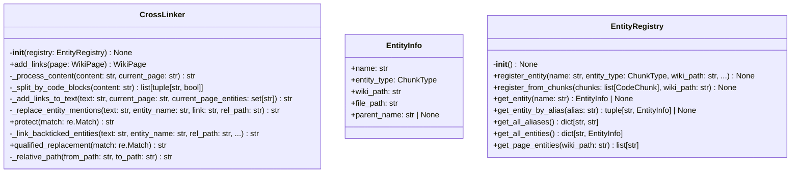

# CrossLinks Module

## File Overview

The crosslinks module provides functionality for automatically adding cross-links between wiki pages. It identifies entity mentions in markdown content and converts them to clickable links that reference other pages in the wiki.

## Classes

### EntityInfo

A data class that stores information about documented entities.

### EntityRegistry

A registry that manages and provides access to documented entities for cross-linking purposes.

### CrossLinker

The [main](../export/html.md) class responsible for processing wiki pages and adding cross-links to entity mentions.

#### Key Methods

##### `__init__`
Initializes the CrossLinker with an entity registry.

##### `add_links`
```python
def add_links(self, page: WikiPage) -> WikiPage:
```

Processes a wiki page and returns a new [WikiPage](../models.md) instance with cross-links added to the content.

**Parameters:**
- `page`: The [WikiPage](../models.md) to process

**Returns:**
- A new [WikiPage](../models.md) with cross-links added

##### `_process_content`
Internal method that handles the actual content processing for cross-link insertion.

##### `_split_by_code_blocks`
Internal method for handling code block boundaries during link processing.

##### `_add_links_to_text`
Internal method that adds links to text content outside of code blocks.

##### `_replace_entity_mentions`
Internal method that replaces entity mentions with markdown links.

##### `protect`
Internal method for protecting certain text patterns during processing.

##### `_link_backticked_entities`
```python
def _link_backticked_entities(
    self,
    text: str,
    entity_name: str,
    rel_path: str,
    protect: Callable[[re.Match[str]], str],
) -> str:
```

Converts backticked entity names to markdown links. Handles various formats:
- `EntityName` → [`EntityName`](path)
- `module.EntityName` → [`EntityName`](path)  
- `module.submodule.EntityName` → [`EntityName`](path)

**Parameters:**
- `text`: The text content to process
- `entity_name`: The entity name to [find](manifest.md) and link
- `rel_path`: The relative path to the entity's wiki page
- `protect`: Function for protecting certain patterns

**Returns:**
- Text with backticked entities converted to links

##### `qualified_replacement`
Internal method for handling qualified entity name replacements.

##### `_relative_path`
```python
def _relative_path(self, from_path: str, to_path: str) -> str:
```

Calculates the relative path between two wiki pages.

**Parameters:**
- `from_path`: Path of the source page (e.g., "modules/src.md")
- `to_path`: Path of the target page (e.g., "files/src/indexer.md")

**Returns:**
- Relative path from source to target

## Functions

### `camel_to_spaced`
Utility function for converting camelCase names to spaced format.

### `add_cross_links`
```python
def add_cross_links(
    pages: list[WikiPage],
    registry: EntityRegistry,
) -> list[WikiPage]:
```

Processes a list of wiki pages and adds cross-links to all of them.

**Parameters:**
- `pages`: List of [WikiPage](../models.md) objects to process
- `registry`: EntityRegistry containing documented entities

**Returns:**
- List of [WikiPage](../models.md) objects with cross-links added

## Usage Examples

### Processing a Single Page

```python
# Create a CrossLinker with an entity registry
linker = CrossLinker(registry)

# Add cross-links to a page
linked_page = linker.add_links(original_page)
```

### Processing Multiple Pages

```python
# Process all pages at once
linked_pages = add_cross_links(pages, registry)
```

## Related Components

This module works with:

- **[WikiPage](../models.md)**: The data model representing individual wiki pages
- **[CodeChunk](../models.md)**: Referenced for handling code content
- **[ChunkType](../models.md)**: Used for identifying different types of content chunks

The module uses the `re` module for regular expression processing and `pathlib.Path` for path manipulation.

## API Reference

### class `EntityInfo`

Information about a documented entity.

### class `EntityRegistry`

Registry of documented entities and their wiki page locations.  This class maintains a mapping of entity names (classes, functions, etc.) to their documentation page paths, enabling cross-linking between pages.

**Methods:**

#### `__init__`

```python
def __init__() -> None
```

Initialize an empty entity registry.

#### `register_entity`

```python
def register_entity(name: str, entity_type: ChunkType, wiki_path: str, file_path: str, parent_name: str | None = None) -> None
```

Register a documented entity.


| [Parameter](api_docs.md) | Type | Default | Description |
|-----------|------|---------|-------------|
| `name` | `str` | - | The entity name (e.g., "[WikiGenerator](wiki.md)"). |
| `entity_type` | [`ChunkType`](../models.md) | - | The type of entity (class, function, etc.). |
| `wiki_path` | `str` | - | Path to the wiki page documenting this entity. |
| `file_path` | `str` | - | Path to the source file containing this entity. |
| `parent_name` | `str | None` | `None` | Parent entity name (e.g., class name for methods). |

#### `register_from_chunks`

```python
def register_from_chunks(chunks: list[CodeChunk], wiki_path: str) -> None
```

Register entities from a list of code chunks.


| [Parameter](api_docs.md) | Type | Default | Description |
|-----------|------|---------|-------------|
| `chunks` | `list[CodeChunk]` | - | List of code chunks from a file. |
| `wiki_path` | `str` | - | Path to the wiki page for these chunks. |

#### `get_entity`

```python
def get_entity(name: str) -> EntityInfo | None
```

Get entity info by name.


| [Parameter](api_docs.md) | Type | Default | Description |
|-----------|------|---------|-------------|
| `name` | `str` | - | The entity name to look up. |

#### `get_entity_by_alias`

```python
def get_entity_by_alias(alias: str) -> tuple[str, EntityInfo] | None
```

Get entity info by alias (spaced name).


| [Parameter](api_docs.md) | Type | Default | Description |
|-----------|------|---------|-------------|
| `alias` | `str` | - | The spaced alias to look up (e.g., "[Vector Store](../core/vectorstore.md)"). |

#### `get_all_aliases`

```python
def get_all_aliases() -> dict[str, str]
```

Get all registered aliases.

#### `get_all_entities`

```python
def get_all_entities() -> dict[str, EntityInfo]
```

Get all registered entities.

#### `get_page_entities`

```python
def get_page_entities(wiki_path: str) -> list[str]
```

Get all entities defined in a specific wiki page.


| [Parameter](api_docs.md) | Type | Default | Description |
|-----------|------|---------|-------------|
| `wiki_path` | `str` | - | The wiki page path. |


### class `CrossLinker`

Adds cross-links to wiki page content.  This class processes wiki page content and replaces mentions of documented entities with markdown links to their documentation pages.

**Methods:**

#### `__init__`

```python
def __init__(registry: EntityRegistry) -> None
```

Initialize the cross-linker.


| [Parameter](api_docs.md) | Type | Default | Description |
|-----------|------|---------|-------------|
| `registry` | `EntityRegistry` | - | The entity registry to use for lookups. |

#### `add_links`

```python
def add_links(page: WikiPage) -> WikiPage
```

Add cross-links to a wiki page.


| [Parameter](api_docs.md) | Type | Default | Description |
|-----------|------|---------|-------------|
| `page` | [`WikiPage`](../models.md) | - | The wiki page to process. |

#### `protect`

```python
def protect(match: re.Match) -> str
```


| [Parameter](api_docs.md) | Type | Default | Description |
|-----------|------|---------|-------------|
| `match` | `re.Match` | - | - |

#### `qualified_replacement`

```python
def qualified_replacement(match: re.Match) -> str
```


| [Parameter](api_docs.md) | Type | Default | Description |
|-----------|------|---------|-------------|
| `match` | `re.Match` | - | - |


---

### Functions

#### `camel_to_spaced`

```python
def camel_to_spaced(name: str) -> str | None
```

Convert CamelCase to 'Spaced Words'.


| [Parameter](api_docs.md) | Type | Default | Description |
|-----------|------|---------|-------------|
| `name` | `str` | - | The CamelCase name. |

**Returns:** `str | None`


#### `add_cross_links`

```python
def add_cross_links(pages: list[WikiPage], registry: EntityRegistry) -> list[WikiPage]
```

Add cross-links to all wiki pages.


| [Parameter](api_docs.md) | Type | Default | Description |
|-----------|------|---------|-------------|
| `pages` | `list[WikiPage]` | - | List of wiki pages to process. |
| `registry` | `EntityRegistry` | - | Entity registry with documented entities. |

**Returns:** `list[WikiPage]`


## Class Diagram



## Call Graph

```mermaid
flowchart TD
    N0[CrossLinker]
    N1[CrossLinker._add_links_to_text]
    N2[CrossLinker._link_backticke...]
    N3[CrossLinker._process_content]
    N4[CrossLinker._replace_entity...]
    N5[CrossLinker._split_by_code_...]
    N6[CrossLinker.add_links]
    N7[EntityInfo]
    N8[EntityRegistry.get_all_aliases]
    N9[EntityRegistry.get_all_enti...]
    N10[EntityRegistry.register_entity]
    N11[EntityRegistry.register_fro...]
    N12[WikiPage]
    N13[_add_links_to_text]
    N14[_process_content]
    N15[_split_by_code_blocks]
    N16[add_cross_links]
    N17[add_links]
    N18[camel_to_spaced]
    N19[compile]
    N20[copy]
    N21[escape]
    N22[finditer]
    N23[get_page_entities]
    N24[group]
    N25[islower]
    N26[isupper]
    N27[register_entity]
    N28[setdefault]
    N29[sub]
    N18 --> N25
    N18 --> N26
    N16 --> N0
    N16 --> N17
    N10 --> N7
    N10 --> N28
    N10 --> N18
    N11 --> N27
    N8 --> N20
    N9 --> N20
    N6 --> N14
    N6 --> N12
    N3 --> N23
    N3 --> N15
    N3 --> N13
    N5 --> N19
    N5 --> N22
    N5 --> N24
    N4 --> N24
    N4 --> N29
    N4 --> N21
    N2 --> N21
    N2 --> N29
    N2 --> N24
    classDef func fill:#e1f5fe
    class N0,N7,N12,N13,N14,N15,N16,N17,N18,N19,N20,N21,N22,N23,N24,N25,N26,N27,N28,N29 func
    classDef method fill:#fff3e0
    class N1,N2,N3,N4,N5,N6,N8,N9,N10,N11 method
```



## Usage Examples

*Examples extracted from test files*

### Test simple CamelCase conversion

From `test_crosslinks.py::test_simple_camel_case`:

```python
assert camel_to_spaced("VectorStore") == "Vector Store"
```

### Test multi-word CamelCase

From `test_crosslinks.py::test_multi_word`:

```python
assert camel_to_spaced("CrossLinker") == "Cross Linker"
```

### Test multi-word CamelCase

From `test_crosslinks.py::test_multi_word`:

```python
assert camel_to_spaced("RepositoryIndexer") == "Repository Indexer"
```

### Test registering an entity

From `test_crosslinks.py::test_register_entity`:

```python
registry = EntityRegistry()
registry.register_entity(
    name="WikiGenerator",
    entity_type=ChunkType.CLASS,
    wiki_path="files/wiki.md",
    file_path="src/wiki.py",
)

entity = registry.get_entity("WikiGenerator")
assert entity is not None
```

### Test registering an entity

From `test_crosslinks.py::test_register_entity`:

```python
registry.register_entity(
    name="WikiGenerator",
    entity_type=ChunkType.CLASS,
    wiki_path="files/wiki.md",
    file_path="src/wiki.py",
)

entity = registry.get_entity("WikiGenerator")
assert entity is not None
```

## Relevant Source Files

- `src/local_deepwiki/generators/crosslinks.py:16-23`

## See Also

- [test_crosslinks](../../../tests/test_crosslinks.md) - uses this
- [wiki](wiki.md) - uses this
- [models](../models.md) - dependency
- [diagrams](diagrams.md) - shares 4 dependencies
- [see_also](see_also.md) - shares 4 dependencies
