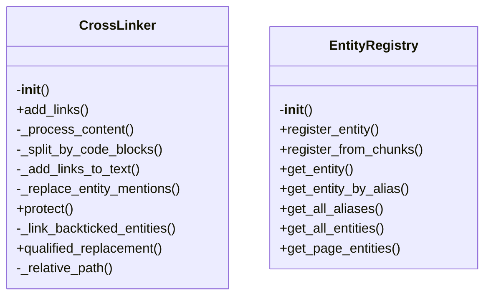

# File Overview

This file implements a cross-linking system for wiki pages. It provides functionality to identify and replace entity mentions in wiki content with links to their corresponding pages, using an entity registry to determine which entities are documented and where they are located.

# Classes

## CrossLinker

The CrossLinker class processes wiki pages to add cross-links to documented entities.

### Methods

#### `__init__(self, registry: EntityRegistry)`

Initializes the CrossLinker with an entity registry.

#### `add_links(self, page: WikiPage) -> WikiPage`

Add cross-links to a wiki page.

**Parameters:**
- `page`: The wiki page to process.

**Returns:**
- A new WikiPage with cross-links added.

#### `_process_content(self, content: str, path: str) -> str`

Process the content of a page to add cross-links.

**Parameters:**
- `content`: The content to process.
- `path`: The path of the page being processed.

**Returns:**
- The content with cross-links added.

#### `_split_by_code_blocks(self, text: str) -> list[tuple[bool, str]]`

Split text by code blocks, preserving code blocks as separate entities.

**Parameters:**
- `text`: The text to split.

**Returns:**
- A list of tuples where the first element indicates if it's a code block and the second is the content.

#### `_add_links_to_text(self, text: str, path: str) -> str`

Add links to text by replacing entity mentions.

**Parameters:**
- `text`: The text to process.
- `path`: The path of the page being processed.

**Returns:**
- The text with entity mentions replaced by links.

#### `_replace_entity_mentions(self, text: str, path: str) -> str`

Replace entity mentions with links.

**Parameters:**
- `text`: The text to process.
- `path`: The path of the page being processed.

**Returns:**
- The text with entity mentions replaced by links.

#### `protect(self, match: re.Match[str]) -> str`

Protect matched content from link replacement.

**Parameters:**
- `match`: The regex match to protect.

**Returns:**
- The protected content.

#### `_link_backticked_entities(self, text: str, entity_name: str, rel_path: str, protect: Callable[[re.Match[str]], str]) -> str`

Convert backticked entity names to links.

Handles:
- `EntityName` -> [`EntityName`](path)
- `module.EntityName` -> [`EntityName`](path)
- `module.submodule.EntityName` -> [`EntityName`](path)

**Parameters:**
- `text`: The text to process.
- `entity_name`: The entity name to [find](manifest.md).
- `rel_path`: The relative path to the entity's wiki page.
- `protect`: A function to protect content from link replacement.

**Returns:**
- The text with backticked entity names converted to links.

#### `qualified_replacement(self, match: re.Match[str], entity_name: str, rel_path: str) -> str`

Replace a qualified entity name with a link.

**Parameters:**
- `match`: The regex match to replace.
- `entity_name`: The entity name to [find](manifest.md).
- `rel_path`: The relative path to the entity's wiki page.

**Returns:**
- The replacement text with a link.

#### `_relative_path(self, from_path: str, to_path: str) -> str`

Calculate relative path between two wiki pages.

**Parameters:**
- `from_path`: Path of the source page (e.g., "modules/src.md").
- `to_path`: Path of the target page (e.g., "files/src/indexer.md").

**Returns:**
- Relative path from source to target.

# Functions

## `add_cross_links(pages: list[WikiPage], registry: EntityRegistry) -> list[WikiPage]`

Add cross-links to all wiki pages.

**Parameters:**
- `pages`: List of wiki pages to process.
- `registry`: Entity registry with documented entities.

**Returns:**
- List of wiki pages with cross-links added.

# Usage Examples

To add cross-links to a list of wiki pages:

```python
from local_deepwiki.generators.crosslinks import add_cross_links
from local_deepwiki.models import WikiPage

# Assuming you have a list of WikiPage objects and an EntityRegistry
pages = [WikiPage(...), WikiPage(...)]
registry = EntityRegistry(...)

# Add cross-links to all pages
linked_pages = add_cross_links(pages, registry)
```

# Related Components

This file works with the following components:

- `EntityRegistry`: Provides documented entities and their locations.
- `WikiPage`: Represents a wiki page with content and metadata.
- `ChunkType`, `CodeChunk`: Models used for processing content.
- `pathlib.Path`: Used for path manipulation.
- `re`: Regular expression module for pattern matching.
- `collections.abc.Callable`: Used for type hints of callable functions.

## API Reference

### class `EntityInfo`

Information about a documented entity.

### class `EntityRegistry`

Registry of documented entities and their wiki page locations.  This class maintains a mapping of entity names (classes, functions, etc.) to their documentation page paths, enabling cross-linking between pages.

**Methods:**

#### `__init__`

```python
def __init__() -> None
```

Initialize an empty entity registry.

#### `register_entity`

```python
def register_entity(name: str, entity_type: ChunkType, wiki_path: str, file_path: str, parent_name: str | None = None) -> None
```

Register a documented entity.


| [Parameter](api_docs.md) | Type | Default | Description |
|-----------|------|---------|-------------|
| `name` | `str` | - | The entity name (e.g., "[WikiGenerator](wiki.md)"). |
| `entity_type` | `ChunkType` | - | The type of entity (class, function, etc.). |
| `wiki_path` | `str` | - | Path to the wiki page documenting this entity. |
| `file_path` | `str` | - | Path to the source file containing this entity. |
| `parent_name` | `str | None` | `None` | Parent entity name (e.g., class name for methods). |

#### `register_from_chunks`

```python
def register_from_chunks(chunks: list[CodeChunk], wiki_path: str) -> None
```

Register entities from a list of code chunks.


| [Parameter](api_docs.md) | Type | Default | Description |
|-----------|------|---------|-------------|
| `chunks` | `list[CodeChunk]` | - | List of code chunks from a file. |
| `wiki_path` | `str` | - | Path to the wiki page for these chunks. |

#### `get_entity`

```python
def get_entity(name: str) -> EntityInfo | None
```

Get entity info by name.


| [Parameter](api_docs.md) | Type | Default | Description |
|-----------|------|---------|-------------|
| `name` | `str` | - | The entity name to look up. |

#### `get_entity_by_alias`

```python
def get_entity_by_alias(alias: str) -> tuple[str, EntityInfo] | None
```

Get entity info by alias (spaced name).


| [Parameter](api_docs.md) | Type | Default | Description |
|-----------|------|---------|-------------|
| `alias` | `str` | - | The spaced alias to look up (e.g., "[Vector Store](../core/vectorstore.md)"). |

#### `get_all_aliases`

```python
def get_all_aliases() -> dict[str, str]
```

Get all registered aliases.

#### `get_all_entities`

```python
def get_all_entities() -> dict[str, EntityInfo]
```

Get all registered entities.

#### `get_page_entities`

```python
def get_page_entities(wiki_path: str) -> list[str]
```

Get all entities defined in a specific wiki page.


| [Parameter](api_docs.md) | Type | Default | Description |
|-----------|------|---------|-------------|
| `wiki_path` | `str` | - | The wiki page path. |


### class `CrossLinker`

Adds cross-links to wiki page content.  This class processes wiki page content and replaces mentions of documented entities with markdown links to their documentation pages.

**Methods:**

#### `__init__`

```python
def __init__(registry: EntityRegistry) -> None
```

Initialize the cross-linker.


| [Parameter](api_docs.md) | Type | Default | Description |
|-----------|------|---------|-------------|
| `registry` | `EntityRegistry` | - | The entity registry to use for lookups. |

#### `add_links`

```python
def add_links(page: WikiPage) -> WikiPage
```

Add cross-links to a wiki page.


| [Parameter](api_docs.md) | Type | Default | Description |
|-----------|------|---------|-------------|
| `page` | `WikiPage` | - | The wiki page to process. |

#### `protect`

```python
def protect(match: re.Match) -> str
```


| [Parameter](api_docs.md) | Type | Default | Description |
|-----------|------|---------|-------------|
| `match` | `re.Match` | - | - |

#### `qualified_replacement`

```python
def qualified_replacement(match: re.Match) -> str
```


| [Parameter](api_docs.md) | Type | Default | Description |
|-----------|------|---------|-------------|
| `match` | `re.Match` | - | - |


---

### Functions

#### `camel_to_spaced`

```python
def camel_to_spaced(name: str) -> str | None
```

Convert CamelCase to 'Spaced Words'.


| [Parameter](api_docs.md) | Type | Default | Description |
|-----------|------|---------|-------------|
| `name` | `str` | - | The CamelCase name. |

**Returns:** `str | None`


#### `add_cross_links`

```python
def add_cross_links(pages: list[WikiPage], registry: EntityRegistry) -> list[WikiPage]
```

Add cross-links to all wiki pages.


| [Parameter](api_docs.md) | Type | Default | Description |
|-----------|------|---------|-------------|
| `pages` | `list[WikiPage]` | - | List of wiki pages to process. |
| `registry` | `EntityRegistry` | - | Entity registry with documented entities. |

**Returns:** `list[WikiPage]`


## Class Diagram



## Call Graph

```mermaid
flowchart TD
    N0[CrossLinker]
    N1[CrossLinker._add_links_to_text]
    N2[CrossLinker._link_backticke...]
    N3[CrossLinker._process_content]
    N4[CrossLinker._replace_entity...]
    N5[CrossLinker._split_by_code_...]
    N6[CrossLinker.add_links]
    N7[EntityInfo]
    N8[EntityRegistry.get_all_aliases]
    N9[EntityRegistry.get_all_enti...]
    N10[EntityRegistry.register_entity]
    N11[EntityRegistry.register_fro...]
    N12[WikiPage]
    N13[_add_links_to_text]
    N14[_process_content]
    N15[_split_by_code_blocks]
    N16[add_cross_links]
    N17[add_links]
    N18[camel_to_spaced]
    N19[compile]
    N20[copy]
    N21[escape]
    N22[finditer]
    N23[get_page_entities]
    N24[group]
    N25[islower]
    N26[isupper]
    N27[register_entity]
    N28[setdefault]
    N29[sub]
    N18 --> N25
    N18 --> N26
    N16 --> N0
    N16 --> N17
    N10 --> N7
    N10 --> N28
    N10 --> N18
    N11 --> N27
    N8 --> N20
    N9 --> N20
    N6 --> N14
    N6 --> N12
    N3 --> N23
    N3 --> N15
    N3 --> N13
    N5 --> N19
    N5 --> N22
    N5 --> N24
    N4 --> N24
    N4 --> N29
    N4 --> N21
    N2 --> N21
    N2 --> N29
    N2 --> N24
    classDef func fill:#e1f5fe
    class N0,N7,N12,N13,N14,N15,N16,N17,N18,N19,N20,N21,N22,N23,N24,N25,N26,N27,N28,N29 func
    classDef method fill:#fff3e0
    class N1,N2,N3,N4,N5,N6,N8,N9,N10,N11 method
```



## Relevant Source Files

- `src/local_deepwiki/generators/crosslinks.py:16-23`

## See Also

- [wiki](wiki.md) - uses this
- [test_crosslinks](../../../tests/test_crosslinks.md) - uses this
- [diagrams](diagrams.md) - shares 4 dependencies
- [see_also](see_also.md) - shares 4 dependencies
- [api_docs](api_docs.md) - shares 4 dependencies
