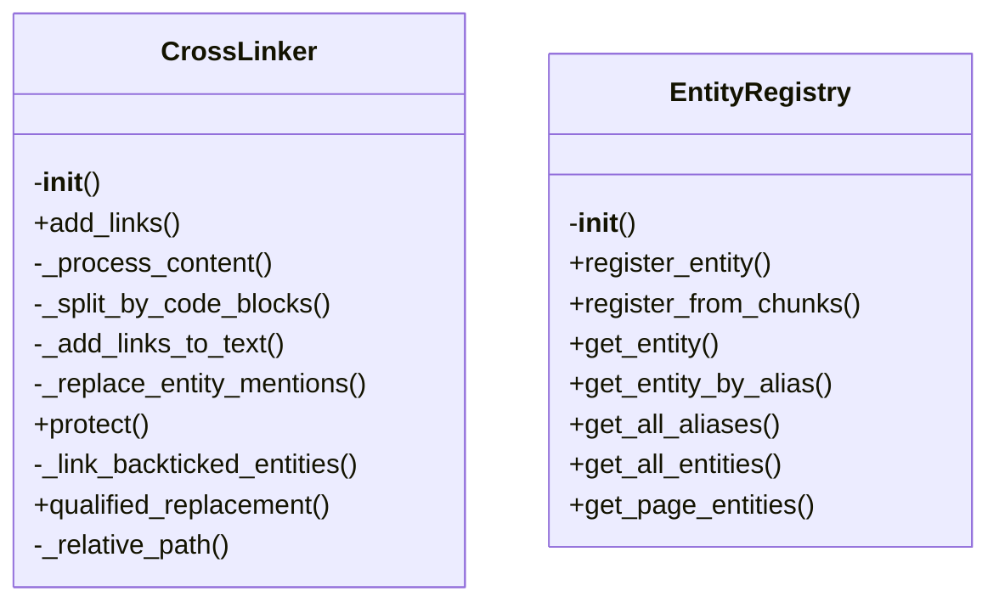

# Crosslinks Generator

## File Overview

The crosslinks.py file implements a system for adding cross-links to wiki pages. It provides functionality to identify entity mentions in wiki content and replace them with hyperlinks pointing to the corresponding documentation pages. This module is part of the local_deepwiki package and integrates with the [WikiPage](../models.md) model and EntityRegistry to provide intelligent cross-linking.

The CrossLinker class is the [main](../web/app.md) component responsible for processing wiki pages and adding appropriate links based on an entity registry. The add_cross_links function serves as the entry point for processing multiple pages at once.

## Classes

### CrossLinker

The CrossLinker class processes wiki pages to add cross-links to entity mentions. It uses an EntityRegistry to identify documented entities and creates appropriate relative links to their documentation pages.

**Key Methods:**

- `__init__(self, registry: EntityRegistry)`: Initializes the linker with an entity registry
- `add_links(self, page: WikiPage) -> WikiPage`: Adds cross-links to a single wiki page
- `_process_content(self, content: str, path: str) -> str`: Processes page content to add links
- `_split_by_code_blocks(self, text: str) -> list[tuple[str, bool]]`: Splits text by code blocks to avoid linking within code
- `_add_links_to_text(self, text: str, path: str) -> str`: Adds links to text content
- `_replace_entity_mentions(self, text: str, path: str) -> str`: Replaces entity mentions with links
- `_link_backticked_entities(self, text: str, entity_name: str, rel_path: str, protect: Callable[[re.Match[str]], str]) -> str`: Converts backticked entity names to links
- `_relative_path(self, from_path: str, to_path: str) -> str`: Calculates relative paths between wiki pages

**Usage:**
```python
registry = EntityRegistry()
linker = CrossLinker(registry)
processed_page = linker.add_links(wiki_page)
```

### EntityRegistry

The EntityRegistry class maintains a collection of documented entities and their corresponding paths. It's used by CrossLinker to determine where to link to when processing wiki pages.

### EntityInfo

The EntityInfo class stores information about a documented entity, including its name, path, and type.

## Functions

### add_cross_links

```python
def add_cross_links(pages: list[WikiPage], registry: EntityRegistry) -> list[WikiPage]:
```

Adds cross-links to all wiki pages in a list using the provided entity registry.

**Parameters:**
- `pages`: List of wiki pages to process
- `registry`: Entity registry with documented entities

**Returns:**
- List of wiki pages with cross-links added

**Usage:**
```python
pages = [page1, page2, page3]
registry = EntityRegistry()
processed_pages = add_cross_links(pages, registry)
```

### camel_to_spaced

```python
def camel_to_spaced(text: str) -> str:
```

Converts camelCase text to spaced words. This helper function is used to normalize entity names for matching.

**Parameters:**
- `text`: The camelCase text to convert

**Returns:**
- Spaced version of the input text

## Usage Examples

### Basic Usage

```python
from local_deepwiki.generators.crosslinks import add_cross_links, CrossLinker
from local_deepwiki.models import WikiPage
from local_deepwiki.generators.entity_registry import EntityRegistry

# Create registry with documented entities
registry = EntityRegistry()
# Add entities to registry...

# Process individual page
page = WikiPage(
    path="modules/src.md",
    title="Source Module",
    content="This uses the EntityName class and module.FunctionName function."
)
linker = CrossLinker(registry)
processed_page = linker.add_links(page)

# Process multiple pages
pages = [page1, page2, page3]
processed_pages = add_cross_links(pages, registry)
```

### Processing Content with Code Blocks

The system correctly handles code blocks to avoid linking within code:

```python
# Input content:
# ```
# def example_function():
#     return EntityName()  # This should not be linked
# ```

# Output content:
# ```
# def example_function():
#     return EntityName()  # This should not be linked
# ```
```

## Related Components

This module works with the [WikiPage](../models.md) model to process page content and the EntityRegistry to identify documented entities. It integrates with the broader local_deepwiki package to provide intelligent cross-linking functionality. The CrossLinker class uses regular expressions and path manipulation to create appropriate relative links between wiki pages.

## API Reference

### class `EntityInfo`

Information about a documented entity.

### class `EntityRegistry`

Registry of documented entities and their wiki page locations.  This class maintains a mapping of entity names (classes, functions, etc.) to their documentation page paths, enabling cross-linking between pages.

**Methods:**

#### `__init__`

```python
def __init__() -> None
```

Initialize an empty entity registry.

#### `register_entity`

```python
def register_entity(name: str, entity_type: ChunkType, wiki_path: str, file_path: str, parent_name: str | None = None) -> None
```

Register a documented entity.


| [Parameter](api_docs.md) | Type | Default | Description |
|-----------|------|---------|-------------|
| `name` | `str` | - | The entity name (e.g., "[WikiGenerator](wiki.md)"). |
| `entity_type` | [`ChunkType`](../models.md) | - | The type of entity (class, function, etc.). |
| `wiki_path` | `str` | - | Path to the wiki page documenting this entity. |
| `file_path` | `str` | - | Path to the source file containing this entity. |
| `parent_name` | `str | None` | `None` | Parent entity name (e.g., class name for methods). |

#### `register_from_chunks`

```python
def register_from_chunks(chunks: list[CodeChunk], wiki_path: str) -> None
```

Register entities from a list of code chunks.


| [Parameter](api_docs.md) | Type | Default | Description |
|-----------|------|---------|-------------|
| `chunks` | `list[CodeChunk]` | - | List of code chunks from a file. |
| `wiki_path` | `str` | - | Path to the wiki page for these chunks. |

#### `get_entity`

```python
def get_entity(name: str) -> EntityInfo | None
```

Get entity info by name.


| [Parameter](api_docs.md) | Type | Default | Description |
|-----------|------|---------|-------------|
| `name` | `str` | - | The entity name to look up. |

#### `get_entity_by_alias`

```python
def get_entity_by_alias(alias: str) -> tuple[str, EntityInfo] | None
```

Get entity info by alias (spaced name).


| [Parameter](api_docs.md) | Type | Default | Description |
|-----------|------|---------|-------------|
| `alias` | `str` | - | The spaced alias to look up (e.g., "[Vector Store](../core/vectorstore.md)"). |

#### `get_all_aliases`

```python
def get_all_aliases() -> dict[str, str]
```

Get all registered aliases.

#### `get_all_entities`

```python
def get_all_entities() -> dict[str, EntityInfo]
```

Get all registered entities.

#### `get_page_entities`

```python
def get_page_entities(wiki_path: str) -> list[str]
```

Get all entities defined in a specific wiki page.


| [Parameter](api_docs.md) | Type | Default | Description |
|-----------|------|---------|-------------|
| `wiki_path` | `str` | - | The wiki page path. |


### class `CrossLinker`

Adds cross-links to wiki page content.  This class processes wiki page content and replaces mentions of documented entities with markdown links to their documentation pages.

**Methods:**

#### `__init__`

```python
def __init__(registry: EntityRegistry) -> None
```

Initialize the cross-linker.


| [Parameter](api_docs.md) | Type | Default | Description |
|-----------|------|---------|-------------|
| `registry` | `EntityRegistry` | - | The entity registry to use for lookups. |

#### `add_links`

```python
def add_links(page: WikiPage) -> WikiPage
```

Add cross-links to a wiki page.


| [Parameter](api_docs.md) | Type | Default | Description |
|-----------|------|---------|-------------|
| `page` | [`WikiPage`](../models.md) | - | The wiki page to process. |

#### `protect`

```python
def protect(match: re.Match) -> str
```


| [Parameter](api_docs.md) | Type | Default | Description |
|-----------|------|---------|-------------|
| `match` | `re.Match` | - | - |

#### `qualified_replacement`

```python
def qualified_replacement(match: re.Match) -> str
```


| [Parameter](api_docs.md) | Type | Default | Description |
|-----------|------|---------|-------------|
| `match` | `re.Match` | - | - |


---

### Functions

#### `camel_to_spaced`

```python
def camel_to_spaced(name: str) -> str | None
```

Convert CamelCase to 'Spaced Words'.


| [Parameter](api_docs.md) | Type | Default | Description |
|-----------|------|---------|-------------|
| `name` | `str` | - | The CamelCase name. |

**Returns:** `str | None`


#### `add_cross_links`

```python
def add_cross_links(pages: list[WikiPage], registry: EntityRegistry) -> list[WikiPage]
```

Add cross-links to all wiki pages.


| [Parameter](api_docs.md) | Type | Default | Description |
|-----------|------|---------|-------------|
| `pages` | `list[WikiPage]` | - | List of wiki pages to process. |
| `registry` | `EntityRegistry` | - | Entity registry with documented entities. |

**Returns:** `list[WikiPage]`


## Class Diagram



## Call Graph

```mermaid
flowchart TD
    N0[CrossLinker]
    N1[CrossLinker._add_links_to_text]
    N2[CrossLinker._link_backticke...]
    N3[CrossLinker._process_content]
    N4[CrossLinker._replace_entity...]
    N5[CrossLinker._split_by_code_...]
    N6[CrossLinker.add_links]
    N7[EntityInfo]
    N8[EntityRegistry.get_all_aliases]
    N9[EntityRegistry.get_all_enti...]
    N10[EntityRegistry.register_entity]
    N11[EntityRegistry.register_fro...]
    N12[WikiPage]
    N13[_add_links_to_text]
    N14[_process_content]
    N15[_split_by_code_blocks]
    N16[add_cross_links]
    N17[add_links]
    N18[camel_to_spaced]
    N19[compile]
    N20[copy]
    N21[escape]
    N22[finditer]
    N23[get_page_entities]
    N24[group]
    N25[islower]
    N26[isupper]
    N27[register_entity]
    N28[setdefault]
    N29[sub]
    N18 --> N25
    N18 --> N26
    N16 --> N0
    N16 --> N17
    N10 --> N7
    N10 --> N28
    N10 --> N18
    N11 --> N27
    N8 --> N20
    N9 --> N20
    N6 --> N14
    N6 --> N12
    N3 --> N23
    N3 --> N15
    N3 --> N13
    N5 --> N19
    N5 --> N22
    N5 --> N24
    N4 --> N24
    N4 --> N29
    N4 --> N21
    N2 --> N21
    N2 --> N29
    N2 --> N24
    classDef func fill:#e1f5fe
    class N0,N7,N12,N13,N14,N15,N16,N17,N18,N19,N20,N21,N22,N23,N24,N25,N26,N27,N28,N29 func
    classDef method fill:#fff3e0
    class N1,N2,N3,N4,N5,N6,N8,N9,N10,N11 method
```



## See Also

- [wiki](wiki.md) - uses this
- [test_crosslinks](../../../tests/test_crosslinks.md) - uses this
- [models](../models.md) - dependency
- [see_also](see_also.md) - shares 4 dependencies
- [api_docs](api_docs.md) - shares 4 dependencies
