# crosslinks.py

## File Overview

This module provides cross-linking functionality for wiki pages, automatically creating links between entities mentioned in the documentation and their corresponding pages. The module processes wiki page content to identify entity references and converts them into markdown links.

## Classes

### EntityInfo

A data class that stores information about documented entities.

### EntityRegistry

A registry that manages documented entities and provides lookup functionality for cross-linking.

### CrossLinker

The [main](../export/pdf.md) class responsible for adding cross-links to wiki pages. It processes page content and replaces entity mentions with appropriate markdown links.

**Key Methods:**
- `add_links(page: WikiPage) -> WikiPage` - Adds cross-links to a wiki page and returns a new [WikiPage](../models.md) instance
- `_process_content(content: str, page_path: str) -> str` - Processes the content of a page to add cross-links
- `_split_by_code_blocks(content: str) -> list` - Splits content while preserving code blocks
- `_add_links_to_text(text: str, page_path: str) -> str` - Adds links to text content
- `_replace_entity_mentions(text: str, page_path: str) -> str` - Replaces entity mentions with links
- `_link_backticked_entities(text: str, page_path: str) -> str` - Handles entities within backticks
- `_relative_path(from_path: str, to_path: str) -> str` - Calculates relative paths between pages

## Functions

### add_cross_links

```python
def add_cross_links(
    pages: list[WikiPage],
    registry: EntityRegistry,
) -> list[WikiPage]:
```

Adds cross-links to all wiki pages in a collection.

**Parameters:**
- `pages` - List of wiki pages to process
- `registry` - Entity registry with documented entities

**Returns:**
- List of wiki pages with cross-links added

### camel_to_spaced

A utility function for converting camelCase names to spaced format (implementation not shown in provided code).

## Usage Examples

### Processing Individual Pages

```python
# Create a cross-linker with an entity registry
linker = CrossLinker(registry)

# Add cross-links to a single page
updated_page = linker.add_links(original_page)
```

### Processing Multiple Pages

```python
# Process all pages at once
updated_pages = add_cross_links(pages, registry)
```

### Path Calculation

```python
linker = CrossLinker(registry)
relative_path = linker._relative_path("modules/src.md", "files/src/indexer.md")
```

## Related Components

This module works with the following components from the codebase:

- **[WikiPage](../models.md)** - The data model representing wiki pages (from `local_deepwiki.models`)
- **[CodeChunk](../models.md)** - Represents code chunks in the documentation (from `local_deepwiki.models`)
- **[ChunkType](../models.md)** - Enumeration for different types of content chunks (from `local_deepwiki.models`)

The module processes [WikiPage](../models.md) instances and uses EntityRegistry to look up documented entities for creating appropriate cross-references in the generated documentation.

## API Reference

### class `EntityInfo`

Information about a documented entity.


<details>
<summary>View Source (lines 16-23) | <a href="https://github.com/UrbanDiver/local-deepwiki-mcp/blob/[main](../export/pdf.md)/src/local_deepwiki/generators/crosslinks.py#L16-L23">GitHub</a></summary>

```python
class EntityInfo:
    """Information about a documented entity."""

    name: str
    entity_type: ChunkType
    wiki_path: str
    file_path: str
    parent_name: str | None = None
```

</details>

### class `EntityRegistry`

Registry of documented entities and their wiki page locations.  This class maintains a mapping of entity names (classes, functions, etc.) to their documentation page paths, enabling cross-linking between pages.

**Methods:**


<details>
<summary>View Source (lines 64-260) | <a href="https://github.com/UrbanDiver/local-deepwiki-mcp/blob/[main](../export/pdf.md)/src/local_deepwiki/generators/crosslinks.py#L64-L260">GitHub</a></summary>

```python
class EntityRegistry:
    # Methods: __init__, register_entity, register_from_chunks, get_entity, get_entity_by_alias, get_all_aliases, get_all_entities, get_page_entities
```

</details>

#### `__init__`

```python
def __init__() -> None
```

Initialize an empty entity registry.


<details>
<summary>View Source (lines 71-138) | <a href="https://github.com/UrbanDiver/local-deepwiki-mcp/blob/[main](../export/pdf.md)/src/local_deepwiki/generators/crosslinks.py#L71-L138">GitHub</a></summary>

```python
def __init__(self) -> None:
        """Initialize an empty entity registry."""
        # Map of entity name -> EntityInfo
        self._entities: dict[str, EntityInfo] = {}
        # Map of alias (spaced name) -> canonical name
        self._aliases: dict[str, str] = {}
        # Map of wiki_path -> list of entities defined in that page
        self._page_entities: dict[str, list[str]] = {}
        # Set of common words to exclude from linking
        self._excluded_names: set[str] = {
            # Python builtins and common names
            "self",
            "cls",
            "None",
            "True",
            "False",
            "str",
            "int",
            "float",
            "bool",
            "list",
            "dict",
            "set",
            "tuple",
            "type",
            "object",
            "Exception",
            "Error",
            "Any",
            "Optional",
            "List",
            "Dict",
            "Set",
            "Tuple",
            "Union",
            "Callable",
            "Type",
            "Path",
            "Field",
            # Common short names that cause false positives
            "id",
            "name",
            "path",
            "data",
            "config",
            "result",
            "value",
            "key",
            "item",
            "index",
            "count",
            "size",
            "length",
            "text",
            "content",
            "status",
            "info",
            "error",
            "message",
            "query",
            "file",
            "line",
            "chunk",
            "page",
            "model",
            "base",
            "test",
        }
```

</details>

#### `register_entity`

```python
def register_entity(name: str, entity_type: ChunkType, wiki_path: str, file_path: str, parent_name: str | None = None) -> None
```

Register a documented entity.


| [Parameter](api_docs.md) | Type | Default | Description |
|-----------|------|---------|-------------|
| `name` | `str` | - | The entity name (e.g., "[WikiGenerator](wiki.md)"). |
| `entity_type` | [`ChunkType`](../models.md) | - | The type of entity (class, function, etc.). |
| `wiki_path` | `str` | - | Path to the wiki page documenting this entity. |
| `file_path` | `str` | - | Path to the source file containing this entity. |
| `parent_name` | `str | None` | `None` | Parent entity name (e.g., class name for methods). |


<details>
<summary>View Source (lines 140-182) | <a href="https://github.com/UrbanDiver/local-deepwiki-mcp/blob/[main](../export/pdf.md)/src/local_deepwiki/generators/crosslinks.py#L140-L182">GitHub</a></summary>

```python
def register_entity(
        self,
        name: str,
        entity_type: ChunkType,
        wiki_path: str,
        file_path: str,
        parent_name: str | None = None,
    ) -> None:
        """Register a documented entity.

        Args:
            name: The entity name (e.g., "WikiGenerator").
            entity_type: The type of entity (class, function, etc.).
            wiki_path: Path to the wiki page documenting this entity.
            file_path: Path to the source file containing this entity.
            parent_name: Parent entity name (e.g., class name for methods).
        """
        if not name or name in self._excluded_names:
            return

        # Skip private/dunder names
        if name.startswith("_"):
            return

        # Skip very short names (likely to cause false positives)
        if len(name) < 4:
            return

        entity = EntityInfo(
            name=name,
            entity_type=entity_type,
            wiki_path=wiki_path,
            file_path=file_path,
            parent_name=parent_name,
        )

        self._entities[name] = entity
        self._page_entities.setdefault(wiki_path, []).append(name)

        # Register spaced alias for CamelCase names
        spaced = camel_to_spaced(name)
        if spaced and spaced not in self._aliases:
            self._aliases[spaced] = name
```

</details>

#### `register_from_chunks`

```python
def register_from_chunks(chunks: list[CodeChunk], wiki_path: str) -> None
```

Register entities from a list of code chunks.


| [Parameter](api_docs.md) | Type | Default | Description |
|-----------|------|---------|-------------|
| `chunks` | `list[CodeChunk]` | - | List of code chunks from a file. |
| `wiki_path` | `str` | - | Path to the wiki page for these chunks. |


<details>
<summary>View Source (lines 184-206) | <a href="https://github.com/UrbanDiver/local-deepwiki-mcp/blob/[main](../export/pdf.md)/src/local_deepwiki/generators/crosslinks.py#L184-L206">GitHub</a></summary>

```python
def register_from_chunks(
        self,
        chunks: list[CodeChunk],
        wiki_path: str,
    ) -> None:
        """Register entities from a list of code chunks.

        Args:
            chunks: List of code chunks from a file.
            wiki_path: Path to the wiki page for these chunks.
        """
        for chunk in chunks:
            if chunk.name and chunk.chunk_type in (
                ChunkType.CLASS,
                ChunkType.FUNCTION,
            ):
                self.register_entity(
                    name=chunk.name,
                    entity_type=chunk.chunk_type,
                    wiki_path=wiki_path,
                    file_path=chunk.file_path,
                    parent_name=chunk.parent_name,
                )
```

</details>

#### `get_entity`

```python
def get_entity(name: str) -> EntityInfo | None
```

Get entity info by name.


| [Parameter](api_docs.md) | Type | Default | Description |
|-----------|------|---------|-------------|
| `name` | `str` | - | The entity name to look up. |


<details>
<summary>View Source (lines 208-217) | <a href="https://github.com/UrbanDiver/local-deepwiki-mcp/blob/[main](../export/pdf.md)/src/local_deepwiki/generators/crosslinks.py#L208-L217">GitHub</a></summary>

```python
def get_entity(self, name: str) -> EntityInfo | None:
        """Get entity info by name.

        Args:
            name: The entity name to look up.

        Returns:
            EntityInfo if found, None otherwise.
        """
        return self._entities.get(name)
```

</details>

#### `get_entity_by_alias`

```python
def get_entity_by_alias(alias: str) -> tuple[str, EntityInfo] | None
```

Get entity info by alias (spaced name).


| [Parameter](api_docs.md) | Type | Default | Description |
|-----------|------|---------|-------------|
| `alias` | `str` | - | The spaced alias to look up (e.g., "[Vector Store](../core/vectorstore.md)"). |


<details>
<summary>View Source (lines 219-233) | <a href="https://github.com/UrbanDiver/local-deepwiki-mcp/blob/[main](../export/pdf.md)/src/local_deepwiki/generators/crosslinks.py#L219-L233">GitHub</a></summary>

```python
def get_entity_by_alias(self, alias: str) -> tuple[str, EntityInfo] | None:
        """Get entity info by alias (spaced name).

        Args:
            alias: The spaced alias to look up (e.g., "Vector Store").

        Returns:
            Tuple of (canonical_name, EntityInfo) if found, None otherwise.
        """
        canonical = self._aliases.get(alias)
        if canonical:
            entity = self._entities.get(canonical)
            if entity:
                return (canonical, entity)
        return None
```

</details>

#### `get_all_aliases`

```python
def get_all_aliases() -> dict[str, str]
```

Get all registered aliases.


<details>
<summary>View Source (lines 235-241) | <a href="https://github.com/UrbanDiver/local-deepwiki-mcp/blob/[main](../export/pdf.md)/src/local_deepwiki/generators/crosslinks.py#L235-L241">GitHub</a></summary>

```python
def get_all_aliases(self) -> dict[str, str]:
        """Get all registered aliases.

        Returns:
            Dictionary mapping aliases to canonical names.
        """
        return self._aliases.copy()
```

</details>

#### `get_all_entities`

```python
def get_all_entities() -> dict[str, EntityInfo]
```

Get all registered entities.


<details>
<summary>View Source (lines 243-249) | <a href="https://github.com/UrbanDiver/local-deepwiki-mcp/blob/[main](../export/pdf.md)/src/local_deepwiki/generators/crosslinks.py#L243-L249">GitHub</a></summary>

```python
def get_all_entities(self) -> dict[str, EntityInfo]:
        """Get all registered entities.

        Returns:
            Dictionary mapping entity names to EntityInfo.
        """
        return self._entities.copy()
```

</details>

#### `get_page_entities`

```python
def get_page_entities(wiki_path: str) -> list[str]
```

Get all entities defined in a specific wiki page.


| [Parameter](api_docs.md) | Type | Default | Description |
|-----------|------|---------|-------------|
| `wiki_path` | `str` | - | The wiki page path. |


<details>
<summary>View Source (lines 251-260) | <a href="https://github.com/UrbanDiver/local-deepwiki-mcp/blob/[main](../export/pdf.md)/src/local_deepwiki/generators/crosslinks.py#L251-L260">GitHub</a></summary>

```python
def get_page_entities(self, wiki_path: str) -> list[str]:
        """Get all entities defined in a specific wiki page.

        Args:
            wiki_path: The wiki page path.

        Returns:
            List of entity names defined in that page.
        """
        return self._page_entities.get(wiki_path, [])
```

</details>

### class `CrossLinker`

Adds cross-links to wiki page content.  This class processes wiki page content and replaces mentions of documented entities with markdown links to their documentation pages.

**Methods:**


<details>
<summary>View Source (lines 263-553) | <a href="https://github.com/UrbanDiver/local-deepwiki-mcp/blob/[main](../export/pdf.md)/src/local_deepwiki/generators/crosslinks.py#L263-L553">GitHub</a></summary>

```python
class CrossLinker:
    # Methods: __init__, add_links, _process_content, _split_by_code_blocks, _add_links_to_text, _replace_entity_mentions, protect, _link_backticked_entities, qualified_replacement, _relative_path
```

</details>

#### `__init__`

```python
def __init__(registry: EntityRegistry) -> None
```

Initialize the cross-linker.


| [Parameter](api_docs.md) | Type | Default | Description |
|-----------|------|---------|-------------|
| `registry` | `EntityRegistry` | - | The entity registry to use for lookups. |


<details>
<summary>View Source (lines 270-276) | <a href="https://github.com/UrbanDiver/local-deepwiki-mcp/blob/[main](../export/pdf.md)/src/local_deepwiki/generators/crosslinks.py#L270-L276">GitHub</a></summary>

```python
def __init__(self, registry: EntityRegistry) -> None:
        """Initialize the cross-linker.

        Args:
            registry: The entity registry to use for lookups.
        """
        self.registry = registry
```

</details>

#### `add_links`

```python
def add_links(page: WikiPage) -> WikiPage
```

Add cross-links to a wiki page.


| [Parameter](api_docs.md) | Type | Default | Description |
|-----------|------|---------|-------------|
| `page` | [`WikiPage`](../models.md) | - | The wiki page to process. |


<details>
<summary>View Source (lines 278-294) | <a href="https://github.com/UrbanDiver/local-deepwiki-mcp/blob/[main](../export/pdf.md)/src/local_deepwiki/generators/crosslinks.py#L278-L294">GitHub</a></summary>

```python
def add_links(self, page: WikiPage) -> WikiPage:
        """Add cross-links to a wiki page.

        Args:
            page: The wiki page to process.

        Returns:
            A new WikiPage with cross-links added.
        """
        content = self._process_content(page.content, page.path)

        return WikiPage(
            path=page.path,
            title=page.title,
            content=content,
            generated_at=page.generated_at,
        )
```

</details>

#### `protect`

```python
def protect(match: re.Match) -> str
```


| [Parameter](api_docs.md) | Type | Default | Description |
|-----------|------|---------|-------------|
| `match` | `re.Match` | - | - |


<details>
<summary>View Source (lines 448-453) | <a href="https://github.com/UrbanDiver/local-deepwiki-mcp/blob/[main](../export/pdf.md)/src/local_deepwiki/generators/crosslinks.py#L448-L453">GitHub</a></summary>

```python
def protect(match: re.Match) -> str:
            nonlocal counter
            placeholder = f"\x00PROTECTED{counter}\x00"
            protected.append((placeholder, match.group(0)))
            counter += 1
            return placeholder
```

</details>

#### `qualified_replacement`

```python
def qualified_replacement(match: re.Match) -> str
```


| [Parameter](api_docs.md) | Type | Default | Description |
|-----------|------|---------|-------------|
| `match` | `re.Match` | - | - |


---


<details>
<summary>View Source (lines 516-519) | <a href="https://github.com/UrbanDiver/local-deepwiki-mcp/blob/[main](../export/pdf.md)/src/local_deepwiki/generators/crosslinks.py#L516-L519">GitHub</a></summary>

```python
def qualified_replacement(match: re.Match) -> str:
            # Link just the entity name, showing full qualified name
            full_name = match.group(0)[1:-1]  # Remove backticks
            return f"[`{full_name}`]({rel_path})"
```

</details>

### Functions

#### `camel_to_spaced`

```python
def camel_to_spaced(name: str) -> str | None
```

Convert CamelCase to 'Spaced Words'.


| [Parameter](api_docs.md) | Type | Default | Description |
|-----------|------|---------|-------------|
| `name` | `str` | - | The CamelCase name. |

**Returns:** `str | None`


<details>
<summary>View Source (lines 26-61) | <a href="https://github.com/UrbanDiver/local-deepwiki-mcp/blob/[main](../export/pdf.md)/src/local_deepwiki/generators/crosslinks.py#L26-L61">GitHub</a></summary>

```python
def camel_to_spaced(name: str) -> str | None:
    """Convert CamelCase to 'Spaced Words'.

    Examples:
        VectorStore -> Vector Store
        WikiGenerator -> Wiki Generator
        LLMProvider -> LLM Provider

    Args:
        name: The CamelCase name.

    Returns:
        Spaced version or None if not applicable.
    """
    if not name or "_" in name or name.islower() or name.isupper():
        return None

    # Insert space before uppercase letters that follow lowercase letters
    # Also handle sequences of uppercase (e.g., LLMProvider -> LLM Provider)
    result = []
    prev_upper = False
    for i, char in enumerate(name):
        if char.isupper():
            if i > 0 and not prev_upper:
                result.append(" ")
            elif i > 0 and prev_upper and i + 1 < len(name) and name[i + 1].islower():
                # Handle LLMProvider -> LLM Provider
                result.append(" ")
            prev_upper = True
        else:
            prev_upper = False
        result.append(char)

    spaced = "".join(result)
    # Only return if actually different
    return spaced if spaced != name else None
```

</details>

#### `add_cross_links`

```python
def add_cross_links(pages: list[WikiPage], registry: EntityRegistry) -> list[WikiPage]
```

Add cross-links to all wiki pages.


| [Parameter](api_docs.md) | Type | Default | Description |
|-----------|------|---------|-------------|
| `pages` | `list[WikiPage]` | - | List of wiki pages to process. |
| `registry` | `EntityRegistry` | - | Entity registry with documented entities. |

**Returns:** `list[WikiPage]`


<details>
<summary>View Source (lines 556-570) | <a href="https://github.com/UrbanDiver/local-deepwiki-mcp/blob/[main](../export/pdf.md)/src/local_deepwiki/generators/crosslinks.py#L556-L570">GitHub</a></summary>

```python
def add_cross_links(
    pages: list[WikiPage],
    registry: EntityRegistry,
) -> list[WikiPage]:
    """Add cross-links to all wiki pages.

    Args:
        pages: List of wiki pages to process.
        registry: Entity registry with documented entities.

    Returns:
        List of wiki pages with cross-links added.
    """
    linker = CrossLinker(registry)
    return [linker.add_links(page) for page in pages]
```

</details>

## Class Diagram


## Call Graph

```mermaid
flowchart TD
    N0[CrossLinker]
    N1[CrossLinker._add_links_to_text]
    N2[CrossLinker._link_backticke...]
    N3[CrossLinker._process_content]
    N4[CrossLinker._replace_entity...]
    N5[CrossLinker._split_by_code_...]
    N6[CrossLinker.add_links]
    N7[EntityInfo]
    N8[EntityRegistry.get_all_aliases]
    N9[EntityRegistry.get_all_enti...]
    N10[EntityRegistry.register_entity]
    N11[EntityRegistry.register_fro...]
    N12[WikiPage]
    N13[_add_links_to_text]
    N14[_process_content]
    N15[_split_by_code_blocks]
    N16[add_cross_links]
    N17[add_links]
    N18[camel_to_spaced]
    N19[compile]
    N20[copy]
    N21[escape]
    N22[finditer]
    N23[get_page_entities]
    N24[group]
    N25[islower]
    N26[isupper]
    N27[register_entity]
    N28[setdefault]
    N29[sub]
    N18 --> N25
    N18 --> N26
    N16 --> N0
    N16 --> N17
    N10 --> N7
    N10 --> N28
    N10 --> N18
    N11 --> N27
    N8 --> N20
    N9 --> N20
    N6 --> N14
    N6 --> N12
    N3 --> N23
    N3 --> N15
    N3 --> N13
    N5 --> N19
    N5 --> N22
    N5 --> N24
    N4 --> N24
    N4 --> N29
    N4 --> N21
    N2 --> N21
    N2 --> N29
    N2 --> N24
    classDef func fill:#e1f5fe
    class N0,N7,N12,N13,N14,N15,N16,N17,N18,N19,N20,N21,N22,N23,N24,N25,N26,N27,N28,N29 func
    classDef method fill:#fff3e0
    class N1,N2,N3,N4,N5,N6,N8,N9,N10,N11 method
```



## Used By

Functions and methods in this file and their callers:

- **`CrossLinker`**: called by `add_cross_links`
- **`EntityInfo`**: called by `EntityRegistry.register_entity`
- **`Path`**: called by `CrossLinker._relative_path`
- **[`WikiPage`](../models.md)**: called by `CrossLinker.add_links`
- **`_add_links_to_text`**: called by `CrossLinker._process_content`
- **`_link_backticked_entities`**: called by `CrossLinker._replace_entity_mentions`
- **`_process_content`**: called by `CrossLinker.add_links`
- **`_relative_path`**: called by `CrossLinker._add_links_to_text`
- **`_replace_entity_mentions`**: called by `CrossLinker._add_links_to_text`
- **`_split_by_code_blocks`**: called by `CrossLinker._process_content`
- **`add_links`**: called by `add_cross_links`
- **`camel_to_spaced`**: called by `EntityRegistry.register_entity`
- **`compile`**: called by `CrossLinker._split_by_code_blocks`
- **`copy`**: called by `EntityRegistry.get_all_aliases`, `EntityRegistry.get_all_entities`
- **`end`**: called by `CrossLinker._split_by_code_blocks`
- **`escape`**: called by `CrossLinker._link_backticked_entities`, `CrossLinker._replace_entity_mentions`
- **`finditer`**: called by `CrossLinker._split_by_code_blocks`
- **`get_all_aliases`**: called by `CrossLinker._add_links_to_text`
- **`get_all_entities`**: called by `CrossLinker._add_links_to_text`
- **`get_page_entities`**: called by `CrossLinker._process_content`
- **`group`**: called by `CrossLinker._link_backticked_entities`, `CrossLinker._replace_entity_mentions`, `CrossLinker._split_by_code_blocks`, `CrossLinker.protect`, `CrossLinker.qualified_replacement`
- **`islower`**: called by `camel_to_spaced`
- **`isupper`**: called by `camel_to_spaced`
- **`register_entity`**: called by `EntityRegistry.register_from_chunks`
- **`setdefault`**: called by `EntityRegistry.register_entity`
- **`start`**: called by `CrossLinker._split_by_code_blocks`
- **`sub`**: called by `CrossLinker._link_backticked_entities`, `CrossLinker._replace_entity_mentions`

## Usage Examples

*Examples extracted from test files*

### Test simple CamelCase conversion

From `test_crosslinks.py::TestCamelToSpaced::test_simple_camel_case`:

```python
assert camel_to_spaced("VectorStore") == "Vector Store"
assert camel_to_spaced("WikiGenerator") == "Wiki Generator"
assert camel_to_spaced("CodeChunker") == "Code Chunker"
```

### Test multi-word CamelCase

From `test_crosslinks.py::TestCamelToSpaced::test_multi_word`:

```python
assert camel_to_spaced("RepositoryIndexer") == "Repository Indexer"
assert camel_to_spaced("CrossLinker") == "Cross Linker"
```

### Test multi-word CamelCase

From `test_crosslinks.py::TestCamelToSpaced::test_multi_word`:

```python
assert camel_to_spaced("RepositoryIndexer") == "Repository Indexer"
assert camel_to_spaced("CrossLinker") == "Cross Linker"
```

### Test registering an entity

From `test_crosslinks.py::TestEntityRegistry::test_register_entity`:

```python
registry = EntityRegistry()
registry.register_entity(
    name="WikiGenerator",
    entity_type=ChunkType.CLASS,
    wiki_path="files/wiki.md",
    file_path="src/wiki.py",
)

entity = registry.get_entity("WikiGenerator")
assert entity is not None
assert entity.name == "WikiGenerator"
```

### Test registering an entity

From `test_crosslinks.py::TestEntityRegistry::test_register_entity`:

```python
registry.register_entity(
    name="WikiGenerator",
    entity_type=ChunkType.CLASS,
    wiki_path="files/wiki.md",
    file_path="src/wiki.py",
)

entity = registry.get_entity("WikiGenerator")
assert entity is not None
assert entity.name == "WikiGenerator"
```


## Last Modified

| Entity | Type | Author | Date | Commit |
|--------|------|--------|------|--------|
| `CrossLinker` | class | Brian Breidenbach | today | `0d91a70` Apply Python best practices... |
| `_add_links_to_text` | method | Brian Breidenbach | today | `0d91a70` Apply Python best practices... |
| `EntityRegistry` | class | Brian Breidenbach | 3 days ago | `c568951` Add input validation, type ... |
| `__init__` | method | Brian Breidenbach | 3 days ago | `c568951` Add input validation, type ... |
| `_split_by_code_blocks` | method | Brian Breidenbach | 3 days ago | `c568951` Add input validation, type ... |
| `_replace_entity_mentions` | method | Brian Breidenbach | 3 days ago | `c568951` Add input validation, type ... |
| `_link_backticked_entities` | method | Brian Breidenbach | 3 days ago | `c568951` Add input validation, type ... |
| `qualified_replacement` | method | Brian Breidenbach | 5 days ago | `1315c7f` Add wiki improvements: incr... |
| `EntityInfo` | class | Brian Breidenbach | 5 days ago | `f933c46` Add cross-linking between w... |
| `register_entity` | method | Brian Breidenbach | 5 days ago | `f933c46` Add cross-linking between w... |
| `register_from_chunks` | method | Brian Breidenbach | 5 days ago | `f933c46` Add cross-linking between w... |
| `get_entity` | method | Brian Breidenbach | 5 days ago | `f933c46` Add cross-linking between w... |
| `get_entity_by_alias` | method | Brian Breidenbach | 5 days ago | `f933c46` Add cross-linking between w... |
| `get_all_aliases` | method | Brian Breidenbach | 5 days ago | `f933c46` Add cross-linking between w... |
| `get_all_entities` | method | Brian Breidenbach | 5 days ago | `f933c46` Add cross-linking between w... |
| `get_page_entities` | method | Brian Breidenbach | 5 days ago | `f933c46` Add cross-linking between w... |
| `__init__` | method | Brian Breidenbach | 5 days ago | `f933c46` Add cross-linking between w... |
| `add_links` | method | Brian Breidenbach | 5 days ago | `f933c46` Add cross-linking between w... |
| `_process_content` | method | Brian Breidenbach | 5 days ago | `f933c46` Add cross-linking between w... |
| `protect` | method | Brian Breidenbach | 5 days ago | `f933c46` Add cross-linking between w... |
| `_relative_path` | method | Brian Breidenbach | 5 days ago | `f933c46` Add cross-linking between w... |
| `camel_to_spaced` | function | Brian Breidenbach | 5 days ago | `f933c46` Add cross-linking between w... |
| `add_cross_links` | function | Brian Breidenbach | 5 days ago | `f933c46` Add cross-linking between w... |

## Additional Source Code

Source code for functions and methods not listed in the API Reference above.

#### `_process_content`

<details>
<summary>View Source (lines 296-324) | <a href="https://github.com/UrbanDiver/local-deepwiki-mcp/blob/[main](../export/pdf.md)/src/local_deepwiki/generators/crosslinks.py#L296-L324">GitHub</a></summary>

```python
def _process_content(self, content: str, current_page: str) -> str:
        """Process content to add cross-links.

        Args:
            content: The markdown content to process.
            current_page: Path of the current page (to avoid self-links).

        Returns:
            Content with cross-links added.
        """
        # Get entities on the current page (to avoid self-links)
        current_page_entities = set(self.registry.get_page_entities(current_page))

        # Split content into code blocks and non-code sections
        # We only want to add links in non-code sections
        parts = self._split_by_code_blocks(content)
        processed_parts = []

        for part, is_code in parts:
            if is_code:
                # Don't modify code blocks
                processed_parts.append(part)
            else:
                # Add links to prose sections
                processed_parts.append(
                    self._add_links_to_text(part, current_page, current_page_entities)
                )

        return "".join(processed_parts)
```

</details>


#### `_split_by_code_blocks`

<details>
<summary>View Source (lines 326-355) | <a href="https://github.com/UrbanDiver/local-deepwiki-mcp/blob/[main](../export/pdf.md)/src/local_deepwiki/generators/crosslinks.py#L326-L355">GitHub</a></summary>

```python
def _split_by_code_blocks(self, content: str) -> list[tuple[str, bool]]:
        """Split content into code and non-code sections.

        Args:
            content: The markdown content.

        Returns:
            List of (text, is_code) tuples.
        """
        # Match fenced code blocks (``` or ~~~) and inline code (`)
        # We need to handle both
        parts: list[tuple[str, bool]] = []

        # Pattern for fenced code blocks
        fenced_pattern = re.compile(r"(```[\s\S]*?```|~~~[\s\S]*?~~~)")

        last_end = 0
        for match in fenced_pattern.finditer(content):
            # Add text before the code block
            if match.start() > last_end:
                parts.append((content[last_end : match.start()], False))
            # Add the code block
            parts.append((match.group(0), True))
            last_end = match.end()

        # Add remaining text
        if last_end < len(content):
            parts.append((content[last_end:], False))

        return parts
```

</details>


#### `_add_links_to_text`

<details>
<summary>View Source (lines 357-424) | <a href="https://github.com/UrbanDiver/local-deepwiki-mcp/blob/main/src/local_deepwiki/generators/crosslinks.py#L357-L424">GitHub</a></summary>

```python
def _add_links_to_text(
        self,
        text: str,
        current_page: str,
        current_page_entities: set[str],
    ) -> str:
        """Add links to a text section (not code).

        Args:
            text: The text to process.
            current_page: Path of the current page.
            current_page_entities: Entities defined on the current page.

        Returns:
            Text with links added.
        """
        entities = self.registry.get_all_entities()
        aliases = self.registry.get_all_aliases()

        if not entities and not aliases:
            return text

        # Sort by name length (longest first) to avoid partial replacements
        sorted_names = sorted(entities.keys(), key=len, reverse=True)

        for name in sorted_names:
            # Skip entities on the current page
            if name in current_page_entities:
                continue

            entity = entities[name]

            # Calculate relative path from current page to target
            rel_path = self._relative_path(current_page, entity.wiki_path)

            # Create the link
            link = f"[{name}]({rel_path})"

            # Replace mentions of the entity with links
            # Use word boundaries to avoid partial matches
            # Also avoid replacing inside existing links or inline code
            text = self._replace_entity_mentions(text, name, link, rel_path)

        # Also try to match aliases (spaced versions like "[Vector Store](../core/vectorstore.md)")
        # Sort by length (longest first)
        sorted_aliases = sorted(aliases.keys(), key=len, reverse=True)

        for alias in sorted_aliases:
            canonical_name = aliases[alias]

            # Skip if canonical entity is on current page
            if canonical_name in current_page_entities:
                continue

            alias_entity = entities.get(canonical_name)
            if not alias_entity:
                continue

            # Calculate relative path
            rel_path = self._relative_path(current_page, alias_entity.wiki_path)

            # Create link - use alias as display text
            link = f"[{alias}]({rel_path})"

            # Replace alias mentions
            text = self._replace_entity_mentions(text, alias, link, rel_path)

        return text
```

</details>


#### `_replace_entity_mentions`

<details>
<summary>View Source (lines 426-482) | <a href="https://github.com/UrbanDiver/local-deepwiki-mcp/blob/main/src/local_deepwiki/generators/crosslinks.py#L426-L482">GitHub</a></summary>

```python
def _replace_entity_mentions(
        self,
        text: str,
        entity_name: str,
        link: str,
        rel_path: str,
    ) -> str:
        """Replace entity mentions with links.

        Args:
            text: The text to process.
            entity_name: The entity name to [find](manifest.md).
            link: The markdown link to insert.
            rel_path: The relative path to the entity's wiki page.

        Returns:
            Text with entity mentions replaced.
        """
        # First, protect existing links and headings by replacing them temporarily
        protected: list[tuple[str, str]] = []
        counter = 0

        def protect(match: re.Match) -> str:
            nonlocal counter
            placeholder = f"\x00PROTECTED{counter}\x00"
            protected.append((placeholder, match.group(0)))
            counter += 1
            return placeholder

        # Protect existing markdown links and headings
        temp_text = re.sub(r"\[([^\]]+)\]\([^)]+\)", protect, text)
        temp_text = re.sub(r"^(#{1,6}\s+.+)$", protect, temp_text, flags=re.MULTILINE)

        # Convert backticked entity names to links: `EntityName` -> [`EntityName`](path)
        # Also handle qualified names like `module.EntityName` -> [`EntityName`](path)
        temp_text = self._link_backticked_entities(temp_text, entity_name, rel_path, protect)

        # Protect all remaining inline code (that didn't match entities)
        temp_text = re.sub(r"`[^`]+`", protect, temp_text)

        # Replace bold entity mentions: **EntityName** -> **[EntityName](path)**
        bold_pattern = rf"\*\*{re.escape(entity_name)}\*\*"
        bold_link = f"**[{entity_name}]({rel_path})**"
        temp_text = re.sub(bold_pattern, bold_link, temp_text)

        # Protect links we just created to avoid double-linking
        temp_text = re.sub(r"\[([^\]]+)\]\([^)]+\)", protect, temp_text)

        # Also replace plain entity mentions (but not inside headings to avoid breaking them)
        pattern = rf"\b{re.escape(entity_name)}\b"
        temp_text = re.sub(pattern, link, temp_text)

        # Restore protected content
        for placeholder, original in protected:
            temp_text = temp_text.replace(placeholder, original)

        return temp_text
```

</details>


#### `_link_backticked_entities`

<details>
<summary>View Source (lines 484-526) | <a href="https://github.com/UrbanDiver/local-deepwiki-mcp/blob/main/src/local_deepwiki/generators/crosslinks.py#L484-L526">GitHub</a></summary>

```python
def _link_backticked_entities(
        self,
        text: str,
        entity_name: str,
        rel_path: str,
        protect: Callable[[re.Match[str]], str],
    ) -> str:
        """Convert backticked entity names to links.

        Handles:
        - `EntityName` -> [`EntityName`](path)
        - `module.EntityName` -> [`EntityName`](path)
        - `module.submodule.EntityName` -> [`EntityName`](path)

        Args:
            text: The text to process.
            entity_name: The entity name to [find](manifest.md).
            rel_path: The relative path to the entity's wiki page.
            protect: Function to protect already-processed content.

        Returns:
            Text with backticked entities converted to links.
        """
        # Pattern for exact match: `EntityName`
        exact_pattern = rf"`{re.escape(entity_name)}`"
        exact_replacement = f"[`{entity_name}`]({rel_path})"
        text = re.sub(exact_pattern, exact_replacement, text)

        # Pattern for qualified names: `something.EntityName` or `a.b.EntityName`
        # Captures the entity name at the end after a dot
        qualified_pattern = rf"`([a-zA-Z_][a-zA-Z0-9_]*\.)+{re.escape(entity_name)}`"

        def qualified_replacement(match: re.Match) -> str:
            # Link just the entity name, showing full qualified name
            full_name = match.group(0)[1:-1]  # Remove backticks
            return f"[`{full_name}`]({rel_path})"

        text = re.sub(qualified_pattern, qualified_replacement, text)

        # Protect the links we just created
        text = re.sub(r"\[`[^`]+`\]\([^)]+\)", protect, text)

        return text
```

</details>


#### `_relative_path`

<details>
<summary>View Source (lines 528-553) | <a href="https://github.com/UrbanDiver/local-deepwiki-mcp/blob/main/src/local_deepwiki/generators/crosslinks.py#L528-L553">GitHub</a></summary>

```python
def _relative_path(self, from_path: str, to_path: str) -> str:
        """Calculate relative path between two wiki pages.

        Args:
            from_path: Path of the source page (e.g., "modules/src.md").
            to_path: Path of the target page (e.g., "files/src/indexer.md").

        Returns:
            Relative path from source to target.
        """
        from_parts = Path(from_path).parts[:-1]  # Directory parts only
        to_parts = Path(to_path).parts

        # Find common prefix
        common_length = 0
        for i in range(min(len(from_parts), len(to_parts) - 1)):
            if from_parts[i] == to_parts[i]:
                common_length = i + 1
            else:
                break

        # Build relative path
        ups = len(from_parts) - common_length
        rel_parts = [".."] * ups + list(to_parts[common_length:])

        return "/".join(rel_parts)
```

</details>

## Relevant Source Files

- `src/local_deepwiki/generators/crosslinks.py:16-23`

## See Also

- [models](../models.md) - dependency
- [see_also](see_also.md) - shares 4 dependencies
- [diagrams](diagrams.md) - shares 4 dependencies
- [api_docs](api_docs.md) - shares 4 dependencies
