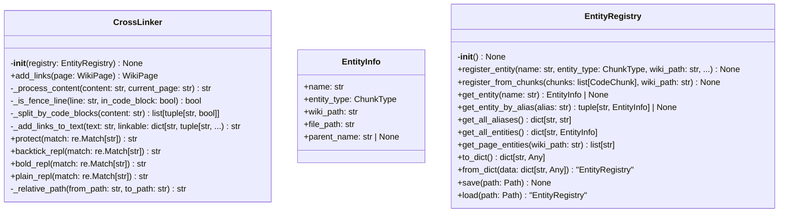

# File: `src/local_deepwiki/generators/crosslinks.py`

## File Overview

This module provides functionality to automatically create hyperlinks between wiki pages when documented entities (such as classes, functions, and methods) are mentioned in the content. It enables cross-linking of entities defined in source code to their corresponding documentation pages, improving navigation and discoverability within the wiki.

The core responsibility of this file is to:
- Maintain a registry of documented entities (`EntityRegistry`)
- Identify entity mentions in wiki page content
- Generate appropriate markdown links to related pages
- Process markdown content to inject cross-links while preserving existing formatting

The design rationale centers around:
- Efficient entity lookup using canonical names and aliases
- Preservation of existing markdown syntax (code blocks, links, bold text)
- Handling of edge cases like self-references and nested code blocks
- Support for both direct entity mentions and spaced variants (e.g., [`VectorStore`](../core/vectorstore/store.md) and [`Vector Store`](../core/vectorstore/store.md))

## Key Concepts

### Entity Registry and Lookup
The `EntityRegistry` class maintains an in-memory index of all documented entities, mapping:
- Canonical names (e.g., [`VectorStore`](../core/vectorstore/store.md)) to `EntityInfo`
- Spaced aliases (e.g., [`Vector Store`](../core/vectorstore/store.md)) to canonical names
- Wiki page paths to lists of entities defined in them

This allows efficient lookups during cross-linking and supports both direct and alias-based matching. The use of a registry centralizes entity management and avoids recomputation across multiple pages.

### Cross-Linking Algorithm
The `CrossLinker` class implements a multi-pass algorithm to inject links into markdown content:
1. **Content Splitting**: Content is split into code and non-code sections to avoid modifying code blocks.
2. **Regex Alternation**: A single compiled regex is used to match all possible entity names, prioritizing longer matches to avoid partial matches.
3. **Protected Content**: Existing markdown links, headings, and code sections are temporarily replaced with placeholders to prevent interference.
4. **Link Insertion**: Matches are replaced with appropriate markdown links (`[text](path)`) based on context:
   - Backticked (`\``) entities: `[`text`](path)`
   - Bold (`**`) entities: `**[text](path)**`
   - Plain word-boundary mentions: `[text](path)`

This approach avoids multiple regex passes and ensures that complex markdown structures are preserved.

### CamelCase to Spaced Conversion
The `camel_to_spaced` utility function handles conversion of CamelCase identifiers to more readable spaced forms (e.g., [`VectorStore`](../core/vectorstore/store.md) → [`Vector Store`](../core/vectorstore/store.md)). This enables linking using natural language variants while preserving the original identifier for precise matching.

## Integration

This module is a core component of the wiki generation pipeline, integrating with:
- `local_deepwiki.generators.wiki.utils` for path conversions ([`file_path_to_wiki_path`](wiki/utils.md), [`relative_wiki_path`](wiki/utils.md))
- `local_deepwiki.models` for type definitions ([`ChunkType`](../models/foundation.md), [`CodeChunk`](../models/chunks.md), [`WikiPage`](../export/streaming.md))

It is used by:
- `EntityRegistry` and `CrossLinker` classes, which are consumed by `build_entity_registry_from_store` and `add_cross_links`
- The `lazy_resources` and `test_crosslinks` components, which rely on these functions for entity indexing and cross-linking

This file integrates with the vector store and chunking pipeline through `build_entity_registry_from_store`, which builds an entity registry from code chunks. The `add_cross_links` function then applies cross-linking to a list of [`WikiPage`](../export/streaming.md) objects, making it a key part of the final wiki generation step.

## Design Notes

### Handling of Markdown Syntax
The implementation carefully avoids modifying code blocks, inline code, and existing links by:
- Using a line-by-line parser to correctly identify markdown fences
- Temporarily replacing matched content with placeholders
- Applying link replacement in a specific order to ensure nested structures are handled correctly

### Performance Considerations
To optimize performance:
- A single, pre-compiled regex is used for matching all entity names, avoiding repeated compilation
- All entities are pre-sorted by length (longest first) to prioritize longer matches
- Content is split into code and non-code sections to minimize unnecessary processing

### Exclusion of Common Names
Certain names are excluded from cross-linking (`_EXCLUDED_CROSSLINK_NAMES`) to prevent false positives and reduce noise. This includes short names and common words that are unlikely to be meaningful entity references.

### Self-Linking Prevention
The `CrossLinker` avoids creating links to entities defined in the same page by:
- Maintaining a set of entities defined in the current page
- Skipping those during the link creation process

This ensures that pages don't link to themselves, which would be redundant and potentially confusing.

## API Reference

### class `EntityInfo`

Information about a documented entity.


<details>
<summary>View Source (lines 20-27) | <a href="https://github.com/UrbanDiver/local-deepwiki-mcp/blob/main/src/local_deepwiki/generators/crosslinks.py#L20-L27">GitHub</a></summary>

```python
class EntityInfo:
    """Information about a documented entity."""

    name: str
    entity_type: ChunkType
    wiki_path: str
    file_path: str
    parent_name: str | None = None
```

</details>

### class `EntityRegistry`

Registry of documented entities and their wiki page locations.  This class maintains a mapping of entity names (classes, functions, etc.) to their documentation page paths, enabling cross-linking between pages.

**Methods:**


<details>
<summary>View Source (lines 174-353) | <a href="https://github.com/UrbanDiver/local-deepwiki-mcp/blob/main/src/local_deepwiki/generators/crosslinks.py#L174-L353">GitHub</a></summary>

```python
class EntityRegistry:
    # Methods: __init__, register_entity, register_from_chunks, get_entity, get_entity_by_alias, get_all_aliases, get_all_entities, get_page_entities, to_dict, from_dict, save, load
```

</details>

#### `__init__`

```python
def __init__() -> None
```

Initialize an empty entity registry.


<details>
<summary>View Source (lines 181-190) | <a href="https://github.com/UrbanDiver/local-deepwiki-mcp/blob/main/src/local_deepwiki/generators/crosslinks.py#L181-L190">GitHub</a></summary>

```python
def __init__(self) -> None:
        """Initialize an empty entity registry."""
        # Map of entity name -> EntityInfo
        self._entities: dict[str, EntityInfo] = {}
        # Map of alias (spaced name) -> canonical name
        self._aliases: dict[str, str] = {}
        # Map of wiki_path -> list of entities defined in that page
        self._page_entities: dict[str, list[str]] = {}
        # Set of common words to exclude from linking
        self._excluded_names: set[str] = set(_EXCLUDED_CROSSLINK_NAMES)
```

</details>

#### `register_entity`

```python
def register_entity(name: str, entity_type: ChunkType, wiki_path: str, file_path: str, parent_name: str | None = None) -> None
```

Register a documented entity.


| Parameter | Type | Default | Description |
|-----------|------|---------|-------------|
| `name` | `str` | - | The entity name (e.g., "WikiGenerator"). |
| `entity_type` | `ChunkType` | - | The type of entity (class, function, etc.). |
| `wiki_path` | `str` | - | Path to the wiki page documenting this entity. |
| `file_path` | `str` | - | Path to the source file containing this entity. |
| `parent_name` | `str | None` | `None` | Parent entity name (e.g., class name for methods). |


<details>
<summary>View Source (lines 192-234) | <a href="https://github.com/UrbanDiver/local-deepwiki-mcp/blob/main/src/local_deepwiki/generators/crosslinks.py#L192-L234">GitHub</a></summary>

```python
def register_entity(
        self,
        name: str,
        entity_type: ChunkType,
        wiki_path: str,
        file_path: str,
        parent_name: str | None = None,
    ) -> None:
        """Register a documented entity.

        Args:
            name: The entity name (e.g., "WikiGenerator").
            entity_type: The type of entity (class, function, etc.).
            wiki_path: Path to the wiki page documenting this entity.
            file_path: Path to the source file containing this entity.
            parent_name: Parent entity name (e.g., class name for methods).
        """
        if not name or name in self._excluded_names:
            return

        # Skip private/dunder names
        if name.startswith("_"):
            return

        # Skip very short names (likely to cause false positives)
        if len(name) < 4:
            return

        entity = EntityInfo(
            name=name,
            entity_type=entity_type,
            wiki_path=wiki_path,
            file_path=file_path,
            parent_name=parent_name,
        )

        self._entities[name] = entity
        self._page_entities.setdefault(wiki_path, []).append(name)

        # Register spaced alias for CamelCase names
        spaced = camel_to_spaced(name)
        if spaced and spaced not in self._aliases:
            self._aliases[spaced] = name
```

</details>

#### `register_from_chunks`

```python
def register_from_chunks(chunks: list[CodeChunk], wiki_path: str) -> None
```

Register entities from a list of code chunks.


| Parameter | Type | Default | Description |
|-----------|------|---------|-------------|
| `chunks` | `list[CodeChunk]` | - | List of code chunks from a file. |
| `wiki_path` | `str` | - | Path to the wiki page for these chunks. |


<details>
<summary>View Source (lines 236-258) | <a href="https://github.com/UrbanDiver/local-deepwiki-mcp/blob/main/src/local_deepwiki/generators/crosslinks.py#L236-L258">GitHub</a></summary>

```python
def register_from_chunks(
        self,
        chunks: list[CodeChunk],
        wiki_path: str,
    ) -> None:
        """Register entities from a list of code chunks.

        Args:
            chunks: List of code chunks from a file.
            wiki_path: Path to the wiki page for these chunks.
        """
        for chunk in chunks:
            if chunk.name and chunk.chunk_type in (
                ChunkType.CLASS,
                ChunkType.FUNCTION,
            ):
                self.register_entity(
                    name=chunk.name,
                    entity_type=chunk.chunk_type,
                    wiki_path=wiki_path,
                    file_path=chunk.file_path,
                    parent_name=chunk.parent_name,
                )
```

</details>

#### `get_entity`

```python
def get_entity(name: str) -> EntityInfo | None
```

Get entity info by name.


| Parameter | Type | Default | Description |
|-----------|------|---------|-------------|
| `name` | `str` | - | The entity name to look up. |


<details>
<summary>View Source (lines 260-269) | <a href="https://github.com/UrbanDiver/local-deepwiki-mcp/blob/main/src/local_deepwiki/generators/crosslinks.py#L260-L269">GitHub</a></summary>

```python
def get_entity(self, name: str) -> EntityInfo | None:
        """Get entity info by name.

        Args:
            name: The entity name to look up.

        Returns:
            EntityInfo if found, None otherwise.
        """
        return self._entities.get(name)
```

</details>

#### `get_entity_by_alias`

```python
def get_entity_by_alias(alias: str) -> tuple[str, EntityInfo] | None
```

Get entity info by alias (spaced name).


| Parameter | Type | Default | Description |
|-----------|------|---------|-------------|
| `alias` | `str` | - | The spaced alias to look up (e.g., "Vector Store"). |


<details>
<summary>View Source (lines 271-285) | <a href="https://github.com/UrbanDiver/local-deepwiki-mcp/blob/main/src/local_deepwiki/generators/crosslinks.py#L271-L285">GitHub</a></summary>

```python
def get_entity_by_alias(self, alias: str) -> tuple[str, EntityInfo] | None:
        """Get entity info by alias (spaced name).

        Args:
            alias: The spaced alias to look up (e.g., "Vector Store").

        Returns:
            Tuple of (canonical_name, EntityInfo) if found, None otherwise.
        """
        canonical = self._aliases.get(alias)
        if canonical:
            entity = self._entities.get(canonical)
            if entity:
                return (canonical, entity)
        return None
```

</details>

#### `get_all_aliases`

```python
def get_all_aliases() -> dict[str, str]
```

Get all registered aliases.


<details>
<summary>View Source (lines 287-293) | <a href="https://github.com/UrbanDiver/local-deepwiki-mcp/blob/main/src/local_deepwiki/generators/crosslinks.py#L287-L293">GitHub</a></summary>

```python
def get_all_aliases(self) -> dict[str, str]:
        """Get all registered aliases.

        Returns:
            Dictionary mapping aliases to canonical names.
        """
        return self._aliases.copy()
```

</details>

#### `get_all_entities`

```python
def get_all_entities() -> dict[str, EntityInfo]
```

Get all registered entities.


<details>
<summary>View Source (lines 295-301) | <a href="https://github.com/UrbanDiver/local-deepwiki-mcp/blob/main/src/local_deepwiki/generators/crosslinks.py#L295-L301">GitHub</a></summary>

```python
def get_all_entities(self) -> dict[str, EntityInfo]:
        """Get all registered entities.

        Returns:
            Dictionary mapping entity names to EntityInfo.
        """
        return self._entities.copy()
```

</details>

#### `get_page_entities`

```python
def get_page_entities(wiki_path: str) -> list[str]
```

Get all entities defined in a specific wiki page.


| Parameter | Type | Default | Description |
|-----------|------|---------|-------------|
| `wiki_path` | `str` | - | The wiki page path. |


<details>
<summary>View Source (lines 303-312) | <a href="https://github.com/UrbanDiver/local-deepwiki-mcp/blob/main/src/local_deepwiki/generators/crosslinks.py#L303-L312">GitHub</a></summary>

```python
def get_page_entities(self, wiki_path: str) -> list[str]:
        """Get all entities defined in a specific wiki page.

        Args:
            wiki_path: The wiki page path.

        Returns:
            List of entity names defined in that page.
        """
        return self._page_entities.get(wiki_path, [])
```

</details>

#### `to_dict`

```python
def to_dict() -> dict[str, Any]
```

Serialize registry to a JSON-compatible dict.


<details>
<summary>View Source (lines 314-328) | <a href="https://github.com/UrbanDiver/local-deepwiki-mcp/blob/main/src/local_deepwiki/generators/crosslinks.py#L314-L328">GitHub</a></summary>

```python
def to_dict(self) -> dict[str, Any]:
        """Serialize registry to a JSON-compatible dict."""
        entities = {}
        for name, info in self._entities.items():
            entities[name] = {
                "name": info.name,
                "entity_type": info.entity_type.value,
                "wiki_path": info.wiki_path,
                "file_path": info.file_path,
                "parent_name": info.parent_name,
            }
        return {
            "entities": entities,
            "aliases": dict(self._aliases),
        }
```

</details>

#### `from_dict`

```python
def from_dict(data: dict[str, Any]) -> "EntityRegistry"
```

Deserialize registry from a dict.


| Parameter | Type | Default | Description |
|-----------|------|---------|-------------|
| `data` | `dict[str, Any]` | - | - |


<details>
<summary>View Source (lines 331-342) | <a href="https://github.com/UrbanDiver/local-deepwiki-mcp/blob/main/src/local_deepwiki/generators/crosslinks.py#L331-L342">GitHub</a></summary>

```python
def from_dict(cls, data: dict[str, Any]) -> "EntityRegistry":
        """Deserialize registry from a dict."""
        registry = cls()
        for _name, info in data.get("entities", {}).items():
            registry.register_entity(
                name=info["name"],
                entity_type=ChunkType(info["entity_type"]),
                wiki_path=info["wiki_path"],
                file_path=info["file_path"],
                parent_name=info.get("parent_name"),
            )
        return registry
```

</details>

#### `save`

```python
def save(path: Path) -> None
```

Persist registry to a JSON file.


| Parameter | Type | Default | Description |
|-----------|------|---------|-------------|
| `path` | `Path` | - | - |


<details>
<summary>View Source (lines 344-347) | <a href="https://github.com/UrbanDiver/local-deepwiki-mcp/blob/main/src/local_deepwiki/generators/crosslinks.py#L344-L347">GitHub</a></summary>

```python
def save(self, path: Path) -> None:
        """Persist registry to a JSON file."""
        path.parent.mkdir(parents=True, exist_ok=True)
        path.write_text(json.dumps(self.to_dict(), indent=2))
```

</details>

#### `load`

```python
def load(path: Path) -> "EntityRegistry"
```

Load registry from a JSON file.


| Parameter | Type | Default | Description |
|-----------|------|---------|-------------|
| `path` | `Path` | - | - |


<details>
<summary>View Source (lines 350-353) | <a href="https://github.com/UrbanDiver/local-deepwiki-mcp/blob/main/src/local_deepwiki/generators/crosslinks.py#L350-L353">GitHub</a></summary>

```python
def load(cls, path: Path) -> "EntityRegistry":
        """Load registry from a JSON file."""
        data = json.loads(path.read_text())
        return cls.from_dict(data)
```

</details>

### class `CrossLinker`

Adds cross-links to wiki page content.  This class processes wiki page content and replaces mentions of documented entities with markdown links to their documentation pages.

**Methods:**


<details>
<summary>View Source (lines 390-625) | <a href="https://github.com/UrbanDiver/local-deepwiki-mcp/blob/main/src/local_deepwiki/generators/crosslinks.py#L390-L625">GitHub</a></summary>

```python
class CrossLinker:
    # Methods: __init__, add_links, _process_content, _is_fence_line, _split_by_code_blocks, _add_links_to_text, protect, backtick_repl, bold_repl, plain_repl, _relative_path
```

</details>

#### `__init__`

```python
def __init__(registry: EntityRegistry) -> None
```

Initialize the cross-linker.


| Parameter | Type | Default | Description |
|-----------|------|---------|-------------|
| `registry` | `EntityRegistry` | - | The entity registry to use for lookups. |


<details>
<summary>View Source (lines 397-403) | <a href="https://github.com/UrbanDiver/local-deepwiki-mcp/blob/main/src/local_deepwiki/generators/crosslinks.py#L397-L403">GitHub</a></summary>

```python
def __init__(self, registry: EntityRegistry) -> None:
        """Initialize the cross-linker.

        Args:
            registry: The entity registry to use for lookups.
        """
        self.registry = registry
```

</details>

#### `add_links`

```python
def add_links(page: WikiPage) -> WikiPage
```

Add cross-links to a wiki page.


| Parameter | Type | Default | Description |
|-----------|------|---------|-------------|
| `page` | `WikiPage` | - | The wiki page to process. |


<details>
<summary>View Source (lines 405-421) | <a href="https://github.com/UrbanDiver/local-deepwiki-mcp/blob/main/src/local_deepwiki/generators/crosslinks.py#L405-L421">GitHub</a></summary>

```python
def add_links(self, page: WikiPage) -> WikiPage:
        """Add cross-links to a wiki page.

        Args:
            page: The wiki page to process.

        Returns:
            A new WikiPage with cross-links added.
        """
        content = self._process_content(page.content, page.path)

        return WikiPage(
            path=page.path,
            title=page.title,
            content=content,
            generated_at=page.generated_at,
        )
```

</details>

#### `protect`

```python
def protect(match: re.Match[str]) -> str
```


| Parameter | Type | Default | Description |
|-----------|------|---------|-------------|
| `match` | `re.Match[str]` | - | - |


<details>
<summary>View Source (lines 565-570) | <a href="https://github.com/UrbanDiver/local-deepwiki-mcp/blob/main/src/local_deepwiki/generators/crosslinks.py#L565-L570">GitHub</a></summary>

```python
def protect(match: re.Match[str]) -> str:
            nonlocal counter
            placeholder = f"\x00PROTECTED{counter}\x00"
            protected.append((placeholder, match.group(0)))
            counter += 1
            return placeholder
```

</details>

#### `backtick_repl`

```python
def backtick_repl(match: re.Match[str]) -> str
```


| Parameter | Type | Default | Description |
|-----------|------|---------|-------------|
| `match` | `re.Match[str]` | - | - |


<details>
<summary>View Source (lines 580-585) | <a href="https://github.com/UrbanDiver/local-deepwiki-mcp/blob/main/src/local_deepwiki/generators/crosslinks.py#L580-L585">GitHub</a></summary>

```python
def backtick_repl(match: re.Match[str]) -> str:
            entity_name = match.group(1)
            full_text = match.group(0)[1:-1]  # Strip surrounding backticks
            _, rel_path = linkable[entity_name]
            display = full_text if full_text != entity_name else entity_name
            return f"[`{display}`]({rel_path})"
```

</details>

#### `bold_repl`

```python
def bold_repl(match: re.Match[str]) -> str
```


| Parameter | Type | Default | Description |
|-----------|------|---------|-------------|
| `match` | `re.Match[str]` | - | - |


<details>
<summary>View Source (lines 595-598) | <a href="https://github.com/UrbanDiver/local-deepwiki-mcp/blob/main/src/local_deepwiki/generators/crosslinks.py#L595-L598">GitHub</a></summary>

```python
def bold_repl(match: re.Match[str]) -> str:
            name = match.group(1)
            display, rel_path = linkable[name]
            return f"**[{display}]({rel_path})**"
```

</details>

#### `plain_repl`

```python
def plain_repl(match: re.Match[str]) -> str
```


| Parameter | Type | Default | Description |
|-----------|------|---------|-------------|
| `match` | `re.Match[str]` | - | - |


---


<details>
<summary>View Source (lines 606-609) | <a href="https://github.com/UrbanDiver/local-deepwiki-mcp/blob/main/src/local_deepwiki/generators/crosslinks.py#L606-L609">GitHub</a></summary>

```python
def plain_repl(match: re.Match[str]) -> str:
            name = match.group(1)
            display, rel_path = linkable[name]
            return f"[{display}]({rel_path})"
```

</details>

### Functions

#### `camel_to_spaced`

```python
def camel_to_spaced(name: str) -> str | None
```

Convert CamelCase to 'Spaced Words'.


| Parameter | Type | Default | Description |
|-----------|------|---------|-------------|
| `name` | `str` | - | The CamelCase name. |

**Returns:** `str | None`


<details>
<summary>View Source (lines 30-53) | <a href="https://github.com/UrbanDiver/local-deepwiki-mcp/blob/main/src/local_deepwiki/generators/crosslinks.py#L30-L53">GitHub</a></summary>

```python
def camel_to_spaced(name: str) -> str | None:
    """Convert CamelCase to 'Spaced Words'.

    Examples:
        VectorStore -> Vector Store
        WikiGenerator -> Wiki Generator
        LLMProvider -> LLM Provider

    Args:
        name: The CamelCase name.

    Returns:
        Spaced version or None if not applicable.
    """
    if not name or "_" in name or name.islower() or name.isupper():
        return None

    # Insert space before uppercase letters that follow lowercase letters
    # Step 1: handle Abc -> " Abc" transitions (lower->upper boundary)
    spaced = re.sub(r"([a-z])([A-Z])", r"\1 \2", name)
    # Step 2: handle ABcDef -> "AB cDef" (upper sequence followed by upper+lower)
    spaced = re.sub(r"([A-Z]+)([A-Z][a-z])", r"\1 \2", spaced)

    return spaced if spaced != name else None
```

</details>

#### `build_entity_registry_from_store`

```python
def build_entity_registry_from_store(chunks_iter: Iterator[CodeChunk], significant_paths: set[str]) -> EntityRegistry
```

Build an entity registry from a chunk iterator.  Only registers entities from files in significant_paths (those that pass [filter_significant_files](wiki/files.md)).


| Parameter | Type | Default | Description |
|-----------|------|---------|-------------|
| `chunks_iter` | `Iterator[CodeChunk]` | - | Iterator of all chunks (e.g. vector_store.get_all_chunks()). |
| `significant_paths` | `set[str]` | - | Set of file paths eligible for wiki pages. |

**Returns:** `EntityRegistry`


<details>
<summary>View Source (lines 356-387) | <a href="https://github.com/UrbanDiver/local-deepwiki-mcp/blob/main/src/local_deepwiki/generators/crosslinks.py#L356-L387">GitHub</a></summary>

```python
def build_entity_registry_from_store(
    chunks_iter: Iterator[CodeChunk],
    significant_paths: set[str],
) -> EntityRegistry:
    """Build an entity registry from a chunk iterator.

    Only registers entities from files in significant_paths (those that
    pass filter_significant_files).

    Args:
        chunks_iter: Iterator of all chunks (e.g. vector_store.get_all_chunks()).
        significant_paths: Set of file paths eligible for wiki pages.

    Returns:
        Populated EntityRegistry.
    """
    from local_deepwiki.generators.wiki.utils import file_path_to_wiki_path

    registry = EntityRegistry()
    for chunk in chunks_iter:
        if chunk.file_path not in significant_paths:
            continue
        if chunk.name and chunk.chunk_type in (ChunkType.CLASS, ChunkType.FUNCTION):
            wiki_path = file_path_to_wiki_path(chunk.file_path)
            registry.register_entity(
                name=chunk.name,
                entity_type=chunk.chunk_type,
                wiki_path=wiki_path,
                file_path=chunk.file_path,
                parent_name=chunk.parent_name,
            )
    return registry
```

</details>

#### `add_cross_links`

```python
def add_cross_links(pages: list[WikiPage], registry: EntityRegistry) -> list[WikiPage]
```

Add cross-links to all wiki pages.


| Parameter | Type | Default | Description |
|-----------|------|---------|-------------|
| `pages` | `list[WikiPage]` | - | List of wiki pages to process. |
| `registry` | `EntityRegistry` | - | Entity registry with documented entities. |

**Returns:** `list[WikiPage]`


<details>
<summary>View Source (lines 628-642) | <a href="https://github.com/UrbanDiver/local-deepwiki-mcp/blob/main/src/local_deepwiki/generators/crosslinks.py#L628-L642">GitHub</a></summary>

```python
def add_cross_links(
    pages: list[WikiPage],
    registry: EntityRegistry,
) -> list[WikiPage]:
    """Add cross-links to all wiki pages.

    Args:
        pages: List of wiki pages to process.
        registry: Entity registry with documented entities.

    Returns:
        List of wiki pages with cross-links added.
    """
    linker = CrossLinker(registry)
    return [linker.add_links(page) for page in pages]
```

</details>

## Class Diagram


```mermaid
classDiagram
    class CrossLinker {
        -__init__(registry: EntityRegistry) None
        +add_links(page: WikiPage) WikiPage
        -_process_content(content: str, current_page: str) str
        -_is_fence_line(line: str, in_code_block: bool) bool
        -_split_by_code_blocks(content: str) list[tuple[str, bool]]
        -_add_links_to_text(text: str, linkable: dict[str, tuple[str, ...) str
        +protect(match: re.Match[str]) str
        +backtick_repl(match: re.Match[str]) str
        +bold_repl(match: re.Match[str]) str
        +plain_repl(match: re.Match[str]) str
        -_relative_path(from_path: str, to_path: str) str
    }
    class EntityInfo {
        +name: str
        +entity_type: ChunkType
        +wiki_path: str
        +file_path: str
        +parent_name: str | None
    }
    class EntityRegistry {
        -__init__() None
        +register_entity(name: str, entity_type: ChunkType, wiki_path: str, ...) None
        +register_from_chunks(chunks: list[CodeChunk], wiki_path: str) None
        +get_entity(name: str) EntityInfo | None
        +get_entity_by_alias(alias: str) tuple[str, EntityInfo] | None
        +get_all_aliases() dict[str, str]
        +get_all_entities() dict[str, EntityInfo]
        +get_page_entities(wiki_path: str) list[str]
        +to_dict() dict[str, Any]
        +from_dict(data: dict[str, Any]) "EntityRegistry"
        +save(path: Path) None
        +load(path: Path) "EntityRegistry"
    }
```

## Call Graph


```mermaid
flowchart TD
    N0[ChunkType]
    N1[CrossLinker]
    N2[CrossLinker._add_links_to_text]
    N3[CrossLinker._process_content]
    N4[CrossLinker.add_links]
    N5[EntityInfo]
    N6[EntityRegistry]
    N7[EntityRegistry.from_dict]
    N8[EntityRegistry.get_all_aliases]
    N9[EntityRegistry.get_all_enti...]
    N10[EntityRegistry.load]
    N11[EntityRegistry.register_entity]
    N12[EntityRegistry.register_fro...]
    N13[EntityRegistry.save]
    N14[add_cross_links]
    N15[add_links]
    N16[build_entity_registry_from_...]
    N17[camel_to_spaced]
    N18[cls]
    N19[copy]
    N20[dumps]
    N21[file_path_to_wiki_path]
    N22[group]
    N23[islower]
    N24[isupper]
    N25[mkdir]
    N26[register_entity]
    N27[setdefault]
    N28[sub]
    N29[write_text]
    N17 --> N23
    N17 --> N24
    N17 --> N28
    N16 --> N6
    N16 --> N21
    N16 --> N26
    N14 --> N1
    N14 --> N15
    N11 --> N5
    N11 --> N27
    N11 --> N17
    N12 --> N26
    N8 --> N19
    N9 --> N19
    N7 --> N18
    N7 --> N26
    N7 --> N0
    N13 --> N25
    N13 --> N29
    N13 --> N20
    N2 --> N22
    N2 --> N28
    classDef func fill:#e1f5fe
    class N0,N1,N5,N6,N14,N15,N16,N17,N18,N19,N20,N21,N22,N23,N24,N25,N26,N27,N28,N29 func
    classDef method fill:#fff3e0
    class N2,N3,N4,N7,N8,N9,N10,N11,N12,N13 method
```

## Used By

Functions and methods in this file and their callers:

- **[`ChunkType`](../models/foundation.md)**: called by `EntityRegistry.from_dict`
- **`CrossLinker`**: called by `add_cross_links`
- **`EntityInfo`**: called by `EntityRegistry.register_entity`
- **`EntityRegistry`**: called by `build_entity_registry_from_store`
- **[`WikiPage`](../export/streaming.md)**: called by `CrossLinker.add_links`
- **`_add_links_to_text`**: called by `CrossLinker._process_content`
- **`_is_fence_line`**: called by `CrossLinker._split_by_code_blocks`
- **`_process_content`**: called by `CrossLinker.add_links`
- **`_relative_path`**: called by `CrossLinker._process_content`
- **`_split_by_code_blocks`**: called by `CrossLinker._process_content`
- **`add_links`**: called by `add_cross_links`
- **`camel_to_spaced`**: called by `EntityRegistry.register_entity`
- **`cls`**: called by `EntityRegistry.from_dict`
- **`compile`**: called by `CrossLinker._process_content`
- **`copy`**: called by `EntityRegistry.get_all_aliases`, `EntityRegistry.get_all_entities`
- **`dumps`**: called by `EntityRegistry.save`
- **`escape`**: called by `CrossLinker._process_content`
- **[`file_path_to_wiki_path`](wiki/utils.md)**: called by `build_entity_registry_from_store`
- **`from_dict`**: called by `EntityRegistry.load`
- **`get_all_aliases`**: called by `CrossLinker._process_content`
- **`get_all_entities`**: called by `CrossLinker._process_content`
- **`get_page_entities`**: called by `CrossLinker._process_content`
- **`group`**: called by `CrossLinker._add_links_to_text`, `CrossLinker.backtick_repl`, `CrossLinker.bold_repl`, `CrossLinker.plain_repl`, `CrossLinker.protect`
- **`islower`**: called by `camel_to_spaced`
- **`isupper`**: called by `camel_to_spaced`
- **`loads`**: called by `EntityRegistry.load`
- **`lstrip`**: called by `CrossLinker._is_fence_line`
- **`mkdir`**: called by `EntityRegistry.save`
- **`read_text`**: called by `EntityRegistry.load`
- **`register_entity`**: called by `EntityRegistry.from_dict`, `EntityRegistry.register_from_chunks`, `build_entity_registry_from_store`
- **[`relative_wiki_path`](wiki/utils.md)**: called by `CrossLinker._relative_path`
- **`setdefault`**: called by `EntityRegistry.register_entity`
- **`sub`**: called by `CrossLinker._add_links_to_text`, `camel_to_spaced`
- **`to_dict`**: called by `EntityRegistry.save`
- **`write_text`**: called by `EntityRegistry.save`

## Usage Examples

*Examples extracted from test files*

### Test simple CamelCase conversion

From `test_crosslinks.py::TestCamelToSpaced::test_simple_camel_case`:

```python
assert camel_to_spaced("VectorStore") == "Vector Store"
assert camel_to_spaced("WikiGenerator") == "Wiki Generator"
assert camel_to_spaced("CodeChunker") == "Code Chunker"
```

### Test multi-word CamelCase

From `test_crosslinks.py::TestCamelToSpaced::test_multi_word`:

```python
assert camel_to_spaced("RepositoryIndexer") == "Repository Indexer"
assert camel_to_spaced("CrossLinker") == "Cross Linker"
```

### Test multi-word CamelCase

From `test_crosslinks.py::TestCamelToSpaced::test_multi_word`:

```python
assert camel_to_spaced("RepositoryIndexer") == "Repository Indexer"
assert camel_to_spaced("CrossLinker") == "Cross Linker"
```

### Test registering an entity

From `test_crosslinks.py::TestEntityRegistry::test_register_entity`:

```python
registry = EntityRegistry()
registry.register_entity(
    name="WikiGenerator",
    entity_type=ChunkType.CLASS,
    wiki_path="files/wiki.md",
    file_path="src/wiki.py",
)

entity = registry.get_entity("WikiGenerator")
assert entity is not None
assert entity.name == "WikiGenerator"
```

### Test registering an entity

From `test_crosslinks.py::TestEntityRegistry::test_register_entity`:

```python
registry.register_entity(
    name="WikiGenerator",
    entity_type=ChunkType.CLASS,
    wiki_path="files/wiki.md",
    file_path="src/wiki.py",
)

entity = registry.get_entity("WikiGenerator")
assert entity is not None
assert entity.name == "WikiGenerator"
```


## Last Modified

| Entity | Type | Author | Date | Commit |
|--------|------|--------|------|--------|
| `EntityRegistry` | class | Brian Breidenbach | yesterday | `29ae780` refactor: decompose long me... |
| `__init__` | method | Brian Breidenbach | yesterday | `29ae780` refactor: decompose long me... |
| `CrossLinker` | class | Brian Breidenbach | 2 days ago | `8b8f36f` refactor: decompose CC > 15... |
| `_is_fence_line` | method | Brian Breidenbach | 2 days ago | `8b8f36f` refactor: decompose CC > 15... |
| `_split_by_code_blocks` | method | Brian Breidenbach | 2 days ago | `8b8f36f` refactor: decompose CC > 15... |
| `camel_to_spaced` | function | Brian Breidenbach | 2 days ago | `8b8f36f` refactor: decompose CC > 15... |
| `_process_content` | method | Brian Breidenbach | 1 week ago | `a43be7f` fix: crosslinks blank-line ... |
| `_relative_path` | method | Brian Breidenbach | 1 week ago | `80e3113` fix: resolve circular impor... |
| `build_entity_registry_from_store` | function | Brian Breidenbach | 1 week ago | `80e3113` fix: resolve circular impor... |
| `_add_links_to_text` | method | Brian Breidenbach | 2 weeks ago | `60e826b` fix: improve wiki documenta... |
| `to_dict` | method | Brian Breidenbach | Feb 14, 2026 | `45d649a` feat: lazy wiki generation ... |
| `from_dict` | method | Brian Breidenbach | Feb 14, 2026 | `45d649a` feat: lazy wiki generation ... |
| `save` | method | Brian Breidenbach | Feb 14, 2026 | `45d649a` feat: lazy wiki generation ... |
| `load` | method | Brian Breidenbach | Feb 14, 2026 | `45d649a` feat: lazy wiki generation ... |
| `protect` | method | Brian Breidenbach | Feb 13, 2026 | `bdbd62f` perf: structural fingerprin... |
| `backtick_repl` | method | Brian Breidenbach | Feb 13, 2026 | `bdbd62f` perf: structural fingerprin... |
| `bold_repl` | method | Brian Breidenbach | Feb 13, 2026 | `bdbd62f` perf: structural fingerprin... |
| `plain_repl` | method | Brian Breidenbach | Feb 13, 2026 | `bdbd62f` perf: structural fingerprin... |
| `EntityInfo` | class | Brian Breidenbach | Jan 11, 2026 | `f933c46` Add cross-linking between w... |
| `register_entity` | method | Brian Breidenbach | Jan 11, 2026 | `f933c46` Add cross-linking between w... |
| `register_from_chunks` | method | Brian Breidenbach | Jan 11, 2026 | `f933c46` Add cross-linking between w... |
| `get_entity` | method | Brian Breidenbach | Jan 11, 2026 | `f933c46` Add cross-linking between w... |
| `get_entity_by_alias` | method | Brian Breidenbach | Jan 11, 2026 | `f933c46` Add cross-linking between w... |
| `get_all_aliases` | method | Brian Breidenbach | Jan 11, 2026 | `f933c46` Add cross-linking between w... |
| `get_all_entities` | method | Brian Breidenbach | Jan 11, 2026 | `f933c46` Add cross-linking between w... |
| `get_page_entities` | method | Brian Breidenbach | Jan 11, 2026 | `f933c46` Add cross-linking between w... |
| `__init__` | method | Brian Breidenbach | Jan 11, 2026 | `f933c46` Add cross-linking between w... |
| `add_links` | method | Brian Breidenbach | Jan 11, 2026 | `f933c46` Add cross-linking between w... |
| `add_cross_links` | function | Brian Breidenbach | Jan 11, 2026 | `f933c46` Add cross-linking between w... |

## Additional Source Code

Source code for functions and methods not listed in the API Reference above.

#### `_process_content`

<details>
<summary>View Source (lines 423-483) | <a href="https://github.com/UrbanDiver/local-deepwiki-mcp/blob/main/src/local_deepwiki/generators/crosslinks.py#L423-L483">GitHub</a></summary>

```python
def _process_content(self, content: str, current_page: str) -> str:
        """Process content to add cross-links.

        Args:
            content: The markdown content to process.
            current_page: Path of the current page (to avoid self-links).

        Returns:
            Content with cross-links added.
        """
        current_page_entities = set(self.registry.get_page_entities(current_page))

        # Build linkable lookup: name -> (display_text, rel_path)
        entities = self.registry.get_all_entities()
        aliases = self.registry.get_all_aliases()

        linkable: dict[str, tuple[str, str]] = {}

        for name, entity in entities.items():
            if name in current_page_entities:
                continue
            rel_path = self._relative_path(current_page, entity.wiki_path)
            linkable[name] = (name, rel_path)

        for alias, canonical_name in aliases.items():
            if canonical_name in current_page_entities:
                continue
            alias_entity = entities.get(canonical_name)
            if not alias_entity:
                continue
            rel_path = self._relative_path(current_page, alias_entity.wiki_path)
            linkable[alias] = (alias, rel_path)

        if not linkable:
            return content

        # Pre-compile one combined regex per match type (longest-first alternation)
        sorted_names = sorted(linkable.keys(), key=len, reverse=True)
        alternation = "|".join(re.escape(n) for n in sorted_names)

        backtick_re = re.compile(
            rf"`(?:(?:[a-zA-Z_][a-zA-Z0-9_]*\.)+)?({alternation})`"
        )
        bold_re = re.compile(rf"\*\*({alternation})\*\*")
        plain_re = re.compile(rf"\b({alternation})\b")

        # Split content into code blocks and non-code sections
        parts = self._split_by_code_blocks(content)
        processed_parts = []

        for part, is_code in parts:
            if is_code:
                processed_parts.append(part)
            else:
                processed_parts.append(
                    self._add_links_to_text(
                        part, linkable, backtick_re, bold_re, plain_re
                    )
                )

        return "\n".join(processed_parts)
```

</details>


#### `_is_fence_line`

<details>
<summary>View Source (lines 486-497) | <a href="https://github.com/UrbanDiver/local-deepwiki-mcp/blob/main/src/local_deepwiki/generators/crosslinks.py#L486-L497">GitHub</a></summary>

```python
def _is_fence_line(line: str, in_code_block: bool) -> bool:
        """Return True if *line* is a markdown fence (opening or closing)."""
        stripped = line.lstrip()
        indent = len(line) - len(stripped)
        if indent > 3:
            return False
        if not (stripped.startswith("```") or stripped.startswith("~~~")):
            return False
        if in_code_block:
            # Closing fence must have no content after the fence chars
            return not stripped[3:].strip()
        return True
```

</details>


#### `_split_by_code_blocks`

<details>
<summary>View Source (lines 500-536) | <a href="https://github.com/UrbanDiver/local-deepwiki-mcp/blob/main/src/local_deepwiki/generators/crosslinks.py#L500-L536">GitHub</a></summary>

```python
def _split_by_code_blocks(content: str) -> list[tuple[str, bool]]:
        """Split content into code and non-code sections.

        Uses line-by-line parsing to correctly handle inline triple-backticks
        inside code blocks (e.g., Python f-strings containing ```).

        Args:
            content: The markdown content.

        Returns:
            List of (text, is_code) tuples.
        """
        lines = content.split("\n")
        parts: list[tuple[str, bool]] = []
        current_lines: list[str] = []
        in_code_block = False

        for line in lines:
            if CrossLinker._is_fence_line(line, in_code_block):
                if in_code_block:
                    current_lines.append(line)
                    parts.append(("\n".join(current_lines), True))
                    current_lines = []
                    in_code_block = False
                else:
                    if current_lines:
                        parts.append(("\n".join(current_lines), False))
                        current_lines = []
                    current_lines.append(line)
                    in_code_block = True
            else:
                current_lines.append(line)

        if current_lines:
            parts.append(("\n".join(current_lines), in_code_block))

        return parts
```

</details>


#### `_add_links_to_text`

<details>
<summary>View Source (lines 539-618) | <a href="https://github.com/UrbanDiver/local-deepwiki-mcp/blob/main/src/local_deepwiki/generators/crosslinks.py#L539-L618">GitHub</a></summary>

```python
def _add_links_to_text(
        text: str,
        linkable: dict[str, tuple[str, str]],
        backtick_re: re.Pattern[str],
        bold_re: re.Pattern[str],
        plain_re: re.Pattern[str],
    ) -> str:
        """Add links to a text section (not code) using single-pass matching.

        Instead of iterating per-entity with 8+ regex ops each, this uses one
        pre-compiled alternation pattern per match type (backtick, bold, plain)
        to process ALL entities in a single pass.

        Args:
            text: The text to process.
            linkable: Map of name -> (display_text, rel_path).
            backtick_re: Compiled pattern for backticked entity matches.
            bold_re: Compiled pattern for bold entity matches.
            plain_re: Compiled pattern for plain word-boundary matches.

        Returns:
            Text with links added.
        """
        protected: list[tuple[str, str]] = []
        counter = 0

        def protect(match: re.Match[str]) -> str:
            nonlocal counter
            placeholder = f"\x00PROTECTED{counter}\x00"
            protected.append((placeholder, match.group(0)))
            counter += 1
            return placeholder

        # 1. Protect existing markdown links
        text = re.sub(r"\[([^\]]+)\]\([^)]+\)", protect, text)
        # 2. Protect headings
        text = re.sub(r"^(#{1,6}\s+.+)$", protect, text, flags=re.MULTILINE)
        # 3a. Protect markdown table rows (pipe-delimited lines)
        text = re.sub(r"^\|.+\|$", protect, text, flags=re.MULTILINE)

        # 3. Link backticked entities: `EntityName` or `module.EntityName`
        def backtick_repl(match: re.Match[str]) -> str:
            entity_name = match.group(1)
            full_text = match.group(0)[1:-1]  # Strip surrounding backticks
            _, rel_path = linkable[entity_name]
            display = full_text if full_text != entity_name else entity_name
            return f"[`{display}`]({rel_path})"

        text = backtick_re.sub(backtick_repl, text)

        # 4. Protect backtick links we just created
        text = re.sub(r"\[`[^`]+`\]\([^)]+\)", protect, text)
        # 5. Protect all remaining inline code
        text = re.sub(r"`[^`]+`", protect, text)

        # 6. Link bold entity mentions: **EntityName** -> **[EntityName](path)**
        def bold_repl(match: re.Match[str]) -> str:
            name = match.group(1)
            display, rel_path = linkable[name]
            return f"**[{display}]({rel_path})**"

        text = bold_re.sub(bold_repl, text)

        # 7. Protect links from bold step
        text = re.sub(r"\[([^\]]+)\]\([^)]+\)", protect, text)

        # 8. Link plain word-boundary mentions
        def plain_repl(match: re.Match[str]) -> str:
            name = match.group(1)
            display, rel_path = linkable[name]
            return f"[{display}]({rel_path})"

        text = plain_re.sub(plain_repl, text)

        # 9. Restore all protected content (reverse order so outer protections
        # from later steps are unwrapped first, exposing inner placeholders)
        for placeholder, original in reversed(protected):
            text = text.replace(placeholder, original)

        return text
```

</details>


#### `_relative_path`

<details>
<summary>View Source (lines 621-625) | <a href="https://github.com/UrbanDiver/local-deepwiki-mcp/blob/main/src/local_deepwiki/generators/crosslinks.py#L621-L625">GitHub</a></summary>

```python
def _relative_path(from_path: str, to_path: str) -> str:
        """Calculate relative path between two wiki pages."""
        from local_deepwiki.generators.wiki.utils import relative_wiki_path

        return relative_wiki_path(from_path, to_path)
```

</details>

## Relevant Source Files

- `src/local_deepwiki/generators/crosslinks.py:20-27`
