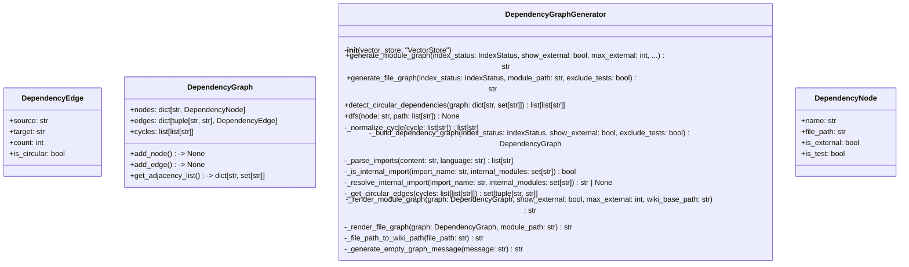

# File Overview

This file, `src/local_deepwiki/generators/dependency_graph.py`, provides functionality for generating dependency graphs of code modules and files. It is used to visualize relationships between modules and files in a project, identifying internal and external dependencies, as well as circular dependencies.

The module uses [`VectorStore`](../core/vectorstore.md) to retrieve indexed code chunks, and it generates Mermaid flowchart representations of these dependencies. It supports filtering for test files and external dependencies.

## Dependencies

This file imports:
- `re` for regular expressions
- `defaultdict` from `collections` for grouping data
- `dataclass` and `field` from `dataclasses` for defining structured data
- `Path` from `pathlib` for handling file paths
- `TYPE_CHECKING` from `typing` for conditional imports
- [`get_logger`](../logging.md) from `local_deepwiki.logging` for logging
- [`ChunkType`](../models.md) and [`IndexStatus`](../models.md) from `local_deepwiki.models`
- [`VectorStore`](../core/vectorstore.md) from `local_deepwiki.core.vectorstore`

## Integration

This file is used by:
- `test_dependency_graph` tests
- `test_diagrams` tests

It is closely related to:
- `src/local_deepwiki/core/__init__.py`
- `src/local_deepwiki/generators/source_refs.py`
- `src/local_deepwiki/plugins/base.py`
- `tests/__init__.py`
- `tests/test_plugins.py`

# Classes

## DependencyNode

A node in the dependency graph.

### Attributes
- `name`: The name of the node (module or file).
- `file_path`: The file path associated with the node.
- `is_external`: Whether the node refers to an external module.
- `is_test`: Whether the node represents a test file or module.

## DependencyEdge

An edge in the dependency graph.

### Attributes
- `source`: The source node name.
- `target`: The target node name.
- `count`: Number of times the dependency occurs.
- `is_circular`: Whether the edge is part of a circular dependency.

## DependencyGraph

A complete dependency graph.

### Attributes
- `nodes`: Dictionary mapping node names to `DependencyNode` objects.
- `edges`: Dictionary mapping tuples of `(source, target)` to `DependencyEdge` objects.
- `cycles`: List of cycles found in the graph, each cycle being a list of node names.

### Methods
- `add_node(node: DependencyNode) -> None`: Adds a node to the graph if it doesn't already exist.
- `add_edge(source: str, target: str) -> None`: Adds an edge to the graph.

## DependencyGraphGenerator

The [main](../export/pdf.md) class for generating dependency graphs from indexed code chunks.

### Methods
- `__init__(vector_store: VectorStore)`: Initializes the generator with a vector store.
- `generate_module_graph(index_status: IndexStatus, show_external: bool, max_external: int, exclude_tests: bool, wiki_base_path: str) -> str`: Generates a Mermaid graph of module dependencies.
- `generate_file_graph(index_status: IndexStatus, module_path: str, exclude_tests: bool) -> str`: Generates a Mermaid graph for files within a module.
- `detect_circular_dependencies(graph: dict[str, set[str]]) -> list[list[str]]`: Finds all circular dependency cycles using DFS.
- `_build_dependency_graph(index_status: IndexStatus, show_external: bool, exclude_tests: bool) -> DependencyGraph`: Builds a dependency graph from indexed chunks.
- `_parse_imports(content: str, language: str) -> list[str]`: Parses import statements from code content.
- `_is_internal_import(import_name: str, internal_modules: set[str]) -> bool`: Checks if an import refers to an internal module.
- `_resolve_internal_import(import_name: str, internal_modules: set[str]) -> str`: Resolves an internal import to a module name.
- `_get_circular_edges(cycles: list[list[str]], graph: dict[str, set[str]]) -> list[tuple[str, str]]`: Gets edges that are part of circular dependencies.
- `_render_module_graph(graph: DependencyGraph, show_external: bool, max_external: int) -> str`: Renders the module graph to a Mermaid string.
- `_render_file_graph(graph: DependencyGraph, module_path: str) -> str`: Renders the file graph to a Mermaid string.
- `_file_path_to_wiki_path(file_path: str) -> str`: Converts a file path to a wiki path.
- `_generate_empty_graph_message(module_path: str) -> str`: Generates a message for an empty graph.

# Functions

## _sanitize_mermaid_name

**Note**: This function is not defined in the provided code.

## _is_test_path

**Note**: This function is not defined in the provided code.

## _extract_module_name

**Note**: This function is not defined in the provided code.

## _get_directory_module

**Note**: This function is not defined in the provided code.

## generate_dependency_graph_page

**Note**: This function is not defined in the provided code.

# Usage Examples

## Initialize `DependencyGraphGenerator`

```python
from local_deepwiki.core.vectorstore import VectorStore
from local_deepwiki.generators.dependency_graph import DependencyGraphGenerator

vector_store = VectorStore()
generator = DependencyGraphGenerator(vector_store)
```

## Generate Module Graph

```python
graph_str = await generator.generate_module_graph(
    index_status=index_status,
    show_external=True,
    max_external=5,
    exclude_tests=True,
    wiki_base_path="/wiki"
)
```

## Generate File Graph

```python
file_graph_str = await generator.generate_file_graph(
    index_status=index_status,
    module_path="src/my_module",
    exclude_tests=True
)
```

## API Reference

### class `DependencyNode`

A node in the dependency graph.


<details>
<summary>View Source (lines 69-75) | <a href="https://github.com/UrbanDiver/local-deepwiki-mcp/blob/[main](../export/pdf.md)/src/local_deepwiki/generators/dependency_graph.py#L69-L75">GitHub</a></summary>

```python
class DependencyNode:
    """A node in the dependency graph."""

    name: str
    file_path: str
    is_external: bool = False
    is_test: bool = False
```

</details>

### class `DependencyEdge`

An edge in the dependency graph.


<details>
<summary>View Source (lines 79-85) | <a href="https://github.com/UrbanDiver/local-deepwiki-mcp/blob/[main](../export/pdf.md)/src/local_deepwiki/generators/dependency_graph.py#L79-L85">GitHub</a></summary>

```python
class DependencyEdge:
    """An edge in the dependency graph."""

    source: str
    target: str
    count: int = 1
    is_circular: bool = False
```

</details>

### class `DependencyGraph`

A complete dependency graph.

**Methods:**


<details>
<summary>View Source (lines 89-114) | <a href="https://github.com/UrbanDiver/local-deepwiki-mcp/blob/[main](../export/pdf.md)/src/local_deepwiki/generators/dependency_graph.py#L89-L114">GitHub</a></summary>

```python
class DependencyGraph:
    """A complete dependency graph."""

    nodes: dict[str, DependencyNode] = field(default_factory=dict)
    edges: dict[tuple[str, str], DependencyEdge] = field(default_factory=dict)
    cycles: list[list[str]] = field(default_factory=list)

    def add_node(self, node: DependencyNode) -> None:
        """Add a node to the graph."""
        if node.name not in self.nodes:
            self.nodes[node.name] = node

    def add_edge(self, source: str, target: str) -> None:
        """Add an edge to the graph."""
        key = (source, target)
        if key in self.edges:
            self.edges[key].count += 1
        else:
            self.edges[key] = DependencyEdge(source=source, target=target)

    def get_adjacency_list(self) -> dict[str, set[str]]:
        """Get adjacency list representation of the graph."""
        adj: dict[str, set[str]] = defaultdict(set)
        for (source, target), _ in self.edges.items():
            adj[source].add(target)
        return dict(adj)
```

</details>

#### `add_node`

```python
def add_node(node: DependencyNode) -> None
```

Add a node to the graph.


| [Parameter](api_docs.md) | Type | Default | Description |
|-----------|------|---------|-------------|
| `node` | `DependencyNode` | - | - |


<details>
<summary>View Source (lines 89-114) | <a href="https://github.com/UrbanDiver/local-deepwiki-mcp/blob/[main](../export/pdf.md)/src/local_deepwiki/generators/dependency_graph.py#L89-L114">GitHub</a></summary>

```python
class DependencyGraph:
    """A complete dependency graph."""

    nodes: dict[str, DependencyNode] = field(default_factory=dict)
    edges: dict[tuple[str, str], DependencyEdge] = field(default_factory=dict)
    cycles: list[list[str]] = field(default_factory=list)

    def add_node(self, node: DependencyNode) -> None:
        """Add a node to the graph."""
        if node.name not in self.nodes:
            self.nodes[node.name] = node

    def add_edge(self, source: str, target: str) -> None:
        """Add an edge to the graph."""
        key = (source, target)
        if key in self.edges:
            self.edges[key].count += 1
        else:
            self.edges[key] = DependencyEdge(source=source, target=target)

    def get_adjacency_list(self) -> dict[str, set[str]]:
        """Get adjacency list representation of the graph."""
        adj: dict[str, set[str]] = defaultdict(set)
        for (source, target), _ in self.edges.items():
            adj[source].add(target)
        return dict(adj)
```

</details>

#### `add_edge`

```python
def add_edge(source: str, target: str) -> None
```

Add an edge to the graph.


| [Parameter](api_docs.md) | Type | Default | Description |
|-----------|------|---------|-------------|
| `source` | `str` | - | - |
| `target` | `str` | - | - |


<details>
<summary>View Source (lines 89-114) | <a href="https://github.com/UrbanDiver/local-deepwiki-mcp/blob/[main](../export/pdf.md)/src/local_deepwiki/generators/dependency_graph.py#L89-L114">GitHub</a></summary>

```python
class DependencyGraph:
    """A complete dependency graph."""

    nodes: dict[str, DependencyNode] = field(default_factory=dict)
    edges: dict[tuple[str, str], DependencyEdge] = field(default_factory=dict)
    cycles: list[list[str]] = field(default_factory=list)

    def add_node(self, node: DependencyNode) -> None:
        """Add a node to the graph."""
        if node.name not in self.nodes:
            self.nodes[node.name] = node

    def add_edge(self, source: str, target: str) -> None:
        """Add an edge to the graph."""
        key = (source, target)
        if key in self.edges:
            self.edges[key].count += 1
        else:
            self.edges[key] = DependencyEdge(source=source, target=target)

    def get_adjacency_list(self) -> dict[str, set[str]]:
        """Get adjacency list representation of the graph."""
        adj: dict[str, set[str]] = defaultdict(set)
        for (source, target), _ in self.edges.items():
            adj[source].add(target)
        return dict(adj)
```

</details>

#### `get_adjacency_list`

```python
def get_adjacency_list() -> dict[str, set[str]]
```

Get adjacency list representation of the graph.


<details>
<summary>View Source (lines 89-114) | <a href="https://github.com/UrbanDiver/local-deepwiki-mcp/blob/[main](../export/pdf.md)/src/local_deepwiki/generators/dependency_graph.py#L89-L114">GitHub</a></summary>

```python
class DependencyGraph:
    """A complete dependency graph."""

    nodes: dict[str, DependencyNode] = field(default_factory=dict)
    edges: dict[tuple[str, str], DependencyEdge] = field(default_factory=dict)
    cycles: list[list[str]] = field(default_factory=list)

    def add_node(self, node: DependencyNode) -> None:
        """Add a node to the graph."""
        if node.name not in self.nodes:
            self.nodes[node.name] = node

    def add_edge(self, source: str, target: str) -> None:
        """Add an edge to the graph."""
        key = (source, target)
        if key in self.edges:
            self.edges[key].count += 1
        else:
            self.edges[key] = DependencyEdge(source=source, target=target)

    def get_adjacency_list(self) -> dict[str, set[str]]:
        """Get adjacency list representation of the graph."""
        adj: dict[str, set[str]] = defaultdict(set)
        for (source, target), _ in self.edges.items():
            adj[source].add(target)
        return dict(adj)
```

</details>

### class `DependencyGraphGenerator`

Generator for module and file dependency graphs.  This class analyzes code imports from indexed chunks and generates Mermaid diagrams showing module interdependencies, including detection of circular dependencies.

**Methods:**


<details>
<summary>View Source (lines 215-823) | <a href="https://github.com/UrbanDiver/local-deepwiki-mcp/blob/[main](../export/pdf.md)/src/local_deepwiki/generators/dependency_graph.py#L215-L823">GitHub</a></summary>

```python
class DependencyGraphGenerator:
    # Methods: __init__, generate_module_graph, generate_file_graph, detect_circular_dependencies, dfs, _normalize_cycle, _build_dependency_graph, _parse_imports, _is_internal_import, _resolve_internal_import, _get_circular_edges, _render_module_graph, _render_file_graph, _file_path_to_wiki_path, _generate_empty_graph_message
```

</details>

#### `__init__`

```python
def __init__(vector_store: "VectorStore")
```

Initialize the dependency graph generator.


| [Parameter](api_docs.md) | Type | Default | Description |
|-----------|------|---------|-------------|
| `vector_store` | `"VectorStore"` | - | Vector store with indexed code chunks. |


<details>
<summary>View Source (lines 223-230) | <a href="https://github.com/UrbanDiver/local-deepwiki-mcp/blob/[main](../export/pdf.md)/src/local_deepwiki/generators/dependency_graph.py#L223-L230">GitHub</a></summary>

```python
def __init__(self, vector_store: "VectorStore"):
        """Initialize the dependency graph generator.

        Args:
            vector_store: Vector store with indexed code chunks.
        """
        self._store = vector_store
        self._project_name: str = ""
```

</details>

#### `generate_module_graph`

```python
async def generate_module_graph(index_status: IndexStatus, show_external: bool = False, max_external: int = 10, exclude_tests: bool = True, wiki_base_path: str = "") -> str
```

Generate Mermaid graph of module dependencies.


| [Parameter](api_docs.md) | Type | Default | Description |
|-----------|------|---------|-------------|
| `index_status` | [`IndexStatus`](../models.md) | - | Index status with file information. |
| `show_external` | `bool` | `False` | Whether to show external dependencies. |
| `max_external` | `int` | `10` | Maximum external dependencies to show. |
| `exclude_tests` | `bool` | `True` | Whether to exclude test modules. |
| `wiki_base_path` | `str` | `""` | Base path for wiki links. |


<details>
<summary>View Source (lines 232-280) | <a href="https://github.com/UrbanDiver/local-deepwiki-mcp/blob/[main](../export/pdf.md)/src/local_deepwiki/generators/dependency_graph.py#L232-L280">GitHub</a></summary>

```python
async def generate_module_graph(
        self,
        index_status: IndexStatus,
        show_external: bool = False,
        max_external: int = 10,
        exclude_tests: bool = True,
        wiki_base_path: str = "",
    ) -> str:
        """Generate Mermaid graph of module dependencies.

        Args:
            index_status: Index status with file information.
            show_external: Whether to show external dependencies.
            max_external: Maximum external dependencies to show.
            exclude_tests: Whether to exclude test modules.
            wiki_base_path: Base path for wiki links.

        Returns:
            Mermaid flowchart markdown string showing module dependencies.
        """
        # Extract project name from repo path
        self._project_name = Path(index_status.repo_path).name.lower().replace("-", "_")

        # Build the dependency graph
        graph = await self._build_dependency_graph(
            index_status=index_status,
            show_external=show_external,
            exclude_tests=exclude_tests,
        )

        if not graph.nodes:
            return self._generate_empty_graph_message("No module dependencies found.")

        # Detect circular dependencies
        graph.cycles = self.detect_circular_dependencies(graph.get_adjacency_list())

        # Mark circular edges
        circular_edges = self._get_circular_edges(graph.cycles)
        for edge_key in circular_edges:
            if edge_key in graph.edges:
                graph.edges[edge_key].is_circular = True

        # Generate Mermaid diagram
        return self._render_module_graph(
            graph=graph,
            show_external=show_external,
            max_external=max_external,
            wiki_base_path=wiki_base_path,
        )
```

</details>

#### `generate_file_graph`

```python
async def generate_file_graph(index_status: IndexStatus, module_path: str, exclude_tests: bool = True) -> str
```

Generate Mermaid graph for files within a module.


| [Parameter](api_docs.md) | Type | Default | Description |
|-----------|------|---------|-------------|
| `index_status` | [`IndexStatus`](../models.md) | - | Index status with file information. |
| `module_path` | `str` | - | Module/directory path to show files for. |
| `exclude_tests` | `bool` | `True` | Whether to exclude test files. |


<details>
<summary>View Source (lines 282-359) | <a href="https://github.com/UrbanDiver/local-deepwiki-mcp/blob/[main](../export/pdf.md)/src/local_deepwiki/generators/dependency_graph.py#L282-L359">GitHub</a></summary>

```python
async def generate_file_graph(
        self,
        index_status: IndexStatus,
        module_path: str,
        exclude_tests: bool = True,
    ) -> str:
        """Generate Mermaid graph for files within a module.

        Args:
            index_status: Index status with file information.
            module_path: Module/directory path to show files for.
            exclude_tests: Whether to exclude test files.

        Returns:
            Mermaid flowchart markdown string showing file dependencies.
        """
        self._project_name = Path(index_status.repo_path).name.lower().replace("-", "_")

        # Get files in the specified module
        module_files = [
            f for f in index_status.files if module_path in f.path and f.path.endswith(".py")
        ]

        if exclude_tests:
            module_files = [f for f in module_files if not _is_test_path(f.path)]

        if not module_files:
            return self._generate_empty_graph_message(f"No files found in module: {module_path}")

        # Search for import chunks in these files
        graph = DependencyGraph()

        for file_info in module_files:
            file_name = Path(file_info.path).stem
            graph.add_node(
                DependencyNode(
                    name=file_name,
                    file_path=file_info.path,
                    is_test=_is_test_path(file_info.path),
                )
            )

        # Get import chunks for files in this module
        chunks = await self._store.get_chunks_by_file(module_files[0].path) if module_files else []

        # Also search for imports mentioning the module
        search_results = await self._store.search(
            f"import {module_path}",
            limit=100,
            chunk_type="import",
        )

        for result in search_results:
            chunk = result.chunk
            if chunk.chunk_type != ChunkType.IMPORT:
                continue

            source_file = Path(chunk.file_path).stem
            if module_path not in chunk.file_path:
                continue

            # Parse imports from content
            imports = self._parse_imports(chunk.content, chunk.language.value)
            for imp in imports:
                # Check if import is within the module
                if module_path in imp or imp in [Path(f.path).stem for f in module_files]:
                    target_file = imp.split(".")[-1]
                    if target_file in [Path(f.path).stem for f in module_files]:
                        graph.add_edge(source_file, target_file)

        # Detect cycles
        graph.cycles = self.detect_circular_dependencies(graph.get_adjacency_list())
        circular_edges = self._get_circular_edges(graph.cycles)
        for edge_key in circular_edges:
            if edge_key in graph.edges:
                graph.edges[edge_key].is_circular = True

        return self._render_file_graph(graph, module_path)
```

</details>

#### `detect_circular_dependencies`

```python
def detect_circular_dependencies(graph: dict[str, set[str]]) -> list[list[str]]
```

Find all circular dependency cycles using DFS.


| [Parameter](api_docs.md) | Type | Default | Description |
|-----------|------|---------|-------------|
| `graph` | `dict[str, set[str]]` | - | Adjacency list mapping module to its dependencies. |


<details>
<summary>View Source (lines 361-398) | <a href="https://github.com/UrbanDiver/local-deepwiki-mcp/blob/[main](../export/pdf.md)/src/local_deepwiki/generators/dependency_graph.py#L361-L398">GitHub</a></summary>

```python
def detect_circular_dependencies(self, graph: dict[str, set[str]]) -> list[list[str]]:
        """Find all circular dependency cycles using DFS.

        Args:
            graph: Adjacency list mapping module to its dependencies.

        Returns:
            List of cycles, where each cycle is a list of module names.
        """
        cycles: list[list[str]] = []
        visited: set[str] = set()
        rec_stack: set[str] = set()

        def dfs(node: str, path: list[str]) -> None:
            visited.add(node)
            rec_stack.add(node)
            path.append(node)

            for neighbor in graph.get(node, set()):
                if neighbor not in visited:
                    dfs(neighbor, path.copy())
                elif neighbor in rec_stack:
                    # Found a cycle
                    cycle_start = path.index(neighbor) if neighbor in path else -1
                    if cycle_start >= 0:
                        cycle = path[cycle_start:] + [neighbor]
                        # Normalize cycle to avoid duplicates
                        normalized = self._normalize_cycle(cycle)
                        if normalized not in cycles:
                            cycles.append(normalized)

            rec_stack.remove(node)

        for node in graph:
            if node not in visited:
                dfs(node, [])

        return cycles
```

</details>

#### `dfs`

```python
def dfs(node: str, path: list[str]) -> None
```


| [Parameter](api_docs.md) | Type | Default | Description |
|-----------|------|---------|-------------|
| `node` | `str` | - | - |
| `path` | `list[str]` | - | - |


---


<details>
<summary>View Source (lines 374-392) | <a href="https://github.com/UrbanDiver/local-deepwiki-mcp/blob/[main](../export/pdf.md)/src/local_deepwiki/generators/dependency_graph.py#L374-L392">GitHub</a></summary>

```python
def dfs(node: str, path: list[str]) -> None:
            visited.add(node)
            rec_stack.add(node)
            path.append(node)

            for neighbor in graph.get(node, set()):
                if neighbor not in visited:
                    dfs(neighbor, path.copy())
                elif neighbor in rec_stack:
                    # Found a cycle
                    cycle_start = path.index(neighbor) if neighbor in path else -1
                    if cycle_start >= 0:
                        cycle = path[cycle_start:] + [neighbor]
                        # Normalize cycle to avoid duplicates
                        normalized = self._normalize_cycle(cycle)
                        if normalized not in cycles:
                            cycles.append(normalized)

            rec_stack.remove(node)
```

</details>

### Functions

#### `generate_dependency_graph_page`

```python
async def generate_dependency_graph_page(index_status: IndexStatus, vector_store: "VectorStore", show_external: bool = True, max_external: int = 10, wiki_base_path: str = "files/") -> str
```

Generate a complete dependency graph wiki page.


| [Parameter](api_docs.md) | Type | Default | Description |
|-----------|------|---------|-------------|
| `index_status` | [`IndexStatus`](../models.md) | - | Index status with file information. |
| `vector_store` | `"VectorStore"` | - | Vector store with indexed chunks. |
| `show_external` | `bool` | `True` | Whether to show external dependencies. |
| `max_external` | `int` | `10` | Maximum external dependencies to show. |
| `wiki_base_path` | `str` | `"files/"` | Base path for wiki links. |

**Returns:** `str`


<details>
<summary>View Source (lines 826-896) | <a href="https://github.com/UrbanDiver/local-deepwiki-mcp/blob/[main](../export/pdf.md)/src/local_deepwiki/generators/dependency_graph.py#L826-L896">GitHub</a></summary>

```python
async def generate_dependency_graph_page(
    index_status: IndexStatus,
    vector_store: "VectorStore",
    show_external: bool = True,
    max_external: int = 10,
    wiki_base_path: str = "files/",
) -> str:
    """Generate a complete dependency graph wiki page.

    Args:
        index_status: Index status with file information.
        vector_store: Vector store with indexed chunks.
        show_external: Whether to show external dependencies.
        max_external: Maximum external dependencies to show.
        wiki_base_path: Base path for wiki links.

    Returns:
        Markdown content for the dependency graph page.
    """
    generator = DependencyGraphGenerator(vector_store)

    # Generate module graph
    module_graph = await generator.generate_module_graph(
        index_status=index_status,
        show_external=show_external,
        max_external=max_external,
        wiki_base_path=wiki_base_path,
    )

    content_parts = [
        "# Dependency Graph",
        "",
        "This page shows the module dependencies within the codebase.",
        "",
        "## Module Dependencies",
        "",
        "The following diagram shows how modules depend on each other. "
        "Click on a module to view its documentation.",
        "",
        module_graph,
        "",
    ]

    # Add legend
    content_parts.extend(
        [
            "## Legend",
            "",
            "- **Solid arrows**: Internal module dependencies",
            "- **Dashed arrows**: External dependencies",
            "- **Red dashed arrows**: Circular dependencies (should be addressed)",
            "- **Numbers on arrows**: Number of import statements",
            "",
        ]
    )

    # Add recommendations if cycles exist
    adj_list = {}  # We'd need to recalculate, but for now just note it's in the graph
    content_parts.extend(
        [
            "## Best Practices",
            "",
            "- Avoid circular dependencies as they can lead to import errors and make "
            "the codebase harder to understand",
            "- Consider using dependency injection or interfaces to break cycles",
            "- External dependencies are grouped separately for clarity",
            "",
        ]
    )

    return "\n".join(content_parts)
```

</details>

## Class Diagram



## Call Graph

```mermaid
flowchart TD
    N0[DependencyGraph]
    N1[DependencyGraph.get_adjacen...]
    N2[DependencyGraphGenerator._b...]
    N3[DependencyGraphGenerator._f...]
    N4[DependencyGraphGenerator._p...]
    N5[DependencyGraphGenerator._r...]
    N6[DependencyGraphGenerator.de...]
    N7[DependencyGraphGenerator.dfs]
    N8[DependencyGraphGenerator.ge...]
    N9[DependencyGraphGenerator.ge...]
    N10[DependencyNode]
    N11[Path]
    N12[_extract_module_name]
    N13[_generate_empty_graph_message]
    N14[_get_circular_edges]
    N15[_is_test_path]
    N16[_normalize_cycle]
    N17[_parse_imports]
    N18[_sanitize_mermaid_name]
    N19[add]
    N20[add_edge]
    N21[add_node]
    N22[copy]
    N23[defaultdict]
    N24[detect_circular_dependencies]
    N25[dfs]
    N26[generate_dependency_graph_page]
    N27[get_adjacency_list]
    N28[isdigit]
    N29[search]
    N18 --> N28
    N12 --> N11
    N1 --> N23
    N1 --> N19
    N9 --> N11
    N9 --> N13
    N9 --> N24
    N9 --> N27
    N9 --> N14
    N8 --> N11
    N8 --> N15
    N8 --> N13
    N8 --> N0
    N8 --> N21
    N8 --> N10
    N8 --> N29
    N8 --> N17
    N8 --> N20
    N8 --> N24
    N8 --> N27
    N8 --> N14
    N6 --> N19
    N6 --> N25
    N6 --> N22
    N6 --> N16
    N7 --> N19
    N7 --> N25
    N7 --> N22
    N7 --> N16
    N2 --> N0
    N2 --> N15
    N2 --> N12
    N2 --> N19
    N2 --> N21
    N2 --> N10
    N2 --> N29
    N2 --> N17
    N2 --> N20
    N4 --> N29
    N5 --> N23
    N5 --> N18
    N5 --> N10
    N3 --> N11
    classDef func fill:#e1f5fe
    class N0,N10,N11,N12,N13,N14,N15,N16,N17,N18,N19,N20,N21,N22,N23,N24,N25,N26,N27,N28,N29 func
    classDef method fill:#fff3e0
    class N1,N2,N3,N4,N5,N6,N7,N8,N9 method
```



## Used By

Functions and methods in this file and their callers:

- **`DependencyEdge`**: called by `DependencyGraph.add_edge`
- **`DependencyGraph`**: called by `DependencyGraphGenerator._build_dependency_graph`, `DependencyGraphGenerator.generate_file_graph`
- **`DependencyGraphGenerator`**: called by `generate_dependency_graph_page`
- **`DependencyNode`**: called by `DependencyGraphGenerator._build_dependency_graph`, `DependencyGraphGenerator._render_module_graph`, `DependencyGraphGenerator.generate_file_graph`
- **`Path`**: called by `DependencyGraphGenerator._file_path_to_wiki_path`, `DependencyGraphGenerator.generate_file_graph`, `DependencyGraphGenerator.generate_module_graph`, `_extract_module_name`, `_get_directory_module`
- **`_build_dependency_graph`**: called by `DependencyGraphGenerator.generate_module_graph`
- **`_extract_module_name`**: called by `DependencyGraphGenerator._build_dependency_graph`
- **`_file_path_to_wiki_path`**: called by `DependencyGraphGenerator._render_module_graph`
- **`_generate_empty_graph_message`**: called by `DependencyGraphGenerator.generate_file_graph`, `DependencyGraphGenerator.generate_module_graph`
- **`_get_circular_edges`**: called by `DependencyGraphGenerator.generate_file_graph`, `DependencyGraphGenerator.generate_module_graph`
- **`_is_internal_import`**: called by `DependencyGraphGenerator._build_dependency_graph`
- **`_is_test_path`**: called by `DependencyGraphGenerator._build_dependency_graph`, `DependencyGraphGenerator.generate_file_graph`
- **`_normalize_cycle`**: called by `DependencyGraphGenerator.detect_circular_dependencies`, `DependencyGraphGenerator.dfs`
- **`_parse_imports`**: called by `DependencyGraphGenerator._build_dependency_graph`, `DependencyGraphGenerator.generate_file_graph`
- **`_render_file_graph`**: called by `DependencyGraphGenerator.generate_file_graph`
- **`_render_module_graph`**: called by `DependencyGraphGenerator.generate_module_graph`
- **`_resolve_internal_import`**: called by `DependencyGraphGenerator._build_dependency_graph`
- **`_sanitize_mermaid_name`**: called by `DependencyGraphGenerator._render_file_graph`, `DependencyGraphGenerator._render_module_graph`
- **`add`**: called by `DependencyGraph.get_adjacency_list`, `DependencyGraphGenerator._build_dependency_graph`, `DependencyGraphGenerator._get_circular_edges`, `DependencyGraphGenerator.detect_circular_dependencies`, `DependencyGraphGenerator.dfs`
- **`add_edge`**: called by `DependencyGraphGenerator._build_dependency_graph`, `DependencyGraphGenerator.generate_file_graph`
- **`add_node`**: called by `DependencyGraphGenerator._build_dependency_graph`, `DependencyGraphGenerator.generate_file_graph`
- **`copy`**: called by `DependencyGraphGenerator.detect_circular_dependencies`, `DependencyGraphGenerator.dfs`
- **`defaultdict`**: called by `DependencyGraph.get_adjacency_list`, `DependencyGraphGenerator._render_module_graph`
- **`detect_circular_dependencies`**: called by `DependencyGraphGenerator.generate_file_graph`, `DependencyGraphGenerator.generate_module_graph`
- **`dfs`**: called by `DependencyGraphGenerator.detect_circular_dependencies`, `DependencyGraphGenerator.dfs`
- **`generate_module_graph`**: called by `generate_dependency_graph_page`
- **`get_adjacency_list`**: called by `DependencyGraphGenerator.generate_file_graph`, `DependencyGraphGenerator.generate_module_graph`
- **`get_chunks_by_file`**: called by `DependencyGraphGenerator.generate_file_graph`
- **`group`**: called by `DependencyGraphGenerator._parse_imports`
- **`isdigit`**: called by `_sanitize_mermaid_name`
- **`search`**: called by `DependencyGraphGenerator._build_dependency_graph`, `DependencyGraphGenerator._parse_imports`, `DependencyGraphGenerator.generate_file_graph`
- **`title`**: called by `DependencyGraphGenerator._render_module_graph`
- **`with_suffix`**: called by `DependencyGraphGenerator._file_path_to_wiki_path`

## Usage Examples

*Examples extracted from test files*

### Test basic name passes through

From `test_dependency_graph.py::TestSanitizeMermaidName::test_basic_name`:

```python
assert _sanitize_mermaid_name("MyModule") == "MyModule"
```

### Test dots are replaced

From `test_dependency_graph.py::TestSanitizeMermaidName::test_replaces_dots`:

```python
assert _sanitize_mermaid_name("core.parser") == "core_parser"
```

### Test detection of /test/ directory

From `test_dependency_graph.py::TestIsTestPath::test_detects_test_directory`:

```python
assert _is_test_path("src/test/parser.py") is True
assert _is_test_path("src/tests/parser.py") is True
```

### Test detection of test_ prefix

From `test_dependency_graph.py::TestIsTestPath::test_detects_test_prefix`:

```python
assert _is_test_path("test_parser.py") is True
assert _is_test_path("src/core/test_utils.py") is True
```

### Test extraction from src/ path

From `test_dependency_graph.py::TestExtractModuleName::test_extracts_from_src_path`:

```python
result = _extract_module_name("src/myproject/core/parser.py")
assert "parser" in result
```


## Last Modified

| Entity | Type | Author | Date | Commit |
|--------|------|--------|------|--------|
| `DependencyNode` | class | Brian Breidenbach | 1 week ago | `a64166a` Add seven medium-priority e... |
| `DependencyEdge` | class | Brian Breidenbach | 1 week ago | `a64166a` Add seven medium-priority e... |
| `DependencyGraph` | class | Brian Breidenbach | 1 week ago | `a64166a` Add seven medium-priority e... |
| `DependencyGraphGenerator` | class | Brian Breidenbach | 1 week ago | `a64166a` Add seven medium-priority e... |
| `__init__` | method | Brian Breidenbach | 1 week ago | `a64166a` Add seven medium-priority e... |
| `generate_module_graph` | method | Brian Breidenbach | 1 week ago | `a64166a` Add seven medium-priority e... |
| `generate_file_graph` | method | Brian Breidenbach | 1 week ago | `a64166a` Add seven medium-priority e... |
| `detect_circular_dependencies` | method | Brian Breidenbach | 1 week ago | `a64166a` Add seven medium-priority e... |
| `dfs` | method | Brian Breidenbach | 1 week ago | `a64166a` Add seven medium-priority e... |
| `_normalize_cycle` | method | Brian Breidenbach | 1 week ago | `a64166a` Add seven medium-priority e... |
| `_build_dependency_graph` | method | Brian Breidenbach | 1 week ago | `a64166a` Add seven medium-priority e... |
| `_parse_imports` | method | Brian Breidenbach | 1 week ago | `a64166a` Add seven medium-priority e... |
| `_is_internal_import` | method | Brian Breidenbach | 1 week ago | `a64166a` Add seven medium-priority e... |
| `_resolve_internal_import` | method | Brian Breidenbach | 1 week ago | `a64166a` Add seven medium-priority e... |
| `_get_circular_edges` | method | Brian Breidenbach | 1 week ago | `a64166a` Add seven medium-priority e... |
| `_render_module_graph` | method | Brian Breidenbach | 1 week ago | `a64166a` Add seven medium-priority e... |
| `_render_file_graph` | method | Brian Breidenbach | 1 week ago | `a64166a` Add seven medium-priority e... |
| `_file_path_to_wiki_path` | method | Brian Breidenbach | 1 week ago | `a64166a` Add seven medium-priority e... |
| `_generate_empty_graph_message` | method | Brian Breidenbach | 1 week ago | `a64166a` Add seven medium-priority e... |
| `_sanitize_mermaid_name` | function | Brian Breidenbach | 1 week ago | `a64166a` Add seven medium-priority e... |
| `_is_test_path` | function | Brian Breidenbach | 1 week ago | `a64166a` Add seven medium-priority e... |
| `_extract_module_name` | function | Brian Breidenbach | 1 week ago | `a64166a` Add seven medium-priority e... |
| `_get_directory_module` | function | Brian Breidenbach | 1 week ago | `a64166a` Add seven medium-priority e... |
| `generate_dependency_graph_page` | function | Brian Breidenbach | 1 week ago | `a64166a` Add seven medium-priority e... |

## Additional Source Code

Source code for functions and methods not listed in the API Reference above.

#### `_sanitize_mermaid_name`

<details>
<summary>View Source (lines 117-131) | <a href="https://github.com/UrbanDiver/local-deepwiki-mcp/blob/[main](../export/pdf.md)/src/local_deepwiki/generators/dependency_graph.py#L117-L131">GitHub</a></summary>

```python
def _sanitize_mermaid_name(name: str) -> str:
    """Sanitize a name for use in Mermaid diagrams.

    Args:
        name: Original name.

    Returns:
        Sanitized name safe for Mermaid syntax.
    """
    result = name.replace("<", "_").replace(">", "_").replace(" ", "_")
    result = result.replace("[", "_").replace("]", "_").replace(".", "_")
    result = result.replace("-", "_").replace(":", "_").replace("/", "_")
    if result and result[0].isdigit():
        result = "M" + result
    return result
```

</details>


#### `_is_test_path`

<details>
<summary>View Source (lines 134-153) | <a href="https://github.com/UrbanDiver/local-deepwiki-mcp/blob/[main](../export/pdf.md)/src/local_deepwiki/generators/dependency_graph.py#L134-L153">GitHub</a></summary>

```python
def _is_test_path(file_path: str) -> bool:
    """Check if a file path is a test file.

    Args:
        file_path: File path to check.

    Returns:
        True if the file is a test file.
    """
    path_lower = file_path.lower()
    return (
        "/test/" in path_lower
        or "/tests/" in path_lower
        or file_path.startswith("test_")
        or "/test_" in file_path
        or "_test.py" in file_path
        or ".test." in file_path
        or "/spec/" in path_lower
        or ".spec." in path_lower
    )
```

</details>


#### `_extract_module_name`

<details>
<summary>View Source (lines 156-187) | <a href="https://github.com/UrbanDiver/local-deepwiki-mcp/blob/[main](../export/pdf.md)/src/local_deepwiki/generators/dependency_graph.py#L156-L187">GitHub</a></summary>

```python
def _extract_module_name(file_path: str, project_root: str = "") -> str:
    """Extract module name from file path.

    Args:
        file_path: File path like 'src/myproject/core/parser.py'.
        project_root: Optional project root to strip.

    Returns:
        Module name like 'core.parser'.
    """
    path = Path(file_path)

    # Remove extension
    name = path.stem if path.suffix else path.name

    # Build module path from directory structure
    parts = list(path.parts[:-1])  # Exclude filename

    # Skip common root directories
    skip_dirs = {"src", "lib", "pkg", "app", "source", "sources"}
    while parts and parts[0].lower() in skip_dirs:
        parts = parts[1:]

    # Skip package directory if it matches project name
    if project_root:
        project_name = Path(project_root).name.lower().replace("-", "_")
        if parts and parts[0].lower().replace("-", "_") == project_name:
            parts = parts[1:]

    if parts:
        return ".".join(parts) + "." + name
    return name
```

</details>


#### `_get_directory_module`

<details>
<summary>View Source (lines 190-212) | <a href="https://github.com/UrbanDiver/local-deepwiki-mcp/blob/[main](../export/pdf.md)/src/local_deepwiki/generators/dependency_graph.py#L190-L212">GitHub</a></summary>

```python
def _get_directory_module(file_path: str) -> str:
    """Get the directory/module containing a file.

    Args:
        file_path: File path like 'src/myproject/core/parser.py'.

    Returns:
        Directory module name like 'core'.
    """
    path = Path(file_path)
    parts = list(path.parts[:-1])

    # Skip common root directories
    skip_dirs = {"src", "lib", "pkg", "app", "source", "sources"}
    while parts and parts[0].lower() in skip_dirs:
        parts = parts[1:]

    # Return the top-level module/directory
    if len(parts) >= 2:
        return parts[1] if parts[0] in skip_dirs else parts[0]
    elif parts:
        return parts[0]
    return "root"
```

</details>


#### `_normalize_cycle`

<details>
<summary>View Source (lines 400-420) | <a href="https://github.com/UrbanDiver/local-deepwiki-mcp/blob/[main](../export/pdf.md)/src/local_deepwiki/generators/dependency_graph.py#L400-L420">GitHub</a></summary>

```python
def _normalize_cycle(self, cycle: list[str]) -> list[str]:
        """Normalize a cycle for consistent comparison.

        Rotates the cycle so that the smallest element is first.

        Args:
            cycle: List of nodes forming a cycle.

        Returns:
            Normalized cycle list.
        """
        if len(cycle) <= 1:
            return cycle

        # Remove the duplicate last element if present
        if cycle[0] == cycle[-1] and len(cycle) > 1:
            cycle = cycle[:-1]

        # Find the minimum element and rotate
        min_idx = cycle.index(min(cycle))
        return cycle[min_idx:] + cycle[:min_idx]
```

</details>


#### `_build_dependency_graph`

<details>
<summary>View Source (lines 422-513) | <a href="https://github.com/UrbanDiver/local-deepwiki-mcp/blob/[main](../export/pdf.md)/src/local_deepwiki/generators/dependency_graph.py#L422-L513">GitHub</a></summary>

```python
async def _build_dependency_graph(
        self,
        index_status: IndexStatus,
        show_external: bool,
        exclude_tests: bool,
    ) -> DependencyGraph:
        """Build dependency graph from indexed chunks.

        Args:
            index_status: Index status with file information.
            show_external: Whether to include external dependencies.
            exclude_tests: Whether to exclude test files.

        Returns:
            Populated DependencyGraph.
        """
        graph = DependencyGraph()

        # Get all files and create nodes
        internal_modules: set[str] = set()
        file_to_module: dict[str, str] = {}

        for file_info in index_status.files:
            if exclude_tests and _is_test_path(file_info.path):
                continue

            module_name = _extract_module_name(file_info.path, index_status.repo_path)
            internal_modules.add(module_name)
            file_to_module[file_info.path] = module_name

            graph.add_node(
                DependencyNode(
                    name=module_name,
                    file_path=file_info.path,
                    is_test=_is_test_path(file_info.path),
                )
            )

        # Search for import chunks
        import_results = await self._store.search(
            "import require include from use",
            limit=500,
            chunk_type="import",
        )

        # Parse imports and add edges
        for result in import_results:
            chunk = result.chunk
            if chunk.chunk_type != ChunkType.IMPORT:
                continue

            if exclude_tests and _is_test_path(chunk.file_path):
                continue

            source_module = file_to_module.get(chunk.file_path)
            if not source_module:
                source_module = _extract_module_name(chunk.file_path, index_status.repo_path)
                graph.add_node(
                    DependencyNode(
                        name=source_module,
                        file_path=chunk.file_path,
                    )
                )
                internal_modules.add(source_module)

            # Parse imports from content
            imports = self._parse_imports(chunk.content, chunk.language.value)

            for imp in imports:
                # Check if internal or external
                is_internal = self._is_internal_import(imp, internal_modules)

                if is_internal:
                    # Map to internal module
                    target_module = self._resolve_internal_import(imp, internal_modules)
                    if target_module and target_module != source_module:
                        graph.add_edge(source_module, target_module)
                elif show_external:
                    # External dependency
                    ext_name = imp.split(".")[0]
                    if ext_name and not ext_name.startswith("_"):
                        if ext_name not in graph.nodes:
                            graph.add_node(
                                DependencyNode(
                                    name=ext_name,
                                    file_path="",
                                    is_external=True,
                                )
                            )
                        graph.add_edge(source_module, ext_name)

        return graph
```

</details>


#### `_parse_imports`

<details>
<summary>View Source (lines 515-541) | <a href="https://github.com/UrbanDiver/local-deepwiki-mcp/blob/[main](../export/pdf.md)/src/local_deepwiki/generators/dependency_graph.py#L515-L541">GitHub</a></summary>

```python
def _parse_imports(self, content: str, language: str) -> list[str]:
        """Parse import statements from code content.

        Args:
            content: Code content with import statements.
            language: Programming language.

        Returns:
            List of imported module names.
        """
        imports: list[str] = []

        # Get patterns for this language
        patterns = IMPORT_PATTERNS.get(language, IMPORT_PATTERNS.get("python", []))

        for line in content.split("\n"):
            line = line.strip()
            if not line:
                continue

            for pattern in patterns:
                match = pattern.search(line)
                if match:
                    imports.append(match.group(1))
                    break

        return imports
```

</details>


#### `_is_internal_import`

<details>
<summary>View Source (lines 543-571) | <a href="https://github.com/UrbanDiver/local-deepwiki-mcp/blob/[main](../export/pdf.md)/src/local_deepwiki/generators/dependency_graph.py#L543-L571">GitHub</a></summary>

```python
def _is_internal_import(self, import_name: str, internal_modules: set[str]) -> bool:
        """Check if an import refers to an internal module.

        Args:
            import_name: Import module name.
            internal_modules: Set of known internal module names.

        Returns:
            True if the import is internal.
        """
        # Direct match
        if import_name in internal_modules:
            return True

        # Check if import starts with project name
        if self._project_name and import_name.startswith(self._project_name + "."):
            return True

        # Check if any internal module matches prefix
        import_parts = import_name.split(".")
        for module in internal_modules:
            module_parts = module.split(".")
            # Check if import could be referring to this module
            if import_parts[-1] == module_parts[-1]:
                return True
            if import_name.endswith("." + module):
                return True

        return False
```

</details>


#### `_resolve_internal_import`

<details>
<summary>View Source (lines 573-603) | <a href="https://github.com/UrbanDiver/local-deepwiki-mcp/blob/[main](../export/pdf.md)/src/local_deepwiki/generators/dependency_graph.py#L573-L603">GitHub</a></summary>

```python
def _resolve_internal_import(
        self, import_name: str, internal_modules: set[str]
    ) -> str | None:
        """Resolve an import name to an internal module.

        Args:
            import_name: Import module name.
            internal_modules: Set of known internal module names.

        Returns:
            Resolved internal module name, or None if not found.
        """
        # Direct match
        if import_name in internal_modules:
            return import_name

        # Strip project prefix
        if self._project_name:
            if import_name.startswith(self._project_name + "."):
                stripped = import_name[len(self._project_name) + 1 :]
                if stripped in internal_modules:
                    return stripped

        # Match by last component
        import_parts = import_name.split(".")
        for module in internal_modules:
            module_parts = module.split(".")
            if import_parts[-1] == module_parts[-1]:
                return module

        return None
```

</details>


#### `_get_circular_edges`

<details>
<summary>View Source (lines 605-620) | <a href="https://github.com/UrbanDiver/local-deepwiki-mcp/blob/[main](../export/pdf.md)/src/local_deepwiki/generators/dependency_graph.py#L605-L620">GitHub</a></summary>

```python
def _get_circular_edges(self, cycles: list[list[str]]) -> set[tuple[str, str]]:
        """Extract edges that are part of circular dependencies.

        Args:
            cycles: List of detected cycles.

        Returns:
            Set of (source, target) tuples that form cycles.
        """
        edges: set[tuple[str, str]] = set()
        for cycle in cycles:
            for i in range(len(cycle)):
                source = cycle[i]
                target = cycle[(i + 1) % len(cycle)]
                edges.add((source, target))
        return edges
```

</details>


#### `_render_module_graph`

<details>
<summary>View Source (lines 622-739) | <a href="https://github.com/UrbanDiver/local-deepwiki-mcp/blob/[main](../export/pdf.md)/src/local_deepwiki/generators/dependency_graph.py#L622-L739">GitHub</a></summary>

```python
def _render_module_graph(
        self,
        graph: DependencyGraph,
        show_external: bool,
        max_external: int,
        wiki_base_path: str,
    ) -> str:
        """Render the module dependency graph as Mermaid markdown.

        Args:
            graph: The dependency graph to render.
            show_external: Whether to show external dependencies.
            max_external: Maximum external dependencies to show.
            wiki_base_path: Base path for wiki links.

        Returns:
            Mermaid flowchart markdown string.
        """
        lines = ["```mermaid", "flowchart TD"]

        # Group nodes by directory
        groups: dict[str, list[DependencyNode]] = defaultdict(list)
        external_nodes: list[DependencyNode] = []

        for node in graph.nodes.values():
            if node.is_external:
                external_nodes.append(node)
            else:
                group = node.name.split(".")[0] if "." in node.name else "root"
                groups[group].append(node)

        # Create node ID mapping
        node_ids: dict[str, str] = {}
        idx = 0

        # Add subgraphs for internal modules
        for group_name, nodes in sorted(groups.items()):
            safe_group = _sanitize_mermaid_name(group_name)
            display_name = group_name.replace("_", " ").title()

            lines.append(f"    subgraph {safe_group}[{display_name}]")

            for node in sorted(nodes, key=lambda n: n.name):
                node_id = f"M{idx}"
                node_ids[node.name] = node_id
                idx += 1

                display = node.name.split(".")[-1]
                lines.append(f"        {node_id}[{display}]")

            lines.append("    end")

        # Add external dependencies subgraph if enabled
        if show_external and external_nodes:
            ext_nodes_to_show = sorted(external_nodes, key=lambda n: n.name)[:max_external]

            lines.append("    subgraph external[External Dependencies]")
            for node in ext_nodes_to_show:
                node_id = f"E{idx}"
                node_ids[node.name] = node_id
                idx += 1
                lines.append(f"        {node_id}([{node.name}]):::external")
            lines.append("    end")

        # Add edges
        link_idx = 0
        circular_link_indices: list[int] = []

        for (source, target), edge in sorted(graph.edges.items()):
            source_id = node_ids.get(source)
            target_id = node_ids.get(target)

            if source_id and target_id and source_id != target_id:
                if edge.is_circular:
                    lines.append(f"    {source_id} -.->|circular| {target_id}")
                    circular_link_indices.append(link_idx)
                elif edge.count > 1:
                    lines.append(f"    {source_id} -->|{edge.count}| {target_id}")
                else:
                    # External edges get dashed lines
                    if graph.nodes.get(target, DependencyNode(name="", file_path="")).is_external:
                        lines.append(f"    {source_id} -.-> {target_id}")
                    else:
                        lines.append(f"    {source_id} --> {target_id}")
                link_idx += 1

        # Add click handlers for wiki links
        if wiki_base_path:
            for node_name, node_id in sorted(node_ids.items()):
                node = graph.nodes.get(node_name)
                if node and not node.is_external and node.file_path:
                    wiki_path = self._file_path_to_wiki_path(node.file_path)
                    lines.append(f'    click {node_id} "{wiki_base_path}{wiki_path}"')

        # Add styling
        lines.append("    classDef external fill:#2d2d3d,stroke:#666,stroke-dasharray: 5 5")
        lines.append("    classDef circular fill:#ff6b6b,stroke:#c92a2a")

        # Add circular dependency styling
        if circular_link_indices:
            lines.append("    linkStyle default stroke:#666")
            for idx in circular_link_indices:
                lines.append(f"    linkStyle {idx} stroke:#f00,stroke-width:2px")

        lines.append("```")

        # Add circular dependency warning if any
        if graph.cycles:
            lines.append("")
            lines.append("**Warning: Circular dependencies detected!**")
            lines.append("")
            for i, cycle in enumerate(graph.cycles[:5], 1):
                cycle_str = " -> ".join(cycle) + " -> " + cycle[0]
                lines.append(f"{i}. `{cycle_str}`")
            if len(graph.cycles) > 5:
                lines.append(f"   ... and {len(graph.cycles) - 5} more")

        return "\n".join(lines)
```

</details>


#### `_render_file_graph`

<details>
<summary>View Source (lines 741-795) | <a href="https://github.com/UrbanDiver/local-deepwiki-mcp/blob/[main](../export/pdf.md)/src/local_deepwiki/generators/dependency_graph.py#L741-L795">GitHub</a></summary>

```python
def _render_file_graph(self, graph: DependencyGraph, module_path: str) -> str:
        """Render the file dependency graph as Mermaid markdown.

        Args:
            graph: The dependency graph to render.
            module_path: Module path being visualized.

        Returns:
            Mermaid flowchart markdown string.
        """
        lines = ["```mermaid", f"flowchart TD"]
        lines.append(f"    subgraph {_sanitize_mermaid_name(module_path)}[{module_path}]")

        # Create node ID mapping
        node_ids: dict[str, str] = {}
        for i, (name, node) in enumerate(sorted(graph.nodes.items())):
            node_id = f"F{i}"
            node_ids[name] = node_id
            lines.append(f"        {node_id}[{name}]")

        lines.append("    end")

        # Add edges
        link_idx = 0
        circular_link_indices: list[int] = []

        for (source, target), edge in sorted(graph.edges.items()):
            source_id = node_ids.get(source)
            target_id = node_ids.get(target)

            if source_id and target_id:
                if edge.is_circular:
                    lines.append(f"    {source_id} -.->|circular| {target_id}")
                    circular_link_indices.append(link_idx)
                else:
                    lines.append(f"    {source_id} --> {target_id}")
                link_idx += 1

        # Add circular styling
        if circular_link_indices:
            lines.append("    linkStyle default stroke:#666")
            for idx in circular_link_indices:
                lines.append(f"    linkStyle {idx} stroke:#f00,stroke-width:2px")

        lines.append("```")

        # Add cycle warnings
        if graph.cycles:
            lines.append("")
            lines.append("**Warning: Circular dependencies detected!**")
            for cycle in graph.cycles[:3]:
                cycle_str = " -> ".join(cycle) + " -> " + cycle[0]
                lines.append(f"- `{cycle_str}`")

        return "\n".join(lines)
```

</details>


#### `_file_path_to_wiki_path`

<details>
<summary>View Source (lines 797-809) | <a href="https://github.com/UrbanDiver/local-deepwiki-mcp/blob/[main](../export/pdf.md)/src/local_deepwiki/generators/dependency_graph.py#L797-L809">GitHub</a></summary>

```python
def _file_path_to_wiki_path(self, file_path: str) -> str:
        """Convert a file path to its wiki page path.

        Args:
            file_path: Source file path.

        Returns:
            Wiki page path.
        """
        # Convert file path to wiki path
        path = Path(file_path)
        wiki_path = str(path.with_suffix(".md"))
        return f"files/{wiki_path}"
```

</details>


#### `_generate_empty_graph_message`

<details>
<summary>View Source (lines 811-823) | <a href="https://github.com/UrbanDiver/local-deepwiki-mcp/blob/[main](../export/pdf.md)/src/local_deepwiki/generators/dependency_graph.py#L811-L823">GitHub</a></summary>

```python
def _generate_empty_graph_message(self, message: str) -> str:
        """Generate a placeholder for empty graphs.

        Args:
            message: Message to display.

        Returns:
            Mermaid diagram with placeholder message.
        """
        return f"""```mermaid
flowchart TD
    A[{message}]
```"""
```

</details>

## Relevant Source Files

- `src/local_deepwiki/generators/dependency_graph.py:69-75`
