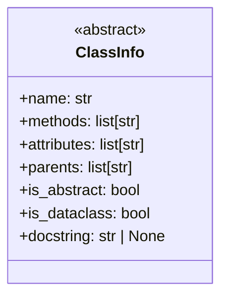

# diagrams.py

## File Overview

This module provides diagram generation functionality for the local_deepwiki system. It generates various types of diagrams including class diagrams, dependency graphs, module overviews, language distribution charts, sequence diagrams, and indexing progress charts using Mermaid syntax.

## Classes

### ClassInfo

A dataclass that stores information about a class extracted from code analysis.

**Purpose**: Holds structured data about classes including their attributes and methods for diagram generation.

## Functions

### sanitize_mermaid_name

Sanitizes names to be compatible with Mermaid diagram syntax.

**Parameters**:
- Input name to be sanitized

**Returns**: Sanitized name safe for use in Mermaid diagrams

### generate_class_diagram

Generates a Mermaid class diagram for the provided code chunks.

**Parameters**:
- Code chunks to analyze for class relationships

**Returns**: Mermaid class diagram as a string

### _extract_class_attributes

Extracts class attributes from code analysis.

**Purpose**: Helper function to identify and extract class attributes for diagram generation.

### _extract_method_signature

Extracts method signatures from code for class diagram generation.

**Purpose**: Helper function to parse and format method signatures for display in class diagrams.

### _is_test_module

Determines if a module is a test module.

**Returns**: Boolean indicating whether the module is for testing

### generate_dependency_graph

Generates a dependency graph showing relationships between modules.

**Purpose**: Creates a visual representation of module dependencies using Mermaid syntax.

### _parse_external_import

Parses external import statements to identify dependencies.

**Purpose**: Helper function to extract external library dependencies from import statements.

### _module_to_wiki_path

Converts module paths to wiki page paths.

**Purpose**: Helper function for generating proper links in dependency graphs.

### _find_circular_dependencies

Identifies circular dependencies in the module structure.

**Purpose**: Detects and reports circular import dependencies for debugging.

### dfs

Implements depth-first search algorithm.

**Purpose**: Utility function used in dependency analysis and circular dependency detection.

### _path_to_module

Converts file paths to module names.

**Purpose**: Helper function to transform file system paths into Python module notation.

### _parse_import_line

Parses individual import statements.

**Purpose**: Extracts module and item information from import lines for dependency analysis.

### generate_module_overview

Generates an overview diagram of the module structure.

**Purpose**: Creates a high-level view of the project's module organization.

### generate_language_pie_chart

Generates a pie chart showing language distribution in the codebase.

**Purpose**: Creates a visual representation of programming languages used in the project.

### generate_sequence_diagram

Generates sequence diagrams showing interaction flows.

**Purpose**: Creates Mermaid sequence diagrams to visualize method call flows and interactions.

### collect_participants

Collects participants for sequence diagram generation.

**Purpose**: Helper function to identify entities that participate in sequence interactions.

### add_calls

Adds method calls to sequence diagrams.

**Purpose**: Helper function to add interaction arrows and messages to sequence diagrams.

### generate_indexin

Generates indexing progress visualization.

**Purpose**: Creates diagrams showing the progress of code indexing operations.

## Related Components

This module works with:

- [ChunkType](../models.md): Enumeration for different types of code chunks
- [CodeChunk](../models.md): Data structure representing analyzed code segments  
- [IndexStatus](../models.md): Status tracking for indexing operations

The module integrates with the broader local_deepwiki system to provide visual documentation through various diagram types, enhancing the generated wiki with graphical representations of code structure and relationships.

## Usage Examples

```python
# Generate a class diagram from code chunks
class_diagram = generate_class_diagram(code_chunks)

# Create a dependency graph
dependency_graph = generate_dependency_graph(modules)

# Generate module overview
overview = generate_module_overview(project_structure)

# Create language distribution chart
language_chart = generate_language_pie_chart(file_analysis)
```

## API Reference

### class `ClassInfo`

Information about a class for diagram generation.

---

### Functions

#### `sanitize_mermaid_name`

```python
def sanitize_mermaid_name(name: str) -> str
```

Sanitize a name for use in Mermaid diagrams.


| [Parameter](api_docs.md) | Type | Default | Description |
|-----------|------|---------|-------------|
| `name` | `str` | - | Original name. |

**Returns:** `str`


#### `generate_class_diagram`

```python
def generate_class_diagram(chunks: list, show_attributes: bool = True, show_types: bool = True, max_methods: int = 15) -> str | None
```

Generate an enhanced Mermaid class diagram from code chunks.  Features: - Shows class attributes/properties (not just methods) - Shows type annotations for parameters and return types - Distinguishes abstract classes, dataclasses, protocols - Shows inheritance relationships


| [Parameter](api_docs.md) | Type | Default | Description |
|-----------|------|---------|-------------|
| `chunks` | `list` | - | List of [CodeChunk](../models.md) or [SearchResult](../models.md) objects. |
| `show_attributes` | `bool` | `True` | Whether to show class attributes. |
| `show_types` | `bool` | `True` | Whether to show type annotations. |
| `max_methods` | `int` | `15` | Maximum methods to show per class. |

**Returns:** `str | None`


#### `generate_dependency_graph`

```python
def generate_dependency_graph(chunks: list, project_name: str = "project", detect_circular: bool = True, show_external: bool = False, max_external: int = 10, wiki_base_path: str = "", exclude_tests: bool = True) -> str | None
```

Generate an enhanced Mermaid flowchart showing module dependencies.  Features: - Subgraphs grouping modules by top-level directory - Clickable nodes linking to wiki pages (when wiki_base_path provided) - Optional external dependency display with different styling - Circular dependency detection and highlighting


| [Parameter](api_docs.md) | Type | Default | Description |
|-----------|------|---------|-------------|
| `chunks` | `list` | - | List of [CodeChunk](../models.md) objects (should include IMPORT chunks). |
| `project_name` | `str` | `"project"` | Name of the project for filtering internal imports. |
| `detect_circular` | `bool` | `True` | Whether to highlight circular dependencies. |
| `show_external` | `bool` | `False` | Whether to show external (third-party) dependencies. |
| `max_external` | `int` | `10` | Maximum number of external dependencies to display. |
| `wiki_base_path` | `str` | `""` | Base path for wiki links (e.g., "files/"). Empty disables links. |
| `exclude_tests` | `bool` | `True` | Whether to exclude test modules from the graph (default: True). |

**Returns:** `str | None`


#### `dfs`

```python
def dfs(node: str, path: list[str], visited: set[str]) -> None
```


| [Parameter](api_docs.md) | Type | Default | Description |
|-----------|------|---------|-------------|
| `node` | `str` | - | - |
| `path` | `list[str]` | - | - |
| `visited` | `set[str]` | - | - |

**Returns:** `None`


#### `generate_module_overview`

```python
def generate_module_overview(index_status: IndexStatus, show_file_counts: bool = True) -> str | None
```

Generate a high-level module overview diagram.  Shows package structure with subgraphs for major directories.


| [Parameter](api_docs.md) | Type | Default | Description |
|-----------|------|---------|-------------|
| `index_status` | [`IndexStatus`](../models.md) | - | Index status with file information. |
| `show_file_counts` | `bool` | `True` | Whether to show file counts in nodes. |

**Returns:** `str | None`


#### `generate_language_pie_chart`

```python
def generate_language_pie_chart(index_status: IndexStatus) -> str | None
```

Generate a pie chart showing language distribution.


| [Parameter](api_docs.md) | Type | Default | Description |
|-----------|------|---------|-------------|
| `index_status` | [`IndexStatus`](../models.md) | - | Index status with language counts. |

**Returns:** `str | None`


#### `generate_sequence_diagram`

```python
def generate_sequence_diagram(call_graph: dict[str, list[str]], entry_point: str | None = None, max_depth: int = 5) -> str | None
```

Generate a sequence diagram from a call graph.  Shows the sequence of calls starting from an entry point.


| [Parameter](api_docs.md) | Type | Default | Description |
|-----------|------|---------|-------------|
| `call_graph` | `dict[str, list[str]]` | - | Mapping of caller to list of callees. |
| `entry_point` | `str | None` | `None` | Starting function (if None, uses most-called function). |
| `max_depth` | `int` | `5` | Maximum call depth to show. |

**Returns:** `str | None`


#### `collect_participants`

```python
def collect_participants(func: str, depth: int) -> None
```


| [Parameter](api_docs.md) | Type | Default | Description |
|-----------|------|---------|-------------|
| `func` | `str` | - | - |
| `depth` | `int` | - | - |

**Returns:** `None`


#### `add_calls`

```python
def add_calls(caller: str, depth: int) -> None
```


| [Parameter](api_docs.md) | Type | Default | Description |
|-----------|------|---------|-------------|
| `caller` | `str` | - | - |
| `depth` | `int` | - | - |

**Returns:** `None`


#### `generate_indexing_sequence`

```python
def generate_indexing_sequence() -> str
```

Generate sequence diagram for the indexing pipeline.  Shows how files are discovered, parsed, chunked, embedded, and stored in the vector database during repository indexing.

**Returns:** `str`


#### `generate_wiki_generation_sequence`

```python
def generate_wiki_generation_sequence() -> str
```

Generate sequence diagram for wiki generation.  Shows how the wiki generator searches for context, calls the LLM, and writes documentation files including parallel operations.

**Returns:** `str`


#### `generate_deep_research_sequence`

```python
def generate_deep_research_sequence() -> str
```

Generate sequence diagram for deep research pipeline.  Shows the 5-step deep research process: decomposition, parallel retrieval, gap analysis, follow-up retrieval, and synthesis.

**Returns:** `str`


#### `generate_workflow_sequences`

```python
def generate_workflow_sequences() -> str
```

Generate all workflow sequence diagrams combined.  Returns a markdown string with all three workflow diagrams: indexing, wiki generation, and deep research.

**Returns:** `str`


## Class Diagram



## Call Graph

```mermaid
flowchart TD
    N0[ClassInfo]
    N1[Path]
    N2[_extract_class_attributes]
    N3[_extract_method_signature]
    N4[_find_circular_dependencies]
    N5[_is_test_module]
    N6[_module_to_wiki_path]
    N7[_parse_external_import]
    N8[_parse_import_line]
    N9[_path_to_module]
    N10[add]
    N11[add_calls]
    N12[collect_participants]
    N13[compile]
    N14[copy]
    N15[dfs]
    N16[finditer]
    N17[generate_class_diagram]
    N18[generate_dependency_graph]
    N19[generate_indexing_sequence]
    N20[generate_module_overview]
    N21[generate_sequence_diagram]
    N22[generate_workflow_sequences]
    N23[group]
    N24[groups]
    N25[isdigit]
    N26[match]
    N27[sanitize_mermaid_name]
    N28[search]
    N29[title]
    N27 --> N25
    N17 --> N2
    N17 --> N0
    N17 --> N3
    N17 --> N13
    N17 --> N16
    N17 --> N23
    N17 --> N27
    N2 --> N13
    N2 --> N16
    N2 --> N24
    N3 --> N13
    N3 --> N28
    N3 --> N23
    N18 --> N9
    N18 --> N5
    N18 --> N10
    N18 --> N8
    N18 --> N7
    N18 --> N4
    N18 --> N27
    N18 --> N29
    N18 --> N6
    N7 --> N26
    N7 --> N23
    N4 --> N10
    N4 --> N15
    N4 --> N14
    N15 --> N10
    N15 --> N15
    N15 --> N14
    N9 --> N1
    N8 --> N26
    N8 --> N23
    N20 --> N1
    N20 --> N27
    N21 --> N10
    N21 --> N12
    N21 --> N27
    N21 --> N11
    N12 --> N10
    N12 --> N12
    N11 --> N27
    N11 --> N10
    N11 --> N11
    N22 --> N19
    classDef func fill:#e1f5fe
    class N0,N1,N2,N3,N4,N5,N6,N7,N8,N9,N10,N11,N12,N13,N14,N15,N16,N17,N18,N19,N20,N21,N22,N23,N24,N25,N26,N27,N28,N29 func
```



## Usage Examples

*Examples extracted from test files*

### Test basic name passes through

From `test_diagrams.py::test_basic_name`:

```python
assert sanitize_mermaid_name("MyClass") == "MyClass"
```

### Test angle brackets are replaced

From `test_diagrams.py::test_replaces_brackets`:

```python
assert sanitize_mermaid_name("List<int>") == "List_int_"
```

### Test extraction of class-level type annotations

From `test_diagrams.py::test_extracts_type_annotations`:

```python
attrs = _extract_class_attributes(content, "python")
assert "+name: str" in attrs
```

### Test extraction from __init__ assignments

From `test_diagrams.py::test_extracts_init_assignments`:

```python
attrs = _extract_class_attributes(content, "python")
assert "+value" in attrs
```

### Test extraction of return type

From `test_diagrams.py::test_extracts_return_type`:

```python
sig = _extract_method_signature(content)
assert "bool" in sig
```

## Relevant Source Files

- `src/local_deepwiki/generators/diagrams.py:12-21`

## See Also

- [test_diagrams](../../../tests/test_diagrams.md) - uses this
- [wiki](wiki.md) - uses this
- [models](../models.md) - dependency
- [crosslinks](crosslinks.md) - shares 4 dependencies
- [see_also](see_also.md) - shares 4 dependencies
