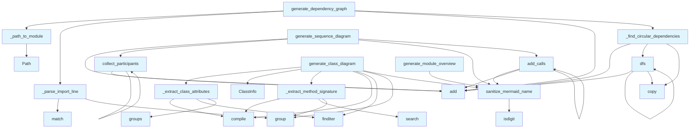

# File Overview

This module provides functions for generating various Mermaid diagrams from code analysis data. It supports generating class diagrams, dependency graphs, module overviews, language distribution charts, and sequence diagrams based on code chunks and index status information.

# Classes

## ClassInfo

Information about a class for diagram generation.

### Attributes

- `name`: str
- `methods`: list[str]
- `attributes`: list[str]
- `parents`: list[str]
- `is_abstract`: bool = False
- `is_dataclass`: bool = False
- `docstring`: str | None = None

# Functions

## sanitize_mermaid_name

Sanitize a name for use in Mermaid diagrams.

### Parameters

- `name` (str): Original name.

### Returns

- `str`: Sanitized name safe for Mermaid syntax.

## generate_class_diagram

Generate an enhanced Mermaid class diagram from code chunks.

### Parameters

- `chunks` (list): List of CodeChunk or SearchResult objects.
- `show_attributes` (bool): Whether to show class attributes.
- `show_types` (bool): Whether to show type annotations.
- `max_methods` (int): Maximum number of methods to show.

### Returns

- `str | None`: Mermaid class diagram string, or None if empty.

## _extract_class_attributes

[Function definition not fully shown in provided code]

## _extract_method_signature

[Function definition not fully shown in provided code]

## generate_dependency_graph

Generate a Mermaid flowchart showing module dependencies with circular detection.

### Parameters

- `chunks` (list): List of CodeChunk objects (should include IMPORT chunks).
- `project_name` (str): Name of the project for filtering internal imports.
- `detect_circular` (bool): Whether to highlight circular dependencies.

### Returns

- `str | None`: Mermaid flowchart markdown string, or None if no dependencies found.

## _find_circular_dependencies

Find circular dependencies in a dependency graph.

### Parameters

- `deps` (dict[str, set[str]]): Mapping of module to its dependencies.

### Returns

- `set[tuple[str, str]]`: Set of (from, to) tuples that form circular dependencies.

## dfs

[Function definition not fully shown in provided code]

## _path_to_module

[Function definition not fully shown in provided code]

## _parse_import_line

[Function definition not fully shown in provided code]

## generate_module_overview

Generate a high-level module overview diagram.

### Parameters

- `index_status` (IndexStatus): Index status with file information.
- `show_file_counts` (bool): Whether to show file counts in nodes.

### Returns

- `str | None`: Mermaid diagram string, or None if not enough structure.

## generate_language_pie_chart

Generate a pie chart showing language distribution.

### Parameters

- `index_status` (IndexStatus): Index status with language counts.

### Returns

- `str | None`: Mermaid pie chart string, or None if no languages.

## generate_sequence_diagram

Generate a sequence diagram from a call graph.

### Parameters

- `call_graph` (dict[str, list[str]]): Mapping of caller to list of callees.
- `entry_point` (str | None): Starting function (if None, uses most-called function).
- `max_depth` (int): Maximum call depth to show.

### Returns

- `str | None`: Mermaid sequence diagram string, or None if empty.

## collect_participants

[Function definition not fully shown in provided code]

## add_calls

[Function definition not fully shown in provided code]

# Usage Examples

## Generate a class diagram

```python
diagram = generate_class_diagram(chunks, show_attributes=True, show_types=True, max_methods=10)
```

## Generate a dependency graph

```python
graph = generate_dependency_graph(chunks, project_name="myproject", detect_circular=True)
```

## Generate a module overview

```python
overview = generate_module_overview(index_status, show_file_counts=True)
```

## Generate a language pie chart

```python
pie_chart = generate_language_pie_chart(index_status)
```

## Generate a sequence diagram

```python
sequence = generate_sequence_diagram(call_graph, entry_point="main", max_depth=3)
```

# Related Components

This module works with the following components:

- `CodeChunk` from `local_deepwiki.models`
- `IndexStatus` from `local_deepwiki.models`
- `ChunkType` from `local_deepwiki.models`

## API Reference

### class `ClassInfo`

Information about a class for diagram generation.

---

### Functions

#### `sanitize_mermaid_name`

```python
def sanitize_mermaid_name(name: str) -> str
```

Sanitize a name for use in Mermaid diagrams.


| [Parameter](api_docs.md) | Type | Default | Description |
|-----------|------|---------|-------------|
| `name` | `str` | - | Original name. |

**Returns:** `str`


#### `generate_class_diagram`

```python
def generate_class_diagram(chunks: list, show_attributes: bool = True, show_types: bool = True, max_methods: int = 15) -> str | None
```

Generate an enhanced Mermaid class diagram from code chunks.  Features: - Shows class attributes/properties (not just methods) - Shows type annotations for parameters and return types - Distinguishes abstract classes, dataclasses, protocols - Shows inheritance relationships


| [Parameter](api_docs.md) | Type | Default | Description |
|-----------|------|---------|-------------|
| `chunks` | `list` | - | List of CodeChunk or SearchResult objects. |
| `show_attributes` | `bool` | `True` | Whether to show class attributes. |
| `show_types` | `bool` | `True` | Whether to show type annotations. |
| `max_methods` | `int` | `15` | Maximum methods to show per class. |

**Returns:** `str | None`


#### `generate_dependency_graph`

```python
def generate_dependency_graph(chunks: list, project_name: str = "project", detect_circular: bool = True) -> str | None
```

Generate a Mermaid flowchart showing module dependencies with circular detection.


| [Parameter](api_docs.md) | Type | Default | Description |
|-----------|------|---------|-------------|
| `chunks` | `list` | - | List of CodeChunk objects (should include IMPORT chunks). |
| `project_name` | `str` | `"project"` | Name of the project for filtering internal imports. |
| `detect_circular` | `bool` | `True` | Whether to highlight circular dependencies. |

**Returns:** `str | None`


#### `dfs`

```python
def dfs(node: str, path: list[str], visited: set[str]) -> None
```


| [Parameter](api_docs.md) | Type | Default | Description |
|-----------|------|---------|-------------|
| `node` | `str` | - | - |
| `path` | `list[str]` | - | - |
| `visited` | `set[str]` | - | - |

**Returns:** `None`


#### `generate_module_overview`

```python
def generate_module_overview(index_status: IndexStatus, show_file_counts: bool = True) -> str | None
```

Generate a high-level module overview diagram.  Shows package structure with subgraphs for major directories.


| [Parameter](api_docs.md) | Type | Default | Description |
|-----------|------|---------|-------------|
| `index_status` | `IndexStatus` | - | Index status with file information. |
| `show_file_counts` | `bool` | `True` | Whether to show file counts in nodes. |

**Returns:** `str | None`


#### `generate_language_pie_chart`

```python
def generate_language_pie_chart(index_status: IndexStatus) -> str | None
```

Generate a pie chart showing language distribution.


| [Parameter](api_docs.md) | Type | Default | Description |
|-----------|------|---------|-------------|
| `index_status` | `IndexStatus` | - | Index status with language counts. |

**Returns:** `str | None`


#### `generate_sequence_diagram`

```python
def generate_sequence_diagram(call_graph: dict[str, list[str]], entry_point: str | None = None, max_depth: int = 5) -> str | None
```

Generate a sequence diagram from a call graph.  Shows the sequence of calls starting from an entry point.


| [Parameter](api_docs.md) | Type | Default | Description |
|-----------|------|---------|-------------|
| `call_graph` | `dict[str, list[str]]` | - | Mapping of caller to list of callees. |
| `entry_point` | `str | None` | `None` | Starting function (if None, uses most-called function). |
| `max_depth` | `int` | `5` | Maximum call depth to show. |

**Returns:** `str | None`


#### `collect_participants`

```python
def collect_participants(func: str, depth: int) -> None
```


| [Parameter](api_docs.md) | Type | Default | Description |
|-----------|------|---------|-------------|
| `func` | `str` | - | - |
| `depth` | `int` | - | - |

**Returns:** `None`


#### `add_calls`

```python
def add_calls(caller: str, depth: int) -> None
```


| [Parameter](api_docs.md) | Type | Default | Description |
|-----------|------|---------|-------------|
| `caller` | `str` | - | - |
| `depth` | `int` | - | - |

**Returns:** `None`


## Call Graph



## Relevant Source Files

- `src/local_deepwiki/generators/diagrams.py:12-21`

## See Also

- [wiki](wiki.md) - uses this
- [test_diagrams](../../../tests/test_diagrams.md) - uses this
- [crosslinks](crosslinks.md) - shares 4 dependencies
- [see_also](see_also.md) - shares 4 dependencies
- [api_docs](api_docs.md) - shares 4 dependencies
