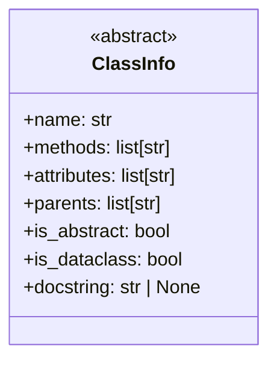

# diagrams.py

## File Overview

This module provides functionality for generating various types of diagrams for code documentation, including class diagrams, dependency graphs, module overviews, language distribution charts, sequence diagrams, and indexing status visualizations. The module works with code analysis data to create Mermaid diagram representations.

## Classes

### ClassInfo

A dataclass that stores information about a class extracted from code analysis.

## Functions

### sanitize_mermaid_name

Sanitizes names for use in Mermaid diagrams by handling special characters and ensuring valid diagram syntax.

### generate_class_diagram

Generates a Mermaid class diagram representation from code chunk data. Creates visual representations of classes, their attributes, methods, and relationships.

**Parameters:**
- Code chunk data containing class information
- Configuration options for diagram generation

**Returns:**
- String containing Mermaid class diagram syntax

### _extract_class_attributes

Internal helper function that extracts class attributes from code analysis data.

**Parameters:**
- Class data from code analysis

**Returns:**
- List of class attributes

### _extract_method_signature

Internal helper function that extracts method signatures from class methods.

**Parameters:**
- Method data from code analysis

**Returns:**
- Formatted method signature string

### _is_test_module

Determines if a given module is a test module based on naming conventions or structure.

**Parameters:**
- Module information

**Returns:**
- Boolean indicating if the module is a test module

### generate_dependency_graph

Creates a dependency graph showing relationships between modules and external libraries.

**Parameters:**
- Module dependency data
- Graph configuration options

**Returns:**
- String containing Mermaid graph syntax for dependencies

### _parse_external_import

Internal helper function that parses external import statements to identify third-party dependencies.

**Parameters:**
- Import statement data

**Returns:**
- Parsed external dependency information

### _module_to_wiki_path

Converts module paths to wiki-compatible path formats for linking.

**Parameters:**
- Module path string

**Returns:**
- Wiki-formatted path string

### _find_circular_dependencies

Identifies circular dependencies in the module dependency graph.

**Parameters:**
- Dependency graph data

**Returns:**
- List of circular dependency chains

### dfs

Performs depth-first search traversal for dependency analysis.

**Parameters:**
- Graph data structure
- Starting node
- Search parameters

**Returns:**
- Search results or path information

### _path_to_module

Converts file paths to module name format.

**Parameters:**
- File path

**Returns:**
- Module name string

### _parse_import_line

Parses individual import lines to extract dependency information.

**Parameters:**
- Import line string

**Returns:**
- Parsed import data

### generate_module_overview

Creates an overview diagram showing the structure and organization of modules in the codebase.

**Parameters:**
- Module structure data
- Overview configuration

**Returns:**
- String containing Mermaid diagram for module overview

### generate_language_pie_chart

Generates a pie chart showing the distribution of programming languages in the codebase.

**Parameters:**
- [Language](../models.md) usage data
- Chart configuration

**Returns:**
- String containing Mermaid pie chart syntax

### generate_sequence_diagram

Creates sequence diagrams showing interactions and call flows between components.

**Parameters:**
- Interaction data
- Sequence configuration

**Returns:**
- String containing Mermaid sequence diagram syntax

### collect_participants

Collects and identifies participants (classes, functions, modules) for sequence diagrams.

**Parameters:**
- Code analysis data

**Returns:**
- List of participants for sequence diagrams

### add_calls

Adds function/method call information to sequence diagrams.

**Parameters:**
- Call data
- Sequence diagram context

**Returns:**
- Updated sequence diagram with call information

### generate_indexin

Generates indexing status visualization showing the progress of code analysis and documentation.

**Parameters:**
- Indexing status data
- Visualization configuration

**Returns:**
- String containing indexing status diagram

## Related Components

This module works with several other components from the codebase:

- **[ChunkType](../models.md)**: Enumeration used to identify different types of code chunks
- **[CodeChunk](../models.md)**: Data structure containing analyzed code information
- **[IndexStatus](../models.md)**: Status tracking for code analysis and indexing progress

The module relies on the `re` module for regular expression operations, `dataclasses` for the ClassInfo structure, `pathlib` for file path handling, and `typing` for type annotations.

## Usage Examples

```python
# Generate a class diagram from code chunks
class_diagram = generate_class_diagram(code_chunks, config_options)

# Create a dependency graph
dependency_graph = generate_dependency_graph(module_data, graph_config)

# Generate module overview
overview = generate_module_overview(module_structure, overview_config)

# Create language distribution chart
language_chart = generate_language_pie_chart(language_data, chart_config)
```

## API Reference

### class `ClassInfo`

Information about a class for diagram generation.

---

### Functions

#### `sanitize_mermaid_name`

```python
def sanitize_mermaid_name(name: str) -> str
```

Sanitize a name for use in Mermaid diagrams.


| [Parameter](api_docs.md) | Type | Default | Description |
|-----------|------|---------|-------------|
| `name` | `str` | - | Original name. |

**Returns:** `str`


#### `generate_class_diagram`

```python
def generate_class_diagram(chunks: list, show_attributes: bool = True, show_types: bool = True, max_methods: int = 15) -> str | None
```

Generate an enhanced Mermaid class diagram from code chunks.  Features: - Shows class attributes/properties (not just methods) - Shows type annotations for parameters and return types - Distinguishes abstract classes, dataclasses, protocols - Shows inheritance relationships


| [Parameter](api_docs.md) | Type | Default | Description |
|-----------|------|---------|-------------|
| `chunks` | `list` | - | List of [CodeChunk](../models.md) or [SearchResult](../models.md) objects. |
| `show_attributes` | `bool` | `True` | Whether to show class attributes. |
| `show_types` | `bool` | `True` | Whether to show type annotations. |
| `max_methods` | `int` | `15` | Maximum methods to show per class. |

**Returns:** `str | None`


#### `generate_dependency_graph`

```python
def generate_dependency_graph(chunks: list, project_name: str = "project", detect_circular: bool = True, show_external: bool = False, max_external: int = 10, wiki_base_path: str = "", exclude_tests: bool = True) -> str | None
```

Generate an enhanced Mermaid flowchart showing module dependencies.  Features: - Subgraphs grouping modules by top-level directory - Clickable nodes linking to wiki pages (when wiki_base_path provided) - Optional external dependency display with different styling - Circular dependency detection and highlighting


| [Parameter](api_docs.md) | Type | Default | Description |
|-----------|------|---------|-------------|
| `chunks` | `list` | - | List of [CodeChunk](../models.md) objects (should include IMPORT chunks). |
| `project_name` | `str` | `"project"` | Name of the project for filtering internal imports. |
| `detect_circular` | `bool` | `True` | Whether to highlight circular dependencies. |
| `show_external` | `bool` | `False` | Whether to show external (third-party) dependencies. |
| `max_external` | `int` | `10` | Maximum number of external dependencies to display. |
| `wiki_base_path` | `str` | `""` | Base path for wiki links (e.g., "files/"). Empty disables links. |
| `exclude_tests` | `bool` | `True` | Whether to exclude test modules from the graph (default: True). |

**Returns:** `str | None`


#### `dfs`

```python
def dfs(node: str, path: list[str], visited: set[str]) -> None
```


| [Parameter](api_docs.md) | Type | Default | Description |
|-----------|------|---------|-------------|
| `node` | `str` | - | - |
| `path` | `list[str]` | - | - |
| `visited` | `set[str]` | - | - |

**Returns:** `None`


#### `generate_module_overview`

```python
def generate_module_overview(index_status: IndexStatus, show_file_counts: bool = True) -> str | None
```

Generate a high-level module overview diagram.  Shows package structure with subgraphs for major directories.


| [Parameter](api_docs.md) | Type | Default | Description |
|-----------|------|---------|-------------|
| `index_status` | [`IndexStatus`](../models.md) | - | Index status with file information. |
| `show_file_counts` | `bool` | `True` | Whether to show file counts in nodes. |

**Returns:** `str | None`


#### `generate_language_pie_chart`

```python
def generate_language_pie_chart(index_status: IndexStatus) -> str | None
```

Generate a pie chart showing language distribution.


| [Parameter](api_docs.md) | Type | Default | Description |
|-----------|------|---------|-------------|
| `index_status` | [`IndexStatus`](../models.md) | - | Index status with language counts. |

**Returns:** `str | None`


#### `generate_sequence_diagram`

```python
def generate_sequence_diagram(call_graph: dict[str, list[str]], entry_point: str | None = None, max_depth: int = 5) -> str | None
```

Generate a sequence diagram from a call graph.  Shows the sequence of calls starting from an entry point.


| [Parameter](api_docs.md) | Type | Default | Description |
|-----------|------|---------|-------------|
| `call_graph` | `dict[str, list[str]]` | - | Mapping of caller to list of callees. |
| `entry_point` | `str | None` | `None` | Starting function (if None, uses most-called function). |
| `max_depth` | `int` | `5` | Maximum call depth to show. |

**Returns:** `str | None`


#### `collect_participants`

```python
def collect_participants(func: str, depth: int) -> None
```


| [Parameter](api_docs.md) | Type | Default | Description |
|-----------|------|---------|-------------|
| `func` | `str` | - | - |
| `depth` | `int` | - | - |

**Returns:** `None`


#### `add_calls`

```python
def add_calls(caller: str, depth: int) -> None
```


| [Parameter](api_docs.md) | Type | Default | Description |
|-----------|------|---------|-------------|
| `caller` | `str` | - | - |
| `depth` | `int` | - | - |

**Returns:** `None`


#### `generate_indexing_sequence`

```python
def generate_indexing_sequence() -> str
```

Generate sequence diagram for the indexing pipeline.  Shows how files are discovered, parsed, chunked, embedded, and stored in the vector database during repository indexing.

**Returns:** `str`


#### `generate_wiki_generation_sequence`

```python
def generate_wiki_generation_sequence() -> str
```

Generate sequence diagram for wiki generation.  Shows how the wiki generator searches for context, calls the LLM, and writes documentation files including parallel operations.

**Returns:** `str`


#### `generate_deep_research_sequence`

```python
def generate_deep_research_sequence() -> str
```

Generate sequence diagram for deep research pipeline.  Shows the 5-step deep research process: decomposition, parallel retrieval, gap analysis, follow-up retrieval, and synthesis.

**Returns:** `str`


#### `generate_workflow_sequences`

```python
def generate_workflow_sequences() -> str
```

Generate all workflow sequence diagrams combined.  Returns a markdown string with all three workflow diagrams: indexing, wiki generation, and deep research.

**Returns:** `str`


## Class Diagram



## Call Graph

```mermaid
flowchart TD
    N0[ClassInfo]
    N1[Path]
    N2[_extract_class_attributes]
    N3[_extract_method_signature]
    N4[_find_circular_dependencies]
    N5[_is_test_module]
    N6[_module_to_wiki_path]
    N7[_parse_external_import]
    N8[_parse_import_line]
    N9[_path_to_module]
    N10[add]
    N11[add_calls]
    N12[collect_participants]
    N13[compile]
    N14[copy]
    N15[dfs]
    N16[finditer]
    N17[generate_class_diagram]
    N18[generate_dependency_graph]
    N19[generate_indexing_sequence]
    N20[generate_module_overview]
    N21[generate_sequence_diagram]
    N22[generate_workflow_sequences]
    N23[group]
    N24[groups]
    N25[isdigit]
    N26[match]
    N27[sanitize_mermaid_name]
    N28[search]
    N29[title]
    N27 --> N25
    N17 --> N2
    N17 --> N0
    N17 --> N3
    N17 --> N13
    N17 --> N16
    N17 --> N23
    N17 --> N27
    N2 --> N13
    N2 --> N16
    N2 --> N24
    N3 --> N13
    N3 --> N28
    N3 --> N23
    N18 --> N9
    N18 --> N5
    N18 --> N10
    N18 --> N8
    N18 --> N7
    N18 --> N4
    N18 --> N27
    N18 --> N29
    N18 --> N6
    N7 --> N26
    N7 --> N23
    N4 --> N10
    N4 --> N15
    N4 --> N14
    N15 --> N10
    N15 --> N15
    N15 --> N14
    N9 --> N1
    N8 --> N26
    N8 --> N23
    N20 --> N1
    N20 --> N27
    N21 --> N10
    N21 --> N12
    N21 --> N27
    N21 --> N11
    N12 --> N10
    N12 --> N12
    N11 --> N27
    N11 --> N10
    N11 --> N11
    N22 --> N19
    classDef func fill:#e1f5fe
    class N0,N1,N2,N3,N4,N5,N6,N7,N8,N9,N10,N11,N12,N13,N14,N15,N16,N17,N18,N19,N20,N21,N22,N23,N24,N25,N26,N27,N28,N29 func
```



## Usage Examples

*Examples extracted from test files*

### Test basic name passes through

From `test_diagrams.py::test_basic_name`:

```python
assert sanitize_mermaid_name("MyClass") == "MyClass"
```

### Test angle brackets are replaced

From `test_diagrams.py::test_replaces_brackets`:

```python
assert sanitize_mermaid_name("List<int>") == "List_int_"
```

### Test extraction of class-level type annotations

From `test_diagrams.py::test_extracts_type_annotations`:

```python
attrs = _extract_class_attributes(content, "python")
assert "+name: str" in attrs
```

### Test extraction from __init__ assignments

From `test_diagrams.py::test_extracts_init_assignments`:

```python
attrs = _extract_class_attributes(content, "python")
assert "+value" in attrs
```

### Test extraction of return type

From `test_diagrams.py::test_extracts_return_type`:

```python
sig = _extract_method_signature(content)
assert "bool" in sig
```

## Relevant Source Files

- `src/local_deepwiki/generators/diagrams.py:12-21`

## See Also

- [models](../models.md) - dependency
- [crosslinks](crosslinks.md) - shares 4 dependencies
- [see_also](see_also.md) - shares 4 dependencies
- [api_docs](api_docs.md) - shares 4 dependencies
