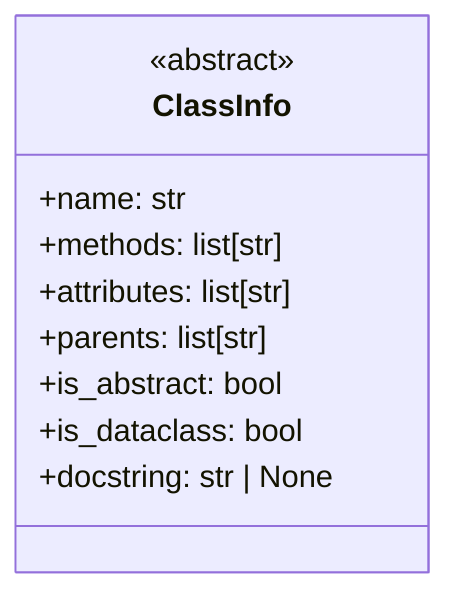

# Diagrams Generator Module

## File Overview

The `diagrams.py` module provides functionality for generating various types of diagrams and visualizations for documentation purposes. This module creates Mermaid-compatible diagrams including class diagrams, dependency graphs, module overviews, language distribution charts, and sequence diagrams for different processes.

## Classes

### ClassInfo

A dataclass that stores information about a class for diagram generation purposes.

## Functions

### sanitize_mermaid_name

Sanitizes names to be compatible with Mermaid diagram syntax by handling special characters and formatting requirements.

### generate_class_diagram

Generates a Mermaid class diagram representation of Python classes, showing their attributes and methods in a structured format.

### _extract_class_attributes

Private helper function that extracts class attributes from code for inclusion in class diagrams.

### _extract_method_signature

Private helper function that extracts method signatures from class definitions to display in diagrams.

### _is_test_module

Private utility function that determines whether a given module is a test module based on naming conventions or structure.

### generate_dependency_graph

Creates a dependency graph showing relationships between modules and their imports, useful for understanding project structure.

### _parse_external_import

Private helper function that parses external import statements to identify dependencies outside the current project.

### _module_to_wiki_path

Private utility function that converts module names to wiki path format for cross-referencing in documentation.

### _find_circular_dependencies

Private function that identifies circular dependencies between modules in the codebase.

### dfs

Implements depth-first search algorithm, likely used for traversing dependency graphs and detecting cycles.

### _path_to_module

Private utility function that converts file paths to module name format.

### _parse_import_line

Private helper function that parses individual import statements to extract module and component information.

### generate_module_overview

Creates an overview diagram of modules in the project, showing their relationships and organization.

### generate_language_pie_chart

Generates a pie chart visualization showing the distribution of programming languages used in the project.

### generate_sequence_diagram

Creates sequence diagrams to illustrate the flow of operations and interactions between different components.

### collect_participants

Helper function that identifies and collects participants (actors/components) for sequence diagrams.

### add_calls

Helper function that adds method calls and interactions to sequence diagrams.

### generate_indexing_sequence

Generates a sequence diagram specifically for the indexing process, showing the flow of operations during content indexing.

### generate_wiki_generati

Function for generating wiki generation sequence diagrams (name appears to be truncated in the provided code listing).

## Related Components

This module works with the following components based on the imports shown:

- **[ChunkType](../models.md)**: An enumeration from the models module that defines different types of content chunks
- **[IndexStatus](../models.md)**: A model from the models module that tracks indexing status

The module uses standard Python libraries including:
- `re` for regular expression operations
- `dataclasses` for the ClassInfo dataclass
- `pathlib.Path` for file path operations

## Usage Context

This module appears to be part of a documentation generation system that creates visual representations of code structure and processes. The functions work together to analyze Python codebases and generate various types of diagrams that help users understand:

- Class hierarchies and relationships
- Module dependencies and imports
- Project structure and organization
- [Language](../models.md) distribution
- Process flows and sequences

The generated diagrams use Mermaid syntax, making them suitable for rendering in documentation systems that support Mermaid diagram visualization.

## API Reference

### class `ClassInfo`

Information about a class for diagram generation.

---


<details>
<summary>View Source (lines 11-20) | <a href="https://github.com/UrbanDiver/local-deepwiki-mcp/blob/[main](../export/pdf.md)/src/local_deepwiki/generators/diagrams.py#L11-L20">GitHub</a></summary>

```python
class ClassInfo:
    """Information about a class for diagram generation."""

    name: str
    methods: list[str]
    attributes: list[str]
    parents: list[str]
    is_abstract: bool = False
    is_dataclass: bool = False
    docstring: str | None = None
```

</details>

### Functions

#### `sanitize_mermaid_name`

```python
def sanitize_mermaid_name(name: str) -> str
```

Sanitize a name for use in Mermaid diagrams.


| [Parameter](api_docs.md) | Type | Default | Description |
|-----------|------|---------|-------------|
| `name` | `str` | - | Original name. |

**Returns:** `str`


<details>
<summary>View Source (lines 23-39) | <a href="https://github.com/UrbanDiver/local-deepwiki-mcp/blob/[main](../export/pdf.md)/src/local_deepwiki/generators/diagrams.py#L23-L39">GitHub</a></summary>

```python
def sanitize_mermaid_name(name: str) -> str:
    """Sanitize a name for use in Mermaid diagrams.

    Args:
        name: Original name.

    Returns:
        Sanitized name safe for Mermaid syntax.
    """
    # Replace problematic characters
    result = name.replace("<", "_").replace(">", "_").replace(" ", "_")
    result = result.replace("[", "_").replace("]", "_").replace(".", "_")
    result = result.replace("-", "_").replace(":", "_")
    # Ensure it starts with a letter
    if result and result[0].isdigit():
        result = "C" + result
    return result
```

</details>

#### `generate_class_diagram`

```python
def generate_class_diagram(chunks: list, show_attributes: bool = True, show_types: bool = True, max_methods: int = 15) -> str | None
```

Generate an enhanced Mermaid class diagram from code chunks.  Features: - Shows class attributes/properties (not just methods) - Shows type annotations for parameters and return types - Distinguishes abstract classes, dataclasses, protocols - Shows inheritance relationships


| [Parameter](api_docs.md) | Type | Default | Description |
|-----------|------|---------|-------------|
| `chunks` | `list` | - | List of [CodeChunk](../models.md) or [SearchResult](../models.md) objects. |
| `show_attributes` | `bool` | `True` | Whether to show class attributes. |
| `show_types` | `bool` | `True` | Whether to show type annotations. |
| `max_methods` | `int` | `15` | Maximum methods to show per class. |

**Returns:** `str | None`


<details>
<summary>View Source (lines 42-191) | <a href="https://github.com/UrbanDiver/local-deepwiki-mcp/blob/[main](../export/pdf.md)/src/local_deepwiki/generators/diagrams.py#L42-L191">GitHub</a></summary>

```python
def generate_class_diagram(
    chunks: list,
    show_attributes: bool = True,
    show_types: bool = True,
    max_methods: int = 15,
) -> str | None:
    """Generate an enhanced Mermaid class diagram from code chunks.

    Features:
    - Shows class attributes/properties (not just methods)
    - Shows type annotations for parameters and return types
    - Distinguishes abstract classes, dataclasses, protocols
    - Shows inheritance relationships

    Args:
        chunks: List of CodeChunk or SearchResult objects.
        show_attributes: Whether to show class attributes.
        show_types: Whether to show type annotations.
        max_methods: Maximum methods to show per class.

    Returns:
        Mermaid class diagram markdown string, or None if no classes found.
    """
    # Collect class information
    classes: dict[str, ClassInfo] = {}
    methods_by_class: dict[str, list[tuple[str, str | None]]] = {}  # class -> [(method, signature)]

    for chunk in chunks:
        # Handle SearchResult objects
        if hasattr(chunk, "chunk"):
            chunk = chunk.chunk

        if chunk.chunk_type == ChunkType.CLASS:
            class_name = chunk.name or "Unknown"
            if class_name not in classes:
                # Extract attributes from class content
                attributes = _extract_class_attributes(
                    chunk.content, chunk.language.value if hasattr(chunk, "language") else "python"
                )

                # Check for special class types
                is_abstract = (
                    "ABC" in str(chunk.metadata.get("parent_classes", []))
                    or "abstract" in chunk.content.lower()
                )
                is_dataclass = "@dataclass" in chunk.content or "BaseModel" in str(
                    chunk.metadata.get("parent_classes", [])
                )

                classes[class_name] = ClassInfo(
                    name=class_name,
                    methods=[],
                    attributes=attributes if show_attributes else [],
                    parents=chunk.metadata.get("parent_classes", []),
                    is_abstract=is_abstract,
                    is_dataclass=is_dataclass,
                    docstring=chunk.docstring,
                )
                methods_by_class[class_name] = []

        elif chunk.chunk_type == ChunkType.METHOD:
            parent = chunk.parent_name or "Unknown"
            method_name = chunk.name or "unknown"

            # Extract signature with types if available
            signature = _extract_method_signature(chunk.content) if show_types else None

            if parent not in methods_by_class:
                methods_by_class[parent] = []

            # Avoid duplicates
            existing = [m[0] for m in methods_by_class[parent]]
            if method_name not in existing:
                methods_by_class[parent].append((method_name, signature))

    # For classes without METHOD chunks, extract from content
    method_pattern = re.compile(r"(?:async\s+)?def\s+(\w+)\s*\([^)]*\)(?:\s*->\s*([^:]+))?:")
    for class_name, class_info in classes.items():
        if not methods_by_class.get(class_name):
            # Look for class chunk content
            for chunk in chunks:
                if hasattr(chunk, "chunk"):
                    chunk = chunk.chunk
                if chunk.chunk_type == ChunkType.CLASS and chunk.name == class_name:
                    for match in method_pattern.finditer(chunk.content):
                        method_name = match.group(1)
                        return_type = match.group(2)
                        if method_name not in [m[0] for m in methods_by_class.get(class_name, [])]:
                            if class_name not in methods_by_class:
                                methods_by_class[class_name] = []
                            sig = (
                                f"() -> {return_type.strip()}"
                                if return_type and show_types
                                else "()"
                            )
                            methods_by_class[class_name].append((method_name, sig))

    # Build class info with methods
    for class_name, method_list in methods_by_class.items():
        if class_name in classes:
            classes[class_name].methods = [m[0] for m in method_list[:max_methods]]

    # Filter empty classes
    classes_with_content = {k: v for k, v in classes.items() if v.methods or v.attributes}

    if not classes_with_content:
        return None

    # Build Mermaid diagram
    lines = ["```mermaid", "classDiagram"]

    for class_name, class_info in sorted(classes_with_content.items()):
        safe_name = sanitize_mermaid_name(class_name)

        # Add stereotype annotation
        if class_info.is_dataclass:
            lines.append(f"    class {safe_name} {{")
            lines.append("        <<dataclass>>")
        elif class_info.is_abstract:
            lines.append(f"    class {safe_name} {{")
            lines.append("        <<abstract>>")
        else:
            lines.append(f"    class {safe_name} {{")

        # Add attributes
        for attr in class_info.attributes[:10]:  # Limit attributes
            lines.append(f"        {attr}")

        # Add methods
        method_list = methods_by_class.get(class_name, [])
        for method_name, signature in method_list[:max_methods]:
            prefix = "-" if method_name.startswith("_") else "+"
            safe_method = sanitize_mermaid_name(method_name)
            if signature and show_types:
                lines.append(f"        {prefix}{safe_method}{signature}")
            else:
                lines.append(f"        {prefix}{safe_method}()")

        lines.append("    }")

    # Add inheritance relationships
    for class_name, class_info in sorted(classes_with_content.items()):
        safe_child = sanitize_mermaid_name(class_name)
        for parent in class_info.parents:
            safe_parent = sanitize_mermaid_name(parent)
            lines.append(f"    {safe_child} --|> {safe_parent}")

    lines.append("```")

    return "\n".join(lines)
```

</details>

#### `generate_dependency_graph`

```python
def generate_dependency_graph(chunks: list, project_name: str = "project", detect_circular: bool = True, show_external: bool = False, max_external: int = 10, wiki_base_path: str = "", exclude_tests: bool = True) -> str | None
```

Generate an enhanced Mermaid flowchart showing module dependencies.  Features: - Subgraphs grouping modules by top-level directory - Clickable nodes linking to wiki pages (when wiki_base_path provided) - Optional external dependency display with different styling - Circular dependency detection and highlighting


| [Parameter](api_docs.md) | Type | Default | Description |
|-----------|------|---------|-------------|
| `chunks` | `list` | - | List of [CodeChunk](../models.md) objects (should include IMPORT chunks). |
| `project_name` | `str` | `"project"` | Name of the project for filtering internal imports. |
| `detect_circular` | `bool` | `True` | Whether to highlight circular dependencies. |
| `show_external` | `bool` | `False` | Whether to show external (third-party) dependencies. |
| `max_external` | `int` | `10` | Maximum number of external dependencies to display. |
| `wiki_base_path` | `str` | `""` | Base path for wiki links (e.g., "files/"). Empty disables links. |
| `exclude_tests` | `bool` | `True` | Whether to exclude test modules from the graph (default: True). |

**Returns:** `str | None`


<details>
<summary>View Source (lines 297-492) | <a href="https://github.com/UrbanDiver/local-deepwiki-mcp/blob/[main](../export/pdf.md)/src/local_deepwiki/generators/diagrams.py#L297-L492">GitHub</a></summary>

```python
def generate_dependency_graph(
    chunks: list,
    project_name: str = "project",
    detect_circular: bool = True,
    show_external: bool = False,
    max_external: int = 10,
    wiki_base_path: str = "",
    exclude_tests: bool = True,
) -> str | None:
    """Generate an enhanced Mermaid flowchart showing module dependencies.

    Features:
    - Subgraphs grouping modules by top-level directory
    - Clickable nodes linking to wiki pages (when wiki_base_path provided)
    - Optional external dependency display with different styling
    - Circular dependency detection and highlighting

    Args:
        chunks: List of CodeChunk objects (should include IMPORT chunks).
        project_name: Name of the project for filtering internal imports.
        detect_circular: Whether to highlight circular dependencies.
        show_external: Whether to show external (third-party) dependencies.
        max_external: Maximum number of external dependencies to display.
        wiki_base_path: Base path for wiki links (e.g., "files/"). Empty disables links.
        exclude_tests: Whether to exclude test modules from the graph (default: True).

    Returns:
        Mermaid flowchart markdown string, or None if no dependencies found.
    """
    # Collect dependencies: module -> set of internal imports
    dependencies: dict[str, set[str]] = {}
    # Collect external dependencies: ext_module -> count of imports
    external_deps: dict[str, int] = {}
    # Track which modules import which external deps
    module_external_deps: dict[str, set[str]] = {}
    # Track ALL internal modules (both importing and imported)
    all_internal_modules: set[str] = set()

    for chunk in chunks:
        if hasattr(chunk, "chunk"):
            chunk = chunk.chunk
        if chunk.chunk_type != ChunkType.IMPORT:
            continue

        file_path = chunk.file_path
        module = _path_to_module(file_path)
        if not module:
            continue

        # Skip test modules if exclude_tests is True
        if exclude_tests and _is_test_module(module, file_path):
            continue

        if module not in dependencies:
            dependencies[module] = set()
        if module not in module_external_deps:
            module_external_deps[module] = set()
        all_internal_modules.add(module)

        # Parse imports from content
        for line in chunk.content.split("\n"):
            line = line.strip()
            if not line:
                continue

            # Check for internal import
            imported = _parse_import_line(line, project_name)
            if imported:
                # Skip test module imports if exclude_tests is True
                if exclude_tests and imported.startswith("test_"):
                    continue
                dependencies[module].add(imported)
                # Also track the imported module even if it has no import chunks itself
                all_internal_modules.add(imported)
            elif show_external:
                # Parse external import
                ext_module = _parse_external_import(line)
                if ext_module:
                    external_deps[ext_module] = external_deps.get(ext_module, 0) + 1
                    module_external_deps[module].add(ext_module)

    if not dependencies:
        return None

    # Use all discovered internal modules (not just those with import chunks)
    internal_modules = all_internal_modules
    internal_deps: dict[str, set[str]] = {}

    for module, imports in dependencies.items():
        # Include all internal imports, even to modules without their own imports
        internal_imports = {imp for imp in imports if imp in internal_modules}
        if internal_imports:
            internal_deps[module] = internal_imports

    # Group modules by top-level directory for subgraphs
    module_groups: dict[str, list[str]] = {}
    for module in sorted(internal_modules):
        parts = module.split(".")
        group = parts[0] if parts else "other"
        if group not in module_groups:
            module_groups[group] = []
        module_groups[group].append(module)

    # Detect circular dependencies
    circular_edges: set[tuple[str, str]] = set()
    if detect_circular and internal_deps:
        circular_edges = _find_circular_dependencies(internal_deps)

    # Build Mermaid flowchart
    lines = ["```mermaid", "flowchart TD"]

    # Create node IDs mapping
    node_ids: dict[str, str] = {}
    node_idx = 0
    for module in sorted(internal_modules):
        node_ids[module] = f"M{node_idx}"
        node_idx += 1

    # Add subgraphs for each module group
    for group_name in sorted(module_groups.keys()):
        modules = module_groups[group_name]
        safe_group = sanitize_mermaid_name(group_name)
        display_group = group_name.replace("_", " ").title()
        lines.append(f"    subgraph {safe_group}[{display_group}]")
        for module in sorted(modules):
            node_id = node_ids[module]
            display_name = module.split(".")[-1]
            lines.append(f"        {node_id}[{display_name}]")
        lines.append("    end")

    # Add external dependencies if enabled
    ext_node_ids: dict[str, str] = {}
    if show_external and external_deps:
        # Get top external deps by import count
        top_external = sorted(external_deps.items(), key=lambda x: -x[1])[:max_external]
        if top_external:
            lines.append("    subgraph external[External Dependencies]")
            for i, (ext, _count) in enumerate(top_external):
                ext_id = f"E{i}"
                ext_node_ids[ext] = ext_id
                # Use rounded rectangle for external deps
                lines.append(f"        {ext_id}([{ext}]):::external")
            lines.append("    end")

    # Add internal dependency edges
    for module, imports in sorted(internal_deps.items()):
        from_id = node_ids.get(module)
        if not from_id:
            continue
        for imp in sorted(imports):
            to_id = node_ids.get(imp)
            if to_id and from_id != to_id:
                if (module, imp) in circular_edges or (imp, module) in circular_edges:
                    lines.append(f"    {from_id} -.->|circular| {to_id}")
                else:
                    lines.append(f"    {from_id} --> {to_id}")

    # Add external dependency edges
    if show_external and ext_node_ids:
        for module, ext_imports in sorted(module_external_deps.items()):
            from_id = node_ids.get(module)
            if not from_id:
                continue
            for ext in sorted(ext_imports):
                target_ext_id = ext_node_ids.get(ext)
                if target_ext_id:
                    lines.append(f"    {from_id} -.-> {target_ext_id}")

    # Add click handlers for wiki links
    if wiki_base_path:
        for module, node_id in sorted(node_ids.items()):
            wiki_path = _module_to_wiki_path(module, project_name)
            lines.append(f'    click {node_id} "{wiki_base_path}{wiki_path}"')

    # Add styling
    lines.append("    classDef external fill:#2d2d3d,stroke:#666,stroke-dasharray: 5 5")

    # Style circular dependencies
    if circular_edges:
        lines.append("    linkStyle default stroke:#666")
        # Find indices of circular links
        link_idx = 0
        for module, imports in sorted(internal_deps.items()):
            from_id = node_ids.get(module)
            if not from_id:
                continue
            for imp in sorted(imports):
                to_id = node_ids.get(imp)
                if to_id and from_id != to_id:
                    if (module, imp) in circular_edges or (imp, module) in circular_edges:
                        lines.append(f"    linkStyle {link_idx} stroke:#f00,stroke-width:2px")
                    link_idx += 1

    lines.append("```")

    return "\n".join(lines)
```

</details>

#### `dfs`

```python
def dfs(node: str, path: list[str], visited: set[str]) -> None
```


| [Parameter](api_docs.md) | Type | Default | Description |
|-----------|------|---------|-------------|
| `node` | `str` | - | - |
| `path` | `list[str]` | - | - |
| `visited` | `set[str]` | - | - |

**Returns:** `None`


<details>
<summary>View Source (lines 550-566) | <a href="https://github.com/UrbanDiver/local-deepwiki-mcp/blob/[main](../export/pdf.md)/src/local_deepwiki/generators/diagrams.py#L550-L566">GitHub</a></summary>

```python
def dfs(node: str, path: list[str], visited: set[str]) -> None:
        if node in path:
            # Found a cycle - mark all edges in the cycle
            cycle_start = path.index(node)
            cycle = path[cycle_start:] + [node]
            for i in range(len(cycle) - 1):
                circular.add((cycle[i], cycle[i + 1]))
            return

        if node in visited:
            return

        visited.add(node)
        path.append(node)

        for dep in deps.get(node, []):
            dfs(dep, path.copy(), visited)
```

</details>

#### `generate_module_overview`

```python
def generate_module_overview(index_status: IndexStatus, show_file_counts: bool = True) -> str | None
```

Generate a high-level module overview diagram.  Shows package structure with subgraphs for major directories.


| [Parameter](api_docs.md) | Type | Default | Description |
|-----------|------|---------|-------------|
| `index_status` | [`IndexStatus`](../models.md) | - | Index status with file information. |
| `show_file_counts` | `bool` | `True` | Whether to show file counts in nodes. |

**Returns:** `str | None`


<details>
<summary>View Source (lines 648-719) | <a href="https://github.com/UrbanDiver/local-deepwiki-mcp/blob/[main](../export/pdf.md)/src/local_deepwiki/generators/diagrams.py#L648-L719">GitHub</a></summary>

```python
def generate_module_overview(
    index_status: IndexStatus,
    show_file_counts: bool = True,
) -> str | None:
    """Generate a high-level module overview diagram.

    Shows package structure with subgraphs for major directories.

    Args:
        index_status: Index status with file information.
        show_file_counts: Whether to show file counts in nodes.

    Returns:
        Mermaid diagram string, or None if not enough structure.
    """
    if not index_status.files:
        return None

    # Group files by top-level directory
    directories: dict[str, dict[str, int]] = {}  # dir -> {subdir: count}

    for file_info in index_status.files:
        parts = list(Path(file_info.path).parts)
        if len(parts) < 2:
            continue

        top_dir = parts[0]
        if top_dir in ("src", "lib", "pkg"):
            if len(parts) > 1:
                top_dir = parts[1]
                parts = parts[1:]

        if top_dir not in directories:
            directories[top_dir] = {}

        if len(parts) > 1:
            subdir = parts[1]
            directories[top_dir][subdir] = directories[top_dir].get(subdir, 0) + 1
        else:
            directories[top_dir]["_root"] = directories[top_dir].get("_root", 0) + 1

    if not directories:
        return None

    # Build diagram
    lines = ["```mermaid", "graph TB"]

    for top_dir, subdirs in sorted(directories.items()):
        safe_dir = sanitize_mermaid_name(top_dir)
        total_files = sum(subdirs.values())

        if len(subdirs) > 1 and "_root" not in subdirs:
            # Create subgraph for directories with multiple subdirs
            lines.append(f"    subgraph {safe_dir}[{top_dir}]")
            for subdir, count in sorted(subdirs.items()):
                if subdir != "_root":
                    safe_sub = sanitize_mermaid_name(f"{top_dir}_{subdir}")
                    label = f"{subdir}"
                    if show_file_counts:
                        label += f" ({count})"
                    lines.append(f"        {safe_sub}[{label}]")
            lines.append("    end")
        else:
            # Single node for simple directories
            label = top_dir
            if show_file_counts:
                label += f" ({total_files})"
            lines.append(f"    {safe_dir}[{label}]")

    lines.append("```")

    return "\n".join(lines)
```

</details>

#### `generate_language_pie_chart`

```python
def generate_language_pie_chart(index_status: IndexStatus) -> str | None
```

Generate a pie chart showing language distribution.


| [Parameter](api_docs.md) | Type | Default | Description |
|-----------|------|---------|-------------|
| `index_status` | [`IndexStatus`](../models.md) | - | Index status with language counts. |

**Returns:** `str | None`


<details>
<summary>View Source (lines 722-741) | <a href="https://github.com/UrbanDiver/local-deepwiki-mcp/blob/[main](../export/pdf.md)/src/local_deepwiki/generators/diagrams.py#L722-L741">GitHub</a></summary>

```python
def generate_language_pie_chart(index_status: IndexStatus) -> str | None:
    """Generate a pie chart showing language distribution.

    Args:
        index_status: Index status with language counts.

    Returns:
        Mermaid pie chart string, or None if no languages.
    """
    if not index_status.languages:
        return None

    lines = ["```mermaid", "pie title [Language](../models.md) Distribution"]

    for lang, count in sorted(index_status.languages.items(), key=lambda x: -x[1]):
        lines.append(f'    "{lang}" : {count}')

    lines.append("```")

    return "\n".join(lines)
```

</details>

#### `generate_sequence_diagram`

```python
def generate_sequence_diagram(call_graph: dict[str, list[str]], entry_point: str | None = None, max_depth: int = 5) -> str | None
```

Generate a sequence diagram from a call graph.  Shows the sequence of calls starting from an entry point.


| [Parameter](api_docs.md) | Type | Default | Description |
|-----------|------|---------|-------------|
| `call_graph` | `dict[str, list[str]]` | - | Mapping of caller to list of callees. |
| `entry_point` | `str | None` | `None` | Starting function (if None, uses most-called function). |
| `max_depth` | `int` | `5` | Maximum call depth to show. |

**Returns:** `str | None`


<details>
<summary>View Source (lines 744-821) | <a href="https://github.com/UrbanDiver/local-deepwiki-mcp/blob/[main](../export/pdf.md)/src/local_deepwiki/generators/diagrams.py#L744-L821">GitHub</a></summary>

```python
def generate_sequence_diagram(
    call_graph: dict[str, list[str]],
    entry_point: str | None = None,
    max_depth: int = 5,
) -> str | None:
    """Generate a sequence diagram from a call graph.

    Shows the sequence of calls starting from an entry point.

    Args:
        call_graph: Mapping of caller to list of callees.
        entry_point: Starting function (if None, uses most-called function).
        max_depth: Maximum call depth to show.

    Returns:
        Mermaid sequence diagram string, or None if empty.
    """
    if not call_graph:
        return None

    # Find entry point if not specified
    if not entry_point:
        # Find function with most outgoing calls
        entry_point = max(call_graph.keys(), key=lambda k: len(call_graph.get(k, [])), default=None)

    if not entry_point or entry_point not in call_graph:
        return None

    # Build sequence
    lines = ["```mermaid", "sequenceDiagram"]

    # Collect participants
    participants: set[str] = {entry_point}

    def collect_participants(func: str, depth: int) -> None:
        if depth > max_depth:
            return
        for callee in call_graph.get(func, []):
            participants.add(callee)
            collect_participants(callee, depth + 1)

    collect_participants(entry_point, 0)

    # Add participants
    for p in sorted(participants):
        safe_name = sanitize_mermaid_name(p)
        display = p.split(".")[-1] if "." in p else p
        lines.append(f"    participant {safe_name} as {display}")

    # Add calls
    visited: set[tuple[str, str]] = set()

    def add_calls(caller: str, depth: int) -> None:
        if depth > max_depth:
            return
        safe_caller = sanitize_mermaid_name(caller)
        for callee in call_graph.get(caller, []):
            if (caller, callee) in visited:
                continue
            visited.add((caller, callee))

            safe_callee = sanitize_mermaid_name(callee)
            lines.append(f"    {safe_caller}->>+{safe_callee}: call")

            # Recurse
            if callee in call_graph:
                add_calls(callee, depth + 1)

            lines.append(f"    {safe_callee}-->>-{safe_caller}: return")

    add_calls(entry_point, 0)

    if len(lines) <= 3:  # Only header and participants
        return None

    lines.append("```")

    return "\n".join(lines)
```

</details>

#### `collect_participants`

```python
def collect_participants(func: str, depth: int) -> None
```


| [Parameter](api_docs.md) | Type | Default | Description |
|-----------|------|---------|-------------|
| `func` | `str` | - | - |
| `depth` | `int` | - | - |

**Returns:** `None`


<details>
<summary>View Source (lines 778-783) | <a href="https://github.com/UrbanDiver/local-deepwiki-mcp/blob/[main](../export/pdf.md)/src/local_deepwiki/generators/diagrams.py#L778-L783">GitHub</a></summary>

```python
def collect_participants(func: str, depth: int) -> None:
        if depth > max_depth:
            return
        for callee in call_graph.get(func, []):
            participants.add(callee)
            collect_participants(callee, depth + 1)
```

</details>

#### `add_calls`

```python
def add_calls(caller: str, depth: int) -> None
```


| [Parameter](api_docs.md) | Type | Default | Description |
|-----------|------|---------|-------------|
| `caller` | `str` | - | - |
| `depth` | `int` | - | - |

**Returns:** `None`


<details>
<summary>View Source (lines 796-812) | <a href="https://github.com/UrbanDiver/local-deepwiki-mcp/blob/[main](../export/pdf.md)/src/local_deepwiki/generators/diagrams.py#L796-L812">GitHub</a></summary>

```python
def add_calls(caller: str, depth: int) -> None:
        if depth > max_depth:
            return
        safe_caller = sanitize_mermaid_name(caller)
        for callee in call_graph.get(caller, []):
            if (caller, callee) in visited:
                continue
            visited.add((caller, callee))

            safe_callee = sanitize_mermaid_name(callee)
            lines.append(f"    {safe_caller}->>+{safe_callee}: call")

            # Recurse
            if callee in call_graph:
                add_calls(callee, depth + 1)

            lines.append(f"    {safe_callee}-->>-{safe_caller}: return")
```

</details>

#### `generate_indexing_sequence`

```python
def generate_indexing_sequence() -> str
```

Generate sequence diagram for the indexing pipeline.  Shows how files are discovered, parsed, chunked, embedded, and stored in the vector database during repository indexing.

**Returns:** `str`


<details>
<summary>View Source (lines 824-862) | <a href="https://github.com/UrbanDiver/local-deepwiki-mcp/blob/[main](../export/pdf.md)/src/local_deepwiki/generators/diagrams.py#L824-L862">GitHub</a></summary>

```python
def generate_indexing_sequence() -> str:
    """Generate sequence diagram for the indexing pipeline.

    Shows how files are discovered, parsed, chunked, embedded, and stored
    in the vector database during repository indexing.

    Returns:
        Mermaid sequence diagram as markdown string.
    """
    return """```mermaid
sequenceDiagram
    participant U as User
    participant I as [RepositoryIndexer](../core/indexer.md)
    participant P as [CodeParser](../core/parser.md)
    participant C as [CodeChunker](../core/chunker.md)
    participant E as [EmbeddingProvider](../providers/base.md)
    participant V as [VectorStore](../core/vectorstore.md)
    participant F as FileSystem

    U->>I: index(repo_path, full_rebuild)
    I->>F: find_source_files()
    F-->>I: source_files[]
    I->>F: load_index_status()
    F-->>I: previous_status

    loop For each file batch
        I->>P: parse_file(path)
        P-->>I: tree, source
        I->>C: chunk_file(tree, source)
        C-->>I: [CodeChunk](../models.md)[]
        I->>E: embed(chunk_contents)
        E-->>I: embeddings[]
        I->>V: add_chunks(chunks, embeddings)
        V-->>I: success
    end

    I->>F: save_index_status()
    I-->>U: [IndexStatus](../models.md)
```"""
```

</details>

#### `generate_wiki_generation_sequence`

```python
def generate_wiki_generation_sequence() -> str
```

Generate sequence diagram for wiki generation.  Shows how the wiki generator searches for context, calls the LLM, and writes documentation files including parallel operations.

**Returns:** `str`


<details>
<summary>View Source (lines 865-921) | <a href="https://github.com/UrbanDiver/local-deepwiki-mcp/blob/[main](../export/pdf.md)/src/local_deepwiki/generators/diagrams.py#L865-L921">GitHub</a></summary>

```python
def generate_wiki_generation_sequence() -> str:
    """Generate sequence diagram for wiki generation.

    Shows how the wiki generator searches for context, calls the LLM,
    and writes documentation files including parallel operations.

    Returns:
        Mermaid sequence diagram as markdown string.
    """
    return """```mermaid
sequenceDiagram
    participant U as User
    participant W as [WikiGenerator](wiki.md)
    participant V as [VectorStore](../core/vectorstore.md)
    participant L as [LLMProvider](../providers/base.md)
    participant F as FileSystem

    U->>W: [generate_wiki](wiki.md)(index_status)

    rect rgb(40, 40, 60)
        note right of W: Generate Overview
        W->>V: search("[main](../export/pdf.md) entry point")
        V-->>W: context_chunks
        W->>L: generate(overview_prompt)
        L-->>W: overview_markdown
        W->>F: write(index.md)
    end

    rect rgb(40, 40, 60)
        note right of W: Generate Architecture
        par Parallel searches
            W->>V: search("core components")
            W->>V: search("patterns")
            W->>V: search("data flow")
        end
        V-->>W: combined_context
        W->>L: generate(architecture_prompt)
        L-->>W: architecture_markdown
        W->>F: write(architecture.md)
    end

    rect rgb(40, 40, 60)
        note right of W: Generate Module Docs
        loop For each module
            W->>V: search(module_query)
            V-->>W: module_chunks
            W->>L: generate(module_prompt)
            L-->>W: module_markdown
            W->>F: write(modules/{name}.md)
        end
    end

    W->>W: [add_cross_links](crosslinks.md)()
    W->>W: [add_see_also_sections](see_also.md)()
    W->>F: write(search.json, toc.json)
    W-->>U: [WikiStructure](../models.md)
```"""
```

</details>

#### `generate_deep_research_sequence`

```python
def generate_deep_research_sequence() -> str
```

Generate sequence diagram for deep research pipeline.  Shows the 5-step deep research process: decomposition, parallel retrieval, gap analysis, follow-up retrieval, and synthesis.

**Returns:** `str`


<details>
<summary>View Source (lines 924-979) | <a href="https://github.com/UrbanDiver/local-deepwiki-mcp/blob/[main](../export/pdf.md)/src/local_deepwiki/generators/diagrams.py#L924-L979">GitHub</a></summary>

```python
def generate_deep_research_sequence() -> str:
    """Generate sequence diagram for deep research pipeline.

    Shows the 5-step deep research process: decomposition, parallel retrieval,
    gap analysis, follow-up retrieval, and synthesis.

    Returns:
        Mermaid sequence diagram as markdown string.
    """
    return """```mermaid
sequenceDiagram
    participant U as User
    participant D as [DeepResearchPipeline](../core/deep_research.md)
    participant L as [LLMProvider](../providers/base.md)
    participant V as [VectorStore](../core/vectorstore.md)

    U->>D: research(question)

    rect rgb(50, 40, 40)
        note right of D: Step 1: Decomposition
        D->>L: decompose_question(question)
        L-->>D: [SubQuestion](../models.md)[]
    end

    rect rgb(40, 50, 40)
        note right of D: Step 2: Parallel Retrieval
        par For each sub-question
            D->>V: search(sub_q1)
            D->>V: search(sub_q2)
            D->>V: search(sub_q3)
        end
        V-->>D: [SearchResult](../models.md)[][]
    end

    rect rgb(40, 40, 50)
        note right of D: Step 3: Gap Analysis
        D->>L: analyze_gaps(context)
        L-->>D: follow_up_queries[]
    end

    rect rgb(50, 50, 40)
        note right of D: Step 4: Follow-up Retrieval
        par For each follow-up
            D->>V: search(follow_up)
        end
        V-->>D: additional_results[]
    end

    rect rgb(50, 40, 50)
        note right of D: Step 5: Synthesis
        D->>L: synthesize(all_context)
        L-->>D: comprehensive_answer
    end

    D-->>U: [DeepResearchResult](../models.md)
```"""
```

</details>

#### `generate_workflow_sequences`

```python
def generate_workflow_sequences() -> str
```

Generate all workflow sequence diagrams combined.  Returns a markdown string with all three workflow diagrams: indexing, wiki generation, and deep research.

**Returns:** `str`


<details>
<summary>View Source (lines 982-1002) | <a href="https://github.com/UrbanDiver/local-deepwiki-mcp/blob/[main](../export/pdf.md)/src/local_deepwiki/generators/diagrams.py#L982-L1002">GitHub</a></summary>

```python
def generate_workflow_sequences() -> str:
    """Generate all workflow sequence diagrams combined.

    Returns a markdown string with all three workflow diagrams:
    indexing, wiki generation, and deep research.

    Returns:
        Combined markdown with section headers and diagrams.
    """
    return f"""### Indexing Pipeline

{generate_indexing_sequence()}

### Wiki Generation Pipeline

{generate_wiki_generation_sequence()}

### Deep Research Pipeline

{generate_deep_research_sequence()}
"""
```

</details>

## Class Diagram



## Call Graph

```mermaid
flowchart TD
    N0[ClassInfo]
    N1[Path]
    N2[_extract_class_attributes]
    N3[_extract_method_signature]
    N4[_find_circular_dependencies]
    N5[_is_test_module]
    N6[_module_to_wiki_path]
    N7[_parse_external_import]
    N8[_parse_import_line]
    N9[_path_to_module]
    N10[add]
    N11[add_calls]
    N12[collect_participants]
    N13[compile]
    N14[copy]
    N15[dfs]
    N16[finditer]
    N17[generate_class_diagram]
    N18[generate_dependency_graph]
    N19[generate_indexing_sequence]
    N20[generate_module_overview]
    N21[generate_sequence_diagram]
    N22[generate_workflow_sequences]
    N23[group]
    N24[groups]
    N25[isdigit]
    N26[match]
    N27[sanitize_mermaid_name]
    N28[search]
    N29[title]
    N27 --> N25
    N17 --> N2
    N17 --> N0
    N17 --> N3
    N17 --> N13
    N17 --> N16
    N17 --> N23
    N17 --> N27
    N2 --> N13
    N2 --> N16
    N2 --> N24
    N3 --> N13
    N3 --> N28
    N3 --> N23
    N18 --> N9
    N18 --> N5
    N18 --> N10
    N18 --> N8
    N18 --> N7
    N18 --> N4
    N18 --> N27
    N18 --> N29
    N18 --> N6
    N7 --> N26
    N7 --> N23
    N4 --> N10
    N4 --> N15
    N4 --> N14
    N15 --> N10
    N15 --> N15
    N15 --> N14
    N9 --> N1
    N8 --> N26
    N8 --> N23
    N20 --> N1
    N20 --> N27
    N21 --> N10
    N21 --> N12
    N21 --> N27
    N21 --> N11
    N12 --> N10
    N12 --> N12
    N11 --> N27
    N11 --> N10
    N11 --> N11
    N22 --> N19
    classDef func fill:#e1f5fe
    class N0,N1,N2,N3,N4,N5,N6,N7,N8,N9,N10,N11,N12,N13,N14,N15,N16,N17,N18,N19,N20,N21,N22,N23,N24,N25,N26,N27,N28,N29 func
```



## Used By

Functions and methods in this file and their callers:

- **`ClassInfo`**: called by `generate_class_diagram`
- **`Path`**: called by `_path_to_module`, `generate_module_overview`
- **`_extract_class_attributes`**: called by `generate_class_diagram`
- **`_extract_method_signature`**: called by `generate_class_diagram`
- **`_find_circular_dependencies`**: called by `generate_dependency_graph`
- **`_is_test_module`**: called by `generate_dependency_graph`
- **`_module_to_wiki_path`**: called by `generate_dependency_graph`
- **`_parse_external_import`**: called by `generate_dependency_graph`
- **`_parse_import_line`**: called by `generate_dependency_graph`
- **`_path_to_module`**: called by `generate_dependency_graph`
- **`add`**: called by `_find_circular_dependencies`, `add_calls`, `collect_participants`, `dfs`, `generate_dependency_graph`, `generate_sequence_diagram`
- **`add_calls`**: called by `add_calls`, `generate_sequence_diagram`
- **`collect_participants`**: called by `collect_participants`, `generate_sequence_diagram`
- **`compile`**: called by `_extract_class_attributes`, `_extract_method_signature`, `generate_class_diagram`
- **`copy`**: called by `_find_circular_dependencies`, `dfs`
- **`dfs`**: called by `_find_circular_dependencies`, `dfs`
- **`finditer`**: called by `_extract_class_attributes`, `generate_class_diagram`
- **`generate_deep_research_sequence`**: called by `generate_workflow_sequences`
- **`generate_indexing_sequence`**: called by `generate_workflow_sequences`
- **`generate_wiki_generation_sequence`**: called by `generate_workflow_sequences`
- **`group`**: called by `_extract_method_signature`, `_parse_external_import`, `_parse_import_line`, `generate_class_diagram`
- **`groups`**: called by `_extract_class_attributes`
- **`isdigit`**: called by `sanitize_mermaid_name`
- **`match`**: called by `_parse_external_import`, `_parse_import_line`
- **`sanitize_mermaid_name`**: called by `add_calls`, `generate_class_diagram`, `generate_dependency_graph`, `generate_module_overview`, `generate_sequence_diagram`
- **`search`**: called by `_extract_method_signature`
- **`title`**: called by `generate_dependency_graph`

## Usage Examples

*Examples extracted from test files*

### Test basic name passes through

From `test_diagrams.py::TestSanitizeMermaidName::test_basic_name`:

```python
assert sanitize_mermaid_name("MyClass") == "MyClass"
```

### Test angle brackets are replaced

From `test_diagrams.py::TestSanitizeMermaidName::test_replaces_brackets`:

```python
assert sanitize_mermaid_name("List<int>") == "List_int_"
```

### Test extraction of class-level type annotations

From `test_diagrams.py::TestExtractClassAttributes::test_extracts_type_annotations`:

```python
content = """class MyClass:
    name: str
    count: int
"""
        attrs = _extract_class_attributes(content, "python")
        assert "+name: str" in attrs
        assert "+count: int" in attrs
```

### Test extraction from __init__ assignments

From `test_diagrams.py::TestExtractClassAttributes::test_extracts_init_assignments`:

```python
content = """class MyClass:
    def __init__(self):
        self.value = 42
        self._private = "secret"
"""
        attrs = _extract_class_attributes(content, "python")
        assert "+value" in attrs
        assert "-_private" in attrs
```

### Test extraction of return type

From `test_diagrams.py::TestExtractMethodSignature::test_extracts_return_type`:

```python
content = "def process(x: int, y: str) -> bool:"
sig = _extract_method_signature(content)
assert "bool" in sig
```


## Last Modified

| Entity | Type | Author | Date | Commit |
|--------|------|--------|------|--------|
| `generate_dependency_graph` | function | Brian Breidenbach | today | `0d91a70` Apply Python best practices... |
| `generate_indexing_sequence` | function | Brian Breidenbach | today | `0d91a70` Apply Python best practices... |
| `generate_wiki_generation_sequence` | function | Brian Breidenbach | today | `0d91a70` Apply Python best practices... |
| `generate_deep_research_sequence` | function | Brian Breidenbach | today | `0d91a70` Apply Python best practices... |
| `generate_class_diagram` | function | Brian Breidenbach | yesterday | `8078321` Fix ruff and pyright code q... |
| `_is_test_module` | function | Brian Breidenbach | yesterday | `42a9a7b` Fix dependencies page: loca... |
| `_parse_external_import` | function | Brian Breidenbach | 2 days ago | `c652a2a` Add enhanced dependency gra... |
| `_module_to_wiki_path` | function | Brian Breidenbach | 2 days ago | `c652a2a` Add enhanced dependency gra... |
| `generate_workflow_sequences` | function | Brian Breidenbach | 2 days ago | `4048ed9` Add workflow sequence diagr... |
| `generate_module_overview` | function | Brian Breidenbach | 3 days ago | `c568951` Add input validation, type ... |
| `ClassInfo` | class | Brian Breidenbach | 4 days ago | `cfae86f` Enhance diagram generation ... |
| `sanitize_mermaid_name` | function | Brian Breidenbach | 4 days ago | `cfae86f` Enhance diagram generation ... |
| `_extract_class_attributes` | function | Brian Breidenbach | 4 days ago | `cfae86f` Enhance diagram generation ... |
| `_extract_method_signature` | function | Brian Breidenbach | 4 days ago | `cfae86f` Enhance diagram generation ... |
| `_find_circular_dependencies` | function | Brian Breidenbach | 4 days ago | `cfae86f` Enhance diagram generation ... |
| `dfs` | function | Brian Breidenbach | 4 days ago | `cfae86f` Enhance diagram generation ... |
| `_path_to_module` | function | Brian Breidenbach | 4 days ago | `cfae86f` Enhance diagram generation ... |
| `_parse_import_line` | function | Brian Breidenbach | 4 days ago | `cfae86f` Enhance diagram generation ... |
| `generate_language_pie_chart` | function | Brian Breidenbach | 4 days ago | `cfae86f` Enhance diagram generation ... |
| `generate_sequence_diagram` | function | Brian Breidenbach | 4 days ago | `cfae86f` Enhance diagram generation ... |
| `collect_participants` | function | Brian Breidenbach | 4 days ago | `cfae86f` Enhance diagram generation ... |
| `add_calls` | function | Brian Breidenbach | 4 days ago | `cfae86f` Enhance diagram generation ... |

## Additional Source Code

Source code for functions and methods not listed in the API Reference above.

#### `_extract_class_attributes`

<details>
<summary>View Source (lines 194-232) | <a href="https://github.com/UrbanDiver/local-deepwiki-mcp/blob/[main](../export/pdf.md)/src/local_deepwiki/generators/diagrams.py#L194-L232">GitHub</a></summary>

```python
def _extract_class_attributes(content: str, language: str = "python") -> list[str]:
    """Extract class attributes from content.

    Args:
        content: Class source code.
        language: Programming language.

    Returns:
        List of attribute strings like "+name: str" or "-_count: int".
    """
    attributes = []

    if language in ("python", "py"):
        # Match class-level type annotations: name: Type or self.name: Type
        # Also match __init__ assignments
        attr_pattern = re.compile(r"^\s{4}(\w+)\s*:\s*([^=\n]+?)(?:\s*=|$)", re.MULTILINE)
        init_pattern = re.compile(r"self\.(\w+)\s*(?::\s*([^\s=]+))?\s*=")

        for match in attr_pattern.finditer(content):
            name, type_hint = match.groups()
            if name not in ("self", "cls") and not name.startswith("__"):
                prefix = "-" if name.startswith("_") else "+"
                type_str = type_hint.strip() if type_hint else ""
                if type_str:
                    attributes.append(f"{prefix}{name}: {type_str}")
                else:
                    attributes.append(f"{prefix}{name}")

        for match in init_pattern.finditer(content):
            name, type_hint = match.groups()
            if name not in [a.split(":")[0].strip("+-") for a in attributes]:
                if not name.startswith("__"):
                    prefix = "-" if name.startswith("_") else "+"
                    if type_hint:
                        attributes.append(f"{prefix}{name}: {type_hint}")
                    else:
                        attributes.append(f"{prefix}{name}")

    return attributes[:10]  # Limit to 10 attributes
```

</details>


#### `_extract_method_signature`

<details>
<summary>View Source (lines 235-275) | <a href="https://github.com/UrbanDiver/local-deepwiki-mcp/blob/[main](../export/pdf.md)/src/local_deepwiki/generators/diagrams.py#L235-L275">GitHub</a></summary>

```python
def _extract_method_signature(content: str) -> str | None:
    """Extract method signature with types from content.

    Args:
        content: Method source code.

    Returns:
        Signature string like "(x: int, y: str) -> bool" or None.
    """
    # Match def method(params) -> return_type:
    sig_pattern = re.compile(r"def\s+\w+\s*\(([^)]*)\)(?:\s*->\s*([^:]+))?:")
    match = sig_pattern.search(content)
    if not match:
        return None

    params_str = match.group(1)
    return_type = match.group(2)

    # Simplify params (remove defaults, keep just name: type)
    params = []
    for param in params_str.split(","):
        param = param.strip()
        if not param or param == "self" or param == "cls":
            continue
        # Extract name and type
        if ":" in param:
            name_type = param.split("=")[0].strip()  # Remove default
            params.append(name_type)
        else:
            name = param.split("=")[0].strip()
            if name:
                params.append(name)

    sig = f"({', '.join(params[:4])})"  # Limit to 4 params for readability
    if len(params) > 4:
        sig = f"({', '.join(params[:3])}, ...)"

    if return_type:
        sig += f" {return_type.strip()}"

    return sig
```

</details>


#### `_is_test_module`

<details>
<summary>View Source (lines 278-294) | <a href="https://github.com/UrbanDiver/local-deepwiki-mcp/blob/[main](../export/pdf.md)/src/local_deepwiki/generators/diagrams.py#L278-L294">GitHub</a></summary>

```python
def _is_test_module(module: str, file_path: str) -> bool:
    """Check if a module is a test module.

    Args:
        module: Module name like 'test_parser' or 'core.indexer'.
        file_path: File path like 'tests/test_parser.py'.

    Returns:
        True if this is a test module.
    """
    # Check module name
    if module.startswith("test_") or ".test_" in module:
        return True
    # Check file path
    if "/tests/" in file_path or file_path.startswith("tests/"):
        return True
    return False
```

</details>


#### `_parse_external_import`

<details>
<summary>View Source (lines 495-523) | <a href="https://github.com/UrbanDiver/local-deepwiki-mcp/blob/[main](../export/pdf.md)/src/local_deepwiki/generators/diagrams.py#L495-L523">GitHub</a></summary>

```python
def _parse_external_import(line: str) -> str | None:
    """Parse an import line to extract external module name.

    Args:
        line: Import line like 'from pathlib import Path' or 'import os'

    Returns:
        Top-level module name if external import, None otherwise.
    """
    # from X import Y - extract X's top-level module
    from_match = re.match(r"from\s+([\w.]+)\s+import", line)
    if from_match:
        module = from_match.group(1)
        # Get top-level package name
        top_level = module.split(".")[0]
        # Skip relative imports and stdlib typing
        if top_level and not top_level.startswith("_"):
            return top_level
        return None

    # import X - extract X's top-level module
    import_match = re.match(r"import\s+([\w.]+)", line)
    if import_match:
        module = import_match.group(1)
        top_level = module.split(".")[0]
        if top_level and not top_level.startswith("_"):
            return top_level

    return None
```

</details>


#### `_module_to_wiki_path`

<details>
<summary>View Source (lines 526-536) | <a href="https://github.com/UrbanDiver/local-deepwiki-mcp/blob/[main](../export/pdf.md)/src/local_deepwiki/generators/diagrams.py#L526-L536">GitHub</a></summary>

```python
def _module_to_wiki_path(module: str, project_name: str) -> str:
    """Convert module name to wiki file path.

    Args:
        module: Module name like 'core.parser'
        project_name: Project name like 'local_deepwiki'

    Returns:
        Wiki path like 'src/local_deepwiki/core/parser.md'
    """
    return f"src/{project_name}/{module.replace('.', '/')}.md"
```

</details>


#### `_find_circular_dependencies`

<details>
<summary>View Source (lines 539-571) | <a href="https://github.com/UrbanDiver/local-deepwiki-mcp/blob/[main](../export/pdf.md)/src/local_deepwiki/generators/diagrams.py#L539-L571">GitHub</a></summary>

```python
def _find_circular_dependencies(deps: dict[str, set[str]]) -> set[tuple[str, str]]:
    """Find circular dependencies in a dependency graph.

    Args:
        deps: Mapping of module to its dependencies.

    Returns:
        Set of (from, to) tuples that form circular dependencies.
    """
    circular: set[tuple[str, str]] = set()

    def dfs(node: str, path: list[str], visited: set[str]) -> None:
        if node in path:
            # Found a cycle - mark all edges in the cycle
            cycle_start = path.index(node)
            cycle = path[cycle_start:] + [node]
            for i in range(len(cycle) - 1):
                circular.add((cycle[i], cycle[i + 1]))
            return

        if node in visited:
            return

        visited.add(node)
        path.append(node)

        for dep in deps.get(node, []):
            dfs(dep, path.copy(), visited)

    for module in deps:
        dfs(module, [], set())

    return circular
```

</details>


#### `_path_to_module`

<details>
<summary>View Source (lines 574-606) | <a href="https://github.com/UrbanDiver/local-deepwiki-mcp/blob/[main](../export/pdf.md)/src/local_deepwiki/generators/diagrams.py#L574-L606">GitHub</a></summary>

```python
def _path_to_module(file_path: str) -> str | None:
    """Convert file path to module name.

    Args:
        file_path: Path like 'src/local_deepwiki/core/indexer.py'

    Returns:
        Module name like 'core.indexer', or None if not applicable.
    """
    p = Path(file_path)
    if p.suffix != ".py":
        return None
    if p.name.startswith("__"):
        return None

    parts = list(p.parts)

    # Find main package (look for src/ or similar patterns)
    try:
        if "src" in parts:
            idx = parts.index("src")
            parts = parts[idx + 1 :]
        # Skip the package directory itself
        if len(parts) > 1:
            parts = parts[1:]  # Skip e.g. 'local_deepwiki'
    except (ValueError, IndexError):
        pass

    # Remove .py extension from last part
    if parts:
        parts[-1] = parts[-1].replace(".py", "")

    return ".".join(parts) if parts else None
```

</details>


#### `_parse_import_line`

<details>
<summary>View Source (lines 609-645) | <a href="https://github.com/UrbanDiver/local-deepwiki-mcp/blob/[main](../export/pdf.md)/src/local_deepwiki/generators/diagrams.py#L609-L645">GitHub</a></summary>

```python
def _parse_import_line(line: str, project_name: str) -> str | None:
    """Parse an import line to extract module name.

    Args:
        line: Import line like 'from local_deepwiki.core import parser'
        project_name: Project name to filter internal imports.

    Returns:
        Module name if internal import, None otherwise.
    """
    # from X import Y
    from_match = re.match(r"from\s+([\w.]+)\s+import", line)
    if from_match:
        module = from_match.group(1)
        if project_name in module:
            # Extract relative module path
            parts = module.split(".")
            if project_name in parts:
                idx = parts.index(project_name)
                rel_parts = parts[idx + 1 :]
                if rel_parts:
                    return ".".join(rel_parts)
        return None

    # import X
    import_match = re.match(r"import\s+([\w.]+)", line)
    if import_match:
        module = import_match.group(1)
        if project_name in module:
            parts = module.split(".")
            if project_name in parts:
                idx = parts.index(project_name)
                rel_parts = parts[idx + 1 :]
                if rel_parts:
                    return ".".join(rel_parts)

    return None
```

</details>

## Relevant Source Files

- `src/local_deepwiki/generators/diagrams.py:11-20`

## See Also

- [inheritance](inheritance.md) - uses this
- [models](../models.md) - dependency
- [crosslinks](crosslinks.md) - shares 4 dependencies
- [see_also](see_also.md) - shares 4 dependencies
- [api_docs](api_docs.md) - shares 4 dependencies
