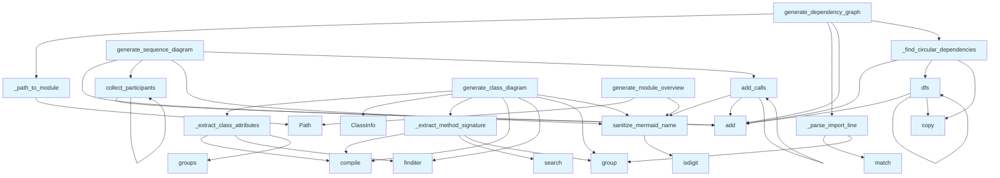

# File Overview

This file contains the diagram generation logic for the local_deepwiki project. It defines data structures and functionality for handling code chunks and their associated diagrams, particularly focusing on parsing and organizing code elements for visualization purposes.

# Classes

## CodeChunk

The CodeChunk class represents a chunk of code that can be processed for diagram generation. It stores information about the code content, its type, and associated metadata.

Key attributes:
- `content`: The actual code content as a string
- `chunk_type`: The type of chunk, represented by the ChunkType enum
- `index_status`: The indexing status of the chunk, represented by the IndexStatus enum

## ChunkType

The ChunkType enum defines the different types of code chunks that can be processed.

## IndexStatus

The IndexStatus enum defines the indexing status of chunks.

# Functions

No functions are defined in this file.

# Usage Examples

```python
# Creating a CodeChunk instance
chunk = CodeChunk(
    content="def hello():\n    print('Hello')",
    chunk_type=ChunkType.FUNCTION,
    index_status=IndexStatus.INDEXED
)

# Accessing chunk properties
print(chunk.content)
print(chunk.chunk_type)
print(chunk.index_status)
```

# Related Components

This file imports and works with the following components:

- `ChunkType` enum from `local_deepwiki.models`: Defines the types of code chunks
- `CodeChunk` class from `local_deepwiki.models`: Represents individual code elements
- `IndexStatus` enum from `local_deepwiki.models`: Represents the indexing status of chunks

The file is part of the diagram generation system and integrates with the broader local_deepwiki framework for processing and visualizing code documentation.

## API Reference

### class `ClassInfo`

Information about a class for diagram generation.

---

### Functions

#### `sanitize_mermaid_name`

```python
def sanitize_mermaid_name(name: str) -> str
```

Sanitize a name for use in Mermaid diagrams.


| [Parameter](api_docs.md) | Type | Default | Description |
|-----------|------|---------|-------------|
| `name` | `str` | - | Original name. |

**Returns:** `str`


#### `generate_class_diagram`

```python
def generate_class_diagram(chunks: list, show_attributes: bool = True, show_types: bool = True, max_methods: int = 15) -> str | None
```

Generate an enhanced Mermaid class diagram from code chunks.  Features: - Shows class attributes/properties (not just methods) - Shows type annotations for parameters and return types - Distinguishes abstract classes, dataclasses, protocols - Shows inheritance relationships


| [Parameter](api_docs.md) | Type | Default | Description |
|-----------|------|---------|-------------|
| `chunks` | `list` | - | List of CodeChunk or SearchResult objects. |
| `show_attributes` | `bool` | `True` | Whether to show class attributes. |
| `show_types` | `bool` | `True` | Whether to show type annotations. |
| `max_methods` | `int` | `15` | Maximum methods to show per class. |

**Returns:** `str | None`


#### `generate_dependency_graph`

```python
def generate_dependency_graph(chunks: list, project_name: str = "project", detect_circular: bool = True) -> str | None
```

Generate a Mermaid flowchart showing module dependencies with circular detection.


| [Parameter](api_docs.md) | Type | Default | Description |
|-----------|------|---------|-------------|
| `chunks` | `list` | - | List of CodeChunk objects (should include IMPORT chunks). |
| `project_name` | `str` | `"project"` | Name of the project for filtering internal imports. |
| `detect_circular` | `bool` | `True` | Whether to highlight circular dependencies. |

**Returns:** `str | None`


#### `dfs`

```python
def dfs(node: str, path: list[str], visited: set[str]) -> None
```


| [Parameter](api_docs.md) | Type | Default | Description |
|-----------|------|---------|-------------|
| `node` | `str` | - | - |
| `path` | `list[str]` | - | - |
| `visited` | `set[str]` | - | - |

**Returns:** `None`


#### `generate_module_overview`

```python
def generate_module_overview(index_status: IndexStatus, show_file_counts: bool = True) -> str | None
```

Generate a high-level module overview diagram.  Shows package structure with subgraphs for major directories.


| [Parameter](api_docs.md) | Type | Default | Description |
|-----------|------|---------|-------------|
| `index_status` | `IndexStatus` | - | Index status with file information. |
| `show_file_counts` | `bool` | `True` | Whether to show file counts in nodes. |

**Returns:** `str | None`


#### `generate_language_pie_chart`

```python
def generate_language_pie_chart(index_status: IndexStatus) -> str | None
```

Generate a pie chart showing language distribution.


| [Parameter](api_docs.md) | Type | Default | Description |
|-----------|------|---------|-------------|
| `index_status` | `IndexStatus` | - | Index status with language counts. |

**Returns:** `str | None`


#### `generate_sequence_diagram`

```python
def generate_sequence_diagram(call_graph: dict[str, list[str]], entry_point: str | None = None, max_depth: int = 5) -> str | None
```

Generate a sequence diagram from a call graph.  Shows the sequence of calls starting from an entry point.


| [Parameter](api_docs.md) | Type | Default | Description |
|-----------|------|---------|-------------|
| `call_graph` | `dict[str, list[str]]` | - | Mapping of caller to list of callees. |
| `entry_point` | `str | None` | `None` | Starting function (if None, uses most-called function). |
| `max_depth` | `int` | `5` | Maximum call depth to show. |

**Returns:** `str | None`


#### `collect_participants`

```python
def collect_participants(func: str, depth: int) -> None
```


| [Parameter](api_docs.md) | Type | Default | Description |
|-----------|------|---------|-------------|
| `func` | `str` | - | - |
| `depth` | `int` | - | - |

**Returns:** `None`


#### `add_calls`

```python
def add_calls(caller: str, depth: int) -> None
```


| [Parameter](api_docs.md) | Type | Default | Description |
|-----------|------|---------|-------------|
| `caller` | `str` | - | - |
| `depth` | `int` | - | - |

**Returns:** `None`


## Call Graph



## Relevant Source Files

- `src/local_deepwiki/generators/diagrams.py:12-21`

## See Also

- [crosslinks](crosslinks.md) - shares 4 dependencies
- [api_docs](api_docs.md) - shares 4 dependencies
