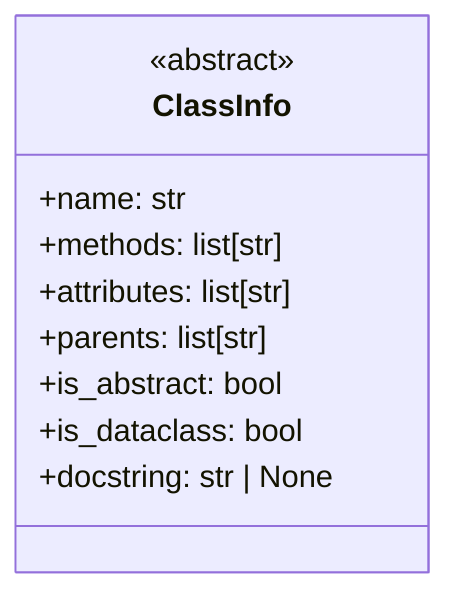
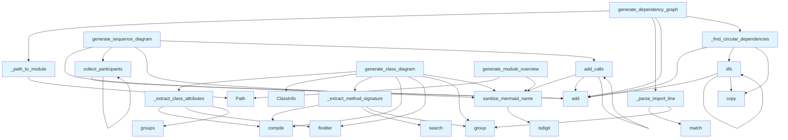

# diagrams.py

## File Overview

The `diagrams.py` module provides functionality for generating various types of Mermaid diagrams from code analysis data. It creates visual representations including class diagrams, dependency graphs, module overviews, language distribution charts, and sequence diagrams to help understand code structure and relationships.

## Classes

### ClassInfo

A dataclass that stores information about a class for diagram generation purposes.

**Attributes:**
- `name`: The class name
- `methods`: List of method names
- `attributes`: List of attribute names  
- `parents`: List of parent class names
- `is_abstract`: Boolean indicating if the class is abstract (default: False)
- `is_dataclass`: Boolean indicating if the class is a dataclass (default: False)
- `docstring`: Optional docstring content

## Functions

### sanitize_mermaid_name

```python
def sanitize_mermaid_name(name: str) -> str
```

Sanitizes a name to make it safe for use in Mermaid diagram syntax by replacing problematic characters with underscores and ensuring the name starts with a letter.

**Parameters:**
- `name`: Original name to sanitize

**Returns:**
- Sanitized name safe for Mermaid syntax

### generate_class_diagram

```python
def generate_class_diagram(
    chunks: list,
    show_attributes: bool = True,
    show_types: bool = True,
    max_methods: int = 15,
) -> str | None
```

Generates an enhanced Mermaid class diagram from code chunks with support for showing class attributes, type annotations, inheritance relationships, and distinguishing special class types like abstract classes and dataclasses.

**Parameters:**
- `chunks`: List of CodeChunk or SearchResult objects
- `show_attributes`: Whether to display class attributes (default: True)
- `show_types`: Whether to show type annotations (default: True) 
- `max_methods`: Maximum number of methods to display per class (default: 15)

**Returns:**
- Mermaid class diagram string, or None if no classes found

### generate_dependency_graph

```python
def generate_dependency_graph(
    chunks: list,
    project_name: str = "project",
    detect_circular: bool = True,
) -> str | None
```

Creates a Mermaid flowchart showing module dependencies with optional circular dependency detection and highlighting.

**Parameters:**
- `chunks`: List of CodeChunk objects (should include IMPORT chunks)
- `project_name`: Name of the project for filtering internal imports (default: "project")
- `detect_circular`: Whether to highlight circular dependencies (default: True)

**Returns:**
- Mermaid flowchart markdown string, or None if no dependencies found

### generate_module_overview

```python
def generate_module_overview(
    index_status: IndexStatus,
    show_file_counts: bool = True,
) -> str | None
```

Generates a high-level module overview diagram showing package structure with subgraphs for major directories.

**Parameters:**
- `index_status`: IndexStatus object containing file information
- `show_file_counts`: Whether to show file counts in diagram nodes (default: True)

**Returns:**
- Mermaid diagram string, or None if insufficient structure

### generate_language_pie_chart

```python
def generate_language_pie_chart(index_status: IndexStatus) -> str | None
```

Creates a pie chart showing the distribution of programming languages in the codebase.

**Parameters:**
- `index_status`: IndexStatus object with language count data

**Returns:**
- Mermaid pie chart string, or None if no languages found

### generate_sequence_diagram

```python
def generate_sequence_diagram(
    call_graph: dict[str, list[str]],
    entry_point: str | None = None,
    max_depth: int = 5,
) -> str | None
```

Generates a sequence diagram from a call graph showing the sequence of function calls starting from an entry point.

**Parameters:**
- `call_graph`: Dictionary mapping caller functions to lists of callees
- `entry_point`: Starting function name (if None, uses most-called function)
- `max_depth`: Maximum call depth to display (default: 5)

**Returns:**
- Mermaid sequence diagram string, or None if call graph is empty

### _find_circular_dependencies

```python
def _find_circular_dependencies(deps: dict[str, set[str]]) -> set[tuple[str, str]]
```

Internal function that finds circular dependencies in a dependency graph using depth-first search.

**Parameters:**
- `deps`: Dictionary mapping modules to their dependency sets

**Returns:**
- Set of (from, to) tuples representing circular dependency edges

### collect_participants

```python
def collect_participants(func: str, depth: int) -> None
```

Internal helper function for collecting participants in a sequence diagram by traversing the call graph recursively up to a maximum depth.

**Parameters:**
- `func`: Function name to start collection from
- `depth`: Current traversal depth

## Usage Examples

### Generating a Class Diagram

```python
from local_deepwiki.generators.diagrams import generate_class_diagram

# Generate diagram with default settings
diagram = generate_class_diagram(code_chunks)

# Generate diagram without attributes but with type info
diagram = generate_class_diagram(
    code_chunks, 
    show_attributes=False, 
    show_types=True, 
    max_methods=10
)
```

### Creating a Dependency Graph

```python
from local_deepwiki.generators.diagrams import generate_dependency_graph

# Generate dependency graph with circular detection
graph = generate_dependency_graph(
    import_chunks, 
    project_name="my_project", 
    detect_circular=True
)
```

### Generating Language Distribution

```python
from local_deepwiki.generators.diagrams import generate_language_pie_chart

# Create pie chart from index status
chart = generate_language_pie_chart(index_status)
```

## Related Components

This module works with several other components from the local_deepwiki system:

- **CodeChunk**: Used as input for analyzing code structure and generating diagrams
- **IndexStatus**: Provides file and language statistics for overview diagrams  
- **ChunkType**: Referenced for filtering specific types of code chunks (like IMPORT chunks)

The module imports from `local_deepwiki.models` to access these data structures and uses standard library modules like `re`, `dataclasses`, `pathlib`, and `typing` for its functionality.

## API Reference

### class `ClassInfo`

Information about a class for diagram generation.

---

### Functions

#### `sanitize_mermaid_name`

```python
def sanitize_mermaid_name(name: str) -> str
```

Sanitize a name for use in Mermaid diagrams.


| [Parameter](api_docs.md) | Type | Default | Description |
|-----------|------|---------|-------------|
| `name` | `str` | - | Original name. |

**Returns:** `str`


#### `generate_class_diagram`

```python
def generate_class_diagram(chunks: list, show_attributes: bool = True, show_types: bool = True, max_methods: int = 15) -> str | None
```

Generate an enhanced Mermaid class diagram from code chunks.  Features: - Shows class attributes/properties (not just methods) - Shows type annotations for parameters and return types - Distinguishes abstract classes, dataclasses, protocols - Shows inheritance relationships


| [Parameter](api_docs.md) | Type | Default | Description |
|-----------|------|---------|-------------|
| `chunks` | `list` | - | List of CodeChunk or SearchResult objects. |
| `show_attributes` | `bool` | `True` | Whether to show class attributes. |
| `show_types` | `bool` | `True` | Whether to show type annotations. |
| `max_methods` | `int` | `15` | Maximum methods to show per class. |

**Returns:** `str | None`


#### `generate_dependency_graph`

```python
def generate_dependency_graph(chunks: list, project_name: str = "project", detect_circular: bool = True) -> str | None
```

Generate a Mermaid flowchart showing module dependencies with circular detection.


| [Parameter](api_docs.md) | Type | Default | Description |
|-----------|------|---------|-------------|
| `chunks` | `list` | - | List of CodeChunk objects (should include IMPORT chunks). |
| `project_name` | `str` | `"project"` | Name of the project for filtering internal imports. |
| `detect_circular` | `bool` | `True` | Whether to highlight circular dependencies. |

**Returns:** `str | None`


#### `dfs`

```python
def dfs(node: str, path: list[str], visited: set[str]) -> None
```


| [Parameter](api_docs.md) | Type | Default | Description |
|-----------|------|---------|-------------|
| `node` | `str` | - | - |
| `path` | `list[str]` | - | - |
| `visited` | `set[str]` | - | - |

**Returns:** `None`


#### `generate_module_overview`

```python
def generate_module_overview(index_status: IndexStatus, show_file_counts: bool = True) -> str | None
```

Generate a high-level module overview diagram.  Shows package structure with subgraphs for major directories.


| [Parameter](api_docs.md) | Type | Default | Description |
|-----------|------|---------|-------------|
| `index_status` | `IndexStatus` | - | Index status with file information. |
| `show_file_counts` | `bool` | `True` | Whether to show file counts in nodes. |

**Returns:** `str | None`


#### `generate_language_pie_chart`

```python
def generate_language_pie_chart(index_status: IndexStatus) -> str | None
```

Generate a pie chart showing language distribution.


| [Parameter](api_docs.md) | Type | Default | Description |
|-----------|------|---------|-------------|
| `index_status` | `IndexStatus` | - | Index status with language counts. |

**Returns:** `str | None`


#### `generate_sequence_diagram`

```python
def generate_sequence_diagram(call_graph: dict[str, list[str]], entry_point: str | None = None, max_depth: int = 5) -> str | None
```

Generate a sequence diagram from a call graph.  Shows the sequence of calls starting from an entry point.


| [Parameter](api_docs.md) | Type | Default | Description |
|-----------|------|---------|-------------|
| `call_graph` | `dict[str, list[str]]` | - | Mapping of caller to list of callees. |
| `entry_point` | `str | None` | `None` | Starting function (if None, uses most-called function). |
| `max_depth` | `int` | `5` | Maximum call depth to show. |

**Returns:** `str | None`


#### `collect_participants`

```python
def collect_participants(func: str, depth: int) -> None
```


| [Parameter](api_docs.md) | Type | Default | Description |
|-----------|------|---------|-------------|
| `func` | `str` | - | - |
| `depth` | `int` | - | - |

**Returns:** `None`


#### `add_calls`

```python
def add_calls(caller: str, depth: int) -> None
```


| [Parameter](api_docs.md) | Type | Default | Description |
|-----------|------|---------|-------------|
| `caller` | `str` | - | - |
| `depth` | `int` | - | - |

**Returns:** `None`


## Class Diagram



## Call Graph



## Relevant Source Files

- `src/local_deepwiki/generators/diagrams.py:12-21`

## See Also

- [crosslinks](crosslinks.md) - shares 4 dependencies
- [api_docs](api_docs.md) - shares 4 dependencies
