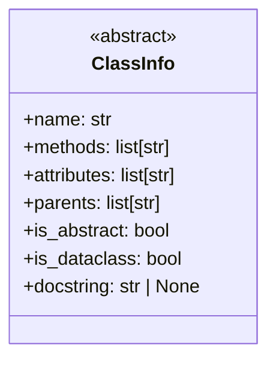

# Diagrams Module Documentation

## File Overview

The `diagrams.py` module provides functionality for generating various types of diagrams and visualizations for code analysis. This module creates Mermaid-formatted diagrams including class diagrams, dependency graphs, module overviews, and sequence diagrams to help visualize code structure and relationships.

## Classes

### ClassInfo

A dataclass that stores information about classes extracted from code for diagram generation purposes.

## Functions

### sanitize_mermaid_name

Sanitizes names to be compatible with Mermaid diagram syntax by handling special characters and formatting requirements.

### generate_class_diagram

Generates a Mermaid class diagram representation from code chunks. This function analyzes code structure to create visual class relationships and hierarchies.

### _extract_class_attributes

Private helper function that extracts class attributes from code for use in class diagram generation.

### _extract_method_signature

Private helper function that extracts method signatures from code to include in class diagrams with proper formatting.

### generate_dependency_graph

Creates a dependency graph showing relationships between modules and components in the codebase.

### _find_circular_dependencies

Private helper function that identifies circular dependencies in the code structure using graph analysis.

### dfs

Implements depth-first search algorithm, likely used for traversing dependency graphs and detecting cycles.

### _path_to_module

Private helper function that converts file paths to module names for use in dependency analysis.

### _parse_import_line

Private helper function that parses import statements to extract dependency information from code.

### generate_module_overview

Creates an overview diagram showing the structure and organization of modules within the project.

### generate_language_pie_chart

Generates a pie chart visualization showing the distribution of programming languages in the codebase.

### generate_sequence_diagram

Creates sequence diagrams to visualize the flow of operations and interactions between components.

### collect_participants

Helper function that identifies and collects participants (actors/components) for sequence diagram generation.

### add_calls

Helper function that adds function/method calls to sequence diagrams to show interaction flow.

### generate_indexing_sequence

Generates a sequence diagram specifically showing the indexing process flow.

### generate_wiki_generation_sequence

Creates a sequence diagram that visualizes the wiki generation process and its steps.

### generate_deep_re

Function for generating deep analysis diagrams (specific functionality not fully visible from the provided code).

## Related Components

This module works with several components from the local_deepwiki system:

- **[ChunkType](../models.md)**: Enumeration used to categorize different types of code chunks
- **[CodeChunk](../models.md)**: Data structure representing analyzed code segments
- **[IndexStatus](../models.md)**: Status tracking for the indexing process

The module uses these models to analyze code structure and generate appropriate visual representations through Mermaid diagrams.

## Usage Context

This module is part of a documentation generation system that analyzes codebases and creates visual diagrams to help understand code structure, dependencies, and workflows. The generated diagrams support various formats including class relationships, module dependencies, and process flows.

## API Reference

### class `ClassInfo`

Information about a class for diagram generation.

---

### Functions

#### `sanitize_mermaid_name`

```python
def sanitize_mermaid_name(name: str) -> str
```

Sanitize a name for use in Mermaid diagrams.


| Parameter | Type | Default | Description |
|-----------|------|---------|-------------|
| `name` | `str` | - | Original name. |

**Returns:** `str`


#### `generate_class_diagram`

```python
def generate_class_diagram(chunks: list, show_attributes: bool = True, show_types: bool = True, max_methods: int = 15) -> str | None
```

Generate an enhanced Mermaid class diagram from code chunks.  Features: - Shows class attributes/properties (not just methods) - Shows type annotations for parameters and return types - Distinguishes abstract classes, dataclasses, protocols - Shows inheritance relationships


| Parameter | Type | Default | Description |
|-----------|------|---------|-------------|
| `chunks` | `list` | - | List of [CodeChunk](../models.md) or [SearchResult](../models.md) objects. |
| `show_attributes` | `bool` | `True` | Whether to show class attributes. |
| `show_types` | `bool` | `True` | Whether to show type annotations. |
| `max_methods` | `int` | `15` | Maximum methods to show per class. |

**Returns:** `str | None`


#### `generate_dependency_graph`

```python
def generate_dependency_graph(chunks: list, project_name: str = "project", detect_circular: bool = True) -> str | None
```

Generate a Mermaid flowchart showing module dependencies with circular detection.


| Parameter | Type | Default | Description |
|-----------|------|---------|-------------|
| `chunks` | `list` | - | List of [CodeChunk](../models.md) objects (should include IMPORT chunks). |
| `project_name` | `str` | `"project"` | Name of the project for filtering internal imports. |
| `detect_circular` | `bool` | `True` | Whether to highlight circular dependencies. |

**Returns:** `str | None`


#### `dfs`

```python
def dfs(node: str, path: list[str], visited: set[str]) -> None
```


| Parameter | Type | Default | Description |
|-----------|------|---------|-------------|
| `node` | `str` | - | - |
| `path` | `list[str]` | - | - |
| `visited` | `set[str]` | - | - |

**Returns:** `None`


#### `generate_module_overview`

```python
def generate_module_overview(index_status: IndexStatus, show_file_counts: bool = True) -> str | None
```

Generate a high-level module overview diagram.  Shows package structure with subgraphs for major directories.


| Parameter | Type | Default | Description |
|-----------|------|---------|-------------|
| `index_status` | [`IndexStatus`](../models.md) | - | Index status with file information. |
| `show_file_counts` | `bool` | `True` | Whether to show file counts in nodes. |

**Returns:** `str | None`


#### `generate_language_pie_chart`

```python
def generate_language_pie_chart(index_status: IndexStatus) -> str | None
```

Generate a pie chart showing language distribution.


| Parameter | Type | Default | Description |
|-----------|------|---------|-------------|
| `index_status` | [`IndexStatus`](../models.md) | - | Index status with language counts. |

**Returns:** `str | None`


#### `generate_sequence_diagram`

```python
def generate_sequence_diagram(call_graph: dict[str, list[str]], entry_point: str | None = None, max_depth: int = 5) -> str | None
```

Generate a sequence diagram from a call graph.  Shows the sequence of calls starting from an entry point.


| Parameter | Type | Default | Description |
|-----------|------|---------|-------------|
| `call_graph` | `dict[str, list[str]]` | - | Mapping of caller to list of callees. |
| `entry_point` | `str | None` | `None` | Starting function (if None, uses most-called function). |
| `max_depth` | `int` | `5` | Maximum call depth to show. |

**Returns:** `str | None`


#### `collect_participants`

```python
def collect_participants(func: str, depth: int) -> None
```


| Parameter | Type | Default | Description |
|-----------|------|---------|-------------|
| `func` | `str` | - | - |
| `depth` | `int` | - | - |

**Returns:** `None`


#### `add_calls`

```python
def add_calls(caller: str, depth: int) -> None
```


| Parameter | Type | Default | Description |
|-----------|------|---------|-------------|
| `caller` | `str` | - | - |
| `depth` | `int` | - | - |

**Returns:** `None`


#### `generate_indexing_sequence`

```python
def generate_indexing_sequence() -> str
```

Generate sequence diagram for the indexing pipeline.  Shows how files are discovered, parsed, chunked, embedded, and stored in the vector database during repository indexing.

**Returns:** `str`


#### `generate_wiki_generation_sequence`

```python
def generate_wiki_generation_sequence() -> str
```

Generate sequence diagram for wiki generation.  Shows how the wiki generator searches for context, calls the LLM, and writes documentation files including parallel operations.

**Returns:** `str`


#### `generate_deep_research_sequence`

```python
def generate_deep_research_sequence() -> str
```

Generate sequence diagram for deep research pipeline.  Shows the 5-step deep research process: decomposition, parallel retrieval, gap analysis, follow-up retrieval, and synthesis.

**Returns:** `str`


#### `generate_workflow_sequences`

```python
def generate_workflow_sequences() -> str
```

Generate all workflow sequence diagrams combined.  Returns a markdown string with all three workflow diagrams: indexing, wiki generation, and deep research.

**Returns:** `str`


## Class Diagram



## Call Graph

```mermaid
flowchart TD
    N0[ClassInfo]
    N1[Path]
    N2[_extract_class_attributes]
    N3[_extract_method_signature]
    N4[_find_circular_dependencies]
    N5[_parse_import_line]
    N6[_path_to_module]
    N7[add]
    N8[add_calls]
    N9[collect_participants]
    N10[compile]
    N11[copy]
    N12[dfs]
    N13[finditer]
    N14[generate_class_diagram]
    N15[generate_deep_research_sequ...]
    N16[generate_dependency_graph]
    N17[generate_indexing_sequence]
    N18[generate_module_overview]
    N19[generate_sequence_diagram]
    N20[generate_wiki_generation_se...]
    N21[generate_workflow_sequences]
    N22[group]
    N23[groups]
    N24[isdigit]
    N25[match]
    N26[sanitize_mermaid_name]
    N27[search]
    N26 --> N24
    N14 --> N2
    N14 --> N0
    N14 --> N3
    N14 --> N10
    N14 --> N13
    N14 --> N22
    N14 --> N26
    N2 --> N10
    N2 --> N13
    N2 --> N23
    N3 --> N10
    N3 --> N27
    N3 --> N22
    N16 --> N6
    N16 --> N5
    N16 --> N7
    N16 --> N4
    N4 --> N7
    N4 --> N12
    N4 --> N11
    N12 --> N7
    N12 --> N12
    N12 --> N11
    N6 --> N1
    N5 --> N25
    N5 --> N22
    N18 --> N1
    N18 --> N26
    N19 --> N7
    N19 --> N9
    N19 --> N26
    N19 --> N8
    N9 --> N7
    N9 --> N9
    N8 --> N26
    N8 --> N7
    N8 --> N8
    N21 --> N17
    N21 --> N20
    N21 --> N15
    classDef func fill:#e1f5fe
    class N0,N1,N2,N3,N4,N5,N6,N7,N8,N9,N10,N11,N12,N13,N14,N15,N16,N17,N18,N19,N20,N21,N22,N23,N24,N25,N26,N27 func
```



## Relevant Source Files

- `src/local_deepwiki/generators/diagrams.py:12-21`

## See Also

- [wiki](wiki.md) - uses this
- [models](../models.md) - dependency
- [crosslinks](crosslinks.md) - shares 4 dependencies
