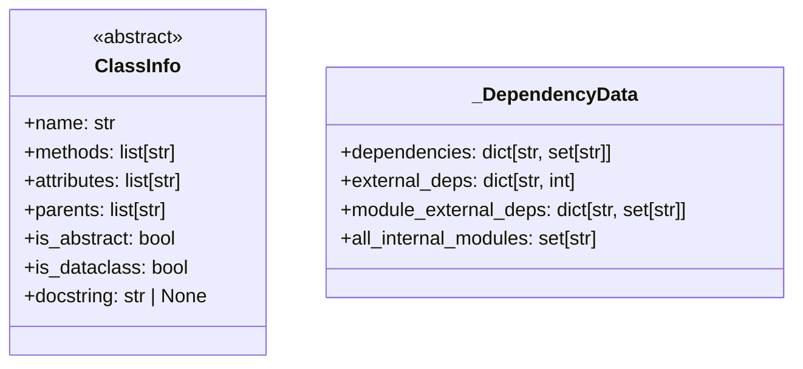

# File Overview

This file, `src/local_deepwiki/generators/diagrams.py`, provides functionality for generating Mermaid diagrams from code chunks. It includes utilities for parsing class and method information, extracting type annotations, and building class diagrams with inheritance relationships. It also supports dependency graph generation for modules and external libraries.

The module depends on standard Python libraries (`re`, `dataclasses`, `pathlib`, `typing`) and imports `ChunkType` and `IndexStatus` from `local_deepwiki.models`.

# Classes

## ClassInfo

Information about a class for diagram generation.

### Attributes

- `name`: str
- `methods`: list[str]
- `attributes`: list[str]
- `parents`: list[str]
- `is_abstract`: bool = False
- `is_dataclass`: bool = False
- `docstring`: str | None = None

## _DependencyData

Internal data structure for dependency graph generation.

### Attributes

- `dependencies`: dict[str, set[str]]
- `external_deps`: dict[str, int]
- `module_external_deps`: dict[str, set[str]]
- `all_internal_modules`: set[str]

# Functions

## sanitize_mermaid_name

Sanitize a name for use in Mermaid diagrams.

### Parameters

- `name`: str - Original name.

### Returns

- `str` - Sanitized name safe for Mermaid syntax.

## _unwrap_chunk

Unwrap SearchResult to get the underlying chunk.

### Parameters

- `chunk`: Any - The chunk to unwrap.

### Returns

- `Any` - The unwrapped chunk.

## _collect_class_from_chunk

Extract class info from a CLASS chunk and add to dictionaries.

### Parameters

- `chunk`: Any - The chunk to process.
- `classes`: dict[str, ClassInfo] - Dictionary of class information.
- `methods_by_class`: dict[str, list[tuple[str, str | None]]] - Methods grouped by class.
- `show_attributes`: bool - Whether to show class attributes.

### Returns

- `None`

## _collect_method_from_chunk

Extract method info from a METHOD chunk and add to dictionary.

### Parameters

- `chunk`: Any - The chunk to process.
- `methods_by_class`: dict[str, list[tuple[str, str | None]]] - Methods grouped by class.
- `show_types`: bool - Whether to show type annotations.

### Returns

- `None`

## _extract_methods_from_class_content

Extract methods from class content for classes without METHOD chunks.

### Parameters

- `chunks`: list - List of chunks.
- `classes`: dict[str, ClassInfo] - Dictionary of class information.
- `methods_by_class`: dict[str, list[tuple[str, str | None]]] - Methods grouped by class.
- `show_types`: bool - Whether to show type annotations.

### Returns

- `None`

## _build_class_lines

Build Mermaid diagram lines for a single class.

### Parameters

- `class_name`: str - The name of the class.
- `class_info`: ClassInfo - Information about the class.
- `methods_by_class`: dict[str, list[tuple[str, str | None]]] - Methods grouped by class.
- `max_methods`: int - Maximum number of methods to show.
- `show_types`: bool - Whether to show type annotations.

### Returns

- `list[str]` - Lines of Mermaid diagram code.

## _build_inheritance_lines

Build Mermaid inheritance relationship lines.

### Parameters

- `classes`: dict[str, ClassInfo] - Dictionary of class information.

### Returns

- `list[str]` - Lines of Mermaid diagram code for inheritance.

## generate_class_diagram

Generate an enhanced Mermaid class diagram from code chunks.

### Parameters

- `chunks`: list - List of CodeChunk or SearchResult objects.
- `show_attributes`: bool = True - Whether to show class attributes.
- `show_types`: bool = True - Whether to show type annotations.
- `max_methods`: int = 15 - Maximum number of methods to show.

### Returns

- `str | None` - Mermaid diagram code or None if no classes found.

## _extract_class_attributes

Extract class attributes from content.

### Parameters

- `content`: str - Class source code.
- `language`: str = "python" - Programming language.

### Returns

- `list[str]` - List of attribute strings like "+name: str" or "-_count: int".

## _extract_method_signature

Extract method signature with types from content.

### Parameters

- `content`: str - Method source code.

### Returns

- `str | None` - Signature string like "(x: int, y: str) -> bool" or None.

## _is_test_module

Check if a module is a test module.

### Parameters

- `module`: str - Module name like 'test_parser' or 'core.indexer'.
- `file_path`: str - File path like 'tests/test_parser.py'.

### Returns

- `bool` - True if this is a test module.

## _collect_dependencies

[Undocumented function]

## _build_internal_deps

[Undocumented function]

## _group_modules

[Undocumented function]

## _build_node_ids

[Undocumented function]

## _add_subgraphs

[Undocumented function]

## _add_external_subgraph

[Undocumented function]

# Integration

This file is part of the `local_deepwiki` project and integrates with other modules in the codebase through:

- Imports from `local_deepwiki.models` (ChunkType, IndexStatus)
- Used by functions in `src/local_deepwiki/cli/__init__.py`, `src/local_deepwiki/core/__init__.py`, and `tests/test_plugins.py`
- Called by functions in `dependency_graph`, `test_dependency_graph`, `test_diagrams`, and other test-related modules

The diagram generation functions are used to visualize code structure and dependencies, supporting documentation and code understanding tasks within the project.

# Usage Examples

## Generate a Class Diagram

```python
from diagrams import generate_class_diagram

chunks = [...]  # List of CodeChunk or SearchResult objects
diagram = generate_class_diagram(chunks, show_attributes=True, show_types=True)
```

## Sanitize a Mermaid Name

```python
from diagrams import sanitize_mermaid_name

safe_name = sanitize_mermaid_name("My<Module>")
```

## Check if a Module is a Test Module

```python
from diagrams import _is_test_module

is_test = _is_test_module("test_parser", "tests/test_parser.py")
```

## API Reference

### class `ClassInfo`

Information about a class for diagram generation.

---


<details>
<summary>View Source (lines 12-21) | <a href="https://github.com/UrbanDiver/local-deepwiki-mcp/blob/main/src/local_deepwiki/generators/diagrams.py#L12-L21">GitHub</a></summary>

```python
class ClassInfo:
    """Information about a class for diagram generation."""

    name: str
    methods: list[str]
    attributes: list[str]
    parents: list[str]
    is_abstract: bool = False
    is_dataclass: bool = False
    docstring: str | None = None
```

</details>

### Functions

#### `sanitize_mermaid_name`

```python
def sanitize_mermaid_name(name: str) -> str
```

Sanitize a name for use in Mermaid diagrams.


| Parameter | Type | Default | Description |
|-----------|------|---------|-------------|
| `name` | `str` | - | Original name. |

**Returns:** `str`


<details>
<summary>View Source (lines 24-40) | <a href="https://github.com/UrbanDiver/local-deepwiki-mcp/blob/main/src/local_deepwiki/generators/diagrams.py#L24-L40">GitHub</a></summary>

```python
def sanitize_mermaid_name(name: str) -> str:
    """Sanitize a name for use in Mermaid diagrams.

    Args:
        name: Original name.

    Returns:
        Sanitized name safe for Mermaid syntax.
    """
    # Replace problematic characters
    result = name.replace("<", "_").replace(">", "_").replace(" ", "_")
    result = result.replace("[", "_").replace("]", "_").replace(".", "_")
    result = result.replace("-", "_").replace(":", "_")
    # Ensure it starts with a letter
    if result and result[0].isdigit():
        result = "C" + result
    return result
```

</details>

#### `generate_class_diagram`

```python
def generate_class_diagram(chunks: list, show_attributes: bool = True, show_types: bool = True, max_methods: int = 15) -> str | None
```

Generate an enhanced Mermaid class diagram from code chunks.  Features: - Shows class attributes/properties (not just methods) - Shows type annotations for parameters and return types - Distinguishes abstract classes, dataclasses, protocols - Shows inheritance relationships


| Parameter | Type | Default | Description |
|-----------|------|---------|-------------|
| `chunks` | `list` | - | List of CodeChunk or SearchResult objects. |
| `show_attributes` | `bool` | `True` | Whether to show class attributes. |
| `show_types` | `bool` | `True` | Whether to show type annotations. |
| `max_methods` | `int` | `15` | Maximum methods to show per class. |

**Returns:** `str | None`


<details>
<summary>View Source (lines 176-230) | <a href="https://github.com/UrbanDiver/local-deepwiki-mcp/blob/main/src/local_deepwiki/generators/diagrams.py#L176-L230">GitHub</a></summary>

```python
def generate_class_diagram(
    chunks: list,
    show_attributes: bool = True,
    show_types: bool = True,
    max_methods: int = 15,
) -> str | None:
    """Generate an enhanced Mermaid class diagram from code chunks.

    Features:
    - Shows class attributes/properties (not just methods)
    - Shows type annotations for parameters and return types
    - Distinguishes abstract classes, dataclasses, protocols
    - Shows inheritance relationships

    Args:
        chunks: List of CodeChunk or SearchResult objects.
        show_attributes: Whether to show class attributes.
        show_types: Whether to show type annotations.
        max_methods: Maximum methods to show per class.

    Returns:
        Mermaid class diagram markdown string, or None if no classes found.
    """
    classes: dict[str, ClassInfo] = {}
    methods_by_class: dict[str, list[tuple[str, str | None]]] = {}

    # Collect class and method info from chunks
    for chunk in chunks:
        chunk = _unwrap_chunk(chunk)
        if chunk.chunk_type == ChunkType.CLASS:
            _collect_class_from_chunk(chunk, classes, methods_by_class, show_attributes)
        elif chunk.chunk_type == ChunkType.METHOD:
            _collect_method_from_chunk(chunk, methods_by_class, show_types)

    # Extract methods from class content for classes without METHOD chunks
    _extract_methods_from_class_content(chunks, classes, methods_by_class, show_types)

    # Assign methods to classes
    for class_name, method_list in methods_by_class.items():
        if class_name in classes:
            classes[class_name].methods = [m[0] for m in method_list[:max_methods]]

    # Filter to classes with content
    classes_with_content = {k: v for k, v in classes.items() if v.methods or v.attributes}
    if not classes_with_content:
        return None

    # Build Mermaid diagram
    lines = ["```mermaid", "classDiagram"]
    for class_name, class_info in sorted(classes_with_content.items()):
        lines.extend(_build_class_lines(class_name, class_info, methods_by_class, max_methods, show_types))
    lines.extend(_build_inheritance_lines(classes_with_content))
    lines.append("```")

    return "\n".join(lines)
```

</details>

#### `generate_dependency_graph`

```python
def generate_dependency_graph(chunks: list, project_name: str = "project", detect_circular: bool = True, show_external: bool = False, max_external: int = 10, wiki_base_path: str = "", exclude_tests: bool = True) -> str | None
```

Generate an enhanced Mermaid flowchart showing module dependencies.  Features: - Subgraphs grouping modules by top-level directory - Clickable nodes linking to wiki pages (when wiki_base_path provided) - Optional external dependency display with different styling - Circular dependency detection and highlighting


| Parameter | Type | Default | Description |
|-----------|------|---------|-------------|
| `chunks` | `list` | - | List of CodeChunk objects (should include IMPORT chunks). |
| `project_name` | `str` | `"project"` | Name of the project for filtering internal imports. |
| `detect_circular` | `bool` | `True` | Whether to highlight circular dependencies. |
| `show_external` | `bool` | `False` | Whether to show external (third-party) dependencies. |
| `max_external` | `int` | `10` | Maximum number of external dependencies to display. |
| `wiki_base_path` | `str` | `""` | Base path for wiki links (e.g., "files/"). Empty disables links. |
| `exclude_tests` | `bool` | `True` | Whether to exclude test modules from the graph (default: True). |

**Returns:** `str | None`


<details>
<summary>View Source (lines 577-659) | <a href="https://github.com/UrbanDiver/local-deepwiki-mcp/blob/main/src/local_deepwiki/generators/diagrams.py#L577-L659">GitHub</a></summary>

```python
def generate_dependency_graph(
    chunks: list,
    project_name: str = "project",
    detect_circular: bool = True,
    show_external: bool = False,
    max_external: int = 10,
    wiki_base_path: str = "",
    exclude_tests: bool = True,
) -> str | None:
    """Generate an enhanced Mermaid flowchart showing module dependencies.

    Features:
    - Subgraphs grouping modules by top-level directory
    - Clickable nodes linking to wiki pages (when wiki_base_path provided)
    - Optional external dependency display with different styling
    - Circular dependency detection and highlighting

    Args:
        chunks: List of CodeChunk objects (should include IMPORT chunks).
        project_name: Name of the project for filtering internal imports.
        detect_circular: Whether to highlight circular dependencies.
        show_external: Whether to show external (third-party) dependencies.
        max_external: Maximum number of external dependencies to display.
        wiki_base_path: Base path for wiki links (e.g., "files/"). Empty disables links.
        exclude_tests: Whether to exclude test modules from the graph (default: True).

    Returns:
        Mermaid flowchart markdown string, or None if no dependencies found.
    """
    # Collect all dependency data
    data = _collect_dependencies(chunks, project_name, show_external, exclude_tests)

    if not data.dependencies:
        return None

    # Build internal dependency graph
    internal_deps = _build_internal_deps(data.dependencies, data.all_internal_modules)
    module_groups = _group_modules(data.all_internal_modules)
    node_ids = _build_node_ids(data.all_internal_modules)

    # Detect circular dependencies
    circular_edges: set[tuple[str, str]] = set()
    if detect_circular and internal_deps:
        circular_edges = _find_circular_dependencies(internal_deps)

    # Build Mermaid flowchart
    lines = ["```mermaid", "flowchart TD"]

    # Add module subgraphs
    _add_subgraphs(lines, module_groups, node_ids)

    # Add external dependencies if enabled
    ext_node_ids: dict[str, str] = {}
    if show_external:
        ext_node_ids = _add_external_subgraph(lines, data.external_deps, max_external)

    # Add internal dependency edges
    _add_edges(lines, internal_deps, node_ids, circular_edges)

    # Add external dependency edges
    if show_external and ext_node_ids:
        for module, ext_imports in sorted(data.module_external_deps.items()):
            from_id = node_ids.get(module)
            if not from_id:
                continue
            for ext in sorted(ext_imports):
                target_ext_id = ext_node_ids.get(ext)
                if target_ext_id:
                    lines.append(f"    {from_id} -.-> {target_ext_id}")

    # Add click handlers for wiki links
    if wiki_base_path:
        for module, node_id in sorted(node_ids.items()):
            wiki_path = _module_to_wiki_path(module, project_name)
            lines.append(f'    click {node_id} "{wiki_base_path}{wiki_path}"')

    # Add styling
    lines.append("    classDef external fill:#2d2d3d,stroke:#666,stroke-dasharray: 5 5")
    _add_circular_styling(lines, internal_deps, node_ids, circular_edges)

    lines.append("```")

    return "\n".join(lines)
```

</details>

#### `dfs`

```python
def dfs(node: str, path: list[str], visited: set[str]) -> None
```


| Parameter | Type | Default | Description |
|-----------|------|---------|-------------|
| `node` | `str` | - | - |
| `path` | `list[str]` | - | - |
| `visited` | `set[str]` | - | - |

**Returns:** `None`


<details>
<summary>View Source (lines 717-733) | <a href="https://github.com/UrbanDiver/local-deepwiki-mcp/blob/main/src/local_deepwiki/generators/diagrams.py#L717-L733">GitHub</a></summary>

```python
def dfs(node: str, path: list[str], visited: set[str]) -> None:
        if node in path:
            # Found a cycle - mark all edges in the cycle
            cycle_start = path.index(node)
            cycle = path[cycle_start:] + [node]
            for i in range(len(cycle) - 1):
                circular.add((cycle[i], cycle[i + 1]))
            return

        if node in visited:
            return

        visited.add(node)
        path.append(node)

        for dep in deps.get(node, []):
            dfs(dep, path.copy(), visited)
```

</details>

#### `generate_module_overview`

```python
def generate_module_overview(index_status: IndexStatus, show_file_counts: bool = True) -> str | None
```

Generate a high-level module overview diagram.  Shows package structure with subgraphs for major directories.


| Parameter | Type | Default | Description |
|-----------|------|---------|-------------|
| `index_status` | `IndexStatus` | - | Index status with file information. |
| `show_file_counts` | `bool` | `True` | Whether to show file counts in nodes. |

**Returns:** `str | None`


<details>
<summary>View Source (lines 815-886) | <a href="https://github.com/UrbanDiver/local-deepwiki-mcp/blob/main/src/local_deepwiki/generators/diagrams.py#L815-L886">GitHub</a></summary>

```python
def generate_module_overview(
    index_status: IndexStatus,
    show_file_counts: bool = True,
) -> str | None:
    """Generate a high-level module overview diagram.

    Shows package structure with subgraphs for major directories.

    Args:
        index_status: Index status with file information.
        show_file_counts: Whether to show file counts in nodes.

    Returns:
        Mermaid diagram string, or None if not enough structure.
    """
    if not index_status.files:
        return None

    # Group files by top-level directory
    directories: dict[str, dict[str, int]] = {}  # dir -> {subdir: count}

    for file_info in index_status.files:
        parts = list(Path(file_info.path).parts)
        if len(parts) < 2:
            continue

        top_dir = parts[0]
        if top_dir in ("src", "lib", "pkg"):
            if len(parts) > 1:
                top_dir = parts[1]
                parts = parts[1:]

        if top_dir not in directories:
            directories[top_dir] = {}

        if len(parts) > 1:
            subdir = parts[1]
            directories[top_dir][subdir] = directories[top_dir].get(subdir, 0) + 1
        else:
            directories[top_dir]["_root"] = directories[top_dir].get("_root", 0) + 1

    if not directories:
        return None

    # Build diagram
    lines = ["```mermaid", "graph TB"]

    for top_dir, subdirs in sorted(directories.items()):
        safe_dir = sanitize_mermaid_name(top_dir)
        total_files = sum(subdirs.values())

        if len(subdirs) > 1 and "_root" not in subdirs:
            # Create subgraph for directories with multiple subdirs
            lines.append(f"    subgraph {safe_dir}[{top_dir}]")
            for subdir, count in sorted(subdirs.items()):
                if subdir != "_root":
                    safe_sub = sanitize_mermaid_name(f"{top_dir}_{subdir}")
                    label = f"{subdir}"
                    if show_file_counts:
                        label += f" ({count})"
                    lines.append(f"        {safe_sub}[{label}]")
            lines.append("    end")
        else:
            # Single node for simple directories
            label = top_dir
            if show_file_counts:
                label += f" ({total_files})"
            lines.append(f"    {safe_dir}[{label}]")

    lines.append("```")

    return "\n".join(lines)
```

</details>

#### `generate_language_pie_chart`

```python
def generate_language_pie_chart(index_status: IndexStatus) -> str | None
```

Generate a pie chart showing language distribution.


| Parameter | Type | Default | Description |
|-----------|------|---------|-------------|
| `index_status` | `IndexStatus` | - | Index status with language counts. |

**Returns:** `str | None`


<details>
<summary>View Source (lines 889-908) | <a href="https://github.com/UrbanDiver/local-deepwiki-mcp/blob/main/src/local_deepwiki/generators/diagrams.py#L889-L908">GitHub</a></summary>

```python
def generate_language_pie_chart(index_status: IndexStatus) -> str | None:
    """Generate a pie chart showing language distribution.

    Args:
        index_status: Index status with language counts.

    Returns:
        Mermaid pie chart string, or None if no languages.
    """
    if not index_status.languages:
        return None

    lines = ["```mermaid", "pie title Language Distribution"]

    for lang, count in sorted(index_status.languages.items(), key=lambda x: -x[1]):
        lines.append(f'    "{lang}" : {count}')

    lines.append("```")

    return "\n".join(lines)
```

</details>

#### `generate_sequence_diagram`

```python
def generate_sequence_diagram(call_graph: dict[str, list[str]], entry_point: str | None = None, max_depth: int = 5) -> str | None
```

Generate a sequence diagram from a call graph.  Shows the sequence of calls starting from an entry point.


| Parameter | Type | Default | Description |
|-----------|------|---------|-------------|
| `call_graph` | `dict[str, list[str]]` | - | Mapping of caller to list of callees. |
| `entry_point` | `str | None` | `None` | Starting function (if None, uses most-called function). |
| `max_depth` | `int` | `5` | Maximum call depth to show. |

**Returns:** `str | None`


<details>
<summary>View Source (lines 911-988) | <a href="https://github.com/UrbanDiver/local-deepwiki-mcp/blob/main/src/local_deepwiki/generators/diagrams.py#L911-L988">GitHub</a></summary>

```python
def generate_sequence_diagram(
    call_graph: dict[str, list[str]],
    entry_point: str | None = None,
    max_depth: int = 5,
) -> str | None:
    """Generate a sequence diagram from a call graph.

    Shows the sequence of calls starting from an entry point.

    Args:
        call_graph: Mapping of caller to list of callees.
        entry_point: Starting function (if None, uses most-called function).
        max_depth: Maximum call depth to show.

    Returns:
        Mermaid sequence diagram string, or None if empty.
    """
    if not call_graph:
        return None

    # Find entry point if not specified
    if not entry_point:
        # Find function with most outgoing calls
        entry_point = max(call_graph.keys(), key=lambda k: len(call_graph.get(k, [])), default=None)

    if not entry_point or entry_point not in call_graph:
        return None

    # Build sequence
    lines = ["```mermaid", "sequenceDiagram"]

    # Collect participants
    participants: set[str] = {entry_point}

    def collect_participants(func: str, depth: int) -> None:
        if depth > max_depth:
            return
        for callee in call_graph.get(func, []):
            participants.add(callee)
            collect_participants(callee, depth + 1)

    collect_participants(entry_point, 0)

    # Add participants
    for p in sorted(participants):
        safe_name = sanitize_mermaid_name(p)
        display = p.split(".")[-1] if "." in p else p
        lines.append(f"    participant {safe_name} as {display}")

    # Add calls
    visited: set[tuple[str, str]] = set()

    def add_calls(caller: str, depth: int) -> None:
        if depth > max_depth:
            return
        safe_caller = sanitize_mermaid_name(caller)
        for callee in call_graph.get(caller, []):
            if (caller, callee) in visited:
                continue
            visited.add((caller, callee))

            safe_callee = sanitize_mermaid_name(callee)
            lines.append(f"    {safe_caller}->>+{safe_callee}: call")

            # Recurse
            if callee in call_graph:
                add_calls(callee, depth + 1)

            lines.append(f"    {safe_callee}-->>-{safe_caller}: return")

    add_calls(entry_point, 0)

    if len(lines) <= 3:  # Only header and participants
        return None

    lines.append("```")

    return "\n".join(lines)
```

</details>

#### `collect_participants`

```python
def collect_participants(func: str, depth: int) -> None
```


| Parameter | Type | Default | Description |
|-----------|------|---------|-------------|
| `func` | `str` | - | - |
| `depth` | `int` | - | - |

**Returns:** `None`


<details>
<summary>View Source (lines 945-950) | <a href="https://github.com/UrbanDiver/local-deepwiki-mcp/blob/main/src/local_deepwiki/generators/diagrams.py#L945-L950">GitHub</a></summary>

```python
def collect_participants(func: str, depth: int) -> None:
        if depth > max_depth:
            return
        for callee in call_graph.get(func, []):
            participants.add(callee)
            collect_participants(callee, depth + 1)
```

</details>

#### `add_calls`

```python
def add_calls(caller: str, depth: int) -> None
```


| Parameter | Type | Default | Description |
|-----------|------|---------|-------------|
| `caller` | `str` | - | - |
| `depth` | `int` | - | - |

**Returns:** `None`


<details>
<summary>View Source (lines 963-979) | <a href="https://github.com/UrbanDiver/local-deepwiki-mcp/blob/main/src/local_deepwiki/generators/diagrams.py#L963-L979">GitHub</a></summary>

```python
def add_calls(caller: str, depth: int) -> None:
        if depth > max_depth:
            return
        safe_caller = sanitize_mermaid_name(caller)
        for callee in call_graph.get(caller, []):
            if (caller, callee) in visited:
                continue
            visited.add((caller, callee))

            safe_callee = sanitize_mermaid_name(callee)
            lines.append(f"    {safe_caller}->>+{safe_callee}: call")

            # Recurse
            if callee in call_graph:
                add_calls(callee, depth + 1)

            lines.append(f"    {safe_callee}-->>-{safe_caller}: return")
```

</details>

#### `generate_indexing_sequence`

```python
def generate_indexing_sequence() -> str
```

Generate sequence diagram for the indexing pipeline.  Shows how files are discovered, parsed, chunked, embedded, and stored in the vector database during repository indexing.

**Returns:** `str`


<details>
<summary>View Source (lines 991-1029) | <a href="https://github.com/UrbanDiver/local-deepwiki-mcp/blob/main/src/local_deepwiki/generators/diagrams.py#L991-L1029">GitHub</a></summary>

```python
def generate_indexing_sequence() -> str:
    """Generate sequence diagram for the indexing pipeline.

    Shows how files are discovered, parsed, chunked, embedded, and stored
    in the vector database during repository indexing.

    Returns:
        Mermaid sequence diagram as markdown string.
    """
    return """```mermaid
sequenceDiagram
    participant U as User
    participant I as RepositoryIndexer
    participant P as CodeParser
    participant C as CodeChunker
    participant E as EmbeddingProvider
    participant V as VectorStore
    participant F as FileSystem

    U->>I: index(repo_path, full_rebuild)
    I->>F: find_source_files()
    F-->>I: source_files[]
    I->>F: load_index_status()
    F-->>I: previous_status

    loop For each file batch
        I->>P: parse_file(path)
        P-->>I: tree, source
        I->>C: chunk_file(tree, source)
        C-->>I: CodeChunk[]
        I->>E: embed(chunk_contents)
        E-->>I: embeddings[]
        I->>V: add_chunks(chunks, embeddings)
        V-->>I: success
    end

    I->>F: save_index_status()
    I-->>U: IndexStatus
```"""
```

</details>

#### `generate_wiki_generation_sequence`

```python
def generate_wiki_generation_sequence() -> str
```

Generate sequence diagram for wiki generation.  Shows how the wiki generator searches for context, calls the LLM, and writes documentation files including parallel operations.

**Returns:** `str`


<details>
<summary>View Source (lines 1032-1088) | <a href="https://github.com/UrbanDiver/local-deepwiki-mcp/blob/main/src/local_deepwiki/generators/diagrams.py#L1032-L1088">GitHub</a></summary>

```python
def generate_wiki_generation_sequence() -> str:
    """Generate sequence diagram for wiki generation.

    Shows how the wiki generator searches for context, calls the LLM,
    and writes documentation files including parallel operations.

    Returns:
        Mermaid sequence diagram as markdown string.
    """
    return """```mermaid
sequenceDiagram
    participant U as User
    participant W as WikiGenerator
    participant V as VectorStore
    participant L as LLMProvider
    participant F as FileSystem

    U->>W: generate_wiki(index_status)

    rect rgb(40, 40, 60)
        note right of W: Generate Overview
        W->>V: search("main entry point")
        V-->>W: context_chunks
        W->>L: generate(overview_prompt)
        L-->>W: overview_markdown
        W->>F: write(index.md)
    end

    rect rgb(40, 40, 60)
        note right of W: Generate Architecture
        par Parallel searches
            W->>V: search("core components")
            W->>V: search("patterns")
            W->>V: search("data flow")
        end
        V-->>W: combined_context
        W->>L: generate(architecture_prompt)
        L-->>W: architecture_markdown
        W->>F: write(architecture.md)
    end

    rect rgb(40, 40, 60)
        note right of W: Generate Module Docs
        loop For each module
            W->>V: search(module_query)
            V-->>W: module_chunks
            W->>L: generate(module_prompt)
            L-->>W: module_markdown
            W->>F: write(modules/{name}.md)
        end
    end

    W->>W: add_cross_links()
    W->>W: add_see_also_sections()
    W->>F: write(search.json, toc.json)
    W-->>U: WikiStructure
```"""
```

</details>

#### `generate_deep_research_sequence`

```python
def generate_deep_research_sequence() -> str
```

Generate sequence diagram for deep research pipeline.  Shows the 5-step deep research process: decomposition, parallel retrieval, gap analysis, follow-up retrieval, and synthesis.

**Returns:** `str`


<details>
<summary>View Source (lines 1091-1146) | <a href="https://github.com/UrbanDiver/local-deepwiki-mcp/blob/main/src/local_deepwiki/generators/diagrams.py#L1091-L1146">GitHub</a></summary>

```python
def generate_deep_research_sequence() -> str:
    """Generate sequence diagram for deep research pipeline.

    Shows the 5-step deep research process: decomposition, parallel retrieval,
    gap analysis, follow-up retrieval, and synthesis.

    Returns:
        Mermaid sequence diagram as markdown string.
    """
    return """```mermaid
sequenceDiagram
    participant U as User
    participant D as DeepResearchPipeline
    participant L as LLMProvider
    participant V as VectorStore

    U->>D: research(question)

    rect rgb(50, 40, 40)
        note right of D: Step 1: Decomposition
        D->>L: decompose_question(question)
        L-->>D: SubQuestion[]
    end

    rect rgb(40, 50, 40)
        note right of D: Step 2: Parallel Retrieval
        par For each sub-question
            D->>V: search(sub_q1)
            D->>V: search(sub_q2)
            D->>V: search(sub_q3)
        end
        V-->>D: SearchResult[][]
    end

    rect rgb(40, 40, 50)
        note right of D: Step 3: Gap Analysis
        D->>L: analyze_gaps(context)
        L-->>D: follow_up_queries[]
    end

    rect rgb(50, 50, 40)
        note right of D: Step 4: Follow-up Retrieval
        par For each follow-up
            D->>V: search(follow_up)
        end
        V-->>D: additional_results[]
    end

    rect rgb(50, 40, 50)
        note right of D: Step 5: Synthesis
        D->>L: synthesize(all_context)
        L-->>D: comprehensive_answer
    end

    D-->>U: DeepResearchResult
```"""
```

</details>

#### `generate_workflow_sequences`

```python
def generate_workflow_sequences() -> str
```

Generate all workflow sequence diagrams combined.  Returns a markdown string with all three workflow diagrams: indexing, wiki generation, and deep research.

**Returns:** `str`


<details>
<summary>View Source (lines 1149-1169) | <a href="https://github.com/UrbanDiver/local-deepwiki-mcp/blob/main/src/local_deepwiki/generators/diagrams.py#L1149-L1169">GitHub</a></summary>

```python
def generate_workflow_sequences() -> str:
    """Generate all workflow sequence diagrams combined.

    Returns a markdown string with all three workflow diagrams:
    indexing, wiki generation, and deep research.

    Returns:
        Combined markdown with section headers and diagrams.
    """
    return f"""### Indexing Pipeline

{generate_indexing_sequence()}

### Wiki Generation Pipeline

{generate_wiki_generation_sequence()}

### Deep Research Pipeline

{generate_deep_research_sequence()}
"""
```

</details>

## Class Diagram


```mermaid
classDiagram
    class ClassInfo {
        <<abstract>>
        +name: str
        +methods: list[str]
        +attributes: list[str]
        +parents: list[str]
        +is_abstract: bool
        +is_dataclass: bool
        +docstring: str | None
    }
    class _DependencyData {
        +dependencies: dict[str, set[str]]
        +external_deps: dict[str, int]
        +module_external_deps: dict[str, set[str]]
        +all_internal_modules: set[str]
    }
```

## Call Graph


```mermaid
flowchart TD
    N0[Path]
    N1[_add_subgraphs]
    N2[_build_class_lines]
    N3[_build_inheritance_lines]
    N4[_collect_class_from_chunk]
    N5[_collect_dependencies]
    N6[_collect_method_from_chunk]
    N7[_extract_class_attributes]
    N8[_extract_method_signature]
    N9[_extract_methods_from_class...]
    N10[_find_circular_dependencies]
    N11[_parse_external_import]
    N12[_parse_import_line]
    N13[_path_to_module]
    N14[_unwrap_chunk]
    N15[add]
    N16[add_calls]
    N17[collect_participants]
    N18[compile]
    N19[copy]
    N20[dfs]
    N21[finditer]
    N22[generate_class_diagram]
    N23[generate_dependency_graph]
    N24[generate_module_overview]
    N25[generate_sequence_diagram]
    N26[generate_workflow_sequences]
    N27[group]
    N28[match]
    N29[sanitize_mermaid_name]
    N4 --> N7
    N6 --> N8
    N9 --> N18
    N9 --> N14
    N9 --> N21
    N9 --> N27
    N2 --> N29
    N3 --> N29
    N22 --> N14
    N22 --> N4
    N22 --> N6
    N22 --> N9
    N22 --> N2
    N22 --> N3
    N7 --> N18
    N7 --> N21
    N8 --> N18
    N8 --> N27
    N5 --> N13
    N5 --> N15
    N5 --> N12
    N5 --> N11
    N1 --> N29
    N23 --> N5
    N23 --> N10
    N23 --> N1
    N11 --> N28
    N11 --> N27
    N10 --> N15
    N10 --> N20
    N10 --> N19
    N20 --> N15
    N20 --> N20
    N20 --> N19
    N13 --> N0
    N12 --> N28
    N12 --> N27
    N24 --> N0
    N24 --> N29
    N25 --> N15
    N25 --> N17
    N25 --> N29
    N25 --> N16
    N17 --> N15
    N17 --> N17
    N16 --> N29
    N16 --> N15
    N16 --> N16
    classDef func fill:#e1f5fe
    class N0,N1,N2,N3,N4,N5,N6,N7,N8,N9,N10,N11,N12,N13,N14,N15,N16,N17,N18,N19,N20,N21,N22,N23,N24,N25,N26,N27,N28,N29 func
```

## Used By

Functions and methods in this file and their callers:

- **`ClassInfo`**: called by `_collect_class_from_chunk`
- **`Path`**: called by `_path_to_module`, `generate_module_overview`
- **`_DependencyData`**: called by `_collect_dependencies`
- **`_add_circular_styling`**: called by `generate_dependency_graph`
- **`_add_edges`**: called by `generate_dependency_graph`
- **`_add_external_subgraph`**: called by `generate_dependency_graph`
- **`_add_subgraphs`**: called by `generate_dependency_graph`
- **`_build_class_lines`**: called by `generate_class_diagram`
- **`_build_inheritance_lines`**: called by `generate_class_diagram`
- **`_build_internal_deps`**: called by `generate_dependency_graph`
- **`_build_node_ids`**: called by `generate_dependency_graph`
- **`_collect_class_from_chunk`**: called by `generate_class_diagram`
- **`_collect_dependencies`**: called by `generate_dependency_graph`
- **`_collect_method_from_chunk`**: called by `generate_class_diagram`
- **`_extract_class_attributes`**: called by `_collect_class_from_chunk`
- **`_extract_method_signature`**: called by `_collect_method_from_chunk`
- **`_extract_methods_from_class_content`**: called by `generate_class_diagram`
- **`_find_circular_dependencies`**: called by `generate_dependency_graph`
- **`_group_modules`**: called by `generate_dependency_graph`
- **`_is_test_module`**: called by `_collect_dependencies`
- **`_module_to_wiki_path`**: called by `generate_dependency_graph`
- **`_parse_external_import`**: called by `_collect_dependencies`
- **`_parse_import_line`**: called by `_collect_dependencies`
- **`_path_to_module`**: called by `_collect_dependencies`
- **`_unwrap_chunk`**: called by `_extract_methods_from_class_content`, `generate_class_diagram`
- **`add`**: called by `_collect_dependencies`, `_find_circular_dependencies`, `add_calls`, `collect_participants`, `dfs`, `generate_sequence_diagram`
- **`add_calls`**: called by `add_calls`, `generate_sequence_diagram`
- **`collect_participants`**: called by `collect_participants`, `generate_sequence_diagram`
- **`compile`**: called by `_extract_class_attributes`, `_extract_method_signature`, `_extract_methods_from_class_content`
- **`copy`**: called by `_find_circular_dependencies`, `dfs`
- **`dfs`**: called by `_find_circular_dependencies`, `dfs`
- **`finditer`**: called by `_extract_class_attributes`, `_extract_methods_from_class_content`
- **`generate_deep_research_sequence`**: called by `generate_workflow_sequences`
- **`generate_indexing_sequence`**: called by `generate_workflow_sequences`
- **`generate_wiki_generation_sequence`**: called by `generate_workflow_sequences`
- **`group`**: called by `_extract_method_signature`, `_extract_methods_from_class_content`, `_parse_external_import`, `_parse_import_line`
- **`groups`**: called by `_extract_class_attributes`
- **`isdigit`**: called by `sanitize_mermaid_name`
- **`match`**: called by `_parse_external_import`, `_parse_import_line`
- **`sanitize_mermaid_name`**: called by `_add_subgraphs`, `_build_class_lines`, `_build_inheritance_lines`, `add_calls`, `generate_module_overview`, `generate_sequence_diagram`
- **`search`**: called by `_extract_method_signature`
- **`title`**: called by `_add_subgraphs`

## Usage Examples

*Examples extracted from test files*

### Test basic name passes through

From `test_diagrams.py::TestSanitizeMermaidName::test_basic_name`:

```python
assert sanitize_mermaid_name("MyClass") == "MyClass"
```

### Test angle brackets are replaced

From `test_diagrams.py::TestSanitizeMermaidName::test_replaces_brackets`:

```python
assert sanitize_mermaid_name("List<int>") == "List_int_"
```

### Test extraction of class-level type annotations

From `test_diagrams.py::TestExtractClassAttributes::test_extracts_type_annotations`:

```python
content = """class MyClass:
    name: str
    count: int
"""
        attrs = _extract_class_attributes(content, "python")
        assert "+name: str" in attrs
        assert "+count: int" in attrs
```

### Test extraction from __init__ assignments

From `test_diagrams.py::TestExtractClassAttributes::test_extracts_init_assignments`:

```python
content = """class MyClass:
    def __init__(self):
        self.value = 42
        self._private = "secret"
"""
        attrs = _extract_class_attributes(content, "python")
        assert "+value" in attrs
        assert "-_private" in attrs
```

### Test extraction of return type

From `test_diagrams.py::TestExtractMethodSignature::test_extracts_return_type`:

```python
content = "def process(x: int, y: str) -> bool:"
sig = _extract_method_signature(content)
assert "bool" in sig
```


## Last Modified

| Entity | Type | Author | Date | Commit |
|--------|------|--------|------|--------|
| `_unwrap_chunk` | function | Brian Breidenbach | 1 week ago | `1e08705` Refactor generate_file_docs... |
| `_collect_class_from_chunk` | function | Brian Breidenbach | 1 week ago | `1e08705` Refactor generate_file_docs... |
| `_collect_method_from_chunk` | function | Brian Breidenbach | 1 week ago | `1e08705` Refactor generate_file_docs... |
| `_extract_methods_from_class_content` | function | Brian Breidenbach | 1 week ago | `1e08705` Refactor generate_file_docs... |
| `_build_class_lines` | function | Brian Breidenbach | 1 week ago | `1e08705` Refactor generate_file_docs... |
| `_build_inheritance_lines` | function | Brian Breidenbach | 1 week ago | `1e08705` Refactor generate_file_docs... |
| `generate_class_diagram` | function | Brian Breidenbach | 1 week ago | `1e08705` Refactor generate_file_docs... |
| `_DependencyData` | class | Brian Breidenbach | 1 week ago | `8c219ae` Refactor long functions in ... |
| `_collect_dependencies` | function | Brian Breidenbach | 1 week ago | `8c219ae` Refactor long functions in ... |
| `_build_internal_deps` | function | Brian Breidenbach | 1 week ago | `8c219ae` Refactor long functions in ... |
| `_group_modules` | function | Brian Breidenbach | 1 week ago | `8c219ae` Refactor long functions in ... |
| `_build_node_ids` | function | Brian Breidenbach | 1 week ago | `8c219ae` Refactor long functions in ... |
| `_add_subgraphs` | function | Brian Breidenbach | 1 week ago | `8c219ae` Refactor long functions in ... |
| `_add_external_subgraph` | function | Brian Breidenbach | 1 week ago | `8c219ae` Refactor long functions in ... |
| `_add_edges` | function | Brian Breidenbach | 1 week ago | `8c219ae` Refactor long functions in ... |
| `_add_circular_styling` | function | Brian Breidenbach | 1 week ago | `8c219ae` Refactor long functions in ... |
| `generate_dependency_graph` | function | Brian Breidenbach | 1 week ago | `8c219ae` Refactor long functions in ... |
| `generate_indexing_sequence` | function | Brian Breidenbach | 3 weeks ago | `0d91a70` Apply Python best practices... |
| `generate_wiki_generation_sequence` | function | Brian Breidenbach | 3 weeks ago | `0d91a70` Apply Python best practices... |
| `generate_deep_research_sequence` | function | Brian Breidenbach | 3 weeks ago | `0d91a70` Apply Python best practices... |
| `_is_test_module` | function | Brian Breidenbach | 3 weeks ago | `42a9a7b` Fix dependencies page: loca... |
| `_parse_external_import` | function | Brian Breidenbach | 3 weeks ago | `c652a2a` Add enhanced dependency gra... |
| `_module_to_wiki_path` | function | Brian Breidenbach | 3 weeks ago | `c652a2a` Add enhanced dependency gra... |
| `generate_workflow_sequences` | function | Brian Breidenbach | 3 weeks ago | `4048ed9` Add workflow sequence diagr... |
| `generate_module_overview` | function | Brian Breidenbach | 3 weeks ago | `c568951` Add input validation, type ... |
| `ClassInfo` | class | Brian Breidenbach | 3 weeks ago | `cfae86f` Enhance diagram generation ... |
| `sanitize_mermaid_name` | function | Brian Breidenbach | 3 weeks ago | `cfae86f` Enhance diagram generation ... |
| `_extract_class_attributes` | function | Brian Breidenbach | 3 weeks ago | `cfae86f` Enhance diagram generation ... |
| `_extract_method_signature` | function | Brian Breidenbach | 3 weeks ago | `cfae86f` Enhance diagram generation ... |
| `_find_circular_dependencies` | function | Brian Breidenbach | 3 weeks ago | `cfae86f` Enhance diagram generation ... |
| `dfs` | function | Brian Breidenbach | 3 weeks ago | `cfae86f` Enhance diagram generation ... |
| `_path_to_module` | function | Brian Breidenbach | 3 weeks ago | `cfae86f` Enhance diagram generation ... |
| `_parse_import_line` | function | Brian Breidenbach | 3 weeks ago | `cfae86f` Enhance diagram generation ... |
| `generate_language_pie_chart` | function | Brian Breidenbach | 3 weeks ago | `cfae86f` Enhance diagram generation ... |
| `generate_sequence_diagram` | function | Brian Breidenbach | 3 weeks ago | `cfae86f` Enhance diagram generation ... |
| `collect_participants` | function | Brian Breidenbach | 3 weeks ago | `cfae86f` Enhance diagram generation ... |
| `add_calls` | function | Brian Breidenbach | 3 weeks ago | `cfae86f` Enhance diagram generation ... |

## Additional Source Code

Source code for functions and methods not listed in the API Reference above.

#### `_unwrap_chunk`

<details>
<summary>View Source (lines 43-45) | <a href="https://github.com/UrbanDiver/local-deepwiki-mcp/blob/main/src/local_deepwiki/generators/diagrams.py#L43-L45">GitHub</a></summary>

```python
def _unwrap_chunk(chunk: Any) -> Any:
    """Unwrap SearchResult to get the underlying chunk."""
    return chunk.chunk if hasattr(chunk, "chunk") else chunk
```

</details>


#### `_collect_class_from_chunk`

<details>
<summary>View Source (lines 48-80) | <a href="https://github.com/UrbanDiver/local-deepwiki-mcp/blob/main/src/local_deepwiki/generators/diagrams.py#L48-L80">GitHub</a></summary>

```python
def _collect_class_from_chunk(
    chunk: Any,
    classes: dict[str, ClassInfo],
    methods_by_class: dict[str, list[tuple[str, str | None]]],
    show_attributes: bool,
) -> None:
    """Extract class info from a CLASS chunk and add to dictionaries."""
    class_name = chunk.name or "Unknown"
    if class_name in classes:
        return

    attributes = _extract_class_attributes(
        chunk.content, chunk.language.value if hasattr(chunk, "language") else "python"
    )

    is_abstract = (
        "ABC" in str(chunk.metadata.get("parent_classes", []))
        or "abstract" in chunk.content.lower()
    )
    is_dataclass = "@dataclass" in chunk.content or "BaseModel" in str(
        chunk.metadata.get("parent_classes", [])
    )

    classes[class_name] = ClassInfo(
        name=class_name,
        methods=[],
        attributes=attributes if show_attributes else [],
        parents=chunk.metadata.get("parent_classes", []),
        is_abstract=is_abstract,
        is_dataclass=is_dataclass,
        docstring=chunk.docstring,
    )
    methods_by_class[class_name] = []
```

</details>


#### `_collect_method_from_chunk`

<details>
<summary>View Source (lines 83-99) | <a href="https://github.com/UrbanDiver/local-deepwiki-mcp/blob/main/src/local_deepwiki/generators/diagrams.py#L83-L99">GitHub</a></summary>

```python
def _collect_method_from_chunk(
    chunk: Any,
    methods_by_class: dict[str, list[tuple[str, str | None]]],
    show_types: bool,
) -> None:
    """Extract method info from a METHOD chunk and add to dictionary."""
    parent = chunk.parent_name or "Unknown"
    method_name = chunk.name or "unknown"

    signature = _extract_method_signature(chunk.content) if show_types else None

    if parent not in methods_by_class:
        methods_by_class[parent] = []

    existing = [m[0] for m in methods_by_class[parent]]
    if method_name not in existing:
        methods_by_class[parent].append((method_name, signature))
```

</details>


#### `_extract_methods_from_class_content`

<details>
<summary>View Source (lines 102-129) | <a href="https://github.com/UrbanDiver/local-deepwiki-mcp/blob/main/src/local_deepwiki/generators/diagrams.py#L102-L129">GitHub</a></summary>

```python
def _extract_methods_from_class_content(
    chunks: list,
    classes: dict[str, ClassInfo],
    methods_by_class: dict[str, list[tuple[str, str | None]]],
    show_types: bool,
) -> None:
    """Extract methods from class content for classes without METHOD chunks."""
    method_pattern = re.compile(r"(?:async\s+)?def\s+(\w+)\s*\([^)]*\)(?:\s*->\s*([^:]+))?:")

    for class_name in classes:
        if methods_by_class.get(class_name):
            continue

        for chunk in chunks:
            chunk = _unwrap_chunk(chunk)
            if chunk.chunk_type == ChunkType.CLASS and chunk.name == class_name:
                for match in method_pattern.finditer(chunk.content):
                    method_name = match.group(1)
                    return_type = match.group(2)
                    if method_name not in [m[0] for m in methods_by_class.get(class_name, [])]:
                        if class_name not in methods_by_class:
                            methods_by_class[class_name] = []
                        sig = (
                            f"() -> {return_type.strip()}"
                            if return_type and show_types
                            else "()"
                        )
                        methods_by_class[class_name].append((method_name, sig))
```

</details>


#### `_build_class_lines`

<details>
<summary>View Source (lines 132-162) | <a href="https://github.com/UrbanDiver/local-deepwiki-mcp/blob/main/src/local_deepwiki/generators/diagrams.py#L132-L162">GitHub</a></summary>

```python
def _build_class_lines(
    class_name: str,
    class_info: ClassInfo,
    methods_by_class: dict[str, list[tuple[str, str | None]]],
    max_methods: int,
    show_types: bool,
) -> list[str]:
    """Build Mermaid diagram lines for a single class."""
    lines: list[str] = []
    safe_name = sanitize_mermaid_name(class_name)

    lines.append(f"    class {safe_name} {{")
    if class_info.is_dataclass:
        lines.append("        <<dataclass>>")
    elif class_info.is_abstract:
        lines.append("        <<abstract>>")

    for attr in class_info.attributes[:10]:
        lines.append(f"        {attr}")

    method_list = methods_by_class.get(class_name, [])
    for method_name, signature in method_list[:max_methods]:
        prefix = "-" if method_name.startswith("_") else "+"
        safe_method = sanitize_mermaid_name(method_name)
        if signature and show_types:
            lines.append(f"        {prefix}{safe_method}{signature}")
        else:
            lines.append(f"        {prefix}{safe_method}()")

    lines.append("    }")
    return lines
```

</details>


#### `_build_inheritance_lines`

<details>
<summary>View Source (lines 165-173) | <a href="https://github.com/UrbanDiver/local-deepwiki-mcp/blob/main/src/local_deepwiki/generators/diagrams.py#L165-L173">GitHub</a></summary>

```python
def _build_inheritance_lines(classes: dict[str, ClassInfo]) -> list[str]:
    """Build Mermaid inheritance relationship lines."""
    lines: list[str] = []
    for class_name, class_info in sorted(classes.items()):
        safe_child = sanitize_mermaid_name(class_name)
        for parent in class_info.parents:
            safe_parent = sanitize_mermaid_name(parent)
            lines.append(f"    {safe_child} --|> {safe_parent}")
    return lines
```

</details>


#### `_extract_class_attributes`

<details>
<summary>View Source (lines 233-271) | <a href="https://github.com/UrbanDiver/local-deepwiki-mcp/blob/main/src/local_deepwiki/generators/diagrams.py#L233-L271">GitHub</a></summary>

```python
def _extract_class_attributes(content: str, language: str = "python") -> list[str]:
    """Extract class attributes from content.

    Args:
        content: Class source code.
        language: Programming language.

    Returns:
        List of attribute strings like "+name: str" or "-_count: int".
    """
    attributes = []

    if language in ("python", "py"):
        # Match class-level type annotations: name: Type or self.name: Type
        # Also match __init__ assignments
        attr_pattern = re.compile(r"^\s{4}(\w+)\s*:\s*([^=\n]+?)(?:\s*=|$)", re.MULTILINE)
        init_pattern = re.compile(r"self\.(\w+)\s*(?::\s*([^\s=]+))?\s*=")

        for match in attr_pattern.finditer(content):
            name, type_hint = match.groups()
            if name not in ("self", "cls") and not name.startswith("__"):
                prefix = "-" if name.startswith("_") else "+"
                type_str = type_hint.strip() if type_hint else ""
                if type_str:
                    attributes.append(f"{prefix}{name}: {type_str}")
                else:
                    attributes.append(f"{prefix}{name}")

        for match in init_pattern.finditer(content):
            name, type_hint = match.groups()
            if name not in [a.split(":")[0].strip("+-") for a in attributes]:
                if not name.startswith("__"):
                    prefix = "-" if name.startswith("_") else "+"
                    if type_hint:
                        attributes.append(f"{prefix}{name}: {type_hint}")
                    else:
                        attributes.append(f"{prefix}{name}")

    return attributes[:10]  # Limit to 10 attributes
```

</details>


#### `_extract_method_signature`

<details>
<summary>View Source (lines 274-314) | <a href="https://github.com/UrbanDiver/local-deepwiki-mcp/blob/main/src/local_deepwiki/generators/diagrams.py#L274-L314">GitHub</a></summary>

```python
def _extract_method_signature(content: str) -> str | None:
    """Extract method signature with types from content.

    Args:
        content: Method source code.

    Returns:
        Signature string like "(x: int, y: str) -> bool" or None.
    """
    # Match def method(params) -> return_type:
    sig_pattern = re.compile(r"def\s+\w+\s*\(([^)]*)\)(?:\s*->\s*([^:]+))?:")
    match = sig_pattern.search(content)
    if not match:
        return None

    params_str = match.group(1)
    return_type = match.group(2)

    # Simplify params (remove defaults, keep just name: type)
    params = []
    for param in params_str.split(","):
        param = param.strip()
        if not param or param == "self" or param == "cls":
            continue
        # Extract name and type
        if ":" in param:
            name_type = param.split("=")[0].strip()  # Remove default
            params.append(name_type)
        else:
            name = param.split("=")[0].strip()
            if name:
                params.append(name)

    sig = f"({', '.join(params[:4])})"  # Limit to 4 params for readability
    if len(params) > 4:
        sig = f"({', '.join(params[:3])}, ...)"

    if return_type:
        sig += f" {return_type.strip()}"

    return sig
```

</details>


#### `_is_test_module`

<details>
<summary>View Source (lines 317-333) | <a href="https://github.com/UrbanDiver/local-deepwiki-mcp/blob/main/src/local_deepwiki/generators/diagrams.py#L317-L333">GitHub</a></summary>

```python
def _is_test_module(module: str, file_path: str) -> bool:
    """Check if a module is a test module.

    Args:
        module: Module name like 'test_parser' or 'core.indexer'.
        file_path: File path like 'tests/test_parser.py'.

    Returns:
        True if this is a test module.
    """
    # Check module name
    if module.startswith("test_") or ".test_" in module:
        return True
    # Check file path
    if "/tests/" in file_path or file_path.startswith("tests/"):
        return True
    return False
```

</details>


### `_DependencyData`

<details>
<summary>View Source (lines 337-343) | <a href="https://github.com/UrbanDiver/local-deepwiki-mcp/blob/main/src/local_deepwiki/generators/diagrams.py#L337-L343">GitHub</a></summary>

```python
class _DependencyData:
    """Internal data structure for dependency graph generation."""

    dependencies: dict[str, set[str]]
    external_deps: dict[str, int]
    module_external_deps: dict[str, set[str]]
    all_internal_modules: set[str]
```

</details>


#### `_collect_dependencies`

<details>
<summary>View Source (lines 346-410) | <a href="https://github.com/UrbanDiver/local-deepwiki-mcp/blob/main/src/local_deepwiki/generators/diagrams.py#L346-L410">GitHub</a></summary>

```python
def _collect_dependencies(
    chunks: list,
    project_name: str,
    show_external: bool,
    exclude_tests: bool,
) -> _DependencyData:
    """Collect module dependencies from import chunks.

    Args:
        chunks: List of CodeChunk objects.
        project_name: Name of the project for filtering internal imports.
        show_external: Whether to collect external dependencies.
        exclude_tests: Whether to exclude test modules.

    Returns:
        DependencyData with collected dependencies.
    """
    dependencies: dict[str, set[str]] = {}
    external_deps: dict[str, int] = {}
    module_external_deps: dict[str, set[str]] = {}
    all_internal_modules: set[str] = set()

    for chunk in chunks:
        if hasattr(chunk, "chunk"):
            chunk = chunk.chunk
        if chunk.chunk_type != ChunkType.IMPORT:
            continue

        file_path = chunk.file_path
        module = _path_to_module(file_path)
        if not module:
            continue

        if exclude_tests and _is_test_module(module, file_path):
            continue

        if module not in dependencies:
            dependencies[module] = set()
        if module not in module_external_deps:
            module_external_deps[module] = set()
        all_internal_modules.add(module)

        for line in chunk.content.split("\n"):
            line = line.strip()
            if not line:
                continue

            imported = _parse_import_line(line, project_name)
            if imported:
                if exclude_tests and imported.startswith("test_"):
                    continue
                dependencies[module].add(imported)
                all_internal_modules.add(imported)
            elif show_external:
                ext_module = _parse_external_import(line)
                if ext_module:
                    external_deps[ext_module] = external_deps.get(ext_module, 0) + 1
                    module_external_deps[module].add(ext_module)

    return _DependencyData(
        dependencies=dependencies,
        external_deps=external_deps,
        module_external_deps=module_external_deps,
        all_internal_modules=all_internal_modules,
    )
```

</details>


#### `_build_internal_deps`

<details>
<summary>View Source (lines 413-431) | <a href="https://github.com/UrbanDiver/local-deepwiki-mcp/blob/main/src/local_deepwiki/generators/diagrams.py#L413-L431">GitHub</a></summary>

```python
def _build_internal_deps(
    dependencies: dict[str, set[str]],
    internal_modules: set[str],
) -> dict[str, set[str]]:
    """Filter dependencies to only include internal modules.

    Args:
        dependencies: Raw dependency mapping.
        internal_modules: Set of known internal modules.

    Returns:
        Filtered dependency mapping.
    """
    internal_deps: dict[str, set[str]] = {}
    for module, imports in dependencies.items():
        internal_imports = {imp for imp in imports if imp in internal_modules}
        if internal_imports:
            internal_deps[module] = internal_imports
    return internal_deps
```

</details>


#### `_group_modules`

<details>
<summary>View Source (lines 434-450) | <a href="https://github.com/UrbanDiver/local-deepwiki-mcp/blob/main/src/local_deepwiki/generators/diagrams.py#L434-L450">GitHub</a></summary>

```python
def _group_modules(modules: set[str]) -> dict[str, list[str]]:
    """Group modules by top-level directory for subgraphs.

    Args:
        modules: Set of module names.

    Returns:
        Mapping of group name to list of modules.
    """
    groups: dict[str, list[str]] = {}
    for module in sorted(modules):
        parts = module.split(".")
        group = parts[0] if parts else "other"
        if group not in groups:
            groups[group] = []
        groups[group].append(module)
    return groups
```

</details>


#### `_build_node_ids`

<details>
<summary>View Source (lines 453-462) | <a href="https://github.com/UrbanDiver/local-deepwiki-mcp/blob/main/src/local_deepwiki/generators/diagrams.py#L453-L462">GitHub</a></summary>

```python
def _build_node_ids(modules: set[str]) -> dict[str, str]:
    """Create unique node IDs for each module.

    Args:
        modules: Set of module names.

    Returns:
        Mapping of module name to node ID.
    """
    return {module: f"M{i}" for i, module in enumerate(sorted(modules))}
```

</details>


#### `_add_subgraphs`

<details>
<summary>View Source (lines 465-486) | <a href="https://github.com/UrbanDiver/local-deepwiki-mcp/blob/main/src/local_deepwiki/generators/diagrams.py#L465-L486">GitHub</a></summary>

```python
def _add_subgraphs(
    lines: list[str],
    module_groups: dict[str, list[str]],
    node_ids: dict[str, str],
) -> None:
    """Add subgraph definitions for module groups.

    Args:
        lines: Lines list to append to.
        module_groups: Mapping of group to modules.
        node_ids: Mapping of module to node ID.
    """
    for group_name in sorted(module_groups.keys()):
        modules = module_groups[group_name]
        safe_group = sanitize_mermaid_name(group_name)
        display_group = group_name.replace("_", " ").title()
        lines.append(f"    subgraph {safe_group}[{display_group}]")
        for module in sorted(modules):
            node_id = node_ids[module]
            display_name = module.split(".")[-1]
            lines.append(f"        {node_id}[{display_name}]")
        lines.append("    end")
```

</details>


#### `_add_external_subgraph`

<details>
<summary>View Source (lines 489-516) | <a href="https://github.com/UrbanDiver/local-deepwiki-mcp/blob/main/src/local_deepwiki/generators/diagrams.py#L489-L516">GitHub</a></summary>

```python
def _add_external_subgraph(
    lines: list[str],
    external_deps: dict[str, int],
    max_external: int,
) -> dict[str, str]:
    """Add external dependencies subgraph.

    Args:
        lines: Lines list to append to.
        external_deps: External dependency counts.
        max_external: Maximum externals to show.

    Returns:
        Mapping of external module to node ID.
    """
    ext_node_ids: dict[str, str] = {}
    if not external_deps:
        return ext_node_ids

    top_external = sorted(external_deps.items(), key=lambda x: -x[1])[:max_external]
    if top_external:
        lines.append("    subgraph external[External Dependencies]")
        for i, (ext, _count) in enumerate(top_external):
            ext_id = f"E{i}"
            ext_node_ids[ext] = ext_id
            lines.append(f"        {ext_id}([{ext}]):::external")
        lines.append("    end")
    return ext_node_ids
```

</details>


#### `_add_edges`

<details>
<summary>View Source (lines 519-543) | <a href="https://github.com/UrbanDiver/local-deepwiki-mcp/blob/main/src/local_deepwiki/generators/diagrams.py#L519-L543">GitHub</a></summary>

```python
def _add_edges(
    lines: list[str],
    internal_deps: dict[str, set[str]],
    node_ids: dict[str, str],
    circular_edges: set[tuple[str, str]],
) -> None:
    """Add internal dependency edges to the diagram.

    Args:
        lines: Lines list to append to.
        internal_deps: Internal dependency mapping.
        node_ids: Module to node ID mapping.
        circular_edges: Set of circular dependency edges.
    """
    for module, imports in sorted(internal_deps.items()):
        from_id = node_ids.get(module)
        if not from_id:
            continue
        for imp in sorted(imports):
            to_id = node_ids.get(imp)
            if to_id and from_id != to_id:
                if (module, imp) in circular_edges or (imp, module) in circular_edges:
                    lines.append(f"    {from_id} -.->|circular| {to_id}")
                else:
                    lines.append(f"    {from_id} --> {to_id}")
```

</details>


#### `_add_circular_styling`

<details>
<summary>View Source (lines 546-574) | <a href="https://github.com/UrbanDiver/local-deepwiki-mcp/blob/main/src/local_deepwiki/generators/diagrams.py#L546-L574">GitHub</a></summary>

```python
def _add_circular_styling(
    lines: list[str],
    internal_deps: dict[str, set[str]],
    node_ids: dict[str, str],
    circular_edges: set[tuple[str, str]],
) -> None:
    """Add styling for circular dependencies.

    Args:
        lines: Lines list to append to.
        internal_deps: Internal dependency mapping.
        node_ids: Module to node ID mapping.
        circular_edges: Set of circular dependency edges.
    """
    if not circular_edges:
        return

    lines.append("    linkStyle default stroke:#666")
    link_idx = 0
    for module, imports in sorted(internal_deps.items()):
        from_id = node_ids.get(module)
        if not from_id:
            continue
        for imp in sorted(imports):
            to_id = node_ids.get(imp)
            if to_id and from_id != to_id:
                if (module, imp) in circular_edges or (imp, module) in circular_edges:
                    lines.append(f"    linkStyle {link_idx} stroke:#f00,stroke-width:2px")
                link_idx += 1
```

</details>


#### `_parse_external_import`

<details>
<summary>View Source (lines 662-690) | <a href="https://github.com/UrbanDiver/local-deepwiki-mcp/blob/main/src/local_deepwiki/generators/diagrams.py#L662-L690">GitHub</a></summary>

```python
def _parse_external_import(line: str) -> str | None:
    """Parse an import line to extract external module name.

    Args:
        line: Import line like 'from pathlib import Path' or 'import os'

    Returns:
        Top-level module name if external import, None otherwise.
    """
    # from X import Y - extract X's top-level module
    from_match = re.match(r"from\s+([\w.]+)\s+import", line)
    if from_match:
        module = from_match.group(1)
        # Get top-level package name
        top_level = module.split(".")[0]
        # Skip relative imports and stdlib typing
        if top_level and not top_level.startswith("_"):
            return top_level
        return None

    # import X - extract X's top-level module
    import_match = re.match(r"import\s+([\w.]+)", line)
    if import_match:
        module = import_match.group(1)
        top_level = module.split(".")[0]
        if top_level and not top_level.startswith("_"):
            return top_level

    return None
```

</details>


#### `_module_to_wiki_path`

<details>
<summary>View Source (lines 693-703) | <a href="https://github.com/UrbanDiver/local-deepwiki-mcp/blob/main/src/local_deepwiki/generators/diagrams.py#L693-L703">GitHub</a></summary>

```python
def _module_to_wiki_path(module: str, project_name: str) -> str:
    """Convert module name to wiki file path.

    Args:
        module: Module name like 'core.parser'
        project_name: Project name like 'local_deepwiki'

    Returns:
        Wiki path like 'src/local_deepwiki/core/parser.md'
    """
    return f"src/{project_name}/{module.replace('.', '/')}.md"
```

</details>


#### `_find_circular_dependencies`

<details>
<summary>View Source (lines 706-738) | <a href="https://github.com/UrbanDiver/local-deepwiki-mcp/blob/main/src/local_deepwiki/generators/diagrams.py#L706-L738">GitHub</a></summary>

```python
def _find_circular_dependencies(deps: dict[str, set[str]]) -> set[tuple[str, str]]:
    """Find circular dependencies in a dependency graph.

    Args:
        deps: Mapping of module to its dependencies.

    Returns:
        Set of (from, to) tuples that form circular dependencies.
    """
    circular: set[tuple[str, str]] = set()

    def dfs(node: str, path: list[str], visited: set[str]) -> None:
        if node in path:
            # Found a cycle - mark all edges in the cycle
            cycle_start = path.index(node)
            cycle = path[cycle_start:] + [node]
            for i in range(len(cycle) - 1):
                circular.add((cycle[i], cycle[i + 1]))
            return

        if node in visited:
            return

        visited.add(node)
        path.append(node)

        for dep in deps.get(node, []):
            dfs(dep, path.copy(), visited)

    for module in deps:
        dfs(module, [], set())

    return circular
```

</details>


#### `_path_to_module`

<details>
<summary>View Source (lines 741-773) | <a href="https://github.com/UrbanDiver/local-deepwiki-mcp/blob/main/src/local_deepwiki/generators/diagrams.py#L741-L773">GitHub</a></summary>

```python
def _path_to_module(file_path: str) -> str | None:
    """Convert file path to module name.

    Args:
        file_path: Path like 'src/local_deepwiki/core/indexer.py'

    Returns:
        Module name like 'core.indexer', or None if not applicable.
    """
    p = Path(file_path)
    if p.suffix != ".py":
        return None
    if p.name.startswith("__"):
        return None

    parts = list(p.parts)

    # Find main package (look for src/ or similar patterns)
    try:
        if "src" in parts:
            idx = parts.index("src")
            parts = parts[idx + 1 :]
        # Skip the package directory itself
        if len(parts) > 1:
            parts = parts[1:]  # Skip e.g. 'local_deepwiki'
    except (ValueError, IndexError):
        pass

    # Remove .py extension from last part
    if parts:
        parts[-1] = parts[-1].replace(".py", "")

    return ".".join(parts) if parts else None
```

</details>


#### `_parse_import_line`

<details>
<summary>View Source (lines 776-812) | <a href="https://github.com/UrbanDiver/local-deepwiki-mcp/blob/main/src/local_deepwiki/generators/diagrams.py#L776-L812">GitHub</a></summary>

```python
def _parse_import_line(line: str, project_name: str) -> str | None:
    """Parse an import line to extract module name.

    Args:
        line: Import line like 'from local_deepwiki.core import parser'
        project_name: Project name to filter internal imports.

    Returns:
        Module name if internal import, None otherwise.
    """
    # from X import Y
    from_match = re.match(r"from\s+([\w.]+)\s+import", line)
    if from_match:
        module = from_match.group(1)
        if project_name in module:
            # Extract relative module path
            parts = module.split(".")
            if project_name in parts:
                idx = parts.index(project_name)
                rel_parts = parts[idx + 1 :]
                if rel_parts:
                    return ".".join(rel_parts)
        return None

    # import X
    import_match = re.match(r"import\s+([\w.]+)", line)
    if import_match:
        module = import_match.group(1)
        if project_name in module:
            parts = module.split(".")
            if project_name in parts:
                idx = parts.index(project_name)
                rel_parts = parts[idx + 1 :]
                if rel_parts:
                    return ".".join(rel_parts)

    return None
```

</details>

