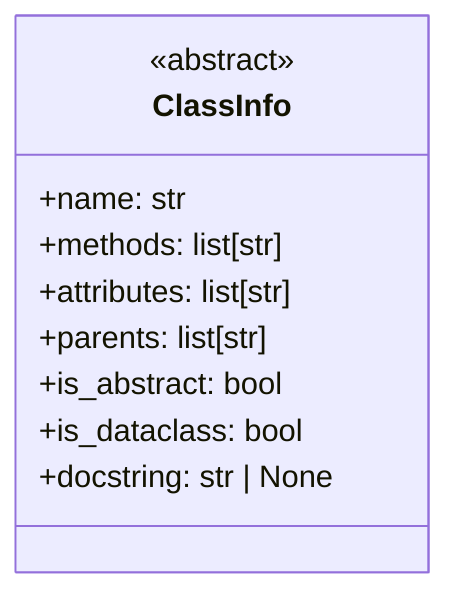
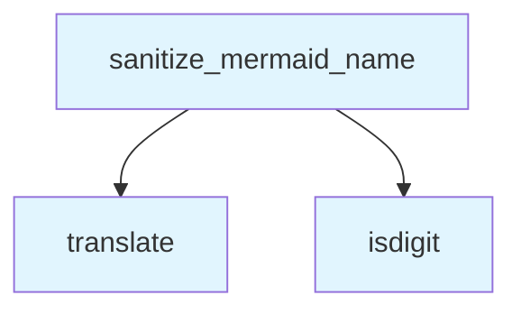

# File: `src/local_deepwiki/generators/diagrams/_utils.py`

## File Overview

This file provides shared utilities for generating diagrams within the `local_deepwiki` project. It contains helper functions and data structures that are used across various diagram generation modules, such as class diagrams, dependency graphs, and others.

The main responsibilities of this file include:
- Defining a data structure (`ClassInfo`) to hold metadata about classes for diagram generation.
- Providing a utility function (`sanitize_mermaid_name`) to ensure that names used in Mermaid diagrams are syntactically valid.
- Offering a helper function (`_unwrap_chunk`) to extract underlying [`CodeChunk`](../../models/chunks.md) objects from wrapped results.

These utilities support the consistent and correct rendering of diagrams by abstracting away low-level concerns like name sanitization and object unwrapping.

## Key Concepts

### `ClassInfo` Data Structure
The `ClassInfo` class is a simple data container that holds information about a class relevant to diagram generation:
- `name`: The class name.
- `methods`: A list of method names.
- `attributes`: A list of attribute names.
- `parents`: A list of parent class names.
- `is_abstract`: Indicates whether the class is abstract.
- `is_dataclass`: Indicates whether the class is a dataclass.
- `docstring`: Optional documentation string.

This structure is used to centralize class metadata, making it easier to pass around and render in various diagram formats.


<details>
<summary>View Source (lines 12-21) | <a href="https://github.com/UrbanDiver/local-deepwiki-mcp/blob/main/src/local_deepwiki/generators/diagrams/_utils.py#L12-L21">GitHub</a></summary>

```python
class ClassInfo:
    """Information about a class for diagram generation."""

    name: str
    methods: list[str]
    attributes: list[str]
    parents: list[str]
    is_abstract: bool = False
    is_dataclass: bool = False
    docstring: str | None = None
```

</details>

### `sanitize_mermaid_name` Function
This function ensures that names used in Mermaid diagrams are valid:
- It uses a translation table (`_MERMAID_SANITIZE_TABLE`) to remove or replace invalid characters.
- If the resulting name starts with a digit, it prepends a letter (`C`) to comply with Mermaid syntax rules.

This function is critical for preventing rendering errors in Mermaid diagrams due to invalid identifiers.


<details>
<summary>View Source (lines 27-40) | <a href="https://github.com/UrbanDiver/local-deepwiki-mcp/blob/main/src/local_deepwiki/generators/diagrams/_utils.py#L27-L40">GitHub</a></summary>

```python
def sanitize_mermaid_name(name: str) -> str:
    """Sanitize a name for use in Mermaid diagrams.

    Args:
        name: Original name.

    Returns:
        Sanitized name safe for Mermaid syntax.
    """
    result = name.translate(_MERMAID_SANITIZE_TABLE)
    # Ensure it starts with a letter
    if result and result[0].isdigit():
        result = "C" + result
    return result
```

</details>

### `_unwrap_chunk` Function
This utility function extracts a [`CodeChunk`](../../models/chunks.md) object from a potentially wrapped result. It checks if the input has a `chunk` attribute (e.g., in a [`SearchResult`](../../handlers/types.md)) and returns it; otherwise, it returns the input directly.

This abstraction allows diagram generation logic to work uniformly with both raw [`CodeChunk`](../../models/chunks.md) objects and wrapped results, increasing flexibility and reducing boilerplate.


<details>
<summary>View Source (lines 43-45) | <a href="https://github.com/UrbanDiver/local-deepwiki-mcp/blob/main/src/local_deepwiki/generators/diagrams/_utils.py#L43-L45">GitHub</a></summary>

```python
def _unwrap_chunk(chunk: CodeChunk | Any) -> CodeChunk:
    """Unwrap SearchResult to get the underlying chunk."""
    return getattr(chunk, "chunk", chunk)
```

</details>

## Integration

This file is part of the diagram generation subsystem and is imported by multiple diagram generator modules. It is used by functions like `dependency_graph`, `dependency_graph_data`, `class_diagram`, and others, as indicated by the callers.

The [`CodeChunk`](../../models/chunks.md) model is imported from `local_deepwiki.models`, indicating that this file is tightly coupled with the core data representation used throughout the project. This integration allows diagram generators to operate on the same structured data that is used elsewhere in the codebase.

The `sanitize_mermaid_name` function is used across multiple diagram types, showing that it's a shared utility to ensure consistent Mermaid output formatting.

## Design Notes

### Why `ClassInfo`?
The `ClassInfo` class was chosen as a simple data container to encapsulate class metadata for diagram rendering. It avoids the complexity of full class models and provides just enough information to support diagram generation logic. It's a lightweight abstraction that makes it easy to pass around class metadata.

### Why `sanitize_mermaid_name`?
Mermaid syntax has strict rules for node names, including that they must start with a letter. This function enforces those rules, preventing diagram generation failures due to invalid identifiers. The use of a translation table ensures efficient character sanitization.

### Why `_unwrap_chunk`?
Wrapping of [`CodeChunk`](../../models/chunks.md) objects is common in search or result handling logic. This utility function abstracts the unwrapping logic, allowing diagram generation code to focus on diagram logic rather than result handling details. It provides a clean interface that works with both wrapped and unwrapped inputs.

### Trade-offs
- The `ClassInfo` class is intentionally minimal, avoiding the inclusion of full method signatures or complex metadata. This keeps the abstraction lightweight and focused.
- The use of a translation table for sanitization is efficient but assumes a fixed set of invalid characters. If Mermaid syntax evolves, this table may need updates.
- The `_unwrap_chunk` function assumes that the `chunk` attribute, if present, is the intended [`CodeChunk`](../../models/chunks.md). It does not perform type checking or validation beyond checking for the attribute's existence.

## API Reference

### class `ClassInfo`

Information about a class for diagram generation.

---


<details>
<summary>View Source (lines 12-21) | <a href="https://github.com/UrbanDiver/local-deepwiki-mcp/blob/main/src/local_deepwiki/generators/diagrams/_utils.py#L12-L21">GitHub</a></summary>

```python
class ClassInfo:
    """Information about a class for diagram generation."""

    name: str
    methods: list[str]
    attributes: list[str]
    parents: list[str]
    is_abstract: bool = False
    is_dataclass: bool = False
    docstring: str | None = None
```

</details>

### Functions

#### `sanitize_mermaid_name`

```python
def sanitize_mermaid_name(name: str) -> str
```

Sanitize a name for use in Mermaid diagrams.


| Parameter | Type | Default | Description |
|-----------|------|---------|-------------|
| `name` | `str` | - | Original name. |

**Returns:** `str`


<details>
<summary>View Source (lines 27-40) | <a href="https://github.com/UrbanDiver/local-deepwiki-mcp/blob/main/src/local_deepwiki/generators/diagrams/_utils.py#L27-L40">GitHub</a></summary>

```python
def sanitize_mermaid_name(name: str) -> str:
    """Sanitize a name for use in Mermaid diagrams.

    Args:
        name: Original name.

    Returns:
        Sanitized name safe for Mermaid syntax.
    """
    result = name.translate(_MERMAID_SANITIZE_TABLE)
    # Ensure it starts with a letter
    if result and result[0].isdigit():
        result = "C" + result
    return result
```

</details>

## Class Diagram



## Call Graph



## Used By

Functions and methods in this file and their callers:

- **`isdigit`**: called by `sanitize_mermaid_name`
- **`translate`**: called by `sanitize_mermaid_name`

## Last Modified

| Entity | Type | Author | Date | Commit |
|--------|------|--------|------|--------|
| `ClassInfo` | class | Brian Breidenbach | Feb 21, 2026 | `fecde6f` refactor: split 10 large fi... |
| `sanitize_mermaid_name` | function | Brian Breidenbach | Feb 21, 2026 | `fecde6f` refactor: split 10 large fi... |
| `_unwrap_chunk` | function | Brian Breidenbach | Feb 21, 2026 | `fecde6f` refactor: split 10 large fi... |

## Relevant Source Files

- `src/local_deepwiki/generators/diagrams/_utils.py:12-21`
