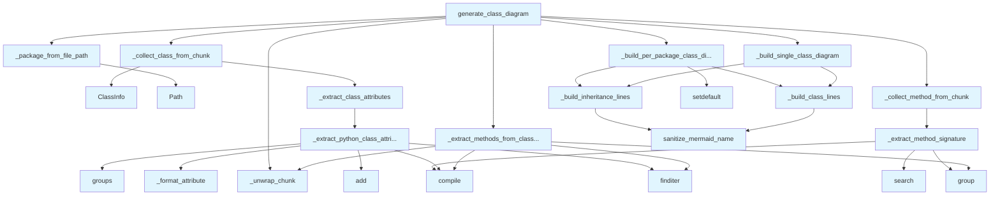

# File Overview

This file implements the logic for generating Mermaid class diagrams from code chunks. It is part of the `local_deepwiki` project's diagram generation capabilities, specifically focused on transforming structured code data into visual class relationship diagrams.

The file's responsibility is to process [`CodeChunk`](../../models/chunks.md) objects, extract class and method information, and format it into Mermaid syntax that can be rendered into diagrams. It supports both single-diagram and per-package diagram generation to manage complexity when dealing with large codebases.

## Design Rationale

The design centers around the idea of building class diagrams from structured code data (chunks), where each chunk represents a class or method. This approach allows for flexible integration with various code analysis tools or data sources that provide chunked code representations. The use of Mermaid syntax ensures compatibility with documentation systems that support Mermaid rendering.

The module separates concerns by:
- Handling class and method extraction (`_collect_class_from_chunk`, `_collect_method_from_chunk`)
- Parsing and formatting code elements (`_extract_python_class_attributes`, `_extract_method_signature`)
- Building diagram output (`_build_class_lines`, `_build_inheritance_lines`, `_build_single_class_diagram`, `_build_per_package_class_diagram`)
- Managing overall diagram generation logic (`generate_class_diagram`)

This separation allows for easy testing of individual components and makes the diagram generation robust to varying input data structures.

# Key Concepts

## Abstraction: ClassInfo

The [`ClassInfo`](_utils.md) class (imported from `_utils`) is a central abstraction used to hold structured information about a class. It encapsulates:
- Class name and metadata (parents, abstract, dataclass)
- Attributes and methods
- Docstring

This abstraction allows for consistent handling of class data across different stages of diagram generation.

## Pattern: Chunk-based Processing

The module uses a chunk-based approach, where code is processed in [`CodeChunk`](../../models/chunks.md) objects. This is a common pattern in `local_deepwiki` for handling code analysis and documentation generation. It allows for:
- Flexible data sources (from LLMs, parsers, or other tools)
- Separation of concerns between code analysis and diagram generation
- Efficient processing by only parsing what is needed

## Algorithm: Method Extraction from Class Content

When class chunks don't contain explicit METHOD chunks, the module uses regex to extract methods directly from class content. This fallback mechanism ensures that even when data sources don't provide explicit method chunks, methods can still be included in the diagrams.

## Mermaid Output Generation

The module generates Mermaid `classDiagram` blocks with:
- Class boxes with attributes and methods
- Inheritance relationships
- Type annotations (when enabled)
- Special indicators for abstract classes and dataclasses

# Integration

This file is a core part of the `local_deepwiki` diagram generation system. It is called by:
- `generate_class_diagram` function, which is used by protocols, files, generator_service, and potentially other services that generate documentation or diagrams
- Test functions like `test_diagrams_class` which call `_extract_class_attributes` and `_extract_method_signature`

It integrates with:
- [`local_deepwiki.models.CodeChunk`](../../models/chunks.md) for representing code units
- `local_deepwiki.generators.diagrams._utils` for shared utilities like [`ClassInfo`](_utils.md) and [`sanitize_mermaid_name`](_utils.md)

The module is used in the broader context of code analysis and documentation generation, where Mermaid diagrams are needed to visualize class structures and relationships. It is part of a suite of diagram generation tools, including dependency graphs and module health analysis.

# Design Notes

## Handling Large Codebases

To prevent diagrams from becoming too complex, the module implements a threshold-based splitting mechanism:
- If the number of classes exceeds `max_classes_per_diagram` (default 30), it generates separate diagrams per package
- This prevents rendering issues in documentation systems that may not handle very large diagrams well

## Type Handling

The module supports optional type annotation display (`show_types` parameter). When enabled, it parses method signatures and class attributes to include type information in the diagram. This requires careful regex parsing to extract meaningful type information without cluttering the diagram.

## Attribute Extraction

Class attributes are extracted using two regex patterns:
1. `^\s{4}(\w+)\s*:\s*([^=\n]+?)(?:\s*=|$)` - for type annotations in class body
2. `self\.(\w+)\s*(?::\s*([^\s=]+))?\s*=` - for assignments in `__init__` methods

This dual approach ensures attributes are captured from both type annotations and assignment statements.

## Sanitization

The [`sanitize_mermaid_name`](_utils.md) utility is used throughout to prevent Mermaid syntax errors when class or method names contain special characters or reserved words. This is critical for robust diagram generation from arbitrary code.

## Fallback Mechanism

When METHOD chunks are not provided for a class, the module falls back to parsing methods directly from the class content using regex. This ensures that class diagrams are still useful even when data sources are incomplete.

## API Reference

### Functions

#### `generate_class_diagram`

```python
def generate_class_diagram(chunks: list, show_attributes: bool = True, show_types: bool = True, max_methods: int = 15, max_classes_per_diagram: int = 30) -> str | None
```

Generate enhanced Mermaid class diagrams from code chunks.  When more than max_classes_per_diagram classes exist, generates separate diagrams per package to keep each diagram renderable.  Features: - Shows class attributes/properties (not just methods) - Shows type annotations for parameters and return types - Distinguishes abstract classes, dataclasses, protocols - Shows inheritance relationships


| Parameter | Type | Default | Description |
|-----------|------|---------|-------------|
| `chunks` | `list` | - | List of CodeChunk or SearchResult objects. |
| `show_attributes` | `bool` | `True` | Whether to show class attributes. |
| `show_types` | `bool` | `True` | Whether to show type annotations. |
| `max_methods` | `int` | `15` | Maximum methods to show per class. |
| `max_classes_per_diagram` | `int` | `30` | Split into per-package diagrams above this threshold. |

**Returns:** `str | None`


<details>
<summary>View Source (lines 219-285) | <a href="https://github.com/UrbanDiver/local-deepwiki-mcp/blob/main/src/local_deepwiki/generators/diagrams/class_diagram.py#L219-L285">GitHub</a></summary>

```python
def generate_class_diagram(
    chunks: list,
    *,
    show_attributes: bool = True,
    show_types: bool = True,
    max_methods: int = 15,
    max_classes_per_diagram: int = 30,
) -> str | None:
    """Generate enhanced Mermaid class diagrams from code chunks.

    When more than max_classes_per_diagram classes exist, generates separate
    diagrams per package to keep each diagram renderable.

    Features:
    - Shows class attributes/properties (not just methods)
    - Shows type annotations for parameters and return types
    - Distinguishes abstract classes, dataclasses, protocols
    - Shows inheritance relationships

    Args:
        chunks: List of CodeChunk or SearchResult objects.
        show_attributes: Whether to show class attributes.
        show_types: Whether to show type annotations.
        max_methods: Maximum methods to show per class.
        max_classes_per_diagram: Split into per-package diagrams above this threshold.

    Returns:
        Mermaid class diagram markdown string, or None if no classes found.
    """
    classes: dict[str, ClassInfo] = {}
    methods_by_class: dict[str, list[tuple[str, str | None]]] = {}
    class_to_package: dict[str, str] = {}

    for chunk in chunks:
        chunk = _unwrap_chunk(chunk)
        if chunk.chunk_type == ChunkType.CLASS:
            class_name = chunk.name or "Unknown"
            if class_name not in classes:
                class_to_package[class_name] = _package_from_file_path(chunk.file_path)
            _collect_class_from_chunk(chunk, classes, methods_by_class, show_attributes)
        elif chunk.chunk_type == ChunkType.METHOD:
            _collect_method_from_chunk(chunk, methods_by_class, show_types)

    _extract_methods_from_class_content(chunks, classes, methods_by_class, show_types)

    for class_name, method_list in methods_by_class.items():
        if class_name in classes:
            classes[class_name].methods = [m[0] for m in method_list[:max_methods]]

    classes_with_content = {
        k: v for k, v in classes.items() if v.methods or v.attributes
    }
    if not classes_with_content:
        return None

    if len(classes_with_content) <= max_classes_per_diagram:
        return _build_single_class_diagram(
            classes_with_content, methods_by_class, max_methods, show_types
        )

    return _build_per_package_class_diagram(
        classes_with_content,
        methods_by_class,
        class_to_package,
        max_methods,
        show_types,
    )
```

</details>

## Call Graph



## Used By

Functions and methods in this file and their callers:

- **[`ClassInfo`](_utils.md)**: called by `_collect_class_from_chunk`
- **`Path`**: called by `_package_from_file_path`
- **`_build_class_lines`**: called by `_build_per_package_class_diagram`, `_build_single_class_diagram`
- **`_build_inheritance_lines`**: called by `_build_per_package_class_diagram`, `_build_single_class_diagram`
- **`_build_per_package_class_diagram`**: called by `generate_class_diagram`
- **`_build_single_class_diagram`**: called by `generate_class_diagram`
- **`_collect_class_from_chunk`**: called by `generate_class_diagram`
- **`_collect_method_from_chunk`**: called by `generate_class_diagram`
- **`_extract_class_attributes`**: called by `_collect_class_from_chunk`
- **`_extract_method_signature`**: called by `_collect_method_from_chunk`
- **`_extract_methods_from_class_content`**: called by `generate_class_diagram`
- **`_extract_python_class_attributes`**: called by `_extract_class_attributes`
- **`_format_attribute`**: called by `_extract_python_class_attributes`
- **`_package_from_file_path`**: called by `generate_class_diagram`
- **`_unwrap_chunk`**: called by `_extract_methods_from_class_content`, `generate_class_diagram`
- **`add`**: called by `_extract_python_class_attributes`
- **`compile`**: called by `_extract_method_signature`, `_extract_methods_from_class_content`, `_extract_python_class_attributes`
- **`finditer`**: called by `_extract_methods_from_class_content`, `_extract_python_class_attributes`
- **`group`**: called by `_extract_method_signature`, `_extract_methods_from_class_content`
- **`groups`**: called by `_extract_python_class_attributes`
- **[`sanitize_mermaid_name`](_utils.md)**: called by `_build_class_lines`, `_build_inheritance_lines`
- **`search`**: called by `_extract_method_signature`
- **`setdefault`**: called by `_build_per_package_class_diagram`

## Last Modified

| Entity | Type | Author | Date | Commit |
|--------|------|--------|------|--------|
| `_extract_methods_from_class_content` | function | Brian Breidenbach | yesterday | `ca3ccca` refactor: flatten deep nest... |
| `_build_single_class_diagram` | function | Brian Breidenbach | 2 days ago | `8b8f36f` refactor: decompose CC > 15... |
| `_build_per_package_class_diagram` | function | Brian Breidenbach | 2 days ago | `8b8f36f` refactor: decompose CC > 15... |
| `generate_class_diagram` | function | Brian Breidenbach | 2 days ago | `8b8f36f` refactor: decompose CC > 15... |
| `_format_attribute` | function | Brian Breidenbach | 2 days ago | `8b8f36f` refactor: decompose CC > 15... |
| `_extract_python_class_attributes` | function | Brian Breidenbach | 2 days ago | `8b8f36f` refactor: decompose CC > 15... |
| `_extract_class_attributes` | function | Brian Breidenbach | 2 days ago | `8b8f36f` refactor: decompose CC > 15... |
| `_collect_class_from_chunk` | function | Brian Breidenbach | Feb 21, 2026 | `fecde6f` refactor: split 10 large fi... |
| `_collect_method_from_chunk` | function | Brian Breidenbach | Feb 21, 2026 | `fecde6f` refactor: split 10 large fi... |
| `_build_class_lines` | function | Brian Breidenbach | Feb 21, 2026 | `fecde6f` refactor: split 10 large fi... |
| `_build_inheritance_lines` | function | Brian Breidenbach | Feb 21, 2026 | `fecde6f` refactor: split 10 large fi... |
| `_package_from_file_path` | function | Brian Breidenbach | Feb 21, 2026 | `fecde6f` refactor: split 10 large fi... |
| `_extract_method_signature` | function | Brian Breidenbach | Feb 21, 2026 | `fecde6f` refactor: split 10 large fi... |

## Additional Source Code

Source code for functions and methods not listed in the API Reference above.

#### `_collect_class_from_chunk`

<details>
<summary>View Source (lines 13-45) | <a href="https://github.com/UrbanDiver/local-deepwiki-mcp/blob/main/src/local_deepwiki/generators/diagrams/class_diagram.py#L13-L45">GitHub</a></summary>

```python
def _collect_class_from_chunk(
    chunk: CodeChunk,
    classes: dict[str, ClassInfo],
    methods_by_class: dict[str, list[tuple[str, str | None]]],
    show_attributes: bool,
) -> None:
    """Extract class info from a CLASS chunk and add to dictionaries."""
    class_name = chunk.name or "Unknown"
    if class_name in classes:
        return

    attributes = _extract_class_attributes(
        chunk.content, chunk.language.value if hasattr(chunk, "language") else "python"
    )

    is_abstract = (
        "ABC" in str(chunk.metadata.get("parent_classes", []))
        or "abstract" in chunk.content.lower()
    )
    is_dataclass = "@dataclass" in chunk.content or "BaseModel" in str(
        chunk.metadata.get("parent_classes", [])
    )

    classes[class_name] = ClassInfo(
        name=class_name,
        methods=[],
        attributes=attributes if show_attributes else [],
        parents=chunk.metadata.get("parent_classes", []),
        is_abstract=is_abstract,
        is_dataclass=is_dataclass,
        docstring=chunk.docstring,
    )
    methods_by_class[class_name] = []
```

</details>


#### `_collect_method_from_chunk`

<details>
<summary>View Source (lines 48-64) | <a href="https://github.com/UrbanDiver/local-deepwiki-mcp/blob/main/src/local_deepwiki/generators/diagrams/class_diagram.py#L48-L64">GitHub</a></summary>

```python
def _collect_method_from_chunk(
    chunk: CodeChunk,
    methods_by_class: dict[str, list[tuple[str, str | None]]],
    show_types: bool,
) -> None:
    """Extract method info from a METHOD chunk and add to dictionary."""
    parent = chunk.parent_name or "Unknown"
    method_name = chunk.name or "unknown"

    signature = _extract_method_signature(chunk.content) if show_types else None

    if parent not in methods_by_class:
        methods_by_class[parent] = []

    existing = [m[0] for m in methods_by_class[parent]]
    if method_name not in existing:
        methods_by_class[parent].append((method_name, signature))
```

</details>


#### `_extract_methods_from_class_content`

<details>
<summary>View Source (lines 67-98) | <a href="https://github.com/UrbanDiver/local-deepwiki-mcp/blob/main/src/local_deepwiki/generators/diagrams/class_diagram.py#L67-L98">GitHub</a></summary>

```python
def _extract_methods_from_class_content(
    chunks: list,
    classes: dict[str, ClassInfo],
    methods_by_class: dict[str, list[tuple[str, str | None]]],
    show_types: bool,
) -> None:
    """Extract methods from class content for classes without METHOD chunks."""
    method_pattern = re.compile(
        r"(?:async\s+)?def\s+(\w+)\s*\([^)]*\)(?:\s*->\s*([^:]+))?:"
    )

    for class_name in classes:
        if methods_by_class.get(class_name):
            continue

        for chunk in chunks:
            chunk = _unwrap_chunk(chunk)
            if chunk.chunk_type != ChunkType.CLASS or chunk.name != class_name:
                continue
            for match in method_pattern.finditer(chunk.content):
                method_name = match.group(1)
                if method_name in [m[0] for m in methods_by_class.get(class_name, [])]:
                    continue
                if class_name not in methods_by_class:
                    methods_by_class[class_name] = []
                return_type = match.group(2)
                sig = (
                    f"() -> {return_type.strip()}"
                    if return_type and show_types
                    else "()"
                )
                methods_by_class[class_name].append((method_name, sig))
```

</details>


#### `_build_class_lines`

<details>
<summary>View Source (lines 101-131) | <a href="https://github.com/UrbanDiver/local-deepwiki-mcp/blob/main/src/local_deepwiki/generators/diagrams/class_diagram.py#L101-L131">GitHub</a></summary>

```python
def _build_class_lines(
    class_name: str,
    class_info: ClassInfo,
    methods_by_class: dict[str, list[tuple[str, str | None]]],
    max_methods: int,
    show_types: bool,
) -> list[str]:
    """Build Mermaid diagram lines for a single class."""
    lines: list[str] = []
    safe_name = sanitize_mermaid_name(class_name)

    lines.append(f"    class {safe_name} {{")
    if class_info.is_dataclass:
        lines.append("        <<dataclass>>")
    elif class_info.is_abstract:
        lines.append("        <<abstract>>")

    for attr in class_info.attributes[:10]:
        lines.append(f"        {attr}")

    method_list = methods_by_class.get(class_name, [])
    for method_name, signature in method_list[:max_methods]:
        prefix = "-" if method_name.startswith("_") else "+"
        safe_method = sanitize_mermaid_name(method_name)
        if signature and show_types:
            lines.append(f"        {prefix}{safe_method}{signature}")
        else:
            lines.append(f"        {prefix}{safe_method}()")

    lines.append("    }")
    return lines
```

</details>


#### `_build_inheritance_lines`

<details>
<summary>View Source (lines 134-142) | <a href="https://github.com/UrbanDiver/local-deepwiki-mcp/blob/main/src/local_deepwiki/generators/diagrams/class_diagram.py#L134-L142">GitHub</a></summary>

```python
def _build_inheritance_lines(classes: dict[str, ClassInfo]) -> list[str]:
    """Build Mermaid inheritance relationship lines."""
    lines: list[str] = []
    for class_name, class_info in sorted(classes.items()):
        safe_child = sanitize_mermaid_name(class_name)
        for parent in class_info.parents:
            safe_parent = sanitize_mermaid_name(parent)
            lines.append(f"    {safe_child} --|> {safe_parent}")
    return lines
```

</details>


#### `_package_from_file_path`

<details>
<summary>View Source (lines 145-168) | <a href="https://github.com/UrbanDiver/local-deepwiki-mcp/blob/main/src/local_deepwiki/generators/diagrams/class_diagram.py#L145-L168">GitHub</a></summary>

```python
def _package_from_file_path(file_path: str) -> str:
    """Extract the package name from a file path.

    For 'src/local_deepwiki/core/indexer.py' returns 'core'.
    For 'src/local_deepwiki/models.py' returns 'top-level'.
    For 'tests/test_parser.py' returns 'tests'.

    Args:
        file_path: Source file path.

    Returns:
        Package name string.
    """
    parts = Path(file_path).parts
    if "src" in parts:
        idx = parts.index("src")
        # Skip src/ and the package dir (e.g. local_deepwiki/)
        remaining = parts[idx + 2 :]
        if len(remaining) > 1:
            return remaining[0]
        return "top-level"
    if "tests" in parts:
        return "tests"
    return "top-level"
```

</details>


#### `_build_single_class_diagram`

<details>
<summary>View Source (lines 171-187) | <a href="https://github.com/UrbanDiver/local-deepwiki-mcp/blob/main/src/local_deepwiki/generators/diagrams/class_diagram.py#L171-L187">GitHub</a></summary>

```python
def _build_single_class_diagram(
    classes: dict[str, ClassInfo],
    methods_by_class: dict[str, list[tuple[str, str | None]]],
    max_methods: int,
    show_types: bool,
) -> str:
    """Build a single Mermaid classDiagram block for all classes."""
    lines = ["```mermaid", "classDiagram"]
    for class_name, class_info in sorted(classes.items()):
        lines.extend(
            _build_class_lines(
                class_name, class_info, methods_by_class, max_methods, show_types
            )
        )
    lines.extend(_build_inheritance_lines(classes))
    lines.append("```")
    return "\n".join(lines)
```

</details>


#### `_build_per_package_class_diagram`

<details>
<summary>View Source (lines 190-216) | <a href="https://github.com/UrbanDiver/local-deepwiki-mcp/blob/main/src/local_deepwiki/generators/diagrams/class_diagram.py#L190-L216">GitHub</a></summary>

```python
def _build_per_package_class_diagram(
    classes: dict[str, ClassInfo],
    methods_by_class: dict[str, list[tuple[str, str | None]]],
    class_to_package: dict[str, str],
    max_methods: int,
    show_types: bool,
) -> str:
    """Build per-package Mermaid classDiagram sections."""
    packages: dict[str, dict[str, ClassInfo]] = {}
    for class_name, class_info in classes.items():
        pkg = class_to_package.get(class_name, "top-level")
        packages.setdefault(pkg, {})[class_name] = class_info

    sections: list[str] = []
    for pkg_name in sorted(packages):
        pkg_classes = packages[pkg_name]
        lines = [f"### {pkg_name}", "", "```mermaid", "classDiagram"]
        for class_name, class_info in sorted(pkg_classes.items()):
            lines.extend(
                _build_class_lines(
                    class_name, class_info, methods_by_class, max_methods, show_types
                )
            )
        lines.extend(_build_inheritance_lines(pkg_classes))
        lines.append("```")
        sections.append("\n".join(lines))
    return "\n\n".join(sections)
```

</details>


#### `_format_attribute`

<details>
<summary>View Source (lines 288-293) | <a href="https://github.com/UrbanDiver/local-deepwiki-mcp/blob/main/src/local_deepwiki/generators/diagrams/class_diagram.py#L288-L293">GitHub</a></summary>

```python
def _format_attribute(name: str, type_hint: str | None) -> str:
    """Format a single attribute as a Mermaid attribute string."""
    prefix = "-" if name.startswith("_") else "+"
    if type_hint:
        return f"{prefix}{name}: {type_hint.strip()}"
    return f"{prefix}{name}"
```

</details>


#### `_extract_python_class_attributes`

<details>
<summary>View Source (lines 296-315) | <a href="https://github.com/UrbanDiver/local-deepwiki-mcp/blob/main/src/local_deepwiki/generators/diagrams/class_diagram.py#L296-L315">GitHub</a></summary>

```python
def _extract_python_class_attributes(content: str) -> list[str]:
    """Extract Python class attributes from class body content."""
    attributes: list[str] = []

    attr_pattern = re.compile(r"^\s{4}(\w+)\s*:\s*([^=\n]+?)(?:\s*=|$)", re.MULTILINE)
    init_pattern = re.compile(r"self\.(\w+)\s*(?::\s*([^\s=]+))?\s*=")

    for match in attr_pattern.finditer(content):
        name, type_hint = match.groups()
        if name not in ("self", "cls") and not name.startswith("__"):
            attributes.append(_format_attribute(name, type_hint))

    existing_names = {a.split(":")[0].strip("+-") for a in attributes}
    for match in init_pattern.finditer(content):
        name, type_hint = match.groups()
        if name not in existing_names and not name.startswith("__"):
            attributes.append(_format_attribute(name, type_hint))
            existing_names.add(name)

    return attributes
```

</details>


#### `_extract_class_attributes`

<details>
<summary>View Source (lines 318-330) | <a href="https://github.com/UrbanDiver/local-deepwiki-mcp/blob/main/src/local_deepwiki/generators/diagrams/class_diagram.py#L318-L330">GitHub</a></summary>

```python
def _extract_class_attributes(content: str, language: str = "python") -> list[str]:
    """Extract class attributes from content.

    Args:
        content: Class source code.
        language: Programming language.

    Returns:
        List of attribute strings like "+name: str" or "-_count: int".
    """
    if language not in ("python", "py"):
        return []
    return _extract_python_class_attributes(content)[:10]
```

</details>


#### `_extract_method_signature`

<details>
<summary>View Source (lines 333-373) | <a href="https://github.com/UrbanDiver/local-deepwiki-mcp/blob/main/src/local_deepwiki/generators/diagrams/class_diagram.py#L333-L373">GitHub</a></summary>

```python
def _extract_method_signature(content: str) -> str | None:
    """Extract method signature with types from content.

    Args:
        content: Method source code.

    Returns:
        Signature string like "(x: int, y: str) -> bool" or None.
    """
    # Match def method(params) -> return_type:
    sig_pattern = re.compile(r"def\s+\w+\s*\(([^)]*)\)(?:\s*->\s*([^:]+))?:")
    match = sig_pattern.search(content)
    if not match:
        return None

    params_str = match.group(1)
    return_type = match.group(2)

    # Simplify params (remove defaults, keep just name: type)
    params = []
    for param in params_str.split(","):
        param = param.strip()
        if not param or param == "self" or param == "cls":
            continue
        # Extract name and type
        if ":" in param:
            name_type = param.split("=")[0].strip()  # Remove default
            params.append(name_type)
        else:
            name = param.split("=")[0].strip()
            if name:
                params.append(name)

    sig = f"({', '.join(params[:4])})"  # Limit to 4 params for readability
    if len(params) > 4:
        sig = f"({', '.join(params[:3])}, ...)"

    if return_type:
        sig += f" {return_type.strip()}"

    return sig
```

</details>

## Relevant Source Files

- `src/local_deepwiki/generators/diagrams/class_diagram.py:13-45`
