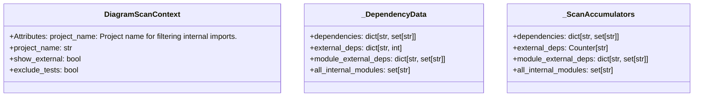
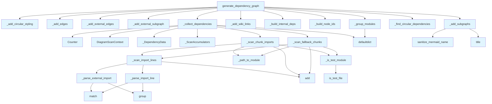

# File: `src/local_deepwiki/generators/diagrams/dependency_diagram.py`

## File Overview

This file is responsible for generating Mermaid flowchart diagrams that visualize module dependencies within a Python project. It processes code chunks containing import statements, extracts internal and external dependencies, and constructs a structured diagram that groups modules by directory and highlights circular dependencies.

The core functionality is encapsulated in the `generate_dependency_graph` function, which serves as the main entry point for generating dependency diagrams. It supports features like:

- Subgraph grouping of modules by top-level directory
- Clickable nodes linking to wiki pages
- Optional display of external dependencies
- Detection and highlighting of circular dependencies

## Key Concepts

### Dependency Collection Strategy

The file uses a two-pass approach to [collect](../../web/routes_chat.md) dependencies:

1. **First Pass**: Scans dedicated `IMPORT` chunks to extract dependencies.
2. **Fallback Pass**: If a file has no dedicated `IMPORT` chunks, scans `MODULE`, `FUNCTION`, or `CLASS` chunks to extract import statements.

This design ensures that even projects without explicit import chunks can generate meaningful dependency diagrams.

### Module Path Resolution

The `_path_to_module` function is responsible for converting file paths into module names. It intelligently strips the `src/` prefix and handles nested package structures, ensuring that module names are correctly derived for dependency tracking and diagram generation.

### Circular Dependency Detection

The file delegates circular dependency detection to [`find_circular_dependency_edges`](../analysis/dependency_graph_data.md) from `dependency_graph_data`. This abstraction allows for consistent circular dependency handling across the codebase and avoids reinventing the wheel.

### Mermaid Diagram Construction

The diagram generation process is modularized into several helper functions:

- `_add_subgraphs` groups modules by top-level directory
- `_add_edges` and `_add_external_edges` define dependency relationships
- `_add_circular_styling` applies visual styling to circular dependencies
- `_add_wiki_links` adds clickable links to wiki pages if configured

This modular approach ensures that the Mermaid output is cleanly structured and extensible.

## Integration

This file is part of the diagram generation system and integrates with:

- **Core Path Utilities**: Uses [`is_test_file`](../analysis/source_filter.md) to filter out test modules.
- **Analysis Tools**: Relies on [`find_circular_dependency_edges`](../analysis/dependency_graph_data.md) and [`infer_package_name`](../analysis/dependency_graph_data.md) from `dependency_graph_data` for core dependency logic.
- **Logging**: Uses [`get_logger`](../../logging.md) for debugging and tracing.
- **Models**: Uses [`ChunkType`](../../models/foundation.md) to identify different types of code chunks.

It is called by the `dependency_graph` generator and used by various test functions such as:

- `test_codemap_diagram_params`
- `test_diagrams_dependency`
- `test_diagrams_misc`

These tests validate the parsing, grouping, and diagram generation logic.

## Design Notes

### Test Module Filtering

Test modules are filtered out by default (`exclude_tests=True`) to avoid cluttering the dependency diagram with test-specific imports. This behavior can be overridden via the `exclude_tests` keyword argument in `generate_dependency_graph`.

### External Dependency Handling

External dependencies are collected only when `show_external=True`. The number of external dependencies shown is limited by `max_external`, defaulting to 10, to prevent diagram bloat.

### Wiki Linking

The `wiki_base_path` parameter enables clickable nodes in the diagram that link to corresponding wiki pages. This feature is useful for documentation systems where code modules are documented in a wiki.

### Path Normalization

The `_path_to_module` function handles edge cases such as:

- Files with `__` prefix (e.g., `__init__.py`)
- Files without `.py` extension
- Complex directory structures

It ensures that module names are normalized for consistent dependency tracking.

### Mermaid Styling

The diagram uses Mermaid-specific styling for:

- External dependencies (dashed stroke)
- Circular dependencies (red stroke with increased width)

This visual distinction helps quickly identify problematic dependencies in the diagram.

## API Reference

### class `DiagramScanContext`

Immutable configuration for dependency-scanning functions.  Bundles the common immutable parameters shared by ``_scan_import_lines``, ``_scan_chunk_imports``, and ``_scan_fallback_chunks``.  Attributes: project_name: Project name for filtering internal imports. show_external: Whether to [collect](../../web/routes_chat.md) external dependencies. exclude_tests: Whether to exclude test module imports.

---


<details>
<summary>View Source (lines 39-53) | <a href="https://github.com/UrbanDiver/local-deepwiki-mcp/blob/main/src/local_deepwiki/generators/diagrams/dependency_diagram.py#L39-L53">GitHub</a></summary>

```python
class DiagramScanContext:
    """Immutable configuration for dependency-scanning functions.

    Bundles the common immutable parameters shared by ``_scan_import_lines``,
    ``_scan_chunk_imports``, and ``_scan_fallback_chunks``.

    Attributes:
        project_name: Project name for filtering internal imports.
        show_external: Whether to collect external dependencies.
        exclude_tests: Whether to exclude test module imports.
    """

    project_name: str
    show_external: bool = False
    exclude_tests: bool = True
```

</details>

### Functions

#### `generate_dependency_graph`

```python
def generate_dependency_graph(chunks: list, project_name: str = "project") -> str | None
```

Generate an enhanced Mermaid flowchart showing module dependencies.  Features: - Subgraphs grouping modules by top-level directory - Clickable nodes linking to wiki pages (when wiki_base_path provided) - Optional external dependency display with different styling - Circular dependency detection and highlighting


| Parameter | Type | Default | Description |
|-----------|------|---------|-------------|
| `chunks` | `list` | - | List of CodeChunk objects (should include IMPORT chunks). |
| `project_name` | `str` | `"project"` | Name of the project for filtering internal imports. Keyword Args: |

**Returns:** `str | None`


<details>
<summary>View Source (lines 400-473) | <a href="https://github.com/UrbanDiver/local-deepwiki-mcp/blob/main/src/local_deepwiki/generators/diagrams/dependency_diagram.py#L400-L473">GitHub</a></summary>

```python
def generate_dependency_graph(
    chunks: list,
    project_name: str = "project",
    **kwargs: object,
) -> str | None:
    """Generate an enhanced Mermaid flowchart showing module dependencies.

    Features:
    - Subgraphs grouping modules by top-level directory
    - Clickable nodes linking to wiki pages (when wiki_base_path provided)
    - Optional external dependency display with different styling
    - Circular dependency detection and highlighting

    Args:
        chunks: List of CodeChunk objects (should include IMPORT chunks).
        project_name: Name of the project for filtering internal imports.

    Keyword Args:
        detect_circular: Whether to highlight circular dependencies (default True).
        show_external: Whether to show external dependencies (default False).
        max_external: Maximum number of external dependencies (default 10).
        wiki_base_path: Base path for wiki links (default "").
        exclude_tests: Whether to exclude test modules (default True).

    Returns:
        Mermaid flowchart markdown string, or None if no dependencies found.
    """
    detect_circular: bool = bool(kwargs.get("detect_circular", True))
    show_external: bool = bool(kwargs.get("show_external", False))
    max_external: int = int(kwargs.get("max_external", 10))  # type: ignore[arg-type]
    wiki_base_path: str = str(kwargs.get("wiki_base_path", ""))
    exclude_tests: bool = bool(kwargs.get("exclude_tests", True))

    # Collect all dependency data
    data = _collect_dependencies(
        chunks, project_name, show_external=show_external, exclude_tests=exclude_tests
    )

    if not data.dependencies:
        return None

    # Build internal dependency graph
    internal_deps = _build_internal_deps(data.dependencies, data.all_internal_modules)
    module_groups = _group_modules(data.all_internal_modules)
    node_ids = _build_node_ids(data.all_internal_modules)

    # Detect circular dependencies
    circular_edges: set[tuple[str, str]] = set()
    if detect_circular and internal_deps:
        circular_edges = _find_circular_dependencies(internal_deps)

    # Build Mermaid flowchart
    lines = ["```mermaid", "flowchart TD"]

    # Add module subgraphs
    _add_subgraphs(lines, module_groups, node_ids)

    # Add external dependencies if enabled
    ext_node_ids: dict[str, str] = {}
    if show_external:
        ext_node_ids = _add_external_subgraph(lines, data.external_deps, max_external)

    # Add internal dependency edges
    _add_edges(lines, internal_deps, node_ids, circular_edges)

    _add_external_edges(lines, data, ext_node_ids, node_ids, show_external)
    _add_wiki_links(lines, node_ids, project_name, wiki_base_path)

    lines.append("    classDef external fill:#2d2d3d,stroke:#666,stroke-dasharray: 5 5")
    _add_circular_styling(lines, internal_deps, node_ids, circular_edges)

    lines.append("```")

    return "\n".join(lines)
```

</details>

## Class Diagram



## Call Graph



## Used By

Functions and methods in this file and their callers:

- **`Counter`**: called by `_collect_dependencies`
- **`DiagramScanContext`**: called by `_collect_dependencies`
- **`Path`**: called by `_path_to_module`
- **`_DependencyData`**: called by `_collect_dependencies`
- **`_ScanAccumulators`**: called by `_collect_dependencies`
- **`_add_circular_styling`**: called by `generate_dependency_graph`
- **`_add_edges`**: called by `generate_dependency_graph`
- **`_add_external_edges`**: called by `generate_dependency_graph`
- **`_add_external_subgraph`**: called by `generate_dependency_graph`
- **`_add_subgraphs`**: called by `generate_dependency_graph`
- **`_add_wiki_links`**: called by `generate_dependency_graph`
- **`_build_internal_deps`**: called by `generate_dependency_graph`
- **`_build_node_ids`**: called by `generate_dependency_graph`
- **`_collect_dependencies`**: called by `generate_dependency_graph`
- **`_find_circular_dependencies`**: called by `generate_dependency_graph`
- **`_group_modules`**: called by `generate_dependency_graph`
- **`_is_test_module`**: called by `_scan_chunk_imports`, `_scan_fallback_chunks`
- **`_module_to_wiki_path`**: called by `_add_wiki_links`
- **`_parse_external_import`**: called by `_scan_import_lines`
- **`_parse_import_line`**: called by `_scan_import_lines`
- **`_path_to_module`**: called by `_scan_chunk_imports`, `_scan_fallback_chunks`
- **`_scan_chunk_imports`**: called by `_collect_dependencies`
- **`_scan_fallback_chunks`**: called by `_collect_dependencies`
- **`_scan_import_lines`**: called by `_scan_chunk_imports`, `_scan_fallback_chunks`
- **`add`**: called by `_scan_chunk_imports`, `_scan_fallback_chunks`, `_scan_import_lines`
- **`defaultdict`**: called by `_collect_dependencies`, `_group_modules`
- **[`find_circular_dependency_edges`](../analysis/dependency_graph_data.md)**: called by `_find_circular_dependencies`
- **`group`**: called by `_parse_external_import`, `_parse_import_line`
- **[`is_test_file`](../analysis/source_filter.md)**: called by `_is_test_module`
- **`match`**: called by `_parse_external_import`, `_parse_import_line`
- **[`sanitize_mermaid_name`](_utils.md)**: called by `_add_subgraphs`
- **`title`**: called by `_add_subgraphs`

## Usage Examples

*Examples extracted from test files*

### Path with src/ prefix strips src and package directory

From `test_dependency_diagram.py::TestPathToModule::test_standard_src_layout`:

```python
result = _path_to_module("src/local_deepwiki/core/indexer.py")
assert result == "core.indexer"
```

### Path without src/ and enough nesting still skips top-level package

From `test_dependency_diagram.py::TestPathToModule::test_no_src_prefix_nested`:

```python
result = _path_to_module("mypackage/core/indexer.py")
assert result == "core.indexer"
```

### Deeply nested path should return full dotted module from subpackage

From `test_dependency_diagram.py::TestPathToModule::test_deeply_nested`:

```python
result = _path_to_module(
    "src/mypackage/generators/diagrams/dependency_diagram.py"
)
assert result == "generators.diagrams.dependency_diagram"
```


## Last Modified

| Entity | Type | Author | Date | Commit |
|--------|------|--------|------|--------|
| `DiagramScanContext` | class | Brian Breidenbach | yesterday | `1eef062` refactor: complete Grade A ... |
| `_ScanAccumulators` | class | Brian Breidenbach | yesterday | `1eef062` refactor: complete Grade A ... |
| `_scan_import_lines` | function | Brian Breidenbach | yesterday | `1eef062` refactor: complete Grade A ... |
| `_scan_chunk_imports` | function | Brian Breidenbach | yesterday | `1eef062` refactor: complete Grade A ... |
| `_scan_fallback_chunks` | function | Brian Breidenbach | yesterday | `1eef062` refactor: complete Grade A ... |
| `_collect_dependencies` | function | Brian Breidenbach | yesterday | `1eef062` refactor: complete Grade A ... |
| `generate_dependency_graph` | function | Brian Breidenbach | yesterday | `1eef062` refactor: complete Grade A ... |
| `_add_external_edges` | function | Brian Breidenbach | yesterday | `29ae780` refactor: decompose long me... |
| `_add_wiki_links` | function | Brian Breidenbach | yesterday | `29ae780` refactor: decompose long me... |
| `_is_test_module` | function | Brian Breidenbach | 1 week ago | `fd8bb32` fix: code quality — consoli... |
| `_find_circular_dependencies` | function | Brian Breidenbach | 1 week ago | `fd8bb32` fix: code quality — consoli... |
| `_path_to_module` | function | Brian Breidenbach | 2 weeks ago | `881a7a4` fix: dependency diagram fal... |
| `_DependencyData` | class | Brian Breidenbach | Feb 21, 2026 | `fecde6f` refactor: split 10 large fi... |
| `_build_internal_deps` | function | Brian Breidenbach | Feb 21, 2026 | `fecde6f` refactor: split 10 large fi... |
| `_group_modules` | function | Brian Breidenbach | Feb 21, 2026 | `fecde6f` refactor: split 10 large fi... |
| `_build_node_ids` | function | Brian Breidenbach | Feb 21, 2026 | `fecde6f` refactor: split 10 large fi... |
| `_add_subgraphs` | function | Brian Breidenbach | Feb 21, 2026 | `fecde6f` refactor: split 10 large fi... |
| `_add_external_subgraph` | function | Brian Breidenbach | Feb 21, 2026 | `fecde6f` refactor: split 10 large fi... |
| `_add_edges` | function | Brian Breidenbach | Feb 21, 2026 | `fecde6f` refactor: split 10 large fi... |
| `_add_circular_styling` | function | Brian Breidenbach | Feb 21, 2026 | `fecde6f` refactor: split 10 large fi... |
| `_parse_external_import` | function | Brian Breidenbach | Feb 21, 2026 | `fecde6f` refactor: split 10 large fi... |
| `_module_to_wiki_path` | function | Brian Breidenbach | Feb 21, 2026 | `fecde6f` refactor: split 10 large fi... |
| `_parse_import_line` | function | Brian Breidenbach | Feb 21, 2026 | `fecde6f` refactor: split 10 large fi... |

## Additional Source Code

Source code for functions and methods not listed in the API Reference above.

#### `_is_test_module`

<details>
<summary>View Source (lines 23-35) | <a href="https://github.com/UrbanDiver/local-deepwiki-mcp/blob/main/src/local_deepwiki/generators/diagrams/dependency_diagram.py#L23-L35">GitHub</a></summary>

```python
def _is_test_module(module: str, file_path: str) -> bool:
    """Check if a module is a test module.

    Delegates to the canonical ``is_test_file`` helper in ``path_utils``.

    Args:
        module: Module name like 'test_parser' or 'core.indexer'.
        file_path: File path like 'tests/test_parser.py'.

    Returns:
        True if this is a test module.
    """
    return is_test_file(file_path) or module.startswith("test_") or ".test_" in module
```

</details>


### `_ScanAccumulators`

<details>
<summary>View Source (lines 57-67) | <a href="https://github.com/UrbanDiver/local-deepwiki-mcp/blob/main/src/local_deepwiki/generators/diagrams/dependency_diagram.py#L57-L67">GitHub</a></summary>

```python
class _ScanAccumulators:
    """Mutable accumulators shared by the dependency-scanning functions.

    Holds the four mutable collections that ``_scan_import_lines``,
    ``_scan_chunk_imports``, and ``_scan_fallback_chunks`` write into.
    """

    dependencies: dict[str, set[str]]
    external_deps: Counter[str]
    module_external_deps: dict[str, set[str]]
    all_internal_modules: set[str]
```

</details>


### `_DependencyData`

<details>
<summary>View Source (lines 71-77) | <a href="https://github.com/UrbanDiver/local-deepwiki-mcp/blob/main/src/local_deepwiki/generators/diagrams/dependency_diagram.py#L71-L77">GitHub</a></summary>

```python
class _DependencyData:
    """Internal data structure for dependency graph generation."""

    dependencies: dict[str, set[str]]
    external_deps: dict[str, int]
    module_external_deps: dict[str, set[str]]
    all_internal_modules: set[str]
```

</details>


#### `_scan_import_lines`

<details>
<summary>View Source (lines 80-115) | <a href="https://github.com/UrbanDiver/local-deepwiki-mcp/blob/main/src/local_deepwiki/generators/diagrams/dependency_diagram.py#L80-L115">GitHub</a></summary>

```python
def _scan_import_lines(
    content: str,
    module: str,
    scan_ctx: DiagramScanContext,
    acc: _ScanAccumulators,
) -> None:
    """Scan content lines for import statements and update dependency data.

    Only lines starting with ``import `` or ``from `` are considered,
    so non-import content (function bodies, comments, etc.) is safely skipped.

    Args:
        content: Raw chunk content to scan.
        module: Module name derived from the chunk's file path.
        scan_ctx: Immutable scan configuration (project_name, show_external, exclude_tests).
        acc: Mutable accumulators to update.
    """
    for line in content.split("\n"):
        line = line.strip()
        if not line:
            continue
        # Only consider lines that look like import statements
        if not (line.startswith("import ") or line.startswith("from ")):
            continue

        imported = _parse_import_line(line, scan_ctx.project_name)
        if imported:
            if scan_ctx.exclude_tests and imported.startswith("test_"):
                continue
            acc.dependencies[module].add(imported)
            acc.all_internal_modules.add(imported)
        elif scan_ctx.show_external:
            ext_module = _parse_external_import(line)
            if ext_module:
                acc.external_deps[ext_module] += 1
                acc.module_external_deps[module].add(ext_module)
```

</details>


#### `_scan_chunk_imports`

<details>
<summary>View Source (lines 123-146) | <a href="https://github.com/UrbanDiver/local-deepwiki-mcp/blob/main/src/local_deepwiki/generators/diagrams/dependency_diagram.py#L123-L146">GitHub</a></summary>

```python
def _scan_chunk_imports(
    chunk: object,
    scan_ctx: DiagramScanContext,
    acc: _ScanAccumulators,
    *,
    files_with_import_chunks: set[str],
    fallback_chunks: list,
) -> None:
    """Process one chunk in the first dependency-collection pass."""
    if hasattr(chunk, "chunk"):
        chunk = chunk.chunk  # type: ignore[union-attr]

    if chunk.chunk_type == ChunkType.IMPORT:
        file_path = chunk.file_path
        module = _path_to_module(file_path)
        if not module:
            return
        if scan_ctx.exclude_tests and _is_test_module(module, file_path):
            return
        files_with_import_chunks.add(file_path)
        acc.all_internal_modules.add(module)
        _scan_import_lines(chunk.content, module, scan_ctx, acc)
    elif chunk.chunk_type in _FALLBACK_CHUNK_TYPES:
        fallback_chunks.append(chunk)
```

</details>


#### `_scan_fallback_chunks`

<details>
<summary>View Source (lines 149-172) | <a href="https://github.com/UrbanDiver/local-deepwiki-mcp/blob/main/src/local_deepwiki/generators/diagrams/dependency_diagram.py#L149-L172">GitHub</a></summary>

```python
def _scan_fallback_chunks(
    fallback_chunks: list,
    scan_ctx: DiagramScanContext,
    acc: _ScanAccumulators,
    *,
    files_with_import_chunks: set[str],
) -> None:
    """Process fallback (non-IMPORT) chunks for files that have no dedicated IMPORT chunks."""
    for chunk in fallback_chunks:
        if hasattr(chunk, "chunk"):
            chunk = chunk.chunk  # type: ignore[union-attr]

        file_path = chunk.file_path
        if file_path in files_with_import_chunks:
            continue

        module = _path_to_module(file_path)
        if not module:
            continue
        if scan_ctx.exclude_tests and _is_test_module(module, file_path):
            continue

        acc.all_internal_modules.add(module)
        _scan_import_lines(chunk.content, module, scan_ctx, acc)
```

</details>


#### `_collect_dependencies`

<details>
<summary>View Source (lines 175-233) | <a href="https://github.com/UrbanDiver/local-deepwiki-mcp/blob/main/src/local_deepwiki/generators/diagrams/dependency_diagram.py#L175-L233">GitHub</a></summary>

```python
def _collect_dependencies(
    chunks: list,
    project_name: str,
    *,
    show_external: bool,
    exclude_tests: bool,
) -> _DependencyData:
    """Collect module dependencies from import chunks.

    First pass processes dedicated IMPORT chunks. If a file has no IMPORT
    chunks, a second pass scans MODULE/FUNCTION/CLASS chunks as a fallback
    so that repos without dedicated import chunks still produce dependency
    diagrams.

    Args:
        chunks: List of CodeChunk objects.
        project_name: Name of the project for filtering internal imports.
        show_external: Whether to collect external dependencies.
        exclude_tests: Whether to exclude test modules.

    Returns:
        DependencyData with collected dependencies.
    """
    scan_ctx = DiagramScanContext(
        project_name=project_name,
        show_external=show_external,
        exclude_tests=exclude_tests,
    )
    acc = _ScanAccumulators(
        dependencies=defaultdict(set),
        external_deps=Counter(),
        module_external_deps=defaultdict(set),
        all_internal_modules=set(),
    )
    files_with_import_chunks: set[str] = set()
    fallback_chunks: list = []

    for chunk in chunks:
        _scan_chunk_imports(
            chunk,
            scan_ctx,
            acc,
            files_with_import_chunks=files_with_import_chunks,
            fallback_chunks=fallback_chunks,
        )

    _scan_fallback_chunks(
        fallback_chunks,
        scan_ctx,
        acc,
        files_with_import_chunks=files_with_import_chunks,
    )

    return _DependencyData(
        dependencies=acc.dependencies,
        external_deps=acc.external_deps,
        module_external_deps=acc.module_external_deps,
        all_internal_modules=acc.all_internal_modules,
    )
```

</details>


#### `_build_internal_deps`

<details>
<summary>View Source (lines 236-254) | <a href="https://github.com/UrbanDiver/local-deepwiki-mcp/blob/main/src/local_deepwiki/generators/diagrams/dependency_diagram.py#L236-L254">GitHub</a></summary>

```python
def _build_internal_deps(
    dependencies: dict[str, set[str]],
    internal_modules: set[str],
) -> dict[str, set[str]]:
    """Filter dependencies to only include internal modules.

    Args:
        dependencies: Raw dependency mapping.
        internal_modules: Set of known internal modules.

    Returns:
        Filtered dependency mapping.
    """
    internal_deps: dict[str, set[str]] = {}
    for module, imports in dependencies.items():
        internal_imports = {imp for imp in imports if imp in internal_modules}
        if internal_imports:
            internal_deps[module] = internal_imports
    return internal_deps
```

</details>


#### `_group_modules`

<details>
<summary>View Source (lines 257-271) | <a href="https://github.com/UrbanDiver/local-deepwiki-mcp/blob/main/src/local_deepwiki/generators/diagrams/dependency_diagram.py#L257-L271">GitHub</a></summary>

```python
def _group_modules(modules: set[str]) -> dict[str, list[str]]:
    """Group modules by top-level directory for subgraphs.

    Args:
        modules: Set of module names.

    Returns:
        Mapping of group name to list of modules.
    """
    groups: dict[str, list[str]] = defaultdict(list)
    for module in sorted(modules):
        parts = module.split(".")
        group = parts[0] if parts else "other"
        groups[group].append(module)
    return groups
```

</details>


#### `_build_node_ids`

<details>
<summary>View Source (lines 274-283) | <a href="https://github.com/UrbanDiver/local-deepwiki-mcp/blob/main/src/local_deepwiki/generators/diagrams/dependency_diagram.py#L274-L283">GitHub</a></summary>

```python
def _build_node_ids(modules: set[str]) -> dict[str, str]:
    """Create unique node IDs for each module.

    Args:
        modules: Set of module names.

    Returns:
        Mapping of module name to node ID.
    """
    return {module: f"M{i}" for i, module in enumerate(sorted(modules))}
```

</details>


#### `_add_subgraphs`

<details>
<summary>View Source (lines 286-307) | <a href="https://github.com/UrbanDiver/local-deepwiki-mcp/blob/main/src/local_deepwiki/generators/diagrams/dependency_diagram.py#L286-L307">GitHub</a></summary>

```python
def _add_subgraphs(
    lines: list[str],
    module_groups: dict[str, list[str]],
    node_ids: dict[str, str],
) -> None:
    """Add subgraph definitions for module groups.

    Args:
        lines: Lines list to append to.
        module_groups: Mapping of group to modules.
        node_ids: Mapping of module to node ID.
    """
    for group_name in sorted(module_groups.keys()):
        modules = module_groups[group_name]
        safe_group = sanitize_mermaid_name(group_name)
        display_group = group_name.replace("_", " ").title()
        lines.append(f"    subgraph {safe_group}[{display_group}]")
        for module in sorted(modules):
            node_id = node_ids[module]
            display_name = module.split(".")[-1]
            lines.append(f"        {node_id}[{display_name}]")
        lines.append("    end")
```

</details>


#### `_add_external_subgraph`

<details>
<summary>View Source (lines 310-337) | <a href="https://github.com/UrbanDiver/local-deepwiki-mcp/blob/main/src/local_deepwiki/generators/diagrams/dependency_diagram.py#L310-L337">GitHub</a></summary>

```python
def _add_external_subgraph(
    lines: list[str],
    external_deps: dict[str, int],
    max_external: int,
) -> dict[str, str]:
    """Add external dependencies subgraph.

    Args:
        lines: Lines list to append to.
        external_deps: External dependency counts.
        max_external: Maximum externals to show.

    Returns:
        Mapping of external module to node ID.
    """
    ext_node_ids: dict[str, str] = {}
    if not external_deps:
        return ext_node_ids

    top_external = sorted(external_deps.items(), key=lambda x: -x[1])[:max_external]
    if top_external:
        lines.append("    subgraph external[External Dependencies]")
        for i, (ext, _count) in enumerate(top_external):
            ext_id = f"E{i}"
            ext_node_ids[ext] = ext_id
            lines.append(f"        {ext_id}([{ext}]):::external")
        lines.append("    end")
    return ext_node_ids
```

</details>


#### `_add_edges`

<details>
<summary>View Source (lines 340-364) | <a href="https://github.com/UrbanDiver/local-deepwiki-mcp/blob/main/src/local_deepwiki/generators/diagrams/dependency_diagram.py#L340-L364">GitHub</a></summary>

```python
def _add_edges(
    lines: list[str],
    internal_deps: dict[str, set[str]],
    node_ids: dict[str, str],
    circular_edges: set[tuple[str, str]],
) -> None:
    """Add internal dependency edges to the diagram.

    Args:
        lines: Lines list to append to.
        internal_deps: Internal dependency mapping.
        node_ids: Module to node ID mapping.
        circular_edges: Set of circular dependency edges.
    """
    for module, imports in sorted(internal_deps.items()):
        from_id = node_ids.get(module)
        if not from_id:
            continue
        for imp in sorted(imports):
            to_id = node_ids.get(imp)
            if to_id and from_id != to_id:
                if (module, imp) in circular_edges or (imp, module) in circular_edges:
                    lines.append(f"    {from_id} -.->|circular| {to_id}")
                else:
                    lines.append(f"    {from_id} --> {to_id}")
```

</details>


#### `_add_circular_styling`

<details>
<summary>View Source (lines 367-397) | <a href="https://github.com/UrbanDiver/local-deepwiki-mcp/blob/main/src/local_deepwiki/generators/diagrams/dependency_diagram.py#L367-L397">GitHub</a></summary>

```python
def _add_circular_styling(
    lines: list[str],
    internal_deps: dict[str, set[str]],
    node_ids: dict[str, str],
    circular_edges: set[tuple[str, str]],
) -> None:
    """Add styling for circular dependencies.

    Args:
        lines: Lines list to append to.
        internal_deps: Internal dependency mapping.
        node_ids: Module to node ID mapping.
        circular_edges: Set of circular dependency edges.
    """
    if not circular_edges:
        return

    lines.append("    linkStyle default stroke:#666")
    link_idx = 0
    for module, imports in sorted(internal_deps.items()):
        from_id = node_ids.get(module)
        if not from_id:
            continue
        for imp in sorted(imports):
            to_id = node_ids.get(imp)
            if to_id and from_id != to_id:
                if (module, imp) in circular_edges or (imp, module) in circular_edges:
                    lines.append(
                        f"    linkStyle {link_idx} stroke:#f00,stroke-width:2px"
                    )
                link_idx += 1
```

</details>


#### `_add_external_edges`

<details>
<summary>View Source (lines 476-493) | <a href="https://github.com/UrbanDiver/local-deepwiki-mcp/blob/main/src/local_deepwiki/generators/diagrams/dependency_diagram.py#L476-L493">GitHub</a></summary>

```python
def _add_external_edges(
    lines: list[str],
    data: Any,
    ext_node_ids: dict[str, str],
    node_ids: dict[str, str],
    show_external: bool,
) -> None:
    """Append external dependency edges to the Mermaid flowchart lines."""
    if not (show_external and ext_node_ids):
        return
    for module, ext_imports in sorted(data.module_external_deps.items()):
        from_id = node_ids.get(module)
        if not from_id:
            continue
        for ext in sorted(ext_imports):
            target_ext_id = ext_node_ids.get(ext)
            if target_ext_id:
                lines.append(f"    {from_id} -.-> {target_ext_id}")
```

</details>


#### `_add_wiki_links`

<details>
<summary>View Source (lines 496-507) | <a href="https://github.com/UrbanDiver/local-deepwiki-mcp/blob/main/src/local_deepwiki/generators/diagrams/dependency_diagram.py#L496-L507">GitHub</a></summary>

```python
def _add_wiki_links(
    lines: list[str],
    node_ids: dict[str, str],
    project_name: str,
    wiki_base_path: str,
) -> None:
    """Append Mermaid click handlers linking nodes to wiki pages."""
    if not wiki_base_path:
        return
    for module, node_id in sorted(node_ids.items()):
        wiki_path = _module_to_wiki_path(module, project_name)
        lines.append(f'    click {node_id} "{wiki_base_path}{wiki_path}"')
```

</details>


#### `_parse_external_import`

<details>
<summary>View Source (lines 510-538) | <a href="https://github.com/UrbanDiver/local-deepwiki-mcp/blob/main/src/local_deepwiki/generators/diagrams/dependency_diagram.py#L510-L538">GitHub</a></summary>

```python
def _parse_external_import(line: str) -> str | None:
    """Parse an import line to extract external module name.

    Args:
        line: Import line like 'from pathlib import Path' or 'import os'

    Returns:
        Top-level module name if external import, None otherwise.
    """
    # from X import Y - extract X's top-level module
    from_match = re.match(r"from\s+([\w.]+)\s+import", line)
    if from_match:
        module = from_match.group(1)
        # Get top-level package name
        top_level = module.split(".")[0]
        # Skip relative imports and stdlib typing
        if top_level and not top_level.startswith("_"):
            return top_level
        return None

    # import X - extract X's top-level module
    import_match = re.match(r"import\s+([\w.]+)", line)
    if import_match:
        module = import_match.group(1)
        top_level = module.split(".")[0]
        if top_level and not top_level.startswith("_"):
            return top_level

    return None
```

</details>


#### `_module_to_wiki_path`

<details>
<summary>View Source (lines 541-551) | <a href="https://github.com/UrbanDiver/local-deepwiki-mcp/blob/main/src/local_deepwiki/generators/diagrams/dependency_diagram.py#L541-L551">GitHub</a></summary>

```python
def _module_to_wiki_path(module: str, project_name: str) -> str:
    """Convert module name to wiki file path.

    Args:
        module: Module name like 'core.parser'
        project_name: Project name like 'local_deepwiki'

    Returns:
        Wiki path like 'src/local_deepwiki/core/parser.md'
    """
    return f"src/{project_name}/{module.replace('.', '/')}.md"
```

</details>


#### `_find_circular_dependencies`

<details>
<summary>View Source (lines 554-565) | <a href="https://github.com/UrbanDiver/local-deepwiki-mcp/blob/main/src/local_deepwiki/generators/diagrams/dependency_diagram.py#L554-L565">GitHub</a></summary>

```python
def _find_circular_dependencies(deps: dict[str, set[str]]) -> set[tuple[str, str]]:
    """Find circular dependencies in a dependency graph.

    Delegates to the canonical ``find_circular_dependency_edges`` helper.

    Args:
        deps: Mapping of module to its dependencies.

    Returns:
        Set of (from, to) tuples that form circular dependencies.
    """
    return find_circular_dependency_edges(deps)
```

</details>


#### `_path_to_module`

<details>
<summary>View Source (lines 568-604) | <a href="https://github.com/UrbanDiver/local-deepwiki-mcp/blob/main/src/local_deepwiki/generators/diagrams/dependency_diagram.py#L568-L604">GitHub</a></summary>

```python
def _path_to_module(file_path: str) -> str | None:
    """Convert file path to module name.

    Args:
        file_path: Path like 'src/local_deepwiki/core/indexer.py'

    Returns:
        Module name like 'core.indexer', or None if not applicable.
    """
    p = Path(file_path)
    if p.suffix != ".py":
        return None
    if p.name.startswith("__"):
        return None

    parts = list(p.parts)

    # Strip leading src/ directory if present
    try:
        if "src" in parts:
            idx = parts.index("src")
            parts = parts[idx + 1 :]
    except (ValueError, IndexError):
        logger.debug("Failed to extract module path from %s", file_path, exc_info=True)

    # Skip the top-level package directory (e.g. 'local_deepwiki') only when
    # there is enough nesting that doing so still leaves a meaningful path.
    # For shallow layouts like package/file.py the package name is the only
    # context and must be preserved.
    if len(parts) > 2:
        parts = parts[1:]

    # Remove .py extension from last part
    if parts:
        parts[-1] = parts[-1].replace(".py", "")

    return ".".join(parts) if parts else None
```

</details>


#### `_parse_import_line`

<details>
<summary>View Source (lines 607-643) | <a href="https://github.com/UrbanDiver/local-deepwiki-mcp/blob/main/src/local_deepwiki/generators/diagrams/dependency_diagram.py#L607-L643">GitHub</a></summary>

```python
def _parse_import_line(line: str, project_name: str) -> str | None:
    """Parse an import line to extract module name.

    Args:
        line: Import line like 'from local_deepwiki.core import parser'
        project_name: Project name to filter internal imports.

    Returns:
        Module name if internal import, None otherwise.
    """
    # from X import Y
    from_match = re.match(r"from\s+([\w.]+)\s+import", line)
    if from_match:
        module = from_match.group(1)
        if project_name in module:
            # Extract relative module path
            parts = module.split(".")
            if project_name in parts:
                idx = parts.index(project_name)
                rel_parts = parts[idx + 1 :]
                if rel_parts:
                    return ".".join(rel_parts)
        return None

    # import X
    import_match = re.match(r"import\s+([\w.]+)", line)
    if import_match:
        module = import_match.group(1)
        if project_name in module:
            parts = module.split(".")
            if project_name in parts:
                idx = parts.index(project_name)
                rel_parts = parts[idx + 1 :]
                if rel_parts:
                    return ".".join(rel_parts)

    return None
```

</details>

## Relevant Source Files

- `src/local_deepwiki/generators/diagrams/dependency_diagram.py:39-53`
