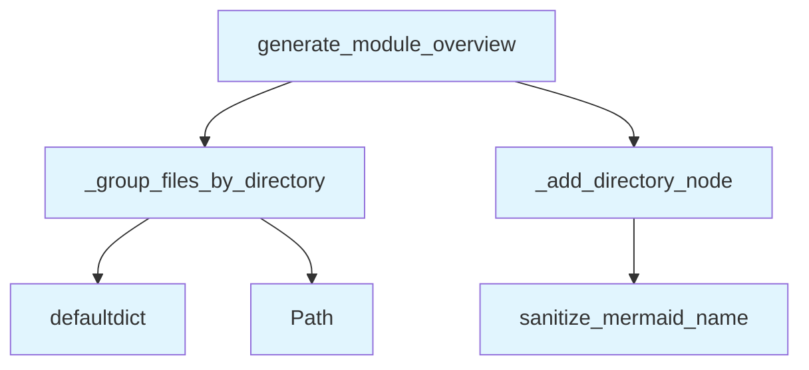

# File: `src/local_deepwiki/generators/diagrams/module_diagram.py`

## File Overview

This file is responsible for generating a high-level module overview diagram using the Mermaid diagramming language. It takes an [`IndexStatus`](../../models/wiki.md) object containing file information and produces a Mermaid graph that visualizes the package structure by grouping files into top-level directories and subdirectories. This diagram is useful for understanding the overall organization of the codebase.

The file is part of a larger set of diagram generation utilities and integrates with the indexing and status management components of the `local_deepwiki` project.

## Key Concepts

### Mermaid Diagram Generation
The core functionality revolves around generating Mermaid `graph TB` diagrams. The structure is built by:
- Grouping files by their top-level directory.
- Using Mermaid's `subgraph` syntax to represent directory hierarchies.
- Sanitizing directory names to ensure they are valid Mermaid identifiers.

### Directory Grouping Logic
The `_group_files_by_directory` function implements logic to:
- Skip files that are part of artifact directories (defined in `_ARTIFACT_DIRS`).
- Normalize directory names that start with layout prefixes (defined in `_LAYOUT_PREFIXES`).
- Count files within subdirectories to support file count display.

### Node Labeling and Sanitization
The `_add_directory_node` function:
- Uses [`sanitize_mermaid_name`](_utils.md) to prevent invalid characters in Mermaid identifiers.
- Conditionally includes file counts in node labels based on the `show_file_counts` flag.
- Determines whether to use a `subgraph` or a simple node based on whether there are multiple subdirectories.

## Integration

This file is part of the `diagrams` module and depends on:
- [`IndexStatus`](../../models/wiki.md) from `local_deepwiki.models` — to access file listing and status information.
- [`sanitize_mermaid_name`](_utils.md) from `._utils` — to prepare directory names for Mermaid syntax.

It is closely related to other diagram generation files in the same module:
- `architecture_compare.py` — likely for architectural comparison diagrams.
- `smells_page.py` — for code smell analysis visualizations.
- `tours.py` — for guided tours or navigation diagrams.

It is also used by CLI entrypoints such as:
- `main.py` — for command-line diagram generation.
- `config_validator.py` — potentially for validating diagram-related configurations.

## Design Notes

### Artifact Directory Filtering
The code skips directories listed in `_ARTIFACT_DIRS`. This ensures that temporary, build, or generated files are not included in the module overview, keeping the diagram focused on source code structure.

### Layout Prefix Handling
Directories starting with prefixes in `_LAYOUT_PREFIXES` are treated specially. If a directory matches a layout prefix, its first-level subdirectory is used as the top-level node in the diagram. This allows for cleaner representation of layout-based structures (e.g., `src/layouts/` and `src/components/`).

### File Count Display
The `show_file_counts` parameter allows for optional inclusion of file counts in node labels. This is a user-facing feature that can be toggled depending on diagram clarity needs.

### Edge Cases
- If no files are indexed, or all files are filtered out, the function returns `None`.
- Files with paths shorter than two components are skipped to avoid malformed grouping.
- Root-level files are grouped under a special `_root` key to distinguish them from subdirectories.

### Mermaid Compatibility
The code uses Mermaid's `graph TB` syntax, which is a top-to-bottom directed graph. The use of `subgraph` ensures hierarchical grouping, and [`sanitize_mermaid_name`](_utils.md) ensures compatibility with Mermaid’s identifier rules.

## API Reference

### Functions

#### `generate_module_overview`

```python
def generate_module_overview(index_status: IndexStatus, show_file_counts: bool = True) -> str | None
```

Generate a high-level module overview diagram.  Shows package structure with subgraphs for major directories.


| Parameter | Type | Default | Description |
|-----------|------|---------|-------------|
| `index_status` | `IndexStatus` | - | Index status with file information. |
| `show_file_counts` | `bool` | `True` | Whether to show file counts in nodes. |

**Returns:** `str | None`


<details>
<summary>View Source (lines 81-108) | <a href="https://github.com/UrbanDiver/local-deepwiki-mcp/blob/main/src/local_deepwiki/generators/diagrams/module_diagram.py#L81-L108">GitHub</a></summary>

```python
def generate_module_overview(
    index_status: IndexStatus,
    show_file_counts: bool = True,
) -> str | None:
    """Generate a high-level module overview diagram.

    Shows package structure with subgraphs for major directories.

    Args:
        index_status: Index status with file information.
        show_file_counts: Whether to show file counts in nodes.

    Returns:
        Mermaid diagram string, or None if not enough structure.
    """
    if not index_status.files:
        return None

    directories = _group_files_by_directory(index_status)
    if not directories:
        return None

    lines = ["```mermaid", "graph TB"]
    for top_dir, subdirs in sorted(directories.items()):
        _add_directory_node(lines, top_dir, subdirs, show_file_counts)
    lines.append("```")

    return "\n".join(lines)
```

</details>

## Call Graph



## Used By

Functions and methods in this file and their callers:

- **`Path`**: called by `_group_files_by_directory`
- **`_add_directory_node`**: called by `generate_module_overview`
- **`_group_files_by_directory`**: called by `generate_module_overview`
- **`defaultdict`**: called by `_group_files_by_directory`
- **[`sanitize_mermaid_name`](_utils.md)**: called by `_add_directory_node`

## Last Modified

| Entity | Type | Author | Date | Commit |
|--------|------|--------|------|--------|
| `_group_files_by_directory` | function | Brian Breidenbach | 2 days ago | `8b8f36f` refactor: decompose CC > 15... |
| `_add_directory_node` | function | Brian Breidenbach | 2 days ago | `8b8f36f` refactor: decompose CC > 15... |
| `generate_module_overview` | function | Brian Breidenbach | 2 days ago | `8b8f36f` refactor: decompose CC > 15... |

## Additional Source Code

Source code for functions and methods not listed in the API Reference above.

#### `_group_files_by_directory`

<details>
<summary>View Source (lines 31-54) | <a href="https://github.com/UrbanDiver/local-deepwiki-mcp/blob/main/src/local_deepwiki/generators/diagrams/module_diagram.py#L31-L54">GitHub</a></summary>

```python
def _group_files_by_directory(
    index_status: IndexStatus,
) -> defaultdict[str, Counter[str]]:
    """Group indexed files by top-level directory, skipping artifacts."""
    directories: defaultdict[str, Counter[str]] = defaultdict(Counter)

    for file_info in index_status.files:
        parts = list(Path(file_info.path).parts)
        if len(parts) < 2:
            continue
        if any(p in _ARTIFACT_DIRS for p in parts):
            continue

        top_dir = parts[0]
        if top_dir in _LAYOUT_PREFIXES and len(parts) > 1:
            top_dir = parts[1]
            parts = parts[1:]

        if len(parts) > 1:
            directories[top_dir][parts[1]] += 1
        else:
            directories[top_dir]["_root"] += 1

    return directories
```

</details>


#### `_add_directory_node`

<details>
<summary>View Source (lines 57-78) | <a href="https://github.com/UrbanDiver/local-deepwiki-mcp/blob/main/src/local_deepwiki/generators/diagrams/module_diagram.py#L57-L78">GitHub</a></summary>

```python
def _add_directory_node(
    lines: list[str],
    top_dir: str,
    subdirs: Counter[str],
    show_file_counts: bool,
) -> None:
    """Append Mermaid lines for one top-level directory."""
    safe_dir = sanitize_mermaid_name(top_dir)
    total_files = sum(subdirs.values())

    if len(subdirs) > 1 and "_root" not in subdirs:
        lines.append(f"    subgraph {safe_dir}[{top_dir}]")
        for subdir, count in sorted(subdirs.items()):
            if subdir == "_root":
                continue
            safe_sub = sanitize_mermaid_name(f"{top_dir}_{subdir}")
            label = f"{subdir} ({count})" if show_file_counts else subdir
            lines.append(f"        {safe_sub}[{label}]")
        lines.append("    end")
    else:
        label = f"{top_dir} ({total_files})" if show_file_counts else top_dir
        lines.append(f"    {safe_dir}[{label}]")
```

</details>

## Relevant Source Files

- `src/local_deepwiki/generators/diagrams/module_diagram.py:31-54`
