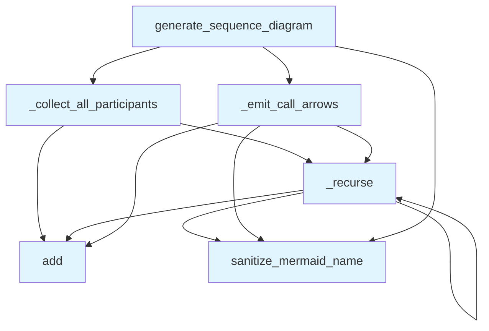

# File: `src/local_deepwiki/generators/diagrams/sequence_diagram.py`

## File Overview

This file is responsible for generating **sequence diagrams** from a call graph using the **Mermaid syntax**. It provides functionality to visualize the flow of function calls starting from a given entry point, up to a specified depth. The diagrams are useful for understanding the execution flow and dependencies between functions in a codebase.

The module is designed to be used as part of a larger diagram generation service and is integrated into the test suite for validation.

## Key Concepts

### Call Graph Traversal
The core algorithm uses recursive traversal of a call graph, represented as a dictionary mapping callers to lists of callees. This allows the system to build a sequence diagram that shows how functions call each other.

### Mermaid Syntax Generation
The module generates diagrams in Mermaid format, which is a text-based diagram description language. The diagram includes:
- Participants (functions)
- Call arrows (`->>`)
- Return arrows (`-->>-`)

### Depth Limiting
To avoid overly complex diagrams, the generation process respects a maximum depth (`max_depth`) to limit how far the recursion goes. This prevents infinite loops and keeps the diagram readable.

### Sanitization
Function names are sanitized to ensure they are valid Mermaid identifiers. This is done using the [`_utils.sanitize_mermaid_name`](_utils.md) helper, which ensures compatibility with Mermaid's syntax.

## Integration

This file is imported by:
- `src/local_deepwiki/generators/diagrams/__init__.py` (indirectly via `generator_service`)

It is used by:
- `generator_service` — the main service responsible for generating various types of diagrams
- `test_diagrams_misc` — a test module that validates diagram generation

The module is part of a larger diagram generation system, where it contributes to the sequence diagram functionality. It is tightly coupled with the `_utils` module, which provides helper functions like [`sanitize_mermaid_name`](_utils.md).

## Design Notes

### Why Recursion?
The recursive approach is used for traversing the call graph and emitting arrows. This mirrors the natural structure of function calls and is intuitive for building the diagram.

### Handling Entry Points
If no `entry_point` is provided, the function defaults to the most-called function in the call graph. This helps in generating a meaningful diagram even when the user doesn't specify a starting point.

### Empty Diagrams
If the generated diagram contains no actual calls (only headers and participants), it returns `None` to indicate that no meaningful diagram was produced. This avoids generating empty or misleading diagrams.

### Duplicate Call Handling
In `_emit_call_arrows`, a set `visited` is used to prevent emitting the same call arrow multiple times. This is important in cases where functions may be called multiple times or where the call graph has cycles.

### Mermaid Identifier Sanitization
Function names are sanitized to ensure they comply with Mermaid syntax. For example, names with dots or special characters are cleaned to be valid identifiers, while still preserving the original display name for readability.

## API Reference

### Functions

#### `generate_sequence_diagram`

```python
def generate_sequence_diagram(call_graph: dict[str, list[str]], entry_point: str | None = None, max_depth: int = 5) -> str | None
```

Generate a sequence diagram from a call graph.  Shows the sequence of calls starting from an entry point.


| Parameter | Type | Default | Description |
|-----------|------|---------|-------------|
| `call_graph` | `dict[str, list[str]]` | - | Mapping of caller to list of callees. |
| `entry_point` | `str | None` | `None` | Starting function (if None, uses most-called function). |
| `max_depth` | `int` | `5` | Maximum call depth to show. |

**Returns:** `str | None`


<details>
<summary>View Source (lines 53-95) | <a href="https://github.com/UrbanDiver/local-deepwiki-mcp/blob/main/src/local_deepwiki/generators/diagrams/sequence_diagram.py#L53-L95">GitHub</a></summary>

```python
def generate_sequence_diagram(
    call_graph: dict[str, list[str]],
    entry_point: str | None = None,
    max_depth: int = 5,
) -> str | None:
    """Generate a sequence diagram from a call graph.

    Shows the sequence of calls starting from an entry point.

    Args:
        call_graph: Mapping of caller to list of callees.
        entry_point: Starting function (if None, uses most-called function).
        max_depth: Maximum call depth to show.

    Returns:
        Mermaid sequence diagram string, or None if empty.
    """
    if not call_graph:
        return None

    if not entry_point:
        entry_point = max(
            call_graph.keys(), key=lambda k: len(call_graph.get(k, [])), default=None
        )

    if not entry_point or entry_point not in call_graph:
        return None

    lines = ["```mermaid", "sequenceDiagram"]

    participants = _collect_all_participants(call_graph, entry_point, max_depth)
    for p in sorted(participants):
        safe_name = sanitize_mermaid_name(p)
        display = p.split(".")[-1] if "." in p else p
        lines.append(f"    participant {safe_name} as {display}")

    _emit_call_arrows(call_graph, entry_point, max_depth, lines)

    if len(lines) <= 3:  # Only header and participants — no actual calls
        return None

    lines.append("```")
    return "\n".join(lines)
```

</details>

## Call Graph



## Used By

Functions and methods in this file and their callers:

- **`_collect_all_participants`**: called by `generate_sequence_diagram`
- **`_emit_call_arrows`**: called by `generate_sequence_diagram`
- **`_recurse`**: called by `_collect_all_participants`, `_emit_call_arrows`, `_recurse`
- **`add`**: called by `_collect_all_participants`, `_emit_call_arrows`, `_recurse`
- **[`sanitize_mermaid_name`](_utils.md)**: called by `_emit_call_arrows`, `_recurse`, `generate_sequence_diagram`

## Last Modified

| Entity | Type | Author | Date | Commit |
|--------|------|--------|------|--------|
| `_collect_all_participants` | function | Brian Breidenbach | yesterday | `29ae780` refactor: decompose long me... |
| `_recurse` | function | Brian Breidenbach | yesterday | `29ae780` refactor: decompose long me... |
| `_emit_call_arrows` | function | Brian Breidenbach | yesterday | `29ae780` refactor: decompose long me... |
| `_recurse` | function | Brian Breidenbach | yesterday | `29ae780` refactor: decompose long me... |
| `generate_sequence_diagram` | function | Brian Breidenbach | yesterday | `29ae780` refactor: decompose long me... |

## Additional Source Code

Source code for functions and methods not listed in the API Reference above.

#### `_collect_all_participants`

<details>
<summary>View Source (lines 8-24) | <a href="https://github.com/UrbanDiver/local-deepwiki-mcp/blob/main/src/local_deepwiki/generators/diagrams/sequence_diagram.py#L8-L24">GitHub</a></summary>

```python
def _collect_all_participants(
    call_graph: dict[str, list[str]],
    entry_point: str,
    max_depth: int,
) -> set[str]:
    """Collect all functions reachable from *entry_point* up to *max_depth*."""
    participants: set[str] = {entry_point}

    def _recurse(func: str, depth: int) -> None:
        if depth > max_depth:
            return
        for callee in call_graph.get(func, []):
            participants.add(callee)
            _recurse(callee, depth + 1)

    _recurse(entry_point, 0)
    return participants
```

</details>


#### `_recurse`

<details>
<summary>View Source (lines 16-21) | <a href="https://github.com/UrbanDiver/local-deepwiki-mcp/blob/main/src/local_deepwiki/generators/diagrams/sequence_diagram.py#L16-L21">GitHub</a></summary>

```python
def _recurse(func: str, depth: int) -> None:
        if depth > max_depth:
            return
        for callee in call_graph.get(func, []):
            participants.add(callee)
            _recurse(callee, depth + 1)
```

</details>


#### `_emit_call_arrows`

<details>
<summary>View Source (lines 27-50) | <a href="https://github.com/UrbanDiver/local-deepwiki-mcp/blob/main/src/local_deepwiki/generators/diagrams/sequence_diagram.py#L27-L50">GitHub</a></summary>

```python
def _emit_call_arrows(
    call_graph: dict[str, list[str]],
    entry_point: str,
    max_depth: int,
    lines: list[str],
) -> None:
    """Recursively emit Mermaid call/return arrows starting from *entry_point*."""
    visited: set[tuple[str, str]] = set()

    def _recurse(caller: str, depth: int) -> None:
        if depth > max_depth:
            return
        safe_caller = sanitize_mermaid_name(caller)
        for callee in call_graph.get(caller, []):
            if (caller, callee) in visited:
                continue
            visited.add((caller, callee))
            safe_callee = sanitize_mermaid_name(callee)
            lines.append(f"    {safe_caller}->>+{safe_callee}: call")
            if callee in call_graph:
                _recurse(callee, depth + 1)
            lines.append(f"    {safe_callee}-->>-{safe_caller}: return")

    _recurse(entry_point, 0)
```

</details>


#### `_recurse`

<details>
<summary>View Source (lines 36-48) | <a href="https://github.com/UrbanDiver/local-deepwiki-mcp/blob/main/src/local_deepwiki/generators/diagrams/sequence_diagram.py#L36-L48">GitHub</a></summary>

```python
def _recurse(caller: str, depth: int) -> None:
        if depth > max_depth:
            return
        safe_caller = sanitize_mermaid_name(caller)
        for callee in call_graph.get(caller, []):
            if (caller, callee) in visited:
                continue
            visited.add((caller, callee))
            safe_callee = sanitize_mermaid_name(callee)
            lines.append(f"    {safe_caller}->>+{safe_callee}: call")
            if callee in call_graph:
                _recurse(callee, depth + 1)
            lines.append(f"    {safe_callee}-->>-{safe_caller}: return")
```

</details>

## Relevant Source Files

- `src/local_deepwiki/generators/diagrams/sequence_diagram.py:8-24`
