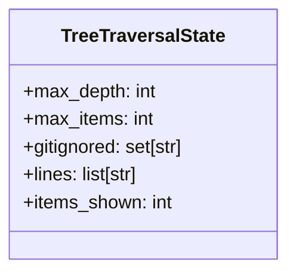
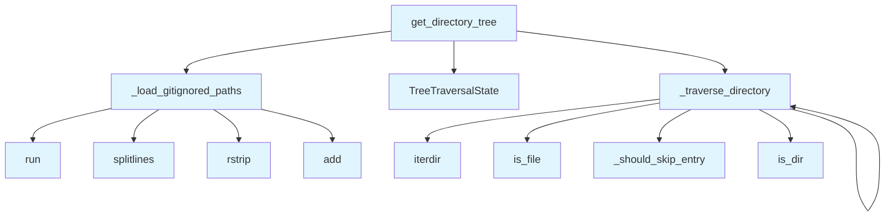

# File: `src/local_deepwiki/generators/dir_tree.py`

## File Overview

This module provides utilities for generating a formatted directory tree structure for a repository. It respects `.gitignore` rules when inside a git repository, excluding build artifacts, coverage reports, and other non-source directories. For non-git repositories, it uses a hardcoded skip-list to avoid including common noise directories.

The primary entry point is the `get_directory_tree` function, which returns a string representation of the directory structure. The implementation is recursive and respects configurable limits on depth and total items to include.

## Key Concepts

### Recursive Tree Traversal with State Management

The core algorithm uses a recursive traversal of the directory structure. To avoid passing configuration and accumulators through every recursive call, the `TreeTraversalState` class is used to encapsulate mutable state like the current depth, item count, and output lines. This pattern reduces function signature complexity and improves readability.

### Git Integration for Ignored Paths

When inside a git repository, the `_load_gitignored_paths` function uses `git ls-files` to discover ignored directories and files. This ensures that build artifacts and temporary files are not included in the generated tree, keeping the output focused on source code.

### Skip List for Non-Git Repositories

In non-git repositories, a hardcoded list of entries to skip is used (via `_should_skip_entry`). This ensures consistent behavior even when `.gitignore` is not available or applicable.

## Integration

This file is used by:
- `pages` (in `src/local_deepwiki/generators/wiki/pages.py`)
- `test_manifest` (likely in a test or manifest generation context)

The function `get_directory_tree` is the main integration point for generating directory trees, which are often used in documentation or project overviews. It is designed to be lightweight and efficient, suitable for inclusion in larger documentation or analysis workflows.

The module integrates with the broader codebase by providing a reusable utility for displaying repository structure. It is closely related to other generation modules like `api_docs.py`, `architecture_compare.py`, and `tours.py`, which may use directory trees as part of their output.

## Design Notes

### Handling of Edge Cases

- **[Permission](../security/access_control.md) Errors**: When a directory cannot be accessed due to permissions, the traversal simply skips that directory without raising an error.
- **Timeouts in Git Commands**: The git command execution is wrapped in a timeout to prevent hanging in slow environments. If the command fails, an empty set of ignored paths is returned.
- **Depth and Item Limits**: The traversal respects both `max_depth` and `max_items` to avoid generating overly large outputs. When the item limit is reached, a `..` marker is added to indicate truncation.

### Why This Approach Was Chosen

- **Recursive Traversal**: This is a natural fit for tree structures and is well-suited for directory hierarchies.
- **State Management**: Using a mutable `TreeTraversalState` avoids bloated function signatures and is a clean way to manage recursive state in Python.
- **Git Integration**: Using `git ls-files` is a standard and reliable way to determine ignored files, and it integrates well with the existing git workflow.
- **Hardcoded Skip List**: For non-git repositories, a simple hardcoded list ensures consistent behavior without requiring external tools or complex logic.

### Implementation Choices

- **`.gitignore` Respect**: The module assumes that the repository root is passed as `repo_path`, and it uses `git ls-files` to find ignored top-level entries.
- **Trailing Slash for Directories**: The tree output includes a trailing `/` for directories to visually distinguish them.
- **Visual Tree Formatting**: Uses Unicode box-drawing characters (`├──`, `└──`, `│`) for a clean, readable tree structure.

## API Reference

### class `TreeTraversalState`

Mutable state for recursive directory tree traversal.  Bundles the configuration and accumulators for :func:`_traverse_directory`, keeping the recursive call signature short.

---


<details>
<summary>View Source (lines 14-25) | <a href="https://github.com/UrbanDiver/local-deepwiki-mcp/blob/main/src/local_deepwiki/generators/dir_tree.py#L14-L25">GitHub</a></summary>

```python
class TreeTraversalState:
    """Mutable state for recursive directory tree traversal.

    Bundles the configuration and accumulators for
    :func:`_traverse_directory`, keeping the recursive call signature short.
    """

    max_depth: int
    max_items: int
    gitignored: set[str]
    lines: list[str] = field(default_factory=list)
    items_shown: int = 0
```

</details>

### Functions

#### `get_directory_tree`

```python
def get_directory_tree(repo_path: Path, max_depth: int = 3, max_items: int = 50) -> str
```

Generate a directory tree structure for the repository.  Respects ``.gitignore`` when inside a git repository so that build artifacts, coverage reports, and other non-source directories are excluded.  Falls back to a hardcoded skip-list for non-git repos.


| Parameter | Type | Default | Description |
|-----------|------|---------|-------------|
| `repo_path` | `Path` | - | Path to repository root. |
| `max_depth` | `int` | `3` | Maximum depth to traverse. |
| `max_items` | `int` | `50` | Maximum total items to include. |

**Returns:** `str`


<details>
<summary>View Source (lines 153-179) | <a href="https://github.com/UrbanDiver/local-deepwiki-mcp/blob/main/src/local_deepwiki/generators/dir_tree.py#L153-L179">GitHub</a></summary>

```python
def get_directory_tree(repo_path: Path, max_depth: int = 3, max_items: int = 50) -> str:
    """Generate a directory tree structure for the repository.

    Respects ``.gitignore`` when inside a git repository so that build
    artifacts, coverage reports, and other non-source directories are
    excluded.  Falls back to a hardcoded skip-list for non-git repos.

    Args:
        repo_path: Path to repository root.
        max_depth: Maximum depth to traverse.
        max_items: Maximum total items to include.

    Returns:
        Formatted directory tree string.
    """
    gitignored = _load_gitignored_paths(repo_path)
    state = TreeTraversalState(
        max_depth=max_depth,
        max_items=max_items,
        gitignored=gitignored,
        lines=[f"{repo_path.name}/"],
        items_shown=1,  # count root entry
    )

    _traverse_directory(repo_path, "", 1, state)

    return "\n".join(state.lines)
```

</details>

## Class Diagram



## Call Graph



## Used By

Functions and methods in this file and their callers:

- **`TreeTraversalState`**: called by `get_directory_tree`
- **`_load_gitignored_paths`**: called by `get_directory_tree`
- **`_should_skip_entry`**: called by `_traverse_directory`
- **`_traverse_directory`**: called by `_traverse_directory`, `get_directory_tree`
- **`add`**: called by `_load_gitignored_paths`
- **`is_dir`**: called by `_traverse_directory`
- **`is_file`**: called by `_traverse_directory`
- **`iterdir`**: called by `_traverse_directory`
- **`rstrip`**: called by `_load_gitignored_paths`
- **`run`**: called by `_load_gitignored_paths`
- **`splitlines`**: called by `_load_gitignored_paths`

## Last Modified

| Entity | Type | Author | Date | Commit |
|--------|------|--------|------|--------|
| `TreeTraversalState` | class | Brian Breidenbach | yesterday | `1eef062` refactor: complete Grade A ... |
| `_traverse_directory` | function | Brian Breidenbach | yesterday | `1eef062` refactor: complete Grade A ... |
| `get_directory_tree` | function | Brian Breidenbach | yesterday | `1eef062` refactor: complete Grade A ... |
| `_should_skip_entry` | function | Brian Breidenbach | 2 days ago | `8b8f36f` refactor: decompose CC > 15... |
| `_load_gitignored_paths` | function | Brian Breidenbach | Feb 21, 2026 | `aad50cb` refactor: split 9 files (80... |

## Additional Source Code

Source code for functions and methods not listed in the API Reference above.

#### `_load_gitignored_paths`

<details>
<summary>View Source (lines 28-71) | <a href="https://github.com/UrbanDiver/local-deepwiki-mcp/blob/main/src/local_deepwiki/generators/dir_tree.py#L28-L71">GitHub</a></summary>

```python
def _load_gitignored_paths(repo_path: Path) -> set[str]:
    """Load the set of gitignored top-level entries using git.

    Uses ``git ls-files --others --ignored --exclude-standard --directory``
    to discover ignored directories/files, returning their names so the
    directory tree can skip them.

    Args:
        repo_path: Path to the repository root.

    Returns:
        Set of names (relative to *repo_path*) that are gitignored.
        Returns an empty set if not a git repo or if the command fails.
    """
    import subprocess  # noqa: PLC0415

    try:
        result = subprocess.run(
            [
                "git",
                "ls-files",
                "--others",
                "--ignored",
                "--exclude-standard",
                "--directory",
            ],
            cwd=repo_path,
            capture_output=True,
            text=True,
            timeout=5,
        )
        if result.returncode != 0:
            return set()
        ignored: set[str] = set()
        for line in result.stdout.splitlines():
            # git outputs trailing '/' for directories -- strip it
            name = line.strip().rstrip("/")
            if name:
                # Only keep top-level entries (no path separators)
                if "/" not in name:
                    ignored.add(name)
        return ignored
    except (FileNotFoundError, subprocess.TimeoutExpired, OSError):
        return set()
```

</details>


#### `_should_skip_entry`

<details>
<summary>View Source (lines 101-110) | <a href="https://github.com/UrbanDiver/local-deepwiki-mcp/blob/main/src/local_deepwiki/generators/dir_tree.py#L101-L110">GitHub</a></summary>

```python
def _should_skip_entry(name: str, gitignored: set[str]) -> bool:
    """Return True if a directory entry should be excluded from the tree."""
    if name in _ALWAYS_SKIP or name in gitignored:
        return True
    if name.startswith("."):
        return True
    # Skip names that look like Python repr strings (e.g. MagicMock dirs)
    if name.startswith(("<", "'", '"')):
        return True
    return False
```

</details>


#### `_traverse_directory`

<details>
<summary>View Source (lines 113-150) | <a href="https://github.com/UrbanDiver/local-deepwiki-mcp/blob/main/src/local_deepwiki/generators/dir_tree.py#L113-L150">GitHub</a></summary>

```python
def _traverse_directory(
    path: Path,
    prefix: str,
    depth: int,
    state: TreeTraversalState,
) -> None:
    """Recursively traverse *path* and append tree lines to *state.lines*.

    Uses :class:`TreeTraversalState` to carry configuration and the mutable
    counter across recursive calls.
    """
    if depth > state.max_depth or state.items_shown >= state.max_items:
        return

    try:
        items = sorted(path.iterdir(), key=lambda x: (x.is_file(), x.name))
    except PermissionError:
        return

    items = [i for i in items if not _should_skip_entry(i.name, state.gitignored)]

    for i, item in enumerate(items):
        if state.items_shown >= state.max_items:
            state.lines.append(f"{prefix}...")
            return

        is_last = i == len(items) - 1
        connector = "└── " if is_last else "├── "
        new_prefix = prefix + ("    " if is_last else "│   ")

        if item.is_dir():
            state.lines.append(f"{prefix}{connector}{item.name}/")
        else:
            state.lines.append(f"{prefix}{connector}{item.name}")
        state.items_shown += 1

        if item.is_dir():
            _traverse_directory(item, new_prefix, depth + 1, state)
```

</details>

## Relevant Source Files

- `src/local_deepwiki/generators/dir_tree.py:14-25`
