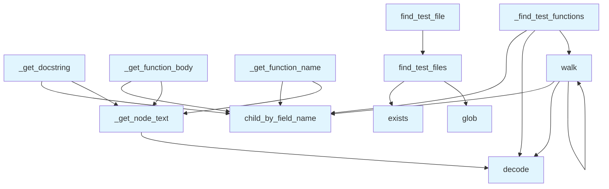

# File: `src/local_deepwiki/generators/examples/discovery.py`

## File Overview

This file provides utilities for discovering test files associated with source files and analyzing test function structures using the Tree-sitter AST. It supports test discovery strategies and AST traversal for extracting function names, docstrings, and body content from test files. These utilities are used to power test analysis and documentation generation within the local_deepwiki project.

The module is designed to be used in conjunction with other core parsing and analysis modules like `ast_utils`, `docstrings`, and `complexity`, and integrates with the CLI and configuration validation logic.

## Key Concepts

### Test File Discovery Strategies

The `find_test_files` function implements a multi-strategy approach to locate test files for a given source file:

1. **Direct Match**: `src/foo.py` → `tests/test_foo.py`
2. **Coverage Tests**: `src/foo.py` → `tests/test_foo_coverage.py`
3. **Suffix Variants**: `tests/test_foo_*.py`
4. **Alternative Naming**: `src/foo.py` → `tests/foo_test.py`

This design ensures compatibility with various project structures and naming conventions commonly found in Python projects.

### AST Traversal for Test Functions

The `_find_test_functions` function uses recursive tree traversal to identify test functions within an AST. It distinguishes between:

- Standalone test functions (e.g., `def test_something():`)
- Test methods inside test classes (e.g., `class TestSomething:`)

This is crucial for correctly identifying which functions are test cases and which are helper functions, especially when analyzing test class structures.

### Mock Detection

The `_is_mock_heavy` function is used to filter out tests that rely heavily on mocking. This is important because such tests often do not reflect real-world usage patterns and may skew documentation or complexity metrics.

## Integration

This file is imported and used by several other components in the codebase:

- `ast_utils`: The `walk` function is directly used for AST traversal.
- `complexity` and `coupling`: The `walk` function is used to traverse AST nodes for complexity analysis.
- `test_test_examples`: The `find_test_files` and `find_test_file` functions are used to locate test files for example analysis.

The module's dependencies are minimal and focused:

- `pathlib.Path`: For path manipulation and file system operations.
- `tree-sitter.Node`: For AST node handling.
- [`local_deepwiki.logging.get_logger`](../../logging.md): For logging debug messages.

This tight integration with Tree-sitter and the logging system ensures that this module can be seamlessly embedded into larger analysis workflows.

## Design Notes

### AST Parsing and Text Extraction

The `_get_node_text` function extracts text from Tree-sitter nodes using byte slicing and UTF-8 decoding. This is a performance-conscious approach that avoids unnecessary string allocations or conversions, aligning with the overall goal of efficient AST traversal.

### Handling Nested Classes and Functions

The recursive `walk` function handles nested structures, including test classes that contain test methods. This ensures that all relevant test functions are identified, even in complex test class hierarchies.

### Mock Filtering Strategy

The `_is_mock_heavy` function uses a simple but effective heuristic: if a function body contains two or more indicators of mocking (e.g., `@patch`, `MagicMock`, etc.), it is considered mock-heavy. This helps to exclude tests that do not reflect real usage, improving the quality of generated documentation.

### Backward Compatibility

The `find_test_file` function is a legacy [wrapper](../../handlers/_error_handling.md) that returns only the first test file found. It is maintained for compatibility with existing code that expects a single file path rather than a list. This maintains backward compatibility while the rest of the system evolves to use `find_test_files`.

## API Reference

### Functions

#### `find_test_files`

```python
def find_test_files(source_file: Path, repo_root: Path) -> list[Path]
```

Find all corresponding test files for a source file.  Tries multiple strategies: 1. Direct match: src/.../foo.py -> tests/test_foo.py 2. Coverage tests: src/.../foo.py -> tests/test_foo_coverage.py 3. Suffix variants: tests/test_foo_*.py 4. Alternative naming: tests/foo_test.py


| Parameter | Type | Default | Description |
|-----------|------|---------|-------------|
| `source_file` | `Path` | - | Path to the source file. |
| `repo_root` | `Path` | - | Root directory of the repository. |

**Returns:** `list[Path]`


<details>
<summary>View Source (lines 14-72) | <a href="https://github.com/UrbanDiver/local-deepwiki-mcp/blob/main/src/local_deepwiki/generators/examples/discovery.py#L14-L72">GitHub</a></summary>

```python
def find_test_files(source_file: Path, repo_root: Path) -> list[Path]:
    """Find all corresponding test files for a source file.

    Tries multiple strategies:
    1. Direct match: src/.../foo.py -> tests/test_foo.py
    2. Coverage tests: src/.../foo.py -> tests/test_foo_coverage.py
    3. Suffix variants: tests/test_foo_*.py
    4. Alternative naming: tests/foo_test.py

    Args:
        source_file: Path to the source file.
        repo_root: Root directory of the repository.

    Returns:
        List of test file paths found (may be empty).
    """
    # Get base filename without extension
    base_name = source_file.stem  # e.g., "api_docs"

    # Skip test files themselves
    if base_name.startswith("test_"):
        return []

    test_files: list[Path] = []

    # Common test directories to check
    test_dirs = [
        repo_root / "tests",
        repo_root / "test",
    ]

    for test_dir in test_dirs:
        if not test_dir.exists():
            continue

        # Try direct match: test_<basename>.py
        test_file = test_dir / f"test_{base_name}.py"
        if test_file.exists():
            test_files.append(test_file)

        # Try coverage variant: test_<basename>_coverage.py
        coverage_file = test_dir / f"test_{base_name}_coverage.py"
        if coverage_file.exists():
            test_files.append(coverage_file)

        # Try glob for other variants: test_<basename>_*.py
        for variant in test_dir.glob(f"test_{base_name}_*.py"):
            if variant not in test_files:
                test_files.append(variant)

        # Try alternative naming: <basename>_test.py
        alt_file = test_dir / f"{base_name}_test.py"
        if alt_file.exists() and alt_file not in test_files:
            test_files.append(alt_file)

    if test_files:
        logger.debug("Found %s test file(s) for %s", len(test_files), source_file.name)

    return test_files
```

</details>

#### `find_test_file`

```python
def find_test_file(source_file: Path, repo_root: Path) -> Path | None
```

Find the corresponding test file for a source file.  Legacy function for backwards compatibility. Returns the first test file found, or None.


| Parameter | Type | Default | Description |
|-----------|------|---------|-------------|
| `source_file` | `Path` | - | Path to the source file. |
| `repo_root` | `Path` | - | Root directory of the repository. |

**Returns:** `Path | None`


<details>
<summary>View Source (lines 75-89) | <a href="https://github.com/UrbanDiver/local-deepwiki-mcp/blob/main/src/local_deepwiki/generators/examples/discovery.py#L75-L89">GitHub</a></summary>

```python
def find_test_file(source_file: Path, repo_root: Path) -> Path | None:
    """Find the corresponding test file for a source file.

    Legacy function for backwards compatibility.
    Returns the first test file found, or None.

    Args:
        source_file: Path to the source file.
        repo_root: Root directory of the repository.

    Returns:
        Path to the test file if found, None otherwise.
    """
    test_files = find_test_files(source_file, repo_root)
    return test_files[0] if test_files else None
```

</details>

#### `walk`

```python
def walk(node: Node, current_class: str | None = None) -> None
```


| Parameter | Type | Default | Description |
|-----------|------|---------|-------------|
| `node` | `Node` | - | - |
| `current_class` | `str | None` | `None` | - |

**Returns:** `None`


<details>
<summary>View Source (lines 111-133) | <a href="https://github.com/UrbanDiver/local-deepwiki-mcp/blob/main/src/local_deepwiki/generators/examples/discovery.py#L111-L133">GitHub</a></summary>

```python
def walk(node: Node, current_class: str | None = None) -> None:
        if node.type == "class_definition":
            # Get class name
            name_node = node.child_by_field_name("name")
            if name_node:
                class_name = name_node.text.decode("utf-8") if name_node.text else ""
                # Check if it's a test class
                if class_name.startswith("Test"):
                    # Walk children with this class context
                    for child in node.children:
                        walk(child, class_name)
                    return

        if node.type == "function_definition":
            # Get the function name
            name_node = node.child_by_field_name("name")
            if name_node:
                name = name_node.text.decode("utf-8") if name_node.text else ""
                if name.startswith("test_"):
                    test_functions.append((node, current_class))

        for child in node.children:
            walk(child, current_class)
```

</details>

## Call Graph



## Used By

Functions and methods in this file and their callers:

- **`_get_node_text`**: called by `_get_docstring`, `_get_function_body`, `_get_function_name`
- **`child_by_field_name`**: called by `_find_test_functions`, `_get_docstring`, `_get_function_body`, `_get_function_name`, `walk`
- **`decode`**: called by `_find_test_functions`, `_get_node_text`, `walk`
- **`exists`**: called by `find_test_files`
- **`find_test_files`**: called by `find_test_file`
- **`glob`**: called by `find_test_files`
- **`walk`**: called by `_find_test_functions`, `walk`

## Last Modified

| Entity | Type | Author | Date | Commit |
|--------|------|--------|------|--------|
| `find_test_files` | function | Brian Breidenbach | Feb 21, 2026 | `fecde6f` refactor: split 10 large fi... |
| `find_test_file` | function | Brian Breidenbach | Feb 21, 2026 | `fecde6f` refactor: split 10 large fi... |
| `_get_node_text` | function | Brian Breidenbach | Feb 21, 2026 | `fecde6f` refactor: split 10 large fi... |
| `_find_test_functions` | function | Brian Breidenbach | Feb 21, 2026 | `fecde6f` refactor: split 10 large fi... |
| `walk` | function | Brian Breidenbach | Feb 21, 2026 | `fecde6f` refactor: split 10 large fi... |
| `_get_function_name` | function | Brian Breidenbach | Feb 21, 2026 | `fecde6f` refactor: split 10 large fi... |
| `_get_docstring` | function | Brian Breidenbach | Feb 21, 2026 | `fecde6f` refactor: split 10 large fi... |
| `_get_function_body` | function | Brian Breidenbach | Feb 21, 2026 | `fecde6f` refactor: split 10 large fi... |
| `_is_mock_heavy` | function | Brian Breidenbach | Feb 21, 2026 | `fecde6f` refactor: split 10 large fi... |

## Additional Source Code

Source code for functions and methods not listed in the API Reference above.

#### `_get_node_text`

<details>
<summary>View Source (lines 92-94) | <a href="https://github.com/UrbanDiver/local-deepwiki-mcp/blob/main/src/local_deepwiki/generators/examples/discovery.py#L92-L94">GitHub</a></summary>

```python
def _get_node_text(node: Node, source: bytes) -> str:
    """Get the text content of a tree-sitter node."""
    return source[node.start_byte : node.end_byte].decode("utf-8")
```

</details>


#### `_find_test_functions`

<details>
<summary>View Source (lines 97-136) | <a href="https://github.com/UrbanDiver/local-deepwiki-mcp/blob/main/src/local_deepwiki/generators/examples/discovery.py#L97-L136">GitHub</a></summary>

```python
def _find_test_functions(root: Node) -> list[tuple[Node, str | None]]:
    """Find all test function definitions in the AST.

    Finds both standalone test functions and test methods in test classes.

    Args:
        root: Root node of the parsed test file.

    Returns:
        List of (function_definition_node, class_name) tuples.
        class_name is None for standalone functions.
    """
    test_functions: list[tuple[Node, str | None]] = []

    def walk(node: Node, current_class: str | None = None) -> None:
        if node.type == "class_definition":
            # Get class name
            name_node = node.child_by_field_name("name")
            if name_node:
                class_name = name_node.text.decode("utf-8") if name_node.text else ""
                # Check if it's a test class
                if class_name.startswith("Test"):
                    # Walk children with this class context
                    for child in node.children:
                        walk(child, class_name)
                    return

        if node.type == "function_definition":
            # Get the function name
            name_node = node.child_by_field_name("name")
            if name_node:
                name = name_node.text.decode("utf-8") if name_node.text else ""
                if name.startswith("test_"):
                    test_functions.append((node, current_class))

        for child in node.children:
            walk(child, current_class)

    walk(root)
    return test_functions
```

</details>


#### `_get_function_name`

<details>
<summary>View Source (lines 139-144) | <a href="https://github.com/UrbanDiver/local-deepwiki-mcp/blob/main/src/local_deepwiki/generators/examples/discovery.py#L139-L144">GitHub</a></summary>

```python
def _get_function_name(func_node: Node, source: bytes) -> str:
    """Get the name of a function from its AST node."""
    name_node = func_node.child_by_field_name("name")
    if name_node:
        return _get_node_text(name_node, source)
    return "unknown"
```

</details>


#### `_get_docstring`

<details>
<summary>View Source (lines 147-167) | <a href="https://github.com/UrbanDiver/local-deepwiki-mcp/blob/main/src/local_deepwiki/generators/examples/discovery.py#L147-L167">GitHub</a></summary>

```python
def _get_docstring(func_node: Node, source: bytes) -> str | None:
    """Extract docstring from a function node if present."""
    body = func_node.child_by_field_name("body")
    if not body or not body.children:
        return None

    # First statement in body might be a docstring
    first_stmt = body.children[0]
    if first_stmt.type == "expression_statement":
        expr = first_stmt.children[0] if first_stmt.children else None
        if expr and expr.type == "string":
            docstring = _get_node_text(expr, source)
            # Clean up the docstring
            docstring = docstring.strip("\"'")
            if docstring.startswith('""'):
                docstring = (
                    docstring[2:-2] if docstring.endswith('""') else docstring[2:]
                )
            return docstring.strip()

    return None
```

</details>


#### `_get_function_body`

<details>
<summary>View Source (lines 170-175) | <a href="https://github.com/UrbanDiver/local-deepwiki-mcp/blob/main/src/local_deepwiki/generators/examples/discovery.py#L170-L175">GitHub</a></summary>

```python
def _get_function_body(func_node: Node, source: bytes) -> str:
    """Get the body of a function as a string."""
    body = func_node.child_by_field_name("body")
    if body:
        return _get_node_text(body, source)
    return ""
```

</details>


#### `_is_mock_heavy`

<details>
<summary>View Source (lines 178-193) | <a href="https://github.com/UrbanDiver/local-deepwiki-mcp/blob/main/src/local_deepwiki/generators/examples/discovery.py#L178-L193">GitHub</a></summary>

```python
def _is_mock_heavy(body: str) -> bool:
    """Check if a test body uses mocking extensively.

    We want to exclude heavily mocked tests as they don't show
    real usage patterns.
    """
    mock_indicators = [
        "MagicMock",
        "AsyncMock",
        "@patch",
        "patch(",
        "mock_",
        "mocker.",
    ]
    mock_count = sum(1 for indicator in mock_indicators if indicator in body)
    return mock_count >= 2
```

</details>

## Relevant Source Files

- `src/local_deepwiki/generators/examples/discovery.py:14-72`
