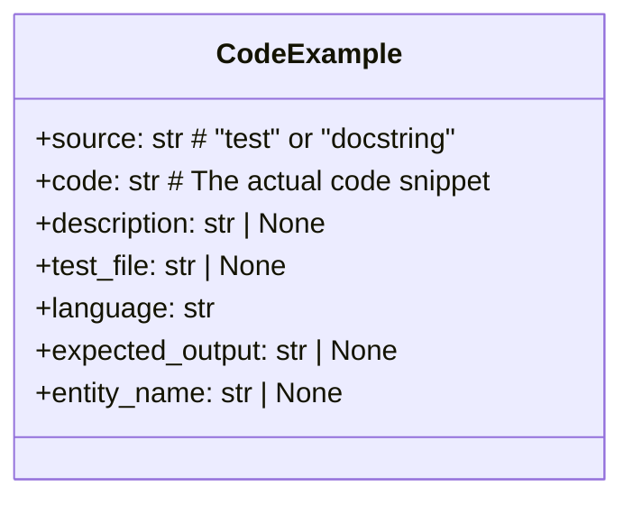
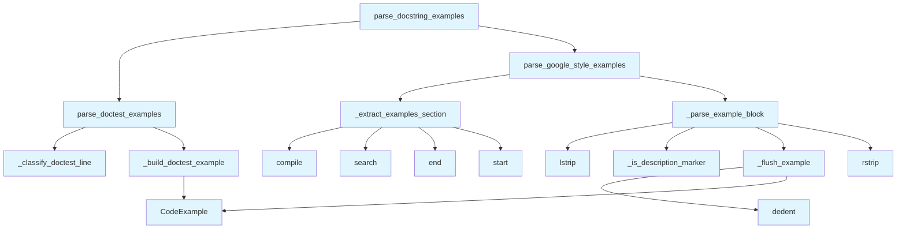

# File: `src/local_deepwiki/generators/examples/docstring.py`

## File Overview

This module is responsible for parsing code examples from docstrings, supporting two distinct formats:
1. **Python doctest-style** examples using `>>>` prompts and expected output.
2. **Google-style** Examples sections with descriptive headers and indented code blocks.

The module provides a unified interface to extract these examples into structured `CodeExample` objects, which are used by the example extraction pipeline in the documentation generator.

## Key Concepts

### Unified Example Representation
The `CodeExample` dataclass serves as the canonical representation of a code example extracted from any source. It encapsulates:
- `source`: Indicates whether the example came from a test or docstring.
- `code`: The actual code snippet.
- `description`: Context or explanation for the example.
- `test_file`: Path to the test file (for test examples).
- `language`: Programming language (defaulted to Python).
- `expected_output`: Expected output for doctest examples.
- `entity_name`: Name of the function or class being demonstrated.

This design allows downstream consumers to treat all examples uniformly, regardless of their origin.

### Doctest Parsing Strategy
The `parse_doctest_examples` function handles Python's native doctest format. It identifies lines starting with `>>>` (prompt), `. ..` (continuation), or empty lines to group code and expected output. The algorithm carefully manages state transitions to avoid duplication and ensures correct separation of multiple examples.

### Google-Style Parsing Strategy
The `parse_google_style_examples` function parses the `Examples:` section of Google-style docstrings. It leverages:
- `_extract_examples_section` to isolate the Examples block.
- `_parse_example_block` to process indented code blocks and their associated descriptions.

This approach supports descriptive headers like "Basic usage:" followed by indented code, making examples more readable and context-aware.

## Integration

This file is part of the documentation generator pipeline and is used by several components:
- `extractor` (via `CodeExample`)
- `test_code_examples` (via `parse_doctest_examples`, `parse_google_style_examples`, `parse_docstring_examples`)
- `test_examples_plugin` (via `CodeExample`)
- `__init__`, `orchestrator` (via `parse_google_style_examples`)

The `CodeExample` class is central to the integration, as it is the output format expected by other parts of the system that process or display code examples. The parsers (`parse_doctest_examples`, `parse_google_style_examples`, `parse_docstring_examples`) are used to extract examples from docstrings and feed them into the broader documentation generation and analysis pipeline.

## Design Notes

### Handling Doctest Output
The doctest parser correctly separates code from expected output by tracking state (`in_code`) and recognizing line types. It supports multi-line code snippets and ensures that output lines are accumulated correctly for each example.

### Avoiding Duplication
In `parse_docstring_examples`, if doctest examples are found, Google-style examples are skipped. This prevents duplication and ensures that the most structured format is prioritized.

### Flexible Section Extraction
The `_extract_examples_section` function uses regular expressions to locate and extract the Examples section, gracefully handling different section markers and boundaries. It stops at the next documented section (Args, Returns, etc.) or continues to the end of the docstring.

### Indentation-Aware Parsing
The Google-style parser in `_parse_example_block` is sensitive to indentation to distinguish between:
- Description headers at base indentation.
- Code lines indented under those descriptions.
This ensures that descriptions and code blocks are correctly associated.

### Edge Cases
- Empty or whitespace-only lines are handled gracefully.
- Leading empty lines in an example block are skipped.
- Doctest examples with no output are supported.
- The parsers return empty lists for empty or malformed inputs, ensuring robustness.

## API Reference

### class `CodeExample`

A code example extracted from tests or docstrings.  This is the unified data class for examples from any source.

---


<details>
<summary>View Source (lines 19-31) | <a href="https://github.com/UrbanDiver/local-deepwiki-mcp/blob/main/src/local_deepwiki/generators/examples/docstring.py#L19-L31">GitHub</a></summary>

```python
class CodeExample:
    """A code example extracted from tests or docstrings.

    This is the unified data class for examples from any source.
    """

    source: str  # "test" or "docstring"
    code: str  # The actual code snippet
    description: str | None = None  # Description or context
    test_file: str | None = None  # Path to test file (for test examples)
    language: str = "python"  # Programming language
    expected_output: str | None = None  # Expected output (for doctest examples)
    entity_name: str | None = None  # Name of the function/class being demonstrated
```

</details>

### Functions

#### `parse_doctest_examples`

```python
def parse_doctest_examples(docstring: str) -> list[CodeExample]
```

Extract >>> doctest examples from a docstring.  Parses Python doctest-style examples with >>> prompts and expected output.


| Parameter | Type | Default | Description |
|-----------|------|---------|-------------|
| `docstring` | `str` | - | The docstring to parse. |

**Returns:** `list[CodeExample]`


<details>
<summary>View Source (lines 60-114) | <a href="https://github.com/UrbanDiver/local-deepwiki-mcp/blob/main/src/local_deepwiki/generators/examples/docstring.py#L60-L114">GitHub</a></summary>

```python
def parse_doctest_examples(docstring: str) -> list[CodeExample]:
    """Extract >>> doctest examples from a docstring.

    Parses Python doctest-style examples with >>> prompts and expected output.

    Args:
        docstring: The docstring to parse.

    Returns:
        List of CodeExample objects extracted from doctests.

    Example:
        >>> parse_doctest_examples('''
        ... >>> add(1, 2)
        ... 3
        ... >>> add(-1, 1)
        ... 0
        ... ''')
        [CodeExample(source='docstring', code='add(1, 2)', expected_output='3', ...)]
    """
    if not docstring:
        return []

    examples: list[CodeExample] = []
    code_lines: list[str] = []
    output_lines: list[str] = []
    in_code = False

    for line in docstring.split("\n"):
        stripped = line.strip()
        kind = _classify_doctest_line(stripped, in_code)

        if kind == "prompt":
            if code_lines:
                examples.append(_build_doctest_example(code_lines, output_lines))
                code_lines = []
                output_lines = []
            code_part = stripped[3:].strip()
            if code_part:
                code_lines.append(code_part)
            in_code = True
        elif kind == "continuation":
            code_lines.append(stripped[3:].strip())
        elif kind == "output":
            output_lines.append(stripped)
        elif kind == "empty" and code_lines:
            examples.append(_build_doctest_example(code_lines, output_lines))
            code_lines = []
            output_lines = []
            in_code = False

    if code_lines:
        examples.append(_build_doctest_example(code_lines, output_lines))

    return examples
```

</details>

#### `parse_google_style_examples`

```python
def parse_google_style_examples(docstring: str) -> list[CodeExample]
```

Extract examples from Google-style docstring Examples section.  Parses the Examples: section of a Google-style docstring, extracting code blocks and their descriptions.


| Parameter | Type | Default | Description |
|-----------|------|---------|-------------|
| `docstring` | `str` | - | The docstring to parse. |

**Returns:** `list[CodeExample]`


<details>
<summary>View Source (lines 229-262) | <a href="https://github.com/UrbanDiver/local-deepwiki-mcp/blob/main/src/local_deepwiki/generators/examples/docstring.py#L229-L262">GitHub</a></summary>

```python
def parse_google_style_examples(docstring: str) -> list[CodeExample]:
    """Extract examples from Google-style docstring Examples section.

    Parses the Examples: section of a Google-style docstring, extracting
    code blocks and their descriptions.

    Args:
        docstring: The docstring to parse.

    Returns:
        List of CodeExample objects from the Examples section.

    Example:
        >>> doc = '''
        ... Examples:
        ...     Basic usage:
        ...         result = process("input")
        ...         print(result)
        ...
        ...     With options:
        ...         result = process("input", verbose=True)
        ... '''
        >>> examples = parse_google_style_examples(doc)
        >>> len(examples)
        2
    """
    if not docstring:
        return []

    examples_text = _extract_examples_section(docstring)
    if examples_text is None:
        return []

    return _parse_example_block(examples_text.split("\n"))
```

</details>

#### `parse_docstring_examples`

```python
def parse_docstring_examples(docstring: str) -> list[CodeExample]
```

Extract all examples from a docstring (doctests and Google-style).  Combines doctest-style (>>>) examples and Google-style Examples section into a unified list.


| Parameter | Type | Default | Description |
|-----------|------|---------|-------------|
| `docstring` | `str` | - | The docstring to parse. |

**Returns:** `list[CodeExample]`


<details>
<summary>View Source (lines 265-291) | <a href="https://github.com/UrbanDiver/local-deepwiki-mcp/blob/main/src/local_deepwiki/generators/examples/docstring.py#L265-L291">GitHub</a></summary>

```python
def parse_docstring_examples(docstring: str) -> list[CodeExample]:
    """Extract all examples from a docstring (doctests and Google-style).

    Combines doctest-style (>>>) examples and Google-style Examples section
    into a unified list.

    Args:
        docstring: The docstring to parse.

    Returns:
        List of CodeExample objects from all sources.
    """
    if not docstring:
        return []

    examples: list[CodeExample] = []

    # Extract doctest examples
    doctest_examples = parse_doctest_examples(docstring)
    examples.extend(doctest_examples)

    # Extract Google-style examples (only if no doctests found, to avoid duplication)
    if not doctest_examples:
        google_examples = parse_google_style_examples(docstring)
        examples.extend(google_examples)

    return examples
```

</details>

## Class Diagram



## Call Graph



## Used By

Functions and methods in this file and their callers:

- **`CodeExample`**: called by `_build_doctest_example`, `_flush_example`
- **`_build_doctest_example`**: called by `parse_doctest_examples`
- **`_classify_doctest_line`**: called by `parse_doctest_examples`
- **`_extract_examples_section`**: called by `parse_google_style_examples`
- **`_flush_example`**: called by `_parse_example_block`
- **`_is_description_marker`**: called by `_parse_example_block`
- **`_parse_example_block`**: called by `parse_google_style_examples`
- **`compile`**: called by `_extract_examples_section`
- **`dedent`**: called by `_flush_example`
- **`end`**: called by `_extract_examples_section`
- **`lstrip`**: called by `_parse_example_block`
- **`parse_doctest_examples`**: called by `parse_docstring_examples`
- **`parse_google_style_examples`**: called by `parse_docstring_examples`
- **`rstrip`**: called by `_parse_example_block`
- **`search`**: called by `_extract_examples_section`
- **`start`**: called by `_extract_examples_section`

## Last Modified

| Entity | Type | Author | Date | Commit |
|--------|------|--------|------|--------|
| `_build_doctest_example` | function | Brian Breidenbach | 2 days ago | `8b8f36f` refactor: decompose CC > 15... |
| `_classify_doctest_line` | function | Brian Breidenbach | 2 days ago | `8b8f36f` refactor: decompose CC > 15... |
| `parse_doctest_examples` | function | Brian Breidenbach | 2 days ago | `8b8f36f` refactor: decompose CC > 15... |
| `_flush_example` | function | Brian Breidenbach | 1 week ago | `bc386c5` refactor: reduce _parse_exa... |
| `_is_description_marker` | function | Brian Breidenbach | 1 week ago | `bc386c5` refactor: reduce _parse_exa... |
| `_parse_example_block` | function | Brian Breidenbach | 1 week ago | `bc386c5` refactor: reduce _parse_exa... |
| `_extract_examples_section` | function | Brian Breidenbach | 1 week ago | `ed42442` refactor: split 10+ long me... |
| `parse_google_style_examples` | function | Brian Breidenbach | 1 week ago | `ed42442` refactor: split 10+ long me... |
| `CodeExample` | class | Brian Breidenbach | Feb 21, 2026 | `aad50cb` refactor: split 9 files (80... |
| `parse_docstring_examples` | function | Brian Breidenbach | Feb 21, 2026 | `aad50cb` refactor: split 9 files (80... |

## Additional Source Code

Source code for functions and methods not listed in the API Reference above.

#### `_build_doctest_example`

<details>
<summary>View Source (lines 34-44) | <a href="https://github.com/UrbanDiver/local-deepwiki-mcp/blob/main/src/local_deepwiki/generators/examples/docstring.py#L34-L44">GitHub</a></summary>

```python
def _build_doctest_example(
    code_lines: list[str],
    output_lines: list[str],
) -> CodeExample:
    """Build a CodeExample from accumulated doctest lines."""
    return CodeExample(
        source="docstring",
        code="\n".join(code_lines),
        expected_output="\n".join(output_lines) if output_lines else None,
        language="python",
    )
```

</details>


#### `_classify_doctest_line`

<details>
<summary>View Source (lines 47-57) | <a href="https://github.com/UrbanDiver/local-deepwiki-mcp/blob/main/src/local_deepwiki/generators/examples/docstring.py#L47-L57">GitHub</a></summary>

```python
def _classify_doctest_line(stripped: str, in_code: bool) -> str:
    """Classify a stripped doctest line into one of: prompt, continuation, output, empty, other."""
    if stripped.startswith(">>>"):
        return "prompt"
    if stripped.startswith("...") and in_code:
        return "continuation"
    if not stripped:
        return "empty"
    if in_code:
        return "output"
    return "other"
```

</details>


#### `_extract_examples_section`

<details>
<summary>View Source (lines 117-143) | <a href="https://github.com/UrbanDiver/local-deepwiki-mcp/blob/main/src/local_deepwiki/generators/examples/docstring.py#L117-L143">GitHub</a></summary>

```python
def _extract_examples_section(docstring: str) -> str | None:
    """Extract the raw text of the Examples section from a Google-style docstring.

    Args:
        docstring: Full docstring text.

    Returns:
        Text of the Examples section, or None if no section found.
    """
    example_pattern = re.compile(
        r"^\s*(Examples?)\s*:\s*$",
        re.MULTILINE | re.IGNORECASE,
    )
    match = example_pattern.search(docstring)
    if not match:
        return None

    start_idx = match.end()

    section_pattern = re.compile(
        r"^\s*(Args?|Returns?|Raises?|Yields?|Attributes?|Note|Notes|Warning|Warnings|See Also|References?)\s*:",
        re.MULTILINE | re.IGNORECASE,
    )
    end_match = section_pattern.search(docstring, start_idx)
    if end_match:
        return docstring[start_idx : end_match.start()]
    return docstring[start_idx:]
```

</details>


#### `_flush_example`

<details>
<summary>View Source (lines 146-161) | <a href="https://github.com/UrbanDiver/local-deepwiki-mcp/blob/main/src/local_deepwiki/generators/examples/docstring.py#L146-L161">GitHub</a></summary>

```python
def _flush_example(
    code_lines: list[str],
    description: str | None,
) -> CodeExample | None:
    """Build a CodeExample from accumulated lines, or None if nothing to flush."""
    if not code_lines:
        return None
    code = dedent("\n".join(code_lines)).strip()
    if not code:
        return None
    return CodeExample(
        source="docstring",
        code=code,
        description=description,
        language="python",
    )
```

</details>


#### `_is_description_marker`

<details>
<summary>View Source (lines 164-170) | <a href="https://github.com/UrbanDiver/local-deepwiki-mcp/blob/main/src/local_deepwiki/generators/examples/docstring.py#L164-L170">GitHub</a></summary>

```python
def _is_description_marker(stripped: str, indent: int, base_indent: int) -> bool:
    """Return True when a line is a description header like 'Basic usage:'."""
    return (
        indent == base_indent
        and stripped.endswith(":")
        and not stripped.startswith((">>>", "..."))
    )
```

</details>


#### `_parse_example_block`

<details>
<summary>View Source (lines 173-226) | <a href="https://github.com/UrbanDiver/local-deepwiki-mcp/blob/main/src/local_deepwiki/generators/examples/docstring.py#L173-L226">GitHub</a></summary>

```python
def _parse_example_block(
    lines: list[str],
) -> list[CodeExample]:
    """Parse an Examples section into a list of CodeExample objects.

    Handles descriptions (lines ending with ``:``) followed by indented
    code blocks.

    Args:
        lines: Lines of the Examples section text.

    Returns:
        List of CodeExample objects.
    """
    examples: list[CodeExample] = []
    current_description: str | None = None
    current_code_lines: list[str] = []
    base_indent: int | None = None

    for line in lines:
        stripped = line.lstrip()
        indent = len(line) - len(stripped)

        # Skip leading empty lines before any code has started
        if not stripped and not current_code_lines:
            continue

        # Record the indentation level of the first non-empty line
        if base_indent is None and stripped:
            base_indent = indent

        # Empty line inside an active code block — preserve as blank line
        if not stripped:
            current_code_lines.append("")
            continue

        # Description marker at base indent: flush current block, start new description
        if base_indent is not None and _is_description_marker(
            stripped, indent, base_indent
        ):
            example = _flush_example(current_code_lines, current_description)
            if example is not None:
                examples.append(example)
            current_description = stripped.rstrip(":")
            current_code_lines = []
            continue

        # All other non-empty lines go into the code block
        current_code_lines.append(line)

    example = _flush_example(current_code_lines, current_description)
    if example is not None:
        examples.append(example)
    return examples
```

</details>

## Relevant Source Files

- `src/local_deepwiki/generators/examples/docstring.py:19-31`
