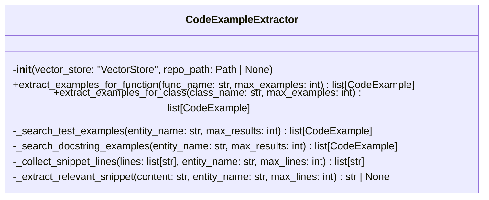

# File: `src/local_deepwiki/generators/examples/extractor.py`

## File Overview

This module provides functionality to extract code examples from a codebase for functions and classes, using semantic search and vector store lookups. It is designed to find both test cases and docstring examples, and formats them into a markdown representation for documentation or tour generation.

The main class, `CodeExampleExtractor`, integrates with a [`VectorStore`](../../core/vectorstore/store.md) to perform semantic searches for relevant code snippets. It leverages the [`parse_docstring_examples`](docstring.md) utility and `_is_mock_heavy` helper to filter and extract meaningful usage examples.

## Key Concepts

### Semantic Search for Code Examples

The module uses a [`VectorStore`](../../core/vectorstore/store.md) to perform semantic searches for code entities (functions or classes). This approach is chosen to find relevant examples even when exact matches are not present, improving the robustness of example discovery.

### Example Filtering and Deduplication

The extractor filters test examples to ensure they:
- Are actual test functions (start with `test`)
- Use the target entity in their content
- Are not mock-heavy (to avoid overly complex examples)

It also deduplicates examples based on the first 100 characters of the code snippet to avoid repetition.

### Test vs Docstring Examples

The extractor handles two types of examples:
1. **Test examples**: Found by searching for test functions that reference the entity.
2. **Docstring examples**: Parsed from docstrings using the [`parse_docstring_examples`](docstring.md) utility.

### Snippet Extraction

Relevant code snippets are extracted from test functions using `_extract_relevant_snippet` and `_collect_snippet_lines`. These methods aim to capture usage of the entity with minimal extraneous code, focusing on assertion lines to understand behavior.

## Integration

### External Usage

This file is used by the `CodeExampleExtractor` class, which is called by `test_code_examples`. This indicates that the functionality is part of a larger system for analyzing and generating documentation or tours from code examples.

### Related Files

This module integrates with:
- `local_deepwiki.generators.examples.docstring`: For parsing docstring examples.
- `local_deepwiki.generators.examples.discovery`: For identifying mock-heavy tests.
- `local_deepwiki.core.vectorstore`: For semantic search capabilities.

It is part of a larger documentation and analysis system, likely used by modules such as:
- `src/local_deepwiki/generators/analysis/api_docs.py`
- `src/local_deepwiki/generators/analysis/tours.py`
- `src/local_deepwiki/generators/crosslinks.py`

## Design Notes

### Why Semantic Search?

The use of a vector store for search is chosen to enable natural language understanding of code usage. This allows the system to find relevant examples even if they don't directly match the function or class name in a literal sense.

### Filtering Mock-heavy Tests

The `_is_mock_heavy` function is used to filter out tests that heavily rely on mocking, which are often less illustrative of real usage. This improves the quality and clarity of examples provided to users.

### Snippet Line Collection Logic

The `_collect_snippet_lines` method uses a state machine to track parentheses depth and assertion lines to ensure it captures relevant code without including too much unrelated context. This is a pragmatic approach to snippet extraction that balances comprehensiveness with conciseness.

### Markdown Formatting

The `format_code_examples_markdown` function formats the collected examples into a human-readable markdown format. It includes source attribution (test file or docstring) and language-specific code blocks, making it suitable for inclusion in documentation or tours.

### Deduplication Strategy

The deduplication is based on a truncated version of the code snippet (first 100 characters). This is a trade-off between performance and accuracy—using a full hash or more complex comparison would be more accurate but slower. The truncation is sufficient for most practical deduplication needs.

## API Reference

### class `CodeExampleExtractor`

Extract usage examples from tests and docstrings using vector search.  This class provides semantic search capabilities to find relevant test cases and docstring examples for functions and classes in a codebase.

**Methods:**


<details>
<summary>View Source (lines 25-296) | <a href="https://github.com/UrbanDiver/local-deepwiki-mcp/blob/main/src/local_deepwiki/generators/examples/extractor.py#L25-L296">GitHub</a></summary>

```python
class CodeExampleExtractor:
    # Methods: __init__, extract_examples_for_function, extract_examples_for_class, _search_test_examples, _search_docstring_examples, _collect_snippet_lines, _extract_relevant_snippet
```

</details>

#### `__init__`

```python
def __init__(vector_store: "VectorStore", repo_path: Path | None = None)
```

Initialize the extractor.


| Parameter | Type | Default | Description |
|-----------|------|---------|-------------|
| `vector_store` | `"VectorStore"` | - | VectorStore instance for semantic search. |
| `repo_path` | `Path | None` | `None` | Optional repository root path for test file discovery. |


<details>
<summary>View Source (lines 38-46) | <a href="https://github.com/UrbanDiver/local-deepwiki-mcp/blob/main/src/local_deepwiki/generators/examples/extractor.py#L38-L46">GitHub</a></summary>

```python
def __init__(self, vector_store: "VectorStore", repo_path: Path | None = None):
        """Initialize the extractor.

        Args:
            vector_store: VectorStore instance for semantic search.
            repo_path: Optional repository root path for test file discovery.
        """
        self._store = vector_store
        self._repo_path = repo_path
```

</details>

#### `extract_examples_for_function`

```python
async def extract_examples_for_function(func_name: str, max_examples: int = 3) -> list[CodeExample]
```

Find test cases and docstring examples for a function.  Searches the vector store for: 1. Test functions that call or reference the target function 2. Docstrings containing examples for the function


| Parameter | Type | Default | Description |
|-----------|------|---------|-------------|
| `func_name` | `str` | - | Name of the function to find examples for. |
| `max_examples` | `int` | `3` | Maximum number of examples to return. |


<details>
<summary>View Source (lines 48-92) | <a href="https://github.com/UrbanDiver/local-deepwiki-mcp/blob/main/src/local_deepwiki/generators/examples/extractor.py#L48-L92">GitHub</a></summary>

```python
async def extract_examples_for_function(
        self,
        func_name: str,
        max_examples: int = 3,
    ) -> list[CodeExample]:
        """Find test cases and docstring examples for a function.

        Searches the vector store for:
        1. Test functions that call or reference the target function
        2. Docstrings containing examples for the function

        Args:
            func_name: Name of the function to find examples for.
            max_examples: Maximum number of examples to return.

        Returns:
            List of CodeExample objects.
        """
        if len(func_name) <= 2:
            return []

        examples: list[CodeExample] = []

        # Search for tests that use this function
        test_examples = await self._search_test_examples(func_name, max_examples)
        examples.extend(test_examples)

        # Search for docstring examples
        docstring_examples = await self._search_docstring_examples(
            func_name, max_examples
        )
        examples.extend(docstring_examples)

        # Deduplicate and limit
        seen_codes: set[str] = set()
        unique: list[CodeExample] = []
        for ex in examples:
            code_key = ex.code.strip()[:100]  # Compare first 100 chars
            if code_key not in seen_codes:
                seen_codes.add(code_key)
                unique.append(ex)
                if len(unique) >= max_examples:
                    break

        return unique
```

</details>

#### `extract_examples_for_class`

```python
async def extract_examples_for_class(class_name: str, max_examples: int = 3) -> list[CodeExample]
```

Find test cases and docstring examples for a class.  Searches for tests that instantiate or use the class, as well as docstring examples in the class definition.


| Parameter | Type | Default | Description |
|-----------|------|---------|-------------|
| `class_name` | `str` | - | Name of the class to find examples for. |
| `max_examples` | `int` | `3` | Maximum number of examples to return. |


---


<details>
<summary>View Source (lines 94-137) | <a href="https://github.com/UrbanDiver/local-deepwiki-mcp/blob/main/src/local_deepwiki/generators/examples/extractor.py#L94-L137">GitHub</a></summary>

```python
async def extract_examples_for_class(
        self,
        class_name: str,
        max_examples: int = 3,
    ) -> list[CodeExample]:
        """Find test cases and docstring examples for a class.

        Searches for tests that instantiate or use the class, as well as
        docstring examples in the class definition.

        Args:
            class_name: Name of the class to find examples for.
            max_examples: Maximum number of examples to return.

        Returns:
            List of CodeExample objects.
        """
        if len(class_name) <= 2:
            return []

        examples: list[CodeExample] = []

        # Search for tests that use this class
        test_examples = await self._search_test_examples(class_name, max_examples)
        examples.extend(test_examples)

        # Search for class docstring examples
        docstring_examples = await self._search_docstring_examples(
            class_name, max_examples
        )
        examples.extend(docstring_examples)

        # Deduplicate and limit
        seen_codes: set[str] = set()
        unique: list[CodeExample] = []
        for ex in examples:
            code_key = ex.code.strip()[:100]
            if code_key not in seen_codes:
                seen_codes.add(code_key)
                unique.append(ex)
                if len(unique) >= max_examples:
                    break

        return unique
```

</details>

### Functions

#### `format_code_examples_markdown`

```python
def format_code_examples_markdown(examples: list[CodeExample], max_examples: int = 5) -> str
```

Format [CodeExample](docstring.md) objects as markdown.


| Parameter | Type | Default | Description |
|-----------|------|---------|-------------|
| `examples` | `list[CodeExample]` | - | List of CodeExample objects. |
| `max_examples` | `int` | `5` | Maximum examples to include. |

**Returns:** `str`


<details>
<summary>View Source (lines 299-342) | <a href="https://github.com/UrbanDiver/local-deepwiki-mcp/blob/main/src/local_deepwiki/generators/examples/extractor.py#L299-L342">GitHub</a></summary>

```python
def format_code_examples_markdown(
    examples: list[CodeExample],
    max_examples: int = 5,
) -> str:
    """Format CodeExample objects as markdown.

    Args:
        examples: List of CodeExample objects.
        max_examples: Maximum examples to include.

    Returns:
        Formatted markdown string.
    """
    if not examples:
        return ""

    examples = examples[:max_examples]

    sections = ["## Examples\n"]

    for i, example in enumerate(examples, 1):
        # Create section header
        if example.description:
            sections.append(f"### {example.description}\n")
        elif example.entity_name:
            sections.append(f"### Example {i}: `{example.entity_name}`\n")
        else:
            sections.append(f"### Example {i}\n")

        # Add source info
        if example.source == "test" and example.test_file:
            sections.append(f"*From test file: `{example.test_file}`*\n")
        elif example.source == "docstring":
            sections.append("*From docstring*\n")

        # Add code block
        lang = example.language or "python"
        sections.append(f"```{lang}\n{example.code}\n```\n")

        # Add expected output if available
        if example.expected_output:
            sections.append(f"Output:\n```\n{example.expected_output}\n```\n")

    return "\n".join(sections)
```

</details>

## Class Diagram



## Call Graph

```mermaid
flowchart TD
    N0[CodeExample]
    N1[CodeExampleExtractor._extra...]
    N2[CodeExampleExtractor._searc...]
    N3[CodeExampleExtractor._searc...]
    N4[CodeExampleExtractor.extrac...]
    N5[CodeExampleExtractor.extrac...]
    N6[_collect_snippet_lines]
    N7[_extract_relevant_snippet]
    N8[_is_mock_heavy]
    N9[_search_docstring_examples]
    N10[_search_test_examples]
    N11[add]
    N12[dedent]
    N13[parse_docstring_examples]
    N14[search]
    N5 --> N10
    N5 --> N9
    N5 --> N11
    N4 --> N10
    N4 --> N9
    N4 --> N11
    N3 --> N14
    N3 --> N8
    N3 --> N7
    N3 --> N0
    N2 --> N14
    N2 --> N13
    N1 --> N6
    N1 --> N12
    classDef func fill:#e1f5fe
    class N0,N6,N7,N8,N9,N10,N11,N12,N13,N14 func
    classDef method fill:#fff3e0
    class N1,N2,N3,N4,N5 method
```



## Used By

Functions and methods in this file and their callers:

- **[`CodeExample`](docstring.md)**: called by `CodeExampleExtractor._search_test_examples`
- **`_collect_snippet_lines`**: called by `CodeExampleExtractor._extract_relevant_snippet`
- **`_extract_relevant_snippet`**: called by `CodeExampleExtractor._search_test_examples`
- **`_is_mock_heavy`**: called by `CodeExampleExtractor._search_test_examples`
- **`_search_docstring_examples`**: called by `CodeExampleExtractor.extract_examples_for_class`, `CodeExampleExtractor.extract_examples_for_function`
- **`_search_test_examples`**: called by `CodeExampleExtractor.extract_examples_for_class`, `CodeExampleExtractor.extract_examples_for_function`
- **`add`**: called by `CodeExampleExtractor.extract_examples_for_class`, `CodeExampleExtractor.extract_examples_for_function`
- **`dedent`**: called by `CodeExampleExtractor._extract_relevant_snippet`
- **[`parse_docstring_examples`](docstring.md)**: called by `CodeExampleExtractor._search_docstring_examples`
- **`search`**: called by `CodeExampleExtractor._search_docstring_examples`, `CodeExampleExtractor._search_test_examples`

## Last Modified

| Entity | Type | Author | Date | Commit |
|--------|------|--------|------|--------|
| `CodeExampleExtractor` | class | Brian Breidenbach | 2 days ago | `8b8f36f` refactor: decompose CC > 15... |
| `_collect_snippet_lines` | method | Brian Breidenbach | 2 days ago | `8b8f36f` refactor: decompose CC > 15... |
| `_extract_relevant_snippet` | method | Brian Breidenbach | 2 days ago | `8b8f36f` refactor: decompose CC > 15... |
| `_search_docstring_examples` | method | Brian Breidenbach | Feb 21, 2026 | `e45a53a` refactor: apply Pythonic id... |
| `__init__` | method | Brian Breidenbach | Feb 21, 2026 | `aad50cb` refactor: split 9 files (80... |
| `extract_examples_for_function` | method | Brian Breidenbach | Feb 21, 2026 | `aad50cb` refactor: split 9 files (80... |
| `extract_examples_for_class` | method | Brian Breidenbach | Feb 21, 2026 | `aad50cb` refactor: split 9 files (80... |
| `_search_test_examples` | method | Brian Breidenbach | Feb 21, 2026 | `aad50cb` refactor: split 9 files (80... |
| `format_code_examples_markdown` | function | Brian Breidenbach | Feb 21, 2026 | `aad50cb` refactor: split 9 files (80... |

## Additional Source Code

Source code for functions and methods not listed in the API Reference above.

#### `_search_test_examples`

<details>
<summary>View Source (lines 139-195) | <a href="https://github.com/UrbanDiver/local-deepwiki-mcp/blob/main/src/local_deepwiki/generators/examples/extractor.py#L139-L195">GitHub</a></summary>

```python
async def _search_test_examples(
        self,
        entity_name: str,
        max_results: int = 5,
    ) -> list[CodeExample]:
        """Search for test functions that use the given entity.

        Args:
            entity_name: Name of the function/class to search for.
            max_results: Maximum search results.

        Returns:
            List of CodeExample objects from test files.
        """
        examples: list[CodeExample] = []

        # Search for test functions mentioning this entity
        query = f"test {entity_name}"
        results = await self._store.search(
            query=query,
            limit=max_results * 2,  # Get extra to filter
            chunk_type="function",
        )

        for result in results:
            chunk = result.chunk

            # Only consider test functions
            if not chunk.name or not chunk.name.startswith("test"):
                continue

            # Check if entity is actually used in the code
            if entity_name not in chunk.content:
                continue

            # Skip mock-heavy tests
            if _is_mock_heavy(chunk.content):
                continue

            # Extract relevant snippet
            snippet = self._extract_relevant_snippet(chunk.content, entity_name)
            if snippet and len(snippet) >= 10:
                examples.append(
                    CodeExample(
                        source="test",
                        code=snippet,
                        description=chunk.docstring,
                        test_file=chunk.file_path,
                        language=chunk.language.value if chunk.language else "python",
                        entity_name=entity_name,
                    )
                )

            if len(examples) >= max_results:
                break

        return examples
```

</details>


#### `_search_docstring_examples`

<details>
<summary>View Source (lines 197-237) | <a href="https://github.com/UrbanDiver/local-deepwiki-mcp/blob/main/src/local_deepwiki/generators/examples/extractor.py#L197-L237">GitHub</a></summary>

```python
async def _search_docstring_examples(
        self,
        entity_name: str,
        max_results: int = 3,
    ) -> list[CodeExample]:
        """Search for docstring examples for the given entity.

        Args:
            entity_name: Name of the function/class to search for.
            max_results: Maximum results.

        Returns:
            List of CodeExample objects from docstrings.
        """
        examples: list[CodeExample] = []

        # Search for the entity's definition
        results = await self._store.search(
            query=entity_name,
            limit=5,
        )

        for result in results:
            chunk = result.chunk

            # Look for the exact entity
            if chunk.name != entity_name:
                continue

            # Parse docstring examples
            if chunk.docstring:
                docstring_examples = parse_docstring_examples(chunk.docstring)
                for doc_ex in docstring_examples[:max_results]:
                    examples.append(
                        dataclasses.replace(doc_ex, entity_name=entity_name)
                    )

            if len(examples) >= max_results:
                break

        return examples
```

</details>


#### `_collect_snippet_lines`

<details>
<summary>View Source (lines 239-267) | <a href="https://github.com/UrbanDiver/local-deepwiki-mcp/blob/main/src/local_deepwiki/generators/examples/extractor.py#L239-L267">GitHub</a></summary>

```python
def _collect_snippet_lines(
        self,
        lines: list[str],
        entity_name: str,
        max_lines: int,
    ) -> list[str]:
        """Collect the lines that demonstrate entity usage from *lines*."""
        relevant: list[str] = []
        capturing = False
        paren_depth = 0
        assertions_found = 0

        for line in lines:
            stripped = line.strip()
            if stripped.startswith(('"""', "'''")):
                continue
            paren_depth += line.count("(") - line.count(")")
            if entity_name in line and not capturing:
                capturing = True
            if capturing:
                relevant.append(line)
                if stripped.startswith("assert") and paren_depth <= 0:
                    assertions_found += 1
                    if assertions_found >= 2:
                        break
                if len(relevant) >= max_lines:
                    break

        return relevant
```

</details>


#### `_extract_relevant_snippet`

<details>
<summary>View Source (lines 269-296) | <a href="https://github.com/UrbanDiver/local-deepwiki-mcp/blob/main/src/local_deepwiki/generators/examples/extractor.py#L269-L296">GitHub</a></summary>

```python
def _extract_relevant_snippet(
        self,
        content: str,
        entity_name: str,
        max_lines: int = 20,
    ) -> str | None:
        """Extract the most relevant code snippet from test content.

        Args:
            content: Full test function content.
            entity_name: Entity to find usage of.
            max_lines: Maximum lines to include.

        Returns:
            Extracted snippet or None.
        """
        lines = content.split("\n")
        relevant = self._collect_snippet_lines(lines, entity_name, max_lines)

        if not relevant:
            return None

        try:
            result = dedent("\n".join(relevant)).strip()
        except (TypeError, ValueError):
            result = "\n".join(relevant).strip()

        return result if len(result) >= 10 else None
```

</details>

## Relevant Source Files

- `src/local_deepwiki/generators/examples/extractor.py:25-296`
