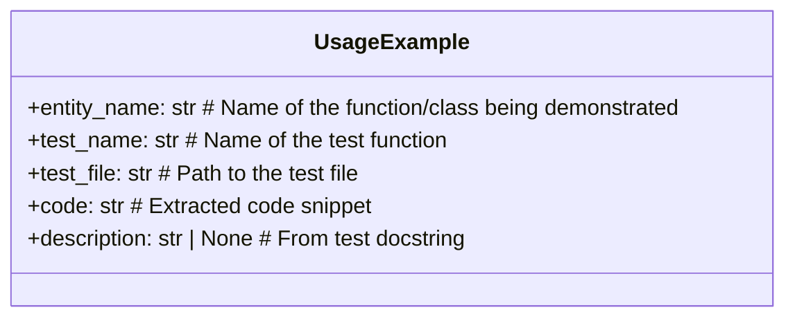
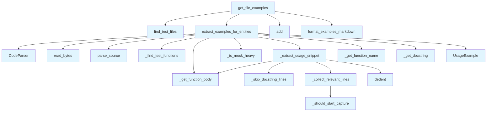

# File: `src/local_deepwiki/generators/examples/orchestrator.py`

## File Overview

This module is responsible for extracting usage examples from test files to support documentation generation. It scans Python test files for functions that demonstrate the usage of specific entities (e.g., functions or classes) and formats this information into markdown for inclusion in wiki documentation.

The module is part of a larger system for automatically generating documentation from source code and tests. It specifically handles the **test-based example extraction**, complementing other modules such as docstring-based examples and vector-search-based extraction.

## Key Concepts

### Test File Scanning and AST Parsing
The core of the module's functionality relies on parsing Python code using the [`CodeParser`](../../core/parser/code_parser.md) and `tree-sitter` to navigate the Abstract Syntax Tree (AST) of test files. This allows precise identification of test functions and their bodies, enabling extraction of relevant code snippets.

### Example Extraction Logic
The extraction process is nuanced:
- It identifies test functions that reference a given entity.
- It skips tests that are "mock-heavy", which are often less illustrative of real usage.
- It attempts to extract only the relevant lines that demonstrate usage of the entity, including setup, call, and assertions.
- It uses heuristics like `dedent()` to clean up extracted code and avoid excessive indentation.

### Deduplication and Formatting
Once examples are collected, they are deduplicated based on both the entity name and the code snippet to prevent redundant entries. The final formatted output is a markdown string that includes:
- A section title (from the docstring or entity name)
- The source file and test function name
- The code snippet in a fenced code block

This design ensures that documentation includes only meaningful, non-redundant usage examples.

## Integration

This module is used by the main documentation generation pipeline, particularly in the context of wiki generation. It is imported and called by:
- `get_file_examples`, which is used by `__init__.py` and `files.py` in the CLI
- `extract_examples_for_entities` and `format_examples_markdown`, which are used by `test_test_examples`

It integrates with:
- [`CodeParser`](../../core/parser/code_parser.md) from `local_deepwiki.core.parser` for AST parsing
- [`find_test_files`](discovery.md) from `local_deepwiki.generators.examples.discovery` to locate relevant test files
- `local_deepwiki.logging` for logging debug and info messages
- [`local_deepwiki.models.Language`](../../models/foundation.md) for language-specific parsing

It is part of a triad of example extraction modules:
1. `docstring_examples` — extracts from docstrings
2. `example_extractor` — uses vector search
3. `test_examples` (this file) — extracts from test files

## Design Notes

### Why AST-based Parsing?
The module uses AST parsing (`tree-sitter` and [`CodeParser`](../../core/parser/code_parser.md)) rather than regex or string matching to accurately identify test functions and extract their bodies. This is crucial for correctly parsing nested code structures and avoiding false matches.

### Handling Docstrings
The module skips leading docstrings in functions before attempting to extract code snippets. This prevents the inclusion of documentation-only content in the usage examples.

### Mock-heavy Test Filtering
Tests that are "mock-heavy" (i.e., use many mocks) are skipped to ensure that only representative, real-world usage examples are included. This improves the quality and relevance of the documentation.

### Indentation Cleanup
The use of `textwrap.dedent` ensures that extracted code snippets are clean and readable in documentation, without unnecessary leading whitespace.

### Example Limiting and Deduplication
To avoid overwhelming documentation with too many examples, the module:
- Limits the number of examples per entity (`max_examples_per_entity`)
- Limits the total number of examples (`max_examples`)
- Deduplicates examples based on `(entity_name, code)` to prevent redundancy

This approach ensures a balance between comprehensiveness and clarity in the generated documentation.

## API Reference

### class `UsageExample`

A usage example extracted from a test file.

---


<details>
<summary>View Source (lines 47-54) | <a href="https://github.com/UrbanDiver/local-deepwiki-mcp/blob/main/src/local_deepwiki/generators/examples/orchestrator.py#L47-L54">GitHub</a></summary>

```python
class UsageExample:
    """A usage example extracted from a test file."""

    entity_name: str  # Name of the function/class being demonstrated
    test_name: str  # Name of the test function
    test_file: str  # Path to the test file
    code: str  # Extracted code snippet
    description: str | None  # From test docstring
```

</details>

### Functions

#### `extract_examples_for_entities`

```python
def extract_examples_for_entities(test_file: Path, entity_names: list[str], max_examples_per_entity: int = 2) -> list[UsageExample]
```

Extract usage examples from a test file for given entities.


| Parameter | Type | Default | Description |
|-----------|------|---------|-------------|
| `test_file` | `Path` | - | Path to the test file. |
| `entity_names` | `list[str]` | - | Names of functions/classes to find examples for. |
| `max_examples_per_entity` | `int` | `2` | Maximum examples per entity. |

**Returns:** `list[UsageExample]`


<details>
<summary>View Source (lines 194-262) | <a href="https://github.com/UrbanDiver/local-deepwiki-mcp/blob/main/src/local_deepwiki/generators/examples/orchestrator.py#L194-L262">GitHub</a></summary>

```python
def extract_examples_for_entities(
    test_file: Path,
    entity_names: list[str],
    max_examples_per_entity: int = 2,
) -> list[UsageExample]:
    """Extract usage examples from a test file for given entities.

    Args:
        test_file: Path to the test file.
        entity_names: Names of functions/classes to find examples for.
        max_examples_per_entity: Maximum examples per entity.

    Returns:
        List of UsageExample objects.
    """
    parser = CodeParser()

    try:
        source = test_file.read_bytes()
    except OSError as e:
        logger.debug("Failed to read test file %s: %s", test_file, e)
        return []

    root = parser.parse_source(source, Language.PYTHON)

    test_functions = _find_test_functions(root)
    examples: list[UsageExample] = []
    entity_counts: dict[str, int] = {}

    for func_node, class_name in test_functions:
        body = _get_function_body(func_node, source)

        # Skip mock-heavy tests
        if _is_mock_heavy(body):
            continue

        for entity_name in entity_names:
            # Check if we've hit the limit for this entity
            if entity_counts.get(entity_name, 0) >= max_examples_per_entity:
                continue

            # Check if entity is used in this test
            if entity_name not in body:
                continue

            # Extract the usage snippet
            snippet = _extract_usage_snippet(func_node, source, entity_name)
            if not snippet or len(snippet) < 10:
                continue

            test_name = _get_function_name(func_node, source)
            docstring = _get_docstring(func_node, source)

            # Format test name with class if from a test class
            full_test_name = f"{class_name}::{test_name}" if class_name else test_name

            examples.append(
                UsageExample(
                    entity_name=entity_name,
                    test_name=full_test_name,
                    test_file=str(test_file.name),
                    code=snippet,
                    description=docstring,
                )
            )

            entity_counts[entity_name] = entity_counts.get(entity_name, 0) + 1

    return examples
```

</details>

#### `format_examples_markdown`

```python
def format_examples_markdown(examples: list[UsageExample], max_examples: int = 5) -> str
```

Format usage examples as markdown.


| Parameter | Type | Default | Description |
|-----------|------|---------|-------------|
| `examples` | `list[UsageExample]` | - | List of UsageExample objects. |
| `max_examples` | `int` | `5` | Maximum examples to include. |

**Returns:** `str`


<details>
<summary>View Source (lines 265-299) | <a href="https://github.com/UrbanDiver/local-deepwiki-mcp/blob/main/src/local_deepwiki/generators/examples/orchestrator.py#L265-L299">GitHub</a></summary>

```python
def format_examples_markdown(
    examples: list[UsageExample],
    max_examples: int = 5,
) -> str:
    """Format usage examples as markdown.

    Args:
        examples: List of UsageExample objects.
        max_examples: Maximum examples to include.

    Returns:
        Formatted markdown string.
    """
    if not examples:
        return ""

    # Limit total examples
    examples = examples[:max_examples]

    sections = ["## Usage Examples\n"]
    sections.append("*Examples extracted from test files*\n")

    for example in examples:
        # Use docstring as title if available, otherwise use entity name
        if example.description:
            # Clean up docstring for use as title
            title = example.description.split("\n")[0].strip(".")
            sections.append(f"### {title}\n")
        else:
            sections.append(f"### Example: `{example.entity_name}`\n")

        sections.append(f"From `{example.test_file}::{example.test_name}`:\n")
        sections.append(f"```python\n{example.code}\n```\n")

    return "\n".join(sections)
```

</details>

#### `get_file_examples`

```python
def get_file_examples(source_file: Path, repo_root: Path, entity_names: list[str], max_examples: int = 5) -> str | None
```

Get formatted usage examples for a source file.  This is the main entry point for the wiki generator. Searches all matching test files for usage examples.


| Parameter | Type | Default | Description |
|-----------|------|---------|-------------|
| `source_file` | `Path` | - | Path to the source file being documented. |
| `repo_root` | `Path` | - | Root directory of the repository. |
| `entity_names` | `list[str]` | - | Names of functions/classes in the source file. |
| `max_examples` | `int` | `5` | Maximum examples to include. |

**Returns:** `str | None`


<details>
<summary>View Source (lines 302-365) | <a href="https://github.com/UrbanDiver/local-deepwiki-mcp/blob/main/src/local_deepwiki/generators/examples/orchestrator.py#L302-L365">GitHub</a></summary>

```python
def get_file_examples(
    source_file: Path,
    repo_root: Path,
    entity_names: list[str],
    max_examples: int = 5,
) -> str | None:
    """Get formatted usage examples for a source file.

    This is the main entry point for the wiki generator.
    Searches all matching test files for usage examples.

    Args:
        source_file: Path to the source file being documented.
        repo_root: Root directory of the repository.
        entity_names: Names of functions/classes in the source file.
        max_examples: Maximum examples to include.

    Returns:
        Formatted markdown string with examples, or None if no examples found.
    """
    # Only support Python for now
    if not source_file.suffix == ".py":
        return None

    # Find all corresponding test files
    test_files = find_test_files(source_file, repo_root)
    if not test_files:
        logger.debug("No test files found for %s", source_file)
        return None

    # Filter to meaningful entity names (skip short ones)
    entity_names = [name for name in entity_names if name and len(name) > 2]
    if not entity_names:
        return None

    # Extract examples from all test files
    all_examples: list[UsageExample] = []
    for test_file in test_files:
        examples = extract_examples_for_entities(
            test_file=test_file,
            entity_names=entity_names,
            max_examples_per_entity=2,
        )
        all_examples.extend(examples)

    if not all_examples:
        logger.debug("No examples found in %s test file(s)", len(test_files))
        return None

    # Deduplicate by entity_name + code (same example from different sources)
    seen: set[tuple[str, str]] = set()
    unique_examples: list[UsageExample] = []
    for ex in all_examples:
        key = (ex.entity_name, ex.code)
        if key not in seen:
            seen.add(key)
            unique_examples.append(ex)

    test_names = [tf.name for tf in test_files]
    logger.info(
        "Found %d usage examples from %s", len(unique_examples), ", ".join(test_names)
    )

    return format_examples_markdown(unique_examples, max_examples=max_examples)
```

</details>

## Class Diagram



## Call Graph



## Used By

Functions and methods in this file and their callers:

- **[`CodeParser`](../../core/parser/code_parser.md)**: called by `extract_examples_for_entities`
- **`UsageExample`**: called by `extract_examples_for_entities`
- **`_collect_relevant_lines`**: called by `_extract_usage_snippet`
- **`_extract_usage_snippet`**: called by `extract_examples_for_entities`
- **`_find_test_functions`**: called by `extract_examples_for_entities`
- **`_get_docstring`**: called by `extract_examples_for_entities`
- **`_get_function_body`**: called by `_extract_usage_snippet`, `extract_examples_for_entities`
- **`_get_function_name`**: called by `extract_examples_for_entities`
- **`_is_mock_heavy`**: called by `extract_examples_for_entities`
- **`_should_start_capture`**: called by `_collect_relevant_lines`
- **`_skip_docstring_lines`**: called by `_extract_usage_snippet`
- **`add`**: called by `get_file_examples`
- **`dedent`**: called by `_extract_usage_snippet`
- **`extract_examples_for_entities`**: called by `get_file_examples`
- **[`find_test_files`](discovery.md)**: called by `get_file_examples`
- **`format_examples_markdown`**: called by `get_file_examples`
- **`parse_source`**: called by `extract_examples_for_entities`
- **`read_bytes`**: called by `extract_examples_for_entities`

## Last Modified

| Entity | Type | Author | Date | Commit |
|--------|------|--------|------|--------|
| `_should_start_capture` | function | Brian Breidenbach | 2 days ago | `8b8f36f` refactor: decompose CC > 15... |
| `_collect_relevant_lines` | function | Brian Breidenbach | 2 days ago | `8b8f36f` refactor: decompose CC > 15... |
| `_skip_docstring_lines` | function | Brian Breidenbach | 1 week ago | `ed42442` refactor: split 10+ long me... |
| `_extract_usage_snippet` | function | Brian Breidenbach | 1 week ago | `ed42442` refactor: split 10+ long me... |
| `extract_examples_for_entities` | function | Brian Breidenbach | Feb 21, 2026 | `e45a53a` refactor: apply Pythonic id... |
| `get_file_examples` | function | Brian Breidenbach | Feb 20, 2026 | `b807417` refactor: high-priority Pyt... |
| `UsageExample` | class | Brian Breidenbach | Jan 14, 2026 | `e579b0a` Add usage examples from tes... |
| `format_examples_markdown` | function | Brian Breidenbach | Jan 14, 2026 | `e579b0a` Add usage examples from tes... |

## Additional Source Code

Source code for functions and methods not listed in the API Reference above.

#### `_skip_docstring_lines`

<details>
<summary>View Source (lines 57-84) | <a href="https://github.com/UrbanDiver/local-deepwiki-mcp/blob/main/src/local_deepwiki/generators/examples/orchestrator.py#L57-L84">GitHub</a></summary>

```python
def _skip_docstring_lines(lines: list[str]) -> int:
    """Return the index of the first non-docstring line in *lines*.

    Scans from the top and skips over any leading docstring block.

    Args:
        lines: Lines of a function body.

    Returns:
        Index of the first code line after any docstring.
    """
    in_docstring = False
    for i, line in enumerate(lines):
        stripped = line.strip()
        if not stripped:
            continue
        if stripped.startswith(('"""', "'''")):
            if in_docstring:
                in_docstring = False
                continue
            if stripped.count('"""') >= 2 or stripped.count("'''") >= 2:
                continue
            in_docstring = True
            continue
        if in_docstring:
            continue
        return i
    return 0
```

</details>


#### `_should_start_capture`

<details>
<summary>View Source (lines 87-97) | <a href="https://github.com/UrbanDiver/local-deepwiki-mcp/blob/main/src/local_deepwiki/generators/examples/orchestrator.py#L87-L97">GitHub</a></summary>

```python
def _should_start_capture(
    line: str, entity_name: str, capturing: bool
) -> tuple[bool, bool]:
    """Return (new_capturing, dedent_block) after checking if capture should start."""
    dedent_block = False
    if "dedent(" in line or 'dedent("""' in line:
        dedent_block = True
        capturing = True
    if entity_name in line and not capturing:
        capturing = True
    return capturing, dedent_block
```

</details>


#### `_collect_relevant_lines`

<details>
<summary>View Source (lines 100-145) | <a href="https://github.com/UrbanDiver/local-deepwiki-mcp/blob/main/src/local_deepwiki/generators/examples/orchestrator.py#L100-L145">GitHub</a></summary>

```python
def _collect_relevant_lines(
    lines: list[str],
    entity_name: str,
    max_lines: int,
) -> list[str]:
    """Collect lines from *lines* that demonstrate usage of *entity_name*.

    Starts capturing at the first occurrence of the entity name (or at a
    ``dedent(`` block) and stops after two assertions or *max_lines* lines.

    Args:
        lines: Code lines with docstring already skipped.
        entity_name: Name of the entity to capture usage of.
        max_lines: Maximum number of lines to include.

    Returns:
        Relevant lines or empty list if none found.
    """
    relevant_lines: list[str] = []
    capturing = False
    dedent_block = False
    paren_depth = 0
    assertions_found = 0

    for line in lines:
        stripped = line.strip()
        paren_depth += line.count("(") - line.count(")")

        capturing, new_dedent = _should_start_capture(line, entity_name, capturing)
        dedent_block = dedent_block or new_dedent

        if capturing:
            relevant_lines.append(line)

            if stripped.startswith("assert") and paren_depth <= 0:
                assertions_found += 1
                if assertions_found >= 2:
                    break

            if len(relevant_lines) >= max_lines:
                break

        if dedent_block and '"""' in line and len(relevant_lines) > 1:
            dedent_block = False

    return relevant_lines
```

</details>


#### `_extract_usage_snippet`

<details>
<summary>View Source (lines 148-191) | <a href="https://github.com/UrbanDiver/local-deepwiki-mcp/blob/main/src/local_deepwiki/generators/examples/orchestrator.py#L148-L191">GitHub</a></summary>

```python
def _extract_usage_snippet(
    func_node: Node,
    source: bytes,
    entity_name: str,
    max_lines: int = 25,
) -> str | None:
    """Extract a clean usage snippet from a test function.

    Looks for code that demonstrates usage of the entity,
    including setup, the call, and assertions.

    Args:
        func_node: The function AST node.
        source: Source code bytes.
        entity_name: Name of the entity to find usage of.
        max_lines: Maximum lines to include.

    Returns:
        Extracted code snippet or None if not suitable.
    """
    body = _get_function_body(func_node, source)
    lines = body.split("\n")

    start_idx = _skip_docstring_lines(lines)
    lines = lines[start_idx:]

    relevant_lines = _collect_relevant_lines(lines, entity_name, max_lines)

    if not relevant_lines:
        return None

    # For short tests, include the full body (more useful)
    if len(relevant_lines) < 5 and len(lines) <= max_lines:
        result = "\n".join(lines)
    else:
        result = "\n".join(relevant_lines)

    # Clean up indentation
    try:
        result = dedent(result)
    except TypeError:
        logger.debug("Failed to dedent extracted usage snippet", exc_info=True)

    return result.strip()
```

</details>

## Relevant Source Files

- `src/local_deepwiki/generators/examples/orchestrator.py:47-54`
